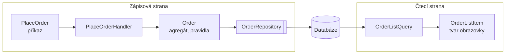

# CQRS (Oddělení zápisu od čtení)

> [← zpět na Architecture](../)

> **V jedné větě:** Zápis a čtení dostanou vlastní model — zápis hlídá pravidla, čtení vrací přesně tvar obrazovky, a ani jeden nemusí dělat kompromis kvůli tomu druhému.

> [!NOTE]
> **CQRS není Event Sourcing a nepotřebuje dvě databáze.** Tyhle dva omyly stojí za většinou špatných nasazení. Přeskoč rovnou na [Škálu, na které si vyber](#škála-na-které-si-vyber) — většina týmů potřebuje stupeň 3 z pěti a nikdy nepotká eventuální konzistenci.

---

## Problém

Jeden model obsluhuje zápis i čtení. Jenže zápis a čtení chtějí pravý opak, takže model nevyhovuje ani jednomu.

**Poznáš to podle:**

- [repository](../../PoEAA/Repository/) narostlo o metody typu `findAllWithCustomerAndItemsForAdminList()`
- výpis dvaceti řádků v administraci vyrobí stovky dotazů — nebo jeden `JOIN` přes šest tabulek s `DISTINCT`
- načteš 500 agregátů, spočítáš z nich součet a **99 % načtených dat zahodíš**
- přidání sloupce do tabulky v administraci znamená zásah do **doménového modelu**
- entita má getter, který v doméně nikdo nepoužívá — je tam jen pro šablonu
- čtení tvoří 95 % provozu, ale škáluje se společně se zápisem, protože je to jeden model

```php
// Před: agregát se ohýbá kvůli obrazovce
final class Order
{
    // …doménová pravidla…

    // A tohle je tu jen kvůli výpisu v administraci:
    public function getCustomerFullNameForList(): string { /* … */ }
    public function getFormattedTotalWithVat(): string { /* … */ }
    public function getItemCountLabel(): string { /* … */ }
}

// …a use-case, který kvůli tabulce načte celý svět
$orders = $this->orders->findAll();          // 500 agregátů
usort($orders, /* … */);                     // řazení v PHP
$page = array_slice($orders, 0, 20);         // 480 z nich zahodíme
```

Agregát je navržený, aby uhlídal pravidla — je **hluboký a úzký**. Řádek tabulky potřebuje být **plochý a široký** a poskládaný ze čtyř různých agregátů. Jeden objekt nemůže být obojí; když se o to pokusí, dopadne to jako výše.

---

## Řešení

Rozděl cestu k datům na dvě. **Ne databázi — cestu.**



| | **Zápisová strana** | **Čtecí strana** |
| --- | --- | --- |
| Vstup | Příkaz (`PlaceOrder`) | Dotaz (`OrderListQuery`) |
| Model | Agregát s pravidly | DTO — tvar obrazovky |
| Přístup k datům | Repository | **Rovnou SQL** |
| Vrací | Nic, nanejvýš identitu | Data k zobrazení |
| Optimalizuje se na | Konzistenci | Rychlost čtení |
| Mění stav | Ano | **Nikdy** |

### Proč smí čtení obejít doménu

Tohle je otázka, která juniory (právem) znervózňuje: *„Nebylo celé DDD o tom, že se na databázi nesahá napřímo?“*

Odpověď je jednoduchá a stojí na jediné větě: **čtení nic nemění, takže nemá co porušit.** Pravidla, která hlídá `Order`, existují proto, aby se agregát nedostal do neplatného stavu. Dotaz stav nemění — nemůže tedy porušit žádný invariant, i kdyby chtěl.

Z toho plyne, že se čtecí strana smí optimalizovat úplně volně: vlastní SQL, vlastní indexy, `JOIN` přes hranice agregátů, denormalizace. Nic z toho doménu neohrožuje, protože se jí to ani nedotkne.

### Kolik to reálně dělá

Demo založí 500 objednávek a pak vypíše dvacet nejnovějších — dvěma cestami:

```
                          dotazů       čas   načteno
    přes agregáty            1001     5.1 ms        500
    přes čtecí model            1     0.4 ms         20
```

Obě cesty vrátí **tytéž dvacet řádků**. Jedna kvůli tomu načte 500 objednávek se všemi položkami a 1001× se zeptá databáze, druhá se zeptá jednou. A na pěti stech řádcích je to ještě legrace.

Stránkování a souhrny jsou pak zadarmo — `LIMIT`, `OFFSET` a `SUM()` dělá databáze:

```
druhá stránka:  20 řádků, 1 dotaz
obrat celkem:   10 068 405 Kč, 1 dotaz
```

Přes agregáty by obojí znamenalo načíst do paměti všechno.

### Příkaz se jmenuje slovesem

Drobnost s velkým dopadem na to, jak model dopadne. Příkaz je **`PlaceOrder`**, ne `OrderData`; **`CancelOrder`**, ne `OrderUpdate`. Donutí tě to pojmenovat, co se má stát, místo abys posílal beztvarý balík polí a nechal handler hádat.

A příkaz **nevrací data k zobrazení** — nanejvýš identitu vytvořeného agregátu. Jakmile začne vracet i to, co se má vykreslit, stává se ze zápisové strany zase i čtení a rozdělení ztrácí smysl.

---

## Škála, na které si vyber

Stejně jako u [Rules Engine](../RulesEngine/) platí, že „CQRS“ označuje pět různě drahých věcí. **Většina týmů potřebuje stupeň 3** a myslí si, že mluví o stupni 5.

| # | Stupeň | Co to znamená | Cena | Kdy to stačí |
| - | ------ | ------------- | ---- | ------------ |
| 1 | **CQS na metodách** | Meyerův princip: metoda buď mění, nebo vrací — nikdy obojí | žádná | Vždycky. Tohle dělej bez ohledu na zbytek. |
| 2 | **Oddělené služby** | `CommandHandler` a `QueryService` nad týmž modelem | malá | Chceš pořádek v aplikační vrstvě |
| 3 | **Vlastní čtecí modely** | Dotazy obcházejí doménu, vracejí DTO, sahají na SQL | střední | **Tady je většinou správná odpověď** |
| 4 | **Oddělené čtecí úložiště** | Denormalizované tabulky nebo pohledy, plněné projekcemi | vysoká | Čtení je řádově náročnější než zápis |
| 5 | **Oddělená databáze + Event Sourcing** | Zápis jako proud událostí, čtení z projekcí | velmi vysoká | Potřebuješ historii, audit a nezávislé škálování |

**Hranice mezi 3 a 4 je eventuální konzistence** — a to je ta drahá. Od stupně 4 výš platí, že uživatel může uložit objednávku a hned ji ve výpisu nevidět. Každá obrazovka to od té chvíle musí umět ošetřit a každý tester to nahlásí jako chybu.

Stupeň 3 tenhle problém **nemá**: obě strany čtou tutéž databázi ve stejné transakci. Získáš rychlost i čistotu modelu a nezaplatíš nic z toho, kvůli čemu má CQRS pověst složité věci. Demo v téhle složce je přesně stupeň 3.

### Dva omyly, které stojí za většinou škod

**„CQRS znamená Event Sourcing.“** Neznamená. Jsou to nezávislé věci, které se často zmiňují spolu, protože ES bez CQRS nedává moc smysl — ale CQRS bez ES dává smysl výborně a je to ta obvyklá volba. Sám Greg Young na tuhle záměnu opakovaně upozorňoval.

**„CQRS je architektura celé aplikace.“** Není. Je to vzor pro **jeden bounded context**, obvykle ten jeden nebo dva, kde je čtení opravdu jiné než zápis. Zavést ho plošně znamená zaplatit dvojí model i tam, kde je entita se čtyřmi sloupci.

---

## Účastníci

| Role | V příkladu | Odpovědnost |
| ---- | ---------- | ----------- |
| **Příkaz** | `PlaceOrder` | Popisuje záměr; jméno je sloveso |
| **Handler příkazu** | `PlaceOrderHandler` | Provede scénář; vrací nanejvýš identitu |
| **Zápisový model** | `Order`, `OrderItem` | Hlídá pravidla; hluboký a úzký |
| **Repository** | `OrderRepository` | Načtení agregátu kvůli změně — **ne kvůli výpisu** |
| **Dotaz** | `OrderListQuery` | Čte přímo; doménu obchází |
| **Čtecí model** | `OrderListItem` | Tvar obrazovky; plochý a široký, bez chování |

---

## Implementace v PHP

Zápisová strana vypadá přesně tak, jak jsi zvyklý:

```php
final readonly class PlaceOrderHandler
{
    public function __construct(
        private OrderRepository $orders,
    ) {
    }

    public function handle(PlaceOrder $command, DateTimeImmutable $now): string
    {
        $order = Order::place(
            $this->orders->nextIdentity(),
            $command->customerEmail,
            $command->items,
            $now,
        );

        $this->orders->save($order);

        return $order->id;   // jen identita, nic k zobrazení
    }
}
```

Repository zápisové strany je nápadné hlavně tím, co v něm **není** — žádný výpis, žádné stránkování, žádné řazení:

```php
interface OrderRepository
{
    public function nextIdentity(): string;

    public function save(Order $order): void;

    public function get(string $id): Order;
}
```

Čtecí strana doménu obchází úplně:

```php
final readonly class OrderListQuery
{
    public function __construct(
        private PDO $connection,
    ) {
    }

    /** @return list<OrderListItem> */
    public function recent(int $limit, int $offset = 0): array
    {
        $statement = $this->connection->prepare(
            'SELECT
                 o.id,
                 o.customer_email,
                 o.status,
                 o.placed_at,
                 COUNT(i.id)                                        AS item_count,
                 COALESCE(SUM(i.unit_price_cents * i.quantity), 0)  AS total_cents
             FROM orders o
             LEFT JOIN order_items i ON i.order_id = o.id
             GROUP BY o.id
             ORDER BY o.placed_at DESC
             LIMIT :limit OFFSET :offset',
        );

        $statement->bindValue('limit', $limit, PDO::PARAM_INT);
        $statement->bindValue('offset', $offset, PDO::PARAM_INT);
        $statement->execute();

        return array_map(
            static fn (array $row): OrderListItem => new OrderListItem(/* … */),
            $statement->fetchAll(PDO::FETCH_ASSOC),
        );
    }
}
```

A čtecí model je **tvar obrazovky**, ne entita:

```php
final readonly class OrderListItem
{
    public function __construct(
        public string $id,
        public string $customerEmail,
        public string $status,
        public string $placedAt,
        public int $itemCount,        // spočítané v SQL
        public int $totalInCents,     // spočítané v SQL
    ) {
    }
}
```

Nemá identitu v doménovém smyslu, nemá chování a nehlídá žádná pravidla. Kdyby je měl, byla by to entita a byl bys zpátky na začátku.

### Kam to dát ve složkách

Rozdělení musí být vidět, jinak se za půl roku smaže:

```
src/Order/
    Command/
        PlaceOrder.php
        PlaceOrderHandler.php
    Domain/
        Order.php
        OrderRepository.php          ← rozhraní
    Query/
        OrderListQuery.php           ← smí sáhnout na SQL
        OrderListItem.php
    Infrastructure/
        SqliteOrderRepository.php
```

Pravidlo, které z toho plyne: **`Query/` nesmí importovat nic z `Domain/`.** Kdyby čtecí strana používala agregáty, nezískala bys nic. Ověřuj to stejně jako u [Ports & Adapters](../PortsAndAdapters/) — deptrac v CI.

### Použití

```php
// Zápis
$orderId = $handler->handle(new PlaceOrder($email, $items), $now);

// Čtení — jiná cesta, jiný model
$rows = $listQuery->recent(limit: 20);
$revenue = $listQuery->totalRevenue();

// Změna existující objednávky opět přes doménu
$order = $repository->get($orderId);
$repository->save($order->cancel());
```

---

## Kdy použít

- ✅ **Čtení a zápis mají opravdu jiné potřeby** — tabulka přes čtyři agregáty proti agregátu, který hlídá pravidla.
- ✅ Repository ti roste o metody, které existují **kvůli obrazovkám**, ne kvůli doméně.
- ✅ Výpisy jsou pomalé, protože se kvůli nim načítá mnohonásobně víc dat, než se zobrazí.
- ✅ Doménový model se ohýbá kvůli zobrazování (gettery pro šablonu, formátovací metody na entitě).
- ✅ Čtení výrazně převažuje nad zápisem a chceš ho optimalizovat samostatně.

## Kdy nepoužít

- ❌ **CRUD nad tabulkou.** Když je čtecí model skoro totožný s tím zápisovým, píšeš dvě verze téhož. To je čistá režie.
- ❌ **Plošně přes celou aplikaci.** CQRS patří do bounded contextu, kde se vyplatí — ne do každého číselníku.
- ❌ **Doména je anemická.** Když entity nehlídají žádná pravidla, nemáš zápisový model, od kterého by se dalo co oddělit. Nejdřív doména, pak CQRS.
- ❌ **Sáhl bys rovnou po stupni 4 nebo 5.** Eventuální konzistence je nejdražší věc v celém tomhle patternu. Zaveď ji, až když ti stupeň 3 prokazatelně nestačí.
- ❌ **Máte na to jednoho člověka a spěcháte.** Dvě cesty k datům znamenají dvakrát tolik míst, kam se dívat.

---

## Časté chyby

| Chyba | Proč vadí | Jak správně |
| ----- | --------- | ----------- |
| Čtecí strana používá agregáty a repository | Nezískal jsi nic, jen jsi přidal vrstvu navíc | Dotaz jde na SQL nebo na čtecí model, doménu obchází |
| Handler příkazu vrací data k zobrazení | Zápisová strana se zase stala i čtecí | Vrací nanejvýš identitu; zobrazení si vyžádá dotaz |
| Čtecí model dostane chování a začne se z něj stávat entita | Vznikl druhý doménový model, který nikdo nehlídá | Čtecí model je **jen data**, žádné metody kromě formátování |
| Zavedení plošně přes celou aplikaci | Dvojí model i tam, kde stačí čtyři sloupce | Jen v kontextu, kde je čtení skutečně jiné |
| Rovnou stupeň 4 nebo 5 „ať to máme rovnou pořádně“ | Koupil sis eventuální konzistenci a projekce, aniž bys je potřeboval | Začni na 3, výš jdi až s důkazem |
| Příkaz se jmenuje `OrderData` nebo `UpdateOrderRequest` | Nikdo neví, co se má stát; handler hádá ze sady polí | Sloveso: `PlaceOrder`, `CancelOrder`, `ShipOrder` |
| Jeden příkaz s dvaceti nepovinnými poli | Zpátky u CRUD, jen s víc soubory | Jeden příkaz = jeden záměr |
| Čtecí strana se zapomene otestovat, protože „je to jen SQL“ | Právě tam bývají chyby v `JOIN` a v agregacích | Integrační test proti reálné databázi |

---

## V praxi

- **Symfony Messenger** — dvě sběrnice (`command.bus`, `query.bus`) jsou obvyklé rozdělení. Middleware kolem nich (transakce na zápisu, cache na čtení) se pak liší, což je přesně smysl. Kdy sběrnici vůbec zavádět, rozebírá [Service Layer](../../PoEAA/ServiceLayer/#sběrnice-nebo-přímé-volání).
- **Doctrine** — zápis přes ORM, čtení přes `Connection` a čisté SQL do DTO. Tohle je v PHP nejběžnější podoba stupně 3 a nepotřebuje nic navíc.
- **Databázové pohledy** — levný způsob, jak udělat kus stupně 4 bez projekcí a bez eventuální konzistence.
- **`json_agg` / materializované pohledy v PostgreSQL** — když čtecí model potřebuje víc než plochý řádek.
- **U nás** — čtecí modely plněné z [DX zpráv](../../Glossary.md#dx-zpráva) jsou v podstatě stupeň 4: [read-model služba](../../Glossary.md#read-model-služba) dostane dokumentový event a poskládá si vlastní pohled. Eventuální konzistence tam **je** a počítá se s ní.

---

## Související patterny

| Pattern | Vztah |
| ------- | ----- |
| [Service Layer](../../PoEAA/ServiceLayer/) | Vrstva, kterou CQRS rozděluje na příkazovou a dotazovací stranu. Dotazy obvykle žádnou orchestraci nepotřebují. |
| [Repository](../../PoEAA/Repository/) | Přímý předchůdce téhle úvahy. Repository říká „na výpisy si udělej samostatný dotaz“; CQRS z toho dělá záměrné rozdělení celé cesty k datům. |
| [Ports & Adapters](../PortsAndAdapters/) | Vrstva, do které se CQRS vkládá: zápis přes port, čtení může mít vlastní. Obojí se hlídá stejným nástrojem v CI. |
| [Domain Event](../../DDD/DomainEvent/) | Nejběžnější způsob, jak se plní čtecí modely — od stupně 4 výš je to hlavní mechanismus. |
| [Service Composition](../ServiceComposition/) | Alternativa: místo předpočítaného čtecího modelu poskládej pohled za běhu. Levnější na start, dražší na dostupnost. |
| **Event Sourcing** | **Časté, ale nesprávné ztotožnění.** ES potřebuje CQRS; CQRS nepotřebuje ES a bez něj se používá mnohem častěji. |
| [Value Object](../../DDD/ValueObject/) | Příkazy i čtecí modely jsou hodnoty — neměnné, bez identity, bez chování. |
| [Specification](../../DDD/Specification/) | Na zápisové straně dává smysl; na čtecí ji obvykle nahradí `WHERE`, protože databáze to umí líp. |
| [Aggregate](../../DDD/Aggregate/) (DDD) | Určuje hranici zápisové strany. Čtecí strana ji směle překračuje — a smí, protože nic nemění. |
| [Bounded Context](../../DDD/BoundedContext/) | CQRS se aplikuje **uvnitř** jednoho kontextu. Přes hranice kontextů se nečte přímo — tam patří překlad. |

---

## Vztah k principům

| Princip | Jak souvisí |
| ------- | ----------- |
| [SRP](../../Principles/SOLID.md#single-responsibility-principle-srp) | Nejčistší příklad v katalogu. Model se dosud měnil ze **dvou důvodů**: kvůli doménovým pravidlům a kvůli obrazovkám. CQRS ty dva důvody rozdělí do dvou modelů. |
| [ISP](../../Principles/SOLID.md#interface-segregation-principle-isp) | Repository přestane růst o metody, které konzumenti zápisu nikdy nepoužijí. |
| [OCP](../../Principles/SOLID.md#openclosed-principle-ocp) | Nová obrazovka = nový dotaz a nový čtecí model. Doména se nemění. |

| [CQS](../../Principles/ObjectDesign.md#cqs--command-query-separation) | **Přímý předek.** Meyerův princip říká totéž o jedné metodě; CQRS ho povyšuje z metody na celý model. |

---

## Demo

```bash
php Architecture/CQRS/demo/run.php
```

Založí 500 objednávek přes příkazovou stranu (včetně ověření, že doména dál hlídá svá pravidla) a pak vypíše dvacet nejnovějších **dvěma cestami** — přes agregáty a přes čtecí model. Změří u obou počet dotazů, čas a množství načtených dat. Nakonec ukáže, že zápisová strana zůstala nedotčená a pro změnu jedné objednávky je pořád tou správnou volbou.

Jde o **stupeň 3**: jedna databáze, jedno schéma, dvě cesty. Žádná eventuální konzistence.

---

## Původ

|               |                                              |
| ------------- | -------------------------------------------- |
| **Zdroj**     | princip CQS → pojem CQRS z přednášek a článků |
| **Autoři**    | Bertrand Meyer (CQS), Greg Young (CQRS)       |
| **Roky**      | **1988** (CQS) · **2010** (CQRS)              |
| **Kategorie** | — (architektonické vzory kategorie nemají)    |
| **Obtížnost** | ●●●●○                                         |

Základem je **Command-Query Separation** Bertranda Meyera z *Object-Oriented Software Construction* (1988): každá metoda má být buď **příkaz**, který mění stav a nic nevrací, nebo **dotaz**, který vrací hodnotu a nic nemění. Nikdy obojí. Důvod je prostý — dotaz, který mění stav, se nedá bezpečně zavolat dvakrát, a nikdo to na něm nepozná.

**Greg Young** kolem roku **2010** tenhle princip povýšil z úrovně metody na úroveň modelu: když se příkazy a dotazy liší v tom, co potřebují, ať mají vlastní model. Přibližně ve stejné době psal o témže Udi Dahan.

Young pak strávil roky vysvětlováním, co CQRS **není**. Dvě jeho poznámky stojí za zapamatování, protože oba omyly jsou v praxi drahé:

> CQRS není architektura celé aplikace. Aplikuje se na jeden bounded context, ne na systém.

> CQRS a Event Sourcing jsou dvě různé věci. Že se často zmiňují spolu, neznamená, že jedno vyžaduje druhé.

Sám později litoval, že pattern vůbec dostal vlastní jméno — podle něj z toho vzniklo mnohem víc nadšeného přeinvestování než užitku. Proto tenhle text vede čtenáře [škálou](#škála-na-které-si-vyber) a ne rovnou k plné podobě.

---

## Zdroje

- Bertrand Meyer: *Object-Oriented Software Construction*, Prentice Hall, 1988 — Command-Query Separation
- Greg Young: *CQRS Documents*, 2010 — [cqrs.files.wordpress.com](https://cqrs.files.wordpress.com/2010/11/cqrs_documents.pdf)
- Martin Fowler: *CQRS*, 2011 — [martinfowler.com/bliki/CQRS.html](https://martinfowler.com/bliki/CQRS.html)
- [Symfony Messenger: Multiple Buses](https://symfony.com/doc/current/messenger/multiple_buses.html)

---

<details>
<summary>Metadata patternu</summary>

```yaml
name: CQRS
name_cs: Oddělení zápisu od čtení
category: —
source: CQS (Meyer) → CQRS (Greg Young)
authors: Bertrand Meyer, Greg Young
year: 2010
difficulty: 4
tags: [architektura, čtecí model, zápisový model, výkon, oddělení odpovědností]
principles: [SRP, ISP, OCP]
related: [Repository, PortsAndAdapters, EventSourcing, ValueObject, Specification, Aggregate]
status: done
```

</details>
