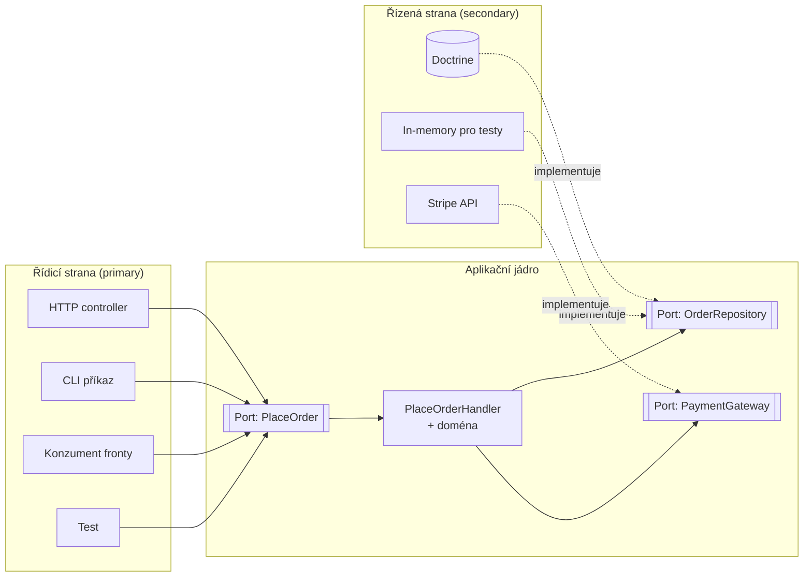

# Ports & Adapters (Hexagonální architektura)

> [← zpět na Architecture](../)

> **V jedné větě:** Aplikační jádro komunikuje s okolím výhradně přes rozhraní, která si samo definuje — takže databázi, framework i protokol jde vyměnit, aniž by se jádra kdokoli dotkl.

---

## Problém

Byznys logika se rozpustí v infrastruktuře. Ne najednou — po jednom „to je rychlejší“ rozhodnutí za druhým, až jednoho dne nejde doména spustit bez databáze, fronty a nastaveného API klíče.

**Poznáš to podle:**

- **unit test potřebuje databázi.** Tohle je ten nejspolehlivější příznak: když se logika nedá spustit izolovaně, není izolovaná.
- v controlleru je podmínka, která rozhoduje o byznysu, ne o HTTP
- doménová třída importuje `Doctrine\…`, `Symfony\…`, `GuzzleHttp\…`
- výměna knihovny na odesílání e-mailů znamená sáhnout do dvaceti souborů napříč aplikací
- tatáž logika existuje dvakrát, protože jednou ji volá HTTP a podruhé konzument fronty a „přes controller to volat nešlo“
- na otázku „co ta aplikace vlastně umí?“ neexistuje místo, kam ukázat

```php
// Před: use-case ví o HTTP, o Doctrine i o platební bráně
final class OrderController
{
    public function __construct(
        private EntityManagerInterface $em,
        private \Stripe\StripeClient $stripe,
    ) {
    }

    public function submit(Request $request): JsonResponse
    {
        $total = (int) $request->request->get('total');

        // byznys pravidlo uprostřed HTTP vrstvy
        if ($total <= 0) {
            return new JsonResponse(['error' => 'Neplatná částka'], 400);
        }

        $charge = $this->stripe->charges->create([
            'amount' => $total,
            'currency' => 'czk',
        ]);

        // …a rovnou i to, co je uvnitř odpovědi Stripe
        if ($charge->status !== 'succeeded') {
            return new JsonResponse(['error' => 'Platba zamítnuta'], 402);
        }

        $order = new Order();
        $order->setTotal($total);
        $order->setPaymentReference($charge->id);

        $this->em->persist($order);
        $this->em->flush();

        return new JsonResponse(['number' => $order->getNumber()]);
    }
}
```

Zkus tuhle logiku otestovat bez HTTP requestu, bez databáze a bez Stripe. Nejde to. A přitom pravidlo „objednávka musí mít kladnou hodnotu“ s HTTP ani se Stripe nemá nic společného.

---

## Řešení

Postav aplikaci tak, aby **jádro neznalo nikoho a všichni znali jádro**. Jádro si definuje rozhraní — **porty** — a okolní svět je naplní implementacemi — **adaptéry**.



Všechny šipky míří **dovnitř**. To je celé pravidlo a všechno ostatní z něj plyne.

### Dvě strany, na jednu se zapomíná

Většina lidí si pod hexagonální architekturou představí repository interface — a tím to pro ně končí. To je ale jen polovina:

| | **Řídicí strana** (primary, driving) | **Řízená strana** (secondary, driven) |
| --- | --- | --- |
| Kdo koho volá | Svět volá jádro | Jádro volá svět |
| Port popisuje | Co aplikace umí | Co aplikace potřebuje |
| Příklad portu | `PlaceOrder` | `OrderRepository`, `PaymentGateway` |
| Příklad adaptéru | HTTP controller, CLI příkaz, konzument fronty, **test** | Doctrine repository, HTTP klient brány, in-memory fake |
| Kdo implementuje port | **Jádro** | **Adaptér** |

Ten poslední řádek je nejdůležitější a nejčastěji se plete: řídicí port implementuje jádro, řízený port implementuje adaptér. **Vlastníkem obou je ale vždycky jádro** — ono říká, jak kontrakt vypadá.

Test je plnohodnotný řídicí adaptér, ne výjimka z pravidla. Když jde jádro pohánět testem stejně snadno jako HTTP requestem, architektura funguje.

### Proč zrovna šestiúhelník

Kvůli ničemu. Cockburn potřeboval obrázek, na kterém má „krabice“ víc než čtyři strany, aby bylo vidět, že portů může být libovolný počet a že **nejde o vrstvy nad sebou**. Šest stran nemá žádný význam a sám autor toho jména později litoval — proto se dnes prosadilo popisnější **Ports & Adapters**.

---

## Účastníci

| Role | V příkladu | Odpovědnost |
| ---- | ---------- | ----------- |
| **Doména** | `Order` | Pravidla, která platí bez ohledu na okolí |
| **Use-case** | `PlaceOrderHandler` | Jeden scénář aplikace; skládá doménu a porty |
| **Řídicí port** | `PlaceOrder` | Kontrakt „co aplikace umí“; implementuje ho jádro |
| **Řízený port** | `OrderRepository`, `PaymentGateway` | Kontrakt „co aplikace potřebuje“; implementuje ho adaptér |
| **Řídicí adaptér** | `CliPlaceOrderController` | Přeloží podnět zvenčí na volání portu |
| **Řízený adaptér** | `JsonFileOrderRepository`, `LimitedPaymentGateway` | Naplní port konkrétní technologií |
| **Composition root** | `run.php`, DI kontejner | Jediné místo, které zná jádro i adaptéry a spojí je |

---

## Implementace v PHP

Řízený port. Klíčové je, **kde tenhle soubor leží** — v jádře, ne u adaptéru:

```php
<?php
declare(strict_types=1);

namespace Core\Port\Driven;

use Core\Domain\Order;

interface OrderRepository
{
    public function nextNumber(): string;

    public function save(Order $order): void;

    public function findByNumber(string $number): ?Order;
}
```

Metody jsou v pojmech domény. Žádné `flush()`, `createQueryBuilder()` ani `getEntityManager()` — to by sem protáhlo Doctrine a port by přestal být portem.

Řídicí port — ta půlka, na kterou se zapomíná:

```php
namespace Core\Port\Driving;

interface PlaceOrder
{
    /** @throws PaymentDeclined */
    public function place(PlaceOrderCommand $command): string;
}
```

Use-case. Podívej se na konstruktor a na to, co v souboru **není**:

```php
namespace Core\Application;

final readonly class PlaceOrderHandler implements PlaceOrder
{
    public function __construct(
        private OrderRepository $orders,
        private PaymentGateway $payments,
    ) {
    }

    public function place(PlaceOrderCommand $command): string
    {
        $order = Order::place(
            $this->orders->nextNumber(),
            $command->customerEmail,
            $command->totalInCents,
        );

        $payment = $this->payments->charge($order->number, $order->totalInCents);

        if ($payment->isApproved === false) {
            throw new PaymentDeclined($payment->message);
        }

        $this->orders->save($order->paidWith((string) $payment->reference));

        return $order->number;
    }
}
```

Dvě rozhraní, která si jádro samo definovalo. Žádná Doctrine, žádné HTTP, žádná konfigurace — a proto jde tahle třída spustit v testu bez jediného kusu infrastruktury.

Řídicí adaptér. Jeho jediná práce je překlad tam a zpátky:

```php
namespace Adapter\Driving\Cli;

final readonly class CliPlaceOrderController
{
    public function __construct(
        private PlaceOrder $placeOrder,
    ) {
    }

    public function run(array $arguments): int
    {
        [$email, $amount] = $arguments;

        $command = new PlaceOrderCommand($email, (int) round((float) $amount * 100));

        try {
            $number = $this->placeOrder->place($command);
        } catch (PaymentDeclined $e) {
            printf("✗ %s\n", $e->getMessage());

            return 1;
        }

        printf("✓ Objednávka %s založena\n", $number);

        return 0;
    }
}
```

Kdyby vedle vznikl HTTP controller nebo konzument fronty, vypadaly by stejně: **parsuj → zavolej port → zformátuj**. Žádná byznys logika; kdyby tu byla podmínka o tom, kdy se objednávka smí založit, patřila by do jádra.

### Adaptér překládá, nejen deleguje

Nejčastější polovičaté řešení: adaptér jen přepošle volání dál a cizí pojmy proteče do jádra. Adaptér má být **překladatel**:

```php
// Špatně: jádro se dozví, že existuje Stripe a jaké má stavy
public function charge(string $orderNumber, int $amount): \Stripe\Charge

// Správně: ven jde pojem, kterému rozumí doména
public function charge(string $orderNumber, int $amountInCents): PaymentResult
{
    $response = $this->stripe->charges->create([...]);

    return $response->status === 'succeeded'
        ? PaymentResult::approved($response->id)
        : PaymentResult::declined($this->translateError($response));
}
```

Totéž na druhé straně: HTTP kódy, JSON, formulářová pole i sloupce v tabulce **končí v adaptéru**. Do jádra vstupuje `PlaceOrderCommand`, ven vystupuje číslo objednávky nebo `PaymentDeclined`.

### Kam to dát ve složkách

Struktura složek je tady součástí patternu, protože z ní musí být směr závislostí vidět na první pohled:

```
src/
    Core/
        Domain/              Order.php
        Application/         PlaceOrderHandler.php
        Port/
            Driving/         PlaceOrder.php, PlaceOrderCommand.php
            Driven/          OrderRepository.php, PaymentGateway.php
    Adapter/
        Driving/
            Http/            OrderController.php
            Cli/             PlaceOrderCommand.php
        Driven/
            Persistence/     DoctrineOrderRepository.php
            Payment/         StripePaymentGateway.php
```

Pravidlo, které z toho plyne a dá se automaticky ohlídat: **`Core/` nesmí obsahovat jediný `use` mířící do `Adapter/`** (ani do `Doctrine\`, `Symfony\`, `GuzzleHttp\`). Opačně to platit musí. Na hlídání existují nástroje — [deptrac](https://github.com/qossmic/deptrac) nebo PHPStan pravidla; pusť je v CI, protože ručně tohle nikdo neuhlídá.

### Použití

Jádro se sestavuje v **composition rootu** — u vás DI kontejner, v demu `run.php`. Je to jediné místo, které zná obě strany:

```php
// konfigurace pro test — bez databáze, bez sítě
$handler = new PlaceOrderHandler(
    new InMemoryOrderRepository(),
    new AlwaysApprovingPaymentGateway(),
);

// konfigurace na ostro — tatáž třída, jiné adaptéry
$handler = new PlaceOrderHandler(
    new DoctrineOrderRepository($entityManager),
    new StripePaymentGateway($stripeClient),
);
```

V Symfony je to jeden řádek v `services.yaml`:

```yaml
Core\Port\Driven\OrderRepository: '@Adapter\Driven\Persistence\DoctrineOrderRepository'
```

---

## Kdy použít

- ✅ Aplikace má **netriviální doménová pravidla**, která přežijí framework i databázi.
- ✅ Do téže logiky se vstupuje **víc než jednou cestou** — HTTP, fronta, CLI, cron.
- ✅ Závisíš na **externích službách**, které chceš v testech obejít a časem možná vyměnit.
- ✅ Chceš **rychlé testy** — jádro bez infrastruktury běží v milisekundách místo sekund.
- ✅ Aplikaci bude udržovat víc lidí po delší dobu a hranice mají držet i bez tebe.

## Kdy nepoužít

- ❌ **CRUD nad tabulkou.** Když use-case zní „ulož formulář do databáze“, jsou porty jen ceremonie navíc. Použij, co framework nabízí.
- ❌ **Prototyp nebo krátkodobá věc.** Platí se předem, vrací se za rok. Když rok nebude, je to čistá ztráta.
- ❌ **Malý tým, který to nepobere.** Architektura, kterou půlka týmu nedodržuje, je horší než žádná — vznikne z ní chaos se složitější strukturou složek.
- ❌ **Doména je jen tenká slupka nad cizím API.** Když tvoje aplikace hlavně přeposílá volání jinam, je jádro prázdné a hexagon obaluje vzduch.

> Nejde o binární volbu. Je naprosto legitimní mít porty jen tam, kde na nich záleží — kolem platební brány a doménového výpočtu ano, kolem tabulky s číselníky ne.

---

## Časté chyby

| Chyba | Proč vadí | Jak správně |
| ----- | --------- | ----------- |
| Rozhraní portu leží v adaptéru (u implementace) | Závislost míří ven; jádro pak závisí na infrastruktuře, jen přes jeden mezistupeň | Port vlastní a definuje **jádro** |
| Port kopíruje API ORM — `flush()`, `createQueryBuilder()`, `getReference()` | Doctrine proteče do jádra; výměna persistence znamená přepsat i jádro | Port mluví pojmy domény: `save()`, `findByNumber()` |
| Adaptér vrací cizí typ (`Stripe\Charge`, `ResponseInterface`, `QueryBuilder`) | Cizí pojmy jsou v jádře, jen o patro níž | Adaptér **překládá** do typů jádra |
| Doménová entita je zároveň Doctrine entita s anotacemi | Mapování v jádře znamená, že persistence ovlivňuje tvar domény | **Nemusí to tak být** — [XML mapování a custom types](../../PoEAA/DataMapper/#jak-v-doctrine-udržet-doménu-opravdu-čistou) udrží jádro bez jediného `use Doctrine\…` |
| Byznys pravidlo v controlleru | Pravidlo platí jen pro tu jednu cestu; z fronty se tatáž operace zavolá bez něj | Pravidla do jádra, adaptér jen překládá |
| Jeden adaptér na třídu, ne na vnější systém | Vznikne padesát rozhraní o jedné metodě a struktura přestane něco říkat | Port na **vnější starost**, ne na každou třídu |
| Hexagon zaveden „pro jistotu“ všude | Zaplatíš cenu za flexibilitu, kterou nikdy nevyužiješ | Porty tam, kde je reálná varianta výměny nebo potřeba testu |
| Směr závislostí se hlídá jen domluvou | Za půl roku tam bude první `use Doctrine\…` a nikdo si nevšimne | Pravidlo do CI — deptrac nebo PHPStan |

---

## V praxi

- **Symfony DI** — vazba rozhraní na implementaci v `services.yaml` je composition root. Jádro dostane port, kontejner doplní adaptér.
- **Doctrine** — `OrderRepository` jako rozhraní v doméně, `DoctrineOrderRepository` v infrastruktuře. Doctrine samo tenhle rozpad podporuje, ale nevynucuje.
- **deptrac / PHPStan** — jediný způsob, jak směr závislostí udržet dlouhodobě. Bez kontroly v CI se hranice rozpadne, i když s ní všichni souhlasí.
- **Testy** — praktické měřítko: když unit test use-case potřebuje databázi, port někde chybí nebo netěsní.

---

## Související patterny

| Pattern | Vztah |
| ------- | ----- |
| **Adapter** (GoF) | Sdílejí jméno, ne měřítko. GoF Adapter je jeden objekt překládající jedno rozhraní na druhé; adaptér tady je **architektonická role** — celý kus kódu na hranici aplikace. GoF Adapter se často použije uvnitř. |
| **Clean / Onion Architecture** | Totéž jinými slovy a s jiným obrázkem. Clean Architecture přidává pojmenované vrstvy a explicitní pravidlo závislosti, Onion soustředné kruhy. Rozdíly jsou hlavně v terminologii. |
| [Repository](../../PoEAA/Repository/) (PoEAA) | Nejběžnější řízený port. Hexagon říká *proč* rozhraní patří do domény; Repository říká, *jak* má vypadat. |
| [Strategy](../../GoF/Behavioral/Strategy/) | Port se dvěma implementacemi je z pohledu jádra Strategy. Rozdíl je v záměru: Strategy vybírá algoritmus, port odstiňuje vnější svět. |
| [Value Object](../../DDD/ValueObject/) | Typický obsah příkazů a odpovědí na hranici portu — `PlaceOrderCommand`, `PaymentResult`. |
| [Service Layer](../../PoEAA/ServiceLayer/) | To, co sedí uvnitř hexagonu za řídicím portem. Hexagon říká *kde* ta vrstva je, Service Layer *co* v ní je. |
| [CQRS](../CQRS/) | Vkládá se dovnitř téhle vrstvy: zápis jde přes port do domény, čtení může mít vlastní, kratší cestu. |
| [Anticorruption Layer](../../DDD/AnticorruptionLayer/) (DDD) | Řízený adaptér s ambicí navíc: nejen překládá protokol, ale brání cizímu **modelu** prosáknout do domény. Kdy se vyplatí, řeší [Context Map](../../DDD/ContextMap/). |
| [Bounded Context](../../DDD/BoundedContext/) (DDD) | Hranice kontextu je hranice aplikace, kolem které hexagon staví porty. Bounded Context říká **kudy** ta hranice vede, hexagon **jak** ji držet. |

---

## Vztah k principům

| Princip | Jak souvisí |
| ------- | ----------- |
| [DIP](../../Principles/SOLID.md#dependency-inversion-principle-dip) | **Tohle je celý pattern.** Jádro nezávisí na infrastruktuře; obě strany závisí na abstrakci, kterou vlastní jádro. Hexagonální architektura je DIP důsledně dotažené na úroveň celé aplikace. |
| [ISP](../../Principles/SOLID.md#interface-segregation-principle-isp) | Port popisuje jednu vnější starost, ne celou schopnost knihovny. Proto `PaymentGateway` s jednou metodou, ne obal celého SDK. |
| [SRP](../../Principles/SOLID.md#single-responsibility-principle-srp) | Adaptér se mění, když se změní technologie. Jádro, když se změní byznys. Dva důvody ke změně, dvě různá místa. |
| [OCP](../../Principles/SOLID.md#openclosed-principle-ocp) | Nový vstupní kanál nebo nové úložiště = nový adaptér. Jádro se nemění. |

---

## Demo

```bash
php Architecture/PortsAndAdapters/demo/run.php
```

Spustí tentýž `PlaceOrderHandler` ve dvou konfiguracích — jednou s pamětí a vždy schvalující bránou (jako v testu), podruhé se souborovým úložištěm a bránou s limitem. Pak nad ním pustí řídicí CLI adaptér a nakonec zavolá jádro přímo, přesně jak by to udělal unit test.

Demo má na rozdíl od ostatních **složky a jmenné prostory** — struktura je tady součástí patternu. Zkus si v `Core/` najít `use` mířící do `Adapter/`; žádný tam není, a to je celá pointa.

---

## Původ

|               |                                                     |
| ------------- | --------------------------------------------------- |
| **Zdroj**     | článek *Hexagonal Architecture* (alias *Ports and Adapters*) |
| **Autor**     | Alistair Cockburn                                    |
| **Rok**       | 2005                                                 |
| **Kategorie** | — (architektonické vzory kategorie nemají)           |
| **Obtížnost** | ●●●●○                                                |

Cockburn vzor formuloval jedinou větou, kterou dal do podtitulu článku: *„Allow an application to equally be driven by users, programs, automated test or batch scripts, and to be developed and tested in isolation from its eventual run-time devices and databases.“* Motivace byla úplně praktická — aplikace té doby se nedaly testovat bez databáze a bez uživatelského rozhraní, a on hledal způsob, jak to zlomit.

Šestiúhelník na obrázku nemá žádný význam. Cockburn potřeboval tvar s víc než čtyřmi stranami, aby bylo zřejmé, že portů může být libovolný počet a že **nejde o vrstvy nad sebou** — což je přesně to, co by čtverec nebo klasické vrstvové schéma naznačovaly. Sám později přiznal, že jméno bylo nešťastné, protože se lidé začali ptát, proč zrovna šest. Proto se dnes používá popisnější **Ports & Adapters**.

Nezávisle na něm popsali totéž Jeffrey Palermo jako *Onion Architecture* (2008) a Robert C. Martin jako *Clean Architecture* (2012). Všechny tři říkají tutéž věc — **závislosti míří dovnitř, k doméně** — a liší se hlavně obrázkem a slovníkem.

---

## Zdroje

- Alistair Cockburn: *Hexagonal Architecture*, 2005 — [alistair.cockburn.us/hexagonal-architecture](https://alistair.cockburn.us/hexagonal-architecture/)
- Jeffrey Palermo: *The Onion Architecture*, 2008
- Robert C. Martin: *Clean Architecture*, Prentice Hall, 2017
- [deptrac](https://github.com/qossmic/deptrac) — hlídání směru závislostí v CI

---

<details>
<summary>Metadata patternu</summary>

```yaml
name: PortsAndAdapters
name_cs: Hexagonální architektura
category: —
source: Hexagonal Architecture (článek)
authors: Alistair Cockburn
year: 2005
difficulty: 4
tags: [architektura, závislosti, testovatelnost, hranice, infrastruktura]
principles: [DIP, ISP, SRP, OCP]
related: [Adapter, CleanArchitecture, Repository, Strategy, ValueObject, AnticorruptionLayer]
status: done
```

</details>
