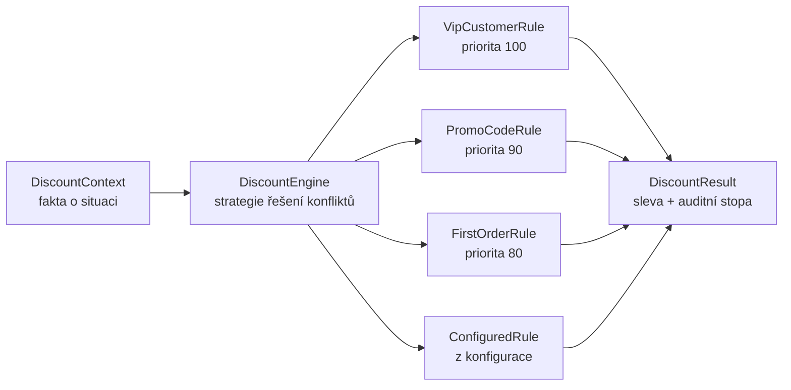

# Rules Engine (Pravidlový systém)

> [← zpět na Architecture](../)

> **V jedné větě:** Byznysová pravidla přestanou být podmínkami v kódu a stanou se seznamem objektů, který jde vypsat, vyhodnotit a zdůvodnit.

> [!WARNING]
> Tenhle pattern má z celého katalogu nejvyšší poměr „nasazeno“ ku „mělo být nasazeno“. Než se do něj pustíš, přečti si **[Kdy nepoužít](#kdy-nepoužít)** a hlavně [Škálu, na které si vyber](#škála-na-které-si-vyber). Většina týmů, které sáhly po pravidlovém enginu, potřebovala druhý stupeň z pěti.

---

## Problém

Doména má sadu pravidel, která se mění častěji než zbytek aplikace — slevy, scoring, nároky, limity. Napsaná jsou jako podmínky, a proto o nich nikdo nemá přehled.

**Poznáš to podle:**

- na otázku **„jaké vlastně máme slevy?“** neumí nikdo odpovědět bez čtení kódu
- pravidla přibývají do jedné metody, která už má sto řádků a šest úrovní zanoření
- **na pořadí `if`ů záleží**, ale nikde není napsané proč — a nikdo si netroufne je přeházet
- na dotaz „proč tenhle zákazník dostal tuhle cenu?“ se odpovídá laděním v produkci
- někde v té metodě je větev, na kterou se nikdy nedostane, a nikdo to neví
- každá změna sazby znamená deploy

```php
// Před: pravidla, pořadí i řešení konfliktů v jedné metodě
public function discountFor(Order $order, Customer $customer): int
{
    if ($customer->isVip()) {
        return intdiv($order->total(), 10);        // return = „a dost“, ale proč?
    }

    if ($order->promoCode() === 'PODZIM26') {
        return intdiv($order->total() * 15, 100);
    }

    if ($customer->isFirstOrder() && $order->total() >= 100000) {
        if ($order->total() >= 500000) {
            return 20000 + intdiv($order->total() * 5, 100);   // tady se sčítá…
        }

        return 20000;                                          // …a tady ne
    }

    if ($order->total() >= 500000) {
        return intdiv($order->total() * 5, 100);
    }

    return 0;
}
```

Tenhle kód odpovídá na tři různé otázky najednou a ani jednu nemá napsanou: **jaká pravidla existují**, **v jakém pořadí se posuzují** a **co se stane, když sedne víc najednou**. Odpovědi jsou zakódované v pořadí `if`ů a v tom, kde je `return`.

---

## Řešení

Rozděl to na tři samostatné věci:

1. **Pravidlo** — podmínka a důsledek, s vlastním jménem a prioritou
2. **Sada pravidel** — seznam, který jde vypsat a doplnit
3. **Engine** — projde sadu a podle **explicitní strategie** rozhodne, co se uplatní

```php
interface DiscountRule
{
    public function name(): string;

    /** Vyšší číslo = dřív na řadě. */
    public function priority(): int;

    public function appliesTo(DiscountContext $context): bool;

    /** Sleva v haléřích. */
    public function discountFor(DiscountContext $context): int;
}
```



Ty tři schované otázky z původního kódu jsou najednou položené nahlas — a to je většina užitku, ještě než se do enginu vůbec pustíš.

### Řešení konfliktů je byznysové rozhodnutí

Nejdůležitější věc na celém patternu. „Sčítají se slevy, nebo platí jen ta nejvyšší?“ je otázka na produkťáka, ne na programátora. V hromadě `if`ů odpověď vzniká **omylem**, podle toho, kde kdo napsal `return`.

Táž objednávka (6 200 Kč, 24 kusů, VIP zákazník s kódem `PODZIM26`), tři strategie:

| Strategie | Sleva | Uplatněno pravidel |
| --------- | ----- | ------------------ |
| První podle priority | 620 Kč | 1 |
| Nejvýhodnější pro zákazníka | 930 Kč | 1 |
| Sečíst vše | 2 360 Kč | 4 |

Rozdíl je 1 740 Kč na jedné objednávce. Tohle rozhodnutí si zaslouží být v kódu vidět jako pojmenovaná volba, ne jako důsledek pořadí podmínek.

### Auditní stopa

Druhý důvod, proč pattern stojí za to — a v praxi ten, který ho zaplatí. Engine vrací nejen výsledek, ale i **která pravidla sedla a která se neuplatnila**:

```
strategie: první podle priority
sleva:     620 Kč

uplatněno:
    ✓ VIP zákazník 10 %                620 Kč
sedlo, ale neuplatnilo se:
    · Kód PODZIM26 −15 %               930 Kč
    · Objednávka nad 5 000 Kč −5 %     310 Kč
    · Velkoodběr od 20 kusů −500 Kč    500 Kč
```

Na dotaz ze zákaznické podpory „proč dostal jen 620 Kč, když měl kód na 15 %?“ existuje odpověď, kterou jde uložit k objednávce. Bez patternu se na tohle odpovídá laděním v produkci.

Podmínka a důsledek proto **musí být oddělené metody**. Kdyby pravidlo vracelo `?int` (null = neplatí), nešlo by zjistit, co by bylo, kdyby.

### Diagnostika, kterou podmínky nedají

Když jsou pravidla objekty, jde se jich ptát:

```php
$dead = $engine->neverMatching($samples);   // pravidla, která nesednou ani jednou
$engine->catalogue();                       // co vlastně máme
```

Mrtvou větev v hromadě `if`ů nenajde nikdo. Mrtvé pravidlo v seznamu najde patnáct řádků kódu.

---

## Škála, na které si vyber

Tohle je ta nejdůležitější sekce celého dokumentu. „Rules engine“ není jedna věc — je to pět různě drahých stupňů a **většina týmů potřebuje druhý nebo třetí**, zatímco sáhne po pátém.

| # | Stupeň | Co to znamená | Cena | Kdy to stačí |
| - | ------ | ------------- | ---- | ------------ |
| 1 | **Pojmenovaná podmínka** | `if ($this->isEligibleForFreeShipping($order))` | žádná | Pravidel je pár a nemění se |
| 2 | **[Specification](../../DDD/Specification/)** | Pravidlo jako objekt, skládá se přes and/or | malá | Pravidla se kombinují, ale vyhodnocuje je kód |
| 3 | **Tenhle pattern** | Sada pravidel + engine se strategií, vše v PHP | střední | Pravidel je hodně, potřebuješ katalog a zdůvodnění |
| 4 | **Pravidla jako data** | Definice v konfiguraci nebo v databázi | vysoká | Sazby a prahy se mění častěji než kód |
| 5 | **Inferenční engine** | Řetězení, Rete, pravidla spouštějí pravidla (Drools) | velmi vysoká | Stovky pravidel se vzájemnými závislostmi |

Hranice mezi 3 a 4 je **typová bezpečnost**, hranice mezi 4 a 5 je **předvídatelnost**. Obě se překračují jednosměrně a obě stojí mnohem víc, než se při rozhodování zdá.

### Co konkrétně stojí stupeň 4

Demo obsahuje `ConfiguredRule`, které se skládá z pole:

```php
ConfiguredRule::fromArray([
    'name' => 'Objednávka nad 5 000 Kč −5 %',
    'priority' => 70,
    'when' => ['field' => 'orderTotalInCents', 'op' => '>=', 'value' => 500000],
    'then' => ['percent' => 5],
]);
```

Vypadá to lákavě — pravidlo bez deploye. Účet přijde takhle:

```
Pravidlo „Překlep v konfiguraci“ se ptá na neznámý údaj „orderTotalCents“.
↑ v pravidle psaném v PHP by tohle nepustil ani PHPStan
```

Konkrétně platíš:

- **Typová kontrola končí.** Překlep se pozná za běhu, u zákazníka.
- **IDE přestane pomáhat.** Přejmenování `orderTotalInCents` tenhle záznam tiše mine.
- **Slovník je konečný.** Cokoli, co v něm není, se musí doprogramovat — a tlak na jeho růst je nekonečný.
- **Vzniká ti jazyk.** Jakmile má slovník `and`, `or` a závorky, píšeš interpret. To je jiný projekt, než jaký jsi zadal.

Proto je slovník v ukázce záměrně titěrný: tři operátory a dva druhy důsledku. **Když ti přestane stačit, není řešením ho rozšířit — je to signál, že pravidlo patří do PHP.**

### Kdo ta pravidla bude doopravdy editovat

Nejčastější důvod pro stupeň 4 a 5 zní „aby si to byznys měnil sám“. Před rozhodnutím si ověř tři věci:

1. **Chtějí to doopravdy?** Většinou chtějí, aby změna netrvala tři týdny. To se dá vyřešit i rychlejším deployem.
2. **Kdo to bude opravovat?** Když si analytik nastaví pravidlo špatně, spadne to na tebe — a ladíš cizí konfiguraci bez typů a bez testů.
3. **Kdo za to ponese odpovědnost?** Pravidlo, které rozdává slevy, je stejně kritické jako kód. Potřebuje review, verzování a možnost návratu. Pokud to admin rozhraní neumí, dal jsi produkční kontrolu ven bez záchranné sítě.

Praktický kompromis, který funguje dobře: **pravidla v PHP, ale jejich parametry v konfiguraci.** Sazby a prahy se mění bez deploye, struktura pravidla zůstává typovaná a otestovaná.

---

## Účastníci

| Role | V příkladu | Odpovědnost |
| ---- | ---------- | ----------- |
| **Fakta** | `DiscountContext` | Neměnný obraz situace; pravidla ho nesmí měnit |
| **Pravidlo** | `VipCustomerRule`, `PromoCodeRule` | Jméno, priorita, podmínka, důsledek |
| **Pravidlo z dat** | `ConfiguredRule` | Totéž, poskládané z konfigurace |
| **Strategie** | `ConflictResolution` | Co dělat, když sedne víc pravidel |
| **Engine** | `DiscountEngine` | Projde sadu, uplatní strategii, sestaví stopu |
| **Výsledek** | `DiscountResult` | Hodnota **i zdůvodnění** |

---

## Implementace v PHP

Engine je záměrně hloupý. Všechna chytrost je v pravidlech a ve strategii:

```php
final readonly class DiscountEngine
{
    /** @var list<DiscountRule> */
    private array $rules;

    /** @param list<DiscountRule> $rules */
    public function __construct(
        array $rules,
        private ConflictResolution $strategy = ConflictResolution::FirstMatch,
    ) {
        // Seřazení podle priority patří sem. Kdyby záleželo na pořadí v poli,
        // vrátili bychom se k implicitnímu pořadí ifů.
        usort($rules, static fn (DiscountRule $a, DiscountRule $b): int => $b->priority() <=> $a->priority());

        $this->rules = $rules;
    }

    public function evaluate(DiscountContext $context): DiscountResult
    {
        $matching = [];

        foreach ($this->rules as $rule) {
            if ($rule->appliesTo($context)) {
                $matching[] = [$rule, $rule->discountFor($context)];
            }
        }

        $usedIndexes = $this->resolve($matching);

        $evaluated = [];
        $total = 0;

        foreach ($matching as $index => [$rule, $discount]) {
            $wasUsed = in_array($index, $usedIndexes, strict: true);

            if ($wasUsed) {
                $total += $discount;
            }

            // Do stopy jde i to, co se neuplatnilo — kvůli tomu to celé je.
            $evaluated[] = new AppliedRule($rule->name(), $rule->priority(), $discount, $wasUsed);
        }

        return new DiscountResult(min($total, $context->orderTotalInCents), $this->strategy, $evaluated);
    }
}
```

Strategie jako enum, ne jako `bool $accumulate`:

```php
enum ConflictResolution
{
    case FirstMatch;
    case BestForCustomer;
    case Accumulate;
}
```

Pravidlo. Podmínka a důsledek odděleně:

```php
final readonly class VipCustomerRule implements DiscountRule
{
    public function name(): string
    {
        return 'VIP zákazník 10 %';
    }

    public function priority(): int
    {
        return 100;
    }

    public function appliesTo(DiscountContext $context): bool
    {
        return $context->isVipCustomer;
    }

    public function discountFor(DiscountContext $context): int
    {
        return intdiv($context->orderTotalInCents, 10);
    }
}
```

### Kde je hranice, kterou nepřekračovat

V ukázkovém enginu **není řetězení**. Pravidla se vyhodnotí jednou nad původními fakty a nemůžou spustit další pravidla:

```php
// Tohle engine v ukázce NEUMÍ a je to schválně:
//   pravidlo A přidá do faktů „zákazník je nově VIP“
//   → to spustí pravidlo B
//   → to změní jiný fakt
//   → …a teď zkus říct, kdy se to zastaví a jaký je výsledek
```

S řetězením přestává platit, že výsledek závisí jen na vstupu — začíná záviset na **pořadí a počtu průchodů**. Tady končí „pravidla jako data“ a začíná plnohodnotný inferenční systém s [Rete algoritmem](https://en.wikipedia.org/wiki/Rete_algorithm), laděním nedeterministických průchodů a nutností umět dokázat, že se výpočet zastaví.

Když tohle opravdu potřebuješ, **nepiš si to sám** — vezmi hotový engine a počítej s tím, že jsi si pořídil další systém k údržbě.

### Použití

```php
$engine = new DiscountEngine(
    rules: [
        new VipCustomerRule(),
        new FirstOrderRule(),
        new PromoCodeRule('PODZIM26', 15),
    ],
    strategy: ConflictResolution::BestForCustomer,
);

$result = $engine->evaluate($context);

$order->applyDiscount($result->totalDiscountInCents);

// Stopa se uloží k objednávce — příště se nemusí ladit v produkci.
foreach ($result->used() as $rule) {
    $auditLog->record($order->id, $rule->name, $rule->discountInCents);
}
```

---

## Kdy použít

- ✅ Pravidel je **hodně** a mění se výrazně rychleji než zbytek aplikace.
- ✅ Potřebuješ **vypsat, jaká pravidla platí** — pro produkt, pro audit, pro podporu.
- ✅ Musíš umět **zdůvodnit výsledek** konkrétnímu zákazníkovi zpětně.
- ✅ Pravidla se **navzájem překrývají** a je potřeba explicitně říct, co má přednost.
- ✅ Chceš pravidla testovat po jednom, bez okolního use-case.

## Kdy nepoužít

- ❌ **Pravidel je pět a mění se dvakrát ročně.** Zůstaň na stupni 1 nebo 2. Engine přidá vrstvu, kterou musíš vysvětlovat každému nováčkovi.
- ❌ **Vyhodnocuje se to jen na jednom místě a nikdo se neptá proč.** Bez potřeby katalogu a stopy zbývá z patternu jen režie.
- ❌ **„Ať si to byznys mění sám.“** Ověř si nejdřív [tři otázky výše](#kdo-ta-pravidla-bude-doopravdy-editovat). Ve většině případů se ukáže, že skutečný požadavek byl „ať to netrvá tři týdny“.
- ❌ **Pravidla jsou ve skutečnosti výpočet.** Když se neptáš „platí?“, ale „kolik?“, a odpověď je vzorec, potřebuješ [Strategy](../../GoF/Behavioral/Strategy/), ne engine.
- ❌ **Sáhl bys po Droolsu.** Pokud si nejsi jistý, že potřebuješ inferenci a Rete, nepotřebuješ je. Vlastní seznam objektů zvládne devět z deseti případů a umíš ho odladit.

---

## Časté chyby

| Chyba | Proč vadí | Jak správně |
| ----- | --------- | ----------- |
| Řešení konfliktů zůstane implicitní — první `return` vyhrává | Byznysové rozhodnutí vzniklo omylem a nikdo ho nevidí | Strategie jako pojmenovaný enum, předaný do enginu |
| Pravidlo vrací `?int` (null = neplatí) | Nejde zjistit, co se neuplatnilo — a tím padá auditní stopa | Oddělené `appliesTo()` a `discountFor()` |
| Pravidlo si samo načítá data (repository, API) | Vyhodnocení sady vyrobí N dotazů a nejde otestovat izolovaně | Všechna fakta dostane engine předem v kontextu |
| Pravidlo mění fakta | Výsledek začne záviset na pořadí; jsi v inferenčním systému, aniž bys to chtěl | Kontext je `readonly` |
| Priority jsou `1, 2, 3` | Vložit pravidlo doprostřed znamená přečíslovat všechna | Nech mezery: `100, 90, 80` |
| Slovník konfiguračních pravidel se rozrůstá o `and`, `or`, závorky | Píšeš interpret vlastního jazyka | Když slovník nestačí, pravidlo patří do PHP |
| Engine bez stropu na výsledek | Sečtené slevy převýší hodnotu objednávky | Hranice patří do enginu, ne do každého pravidla |
| Nikdo netestuje sadu jako celek | Jednotlivá pravidla projdou, ale jejich kombinace dá nesmysl | Testuj i sadu — na reálných vzorcích, včetně `neverMatching()` |

---

## V praxi

- **Symfony** — tagované služby dají sadu pravidel do konstruktoru enginu automaticky; nové pravidlo je jedna třída, nic dalšího.
- **Symfony ExpressionLanguage** — hotový vyhodnocovač výrazů, když opravdu potřebuješ stupeň 4. Lepší než psát vlastní parser, ale platí u něj tytéž výhrady k typové bezpečnosti.
- **Symfony Workflow** — pravidlový systém specializovaný na přechody stavů. Když se tvá „pravidla“ točí kolem toho, co smí následovat po čem, sáhni radši po něm.
- **Drools / OpenL Tablets** — plnohodnotné inferenční enginy ze světa Javy. Zmiňujeme je hlavně proto, abys věděl, kde je hranice, za kterou tenhle pattern nejde.
- **Auditní stopa v praxi** — ukládej ji k objednávce, ne do logu. Za půl roku se někdo zeptá, proč konkrétní objednávka dostala konkrétní cenu.

---

## Související patterny

| Pattern | Vztah |
| ------- | ----- |
| [Specification](../../DDD/Specification/) | **Předstupeň, a často dostatečný.** Specifikace je podmínka pravidla; rules engine přidává důsledek, prioritu a řešení konfliktů. Když ti stačí „platí / neplatí“, zůstaň u ní. |
| [Strategy](../../GoF/Behavioral/Strategy/) | Jednotlivé pravidlo je Strategy pro výpočet důsledku. Rozdíl: Strategy se vybírá jedna, tady se vyhodnocují všechny a pak se rozhoduje. |
| [Chain of Responsibility](../../GoF/Behavioral/ChainOfResponsibility/) (GoF) | Blízký příbuzný strategie *první podle priority* — řetěz, kde první schopný požadavek obslouží. Rules engine navíc vidí i ty, kteří by ho obsloužili taky. |
| **Interpreter** (GoF) | Kam se dostaneš, když konfigurační slovník poroste. Užitečné hlavně jako varování. |
| [Value Object](../../DDD/ValueObject/) | `DiscountContext` i `DiscountResult` jsou hodnoty — neměnné, bez identity. |
| **Command** (GoF) | Když důsledkem není hodnota, ale akce, přiblíží se pravidlo dvojici podmínka + příkaz. |

---

## Vztah k principům

| Princip | Jak souvisí |
| ------- | ----------- |
| [OCP](../../Principles/SOLID.md#openclosed-principle-ocp) | Nové pravidlo = nová třída (nebo řádek konfigurace). Engine se nemění. |
| [SRP](../../Principles/SOLID.md#single-responsibility-principle-srp) | Jedno pravidlo = jeden důvod ke změně. Změna VIP sazby se nedotkne ničeho jiného. |
| [ISP](../../Principles/SOLID.md#interface-segregation-principle-isp) | Kontrakt pravidla má čtyři malé metody, ne jednu velkou `apply()`, která dělá všechno naráz. |

Souvisí i s principem, který v `Principles/` zatím nemáme: **Make the Implicit Explicit** — celý pattern je o tom, že pořadí, priorita a řešení konfliktů přestanou být skryté v kódu a stanou se viditelnými daty.

---

## Demo

```bash
php Architecture/RulesEngine/demo/run.php
```

Vypíše katalog pravidel, vyhodnotí objednávku s plnou auditní stopou, pustí **tutéž objednávku třemi strategiemi** (620 / 930 / 2 360 Kč), ukáže, jak se překlep v konfiguračním pravidle projeví až za běhu, a nakonec najde pravidlo, které nesedne ani na jeden ze vzorků.

---

## Původ

|               |                                                    |
| ------------- | -------------------------------------------------- |
| **Zdroj**     | produkční systémy a expertní systémy; moderní pojetí Martin Fowler |
| **Autoři**    | Newell & Simon (produkční systémy), Charles Forgy (Rete), Martin Fowler |
| **Roky**      | 70. léta · **1979** (Rete) · **2009–2010** (Fowler) |
| **Kategorie** | — (architektonické vzory kategorie nemají)          |
| **Obtížnost** | ●●●●○                                               |

Kořeny jsou v **produkčních systémech** 70. let — modelu výpočtu, kde program není posloupnost kroků, ale sada pravidel `když … pak …` a stroj, který je opakovaně aplikuje na měnící se fakta. Z toho vyrostly expertní systémy 80. let, největší vlna nadšení a následného zklamání v dějinách oboru.

**Charles Forgy** v roce **1979** publikoval algoritmus **Rete**, který vyhodnocování stovek pravidel nad měnícími se fakty zrychlil natolik, že to bylo použitelné v praxi. Na Rete stojí prakticky všechny velké enginy včetně Droolsu.

Moderní, střízlivé pojetí přinesl **Martin Fowler** — v článku *Should I use a Rules Engine?* (2009) a v knize *Domain-Specific Languages* (2010). Jeho závěr je pro tenhle text určující a stojí za doslovné připomenutí: **většina týmů, které chtějí rules engine, potřebuje jen dobře uspořádaná pravidla ve vlastním kódu.** Hotový engine přináší vlastní jazyk, vlastní ladění a vlastní provozní starosti — a ty se platí každý den, zatímco flexibilita se využije jednou za čtvrtletí.

Proto je tenhle dokument napsaný jako pattern **i jako varování**. Rozdělení pravidel na objekty se seznamem a strategií je skoro vždycky dobrý nápad. Krok k pravidlům mimo kód a k inferenci je skoro vždycky dražší, než se při rozhodování zdá.

---

## Zdroje

- Martin Fowler: *Should I use a Rules Engine?*, 2009 — [martinfowler.com/bliki/RulesEngine.html](https://martinfowler.com/bliki/RulesEngine.html)
- Martin Fowler: *Domain-Specific Languages*, Addison-Wesley, 2010 — Production Rule Systems
- Charles Forgy: *Rete: A Fast Algorithm for the Many Pattern / Many Object Pattern Match Problem*, 1982
- [Symfony ExpressionLanguage](https://symfony.com/doc/current/components/expression_language.html)

---

<details>
<summary>Metadata patternu</summary>

```yaml
name: RulesEngine
name_cs: Pravidlový systém
category: —
source: Produkční systémy; moderní pojetí Martin Fowler
authors: Charles Forgy, Martin Fowler
year: 2009
difficulty: 4
tags: [byznysová pravidla, konfigurace, auditní stopa, DSL, rozhodování]
principles: [OCP, SRP, ISP]
related: [Specification, Strategy, ChainOfResponsibility, Interpreter, ValueObject, Command]
status: done
```

</details>
