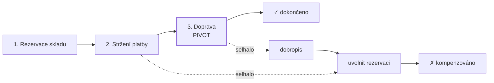

# Saga (Sága)

> [← zpět na Architecture](../)

> **V jedné větě:** Operace, která mění stav ve víc [kontextech](../../DDD/BoundedContext/), rozdělená na kroky s lokální transakcí — a ke každému kroku patří **kompenzační akce** pro případ, že to dál nedopadne.

> [!IMPORTANT]
> Sága není distribuovaná transakce a nikdy se jí nestane. **Vzdáváš se izolace** — mezi kroky ostatní procesy vidí mezistav. To není chyba implementace, je to [cena](#co-ságou-nezískáš), kterou platíš za to, že distribuovanou transakci nemáš.

---

## Problém

Operace dává smysl jen celá, ale sahá do víc kontextů, z nichž **každý má vlastní databázi a vlastní transakce**. Rezervuj sklad, strhni platbu, naplánuj dopravu — buď všechno, nebo nic.

Jenže „všechno nebo nic“ ti nikdo nezaručí. Distribuovaná transakce (dvoufázový commit) je v praxi nepoužitelná: drží zámky přes síť, škáluje mizerně a většina služeb ji ani nenabízí.

**Poznáš to podle:**

- operace přes tři kontexty spadne v půlce a **první dva kroky nikdo nevrátí**
- zákazník má fakturu za zboží, které nikdo neodeslal
- v use-case je `try`/`catch` s ručním „tak to zkusíme vrátit“, a v něm další `try`/`catch`
- na otázku „v jakém stavu je ta objednávka?“ neumí odpovědět nic než čtení logů
- opakované doručení zprávy vyrobí **druhý dobropis**
- někdo navrhne dvoufázový commit a nikdo neví, jak by to vlastně provozoval

```php
// Před: naděje jako strategie
$orderId = $this->sales->placeOrder(/* … */);      // 1. proběhne
$invoice = $this->billing->issueInvoice(/* … */);  // 2. proběhne
$tracking = $this->shipping->schedule(/* … */);    // 3. spadne

// …a sem se nedostaneme. Kroky 1 a 2 zůstanou.
```

Tohle je přesně místo, kde [kompozice](../ServiceComposition/) končí a začíná sága.

---

## Řešení

Rozděl operaci na kroky. **Každý krok proběhne v lokální transakci svého kontextu** a ke každému existuje **kompenzace** — operace, která jeho následky ruší. Když některý krok selže, projdou se kompenzace **pozpátku**.



```php
interface SagaStep
{
    public function name(): string;

    /** @throws \RuntimeException */
    public function execute(SagaState $state): void;

    /** MUSÍ být idempotentní. */
    public function compensate(SagaState $state): void;

    public function isPivot(): bool;
}
```

### Kompenzace není rollback

**Nejdůležitější myšlenka celého patternu**, a v praxi se na ni naráží bolestivě.

Rollback předstírá, že se nic nestalo — databáze zahodí neuložené změny a po operaci nezůstane stopa. **Kompenzace nic zahodit nemůže**, protože ten krok se **skutečně stal**: peníze se strhly, e-mail odešel, sklad se zarezervoval. Kompenzace je proto **nový obchodní fakt**, který ruší následky toho předchozího.

Demo to ukazuje na účetní knize:

```
Účetní kniha po kompenzaci:
    stržení         7 990 Kč  PAY-950B10
    dobropis       -7 990 Kč  PAY-950B10
    SALDO               0 Kč
```

**Saldo je nula, ale záznamy zůstaly oba.** Platba se nesmazala — přidal se dobropis. Tak to má být, a účetní ti potvrdí, že jinak by to ani nešlo.

Praktické důsledky, které z toho plynou:

| | Rollback | Kompenzace |
| --- | -------- | ---------- |
| Co udělá | Zahodí změny | **Přidá opačnou operaci** |
| Zůstane stopa | Ne | **Ano, a má** |
| Kdo ji píše | Databáze | **Ty** — pro každý krok |
| Vždycky možná | Ano | **Ne** — e-mail neodešleš zpět |

Ten poslední řádek vede rovnou k pivotnímu kroku.

### Pivotní krok

Některé kroky **nejdou vzít zpět**. Zásilku převzal dopravce, e-mail dorazil, přiznání se odeslalo na finanční úřad. Takovému kroku se říká **pivot** a platí o něm jediné pravidlo:

> **Za pivotem se už nejde zpátky, jen dopředu.**

Z toho plyne praktická rada, která ušetří spoustu trápení: **nevratné kroky dávej nakonec.** Dokud jsi před pivotem, dá se všechno kompenzovat. Za ním už jen opakovat, dokud to neprojde — nebo předat člověku.

Demo ukazuje, co se stane, když je pivot uprostřed:

```
selhal krok:  stržení platby
kompenzace:   ŽÁDNÁ — zásilka už odjela
stav ságy:    zaseknutá — nutný ruční zásah
```

### Orchestrace, nebo choreografie?

Dvě podoby ságy. Liší se v jediné věci — **jestli někdo řídí** — a všechno ostatní z toho plyne:

| | **Orchestrace** | **Choreografie** |
| --- | --- | --- |
| Kdo řídí | Centrální koordinátor | **Nikdo** — každý reaguje na události |
| Kde je vidět průběh | **Na jednom místě** | Nikde; musíš ho poskládat z logů |
| Přidání kroku | Změna v koordinátoru | Nový posluchač |
| Vazba | Koordinátor zná všechny | Kontexty znají jen události |
| Riziko | Koordinátor naroste do monolitu | Nikdo nerozumí celku |
| Ladění | Snadné | **Těžké** |
| Vhodné pro | Procesy s pořadím a kompenzacemi | Volné reakce, málo kroků |

Doporučení: **začni orchestrací.** Průběh je vidět, kompenzace se dají naprogramovat na jednom místě a proces se dá zobrazit na dashboardu. K choreografii přejdi, až když ti vadí vazba koordinátoru na všechny účastníky — a počítej s tím, že jsi vyměnil jeden problém za jiný.

Demo v téhle složce je **orchestrovaná** varianta, protože je to ta, kterou se začíná.

### Musí to být asynchronní? Ne.

Častá představa je, že sága znamená fronty, zprávy a asynchronní zpracování. **Není to pravda** — a stojí za to si to vyjasnit, protože ta představa odrazuje od patternu tam, kde by byl užitečný.

Původní sága z roku 1987 byla **synchronní, v jedné databázi, v jednom procesu**. Demo v téhle složce je taky synchronní: přímá volání, žádná fronta. Asynchronnost přišla až s mikroslužbami a je to **volba, ne součást definice**.

Z toho plyne odpověď na otázku, která přijde dřív nebo později: *„Proč nemůžu prostě složit zápis a kompenzace řešit synchronně?“*

**Můžeš. A ve chvíli, kdy k tomu přidáš kompenzace, jsi napsal ságu** — jen jsi ji tak nenazval. Ta hranice nevede mezi „kompozicí“ a „ságou“, ale jinde:

| | Složit a doufat | **Synchronní sága** | Sága s uloženým stavem | Asynchronní sága |
| --- | --- | --- | --- | --- |
| Kompenzace | ❌ | ✅ | ✅ | ✅ |
| **Přežije smrt procesu** | ❌ | ❌ | ✅ | ✅ |
| Selhání kompenzace jde dohnat | — | ❌ | ✅ | ✅ |
| Volající čeká | ano | ano | ano | **ne** |
| Snese pomalé kroky | ne | ne | ne | **ano** |
| Složitost | žádná | **malá** | střední | vysoká |

**Ta skutečně důležitá řádka je druhá.** Synchronní kompenzace funguje dokonale — dokud proces doběhne. Když ho uprostřed zabije deploy, OOM killer nebo timeout, informace o rozdělané práci zmizí s ním:

```
BEZ uloženého stavu:
    Proces zabit (deploy uprostřed operace).
    rezervací ve skladu:  1   ← osiřelá
    saldo plateb:         7 990 Kč   ← peníze strženy
    kompenzace:           ŽÁDNÁ — kód, který o nich věděl, je pryč
```

S uloženým stavem přežije záznam o tom, co proběhlo — a obnovovací worker to dojede:

```
v databázi zůstalo: běží, hotové kroky: rezervace skladu, stržení platby

…a o pět minut později doběhne obnovovací worker:
    uklizeno ság:         OBJ-006
    rezervací ve skladu:  0   ← uvolněno
    saldo plateb:         0 Kč   ← dobropis vystaven
```

> **Rozdíl mezi tím, co funguje a co ne, není synchronní × asynchronní. Je to uložený stav** — a ten potřebuješ v obou případech.

**Praktické doporučení:** začni **synchronní ságou s uloženým stavem**. Je to pro většinu týmů to správné místo — kompenzace máš, restart přežiješ, a přitom nemusíš provozovat fronty. K asynchronní variantě přejdi, až když ti vadí, že volající čeká, nebo když některý krok trvá dlouho.

A dodatek, na který se zapomíná: **k uloženému stavu patří i ten worker.** Uložený stav bez obnovy je jen podrobnější záznam o tom, co se nepovedlo.

### Process Manager: sága, která si pamatuje

Když orchestrátor **drží stav procesu**, má vlastní jméno: **Process Manager** (Hohpe & Woolf, *EIP*, 2003).

```php
final class SagaState
{
    /** @var list<string> */
    public array $completedSteps = [];

    public string $status = 'běží';

    public function remember(string $step, string $result): void { /* … */ }
}
```

Rozdíl proti obyčejnému `try`/`catch` je zásadní. Se stavem procesu:

- **přežije pád procesu** — po restartu se dá pokračovat tam, kde to skončilo
- **jde ho zobrazit** — support vidí, kde objednávka uvízla
- **jde ho opakovat** — bez toho, aby se zopakovaly už hotové kroky
- **jde na něm měřit**, kolik ság uvízlo a kde

A ještě jedna věc, která platí i pro tvůj kód: **stav, identita a životní cyklus jsou vlastnosti agregátu.** Když to má proces všechno, [není bezdomovec](../ServiceComposition/#kompozice-není-bezdomovec) — je to **vlastní bounded context**. Složka `Saga/` nebo `Orchestration/` bývá kontext, který jsi ještě nepojmenoval. Ten výše by se jmenoval **Order Fulfillment**.

### Opakovat, nebo kompenzovat?

Ne každé selhání znamená rušit. Rozliš:

| Typ selhání | Příklad | Co s tím |
| ----------- | ------- | -------- |
| **Technické, dočasné** | timeout, 503, deadlock | **Opakuj** s exponenciálním odstupem |
| **Technické, trvalé** | 400, neplatný formát | Kompenzuj — opakování nepomůže |
| **Obchodní** | zboží není skladem, karta zamítnuta | **Kompenzuj** — je to legitimní odpověď |

Kompenzovat kvůli timeoutu je drahé a zbytečné: nejdřív to zkus znovu.

### Idempotence není volitelná

Zprávy se doručují **aspoň jednou**, což znamená, že kompenzace přijde i podruhé. ([Co je idempotence](../../Glossary.md#idempotence).) Bez ochrany dostane zákazník dva dobropisy:

```
záznamů v knize před opakováním: 2
po opakování kompenzace:         2   ← beze změny
sklad: uvolnění RES-950B10 přeskočeno (už není)
```

Nejjednodušší způsob: kompenzace se **podívá, jestli už proběhla**, a když ano, tiše skončí. Alternativa je evidence zpracovaných identifikátorů.

---

## Účastníci

| Role | V příkladu | Odpovědnost |
| ---- | ---------- | ----------- |
| **Sága / koordinátor** | `OrderFulfillmentSaga` | Pořadí kroků, spuštění kompenzací pozpátku |
| **Stav procesu** | `SagaState` | Kde proces je a co už proběhlo — z toho dělá Process Manager |
| **Krok** | `ReserveStock`, `ChargePayment` | `execute()` + `compensate()` + `isPivot()` |
| **Účastník** | `StockContext`, `PaymentContext` | Cizí kontext s vlastní databází a transakcí |
| **Výsledek** | `SagaOutcome` | Dokončeno / kompenzováno / zaseknuto |
| **Úložiště stavu** | `SagaLog` | Aby sága přežila smrt procesu |
| **Obnova** | `SagaRecovery` | Dojede kompenzace ság, které nikdo nedokončil |

---

## Implementace v PHP

Jádro koordinátoru je krátké — celý pattern je v tom `array_reverse`:

```php
public function run(SagaState $state): SagaOutcome
{
    $completed = [];

    foreach ($this->steps as $step) {
        try {
            $step->execute($state);
            $completed[] = $step;
        } catch (\RuntimeException $e) {
            // Za pivotním krokem už zpět nejde — jen dopředu.
            if ($this->passedPivot($completed)) {
                $state->status = 'zaseknutá — nutný ruční zásah';

                return SagaOutcome::stuck($step->name(), $e->getMessage());
            }

            $compensated = $this->compensate($completed, $state);
            $state->status = 'kompenzovaná';

            return SagaOutcome::compensated($step->name(), $e->getMessage(), $compensated);
        }
    }

    $state->status = 'dokončená';

    return SagaOutcome::completed();
}

/** Kompenzace běží POZPÁTKU — poslední dokončený krok se ruší první. */
private function compensate(array $completed, SagaState $state): array
{
    foreach (array_reverse($completed) as $step) {
        $step->compensate($state);
    }
}
```

A kompenzace, která je idempotentní, protože **musí být**:

```php
public function refund(string $paymentId): void
{
    foreach ($this->ledger as $entry) {
        if ($entry['type'] === 'dobropis' && $entry['id'] === $paymentId) {
            return;                                  // už proběhlo, nedělej nic
        }
    }

    // …najdi původní stržení a přidej opačný záznam
}
```

### Kam to dát ve složkách

```
src/OrderFulfillment/            ← vlastní kontext, ne „Orchestration“
    Domain/
        SagaState.php            stav procesu = agregát
        SagaStep.php
    Application/
        OrderFulfillmentSaga.php
        Steps/
            ReserveStock.php
            ChargePayment.php
            ScheduleShipping.php
    Infrastructure/
        SagaStateRepository.php  ← aby proces přežil restart
```

Kroky volají **jen veřejné use-case cizích kontextů** — stejné pravidlo jako u [kompozice](../ServiceComposition/). Nikdy jejich repository ani databázi.

---

## Kdy použít

- ✅ Operace **mění stav ve víc kontextech** a musí dopadnout celá.
- ✅ Distribuovaná transakce nepřipadá v úvahu (což je skoro vždy).
- ✅ Ke každému kroku **existuje smysluplná kompenzace** — vratka, storno, uvolnění.
- ✅ Potřebuješ vidět, **kde proces uvízl**, a umět ho dokončit ručně.
- ✅ Proces trvá v čase a musí přežít restart aplikace.

## Kdy nepoužít

- ❌ **Všechno je v jednom kontextu a jedné databázi.** Pak použij **transakci** — je jednodušší, rychlejší a dá ti i izolaci. Sága je náhražka pro případ, kdy transakci mít nemůžeš.
- ❌ **Jde jen o čtení.** [Kompozice](../ServiceComposition/), nic víc.
- ❌ **Ke krokům neexistuje kompenzace.** Když se první krok nedá vzít zpět, sága ti nepomůže — přeuspořádej kroky tak, aby nevratné byly poslední.
- ❌ **Dvě operace, které spolu nemusí souviset.** Když stačí, aby druhá proběhla „někdy“, nepotřebuješ ságu, ale [událost](../../DDD/DomainEvent/).
- ❌ **Nemáš na to provoz.** Sága bez monitoringu zaseknutých procesů je horší než žádná — o problémech se dozvíš od zákazníků.

---

## Časté chyby

| Chyba | Proč vadí | Jak správně |
| ----- | --------- | ----------- |
| **Kompenzace se chápe jako rollback** | Vzniknou pokusy „smazat“ platbu; účetnictví i audit tím rozbiješ | Kompenzace = nová operace, obojí zůstane v knize |
| **Kompenzace není idempotentní** | Opakované doručení vyrobí druhý dobropis | Zjisti, jestli už proběhla, a tiše skonči |
| Nevratný krok je uprostřed | Sága uvízne a nejde ani dopředu, ani zpět | Pivot až nakonec |
| Kompenzace v pořadí kroků | Ruší se závislosti v opačném pořadí, než vznikly | `array_reverse` |
| Sága nemá stav | Po pádu procesu nikdo neví, kde to skončilo | Stav ukládej — je to Process Manager |
| **Uložený stav bez obnovovacího workeru** | Máš podrobný záznam o tom, co se nepovedlo, a nikdo to neuklidí | K uloženému stavu patří worker, který nedokončené ságy dojede |
| Odmítnutí ságy s tím, že „nechceme fronty“ | Sága nevyžaduje fronty; synchronní varianta je legitimní | [Synchronní sága s uloženým stavem](#musí-to-být-asynchronní-ne) |
| Kompenzuje se i technický timeout | Zbytečné rušení objednávek kvůli síti | Nejdřív opakuj, kompenzuj až u obchodního selhání |
| Koordinátor sahá do cizích databází | Obchází hranice kontextů | Jen veřejné use-case |
| Koordinátor začne rozhodovat o byznysu cizích kontextů | Naroste do distribuovaného monolitu | Řídí **pořadí**, ne pravidla |
| Chybí monitoring zaseknutých ság | O nedokončených procesech se dozvíš od zákazníků | Dashboard a alert na stav „zaseknutá“ |
| Očekává se izolace | Někdo se diví, že mezi kroky vidí mezistav | Počítej s tím v UI i v pravidlech |

---

## Co ságou nezískáš

Transakce v jedné databázi dává **ACID**. Sága dává **ACD** — a to chybějící písmeno je to nejdůležitější:

```
Transakce v jedné databázi:      A · C · I · D
Sága přes víc kontextů:          A · C ·   · D     ← chybí IZOLACE
```

Mezi kroky vidí ostatní procesy **mezistav**: rezervace existuje, platba proběhla, zásilka ne. Není to chyba implementace — je to nevyhnutelný důsledek toho, že každý krok commituje ve svém kontextu zvlášť.

Co s tím jde dělat:

- **Sémantické zámky** — rezervace není jen záznam, je to zámek se smyslem. Ostatní procesy vidí, že zboží je „drženo“, a chovají se podle toho.
- **Počítat s mezistavem v UI** — „zpracováváme objednávku“ je legitimní stav, který zákazník uvidí.
- **Řadit kroky podle rizika** — co nejdřív udělej to, co se nejspíš nepovede.

---

## V praxi

- **Symfony Messenger** — kroky jako zprávy, stav ságy v databázi, opakování a *dead letter* transport pro to, co neprošlo ani po opakování.
- **Stav v databázi, ne v paměti** — bez toho sága nepřežije deploy uprostřed procesu. Platí to i pro synchronní variantu; [není to o frontách](#musí-to-být-asynchronní-ne).
- **Monitoring** je součást patternu, ne doplněk: alert na ságy ve stavu „zaseknutá“ déle než X minut.
- **Ruční dokončení** — počítej s tím, že někdo bude muset zasáhnout. Dej mu na to nástroj dřív, než ho bude potřebovat.

---

## Související patterny

| Pattern | Vztah |
| ------- | ----- |
| [Service Composition](../ServiceComposition/) | **Předchůdce pro čtení.** Kompozice skládá pohled; jakmile měníš stav, potřebuješ kompenzace a jsi tady. |
| [Domain Event](../../DDD/DomainEvent/) | Choreografovaná varianta stojí celá na událostech. I orchestrovaná jimi obvykle komunikuje. |
| [Aggregate](../../DDD/Aggregate/) | Pravidlo „jedna transakce = jeden agregát“ je důvod, proč sága vůbec existuje. Stav ságy je sám agregátem. |
| [Bounded Context](../../DDD/BoundedContext/) | Účastníci ságy. A proces sám bývá dalším kontextem. |
| [CQRS](../CQRS/) | Eventuální konzistence je společný jmenovatel obojího. |
| [Chain of Responsibility](../../GoF/Behavioral/ChainOfResponsibility/) | Podobná mechanika řetězu kroků — bez kompenzací a bez stavu. |
| [State](../../GoF/Behavioral/State/) | Stav ságy je stavový automat; u složitějších procesů se vyplatí ho tak i napsat. |

---

## Vztah k principům

| Princip | Jak souvisí |
| ------- | ----------- |
| [OCP](../../Principles/SOLID.md#openclosed-principle-ocp) | Nový krok = nová třída se svou kompenzací. Koordinátor se nemění. |
| [SRP](../../Principles/SOLID.md#single-responsibility-principle-srp) | Krok ví o svém kontextu, koordinátor o pořadí. Ani jeden o obojím. |
| [Fail Fast](../../Principles/ObjectDesign.md#fail-fast) | S jednou výhradou: u technických selhání se nejdřív opakuje. Rychle se selhává u **obchodních** důvodů. |
| [Zviditelni implicitní](../../Principles/ObjectDesign.md#zviditelni-implicitní) | Proces, který byl dosud poskládaný z `try`/`catch`, dostane jméno, stav a průběh, na který jde ukázat. |

---

## Demo

```bash
php Architecture/Saga/demo/run.php
```

Projde šťastnou cestu, pak nechá selhat druhý a třetí krok a ukáže kompenzace **pozpátku**. Na účetní knize předvede, že **saldo je nula, ale oba záznamy zůstaly** — rozdíl mezi kompenzací a rollbackem. Pak spustí kompenzace podruhé (idempotence), přesune pivotní krok doprostřed, aby sága uvízla, a ukáže, co ságou nezískáš: izolaci.

Poslední dvě části odpovídají na otázku **„proč nestačí synchronní kompenzace?“**: nechají proces zemřít uprostřed operace — jednou bez uloženého stavu (osiřelá rezervace, stržené peníze, nikdo nekompenzuje) a jednou s ním, kdy to obnovovací worker dojede.

---

## Původ

|               |                                                          |
| ------------- | -------------------------------------------------------- |
| **Zdroj**     | článek *Sagas*; do architektury přeneseno o třicet let později |
| **Autoři**    | Hector Garcia-Molina, Kenneth Salem; Hohpe & Woolf; Chris Richardson |
| **Roky**      | **1987** (Sagas) · **2003** (Process Manager) · **2018** (mikroslužby) |
| **Kategorie** | — (architektonické vzory kategorie nemají)                |
| **Obtížnost** | ●●●●○                                                     |

Původ je překvapivě starý a úplně jinde, než by člověk čekal. **Hector Garcia-Molina a Kenneth Salem** publikovali v roce **1987** článek *Sagas* o **dlouhotrvajících databázových transakcích**. Jejich problém byl jiný než ten dnešní: transakce, která běží hodiny, drží zámky a blokuje všechny ostatní. Jejich řešení bylo rozdělit ji na kratší transakce, z nichž každá commituje samostatně, a ke každé napsat kompenzaci.

Tři desetiletí se s tím nic zvláštního nedělo. Pak přišly mikroslužby a ukázalo se, že mají **přesně ten samý problém** z jiného důvodu: ne dlouhé trvání, ale to, že každá služba má vlastní databázi. Řešení z roku 1987 sedělo beze změny.

Mezitím **Hohpe a Woolf** v *Enterprise Integration Patterns* (**2003**) popsali **Process Manager** — komponentu, která drží stav procesu a rozhoduje o dalším kroku. Dnes se obojí obvykle používá dohromady: sága je způsob, jak řešit konzistenci, process manager je způsob, jak ji naprogramovat.

**Chris Richardson** to v *Microservices Patterns* (2018) uspořádal do dnešní podoby, včetně rozdělení na orchestraci a choreografii a včetně pojmu **pivotní krok**.

Poučení, které z té historie plyne: **sága není moderní vynález ani módní záležitost.** Je to třicet let stará odpověď na otázku, co dělat, když nemůžeš mít jednu transakci — a pořád je to ta nejlepší, kterou máme.

---

## Zdroje

- Hector Garcia-Molina, Kenneth Salem: *Sagas*, SIGMOD, 1987
- Gregor Hohpe, Bobby Woolf: *Enterprise Integration Patterns*, Addison-Wesley, 2003 — Process Manager
- Chris Richardson: *Microservices Patterns*, Manning, 2018 — kapitola 4
- [microservices.io: Saga](https://microservices.io/patterns/data/saga.html)

---

<details>
<summary>Metadata patternu</summary>

```yaml
name: Saga
name_cs: Sága
category: —
source: Sagas (1987); mikroslužbová adaptace
authors: Garcia-Molina, Salem, Hohpe, Woolf, Richardson
year: 1987
difficulty: 4
tags: [kompenzace, eventuální konzistence, orchestrace, choreografie, process manager, idempotence]
principles: [OCP, SRP, FailFast]
related: [ServiceComposition, DomainEvent, Aggregate, BoundedContext, CQRS, ChainOfResponsibility, State]
status: done
```

</details>
