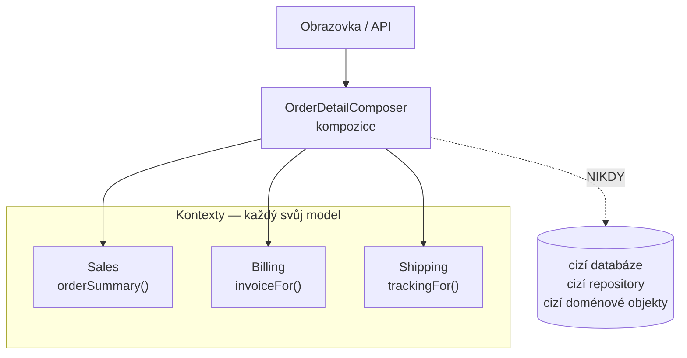

# Service Composition (Orchestrace napříč kontexty)

> [← zpět na Architecture](../)

> **V jedné větě:** Komponenta, která poskládá operace několika [ohraničených kontextů](../../DDD/BoundedContext/) do jednoho smysluplného celku — a smí přitom volat jen jejich veřejné use-case, nic hlubšího.

---

## Jak se tomu říká

Tenhle pattern nepochází z DDD ani z GoF, ale ze světa SOA a mikroslužeb — a proto má jiná jména, než na jaká je zbytek katalogu zvyklý:

| Jméno | Odkud | Poznámka |
| ----- | ----- | -------- |
| **Service Composition** | Thomas Erl, *SOA Design Patterns*, 2009 | Nejcitovanější pojmenování |
| **Orchestration** | Peltz, IEEE Computer, 2003 | V protikladu k *choreografii* |
| **API Composition** | Chris Richardson, *Microservices Patterns*, 2018 | Konkrétně čtecí strana |
| **Aggregator** | mikroslužbový žargon | Totéž, méně přesně |

Tenhle text říká **kompozice** a rozlišuje **čtecí** a **zápisovou** — protože to je [rozdíl, na kterém všechno stojí](#čtení-a-zápis-nejsou-totéž).

---

## Problém

Obrazovka nebo operace dává smysl až **dohromady** — potřebuje kousek ze tří různých kontextů. Jenže žádný z nich to celé neví a ani vědět nemá.

**Poznáš to podle:**

- frontend volá pět endpointů a skládá si z nich jednu stránku sám
- nebo si kontext, který má nejblíž, začne tahat data z ostatních — a začne o nich vědět víc, než má
- jeden kontext si **naklonuje kus modelu druhého**, aby ho nemusel volat
- na otázku „kdo je zodpovědný za tenhle proces?“ neumí odpovědět nikdo
- operace přes tři kontexty je rozsypaná v controlleru s `try`/`catch`
- objeví se složka `Orchestration/` nebo `Common/` a nikdo neví, co do ní patří

---

## Řešení

Vytvoř komponentu, jejíž **jedinou prací je složit ten celek**. Volá veřejné use-case ostatních kontextů a nic víc.



Pravidlo, které z toho dělá pattern a ne jen třídu: **kompozice zná jen veřejné rozhraní ostatních kontextů.** Ne jejich repository, ne jejich doménové objekty, ne jejich databázi. Kdyby si sáhla hlouběji, obchází hranici kontextu — a to je totéž, co dělá špatná integrace.

### Kompozice není bezdomovec

Nejčastější pocit při zavádění tohohle patternu je, že ten kód **nikam nepatří**. Ta složka `Orchestration/` vedle ostatních kontextů vypadá jako přiznání, že se něco nepovedlo zařadit.

Ve skutečnosti je to signál:

> **Když proces má vlastní pravidla, vlastní slovník a vlastní životní cyklus, tak ten proces JE bounded context.**

Složka `Orchestration/` obvykle znamená, že jsi objevil kontext a ještě jsi mu nedal jméno. Když to koordinuje objednání → sklad → doprava → fakturace, ten kontext se jmenuje třeba **Order Fulfillment** a má vlastní doménu: pojem „splnění objednávky“, jeho stavy, pravidla o tom, co po čem následuje, a co se děje při selhání.

Rozdíl v praxi je velký a projeví se do roka:

| | `OrchestrationService` | `OrderFulfillment` jako kontext |
| --- | --- | --- |
| Co to je | Obal nad cizími voláními | **Vlastní model** |
| Vlastní stav | Ne | Ano — proces má stav |
| Vlastní jazyk | Ne | Ano — dá se o něm mluvit s byznysem |
| Za rok | Skládka všeho, co se nikam nevešlo | Pořád dává smysl |

### Čtení a zápis nejsou totéž

**Nejdůležitější rozlišení celého patternu.** Vypadají stejně — poskládej N volání — ale liší se v tom, co se stane při selhání:

| | **Čtecí kompozice** | **Zápisová kompozice** |
| --- | --- | --- |
| Mění stav | Ne | Ano |
| Selhání jednoho kroku | Chybí kus pohledu | **Nekonzistentní data** |
| Dá se degradovat | **Ano** | Ne |
| Dá se opakovat | Ano, zdarma | Jen s idempotencí |
| Volání paralelně | **Ano** | Obvykle ne, kroky navazují |
| Riziko | Malé | **Velké** |
| Verdikt | Běžná a v pořádku | Potřebuje **Sagu** |

**Čtecí kompozice je bezpečná a používá se pořád.** Klíčové rozhodnutí je, co je povinné a co doplňkové — pak výpadek jednoho zdroje pohled jen ochudí:

```
Sales     OBJ-4711   ← povinná část, je
Billing   FA-2026-0912   ← je
Shipping  —          ← chybí
nedostupné: Shipping, pohled úplný: ne
```

Obrazovka se ukáže. Chybí sledování zásilky, a to je přijatelné — **protože se nic neměnilo**.

**Zápisová kompozice je past.** Vypadá stejně, ale při selhání třetího kroku už první dva proběhly:

```
Stav po selhání:
    objednávka založena:   ano
    faktura vystavena:     ano (FA-0001)
    zásilka naplánována:   NE
```

Zákazník má fakturu za zboží, které nikdo neodeslal — a systém o tom neví. **Tohle kompozice vyřešit neumí.** Na to je potřeba **Saga** s kompenzačními akcemi.

Praktické pravidlo: **kompozici používej na čtení. U zápisu přes víc kontextů se rovnou ptej, jestli nepotřebuješ Sagu** — nebo jestli ta operace vůbec musí být synchronní.

### Cena za synchronní volání

Číslo, které stojí za zapamatování, protože se na něj při návrhu zapomíná. Každý kontext má dostupnost 99,9 %. Když je zavoláš synchronně za sebou, **jejich nedostupnosti se sčítají**:

| Kontextů | Dostupnost | Výpadek měsíčně |
| -------- | ---------- | --------------- |
| 1 | 99,90 % | 43 min |
| 3 | 99,70 % | 129 min |
| 5 | 99,50 % | 216 min |
| 8 | 99,20 % | 344 min |

Tomu se říká **časová vazba**: kompozice je dole vždy, když je dole kterýkoli z volaných — i kdyby s tou operací logicky nesouvisel.

Co s tím:

- **Nepovinné části** ať pohled jen ochudí, ne shodí (viz výše)
- **Paralelizuj**, kde to jde — u čtení je latence maximum, ne součet
- **Cachuj** to, co se mění pomalu
- **Timeout a circuit breaker** na každé volání ven
- Když ta vazba vadí, jdi na **choreografii**: kontexty spolu mluví [událostmi](../../DDD/DomainEvent/) a kompozice čte z vlastního [čtecího modelu](../CQRS/), který si z nich poskládala předem

---

## Účastníci

| Role | V příkladu | Odpovědnost |
| ---- | ---------- | ----------- |
| **Kompozice** | `OrderDetailComposer` | Poskládá celek; nezná vnitřek nikoho |
| **Složený pohled** | `OrderDetailView` | Tvar obrazovky **+ co chybí** |
| **Kontext** | `SalesContext`, `BillingContext` | Ven vystavuje jen use-case |
| **Volající** | controller, BFF | Dostane hotový celek |

---

## Implementace v PHP

Rozdělení na povinné a doplňkové části je celé jádro čtecí kompozice:

```php
final readonly class OrderDetailComposer
{
    public function __construct(
        private SalesContext $sales,
        private BillingContext $billing,
        private ShippingContext $shipping,
    ) {
    }

    public function compose(string $orderId): OrderDetailView
    {
        $unavailable = [];

        // Povinná část — bez ní odpověď nedává smysl.
        $order = $this->sales->orderSummary($orderId);

        // Doplňkové části — výpadek degraduje pohled, neshodí ho.
        $invoice = $this->optional('Billing', fn (): array => $this->billing->invoiceFor($orderId), $unavailable);
        $tracking = $this->optional('Shipping', fn (): array => $this->shipping->trackingFor($orderId), $unavailable);

        return new OrderDetailView($order, $invoice, $tracking, $unavailable);
    }
}
```

Všimni si, že **složený pohled nese i seznam toho, co chybí**. Bez toho by frontend nepoznal rozdíl mezi „zásilka neexistuje“ a „nevíme, protože Shipping mlčí“ — a to jsou dvě různé věci, které se uživateli ukazují jinak.

### Co kompozice smí a nesmí

| Smí | Nesmí |
| --- | ----- |
| Volat veřejné use-case ostatních kontextů | Sahat na jejich repository nebo databázi |
| Skládat výsledky do vlastního DTO | Pracovat s jejich doménovými objekty |
| Rozhodovat o pořadí a paralelizaci | Obsahovat doménová pravidla cizích kontextů |
| Ošetřovat výpadky a timeouty | Být místem, kam se odloží logika, co se jinam nevešla |

Ten poslední řádek je ten, na kterém pattern nejčastěji ztroskotá.

---

## Kdy použít

- ✅ **Čtení**, které dává smysl až složením z víc kontextů — detail objednávky, dashboard, BFF pro mobilní aplikaci.
- ✅ Chceš, aby skládání dělal **backend**, ne frontend pěti voláními.
- ✅ Proces přes víc kontextů potřebuje **jednoho zodpovědného**.
- ✅ Volané kontexty mají **stabilní veřejné API**.

## Kdy nepoužít

- ❌ **Zápis přes víc kontextů bez kompenzací.** Částečné selhání je otázka „kdy“, ne „jestli“ — potřebuješ **Sagu**.
- ❌ **Když jde všechno z jednoho kontextu.** Kompozice nad jedním zdrojem je vrstva bez obsahu.
- ❌ **Jako místo pro doménovou logiku.** Pravidlo patří tomu kontextu, kterého se týká — jinak si vyrobíš čtvrtý model, který nikdo nehlídá.
- ❌ **Když je časová vazba nepřijatelná.** Na kritické cestě s osmi voláními radši [události](../../DDD/DomainEvent/) a předpočítaný čtecí model.
- ❌ **Jako obcházení špatných API.** Když kompozice existuje jen proto, že cizí API je nepoužitelné, řeš to [antikorupční vrstvou](../../DDD/AnticorruptionLayer/) — a s druhým týmem.

---

## Časté chyby

| Chyba | Proč vadí | Jak správně |
| ----- | --------- | ----------- |
| **Kompozice sahá do cizí databáze** | Obchází hranici kontextu stejně jako přímý přístup; při jejich migraci se to rozbije | Jen veřejné use-case |
| Zápisová kompozice bez kompenzací | Částečné selhání nechá nekonzistentní data a nikdo o tom neví | **Saga**, nebo asynchronně |
| Chybí rozlišení povinné × doplňkové | Výpadek okrajového zdroje shodí celou obrazovku | Doplňkové části degradují |
| Pohled neříká, co chybí | Frontend nepozná „neexistuje“ od „nevíme“ | Do DTO patří i seznam nedostupných zdrojů |
| Doménová pravidla v kompozici | Vznikne čtvrtý model, který nikdo nevlastní | Pravidlo patří svému kontextu |
| Volání sériově, i když nemusí | Latence je součet místo maxima | Paralelizuj nezávislá čtení |
| Bez timeoutů a circuit breakeru | Jeden pomalý kontext vyčerpá vlákna a shodí i to, co funguje | Timeout na každé volání ven |
| Složka `Orchestration/` bez jména | Za rok skládka | Pojmenuj ten proces — je to kontext |
| Kompozice roste do všeho | Bůh-orchestrátor, který ví o všech a všichni o něm | Jedna kompozice = jeden celek |

---

## V praxi

- **BFF (Backend for Frontend)** — nejběžnější podoba čtecí kompozice: jedna vrstva na klienta, která skládá to, co ta obrazovka potřebuje.
- **Symfony HttpClient** — `stream()` umožní pustit nezávislá volání paralelně; u čtecí kompozice to je hlavní páka na latenci.
- **Circuit breaker a timeout** — nepovinné, dokud nemáš první incident, kdy jeden pomalý kontext vyčerpal celý fond spojení.
- **Čtecí model místo kompozice** — když je kompozice na kritické cestě a volá pořád totéž, poskládej si ten pohled předem z [událostí](../../DDD/DomainEvent/) a čti ho z jednoho místa. Viz [CQRS](../CQRS/), stupeň 4.
- **U nás** — kompozice smí volat cizí službu jen přes její [SDK](../../Glossary.md#sdk-balíček), nikdy přímo do její databáze. Když skládáš pořád dokola totéž, patří to spíš do [read-model služby](../../Glossary.md#read-model-služba) plněné [DX zprávami](../../Glossary.md#dx-zpráva).

---

## Související patterny

| Pattern | Vztah |
| ------- | ----- |
| **Saga** *(plánováno)* | **Přímé pokračování pro zápis.** Kompozice zvládne čtení; jakmile měníš stav ve víc kontextech, potřebuješ kompenzace. |
| [Bounded Context](../../DDD/BoundedContext/) | Co kompozice skládá — a hranice, které nesmí obcházet. Často je sama novým kontextem. |
| [Context Map](../../DDD/ContextMap/) | Kompozice je vztah k víc kontextům naráz; do mapy patří stejně jako ostatní. |
| [Service Layer](../../PoEAA/ServiceLayer/) | Kompozice je vlastně use-case o úroveň výš — jen místo domény volá cizí use-case. |
| [CQRS](../CQRS/) | Alternativa ke čtecí kompozici: místo skládání za běhu si pohled poskládej předem. |
| [Domain Event](../../DDD/DomainEvent/) | Cesta pryč od časové vazby — choreografie místo orchestrace. |
| [Anticorruption Layer](../../DDD/AnticorruptionLayer/) | Když se cizí model liší od tvého, patří překlad sem, ne do kompozice. |
| **Facade** (GoF) | Tentýž nápad o několik řádů níž: jedno rozhraní před složitým vnitřkem. |

---

## Vztah k principům

| Princip | Jak souvisí |
| ------- | ----------- |
| [SRP](../../Principles/SOLID.md#single-responsibility-principle-srp) | Kompozice má jedinou práci: složit celek. Jakmile začne rozhodovat o byznysu, má důvodů ke změně víc. |
| [Zákon Demeter](../../Principles/ObjectDesign.md#zákon-demeter-law-of-demeter) | V měřítku služeb: mluv jen s tím, s kým máš dohodu — tedy s veřejným API, ne s jejich vnitřkem. |
| [DIP](../../Principles/SOLID.md#dependency-inversion-principle-dip) | Kompozice závisí na kontraktech kontextů, ne na jejich implementaci. |
| [KISS](../../Principles/Simplicity.md#kiss--keep-it-simple) | Když se dá pohled poskládat předem, je to jednodušší než skládat ho při každém požadavku. |

---

## Demo

```bash
php Architecture/ServiceComposition/demo/run.php
```

Poskládá detail objednávky ze tří kontextů, ukáže **degradaci při výpadku jednoho zdroje** (obrazovka se ukáže, chybí jen sledování zásilky), pak předvede **totéž u zápisu** — objednávka založena, faktura vystavena, zásilka ne, a nikdo to nevrátí. Nakonec spočítá, jak se s počtem synchronně volaných kontextů násobí nedostupnost (z 43 na 344 minut měsíčně).

---

## Původ

|               |                                                        |
| ------------- | ------------------------------------------------------ |
| **Zdroj**     | SOA a mikroslužby; nejde o jednu knihu                  |
| **Autoři**    | Chris Peltz, Thomas Erl, Chris Richardson               |
| **Roky**      | **2003** (orchestrace × choreografie) · **2009** (SOA Design Patterns) · **2018** (Microservices Patterns) |
| **Kategorie** | — (architektonické vzory kategorie nemají)              |
| **Obtížnost** | ●●●○○                                                   |

Pattern nepochází z objektového návrhu, ale z doby **SOA**, kdy se poprvé ve velkém řešilo, jak z několika samostatných služeb udělat něco, co dává smysl uživateli. **Chris Peltz** v roce 2003 popsal rozdíl mezi **orchestrací** (jeden centrální dirigent říká, co se má stát) a **choreografií** (nikdo neřídí, každý reaguje na to, co vidí) — a to rozlišení platí dodnes beze změny, jen se přesunulo z BPEL do mikroslužeb.

**Thomas Erl** složené služby zkatalogizoval v *SOA Design Patterns* (2009), **Chris Richardson** je v *Microservices Patterns* (2018) rozdělil na čtecí *API Composition* a zápisovou *Sagu* — a právě to rozdělení je nejcennější část celé té historie, protože oddělilo bezpečnou polovinu patternu od té nebezpečné.

Období SOA má špatnou pověst a zaslouženě: centrální orchestrátory tehdy narostly do rozměrů, kdy se z nich stal nový monolit — jen distribuovaný a pomalejší. To je poučení, které si z toho stojí za to odnést: **kompozice, která začne rozhodovat, přestává být kompozicí.**

---

## Zdroje

- Chris Peltz: *Web Services Orchestration and Choreography*, IEEE Computer, 2003
- Thomas Erl: *SOA Design Patterns*, Prentice Hall, 2009
- Chris Richardson: *Microservices Patterns*, Manning, 2018 — API Composition
- [microservices.io: API Composition](https://microservices.io/patterns/data/api-composition.html)

---

<details>
<summary>Metadata patternu</summary>

```yaml
name: ServiceComposition
name_cs: Orchestrace napříč kontexty
category: —
source: SOA a mikroslužby
authors: Chris Peltz, Thomas Erl, Chris Richardson
year: 2009
difficulty: 3
tags: [orchestrace, kompozice, bounded context, časová vazba, bff, dostupnost]
principles: [SRP, LawOfDemeter, DIP, KISS]
related: [Saga, BoundedContext, ContextMap, ServiceLayer, CQRS, DomainEvent, AnticorruptionLayer, Facade]
status: done
```

</details>
