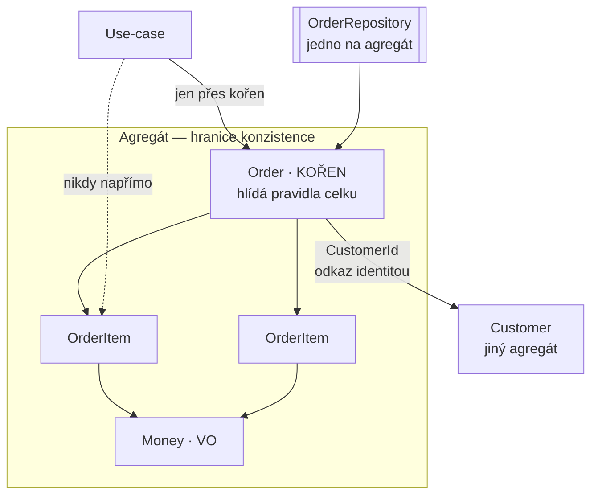

# Aggregate (Agregát)

> [← zpět na DDD](../)

> **V jedné větě:** Skupina objektů, která se mění jako jeden celek — má jediný vstup (kořen) a hlídá pravidla, která nedokáže uhlídat žádná její část sama.

---

## Problém

Model se rozpadl na objekty, ale nikdo neřekl, **které z nich patří k sobě**. Každý má vlastní repository, každý se dá načíst a uložit zvlášť — a tím pádem se dá porušit každé pravidlo, které platí pro víc než jeden z nich.

**Poznáš to podle:**

- **každá entita má vlastní repository**, i ta, která bez své „matky“ nedává smysl
- pravidlo typu „součet položek nesmí přesáhnout limit“ nejde nikde vynutit
- načtení jednoho objektu **stáhne půl databáze**, protože drží odkazy na odkazy
- nikdo neví, **co má obalit transakce**
- smazání objednávky nechá osiřelé položky
- dva požadavky současně změní různé části téže věci a jedna změna zmizí
- v `if`ech se opakuje kontrola, kterou má dělat model

```php
// Před: položka má vlastní repository — a tím i vlastní cestu dovnitř
$item = $itemRepository->get('MON-27');
$item->changeQuantity(10);
$itemRepository->save($item);

// Limit objednávky? Stav objednávky? Maximální počet položek?
// Nikdo se nezeptal — objednávka o téhle změně vůbec neví.
```

Demo přesně tohle předvádí:

```
5. Co udělá repository pro vnitřní entitu
    před:  3 ks × 7 990 Kč = 23 970 Kč
    po:   10 ks × 7 990 Kč = 79 900 Kč

    Limit? Stav objednávky? Počet položek? Nikdo se nezeptal —
    kořen o té změně vůbec neví. Agregát se právě rozpadl.
```

Agregáty se v praxi nerozpadají velkým rozhodnutím. Rozpadají se **jednou drobnou optimalizací**, která vypadá neškodně.

---

## Řešení

Vyznač hranici. Uvnitř je skupina objektů, která se mění společně; ven vede jediné dveře — **kořen agregátu**.



Čtyři pravidla, která z toho plynou. První je definice, zbylé tři jsou praxe:

| Pravidlo | Proč |
| -------- | ---- |
| **Chraň skutečné invarianty uvnitř hranice** | To, co musí platit **vždycky**, musí jít vynutit na jednom místě |
| **Navrhuj agregáty malé** | Velký agregát načítá zbytečně mnoho a blokuje souběžné změny |
| **Na cizí agregáty odkazuj identitou** | Ne objektem — jinak se hranice slije a načte se půl databáze |
| **Jedna transakce = jeden agregát** | Přes hranici se konzistence dohání až potom, ne v témže zápisu |

### Invariant celku je to, co žádná část nevidí

Tohle je celý důvod, proč hranice existuje. Položka objednávky je sama o sobě naprosto v pořádku — neplatný je až **součet**, a ten nevidí žádná položka:

```
zkusíme přidat 4 monitory za 31 960 Kč
Hodnota 59 960 Kč přesahuje schválený limit 50 000 Kč.
```

Kořen je jediné místo, které na celek vidí. Proto je taky jediné, kudy se dovnitř smí.

Praktický důsledek: když změna invariant poruší, musí se **vrátit zpátky**, ne zůstat v půlce:

```php
public function changeQuantity(string $sku, int $quantity): void
{
    $item = $this->itemBySku($sku);
    $originalQuantity = $item->quantity();

    $item->changeQuantity($quantity);

    try {
        $this->assertWouldStayValid($this->items);
    } catch (\DomainException $e) {
        $item->changeQuantity($originalQuantity);   // invariant vyhrává

        throw $e;
    }
}
```

### Malý agregát je skoro vždycky ten správný

Nejčastější chyba v praxi, a je to chyba drahá. Velký agregát je lákavý, protože „to všechno spolu přece souvisí“ — jenže:

- **načítá se celý**, i když měníš jednu věc
- **blokuje souběžné změny**: dva lidé pracují na různých částech a jeden přijde o práci
- **roste**, protože do něj není důvod nepřidávat

Kontrolní otázka není *„souvisí to spolu?“* (souvisí skoro všechno), ale:

> **Musí to platit ve stejném okamžiku, nebo stačí za chvíli?**

Musí platit hned → jeden agregát. Stačí za chvíli → dva agregáty a [eventuální konzistence](../../Architecture/CQRS/#škála-na-které-si-vyber).

Příklad: *počet položek objednávky nesmí přesáhnout 20* musí platit hned → jeden agregát. *Zákazníkův počet objednávek za měsíc* stačí spočítat za chvíli → objednávka a zákazník jsou dva agregáty.

### Cizí agregát jen přes identitu

```php
private function __construct(
    public readonly OrderId $id,
    public readonly CustomerId $customerId,   // ← identita, ne objekt Customer
    // …
) {
}
```

Kdyby objednávka držela objekt `Customer`, stalo by se trojí: načetla by se s ním jeho data (a s nimi možná další objekty), vznikla by otázka, kdo ho smí měnit, a hranice mezi objednávkou a zákazníkem by se rozmazala.

Odkaz identitou tyhle otázky ruší najednou. Když potřebuješ o zákazníkovi něco vědět, načteš si ho **zvlášť, přes jeho repository**.

### Jedno repository na agregát

Přímý důsledek: [repository](../../PoEAA/Repository/) existuje **jen pro kořeny**. Vnitřní entita svoje repository mít nesmí — jinak vzniká druhá cesta dovnitř, která obchází všechna pravidla.

Zní to jako formalita, dokud to někdo neporuší v šesté sekci demo výstupu výše.

---

## Účastníci

| Role | V příkladu | Odpovědnost |
| ---- | ---------- | ----------- |
| **Kořen agregátu** | `Order` | Jediný vstup; hlídá invarianty celku |
| **Vnitřní entita** | `OrderItem` | Má identitu uvnitř agregátu, ale **žádné vlastní repository** |
| **Hodnoty uvnitř** | částka, SKU | [Value objecty](../ValueObject/); žijí a umírají s agregátem |
| **Odkaz ven** | `CustomerId` | Identita cizího agregátu, nikdy jeho objekt |
| **Repository** | `OrderRepository` | Jedno na agregát; pracuje jen s kořenem |

---

## Implementace v PHP

Kořen drží vnitřní entity **privátně** a nabízí operace, ne přístup:

```php
final class Order
{
    private const int MAX_ITEMS = 20;

    /** @var list<OrderItem> */
    private array $items = [];

    private function __construct(
        public readonly OrderId $id,
        public readonly CustomerId $customerId,
        private readonly int $approvedLimitInCents,
        private string $status,
    ) {
    }

    public function addItem(string $sku, string $productName, int $unitPriceInCents, int $quantity): void
    {
        $this->assertModifiable();

        $item = new OrderItem($sku, $productName, $unitPriceInCents, $quantity);

        // Ověř na kopii seznamu DŘÍV, než se agregát změní.
        $this->assertWouldStayValid([...$this->items, $item]);

        $this->items[] = $item;
    }

    /** @param list<OrderItem> $items */
    private function assertWouldStayValid(array $items): void
    {
        if (count($items) > self::MAX_ITEMS) {
            throw new \DomainException(sprintf('Objednávka smí mít nejvýš %d položek.', self::MAX_ITEMS));
        }

        $total = array_sum(array_map(static fn (OrderItem $i): int => $i->total(), $items));

        if ($total > $this->approvedLimitInCents) {
            throw new \DomainException('Hodnota přesahuje schválený limit.');
        }
    }
}
```

### Nevydávej vnitřek ven

Past, do které se spadne snadno. Kdyby kořen vracel pole svých položek, mohl by volající zavolat `$items[0]->changeQuantity()` **mimo kořen** — a obejít tím všechno:

```php
// Špatně: reference ven = druhá cesta dovnitř
public function items(): array { return $this->items; }

// Lépe: ven jde jen popis, ne objekty
/** @return list<array{sku: string, name: string, quantity: int, total: int}> */
public function itemSummary(): array { /* … */ }
```

V produkci by tady byl spíš čtecí model ([CQRS](../../Architecture/CQRS/)), protože právě tohle je typický případ, kdy se zápisový model ohýbá kvůli zobrazení.

### Jak velký agregát vlastně je

Konkrétní vodítko, když si nejsi jistý:

| Signál | Znamená |
| ------ | ------- |
| Agregát načítá stovky objektů | Moc velký — rozděl |
| Dva uživatelé si pravidelně přepisují změny | Moc velký — rozděl |
| Musíš měnit dva agregáty v jedné transakci | Možná moc malý — nebo tam patří eventuální konzistence |
| Vnitřní entita by potřebovala vlastní repository | Moc velký — ta entita je nejspíš vlastní agregát |
| Invariant nejde vynutit, protože části jsou jinde | Moc malý — hranice vede jinudy |

---

## Kdy použít

- ✅ Existuje pravidlo, které platí **pro víc objektů dohromady** a musí platit vždycky.
- ✅ Skupina objektů se **mění a maže společně** (položky bez objednávky nedávají smysl).
- ✅ Potřebuješ vědět, **co má obalit transakce**.
- ✅ Máš souběžné změny a potřebuješ jasnou jednotku zamykání.

## Kdy nepoužít

- ❌ **Objekty spolu jen souvisejí.** Souvisí spolu skoro všechno; agregát je o **konzistenci**, ne o příbuznosti.
- ❌ **Pravidlo stačí splnit „za chvíli“.** Pak jde o dva agregáty a eventuální konzistenci.
- ❌ **Jde o čtení.** Čtecí strana hranice agregátů směle překračuje a smí to — nic nemění. Viz [CQRS](../../Architecture/CQRS/).
- ❌ **Doména je jen CRUD.** Bez invariantů není co hlídat a hranice by byla jen složka navíc.

---

## Časté chyby

| Chyba | Proč vadí | Jak správně |
| ----- | --------- | ----------- |
| **Repository pro vnitřní entitu** | Druhá cesta dovnitř obchází všechna pravidla celku | Repository **jen** pro kořeny |
| Agregát drží objekt cizího agregátu | Načte se půl databáze a rozmaže se hranice | Odkaz `CustomerId`, ne `Customer` |
| Příliš velký agregát | Načítá zbytečně, blokuje souběžné změny, roste bez brzdy | Musí to platit hned? Ne → dva agregáty |
| Kořen vrací pole svých entit | Volající je změní mimo kořen | Ven jde popis nebo čtecí model |
| Invariant se ověří až po změně a nevrátí se zpět | Agregát zůstane v neplatném stavu | Ověř na kopii, nebo změnu vrať |
| Jedna transakce mění tři agregáty | Zámky, konflikty a nejasná hranice selhání | Jeden agregát na transakci; zbytek událostí |
| Hranice podle databázových cizích klíčů | To je schéma, ne konzistence | Hranice podle invariantů |
| Agregát se ohýbá kvůli výpisu | Zápisový model přestane být zápisový | Čtecí model zvlášť |

---

## V praxi

- **Doctrine** — kaskády (`cascade: ['persist', 'remove']`) a `orphanRemoval` na kolekci uvnitř kořene jsou technická podoba hranice agregátu. Repository dělej jen pro kořeny.
- **Optimistické zamykání** — verze na kořeni, ne na vnitřních entitách. Agregát je jednotka souběžnosti.
- **[Doménové události](../DomainEvent/)** — standardní způsob, jak dohnat konzistenci mezi agregáty bez toho, abys je měnil v jedné transakci. Bez nich pravidlo „jedna transakce = jeden agregát“ nejde dodržet.
- **Vaughn Vernon: *Effective Aggregate Design*** — tři články, které jsou dodnes nejlepší praktický text na tohle téma. Kdo má navrhovat agregáty, ať si je přečte.

---

## Související patterny

| Pattern | Vztah |
| ------- | ----- |
| [Entity](../Entity/) | Stavební kámen. Agregát je skupina entit a hodnot, kde se jedna entita stane kořenem a začne hlídat pravidla celku. |
| [Value Object](../ValueObject/) | Tvoří vnitřek agregátu. Nemají vlastní životní cyklus — žijí a umírají s ním. |
| [Repository](../../PoEAA/Repository/) | **Jedno repository na agregát**, a jen pro kořen. Agregát určuje, pro co repository vůbec smí vzniknout. |
| [First Class Collection](../../ObjectCalisthenics/FirstClassCollection/) | Přirozený způsob, jak kořen drží své vnitřní entity — i s pravidly o skupině. |
| [CQRS](../../Architecture/CQRS/) | Hranice agregátu platí pro zápis. Čtecí strana ji překračuje, a smí to. |
| [Bounded Context](../BoundedContext/) | O úroveň výš: kontext obsahuje agregáty, agregát nikdy nepřesahuje kontext. |
| [Service Layer](../../PoEAA/ServiceLayer/) | To, co agregát obsluhuje. Pravidlo „jedna transakce = jeden agregát“ se vynucuje právě tam. |
| [Domain Event](../DomainEvent/) | **Chybějící díl.** Pravidlo „jedna transakce = jeden agregát“ potřebuje způsob, jak dohnat konzistenci mezi agregáty — a to jsou události. |
| [State](../../GoF/Behavioral/State/) | Životní cyklus kořene, když jsou přechodů víc než dva. |

---

## Vztah k principům

| Princip | Jak souvisí |
| ------- | ----------- |
| [Tell, Don't Ask](../../Principles/ObjectDesign.md#tell-dont-ask) | Kořenu se neptáš na položky, aby sis je upravil sám. Řekneš mu `addItem()` a on rozhodne, jestli to jde. |
| [Zákon Demeter](../../Principles/ObjectDesign.md#zákon-demeter-law-of-demeter) | `$order->items()[0]->changeQuantity()` je přesně ten řetěz, kterému hranice agregátu brání. |
| [SRP](../../Principles/SOLID.md#single-responsibility-principle-srp) | Kořen má jediný důvod ke změně: pravidla platná pro tenhle celek. |
| [Fail Fast](../../Principles/ObjectDesign.md#fail-fast) | Porušení invariantu vyhodí výjimku okamžitě, ne až při ukládání. |

---

## Demo

```bash
php DDD/Aggregate/demo/run.php
```

Postaví objednávku přes kořen, ukáže invariant, který nevidí žádná položka (součet proti limitu), vrácení změny, která by celek porušila, odkaz na zákazníka identitou — a hlavně **co udělá repository pro vnitřní entitu**: množství se změní z 3 na 10 kusů, aniž by se kdokoli zeptal na limit nebo na stav objednávky.

---

## Původ

|               |                                                    |
| ------------- | -------------------------------------------------- |
| **Zdroj**     | *Domain-Driven Design*, kapitola 6                  |
| **Autor**     | Eric Evans                                          |
| **Rok**       | 2003                                                |
| **Kategorie** | Taktické stavební bloky                             |
| **Obtížnost** | ●●●●○                                               |

Evans zavedl agregát jako odpověď na otázku, kterou objektový návrh do té doby neuměl zodpovědět: **kde končí objekt?** Když jsou objekty propojené odkazy, dá se z libovolného dojít skoro kamkoli — a pak není jasné, co se má načíst, co uložit, co obalit transakcí a kdo hlídá pravidla platná pro víc objektů najednou.

Jeho odpověď byla hranice a jediný vstup. Sám ale připouštěl, že **najít správnou velikost agregátu je nejtěžší část celého taktického návrhu**, a praxe mu dala za pravdu: nejčastější chyba není agregát nemít, ale mít ho příliš velký.

Zásadní doplněk přinesl **Vaughn Vernon** v sérii *Effective Aggregate Design* (2011), kde formuloval pravidla, která tenhle text používá — zejména **„navrhuj malé agregáty“** a **„na cizí agregáty odkazuj identitou“**. Jeho pozorování bylo, že týmy modelují agregáty podle toho, co spolu *souvisí*, místo podle toho, co musí být *konzistentní ve stejném okamžiku* — a že rozdíl mezi těmi dvěma otázkami rozhoduje o tom, jestli aplikace půjde škálovat.

---

## Zdroje

- Eric Evans: *Domain-Driven Design*, Addison-Wesley, 2003 — kapitola 6
- Vaughn Vernon: *Effective Aggregate Design*, 2011 — [dddcommunity.org/library/vernon_2011](https://www.dddcommunity.org/library/vernon_2011/)
- Vaughn Vernon: *Implementing Domain-Driven Design*, Addison-Wesley, 2013 — kapitola 10

---

<details>
<summary>Metadata patternu</summary>

```yaml
name: Aggregate
name_cs: Agregát
category: Taktické stavební bloky
source: DDD – Domain-Driven Design
authors: Eric Evans, Vaughn Vernon
year: 2003
difficulty: 4
tags: [hranice konzistence, invarianty, transakce, kořen agregátu, souběžnost]
principles: [TellDontAsk, LawOfDemeter, SRP, FailFast]
related: [Entity, ValueObject, Repository, FirstClassCollection, CQRS, BoundedContext, State]
status: done
```

</details>
