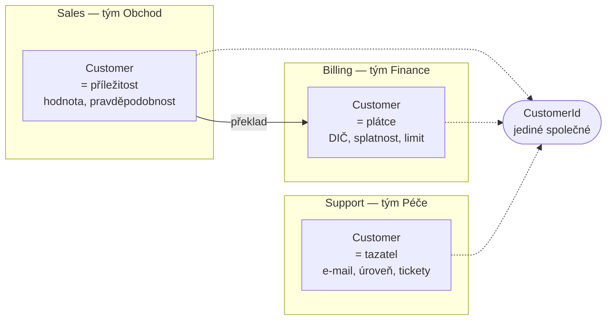

# Bounded Context (Ohraničený kontext)

> [← zpět na DDD](../)

> **V jedné větě:** Model platí jen uvnitř své hranice — a totéž slovo smí za hranicí znamenat něco úplně jiného, aniž by to byla chyba.

---

## Problém

Firma se snaží mít **jeden model pro všechno**. Zní to jako správná ambice: jedna pravda, žádná duplicita. V praxi to skončí modelem, který nepatří nikomu.

**Poznáš to podle:**

- entita `Customer` má čtyřicet vlastností a většina je `nullable`
- schůzka „co je to zákazník“ trvá dvě hodiny a neskončí dohodou
- změna kvůli fakturaci rozbije podporu, protože sdílejí tutéž třídu
- v modelu jsou pojmy jako `Party`, `Entity`, `Item`, `type` — model je tak obecný, že už nic neznamená
- dvě oddělení používají totéž slovo a **myslí jím něco jiného**, ale nikdo si toho nevšiml
- do třídy přibývají `if`y podle toho, „odkud to voláme“

```php
// Před: jeden model pro celou firmu
final class Customer
{
    public function __construct(
        public string $id,
        public string $name,

        public ?string $contactPerson = null,      // obchod
        public ?int $dealValueInCents = null,      // obchod
        public ?int $probabilityPercent = null,    // obchod

        public ?string $vatId = null,              // fakturace
        public ?int $paymentTermDays = null,       // fakturace
        public ?int $creditLimitInCents = null,    // fakturace

        public ?string $supportTier = null,        // podpora
        public ?int $openTickets = null,           // podpora

        public ?string $type = null,               // tohle už nikdo neví
        public ?bool $isActive = null,
    ) {
    }
}
```

Ta `nullable` pole nejsou nedbalost. Jsou to **místa, kde se model pokouší být třemi věcmi zároveň** — a v žádném konkrétním okamžiku nedávají smysl všechna.

---

## Řešení

Přiznej, že modelů je víc. Každý platí uvnitř své hranice, a **uvnitř té hranice má každý pojem právě jeden význam**.



Tři třídy se stejným jménem. **Není to duplicita** — jsou to tři různé pojmy, které se v češtině i v angličtině shodou okolností jmenují stejně.

Demo ta čísla ukazuje přesně:

```
Before\Customer:  16 vlastností, z toho 14 nullable
Sales\Customer:    6 vlastností, 0 nullable
Billing\Customer:  6 vlastností, 0 nullable
Support\Customer:  5 vlastností, 0 nullable
```

Žádný z těch tří modelů není neúplný. Každý je **úplný pro to, co se v jeho kontextu dělá**.

### Tohle není porušení DRY

Nejčastější námitka, a stojí za to ji vyvrátit pořádně, protože jinak tenhle pattern nikdo neprosadí.

[DRY](../../Principles/Simplicity.md#dry--dont-repeat-yourself) mluví o **znalosti**, ne o kódu. A kontrolní otázka zní: *když se změní jedno, musí se nutně změnit i druhé?*

- Změní se pravidlo pro úvěrový limit → mění se **jen** fakturace.
- Změní se výpočet vážené hodnoty příležitosti → mění se **jen** obchod.
- Změní se lhůta na odpověď u platinové úrovně → mění se **jen** podpora.

Odpověď je třikrát ne. **Jsou to tři nezávislé znalosti**, a proto je sloučit do jednoho modelu není dodržení DRY, ale jeho učebnicové porušení naruby — vytvoření [špatné abstrakce](../../Principles/Simplicity.md#falešné-porušení-dry--a-tam-vzniká-škoda) v měřítku celé firmy.

### Jak hranici najít

Hranice se nevymýšlí u whiteboardu podle databázového schématu. Hledá se podle **toho, jak lidé mluví**:

| Signál | Co znamená |
| ------ | ---------- |
| **Totéž slovo, jiný význam** | Nejsilnější signál vůbec. Kde se význam láme, tam vede hranice. |
| **Jiný tým** | Conwayův zákon platí. Hranice, která nekopíruje vlastnictví, se neudrží. |
| **Jiný rytmus změn** | Katalog se mění denně, fakturace čtvrtletně. Držet je spolu znamená brzdit jedno druhým. |
| **Jiný životní cyklus dat** | Příležitost žije týdny, faktura deset let ze zákona. |
| **Jiná pravidla pro totéž** | „Aktivní zákazník“ znamená v obchodu a v podpoře jiný stav. |

Naopak **špatné** vodítko je databázová tabulka. Že leží data v jedné tabulce, neznamená, že patří do jednoho modelu — často to znamená jen to, že hranice ještě nikdo nenašel.

### Hranice není mikroslužba

Nejčastější zdroj zmatku. Bounded context je hranice **významu**, ne nasazení.

| | Bounded context | Mikroslužba |
| --- | --- | --- |
| Co ohraničuje | Význam pojmů, model | Nasazení a běh |
| Kde může žít | Modul v monolitu, balíček, schéma, služba | Vlastní proces |
| Kolik jich bývá | Podle domény | Podle provozních potřeb |

**V monolitu bounded context dává perfektní smysl** — je to modul s vynucenou hranicí, a vynucuje se stejně jako u [Ports & Adapters](../../Architecture/PortsAndAdapters/): pravidlem v CI, ne domluvou. Naopak služba, která obsahuje tři konteksty, je jen menší monolit.

Doporučené pořadí: **napřed najdi kontexty v monolitu, teprve pak zvaž, které z nich se vyplatí oddělit i provozně.** Opačné pořadí vyrábí distribuovaný monolit.

### Překlad na hranici

Data hranici překračují **překladem, ne kopií**. Demo to ukazuje na uzavřeném obchodu, ze kterého se ve fakturaci stane plátce:

```
ze Sales se přeneslo:  identita, jméno firmy
Sales o tom neví:      DIČ, adresa, splatnost
Billing si dopočítal:  limit 24 000 Kč (pravidlo fakturace, ne obchodu)
zahodilo se:           pravděpodobnost, account manager, kontaktní osoba
```

A jedno pravidlo o vlastnictví, které rozhoduje o tom, jestli hranice vydrží:

> **Překlad vlastní příjemce, ne odesílatel.**

Kdyby překlad vlastnil obchod, musel by znát fakturační model — a hranice by tím fakticky zmizela. Když ho vlastní fakturace, obchod o ní nemusí vědět nic.

Jakou podobu ten překlad má a kdo z toho vyjde hůř, řeší **[Context Map](../ContextMap/)**.

---

## Účastníci

| Role | V příkladu | Odpovědnost |
| ---- | ---------- | ----------- |
| **Kontext** | `Sales`, `Billing`, `Support` | Uzavřený model; uvnitř má každý pojem jeden význam |
| **Jednotný jazyk** | „příležitost“ × „plátce“ × „tazatel“ | Slovník platný uvnitř jednoho kontextu |
| **Sdílená identita** | `Shared\CustomerId` | To málo, na čem se kontexty shodnou — a je to **sdílené jádro** |
| **Překladač** | `Billing\PayerFromWonDeal` | Převod přes hranici; vlastní ho **příjemce** |
| **Vlastník** | tým | Bez vlastníka hranice nevydrží |

---

## Implementace v PHP

Hranice musí být vidět ve struktuře, ne jen v hlavě:

```
src/
    Sales/
        Domain/Customer.php          „zákazník“ = příležitost
    Billing/
        Domain/Customer.php          „zákazník“ = plátce
        Translation/PayerFromWonDeal.php
    Support/
        Domain/Customer.php          „zákazník“ = tazatel
    Shared/
        CustomerId.php               vědomé sdílené jádro
```

Tři třídy `Customer` ve třech jmenných prostorech. To je záměr, ne nepořádek.

Model jednoho kontextu — všimni si, že **nemá jediné nullable pole**:

```php
namespace Sales;

final readonly class Customer
{
    public function __construct(
        public CustomerId $id,
        public string $companyName,
        public string $contactPerson,
        public int $dealValueInCents,
        public int $probabilityPercent,
        public string $accountManager,
    ) {
    }

    /** Pojem, který existuje jen v tomhle kontextu. */
    public function weightedValue(): int
    {
        return intdiv($this->dealValueInCents * $this->probabilityPercent, 100);
    }
}
```

Překlad na hranici, vlastněný příjemcem:

```php
namespace Billing;

use Sales\Customer as SalesCustomer;

final readonly class PayerFromWonDeal
{
    public function translate(SalesCustomer $wonDeal, string $vatId, string $billingAddress): Customer
    {
        return new Customer(
            id: $wonDeal->id,
            legalName: $wonDeal->companyName,
            vatId: $vatId,                                   // obchod nezná
            billingAddress: $billingAddress,
            paymentTermDays: 14,                             // pravidlo fakturace
            creditLimitInCents: $this->initialCreditLimit($wonDeal),
        );
    }
}
```

### Jak hranici vynutit

Domluva nestačí; za půl roku tam bude první `use Sales\Customer` uprostřed fakturace. Vynucuje se to stejně jako směr závislostí u [Ports & Adapters](../../Architecture/PortsAndAdapters/):

- **[deptrac](https://github.com/qossmic/deptrac)** nebo PHPStan pravidlo v CI: `Billing/` smí importovat ze `Sales/` **jen ve složce `Translation/`**
- oddělené databázové schéma nebo aspoň prefix tabulek
- **vlastní `CustomerId` typ**, když si můžeš dovolit ani identitu nesdílet

---

## Kdy použít

- ✅ **Totéž slovo znamená v různých částech firmy různé věci** — nejsilnější signál.
- ✅ Model roste o `nullable` pole, protože se do něj cpou potřeby víc oddělení.
- ✅ Na aplikaci pracuje **víc týmů** a šlapou si po modelu.
- ✅ Různé části se mění **různým tempem**.
- ✅ Chystáte se dělit monolit a potřebujete vědět **kudy**.

## Kdy nepoužít

- ❌ **Malá aplikace, jeden tým, jedna doména.** Bez jazykového rozporu není co dělit; dostaneš jen složky navíc.
- ❌ **Hranice podle databázových tabulek.** To nejsou kontexty, to je schéma.
- ❌ **Kontext na každou entitu.** Kontext má obsáhnout ucelenou oblast, ne jednu třídu.
- ❌ **Jako záminka pro mikroslužby.** Nejdřív hranice v monolitu, pak teprve zvaž rozdělení provozní.

---

## Časté chyby

| Chyba | Proč vadí | Jak správně |
| ----- | --------- | ----------- |
| Snaha o jeden „kanonický“ model firmy | Skončí u čtyřiceti nullable polí a modelu, který nepatří nikomu | Víc modelů, každý úplný pro svůj kontext |
| Sloučení tří modelů „kvůli DRY“ | Záměna kódu za znalost; vzniká špatná abstrakce v měřítku firmy | [Kontrolní otázka DRY](../../Principles/Simplicity.md#dry--dont-repeat-yourself): musí se to změnit nutně spolu? |
| Hranice bez vlastníka | Nikdo ji nehájí, do půl roku je pryč | Jeden kontext = jeden tým, který o něm rozhoduje |
| Sdílené jádro vzniklé omylem | „Jen ta jedna třída“ se stane závazkem pro všechny týmy | Sdílené jádro musí být **vědomé, minimální a někým vlastněné** |
| Překlad vlastní odesílatel | Musí znát cizí model; hranice fakticky mizí | Překlad vlastní **příjemce** |
| Hranice se hlídá jen domluvou | První `use` přes hranici nikdo nezachytí | Pravidlo v CI |
| Kontext = mikroslužba automaticky | Distribuovaný monolit se všemi nevýhodami obojího | Nejdřív hranice v kódu, provozní dělení až potom |
| Ztotožnění kontextu s modulem podle vrstev | `Entity/`, `Service/`, `Controller/` nejsou kontexty | Členění podle **domény**, ne podle technické vrstvy |

---

## V praxi

- **Composer balíčky nebo adresářové moduly** — nejlevnější hranice v monolitu.
- **deptrac / PHPStan** — jediný způsob, jak hranici udržet déle než půl roku.
- **Oddělené schéma nebo prefix tabulek** — zabrání tomu, aby si kontexty sahaly do dat přes `JOIN`.
- **U nás** — [každá služba na platformě](../../Glossary.md#služba-na-platformě) je bounded context; [DX zprávy](../../Glossary.md#dx-zpráva) a [SDK](../../Glossary.md#sdk-balíček) jsou právě ten překlad na hranici. Že „objednávka“ znamená v každé službě trochu něco jiného, je vlastnost, ne nedostatek.

---

## Související patterny

| Pattern | Vztah |
| ------- | ----- |
| [Context Map](../ContextMap/) | **Přímé pokračování.** Bounded Context řekne, kde jsou hranice; Context Map, jaké vztahy mezi nimi panují a kdo se komu přizpůsobuje. Jeden bez druhého nedává smysl. |
| [Ports & Adapters](../../Architecture/PortsAndAdapters/) | Hranice kontextu je hranice aplikace; překladač na hranici je řízený adaptér. Vynucuje se stejným nástrojem. |
| [Anticorruption Layer](../AnticorruptionLayer/) (DDD) | Nejsilnější podoba překladu na hranici — když se model aktivně brání cizímu, ne jen převádí tvary dat. |
| [Repository](../../PoEAA/Repository/) | Každý kontext má vlastní repository pro vlastní model, i když je pod tím jedna databáze. |
| [CQRS](../../Architecture/CQRS/) | Aplikuje se **uvnitř** jednoho kontextu, ne přes hranice. |
| [Aggregate](../Aggregate/) | O úroveň níž: kontext obsahuje agregáty, agregát nikdy nepřesahuje kontext. |
| [Domain Service](../DomainService/) | Platí pro ni totéž: doménová služba smí sáhnout na víc agregátů, ale **jen uvnitř svého kontextu**. |
| [Value Object](../ValueObject/) | `CustomerId` je hodnota, kterou kontexty sdílejí — a i to je vědomé rozhodnutí. |

---

## Vztah k principům

| Princip | Jak souvisí |
| ------- | ----------- |
| [DRY](../../Principles/Simplicity.md#dry--dont-repeat-yourself) | **Klíčové a nejčastěji zaměňované.** Tři modely `Customer` nejsou porušení DRY — jsou to tři nezávislé znalosti. Sloučit je znamená vyrobit špatnou abstrakci v měřítku celé firmy. |
| [SRP](../../Principles/SOLID.md#single-responsibility-principle-srp) | SRP v měřítku architektury: kontext se má měnit z jedné skupiny důvodů — těch, které přicházejí od jednoho týmu a jedné části byznysu. |
| [Zviditelni implicitní](../../Principles/ObjectDesign.md#zviditelni-implicitní) | Hranice v hlavách lidí existovala vždycky. Pattern ji jen zapíše do struktury kódu. |

---

## Demo

```bash
php DDD/BoundedContext/demo/run.php
```

Ukáže tutéž firmu ve třech kontextech (kde je „zákazník“ pokaždé jiný pojem), spočítá přes reflexi, kolik nullable polí by měl jeden sloučený model, a předvede překlad na hranici — co se přenese, co zahodí a co si příjemce dopočítá sám.

Demo má **složky a jmenné prostory**, protože hranice je celý pattern.

---

## Původ

|               |                                                       |
| ------------- | ----------------------------------------------------- |
| **Zdroj**     | *Domain-Driven Design*, část IV — Strategický návrh    |
| **Autor**     | Eric Evans                                             |
| **Rok**       | 2003                                                   |
| **Kategorie** | Strategický návrh                                      |
| **Obtížnost** | ●●●●○                                                  |

Evans napsal strategickou část knihy jako poslední a sám později říkal, že je z celé knihy nejdůležitější — a nejpřehlíženější. Většina čtenářů se zastavila u taktických bloků (entity, agregáty, repository), protože ty jdou použít hned odpoledne. Bounded Context vyžaduje dohodu mezi lidmi, a to je práce, kterou nejde odbýt refaktoringem.

Motivace byla pozorování z praxe: velké projekty selhávaly ne proto, že by měly špatné třídy, ale proto, že se snažily udržet **jeden model pro celou organizaci**. Takový model musí vyhovět všem, a proto nakonec nevyhovuje nikomu — Evans mu říkal, že se rozpadne pod vlastní vahou.

Pattern zestárl výborně. Když o deset let později přišla vlna mikroslužeb, ukázalo se, že otázka „kudy tu aplikaci rozdělit“ už měla odpověď z roku 2003 — a týmy, které ji ignorovaly a dělily podle technických vrstev, si vyrobily distribuovaný monolit.

---

## Zdroje

- Eric Evans: *Domain-Driven Design*, Addison-Wesley, 2003 — kapitola 14
- Vaughn Vernon: *Implementing Domain-Driven Design*, Addison-Wesley, 2013 — kapitola 2
- Martin Fowler: *BoundedContext*, 2014 — [martinfowler.com/bliki/BoundedContext.html](https://martinfowler.com/bliki/BoundedContext.html)

---

<details>
<summary>Metadata patternu</summary>

```yaml
name: BoundedContext
name_cs: Ohraničený kontext
category: Strategický návrh
source: DDD – Domain-Driven Design
authors: Eric Evans
year: 2003
difficulty: 4
tags: [strategický návrh, hranice, jednotný jazyk, modularizace, týmy]
principles: [DRY, SRP]
related: [ContextMap, PortsAndAdapters, AnticorruptionLayer, Repository, CQRS, ValueObject]
status: done
```

</details>
