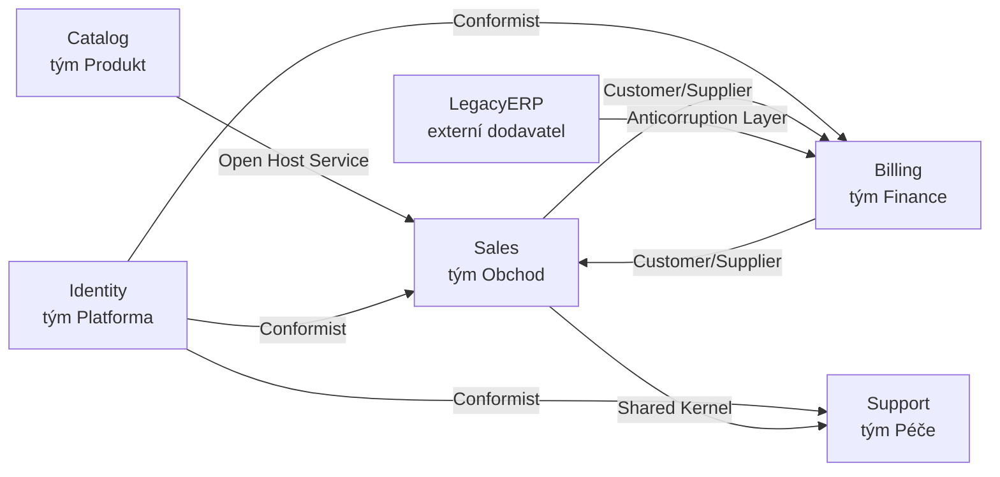

# Context Map (Mapa kontextů)

> [← zpět na DDD](../)

> **V jedné větě:** Přehled toho, jaké [ohraničené kontexty](../BoundedContext/) existují a **kdo se komu musí přizpůsobit** — protože integrace není otázka technologie, ale otázka moci.

---

## Problém

Kontexty (nebo služby) máte. Co s nimi ale je, neví nikdo celé — každý zná jen svůj kousek a to, co s ním sousedí.

**Poznáš to podle:**

- na otázku „když tohle změním, koho rozbiju?“ neumí odpovědět nikdo
- integrace vzniká **ad hoc, dvojice po dvojici**, pokaždé jinak
- existuje sdílená knihovna, na které závisí všichni a **nikdo ji nevlastní**
- nováček netuší, jestli smí sáhnout do modelu, který používá i cizí tým
- dvě služby na sobě závisí navzájem a nejde vydat jedna bez druhé
- diagram architektury existuje, ale je z předloňska a nikdo mu nevěří
- cizí datový model prosákl do vaší domény a nikdo neví kdy

Tenhle problém nejde vyřešit v kódu, protože **není v kódu**. Je ve vztazích mezi týmy — a proto potřebuje vlastní artefakt.

---

## Řešení

Nakresli mapu. Ne architektonický diagram s krabičkami a šipkami „posílá data“, ale mapu, kde je u každé dvojice napsané, **jaký mezi nimi panuje vztah** a **kdo se komu přizpůsobuje**.



Šipka vede od **nadřazeného** (upstream) k **podřízenému** (downstream). A pozor na nejčastější omyl:

> Nadřazený je ten, jehož **rozhodnutí ovlivňují toho druhého** — ne ten, odkud tečou data.

Když ti služba posílá zprávy a ty se musíš přizpůsobit jejímu formátu, je nadřazená. Když si formát diktuješ ty a ona ho dodá, jsi nadřazený ty, i když data tečou opačně.

### Katalog vztahů

Evansových sedm vztahů. Nejsou to technologie — každý z nich je odpověď na otázku, **kolik moci máš a kolik ochrany si můžeš dovolit**:

| Vztah | Co znamená | Zeptej se |
| ----- | ---------- | --------- |
| **Partnership** | Dva týmy stojí a padají spolu, koordinují releasy | Selžeme nebo uspějeme spolu? |
| **Shared Kernel** | Sdílený kus modelu ve společném vlastnictví | **Kdo ho vlastní?** |
| **Customer/Supplier** | Nadřazený se plánovaně přizpůsobuje potřebám podřízeného | Bude nám vycházet vstříc? |
| **Conformist** | Podřízený přebírá cizí model tak, jak je | Unesu jejich model uvnitř svého? |
| **Anticorruption Layer** | Podřízený se brání překladem, aby cizí model nepronikl dovnitř | Kolik mě stojí bránit se? |
| **Open Host Service** | Nadřazený publikuje obecný kontrakt pro mnoho konzumentů | Mám dost konzumentů, aby se to vyplatilo? |
| **Separate Ways** | Žádná integrace | Opravdu tu integraci potřebujeme? |

### Conformist nebo antikorupční vrstva

Nejčastější reálné rozhodnutí, které z mapy vypadne. Jsi podřízený a nemáš páku — buď cizí model spolkneš, nebo se před ním budeš bránit:

| | **Conformist** | **Anticorruption Layer** |
| --- | --- | --- |
| Co uděláš | Použiješ jejich model jako svůj | Přeložíš si ho na vlastní pojmy |
| Cena hned | Žádná | Překladová vrstva navíc |
| Cena později | Cizí pojmy jsou ti v doméně napořád | Údržba překladu při každé jejich změně |
| Kdy volit | Model je rozumný a blízký tvému; jde o okrajovou oblast | Model je cizí, starý nebo se často mění; jde o tvoje jádro |

Pravidlo palce: **čím blíž je to k jádru tvé domény, tím spíš se braň.** Kolem `LegacyERP` a jeho XML ano; kolem číselníku zemí ne.

### Shared Kernel je ten nejnebezpečnější

Vypadá nejrozumněji — proč psát dvakrát totéž? A právě proto vzniká nejčastěji omylem, jako „jen ta jedna sdílená třída“.

Problém není technický, je vlastnický. **Sdílené jádro je závazek:** kdo ho změní, změní ho všem, a proto ho nikdo nezmění bez dohody — takže se nakonec nezmění vůbec a všichni ho obcházejí. Když už ho zavádíš, musí být:

1. **Vědomý** — napsaný v mapě, ne vzniklý shodou okolností
2. **Minimální** — identita a číselníky ano, doménové chování ne
3. **Vlastněný** — jeden tým rozhoduje, ostatní připomínkují
4. **Testovaný oběma stranami** — jinak se rozejde

### Mapuj realitu, ne přání

Evansovo pravidlo číslo jedna a nejčastěji porušované: **nejdřív nakresli, jak to je.** Ne jak by to mělo být, ne cílový stav.

Mapa současného stavu je totiž ta užitečná — ukáže, kde se šlape na kuří oka, kde je cyklus a kdo tiše nese cizí model. Cílová mapa bez té současné je jen zbožné přání a nikoho k ničemu nezaváže.

### Mapa jako kód

Mapa nakreslená v diagramovém nástroji zastará během měsíce, protože ji nikdo nekomentuje v pull requestu. Řešení je držet ji **jako data v repozitáři** — pak se mění spolu se změnou, dá se revidovat a dá se z ní generovat.

Demo z toho kromě obrázku vytáhne i kontroly:

```
⚠ CONFORMIST: Sales přebírá model Identity bez překladu — cizí pojmy se dostanou dovnitř.
⚠ SHARED KERNEL mezi Sales a Support — kdo ho vlastní? Změna zasáhne oba týmy naráz.
⚠ Identity má 3 konzumentů a nepublikuje kontrakt — zvaž Open Host Service.
⚠ Analytics nemá žádný vztah — je to opravdu Separate Ways, nebo se na něj zapomnělo?
⚠ CYKLUS: Billing → Sales → Billing — vzájemná závislost, nelze vydávat nezávisle.
```

**Nic z toho není chyba, kterou by šlo najít v kódu.** Všechno to jsou rozhodnutí, o kterých se má vědět — a která si na obrázku v konfluenci nikdo nevšimne.

---

## Účastníci

| Role | V příkladu | Odpovědnost |
| ---- | ---------- | ----------- |
| **Kontext** | `Sales`, `Billing`, … | Uzel mapy; má jméno, tým a vlastní jazyk |
| **Vztah** | `Relationship` | Dvojice, směr a **typ vztahu** |
| **Typ vztahu** | `RelationshipType` | Sedm Evansových odpovědí na „kdo se komu přizpůsobí“ |
| **Mapa** | `ContextMap` | Celek; umí vykreslit i upozornit na rizika |
| **Vlastník** | tým | U každého kontextu; bez něj se vztahy nedají vyjednávat |

---

## Implementace v PHP

Vztah nese směr, typ a poznámku — víc nepotřebuje:

```php
final readonly class Relationship
{
    public function __construct(
        public string $upstream,
        public string $downstream,
        public RelationshipType $type,
        public string $note,
    ) {
    }
}
```

Mapa jako data, která se revidují v pull requestu:

```php
$map = new ContextMap(
    contexts: [
        new Context('Sales', 'tým Obchod', 'příležitost s pravděpodobností'),
        new Context('Billing', 'tým Finance', 'plátce s DIČ a limitem'),
        // …
    ],
    relationships: [
        new Relationship('Catalog', 'Sales', RelationshipType::OpenHostService, 'REST API se sémantickou verzí'),
        new Relationship('Identity', 'Sales', RelationshipType::Conformist, 'přebíráme jejich User beze změny'),
        new Relationship('LegacyERP', 'Billing', RelationshipType::AnticorruptionLayer, 'překlad jejich XML'),
        // …
    ],
);
```

A kontroly, které z mapy vypadnou samy:

```php
foreach ($this->contexts as $context) {
    $consumers = $this->downstreamOf($context->name);

    $publishes = array_filter(
        $consumers,
        static fn (Relationship $r): bool => $r->type === RelationshipType::OpenHostService,
    );

    if (count($consumers) >= 3 && $publishes === []) {
        $risks[] = sprintf(
            '%s má %d konzumentů a nepublikuje kontrakt — zvaž Open Host Service.',
            $context->name,
            count($consumers),
        );
    }
}
```

Existuje na to i hotový nástroj — **[Context Mapper](https://contextmapper.org/)** s vlastním DSL a generováním diagramů. Ukázka v demu je stostránková verze téhož nápadu; smysl je ukázat, že mapa **může být artefakt, ne obrázek**.

---

## Kdy použít

- ✅ Máte **víc než dva** ohraničené kontexty nebo služby.
- ✅ Pracuje na nich **víc týmů** a je potřeba vyjednávat kontrakty.
- ✅ Integrujete se s **cizím nebo starým systémem** a řešíte, kolik z něj pustit dovnitř.
- ✅ Chystáte dělení monolitu a potřebujete vidět, které vazby to rozetne.
- ✅ Nováček se má zorientovat rychleji než za tři měsíce.

## Kdy nepoužít

- ❌ **Jeden kontext.** Mapa jednoho uzlu není mapa.
- ❌ **Jako náhrada za rozhovor.** Mapa je zápis dohody, ne dohoda sama. Nakreslit ji bez týmů, kterých se týká, je ztráta času.
- ❌ **Jako cílový stav bez toho současného.** Zbožné přání nikoho nezaváže.
- ❌ **Když ji nikdo nebude udržovat.** Zastaralá mapa je horší než žádná — lidé podle ní rozhodují.

---

## Časté chyby

| Chyba | Proč vadí | Jak správně |
| ----- | --------- | ----------- |
| Šipka znamená „tečou data“ | Mapa pak neříká nic o tom, kdo se komu přizpůsobuje | Šipka = **směr závislosti a moci** |
| U vztahu chybí typ | Zbyla krabičková architektura; přínos mapy je právě v pojmenování vztahu | Každý vztah má jeden ze sedmi typů |
| Sdílené jádro bez vlastníka | Nikdo ho nezmění bez dohody, takže se nezmění a všichni ho obcházejí | Vlastník, minimální rozsah, testy z obou stran |
| Conformist zvolený z lenosti | Cizí model se usadí v tvém jádru napořád | U jádra domény se braň, u okraje spolkni |
| Mapa cílového stavu bez současného | Nejde z ní poznat, co bolí dnes | Nejdřív realita, pak plán |
| Mapa v nástroji na obrázky | Za měsíc zastará, protože ji nikdo nepřipomínkuje | Mapa jako data v repozitáři |
| Nezmapované cykly | Dvě služby nejdou vydat nezávisle a nikdo neví proč | Cyklus najdi a rozetni (událost místo volání) |
| Kontexty bez jmen týmů | Nedá se vyjednávat s nikým konkrétním | U každého kontextu vlastník |

---

## V praxi

- **[Context Mapper](https://contextmapper.org/)** — DSL pro mapu kontextů s generováním diagramů. Když to chcete pořádně a nechcete si to psát.
- **Mermaid v README** — nejlevnější varianta, která vydrží: obrázek se vykreslí přímo na GitHubu a mění se v pull requestu.
- **ADR (Architecture Decision Records)** — k mapě patří zdůvodnění, proč je zrovna tenhle vztah zrovna takový.
- **OpenAPI a verzované kontrakty** — technická podoba Open Host Service.
- **U nás** — [SDK balíčky](../../Glossary.md#sdk-balíček) jsou v podstatě Open Host Service (publikovaný kontrakt pro víc konzumentů), [DX zprávy](../../Glossary.md#dx-zpráva) publikovaný jazyk. Většina vztahů na platformě je Customer/Supplier — a stojí za to si pojmenovat ty, které jím **nejsou**.

---

## Související patterny

| Pattern | Vztah |
| ------- | ----- |
| [Bounded Context](../BoundedContext/) | **Předpoklad.** Nejdřív musíš vědět, jaké kontexty máš; mapa teprve popisuje vztahy mezi nimi. Bez hranic není co mapovat. |
| [Anticorruption Layer](../AnticorruptionLayer/) (DDD) | Jeden ze sedmi vztahů — a ten, který se nejčastěji implementuje jako kód. Mapa říká, **jestli** ho stavět; ten pattern **jak**. |
| [Ports & Adapters](../../Architecture/PortsAndAdapters/) | Antikorupční vrstva bývá řízený adaptér. Mapa říká **proč** ho tam mít, hexagon **kam** ho dát. |
| [Repository](../../PoEAA/Repository/) | Uvnitř kontextu; přes hranice se nesahá repositorym cizího kontextu. |
| [CQRS](../../Architecture/CQRS/) | Čtecí modely plněné z cizího kontextu jsou často výsledek vztahu Customer/Supplier nebo Published Language. |
| [Domain Event](../DomainEvent/) | Integrační události **jsou** Published Language. Doménové události přes hranici nikdy neposílej. |

---

## Vztah k principům

| Princip | Jak souvisí |
| ------- | ----------- |
| [DIP](../../Principles/SOLID.md#dependency-inversion-principle-dip) | Antikorupční vrstva je DIP mezi kontexty: tvůj model si definuje, co potřebuje, a překlad se přizpůsobí. Conformist je jeho opak — závisíš na cizí konkrétní podobě. |
| [ISP](../../Principles/SOLID.md#interface-segregation-principle-isp) | Open Host Service je ISP v měřítku služeb: publikuj kontrakt, který konzumenti potřebují, ne celý svůj model. |
| [Zviditelni implicitní](../../Principles/ObjectDesign.md#zviditelni-implicitní) | Vztahy mezi týmy existují, ať je nakreslíš, nebo ne. Mapa je jen zapíše, aby se o nich dalo mluvit. |

---

## Demo

```bash
php DDD/ContextMap/demo/run.php
```

Sestaví mapu sedmi kontextů, vypíše, co v každém znamená „zákazník“, ukáže vztahy z pohledu podřízených, **sama najde sedm rizik** (sdílené jádro bez vlastníka, tři konformistické vztahy, chybějící Open Host Service, osiřelý kontext a cyklus mezi Sales a Billing) a nakonec vygeneruje Mermaid, který jde vložit do README.

---

## Původ

|               |                                                     |
| ------------- | --------------------------------------------------- |
| **Zdroj**     | *Domain-Driven Design*, část IV — Strategický návrh  |
| **Autor**     | Eric Evans                                           |
| **Rok**       | 2003                                                 |
| **Kategorie** | Strategický návrh                                    |
| **Obtížnost** | ●●●○○                                                |

Evans zařadil Context Map hned za [Bounded Context](../BoundedContext/), a to ne náhodou: jakmile přiznáš, že modelů je víc, okamžitě vzniká otázka, jak spolu vycházejí. Jeho hlavní přínos nebyl diagram — ten kreslil kdekdo. Byl to **slovník sedmi vztahů**, který z otázky „jak to propojíme“ udělal otázku „**kdo se komu přizpůsobí a kdo za to zaplatí**“.

Právě tenhle posun je na patternu to cenné. Integrace se do té doby řešila jako technický problém (jaký formát, jaký protokol), zatímco skutečné potíže vznikaly jinde — v tom, že jeden tým vydal změnu a druhý se o ní dozvěděl z produkce.

S nástupem mikroslužeb dostal Context Map druhý život. Ukázalo se, že rozdělit systém je ta snazší část; těžké je udržet vztahy mezi částmi srozumitelné. Mapa je jeden z mála artefaktů, který na to odpovídá — a taky jeden z mála, který má smysl vést i pro monolit.

---

## Zdroje

- Eric Evans: *Domain-Driven Design*, Addison-Wesley, 2003 — kapitola 14
- Vaughn Vernon: *Implementing Domain-Driven Design*, Addison-Wesley, 2013 — kapitola 3
- [Context Mapper](https://contextmapper.org/) — DSL a nástroj pro mapy kontextů
- [DDD Crew: Context Mapping](https://github.com/ddd-crew/context-mapping) — cheat sheet ke vztahům

---

<details>
<summary>Metadata patternu</summary>

```yaml
name: ContextMap
name_cs: Mapa kontextů
category: Strategický návrh
source: DDD – Domain-Driven Design
authors: Eric Evans
year: 2003
difficulty: 3
tags: [strategický návrh, integrace, týmy, závislosti, kontrakty]
principles: [DIP, ISP]
related: [BoundedContext, AnticorruptionLayer, PortsAndAdapters, Repository, CQRS]
status: done
```

</details>
