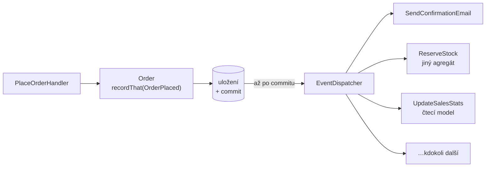

# Domain Event (Doménová událost)

> [← zpět na DDD](../)

> **V jedné větě:** Fakt, který se v doméně stal, zabalený do objektu — takže na něj může reagovat kdokoli, aniž by o něm ten, kdo ho způsobil, musel vědět.

---

## Problém

Use-case udělá jednu věc a pak ještě pět dalších. Každá nová reakce znamená zásah do něj, a ten postupně přestane být o objednávání.

**Poznáš to podle:**

- handler má **šest závislostí**: repository, mailer, sklad, statistiky, audit, cache
- přidání reakce („ještě notifikovat sklad“) znamená **editovat use-case**, i když se objednávání nemění
- test use-case musí namockovat pět služeb, které s objednávkou nesouvisejí
- **e-mail se posílá uvnitř databázové transakce** — a odejde i tehdy, když se transakce vrátí zpět
- v jedné transakci se mění dva agregáty, aby „zůstaly konzistentní“
- na otázku **„co všechno se stane, když se založí objednávka?“** neumí odpovědět nikdo bez čtení kódu

```php
// Před: use-case ví o všem, co po něm následuje
final class PlaceOrderHandler
{
    public function __construct(
        private OrderRepository $orders,
        private Mailer $mailer,                    // ↓ tohle všechno
        private StockService $stock,               //   s objednáváním
        private SalesStatistics $statistics,       //   nemá nic
        private AuditLog $audit,                   //   společného
        private CacheInvalidator $cache,
    ) {
    }

    public function place(PlaceOrder $command): void
    {
        $order = Order::place(/* … */);
        $this->orders->save($order);

        $this->mailer->sendConfirmation($order);   // …a když teď spadne uložení?
        $this->stock->reserve($order->items());
        $this->statistics->record($order);
        $this->audit->log($order);
        $this->cache->invalidate('orders');
    }
}
```

---

## Řešení

Agregát **zaznamená, co se stalo**. Aplikační vrstva to po úspěšném uložení rozešle. Reakce se přihlašují samy.



Use-case má **dvě** závislosti místo šesti a o reakcích neví. Nová reakce = nový posluchač, ne úprava use-case.

### Událost je fakt v minulém čase

Pojmenování není kosmetika — je to celý rozdíl mezi příkazem a událostí:

| | **Příkaz** | **Událost** |
| --- | --- | --- |
| Jméno | `PlaceOrder` — rozkazovací způsob | `OrderPlaced` — minulý čas |
| Co to je | Žádost | Konstatování |
| Dá se odmítnout | **Ano** | **Ne**, už se to stalo |
| Kolik má příjemců | Právě jeden | Kolik chceš, i nula |
| Měnitelnost | — | **Neměnná** — minulost se nepřepisuje |

Když někdo pojmenuje událost `UpdateInventory`, není to událost, ale příkaz v přestrojení — a s ním se vrátí i vazba, které se pattern měl zbavit.

### Agregát zaznamenává, nepublikuje

Zásadní detail. Kdyby si agregát volal dispatcher sám, potřeboval by ho v konstruktoru — a doménový objekt by najednou závisel na infrastruktuře:

```php
trait RecordsEvents
{
    /** @var list<DomainEvent> */
    private array $recordedEvents = [];

    private function recordThat(DomainEvent $event): void
    {
        $this->recordedEvents[] = $event;
    }

    /** @return list<DomainEvent> */
    public function releaseEvents(): array
    {
        $events = $this->recordedEvents;
        $this->recordedEvents = [];   // „release“, ne „get“ — vybírá se jen jednou

        return $events;
    }
}
```

Objednávka jen zapíše, že se stala. **Kdo a kdy to rozešle, je věc aplikační vrstvy.**

### Publikuj až po commitu

Nejdůležitější praktické pravidlo celého patternu, a poruší se snadno. Když se událost rozešle uvnitř transakce a ta se pak vrátí zpět, **reakce už proběhly** — jenže to, co je způsobilo, se nestalo.

Demo ukazuje obě varianty vedle sebe:

```
SPRÁVNĚ (publikace po commitu):
    e-mailů před pokusem: 1
    výjimka: Objednávka musí mít alespoň jednu položku.
    e-mailů po pokusu:    1   ← žádný navíc

ŠPATNĚ (publikace uvnitř transakce):
        → e-mail na dave@example.com (objednávka OBJ-004)
    výjimka: Uložení selhalo (např. deadlock).
    odeslaných e-mailů:   1   ← zákazník má potvrzení objednávky, která neexistuje
```

Ten druhý případ je horší, než vypadá: e-mail se odvolat nedá, takže zákaznická podpora řeší objednávku, která v databázi není.

Pořadí je tedy vždycky: **ulož → commituj → publikuj.**

### Doménová událost není integrační událost

Druhá věc, na které se to v praxi láme — a čím větší firma, tím dražší chyba.

| | **Doménová událost** | **Integrační událost** |
| --- | --- | --- |
| Kam jde | Uvnitř [bounded contextu](../BoundedContext/) | **Přes hranici**, ven |
| Tvar | Tvůj model, bohatý | Publikovaný kontrakt, minimální |
| Verzování | Není potřeba | **Nutné** |
| Kdo ji smí měnit | Ty, kdykoli | Nikdo sám — je to dohoda |
| Obsahuje | Co potřebují tvoje reakce | Jen to, co potřebují cizí |

Když se ven publikuje rovnou doménová událost, **stane se z tvého vnitřního modelu veřejné API**, které nejde měnit bez koordinace se všemi konzumenty. To je přesně ten druh vazby, kterému má [Context Map](../ContextMap/) předcházet.

Překlad na hranici je stejná práce jako u [antikorupční vrstvy](../AnticorruptionLayer/), jen opačným směrem:

```php
final readonly class OrderPlacedV1
{
    public static function fromDomainEvent(OrderPlaced $event): self
    {
        return new self(
            eventId: 'EVT-' . strtoupper(bin2hex(random_bytes(4))),
            orderId: $event->orderId,
            totalInCents: $event->totalInCents,
            itemCount: count($event->items),        // ne celé položky
            occurredAt: $event->occurredAt()->format(\DATE_ATOM),
        );
        // e-mail zákazníka ven nejde — cizí služby ho nepotřebují
    }
}
```

### Tohle je ta chybějící část z Aggregate

[Agregát](../Aggregate/) přišel s pravidlem **jedna transakce = jeden agregát**. Tím ale vzniká otázka, jak zařídit, aby po objednávce vznikla rezervace skladu, když se oba nesmí měnit najednou.

Odpověď je právě tenhle pattern: objednávka se uloží, vydá `OrderPlaced`, sklad na něj zareaguje **ve vlastní transakci**. Konzistence mezi agregáty se dohání **za chvíli**, ne ve stejném zápisu — a to je ta [eventuální konzistence](../../Architecture/CQRS/#škála-na-které-si-vyber), o které mluví CQRS.

---

## Účastníci

| Role | V příkladu | Odpovědnost |
| ---- | ---------- | ----------- |
| **Událost** | `OrderPlaced`, `OrderShipped` | Neměnný fakt v minulém čase |
| **Agregát** | `Order` | Zaznamená, co se stalo — nerozesílá |
| **Sběr událostí** | `RecordsEvents` | Držení a jednorázový výběr |
| **Aplikační vrstva** | `PlaceOrderHandler`, `OrderStore` | Uloží, commituje, **teprve pak** publikuje |
| **Dispatcher** | `EventDispatcher` | Doručí posluchačům |
| **Posluchač** | `SendConfirmationEmail`, `ReserveStock` | Reakce; o agregátu neví |
| **Integrační událost** | `OrderPlacedV1` | Verzovaný kontrakt pro cizí kontexty |

---

## Implementace v PHP

Událost je neměnná a nese, co je potřeba — **ne celý agregát**:

```php
final readonly class OrderPlaced implements DomainEvent
{
    /** @param list<array{sku: string, quantity: int}> $items */
    public function __construct(
        public string $orderId,
        public string $customerEmail,
        public int $totalInCents,
        public array $items,
        private \DateTimeImmutable $occurredAt,
    ) {
    }

    public function occurredAt(): \DateTimeImmutable
    {
        return $this->occurredAt;
    }
}
```

Kdyby v události byl objekt `Order`, mohl by ho posluchač změnit — a událost by přestala být faktem.

Agregát zaznamenává v okamžiku, kdy se věc stane:

```php
public static function place(string $id, string $email, int $total, array $items, \DateTimeImmutable $now): self
{
    if ($items === []) {
        throw new \DomainException('Objednávka musí mít alespoň jednu položku.');
    }

    $order = new self($id, $email, $total, $items);

    $order->recordThat(new OrderPlaced($id, $email, $total, $items, $now));

    return $order;
}
```

A aplikační vrstva drží to správné pořadí:

```php
public function place(/* … */): void
{
    $this->orders->transactional(function () use (/* … */): Order {
        $order = Order::place(/* … */);
        $this->orders->save($order);

        return $order;
    });

    // Až sem se dostaneme jen po úspěšném commitu.
    $this->dispatcher->dispatchAll($this->orders->releaseRecordedEvents());
}
```

### Doručení má tři úrovně, vyber vědomě

| Způsob | Kdy proběhne reakce | Cena |
| ------ | ------------------- | ---- |
| **Synchronně po commitu** | Hned, v témže požadavku | Nejjednodušší. Pomalý posluchač zdrží odpověď, chyba v něm shodí požadavek |
| **Asynchronně přes frontu** | Za chvíli | Potřebuješ frontu, idempotenci a řešení opakování |
| **Outbox** | Za chvíli, ale **spolehlivě** | Událost se uloží do tabulky ve stejné transakci; odesílá ji samostatný proces |

Synchronní varianta stačí překvapivě dlouho. K frontě sáhni, až když ti vadí čas nebo když reakce patří jiné službě. **Outbox** je odpověď na jedinou, ale zásadní díru synchronní i frontové varianty: mezi commitem a odesláním může proces spadnout a událost zmizí. Když na tom závisí peníze, outbox není volitelný.

### Co když posluchač selže

Rozhodnutí, které je potřeba udělat vědomě, protože výchozí chování bývá to horší:

- **Selhání posluchače nemá shodit původní operaci.** Objednávka je uložená; to, že nedošel e-mail, není důvod ji rušit.
- Chytej výjimky **kolem každého posluchače zvlášť** a loguj je, jinak jeden rozbitý posluchač zabrání ostatním.
- U asynchronních reakcí počítej s tím, že událost dorazí **víckrát** — posluchač má být [idempotentní](../../Glossary.md#idempotence). „Rezervuj sklad“ voláno dvakrát nesmí rezervovat dvakrát.

---

## Kdy použít

- ✅ Na jednu doménovou změnu má reagovat **víc nezávislých věcí**.
- ✅ Reakce **přibývají** a nechceš kvůli nim sahat do use-case.
- ✅ Potřebuješ změnit **jiný agregát** — a platí pravidlo jedna transakce, jeden agregát.
- ✅ Reakce patří **jiné službě nebo kontextu**.
- ✅ Chceš mít vypsané, co všechno se v doméně děje.
- ✅ Plníš čtecí modely ([CQRS](../../Architecture/CQRS/)).

## Kdy nepoužít

- ❌ **Reakce je právě jedna a nikdy nepřibude.** Přímé volání je čitelnější než skákání přes dispatcher.
- ❌ **Reakce musí proběhnout ve stejné transakci.** Pak to není reakce, ale součást operace — patří do use-case nebo do agregátu.
- ❌ **Volající potřebuje výsledek.** Událost nic nevrací. Když chceš odpověď, je to volání, ne oznámení.
- ❌ **Jako univerzální lepidlo.** Aplikace, kde se všechno děje přes události, je nečitelná — z kódu nejde vyčíst tok. Události pro **doménově významné** věci, ne pro každou změnu pole.
- ❌ **Nemáš agregáty ani doménová pravidla.** V CRUD aplikaci je to jen složitější `if`.

---

## Časté chyby

| Chyba | Proč vadí | Jak správně |
| ----- | --------- | ----------- |
| **Publikace uvnitř transakce** | Reakce proběhnou i pro operaci, která se vrátila zpět; e-mail se neodvolá | Ulož → commituj → publikuj |
| Agregát si volá dispatcher | Doména závisí na infrastruktuře a nejde testovat izolovaně | Agregát **zaznamená**, publikuje aplikační vrstva |
| Událost pojmenovaná rozkazovacím způsobem | `UpdateInventory` je příkaz v přestrojení; vrací se vazba, které ses zbavoval | Minulý čas: `OrderPlaced` |
| Událost nese celý agregát | Posluchač ho může změnit; událost přestane být faktem | Nes jen data potřebná k reakci |
| Doménová událost se publikuje ven z kontextu | Z vnitřního modelu se stane veřejné API, které nejde měnit | Přelož na verzovanou integrační událost |
| Události se vybírají víckrát | Reakce proběhnou dvakrát | `releaseEvents()`, ne `getEvents()` |
| Selhání posluchače shodí celou operaci | Nedoručený e-mail zruší uloženou objednávku | Chytej kolem každého posluchače zvlášť |
| Asynchronní posluchač není idempotentní | Opakované doručení rezervuje sklad dvakrát | Podle `eventId` poznej, že už to proběhlo |
| Události úplně na všechno | Z kódu nejde vyčíst tok; ladí se to hůř než cokoli jiného | Jen doménově významné věci |

---

## V praxi

- **Symfony Messenger** — middleware `DispatchAfterCurrentBus` řeší přesně to „až po commitu“. Pro asynchronní doručení stačí přepnout transport.
- **Doctrine** — události z agregátů se sbírají v posluchači na `postFlush`, tedy až po commitu [Unit of Work](../../PoEAA/UnitOfWork/). Sahat na `preFlush` nebo `onFlush` je zdroj problémů: transakce ještě neskončila.
- **Outbox** — tabulka `outbox` zapsaná ve stejné transakci plus samostatný odesílač. Jediná varianta, u které událost nezmizí při pádu procesu.

---

## Související patterny

| Pattern | Vztah |
| ------- | ----- |
| [Aggregate](../Aggregate/) | **Přímé pokračování.** Agregát zavedl pravidlo „jedna transakce = jeden agregát“; události jsou to, čím se konzistence mezi nimi dohání. |
| [Entity](../Entity/) | Události zaznamenává kořen agregátu — tedy entita. |
| [Value Object](../ValueObject/) | Událost sama je hodnotou: neměnná, bez identity v doménovém smyslu. |
| [CQRS](../../Architecture/CQRS/) | Nejběžnější způsob, jak se plní čtecí modely. Od stupně 4 výš je to hlavní mechanismus. |
| **Event Sourcing** | **Nezaměňovat.** Publikovat události ≠ ukládat je jako zdroj pravdy. Event Sourcing tenhle pattern předpokládá, opačně to neplatí. |
| [Context Map](../ContextMap/) | Integrační události jsou Published Language — jeden ze sedmi vztahů. |
| [Anticorruption Layer](../AnticorruptionLayer/) | Překlad doménové události na integrační je tatáž práce, jen opačným směrem. |
| [Service Layer](../../PoEAA/ServiceLayer/) | Místo, kde se události publikují — a kde se hlídá, že až **po commitu**. |
| [Saga](../../Architecture/Saga/) | Choreografovaná sága stojí celá na událostech; i orchestrovaná jimi obvykle komunikuje. |
| [Chain of Responsibility](../../GoF/Behavioral/ChainOfResponsibility/) | Rozdíl: řetěz hledá **jednoho** zpracovatele, událost oznamuje **všem** a nikoho nečeká. |

---

## Vztah k principům

| Princip | Jak souvisí |
| ------- | ----------- |
| [OCP](../../Principles/SOLID.md#openclosed-principle-ocp) | Nová reakce = nový posluchač. Use-case ani agregát se nemění — demo to ukazuje v sekci 4. |
| [SRP](../../Principles/SOLID.md#single-responsibility-principle-srp) | Use-case dělá jednu věc. To, že se má poslat e-mail, není jeho důvod ke změně. |
| [Tell, Don't Ask](../../Principles/ObjectDesign.md#tell-dont-ask) | Obrácený směr: agregát ani neptá, ani neříká — **oznamuje**, a nezajímá ho, kdo poslouchá. |
| [Zviditelni implicitní](../../Principles/ObjectDesign.md#zviditelni-implicitní) | „Co se stane po objednávce“ přestane být poskládané z volání a stane se seznamem posluchačů. |

---

## Demo

```bash
php DDD/DomainEvent/demo/run.php
```

Ukáže, že agregát událost jen zaznamená, publikaci po úspěšném commitu a **vedle sebe správnou a špatnou variantu při rollbacku** (v té špatné odejde potvrzení objednávky, která neexistuje). Pak přidá čtvrtou reakci, aniž by se use-case změnil, a nakonec přeloží doménovou událost na verzovanou integrační.

---

## Původ

|               |                                                          |
| ------------- | -------------------------------------------------------- |
| **Zdroj**     | článek Martina Fowlera; později doplněno do DDD           |
| **Autoři**    | Martin Fowler, Eric Evans, Vaughn Vernon                  |
| **Roky**      | **2005** (Fowler) · **2013** (Vernon) · **2015** (Evans)  |
| **Kategorie** | Taktické stavební bloky                                   |
| **Obtížnost** | ●●●●○                                                     |

Na obtížnosti stojí za to se zastavit. Napsat událost je triviální — je to `readonly` třída o čtyřech vlastnostech. **Náročné je všechno kolem ní:** správně se zavěsit na konec transakce (v Doctrine na `postFlush`, ne dřív), rozhodnout mezi synchronním doručením, frontou a outboxem, zařídit idempotenci u opakovaného doručení a udržet oddělené doménové a integrační události. Tenhle pattern si s sebou táhne infrastrukturu, kterou ostatní taktické bloky nepotřebují — proto čtyři body, ne tři.

Stojí za zmínku, že **doménové události v původní knize z roku 2003 nejsou**. Evans je mezi stavební bloky doplnil až v *Domain-Driven Design Reference* (2015) a sám k tomu poznamenal, že jde o vzor, který se vynořil až z praxe po vydání knihy — a že kdyby ji psal znovu, patřily by tam od začátku.

První systematický popis je Fowlerův článek *Domain Event* (**2005**), praktické zpracování pak přinesl **Vaughn Vernon** v *Implementing Domain-Driven Design* (2013), odkud pochází i většina toho, co je v tomhle textu: zaznamenávání na agregátu, publikace po commitu i rozlišení doménové a integrační události.

Pattern zestárl výborně a jeho význam spíš roste. V monolitu roku 2003 šlo hlavně o rozvázání vazeb uvnitř jedné aplikace; s příchodem služeb a asynchronní komunikace se z něj stal základní stavební kámen integrace. Zároveň přibyla jeho nejčastější záměna — s **Event Sourcingem**, se kterým nemá společného víc než slovo „event“.

---

## Zdroje

- Martin Fowler: *Domain Event*, 2005 — [martinfowler.com/eaaDev/DomainEvent.html](https://martinfowler.com/eaaDev/DomainEvent.html)
- Vaughn Vernon: *Implementing Domain-Driven Design*, Addison-Wesley, 2013 — kapitola 8
- Eric Evans: *Domain-Driven Design Reference*, 2015
- [Symfony Messenger](https://symfony.com/doc/current/messenger.html)

---

<details>
<summary>Metadata patternu</summary>

```yaml
name: DomainEvent
name_cs: Doménová událost
category: Taktické stavební bloky
source: DDD – doplněno po vydání knihy
authors: Martin Fowler, Eric Evans, Vaughn Vernon
year: 2005
difficulty: 4
tags: [události, rozvázání vazeb, eventuální konzistence, integrace, reakce]
principles: [OCP, SRP, TellDontAsk]
related: [Aggregate, Entity, ValueObject, CQRS, EventSourcing, ContextMap, AnticorruptionLayer, ChainOfResponsibility]
status: done
```

</details>
