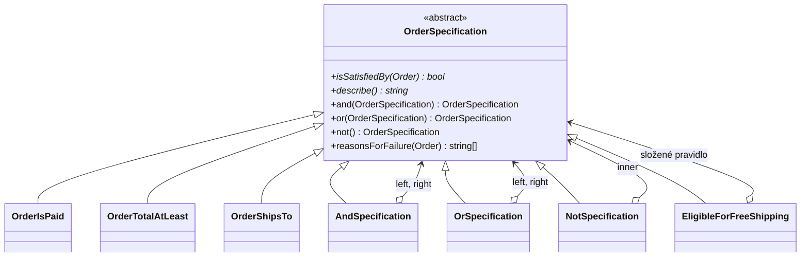

# Specification (Specifikace)

> [← zpět na DDD](../)

> **V jedné větě:** Doménové pravidlo vytažené z podmínky do objektu, který se dá pojmenovat, otestovat samostatně a skládat s dalšími pravidly.

---

## Problém

Byznysové pravidlo má v hlavách lidí jméno — „objednávka s dopravou zdarma“, „riziková objednávka“, „zákazník ve zkušební lhůtě“. V kódu ale žádné jméno nemá. Je to podmínka v `if`, a proto se nedá pojmenovat, předat ani otestovat zvlášť.

**Poznáš to podle:**

- podmínka o třech a více částech, u které musíš chvíli luštit, co vlastně vyjadřuje
- **tatáž podmínka na několika místech**, pokaždé o kousek jinak — a jedna z kopií už je zastaralá
- pravidlo má jméno na poradě, ale v kódu ho nikdo nenajde, protože je rozpuštěné v podmínce
- když pravidlo neprojde, uživateli řekneš jen „nemáte nárok“, protože z `&&` nezjistíš **která část** selhala
- test pravidla musí nejdřív poskládat celý use-case, protože jinak se k podmínce nedostane

```php
// Před: pravidlo je rozpuštěné v podmínce
final class CheckoutController
{
    public function submit(Order $order): Response
    {
        if (
            $order->isPaid
            && $order->totalInCents >= 150000
            && $order->countryCode === 'CZ'
        ) {
            $shipping = 0;
        }
        // …
    }
}

// A o dvě vrstvy níž totéž, jen s jinou hranicí — nebo je to překlep?
if ($order->isPaid && $order->totalInCents >= 150_000 && $order->countryCode === 'CZ') {
    // …
}

// A v reportu ještě jednou, tentokrát bez kontroly země
$eligible = array_filter(
    $orders,
    static fn (Order $o): bool => $o->isPaid && $o->totalInCents >= 150000,
);
```

Tři kopie jednoho pravidla, tři různé okamžiky, kdy se do nich zapomene sáhnout. A žádné místo, kterému by šlo říct „tady je definice dopravy zdarma“.

---

## Řešení

Udělej z pravidla objekt s jedinou otázkou: **splňuje tenhle kandidát to, co po něm chci?**

```php
interface OrderSpecification
{
    public function isSatisfiedBy(Order $order): bool;
}
```

To samo o sobě dá pravidlu jméno a testovatelnost. Skutečná síla ale přijde s tím, že se specifikace **skládají** — `and`, `or`, `not` jsou zase specifikace, takže z jednoduchých pravidel stavíš složitá, aniž bys musel psát nová:



Evans s Fowlerem popsali **tři použití** téhož objektu, a to je ten hlavní argument pro pattern:

| Použití | Otázka | V kódu |
| ------- | ------ | ------ |
| **Validace** | Vyhovuje tenhle konkrétní objekt? | `$spec->isSatisfiedBy($order)` |
| **Výběr** | Které objekty vyhovují? | `array_filter($orders, …)` nebo dotaz do DB |
| **Konstrukce na míru** | Vytvoř mi něco, co vyhovuje | tovární metoda řízená specifikací |

Jedno pravidlo, jedna definice, tři různá místa použití. To je přesně to, co tři kopie podmínky neumí.

---

## Účastníci

| Role                     | V příkladu                                        | Odpovědnost                                            |
| ------------------------ | ------------------------------------------------- | ------------------------------------------------------ |
| **Specification**        | `OrderSpecification`                              | Kontrakt: `isSatisfiedBy()` a popis pravidla            |
| **Leaf Specification**   | `OrderIsPaid`, `OrderTotalAtLeast`                | Jedno elementární pravidlo                              |
| **Composite**            | `AndSpecification`, `OrSpecification`, `NotSpecification` | Skládá pravidla; sama je zase pravidlem          |
| **Pojmenované pravidlo** | `EligibleForFreeShipping`                         | Dává složenině jméno, které zná i byznys                |
| **Kandidát**             | `Order`                                           | Objekt, který se posuzuje; o specifikaci neví           |

---

## Implementace v PHP

Základ. Pozor na jeden PHP detail — kombinátory `and`/`or`/`not` potřebují implementaci, a **rozhraní ji v PHP nést neumí**. Buď abstraktní třída, nebo rozhraní plus trait; abstraktní třída je jednodušší:

```php
<?php
declare(strict_types=1);

abstract class OrderSpecification
{
    abstract public function isSatisfiedBy(Order $order): bool;

    /** Lidský popis pravidla, používá se ve vysvětlení. */
    abstract public function describe(): string;

    public function and(self $other): self
    {
        return new AndSpecification($this, $other);
    }

    public function or(self $other): self
    {
        return new OrSpecification($this, $other);
    }

    public function not(): self
    {
        return new NotSpecification($this);
    }
}
```

(`and`, `or` i `not` jsou v PHP klíčová slova, ale jako **názvy metod** projdou — od PHP 7 to jazyk dovoluje.)

Elementární pravidlo. Může mít parametry, takže z jedné třídy je použitelných libovolně mnoho konkrétních pravidel:

```php
final class OrderTotalAtLeast extends OrderSpecification
{
    public function __construct(
        private readonly int $thresholdInCents,
    ) {
    }

    public function isSatisfiedBy(Order $order): bool
    {
        return $order->totalInCents >= $this->thresholdInCents;
    }

    public function describe(): string
    {
        return sprintf('hodnota je alespoň %s Kč', number_format($this->thresholdInCents / 100, 0, ',', ' '));
    }
}
```

Kombinátor. Sám je zase specifikací — proto jde skládat donekonečna:

```php
final class AndSpecification extends OrderSpecification
{
    public function __construct(
        private readonly OrderSpecification $left,
        private readonly OrderSpecification $right,
    ) {
    }

    public function isSatisfiedBy(Order $order): bool
    {
        return $this->left->isSatisfiedBy($order)
            && $this->right->isSatisfiedBy($order);
    }
}
```

### Pravidlo, které má jméno

Skládání za běhu je fajn, ale samo o sobě nevyřeší původní problém — pravidlo pořád nemá jméno. **Pojmenuj složeninu vlastní třídou:**

```php
final class EligibleForFreeShipping extends OrderSpecification
{
    private readonly OrderSpecification $rule;

    public function __construct()
    {
        $this->rule = (new OrderIsPaid())
            ->and(new OrderTotalAtLeast(150000))
            ->and(new OrderShipsTo('CZ'));
    }

    public function isSatisfiedBy(Order $order): bool
    {
        return $this->rule->isSatisfiedBy($order);
    }

    public function describe(): string
    {
        return 'objednávka má nárok na dopravu zdarma';
    }
}
```

Uvnitř je to jen složenina jednodušších pravidel. Navenek je to **pojem, o kterém se dá mluvit s produkťákem** — a když se podmínka pro dopravu zdarma změní, mění se právě tady a nikde jinde.

### Proč to neprošlo

Tohle je věc, kterou `if ($a && $b && $c)` nedá nikdy: neřekne ti, **která ze tří částí** selhala. Specifikace ano, protože zná svou strukturu:

```php
// v základní třídě
public function reasonsForFailure(Order $order): array
{
    return $this->isSatisfiedBy($order) ? [] : [$this->describe()];
}

// v AndSpecification — sesbírá důvody z obou stran
public function reasonsForFailure(Order $order): array
{
    return [
        ...$this->left->reasonsForFailure($order),
        ...$this->right->reasonsForFailure($order),
    ];
}
```

Z toho vypadne přesně to, co potřebuje košík ukázat zákazníkovi:

```
OBJ-002  nevyhovuje, protože nesplňuje:
    · hodnota je alespoň 1 500 Kč
OBJ-004  nevyhovuje, protože nesplňuje:
    · doručuje se do CZ
```

Jedna definice pravidla najednou obsluhuje rozhodnutí **i** hlášku pro uživatele — a ty dvě věci se nemůžou rozejít, protože jsou z téhož objektu.

> Drobnost, na kterou se v praxi naráží: popis složeného pravidla potřebuje **závorky**, jinak se „neplatí, že A a zároveň B“ dá číst dvěma způsoby. V ukázce to řeší metoda `needsParentheses()`, kterou složené specifikace přepisují na `true`.

### Specifikace a databáze

Tady je hranice, o kterou se pattern nejčastěji rozbije. Specifikace pracuje **s objektem v paměti**. Dokud filtruješ pole o desítkách položek, je to v pořádku:

```php
$eligible = array_filter(
    $orders,
    static fn (Order $order): bool => $freeShipping->isSatisfiedBy($order),
);
```

Jenže „najdi všechny objednávky, které vyhovují“ nad statisíci řádky takhle udělat nejde — načíst všechno do paměti a filtrovat v PHP je ta nejhorší možná varianta. Máš tři možnosti a je potřeba si vybrat vědomě:

| Řešení | Kdy | Cena |
| ------ | --- | ---- |
| **Filtrovat v paměti** | Malé kolekce, už načtená data, validace jednoho objektu | Žádná — tohle je hlavní použití |
| **Specifikace umí i `Criteria`** | Potřebuješ totéž pravidlo i pro dotaz do DB | Specifikace zná Doctrine → doména se váže na infrastrukturu |
| **Dotaz v repository, validace specifikací** | Nejběžnější kompromis v praxi | Pravidlo existuje dvakrát; hlídej, ať se nerozejde (pokrej testem) |

Doctrine na druhou variantu nabízí [`Criteria`](https://www.doctrine-project.org/projects/doctrine-collections/en/stable/expressions.html), které umí běžet **v paměti i v SQL**:

```php
public function toCriteria(): Criteria
{
    return Criteria::create()
        ->andWhere(Criteria::expr()->eq('isPaid', true))
        ->andWhere(Criteria::expr()->gte('totalInCents', 150000));
}
```

**Nepouštěj se do psaní vlastního překladače specifikací do SQL.** Je to králičí nora: dřív nebo později narazíš na `JOIN`, agregaci nebo poddotaz a skončíš u vlastního ORM. Když pravidlo potřebuje běžet v databázi, napiš dotaz ručně a specifikaci nech na validaci.

### Použití

```php
$freeShipping = new EligibleForFreeShipping();

// 1. validace jednoho objektu
if ($freeShipping->isSatisfiedBy($order)) {
    $shippingCost = 0;
}

// 2. vysvětlení pro uživatele
foreach ($freeShipping->reasonsForFailure($order) as $reason) {
    echo 'Chybí: ' . $reason;
}

// 3. skládání za běhu — bez psaní nové třídy
$risky = (new OrderIsPaid())->not()
    ->and(new OrderTotalAtLeast(200000));

// 4. filtr kolekce
$matching = array_filter(
    $orders,
    static fn (Order $order): bool => $risky->isSatisfiedBy($order),
);
```

---

## Kdy použít

- ✅ Pravidlo **má v byznysu jméno** a v kódu žádné nemá.
- ✅ Tatáž podmínka je na **víc než jednom místě** a hrozí, že se kopie rozejdou.
- ✅ Pravidel je hodně, **kombinují se** a kombinace vznikají za běhu (filtry, segmentace zákazníků, slevové akce).
- ✅ Potřebuješ uživateli říct **proč** to neprošlo, ne jen že neprošlo.
- ✅ Pravidlo se má testovat samostatně, bez okolního use-case.

## Kdy nepoužít

- ❌ **Podmínka je jednoduchá a na jediném místě.** `if ($order->isPaid)` je čitelnější než `(new OrderIsPaid())->isSatisfiedBy($order)`. Pattern zaveď, až když pravidlo dostane jméno nebo druhou kopii.
- ❌ **Pravidlo patří objektu samotnému.** Když se ptáš jen na vlastní stav, stačí metoda na entitě: `$order->isPaid()`. Specifikace se vyplatí, až když pravidlo kombinuje víc věcí nebo má vlastní parametry.
- ❌ **Hlavní použití je dotaz nad velkými daty.** Viz výše — tam patří dotaz, ne filtr v paměti.
- ❌ **Chceš z toho udělat pravidlový engine** konfigurovatelný z administrace. To už je jiná úloha — viz [Rules Engine](../../Architecture/RulesEngine/), včetně varování, kdy se do ní nepouštět.

---

## Časté chyby

| Chyba | Proč vadí | Jak správně |
| ----- | --------- | ----------- |
| Specifikace si sama načítá data z repository | Přestane jít otestovat bez databáze a skryje N+1 dotazů uvnitř filtru | Vše potřebné dostane v konstruktoru nebo v posuzovaném objektu |
| Načtení celé tabulky a filtrování v PHP | Funguje na 50 řádcích, položí aplikaci na 500 000 | Nad velkými daty dotaz do DB; specifikace na validaci |
| Specifikace vrací víc než `bool` (upravuje objekt, loguje, posílá e-mail) | Přestane to být pravidlo a stane se z toho skrytý use-case | Specifikace **jen odpovídá na otázku**; reakci řeší volající |
| Jedna „univerzální“ specifikace s parametry na všechno | `new OrderSpecification($field, $operator, $value)` je jen `if` v jiném kabátě, a ještě bez typové kontroly | Jedno pravidlo = jedna třída s doménovým jménem |
| Složenina bez jména, sestavovaná při každém použití | Pravidlo pořád nemá jméno a kopie se zase rozejdou | Pojmenuj ji vlastní třídou (`EligibleForFreeShipping`) |
| Vlastní překladač specifikací do SQL | Nekonečná studna; skončíš u vlastního ORM | Doctrine `Criteria`, nebo ruční dotaz |
| Popis složeného pravidla bez závorek | „neplatí, že A a zároveň B“ jde číst dvěma způsoby | Složené specifikace se závorkují (viz `needsParentheses()`) |

---

## V praxi

- **Doctrine** — [`Criteria`](https://www.doctrine-project.org/projects/doctrine-collections/en/stable/expressions.html) a rozhraní `Selectable`. Totéž kritérium umí filtrovat načtenou kolekci i doplnit `WHERE` do dotazu; nejbližší věc k „specifikaci, která umí do databáze“, kterou v PHP máš hotovou.
- **Symfony Validator** — constrainty jsou specifikace se zaměřením na validaci, včetně vysvětlení, co selhalo (`ConstraintViolationList`).
- **Symfony Security** — voteři jsou specifikace nad dvojicí uživatel + zdroj; `and`/`or` řeší strategie hlasování.
- **`array_filter` s callable** — nejjednodušší specifikace, jaká existuje. Když pravidlo nemá jméno, parametry ani se neskládá, tohle stačí.

---

## Související patterny

| Pattern | Vztah |
| ------- | ----- |
| **Composite** (GoF) | `AndSpecification` a `OrSpecification` **jsou** Composite: uzel stromu, se kterým se zachází stejně jako s listem. Tady vidíš pattern použitý v praxi, ne jen na diagramu. |
| [Strategy](../../GoF/Behavioral/Strategy/) | Oba zabalují chování do objektu. Strategy **něco počítá** (jak spočítat dopravu), Specification **odpovídá ano/ne** (má nárok na dopravu zdarma). Často spolupracují. |
| [Value Object](../ValueObject/) | Specifikace se chová jako hodnota — neměnná, bez identity, porovnatelná. Parametry pravidel bývají value objecty. |
| [Repository](../../PoEAA/Repository/) (PoEAA) | Klasické místo, kde specifikace naráží na databázi. `findSatisfying(Specification $spec)` je lákavé API s netriviální implementací — viz *Specifikace a databáze*. |
| **Interpreter** (GoF) | Strom specifikací je vlastně vyhodnocovaný výraz. Kdybys chtěl pravidla načítat z konfigurace, dostaneš se k Interpreteru. |
| [Chain of Responsibility](../../GoF/Behavioral/ChainOfResponsibility/) (GoF) | Podmínka článku řetězu je přirozené místo pro specifikaci. |
| [State](../../GoF/Behavioral/State/) (GoF) | Specifikace jako guard: podmínka, za které je přechod mezi stavy dovolený. |
| [Rules Engine](../../Architecture/RulesEngine/) | Nadstavba: specifikace je podmínka pravidla, engine k ní přidává důsledek, prioritu a řešení konfliktů. **Nejdřív zkus vystačit se specifikací.** |
| [First Class Collection](../../ObjectCalisthenics/FirstClassCollection/) | Přirozený příjemce specifikace: `$items->satisfying($spec)` místo `array_filter` venku. |

---

## Vztah k principům

| Princip | Jak souvisí |
| ------- | ----------- |
| [OCP](../../Principles/SOLID.md#openclosed-principle-ocp) | Nové pravidlo = nová třída. Existující specifikace ani kód, který je používá, se nemění. |
| [SRP](../../Principles/SOLID.md#single-responsibility-principle-srp) | Jedno pravidlo = jedna třída s jediným důvodem ke změně. Změna hranice pro dopravu zdarma se nedotkne ničeho jiného. |
| [ISP](../../Principles/SOLID.md#interface-segregation-principle-isp) | Kontrakt je jediná metoda. Menší rozhraní už neuděláš — a proto jde specifikace použít úplně všude. |

---

## Demo

```bash
php DDD/Specification/demo/run.php
```

Ukáže pojmenované pravidlo v akci, vysvětlení proč konkrétní objednávka nevyhověla, skládání pravidel za běhu přes `and`/`or`/`not` a totéž pravidlo použité jako filtr kolekce.

---

## Původ

|               |                                                       |
| ------------- | ----------------------------------------------------- |
| **Zdroj**     | *Domain-Driven Design*, kapitola 9 — a společný článek *Specifications* |
| **Autoři**    | Eric Evans, Martin Fowler                              |
| **Rok**       | 2002 (článek), 2003 (kniha)                            |
| **Kategorie** | Taktické stavební bloky                                |
| **Obtížnost** | ●●●○○                                                  |

Evans s Fowlerem sepsali specifikace v samostatném článku ještě předtím, než Evansovi vyšla kniha. Motivace byla konkrétní: v podnikových aplikacích se pravidla chovají jako **první třída doménové znalosti** — mluví se o nich na poradách, mění se nezávisle na zbytku a jsou to ta místa, kde se nejvíc chybuje. Přesto končila rozpuštěná v podmínkách, kde je nešlo ani pojmenovat, ani na ně ukázat.

Článek přinesl tři použití jednoho objektu — validaci, výběr a konstrukci na míru — a hlavně pozorování, že **specifikace jde skládat**. Právě skládání dělá z drobného nápadu plnohodnotný pattern: z pěti elementárních pravidel poskládáš desítky složených, aniž bys napsal jedinou novou třídu.

Evans ho pak v knize zařadil do kapitoly *Making Implicit Concepts Explicit* — mezi vzory, jejichž smysl je dát jméno něčemu, co v kódu existovalo, ale nemělo ho.

---

## Zdroje

- Eric Evans, Martin Fowler: *Specifications*, 2002 — [martinfowler.com/apsupp/spec.pdf](https://martinfowler.com/apsupp/spec.pdf)
- Eric Evans: *Domain-Driven Design*, Addison-Wesley, 2003 — kapitola 9
- [Doctrine Collections: Expressions](https://www.doctrine-project.org/projects/doctrine-collections/en/stable/expressions.html)

---

<details>
<summary>Metadata patternu</summary>

```yaml
name: Specification
name_cs: Specifikace
category: Taktické stavební bloky
source: DDD – Domain-Driven Design
authors: Eric Evans, Martin Fowler
year: 2003
difficulty: 3
tags: [doménová pravidla, kompozice, predikát, validace, filtrování]
principles: [OCP, SRP, ISP]
related: [Composite, Strategy, ValueObject, Repository, Interpreter, FirstClassCollection]
status: done
```

</details>
