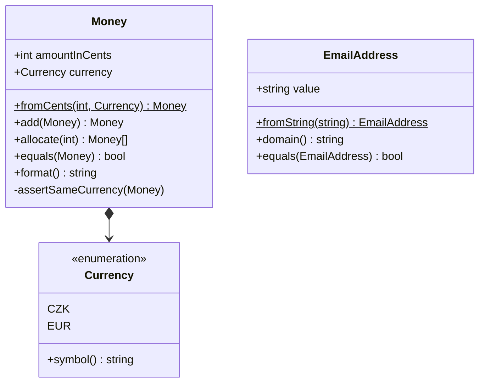

# Value Object (Hodnotový objekt)

> [← zpět na DDD](../)

> **V jedné větě:** Vlastní typ pro hodnotu, kterou by jinak nesl `string` nebo `int` — neměnný, sám se validuje a porovnává se podle obsahu, ne podle instance.

---

## Problém

Doménové pojmy se v kódu nesou v primitivních typech. Jazyk pak nemá jak pomoct: nepozná, že „částka“ a „počet kusů“ nejsou totéž, a znalost o tom, co je platná hodnota, se rozteče po celé aplikaci.

Tomuhle se říká **primitive obsession** a poznáš to podle:

- signatury, kde jde snadno prohodit argumenty, protože mají stejný typ:
  `refund(int $amount, int $orderId)` — kompilátor ani PHPStan tě nechytí
- stejná validace na třech místech, pokaždé trochu jinak (a na čtvrtém chybí)
- názvy proměnných musí nést typ, protože typ sám nestačí: `$totalInCents`, `$emailString`
- v databázi skončí `"  Alice@Example.COM "` i `"alice@example.com"` jako dva různí zákazníci
- sčítáš koruny s eury a nikdo si toho nevšimne

```php
// Před: doména se nese v primitivech
final class Order
{
    public function __construct(
        public int $totalInCents,      // v jaké měně?
        public string $currency,       // "CZK"? "czk"? "Kč"?
        public string $customerEmail,  // ověřený? normalizovaný?
    ) {
    }
}

// Validace tady…
if (filter_var($email, FILTER_VALIDATE_EMAIL) === false) {
    throw new InvalidArgumentException('Neplatný e-mail.');
}

// …a znovu v jiném use-case, tentokrát s trim() navíc
if (filter_var(trim($email), FILTER_VALIDATE_EMAIL) === false) {
    throw new BadRequest('Neplatný e-mail.');
}

// A tohle projde bez varování
$total = $order->totalInCents + $refundInEuroCents;
```

`int` neví, že je to částka. `string` neví, že je to e-mail. Vědět to musí každý kus kódu, který na ně sáhne — a proto to jeden z nich dřív nebo později vědět nebude.

---

## Řešení

Dej hodnotě **vlastní typ**. Ten se postará o validaci, normalizaci i o operace, které k hodnotě patří.



Value object stojí na pěti vlastnostech. První dvě ho definují, zbylé tři jsou to, proč se vyplatí:

| Vlastnost | Co to znamená |
| --------- | ------------- |
| **Nemá identitu** | Dvě stokoruny jsou tatáž hodnota. Nezajímá tě *která* instance, jen *jaká*. Tím se liší od entity. |
| **Rovnost podle obsahu** | `$a->equals($b)` porovnává atributy, ne reference. |
| **Neměnnost** | Každá operace vrací novou instanci. Hodnota se nemění — 5 se taky nikdy nestane šestkou. |
| **Sebevalidace** | Kontrola je v konstruktoru, takže **neplatná instance nemůže vzniknout**. Kdekoli takový objekt dostaneš, je platný. |
| **Nese chování** | `add()`, `allocate()`, `format()`, `domain()`. Není to jen typovaný obal, je to místo, kde žije logika té hodnoty. |

Poslední bod je ten, na kterém se to nejčastěji láme. Value object, který má jen konstruktor a getter, ti dá typovou bezpečnost, ale zbytek hodnoty pořád zůstal venku.

### Value object, který už znáš

Nemusíš věřit definici — jeden value object máš v PHP nativně a nejspíš ho používáš denně. Je to **`DateTimeImmutable`**:

| Vlastnost | Jak ji `DateTimeImmutable` splňuje |
| --------- | ---------------------------------- |
| Nemá identitu | Nezajímá tě *která* instance 1. září je, jen *že* je to 1. září |
| Rovnost podle obsahu | `$a == $b` je `true` pro dvě různé instance téhož okamžiku (a `<`, `>` fungují taky) |
| Neměnnost | `modify('+1 day')` vrací **novou** instanci, původní zůstává |
| Sebevalidace | `new DateTimeImmutable('rozhodne-neni-datum')` skončí `DateMalformedStringException` (PHP 8.3+); neplatné datum prostě nevznikne |
| Nese chování | `format()`, `diff()`, `add()`, `modify()` — logika data žije u data |

A teď to nejlepší: PHP má **i tu špatnou variantu**, takže rozdíl jde ukázat na jednom řádku. `DateTime` je až na neměnnost totéž, a právě proto je zdrojem klasické chyby:

```php
// DateTimeImmutable — hodnota se chová jako hodnota
$start = new DateTimeImmutable('2026-09-01');
$end = $start->modify('+1 day');

$start->format('Y-m-d');   // 2026-09-01  ← beze změny
$end->format('Y-m-d');     // 2026-09-02

// DateTime — modify() změní původní objekt a vrátí sám sebe
$start = new DateTime('2026-09-01');
$end = $start->modify('+1 day');

$start->format('Y-m-d');   // 2026-09-02  ← původní datum je pryč
$end === $start;           // true — je to tentýž objekt!
```

A protože se objekty v PHP předávají odkazem, stačí přiřazení do jiné proměnné:

```php
$createdAt = new DateTime('2026-09-01');
$deadline = $createdAt;          // žádná kopie, tatáž instance
$deadline->modify('+1 month');

$createdAt->format('Y-m-d');     // 2026-10-01  ← změnilo se něco, čeho ses ani nedotkl
```

Tohle je celý důvod, proč je neměnnost u value objectu podmínka, ne ozdoba. Kdykoli píšeš `readonly` a vracíš `new self(...)` místo změny `$this`, děláš přesně to, co dělá `DateTimeImmutable` — a vyhýbáš se přesně téhle chybě.

> Praktický důsledek: v novém kódu používej `DateTimeImmutable`, `DateTime` jen tam, kde tě k tomu nutí cizí knihovna. Doctrine i Symfony `DateTimeImmutable` plně podporují.

Všechno výše si můžeš spustit: [`demo/native-datetime.php`](demo/native-datetime.php).

---

## Účastníci

| Role                    | V příkladu                      | Odpovědnost                                                     |
| ----------------------- | ------------------------------- | --------------------------------------------------------------- |
| **Value Object**        | `Money`, `EmailAddress`         | Drží hodnotu, validuje ji, nabízí operace nad ní                 |
| **Named constructor**   | `Money::fromCents()`            | Jediná cesta dovnitř; z názvu je poznat, co se předává           |
| **Enum jako VO**        | `Currency`                      | Uzavřená množina hodnot — nejlevnější value object v PHP         |
| **Kompozitní VO**       | `Address`                       | Skládá se z jiných hodnot a hlídá invariant mezi nimi            |
| **Klient**              | `Order`, use-case               | Pracuje s typem, ne s primitivem; validaci už řešit nemusí       |

---

## Implementace v PHP

```php
<?php
declare(strict_types=1);

final readonly class Money
{
    // Privátní konstruktor: dovnitř se jde jen přes pojmenovanou továrnu,
    // takže je z volajícího kódu vidět, v jakých jednotkách se předává.
    private function __construct(
        public int $amountInCents,
        public Currency $currency,
    ) {
    }

    public static function fromCents(int $amountInCents, Currency $currency): self
    {
        return new self($amountInCents, $currency);
    }

    public static function zero(Currency $currency): self
    {
        return new self(0, $currency);
    }

    public function add(self $other): self
    {
        $this->assertSameCurrency($other);

        return new self($this->amountInCents + $other->amountInCents, $this->currency);
    }

    /**
     * Rozdělí částku na díly tak, aby se neztratil ani haléř.
     * Naivní dělení 100,00 Kč na tři díly dá 3× 33,33 Kč a haléř zmizí.
     *
     * @return list<self>
     */
    public function allocate(int $parts): array
    {
        if ($parts < 1) {
            throw new InvalidArgumentException('Počet dílů musí být alespoň 1.');
        }

        $base = intdiv($this->amountInCents, $parts);
        $remainder = $this->amountInCents - $base * $parts;

        $result = [];

        for ($i = 0; $i < $parts; $i++) {
            $result[] = new self($base + ($i < $remainder ? 1 : 0), $this->currency);
        }

        return $result;
    }

    // PHP nemá přetěžování operátorů, takže rovnost je metoda.
    public function equals(self $other): bool
    {
        return $this->amountInCents === $other->amountInCents
            && $this->currency === $other->currency;
    }

    public function format(): string
    {
        return number_format($this->amountInCents / 100, 2, ',', ' ') . ' ' . $this->currency->symbol();
    }

    private function assertSameCurrency(self $other): void
    {
        if ($this->currency !== $other->currency) {
            throw new InvalidArgumentException(sprintf(
                'Nelze kombinovat %s a %s.',
                $this->currency->value,
                $other->currency->value,
            ));
        }
    }
}
```

Validace, která nepustí neplatnou instanci na svět — a normalizace, díky které je jedna hodnota vždycky jeden zápis:

```php
final readonly class EmailAddress
{
    private function __construct(
        public string $value,
    ) {
    }

    public static function fromString(string $value): self
    {
        $normalized = mb_strtolower(trim($value));

        if (filter_var($normalized, FILTER_VALIDATE_EMAIL) === false) {
            throw new InvalidArgumentException(sprintf('„%s“ není platná e-mailová adresa.', $value));
        }

        return new self($normalized);
    }

    public function domain(): string
    {
        return substr($this->value, strpos($this->value, '@') + 1);
    }

    public function equals(self $other): bool
    {
        return $this->value === $other->value;
    }
}
```

### Privátní konstruktor a pojmenovaná továrna

Sebevalidace stojí na jedné mechanice, která se opakuje u každého value objectu, a stojí za to ji pojmenovat:

```php
private function __construct(/* … */) { }          // ① jediná cesta dovnitř

public static function fromString(string $v): self  // ② a ta vede přes tohle
{
    // ③ validace a normalizace
    return new self($normalized);
}
```

Proč zrovna takhle:

- **Privátní konstruktor** znamená, že `new Money(...)` zvenčí nejde. Neexistuje cesta, jak se validaci vyhnout — ani omylem, ani ve spěchu, ani v testu. Tohle je ten rozdíl mezi „hodnota se validuje“ a „hodnota **je** validovaná“.
- **Pojmenovaná továrna** říká v názvu, co dostává. `Money::fromCents(129000, Currency::CZK)` se nedá splést s korunami; `new Money(129000)` ano.
- **Víc továren pro víc vstupů** — `fromCents()`, `zero()`, `fromString()`. Každá si řeší svůj vstup a všechny končí u téhož konstruktoru, takže invariant je pořád na jednom místě.
- Konstruktor zůstává **hloupý a poslední**: přiřadí, nanejvýš zkontroluje invariant. Parsování a normalizace patří do továrny.

Objekt, který takhle vznikne, nese záruku: **kdekoli ho v aplikaci potkáš, je platný.** Nemusíš ho kontrolovat, nemusíš mu nevěřit. To je hlavní věc, kterou value object kupuje.

### Kompozitní value object

Value object se může skládat z jiných value objectů. `Money` je složené z `int` a `Currency`; adresa jde dál a skládá se z `PostalCode` a `Country`:

```php
final readonly class Address
{
    private function __construct(
        public string $street,
        public string $city,
        public PostalCode $postalCode,
        public Country $country,
    ) {
    }

    public static function create(
        string $street,
        string $city,
        PostalCode $postalCode,
        Country $country,
    ): self {
        $street = trim($street);
        $city = trim($city);

        if ($street === '') {
            throw new InvalidArgumentException('Ulice nesmí být prázdná.');
        }

        if ($city === '') {
            throw new InvalidArgumentException('Město nesmí být prázdné.');
        }

        // Invariant napříč složkami.
        if ($postalCode->country !== $country) {
            throw new InvalidArgumentException(sprintf(
                'PSČ %s patří do země %s, ale adresa je v zemi %s.',
                $postalCode->format(),
                $postalCode->country->value,
                $country->value,
            ));
        }

        return new self($street, $city, $postalCode, $country);
    }

    // Rovnost se skládá z rovnosti částí — u vnořených hodnot deleguje na jejich equals().
    public function equals(self $other): bool
    {
        return $this->street === $other->street
            && $this->city === $other->city
            && $this->postalCode->equals($other->postalCode)
            && $this->country === $other->country;
    }
}
```

Zásadní je ten poslední kus validace. `PostalCode` je platné. `Country` je platná. **A přesto může být jejich kombinace nesmysl:**

```php
$czechPostalCode = PostalCode::fromString('186 00', Country::CZ);   // platné
Address::create('Hlavná 1', 'Bratislava', $czechPostalCode, Country::SK);
// InvalidArgumentException: PSČ 186 00 patří do země CZ, ale adresa je v zemi SK.
```

Tomuhle se říká **invariant napříč složkami** a je to hlavní důvod, proč má složený value object vlastní továrnu a nespoléhá na to, že si validaci odbydou jeho části. Každá část zná jen sebe; pravidlo o jejich *vztahu* nemá kde jinde žít.

Z toho plynou tři pravidla pro skládání:

| Pravidlo | Proč |
| -------- | ---- |
| **Části validují sebe, celek validuje vztahy mezi nimi** | Bez duplikace — `Address` znovu neověřuje formát PSČ, to už je hotové |
| **Rovnost celku deleguje na `equals()` částí** | Jinak porovnáváš reference vnořených objektů místo jejich hodnot |
| **Skládej jen hodnoty, ne entity** | Value object s entitou uvnitř přestane být hodnotou — zdědí cizí identitu a životní cyklus |

Pozor na jméno: **kompozitní value object nemá nic společného s patternem Composite** z GoF. Ten řeší stromové struktury, kde se s listem i uzlem zachází stejně. Tady jde jen o hodnotu, jejíž složky jsou zase hodnoty.

### Enum je taky value object

Nejlevnější value object v PHP je backed enum. Instance je z podstaty neměnná, porovnává se hodnotou a neplatná prostě neexistuje — psát na uzavřenou množinu hodnot vlastní třídu je zbytečné:

```php
enum Currency: string
{
    case CZK = 'CZK';
    case EUR = 'EUR';

    public function symbol(): string
    {
        return match ($this) {
            self::CZK => 'Kč',
            self::EUR => '€',
        };
    }
}
```

### Pozor na `==` versus `equals()`

PHP u objektů téže třídy porovnává `==` atribut po atributu, takže na první pohled dělá přesně to, co od rovnosti value objectu čekáš. Spoléhat se na to ale nechtěj:

```php
$a = Money::fromCents(10000, Currency::CZK);
$b = Money::fromCents(10000, Currency::CZK);

$a === $b;        // false — jiné instance
$a == $b;         // true, ale…
$a->equals($b);   // true — a tohle piš
```

`==` porovná **všechny** atributy včetně těch, které do rovnosti nepatří (cache, lazy-loaded reference), u vnořených objektů porovnává rekurzivně a u `float` naráží na nepřesnost. Explicitní `equals()` říká, co rovnost v téhle doméně znamená — a to je celý smysl patternu.

### Použití

```php
$price = Money::fromCents(129000, Currency::CZK);
$shipping = Money::fromCents(9900, Currency::CZK);

$total = $price->add($shipping);
echo $total->format();                       // 1 389,00 Kč

$price->add(Money::fromCents(5000, Currency::EUR));  // InvalidArgumentException

$email = EmailAddress::fromString('  Alice@Example.COM ');
echo $email->value;                          // alice@example.com
echo $email->domain();                       // example.com

$address = Address::create(
    street: 'Sokolovská 100',
    city: 'Praha',
    postalCode: PostalCode::fromString('186 00', Country::CZ),
    country: Country::CZ,
);
echo $address->format();                     // Sokolovská 100 / 186 00 Praha / Česká republika
```

---

## Kdy použít

- ✅ Hodnota má **doménový význam a vlastní pravidla** — částka, e-mail, IČO, PSČ, časové rozpětí, souřadnice.
- ✅ Chceš, aby se **neplatná hodnota nedostala do systému**, a nechceš to hlídat na každém vstupu zvlášť.
- ✅ Hodnota potřebuje **normalizaci**, aby dva zápisy téhož byly opravdu totéž.
- ✅ K hodnotě patří **operace** (sečti, rozděl, naformátuj, zjisti doménu).
- ✅ V signaturách se ti pletou argumenty stejného primitivního typu.

## Kdy nepoužít

- ❌ **Objekt má identitu.** Když tě zajímá *který* to je a ne *jaký* je — a přežije změnu všech svých atributů — je to **Entity**, ne value object.
- ❌ **Hodnota nemá pravidla ani chování** a typ ti nic nezaručí. `final readonly class Note { public string $text; }` je jen delší `string`.
- ❌ **Chceš obalit úplně každý primitiv.** Object Calisthenics to jako cvičení říká, produkce to neunese. Obal to, co má pravidla; zbytek nech být.
- ❌ **Jde o technický detail bez doménového významu** — indexy ve smyčce, pole z SQL, klíče v mapě.

---

## Časté chyby

| Chyba | Proč vadí | Jak správně |
| ----- | --------- | ----------- |
| Value object má settery nebo veřejné měnitelné property | Hodnota, která se mění, přestává být hodnotou; sdílenou instanci ti změní někdo pod rukama | `final readonly class`, operace vracejí novou instanci |
| Validace je až v use-case, ne v konstruktoru | Neplatná instance vznikne a putuje aplikací; chyba se projeví jinde, než vznikla | Validace patří do konstruktoru, kterým **všechny** cesty procházejí |
| Objekt má jen konstruktor a getter | Dostaneš typovou bezpečnost, ale logika hodnoty zůstala venku a duplikuje se dál | Přesuň k hodnotě operace, které se nad ní dělají |
| Rovnost se řeší přes `==` nebo se neřeší vůbec | `==` porovná i atributy, které do rovnosti nepatří, a u `float` selže | Explicitní `equals()` |
| `float` na peníze | `0.1 + 0.2 !== 0.3`; při zaokrouhlování mizí haléře | `int` v setinách jednotky, dělení přes `allocate()` |
| U složeného VO se pravidlo o vztahu složek kontroluje ve volajícím kódu | Složky jsou platné každá zvlášť, jejich nesmyslná kombinace projde; kontrola se navíc zapomene na čtvrtém místě | Invariant napříč složkami patří do továrny složeného value objectu |
| Rovnost složeného VO porovnává vnořené objekty přes `===` | Porovnáváš instance, ne hodnoty — dvě stejné adresy vyjdou jako různé | `equals()` celku deleguje na `equals()` složek |
| Value object si sahá do databáze nebo volá službu | Přestane jít vytvořit i otestovat izolovaně | Value object pracuje jen s tím, co dostal v konstruktoru |
| Value object nese vlastní `id` | To už je entita, jen si to ještě nepřiznala | Rozhodni se: hodnota, nebo identita? |

---

## V praxi

- **Doctrine** — [embeddables](https://www.doctrine-project.org/projects/doctrine-orm/en/current/tutorials/embeddables.html) (`#[Embeddable]` / `#[Embedded]`) mapují value object do sloupců rodičovské tabulky. Přesně na tohle jsou.
- **PHP samotné** — `DateTimeImmutable` je value object jako z učebnice (viz [výše](#value-object-který-už-znáš)); `DateTime` je jeho varovná mutable verze.
- **PHP 8.1+** — backed enumy pokryjí každý value object s uzavřenou množinou hodnot.
- **PHP 8.2+** — `readonly` třídy udělaly z neměnnosti jednořádkovou záležitost. Předtím to znamenalo privátní property a ruční gettery.
- **`brick/money`, `moneyphp/money`** — hotová implementace `Money` včetně směnných kurzů a zaokrouhlovacích režimů. Než si budeš psát vlastní, mrkni tam.
- **Symfony** — `Uid\Uuid` je value object jako z učebnice: neměnný, sebevalidující, s vlastními operacemi.

> Poznámka k našim ostatním ukázkám: v demech u [Strategy](../../GoF/Behavioral/Strategy/) a [First Class Collection](../../ObjectCalisthenics/FirstClassCollection/) používáme schválně holé `int` v haléřích, aby zůstaly minimální a soustředily se na svůj pattern. V reálném kódu by tam patřilo `Money`.

---

## Související patterny

| Pattern | Vztah |
| ------- | ----- |
| **Entity** (DDD) | Protipól. Entita má identitu, která přežije změnu všech atributů; value object je definován jen svým obsahem. Tohle je nejdůležitější rozhodnutí při návrhu modelu. |
| [First Class Collection](../../ObjectCalisthenics/FirstClassCollection/) | Sourozenec: tenhle pattern obaluje primitiv, ten druhý pole. Neměnná kolekce je vlastně value object nad seznamem. |
| **Money** (PoEAA) | Fowlerův konkrétní value object; `allocate()` pochází odtud. |
| **Composite** (GoF) | **Nezaměňovat.** Kompozitní value object je jen hodnota složená z hodnot; GoF Composite řeší stromové struktury s jednotným zacházením s listem i uzlem. |
| **Aggregate** (DDD) | Value objecty tvoří vnitřek agregátu — nemají vlastní životní cyklus, žijí a umírají s ním. |
| **Special Case / Null Object** | Zvláštní hodnota (`Money::zero()`, `EmailAddress::unknown()`) místo `null`. |
| [Ports & Adapters](../../Architecture/PortsAndAdapters/) | Typický obsah příkazů a odpovědí na hranici portu — `PlaceOrderCommand`, `PaymentResult`. |
| [Bounded Context](../BoundedContext/) | Identita sdílená mezi kontexty (`CustomerId`) je value object — a zároveň vědomé sdílené jádro. |
| [Anticorruption Layer](../AnticorruptionLayer/) | Typický výstup překladu z cizího systému: `SupplierId`, částka v haléřích, `DateTimeImmutable`. |
| [Specification](../Specification/) (DDD) | Specifikace se chová jako hodnota — neměnná, bez identity. Parametry pravidel bývají value objecty. |
| **Factory Method** | Pojmenované konstruktory (`fromCents`, `fromString`) jsou jeho nejjednodušší podoba. |

---

## Vztah k principům

| Princip | Jak souvisí |
| ------- | ----------- |
| [SRP](../../Principles/SOLID.md#single-responsibility-principle-srp) | Pravidla o jedné hodnotě mají jediné místo. Entita ani use-case je řešit nemusí. |
| [LSP](../../Principles/SOLID.md#liskov-substitution-principle-lsp) | Value objecty se z definice dědit nemají — `final` je tu záměr, ne zvyk. Potomek s jinými pravidly rovnosti by kontrakt porušil. |

| [Tell, Don't Ask](../../Principles/ObjectDesign.md#tell-dont-ask) | Neptáš se na `amountInCents` a nepočítáš venku — řekneš `add()`. |
| [Fail Fast](../../Principles/ObjectDesign.md#fail-fast) | Neplatná hodnota spadne při vzniku, ne o tři vrstvy dál. |

---

## Demo

```bash
php DDD/ValueObject/demo/run.php
```

Ukáže rovnost podle hodnoty, neměnnost, zamítnutí operace mezi měnami, rozdělení částky bez ztráty haléře, normalizaci e-mailu, odmítnutí neplatné hodnoty už při vzniku, složení adresy z dalších value objectů a invariant, který žádná složka sama uhlídat nemůže.

```bash
php DDD/ValueObject/demo/native-datetime.php
```

Totéž na `DateTimeImmutable`, který má PHP nativně — a vedle toho `DateTime`, na kterém je vidět, co se stane, když value object neměnný není. **Dobrý start pro juniora:** spusť nejdřív tenhle.

---

## Původ

|               |                                                            |
| ------------- | ---------------------------------------------------------- |
| **Zdroj**     | *Domain-Driven Design: Tackling Complexity in the Heart of Software* |
| **Autor**     | Eric Evans                                                  |
| **Rok**       | 2003                                                        |
| **Kategorie** | Taktické stavební bloky                                     |
| **Obtížnost** | ●●○○○                                                       |

Myšlenka je starší než DDD a vznikala postupně. Ward Cunningham ji v roce **1994** popsal ve vzorovém jazyce *CHECKS* jako **Whole Value** — hodnotu, která si s sebou nese svůj význam i jednotku, aby se nedalo omylem sečíst metry s kilogramy. Kent Beck ji ve *Smalltalk Best Practice Patterns* (**1997**) pojmenoval *Value Object*, Martin Fowler ji zařadil do *PoEAA* (**2002**) společně s konkrétním vzorem `Money`.

Sem ji ale řadíme podle Evanse, protože **jeho formulace je ta, která se ujala**: teprve DDD z value objectu udělalo stavební blok postavený naroveň entitě a dalo mu jasné vymezení — *entita má identitu, value object jen hodnotu*. To je pojetí, se kterým se dnes pracuje.

V roce 2003 to navíc byla podstatně dražší rada než dnes. Jazyky neuměly neměnnost ani výčtové typy a každý value object znamenal desítky řádků boilerplate. PHP 8.1 a 8.2 s enumy a `readonly` třídami z toho udělaly pár řádků — a tím i pattern, který nemá smysl obcházet.

---

## Zdroje

- Eric Evans: *Domain-Driven Design*, Addison-Wesley, 2003 — kapitola 5
- Martin Fowler: *Patterns of Enterprise Application Architecture*, Addison-Wesley, 2002 — Value Object, Money
- Ward Cunningham: *The CHECKS Pattern Language of Information Integrity*, 1994 — Whole Value
- [Doctrine: Embeddables](https://www.doctrine-project.org/projects/doctrine-orm/en/current/tutorials/embeddables.html)

---

<details>
<summary>Metadata patternu</summary>

```yaml
name: ValueObject
name_cs: Hodnotový objekt
category: Taktické stavební bloky
source: DDD – Domain-Driven Design
authors: Eric Evans
year: 2003
difficulty: 2
tags: [neměnnost, zapouzdření, typová bezpečnost, doménový model, primitive-obsession, kompozice, validace]
principles: [SRP, LSP]
related: [Entity, FirstClassCollection, Money, Aggregate, SpecialCase, FactoryMethod]
status: done
```

</details>
