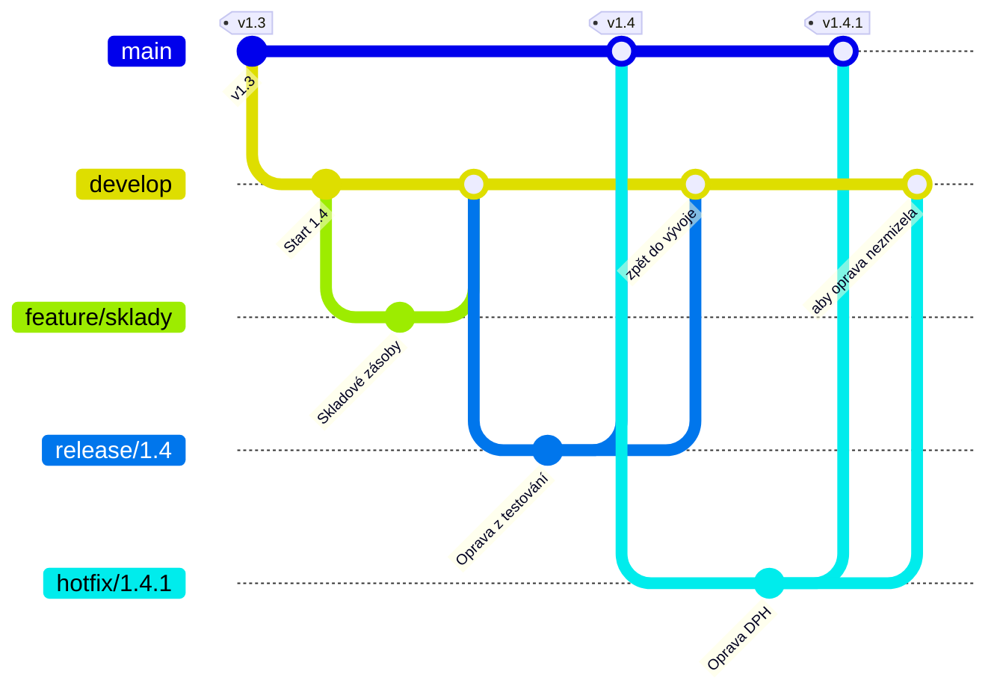

# GitFlow

> [← zpět na Git Workflows](../)

> **V jedné větě:** Pět typů větví a dvě trvalé, aby šlo současně vyvíjet novou verzi, stabilizovat tu příští a opravovat tu, která běží u zákazníků.

> [!IMPORTANT]
> **Autor sám tenhle model pro webové aplikace nedoporučuje.** V březnu 2020 připsal na začátek svého článku poznámku, že týmům s continuous delivery radí *„adopt a much simpler workflow (like GitHub flow) instead of trying to shoehorn git-flow into your team“*. GitFlow podle něj zůstává na místě tam, kde se dodává **explicitně verzovaný software** nebo se **podporuje víc verzí v produkci**. Než ho zavedeš, přečti si [Kdy nepoužít](#kdy-nepoužít) — je to nejčastěji zbytečně nasazený model vůbec.

---

## Pro koho a proč vznikl

Vincent Driessen popsal model v lednu 2010 a používal ho zhruba od roku 2009. Je potřeba si uvědomit, jak tehdy vypadalo dodávání softwaru: **nasazení bylo událost.** Verze se číslovaly, vydání se plánovalo, před ním přišla fáze testování a to, co běželo u zákazníků, se lišilo od toho, na čem se zrovna pracovalo.

Z toho plyne celý model. Když v produkci běží verze 2.3 a tým už půl roku dělá na 3.0, potřebuješ **tři různá místa najednou**:

- kde je to, co běží u zákazníků (a odkud se vydávají opravy)
- kde se sbírá práce na příští verzi
- kde se ta příští verze **stabilizuje**, aniž by ji rušily nové věci

GitFlow na to má tři odpovědi: `main`, `develop` a `release/*`. Nic z toho není ceremonie pro ceremonii — každá větev je odpověď na jednu z těch tří potřeb. **Problém nastane, když tým žádnou z nich nemá.**

**Poznáš, že je to tvoje situace, podle:**

- vydáváš **číslované verze**, na které někdo odkazuje
- v produkci nebo u zákazníků běží **víc verzí současně**
- mezi „hotovo“ a „u zákazníka“ je **testovací cyklus** — QA, akceptace, certifikace
- nasazení má **termín**, který se plánuje dopředu
- opravu do staré verze musíš vydat **bez novinek** z rozpracované

---

## Větve a jejich role

| Větev | Vzniká z | Merge do | Jak dlouho žije | Kdo ji zakládá |
| ----- | -------- | -------- | --------------- | -------------- |
| `main` | — | — | trvale | — |
| `develop` | — | — | trvale | — |
| `feature/*` | `develop` | `develop` | dny až **týdny** | vývojář |
| `release/*` | `develop` | **`main` i `develop`** | dny až týdny | ten, kdo řídí vydání |
| `hotfix/*` | **`main`** | **`main` i `develop`** | hodiny | kdokoli při incidentu |

**Co je na `main`:** poslední vydaná verze. Každý commit na téhle větvi je vydání a má značku. Přímo se do ní nikdy nepracuje.

**Co je na `develop`:** to, co půjde do příštího vydání. Je hotové, ale ještě nevydané.

Dva řádky v tabulce mají v sloupci *Merge do* **dvě cílové větve** — a právě tam vzniká nejčastější chyba celého modelu. Oprava, která se vrátí jen do `main`, v příštím vydání z `develop` **zmizí**, protože ji tam nikdo nedonesl. Chyba se pak vrátí jako „regrese“ o dva měsíce později.

> [!NOTE]
> Původní článek používá jména `master`, `release-*` a `hotfix-*` s pomlčkou. Dnešní praxe i pomocné nástroje používají `main` a lomítko (`release/1.4`), a tak to drží i tenhle dokument.

---

## Diagram



Porovnej si ho s diagramem u [GitHub Flow](../GitHubFlow/#diagram) — ten má dvě větve a nudný tvar. **Tenhle rozdíl je celá podstata volby mezi nimi.** Všimni si, že `release/1.4` i `hotfix/1.4.1` se vracejí **dvakrát**: do `main` kvůli vydání a do `develop`, aby se práce neztratila.

---

## Běžný den

Model má pomocný nástroj `git flow`, ale vyplatí se znát příkazy pod ním — až se něco pokazí, budeš je potřebovat. Uvádím obojí.

**1. Začínám úkol**

```bash
git switch develop
git pull
git switch -c feature/skladove-zasoby
```

```bash
git flow feature start skladove-zasoby     # totéž s nástrojem
```

Větev vzniká z `develop`, **nikdy z `main`**. Na `main` je stará vydaná verze.

**2. Práce a průběžné odesílání**

```bash
git add .
git commit -m "Sklady: rezervace při vytvoření objednávky"
git push -u origin feature/skladove-zasoby
```

**3. Než požádám o review**

```bash
git switch develop
git pull
git switch feature/skladove-zasoby
git merge develop
```

U tohohle modelu se obvykle **merguje, ne rebasuje** — historie je stejně větvená a [rebase](../Glossary.md#rebase) by u dlouhé větve znamenal řešit tytéž konflikty opakovaně.

**4. Po schválení**

```bash
# merge přes pull request do develop, ne do main
git switch develop
git pull
git branch -d feature/skladove-zasoby
```

**5. Příprava vydání**

Když je v `develop` všechno, co má být ve verzi:

```bash
git switch develop
git pull
git switch -c release/1.4
# zvýšení čísla verze, changelog
git commit -m "Verze 1.4"
git push -u origin release/1.4
```

```bash
git flow release start 1.4
```

**Od téhle chvíle jde do `release/1.4` už jen oprava toho, co se najde při testování** — žádné nové funkce. Ty pokračují do `develop` a půjdou ve verzi 1.5. To je hlavní důvod, proč release větev existuje: **odblokuje vývoj, zatímco se vydání stabilizuje.**

---

## Vydání a hotfix

Tady je model doma. Právě kvůli tomuhle se ho vyplatí zavést — a bez tohohle je to jen pět zbytečných větví.

**Vydání** — release větev se vrací na dvě místa:

```bash
git switch main
git pull
git merge --no-ff release/1.4
git tag -a v1.4.0 -m "Skladové zásoby"
git push origin main --tags

git switch develop
git merge --no-ff release/1.4      # ← opravy z testování zpátky do vývoje
git push origin develop

git branch -d release/1.4
```

```bash
git flow release finish 1.4        # udělá obojí i značku
```

**Hotfix do produkce** — jediná větev, která vzniká z `main`:

```bash
git switch main
git pull
git switch -c hotfix/1.4.1
# oprava
git commit -m "Fakturace: oprava zaokrouhlení DPH"

git switch main
git merge --no-ff hotfix/1.4.1
git tag -a v1.4.1 -m "Oprava zaokrouhlení DPH"
git push origin main --tags

git switch develop
git merge --no-ff hotfix/1.4.1     # ← bez tohohle se chyba vrátí
git push origin develop
```

To, co GitHub Flow neumí, zvládne tenhle model bez přemýšlení: **oprava se vydá ze stavu, který je v produkci** — bez čehokoli rozpracovaného z `develop`. Když je zrovna otevřená release větev, patří hotfix i do ní, jinak se v příštím vydání ztratí.

> [!WARNING]
> **Druhý merge — ten do `develop` — je nejčastěji zapomenutý krok celého modelu.** Nic se tím nerozbije hned; chyba se vrátí až v příštím vydání a vypadá jako regrese. `git flow ... finish` to dělá za tebe, a to je hlavní důvod, proč ten nástroj používat.

---

## Co si to vyžaduje

| Předpoklad | Proč | Bez toho |
| ---------- | ---- | -------- |
| **Někdo řídí vydání** | Release větev musí někdo založit, hlídat a uzavřít | `release/*` zůstane otevřená měsíce a stane se druhým `develop` |
| **Číslované verze** | Model je celý postavený na tom, že vydání má jméno | Větve `release/1.4` nemají co znamenat |
| **Kázeň u dvojitého merge** | Release i hotfix se vracejí na dvě místa | Opravy tiše mizí a vracejí se jako regrese |
| **Krátké feature větve** | Model je nesvazuje délkou, ale konflikty rostou stejně | Merge do `develop` se stane událostí, na kterou se tým chystá |
| **CI aspoň na `develop` a `release/*`** | Stabilizace musí být měřitelná, ne pocitová | Release větev se testuje ručně a vydání se odkládá |
| **Znalost modelu v celém týmu** | Pět typů větví si musí pamatovat každý | Lidé si to zjednoduší po svém a model se rozpadne na půl GitFlow |

Poslední řádek je i Chaconův argument z [GitHub Flow](../GitHubFlow/#pro-koho-a-proč-vznikl): složitost, kterou nejde vynutit nástrojem, si tým stejně upraví. U GitFlow to platí dvojnásob — proto k němu vznikl pomocný skript.

---

## Pro jaký tým a projekt

| | |
| --- | --- |
| **Velikost týmu** | střední až velký; u malého převáží režie |
| **Způsob dodávání** | plánovaná vydání (fázový vývoj) |
| **Stabilizační fáze před vydáním** | **ano** — QA cyklus, akceptace, certifikace |
| **Frekvence nasazení** | jednou za sprint až jednou za kvartál |
| **Typ produktu** | instalovaný software, knihovna, mobilní aplikace, produkt s verzemi u zákazníků |
| **Kolik verzí se podporuje** | **několik současně** |
| **Provozní náročnost** | ●●●●○ |

**Hodí se, když:**

- ✅ **Podporuješ víc verzí** a musíš umět vydat opravu do té starší.
- ✅ Mezi dokončením a vydáním je **testovací cyklus**, který někdo musí odbavit.
- ✅ Vydání má **termín** a od určité chvíle do něj nesmí přibývat nové věci.
- ✅ Uživatel si software **instaluje** a ty ho nemůžeš vzdáleně vrátit zpátky.
- ✅ Vydání podléhá **schválení nebo certifikaci** (regulace, app store, zákaznická akceptace).

## Kdy nepoužít

- ❌ **Nasazuješ SaaS průběžně.** Tohle říká i autor — pro continuous delivery doporučuje [GitHub Flow](../GitHubFlow/). Release větev, která žije dvě hodiny, nemá co stabilizovat.
- ❌ **V produkci běží jediná verze.** Pak `main` a `develop` říkají totéž s jiným zpožděním a `develop` je jen `main` s prodlevou.
- ❌ **Nikdo nemá na starosti vydání.** Bez toho release větve nikdo neuzavírá a model degraduje na dvě trvalé větve bez užitku.
- ❌ **Malý tým, který nasazuje často.** Režie sedí, výhoda ne.
- ❌ **Chceš „pořádek“, ne řešit skutečný problém.** Nejčastější důvod, proč se GitFlow nasadí — a nejhorší.

---

## Časté chyby

| Chyba | Proč vadí | Jak správně |
| ----- | --------- | ----------- |
| Hotfix se nevrátí do `develop` | Oprava zmizí v příštím vydání a vrátí se jako regrese | `git flow hotfix finish`, nebo merge na obě strany ručně |
| Release větev se nevrátí do `develop` | Opravy z testování se ztratí | Totéž — dva merge, ne jeden |
| Feature větev žije měsíc | Merge do `develop` se stane událostí; konflikty rostou s časem | Rozděl úkol, slučuj průběžně |
| `feature/*` vzniká z `main` | Staví se na staré vydané verzi | Vždy z `develop` |
| Nasazuje se z `develop` | `develop` není vydání a nikdy neprošel stabilizací | Nasazuje se z `main`, případně z `release/*` na testovací prostředí |
| Release větev je otevřená měsíce | Stane se druhým `develop` a přestane plnit účel | Release větev jsou dny; co se nestihlo, jde do příští |
| Do release větve přibývají funkce | [Zmrazení kódu](../Glossary.md#code-freeze-zmrazení-kódu) přestane platit a vydání se odkládá donekonečna | Do `release/*` jen opravy nalezené při testování |
| Model se zavede na SaaS s denním nasazováním | Veškerá režie, žádná výhoda | [GitHub Flow](../GitHubFlow/) |
| `git merge` bez `--no-ff` | [Fast-forward](../Glossary.md#fast-forward) smaže stopu po větvi a v historii nepoznáš, co bylo vydání | `--no-ff` u všech merge do `main` a `develop` |
| Zapomenutá značka u vydání | Nedohledáš, co přesně bylo v produkci | Značka při každém merge do `main` |
| Půlka týmu používá `git flow`, půlka ne | Vzniknou různě pojmenované větve a nekonzistentní historie | Dohodnout jedno a vynutit nastavením |

---

## Nastavení v GitHubu / GitLabu

| Nastavení | Hodnota | Proč |
| --------- | ------- | ---- |
| Protected branch | `main` **i** `develop` | Do obou se smí jen přes pull request |
| Výchozí větev pro pull requesty | `develop` | Jinak budou lidé omylem mířit do `main` |
| Required status checks | `develop`, `release/*` | Stabilizace musí být měřitelná |
| Required approvals | 1–2 | U `main` klidně přísněji než u `develop` |
| Merge strategy | **merge commit** (`--no-ff`) | Model stojí na tom, že je v historii vidět, co byla větev a co vydání |
| Squash | **vypnout** u `release/*` a `hotfix/*` | Squashem se ztratí vazba mezi vydáním a opravou v obou cílových větvích |
| Chráněné značky (`v*`) | zapnuto | Značka je jediný spolehlivý odkaz na vydaný stav |

Squash je tu záměrně jinak než u [GitHub Flow](../GitHubFlow/#nastavení-v-githubu--gitlabu). Tam se hodí, protože větve jsou krátké a jeden úkol je jeden commit. Tady by rozbil to, na čem model stojí — možnost dohledat, co přesně se vydalo a kudy se to dostalo do obou trvalých větví.

---

## Přechod na jiný workflow

Nejčastější směr je pryč od GitFlow, obvykle ve chvíli, kdy tým přejde na průběžné nasazování.

**Na [GitHub Flow](../GitHubFlow/)** — dá se udělat najednou, ale ne dřív, než je čím nahradit stabilizační fázi:

1. Zavři a vydej rozpracovaná vydání, ať nezůstane otevřená release větev.
2. Zajisti, aby na `develop` bylo všechno, co je v `main` (zkontroluj zapomenuté hotfixy).
3. Sluč `develop` do `main` a `develop` **zruš**.
4. Zaveď automatické nasazení po merge — bez toho vznikne jen `main` bez pravidel.
5. Zkrať feature větve; dokud žijí týdny, změnil jsi jen jména.

**Na [OneFlow](../OneFlow/)** je krok menší: zůstanou release i hotfix větve, zmizí jen `develop`. Pro tým, který potřebuje vydání, ale ne dvě trvalé větve.

---

## Související workflow

| Workflow | Vztah |
| -------- | ----- |
| [GitHub Flow](../GitHubFlow/) | **Přímý protipól a nástupce.** Vznikl v roce 2011 jako reakce na složitost GitFlow; sám Driessen ho dnes doporučuje týmům s continuous delivery. |
| [Trunk-Based Development](../TrunkBasedDevelopment/) | **Opačný konec škály.** Kde tenhle model odděluje vývoj od vydání větvemi, tam se to řeší přepínači v kódu. Nezná zapomenutý druhý merge, protože se do hlavní větve nikdy nic nevrací. |
| [GitLab Flow](../GitLabFlow/) | **Vědomé zjednodušení tohohle modelu.** Řeší tutéž cestu k vydání, ale jednou trvalou větví a buď prostředími, nebo větvemi na verzi — ne obojím. |
| [OneFlow](../OneFlow/) | **Tenhle model bez `develop`.** Zachovává release i hotfix větve, ubírá jednu trvalou — a s ní i zapomenutý druhý merge. Vznikl z přímé kritiky GitFlow. |

---

## Původ

|             |                    |
| ----------- | ------------------ |
| **Autor**   | Vincent Driessen   |
| **Rok**     | 2010               |
| **Zdroj**   | článek *A successful Git branching model* |
| **Provozní náročnost** | ●●●●○ |

Driessen článek zveřejnil v lednu 2010 a model podle svých slov používal zhruba od roku 2009. Stal se z něj na dlouhá léta **de facto standard** — do velké míry proto, že to byl první ucelený a nakreslený popis toho, jak s Gitem pracovat v týmu, v době, kdy většina lidí přecházela ze Subversion a neměla se čeho chytit.

Za tu popularitu ale model zaplatil: **zavedl se i tam, kam nepatří.** Firmy, které nasazovaly SaaS třikrát denně, si pořídily dvě trvalé větve a release proces pro vydání, které trvá dvě hodiny.

Sám autor na to o deset let později zareagoval. **5. března 2020** připsal na začátek článku poznámku, ve které rozlišuje dva světy: týmům s continuous delivery doporučuje jednodušší model (*„like GitHub flow“*), zatímco pro **explicitně verzovaný software a podporu více verzí v produkci** za svým modelem stojí dál.

To je pro čtení celého dokumentu podstatné: **GitFlow není překonaný, je specializovaný.** Otázka nezní, jestli je zastaralý, ale jestli dodáváš verze, nebo web.

Zajímavý je i osud pomocného nástroje. Skript `git flow`, bez kterého se model v praxi skoro nepoužíval, byl v původním repozitáři **archivován v říjnu 2025** s tím, že už není udržovaný. Roli nástupce převzal nejdřív fork `git-flow-avh` (Peter van der Does) a dnes `git-flow-next`. Pokud model zavádíš, ověř si, který z nich má tým nainstalovaný — příkazy se drží zpětné kompatibility, ale nastavení se liší.

---

## Zdroje

- Vincent Driessen: [*A successful Git branching model*](https://nvie.com/posts/a-successful-git-branching-model/), 2010 — původní článek včetně poznámky z roku 2020
- [`git-flow-next`](https://github.com/gittower/git-flow-next) — dnes udržovaný pomocný nástroj
- [`nvie/gitflow`](https://github.com/nvie/gitflow) — původní skript, archivovaný v říjnu 2025

---

<details>
<summary>Metadata workflow</summary>

```yaml
name: GitFlow
author: Vincent Driessen
year: 2010
branches: [main, develop, feature/*, release/*, hotfix/*]
long_lived_branches: ano
team_size: střední až velký
release_cadence: plánovaná vydání
requires_ci: doporučeno
requires_feature_flags: ne
supports_multiple_versions: ano
complexity: 4
tags: [release větve, hotfix, verzovaný software, stabilizační fáze, dvě trvalé větve]
related: [GitHubFlow, TrunkBasedDevelopment, GitLabFlow, OneFlow]
status: done
```

</details>
