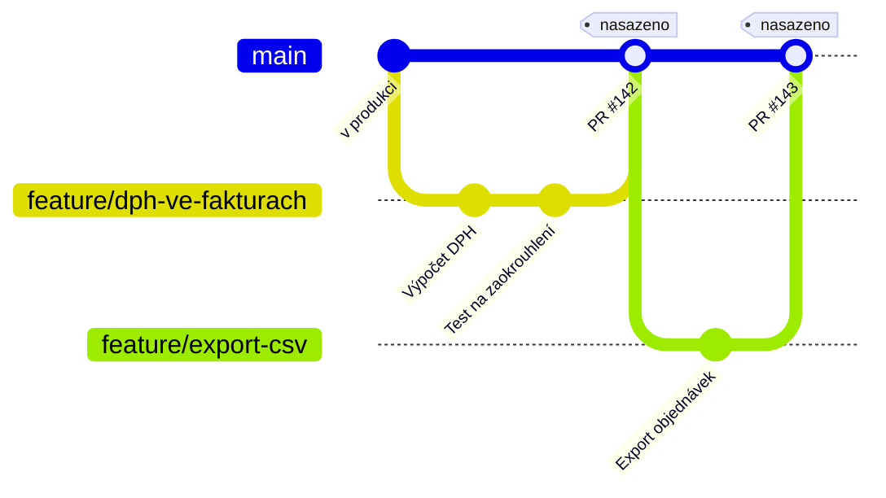

# GitHub Flow

> [← zpět na Git Workflows](../)

> **V jedné větě:** Jedna trvalá větev, krátké větve na úkoly a jedno pravidlo, ze kterého plyne všechno ostatní — **`main` je vždycky nasaditelný**.

> [!IMPORTANT]
> Nejčastější omyl: že GitHub Flow je „to jednoduché s pull requesty“. Jednoduchý je na papíře, ale stojí na tom, že se **nasazuje hned po merge**. Tým, který si vezme větve a PR, ale nasazuje jednou za měsíc, dostane `main` plný neověřeného kódu a **žádnou větev, ze které by šlo vydat opravu**. Původní pravidlo o nasazování dnešní [dokumentace GitHubu už neuvádí](#původ), a právě proto se na něj zapomíná.

---

## Pro koho a proč vznikl

V roce 2011 byl standardem **GitFlow** — pět typů větví, dvě trvalé, k tomu pomocný skript. Scott Chacon z GitHubu napsal, že je to na jejich práci zbytečně složité:

> „…it's more complicated than I think most developers and development teams actually require. It's complicated enough that a big helper script was developed to help enforce the flow.“

A přidal argument, který je konkrétnější než obvyklé stížnosti na složitost: složitý model **nejde vynutit v grafickém klientovi**, jen na příkazové řádce —

> „…the only people who have to learn the complex workflow really well … are the same people who aren't comfortable with the system enough to use it from the command line.“

Jinými slovy: ceremonii se naučí ti, kdo ji nejmíň potřebují, a zbytek týmu ji bude porušovat. GitHub proti tomu postavil model, který si pamatuje každý — a mohl si to dovolit, protože **nasazoval několikrát denně**. Když je poslední vydání staré dvě hodiny, nemá smysl držet release větve; produkce a `main` jsou skoro totéž.

**Poznáš, že je to tvoje situace, podle:**

- nasazuješ **často** — několikrát denně až jednou týdně
- v produkci běží **jedna verze** a nikdo nepoužívá starší
- máš **CI**, která na každém pull requestu pustí testy
- nasazení je **jedno tlačítko nebo automat**, ne půldenní rituál
- rozbitou produkci umíš vrátit zpátky **do minut**

---

## Větve a jejich role

| Větev | Vzniká z | Merge do | Jak dlouho žije | Kdo ji zakládá |
| ----- | -------- | -------- | --------------- | -------------- |
| `main` | — | — | trvale | — |
| `feature/*` | `main` | `main` | **hodiny až pár dní** | vývojář |

Dvě řádky, a to je celý model. Žádné `develop`, žádné `release/*`, žádné `hotfix/*`.

**Co je na `main`:** to, co je nasazené v produkci, nebo tam bude během chvíle. Tohle není popis, ale **závazek** — pokud na `main` může být kód, který v produkci neběžel, nemáš GitHub Flow, jen větve s pull requesty.

Sloupec *Jak dlouho žije* je důležitější než jména větví. Větev, která žije tři týdny, se od `main` vzdálí natolik, že se merge stane událostí, na kterou se tým chystá. **Tři dny je horní hranice, ne cíl.**

---

## Diagram



Každý merge do `main` je nasazení. Proto je na diagramu značka u každého z nich — a proto je diagram tak nudný. **To je jeho hlavní sdělení.**

---

## Běžný den

**1. Začínám úkol**

```bash
git switch main
git pull
git switch -c feature/dph-ve-fakturach
```

Jméno větve má popisovat úkol, ne ticket. `feature/dph-ve-fakturach` řekne kolegovi při pohledu na seznam větví víc než `feature/PROJ-1234`.

**2. Práce a průběžné odesílání**

```bash
git add .
git commit -m "Fakturace: výpočet DPH podle sazby položky"
git push -u origin feature/dph-ve-fakturach
```

Pushuj **každý den**, i když není hotovo. Větev na serveru je záloha a zároveň signál, že na tom někdo dělá.

**3. Otevřu pull request**

Klidně hned první den. Pull request není žádost o schválení, je to **místo pro diskusi** — pokud není hotovo, označ ho jako draft. Chacon to má přímo v pravidlech: PR se otevírá *„when you need feedback or think the branch is ready“*.

**4. Než požádám o review**

```bash
git switch main
git pull
git switch feature/dph-ve-fakturach
git rebase main          # nebo: git merge main
```

Cílem je, aby recenzent viděl změnu proti aktuálnímu `main`, ne proti stavu z minulého týdne. Jestli [rebase, nebo merge](../Glossary.md#rebase), je věcí konvence týmu — hlavně ať je jedna.

**5. Po schválení**

```bash
# merge přes tlačítko v pull requestu, ne z příkazové řádky
git switch main
git pull
git branch -d feature/dph-ve-fakturach
```

Merge dělej v rozhraní GitHubu — jen tak se do historie propíše číslo pull requestu a diskuse zůstane dohledatelná. **Větev po merge smaž**; jinak jich za půl roku budou stovky a nikdo nepozná, které žijí.

**6. Nasazení**

Automatické po merge do `main`. Když automatické není, je to **ruční krok, který nesmí počkat do zítra** — jinak přestává platit pravidlo, na kterém celý model stojí.

---

## Vydání a hotfix

Tady je vidět, čím se GitHub Flow liší od všeho ostatního: **nemá vydání ani hotfixy jako zvláštní případ.**

**Vydání** je merge pull requestu. Žádná `release/*` větev, žádné zmrazení kódu, žádný termín. Když chce tým označit stav pro sebe nebo pro zákazníky, udělá to značkou:

```bash
git tag -a v1.4.0 -m "Fakturace s DPH"
git push origin v1.4.0
```

Značka je tu ale **popisek, ne proces** — nic se kvůli ní neděje.

**Hotfix** je obyčejná větev, jen ji všichni pustí dopředu:

```bash
git switch main
git pull
git switch -c fix/dph-zaokrouhleni
# oprava, commit, push, PR, review, merge, nasazení
```

Že to funguje, závisí na jediné věci: **`main` musí být totožný s produkcí.** Když je na něm pět nenasazených změn, oprava je s sebou vezme do produkce — a to je přesně ten okamžik, kdy si tým uvědomí, že GitHub Flow bez průběžného nasazování nefunguje.

Druhá možnost při rozbité produkci je **vrátit poslední nasazení** (revert pull requestu, nebo přenasazení předchozí verze) a opravovat v klidu. U tohohle modelu je to často správnější odpověď než spěchat s opravou.

---

## Co si to vyžaduje

| Předpoklad | Proč | Bez toho |
| ---------- | ---- | -------- |
| **CI na každém pull requestu** | `main` musí zůstat nasaditelný; testy jsou jediné, co to hlídá | Rozbitý `main` zablokuje celý tým, protože z něj všichni větví |
| **Rychlé nasazení** — automat nebo jedno tlačítko | Merge a nasazení musí být prakticky totéž | Na `main` se hromadí neověřený kód a přestane platit hlavní pravidlo |
| **Rychlý návrat zpátky** | Když se nasazuje hned, chyba se objeví v produkci | Každá chyba je incident na hodiny místo na minuty |
| **Kapacita na review** | Větev čeká na schválení; čekání ji prodlužuje | Větve stárnou, konflikty rostou, model se rozpadá sám |
| **[Feature flagy](../Glossary.md#feature-flag) na rozpracované věci** | Velký úkol se musí dostat do `main` po částech | Buď dlouhá větev, nebo nehotová funkce v produkci |
| **Automatické kontroly kvality** | Review nemá řešit formátování | Recenzenti se hádají o mezery místo o návrh |

První tři jsou nepodkročitelné. **Tým, který nesplní ani je, si vybírá jiný model** — GitHub Flow mu bude fungovat na papíře a rozpadne se při prvním incidentu.

---

## Pro jaký tým a projekt

| | |
| --- | --- |
| **Velikost týmu** | 2 až ~20 lidí; větší tým potřebuje víc kázně kolem `main` |
| **Způsob dodávání** | průběžně (agile, continuous delivery) |
| **Stabilizační fáze před vydáním** | **ne** — nasazuje se rovnou |
| **Frekvence nasazení** | několikrát denně až jednou týdně |
| **Typ produktu** | SaaS, webová aplikace, interní systém, API |
| **Kolik verzí se podporuje** | **jedna** |
| **Provozní náročnost** | ●●○○○ |

**Hodí se, když:**

- ✅ Nasazuješ **často** a nasazení je rutina, ne událost.
- ✅ V produkci běží **jediná verze**, kterou používají všichni.
- ✅ Tým je **smíšený** a model se musí naučit i lidé, kteří Git neovládají do hloubky.
- ✅ Chceš, aby **review bylo běžnou součástí práce**, ne kontrolní bránou před vydáním.
- ✅ Máš **rychlý rollback** a chyba v produkci není katastrofa.

## Kdy nepoužít

- ❌ **Podporuješ víc verzí naraz.** Zákazník na verzi 2.3 potřebuje opravu, ale ne novinky z 3.0 — a GitHub Flow nemá větev, ze které by to šlo vydat. Tohle je **GitFlow** nebo **GitLab Flow**.
- ❌ **Mezi „hotovo“ a „v produkci“ je testovací cyklus.** Když kód po dokončení čeká na QA, musí někde počkat — a v tomhle modelu není kde.
- ❌ **Nasazení je událost**, kterou se schvaluje, plánuje na termín nebo dělá jednou za kvartál. Pak `main` nemá jak zůstat totožný s produkcí.
- ❌ **Nemáš CI ani rychlý rollback.** Model se spoléhá na to, že se chyba najde rychle a opraví ještě rychleji.
- ❌ **Instalovaný software u zákazníků**, kde se verze nedají vrátit vzdálenou akcí.

---

## Časté chyby

| Chyba | Proč vadí | Jak správně |
| ----- | --------- | ----------- |
| Větve žijí týdny | Konflikty rostou s časem, review je nezvladatelné a autor mezitím zapomněl kontext | Rozděl úkol; horní hranice jsou dny |
| Vezme se model, ale nasazuje se jednou za měsíc | `main` přestane odpovídat produkci, hotfix vezme s sebou pět cizích změn | Buď nasazuj po merge, nebo zvol **GitLab Flow** |
| Vznikne `develop`, „aby byl `main` čistý“ | Tím je z toho poloviční **GitFlow** bez jeho výhod — a `main` stejně nikdo nenasazuje | Jedna trvalá větev, nebo přejdi celý |
| Pull request se otevře až v okamžiku, kdy je hotovo | Zpětná vazba přijde, když už se nedá nic změnit | Otevři ho hned jako draft |
| Nikdo se do review nehrne | Větev čeká a stárne; časem to model rozloží | Review má přednost před vlastní prací |
| Větve se po merge nemažou | Za půl roku stovky větví a nikdo nepozná, které žijí | Zapni automatické mazání po merge |
| Rozbitý `main` se neopraví hned | Blokuje celý tým, protože z něj všichni větví | Rozbitý `main` je nejvyšší priorita |
| Rozpracovaná funkce se drží ve větvi | Přesně to, čemu se model vyhýbá | [Feature flag](../Glossary.md#feature-flag) a slučuj po částech |
| Jméno větve je číslo ticketu | Ze seznamu větví nikdo nepozná, co se kde děje | `feature/dph-ve-fakturach` |
| „Nasadíme to všechno večer najednou“ | Když se něco rozbije, nevíš co z toho | Nasazuj po jednom merge |

---

## Nastavení v GitHubu / GitLabu

Model, který není vynucený nastavením, se do měsíce rozsype — tenhle obzvlášť, protože stojí na jediném pravidle, které nikdo nevidí.

| Nastavení | Hodnota | Proč |
| --------- | ------- | ---- |
| Protected branch | `main` | Bez toho někdo commitne přímo a obejde review i CI |
| Require pull request before merging | zapnuto | Jediná cesta do `main` |
| Required approvals | 1 (u větších týmů 2) | Víc než dva schvalovatele = větev čeká a stárne |
| Required status checks | testy + lint | Tohle drží slib „`main` je nasaditelný“ |
| Require branches to be up to date | zapnuto | Testy proběhnou proti aktuálnímu `main`, ne proti stavu z minulého týdne |
| Automatically delete head branches | zapnuto | Ušetří pravidelný úklid |
| Merge strategy | **squash** (doporučeno) | Jeden úkol = jeden commit v `main`; historie se čte a revert je triviální |
| Deployment | automaticky po merge do `main` | Bez tohohle to není GitHub Flow |

Ke squashi: hodí se právě proto, že větve jsou krátké. Když má větev tři commity typu „oprava překlepu“, není co zachovávat. U dlouhých větví by se squashem ztratil užitečný postup — ale ty tu být nemají.

---

## Související workflow

| Workflow | Vztah |
| -------- | ----- |
| **GitFlow** | Model, proti kterému GitHub Flow vznikl. Sáhni po něm, když podporuješ víc verzí nebo máš stabilizační fázi. *(zatím nezpracováno)* |
| **Trunk-Based Development** | Tentýž směr dotažený dál: větve žijí hodiny, nebo vůbec. Vyžaduje zralejší CI a feature flagy. *(zatím nezpracováno)* |
| **GitLab Flow** | GitHub Flow plus větve pro prostředí. Odpověď pro tým, který nemůže nasazovat po každém merge. *(zatím nezpracováno)* |
| **OneFlow** | Zjednodušený GitFlow s jednou trvalou větví — někde mezi tímhle a GitFlow. *(zatím nezpracováno)* |

---

## Původ

|             |                    |
| ----------- | ------------------ |
| **Autor**   | Scott Chacon (GitHub) |
| **Rok**     | 2011               |
| **Zdroj**   | článek *GitHub Flow* na osobním blogu |
| **Provozní náročnost** | ●●○○○ |

Chacon model popsal v srpnu 2011 jako **reakci na GitFlow**, který byl tehdy de facto standardem. Jeho argument nebyl, že je GitFlow špatný — psal o něm, že je pro spoustu týmů zbytečně složitý a že složitost, kterou nejde vynutit nástrojem, si tým stejně zjednoduší po svém.

Původních šest pravidel:

1. Cokoli v `master` je nasaditelné
2. Pro novou práci založ popisně pojmenovanou větev z `master`
3. Commituj do ní lokálně a pravidelně pushuj
4. Otevři pull request, když potřebuješ zpětnou vazbu nebo je hotovo
5. Do `master` slučuj až po review od někoho jiného
6. **Nasaď hned po review**

Za pozornost stojí, jak se model od té doby posunul. **Dnešní [dokumentace GitHubu](https://docs.github.com/en/get-started/using-github/github-flow) uvádí šest kroků — vytvoř větev, uprav, otevři pull request, vypořádej připomínky, slučuj, smaž větev — a nasazování mezi nimi není vůbec.** Zůstal proces kolem pull requestu; pravidla o nasaditelném `master` a okamžitém nasazení, ze kterých celý model plynul, z popisu vypadla.

To vysvětluje nejčastější způsob, jak se GitHub Flow zavede špatně: tým převezme větve a pull requesty, ale nasazuje jednou za měsíc. Dostane tím administrativu okolo review a **žádnou z výhod**, kvůli kterým model vznikl. Pokud si z dokumentu odneseš jednu věc, ať je to tahle: **není to workflow o pull requestech, je to workflow o nasazování.**

(Větev `master` se v původním znění jmenuje tak, jak se tehdy jmenovala; GitHub ji jako výchozí přejmenoval na `main` v roce 2020.)

---

## Zdroje

- Scott Chacon: [*GitHub Flow*](https://scottchacon.com/2011/08/31/github-flow/), 2011 — původní článek
- [GitHub Docs: GitHub flow](https://docs.github.com/en/get-started/using-github/github-flow) — dnešní znění
- [GitHub Docs: About protected branches](https://docs.github.com/en/repositories/configuring-branches-and-merges-in-your-repository/managing-protected-branches/about-protected-branches)

---

<details>
<summary>Metadata workflow</summary>

```yaml
name: GitHub Flow
author: Scott Chacon
year: 2011
branches: [main, feature/*]
long_lived_branches: ne
team_size: malý až střední
release_cadence: průběžně
requires_ci: ano
requires_feature_flags: doporučeno
supports_multiple_versions: ne
complexity: 2
tags: [pull request, continuous delivery, krátké větve, jedna trvalá větev]
related: [GitFlow, TrunkBasedDevelopment, GitLabFlow, OneFlow]
status: done
```

</details>
