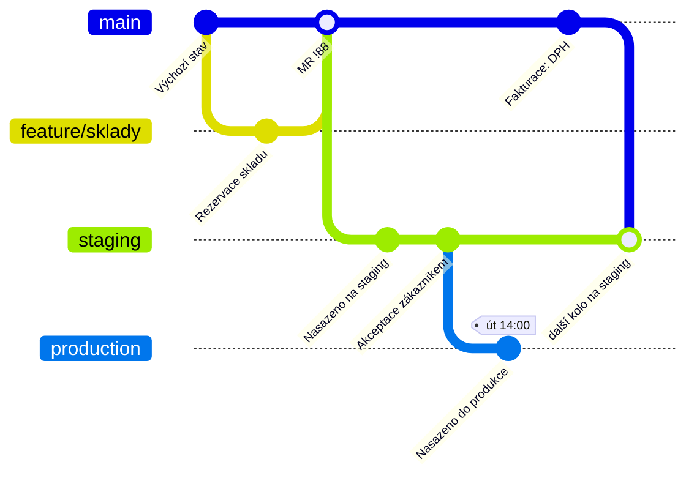

# GitLab Flow

> [← zpět na Git Workflows](../)

> **V jedné větě:** [GitHub Flow](../GitHubFlow/) doplněný o to, na co sám odpověď nemá — **kudy kód putuje přes prostředí** a jak se vydává, když se nenasazuje rovnou po sloučení.

> [!NOTE]
> Tenhle model je **záměrně kompromis** a dá se v něm zvolit ze dvou podob, které spolu nesouvisí: větve pro prostředí, nebo release větve. Vybírá se **jedna** podle toho, co tým řeší — [srovnání níž](#dvě-podoby--vyber-si-jednu).

---

## Pro koho a proč vznikl

GitLab v roce 2014 popsal model jako odpověď na dva sousedy, ze kterých ani jeden neseděl.

O [GitHub Flow](../GitHubFlow/) napsal, že je sice jednoduchý, ale

> „…still leaves a lot of questions unanswered regarding deployments, environments, releases, and integrations with issues.“

To je přesná diagnóza. GitHub Flow stojí na tom, že merge do `main` **je** nasazení. Jenže spousta týmů má mezi tím ještě něco: staging, akceptaci od zákazníka, nasazovací okno, nebo prostě prostředí, na kterém se to musí ukázat, než to půjde dál. GitHub Flow na to nemá větev ani slovo.

O [GitFlow](../GitFlow/) zase, že `develop` větev a celý aparát release a hotfix větví je

> „…overkill for the vast majority“

organizací, obzvlášť těch s průběžným dodáváním.

GitLab Flow tedy začíná u GitHub Flow — **jedna trvalá větev, krátké větve, merge requesty** — a přidává právě jednu věc navíc. Buď větve pro prostředí, nebo release větve. **Nikdy oboje.**

**Poznáš, že je to tvoje situace, podle:**

- mezi `main` a produkcí máš **staging nebo akceptaci**, kterou nejde přeskočit
- nasazuje se v **oknech** nebo po schválení, ne automaticky po merge
- chceš vědět, **co přesně je na kterém prostředí** — a z Gitu to teď nepoznáš
- nebo: vydáváš **verze**, ale nechceš kvůli tomu dvě trvalé větve jako v GitFlow

---

## Dvě podoby — vyber si jednu

### A) Větve pro prostředí

Každé prostředí má svou větev a kód jimi **putuje jedním směrem**:

```
main  →  staging  →  production
```

Nasazení na staging je merge `main` → `staging`. Nasazení do produkce je merge `staging` → `production`. Větev `production` tak vždycky říká, **co přesně tam běží** — a to je informace, kterou z GitHub Flow nedostaneš.

Klíčové pravidlo, na kterém všechno stojí:

> „This workflow, where commits only flow downstream, ensures that everything is tested in all environments.“

**Commity tečou jen po proudu. Zpátky do `main` se nemerguje nikdy.** Kdyby ano, do hlavní větve by se dostalo něco, co neprošlo předchozími prostředími — a celá záruka by padla.

### B) Release větve

Pro software, který se vydává ve verzích. Každá minor verze má svou větev (`2-3-stable`, `2-4-stable`) a platí **upstream first**:

> „If possible, first merge these bug fixes into `main`, and then cherry-pick them into the release branch.“

Oprava tedy **nejdřív do `main`**, teprve pak [cherry-pickem](../Glossary.md#cherry-pick) do vydání. Důvod je ten, že jinak se chyba v příští verzi vrátí — nikdo ji tam nedonesl. GitLab u toho poznamenává, že stejnou politiku dodržují i Google a Red Hat.

Je to **stejné pravidlo a stejný důvod** jako [fix forward](../TrunkBasedDevelopment/#vydání-a-hotfix) u Trunk-Based Development.

### Kterou zvolit

| | **Větve pro prostředí** | **Release větve** |
| --- | --- | --- |
| Řeší | kudy kód putuje k produkci | jak vydávat a opravovat verze |
| Kolik trvalých větví | `main` + jedna na prostředí | `main` + větev na verzi |
| Kdy | staging, akceptace, nasazovací okna | verzovaný software, víc podporovaných verzí |
| Směr toku | **po proudu** (`main` → … → `production`) | **proti proudu** (`main` → cherry-pick do vydání) |
| Typ produktu | SaaS, interní systém | knihovna, instalovaný software |

**Nemíchej je.** Tým, který má větve pro prostředí i release větve, si postavil [GitFlow](../GitFlow/) oklikou a bez jeho nástrojů. Když potřebuješ obojí doopravdy, sáhni rovnou po GitFlow — je na to stavěný.

**Výchozí volba je podoba A**, protože odpovídá tomu, proč tenhle model většina týmů hledá: mají GitHub Flow, ale nemůžou nasazovat rovnou.

---

## Větve a jejich role

Pro podobu s prostředími:

| Větev | Vzniká z | Merge do | Jak dlouho žije | Kdo ji zakládá |
| ----- | -------- | -------- | --------------- | -------------- |
| `main` | — | `staging` | trvale | — |
| `feature/*` | `main` | `main` | dny | vývojář |
| `staging` | `main` | `production` | trvale | — |
| `production` | `staging` | **nikam** | trvale | — |

**Co je na `main`:** to, co prošlo review a CI. Není to produkce — od ní je to vzdálené dvě prostředí.

**Co je na `production`:** přesně to, co běží u uživatelů. Tohle je hlavní přínos modelu.

Všimni si, že ve sloupci *Merge do* není **ani jednou** směr zpátky nahoru. To je celá disciplína tohohle modelu v jednom sloupci.

---

## Diagram



Merge šipky vedou **jen doprava dolů**. Nikde se nic nevrací — a právě proto se dá `production` věřit.

---

## Běžný den

Pro vývojáře je běžný den **totožný s [GitHub Flow](../GitHubFlow/#běžný-den)**. Rozdíl začíná až za merge requestem.

**1.–4. Úkol, práce, merge request, merge do `main`**

```bash
git switch main
git pull
git switch -c feature/skladove-rezervace
# práce, commit, push, merge request, review, merge do main
```

**5. Nasazení na staging**

```bash
git switch staging
git pull
git merge --no-ff main
git push origin staging
```

V praxi se to dělá **merge requestem `main` → `staging`**, ne z příkazové řádky — projde tím CI a je z toho záznam, kdo a kdy nasadil.

**6. Nasazení do produkce**

```bash
# merge request staging → production, po akceptaci
```

Ta dvě sloučení jsou **nasazovací tlačítka**. To je celý trik modelu: nasazení není akce mimo Git, ale merge request, který má autora, čas a schvalovatele.

> [!WARNING]
> **Nikdy nedělej merge z `production` nebo `staging` zpátky do `main`.** Vypadá to jako srovnání větví, ale znamená to, že se do hlavní větve dostane něco, co neprošlo cestou přes prostředí. Ztratíš tím jedinou záruku, kterou model dává. Když se větve rozejdou, je to příznak, že se někde obešel proces — a to se řeší tam, ne merge requestem.

---

## Vydání a hotfix

**Vydání** u podoby s prostředími není událost — je to merge request do `production`. Chceš-li stav pojmenovat, přidej [značku](../Glossary.md#tag-značka).

**Hotfix** je jediné místo, kde model připouští výjimku z pravidla o směru toku. Když produkce hoří a čekat na cestu přes staging nejde, vyrobí se oprava na krátké větvi a jde **rovnou do `production`** — a pak se stejná oprava merge requesty **propíše i do ostatních větví**, aby ji příští kolo nepřepsalo.

```bash
git switch production
git pull
git switch -c hotfix/dph-zaokrouhleni
# oprava, MR do production, nasazení

# a hned nato do main i staging, ať oprava nezmizí
```

Tady je model **slabší než [Trunk-Based Development](../TrunkBasedDevelopment/)**, kde oprava jde vždycky přes trunk a zapomenout se nedá. Vyplatí se to vědět: **spěchající hotfix je u tohohle modelu jediná operace, kterou musí uhlídat člověk.**

U podoby s release větvemi platí naopak upstream first bez výjimky — oprava do `main`, pak cherry-pick.

---

## Co si to vyžaduje

| Předpoklad | Proč | Bez toho |
| ---------- | ---- | -------- |
| **Prostředí odpovídají větvím** | Model tvrdí, že `production` říká, co běží v produkci | Větev lže; jakmile jednou, přestane jí kdokoli věřit |
| **Nasazení je navázané na merge** | Jinak jsou to jen tři větve, které nikoho nezajímají | Někdo nasadí ručně a větve se rozejdou |
| **Kázeň v jednom směru** | Zpětný merge zruší celou záruku | Do `main` se dostane neověřený kód a nikdo si toho nevšimne |
| **Automatický úklid hotfixů** nebo checklist | Spěchající oprava jde do `production` mimo pořadí | Oprava zmizí při příštím kole a vrátí se jako regrese |
| **CI aspoň na `main`** | Prostředí mají testovat nasazení, ne kód | Rozbitý kód doputuje až na staging a zdrží akceptaci |
| **Krátké feature větve** | Model je nehlídá; konflikty rostou stejně | Merge do `main` se stane událostí |

První řádek je zásadní. **Model má hodnotu jen tehdy, když větev prostředí opravdu odpovídá prostředí.** Jakmile někdo jednou nasadí mimo Git, přestává být `production` zdrojem pravdy — a bez toho z modelu zbude jen práce navíc.

---

## Pro jaký tým a projekt

| | |
| --- | --- |
| **Velikost týmu** | malý až velký |
| **Způsob dodávání** | průběžně, ale s mezikrokem — nebo plánovaná vydání (podoba B) |
| **Stabilizační fáze před vydáním** | **ano, krátká** — staging či akceptace, dny ne týdny |
| **Frekvence nasazení** | denně až týdně |
| **Typ produktu** | SaaS a interní systémy (A); knihovna, instalovaný software (B) |
| **Kolik verzí se podporuje** | jedna (A); několik (B) |
| **Provozní náročnost** | ●●●○○ |

**Hodí se, když:**

- ✅ Máš **staging nebo akceptaci**, kterou nejde přeskočit.
- ✅ Nasazuje se **v oknech** nebo po schválení, ne automaticky po merge.
- ✅ Chceš z Gitu poznat, **co je na kterém prostředí**.
- ✅ [GitHub Flow](../GitHubFlow/) ti sedí, jen ti v něm chybí ten mezikrok.
- ✅ Vydáváš verze, ale **dvě trvalé větve jako v GitFlow jsou moc** (podoba B).

## Kdy nepoužít

- ❌ **Nasazuješ rovnou po merge.** Pak je `staging` větev, kterou nikdo nepotřebuje — máš [GitHub Flow](../GitHubFlow/).
- ❌ **Nasazuješ mimo Git**, ručně nebo z artefaktu. Větve prostředí přestanou odpovídat skutečnosti a model ztratí smysl.
- ❌ **Chceš prostředí i release větve najednou.** To je [GitFlow](../GitFlow/) oklikou a bez jeho nástrojů.
- ❌ **Prostředí je pět a každé se liší.** Tolik trvalých větví nikdo neuhlídá; tohle patří do nasazovacího nástroje, ne do Gitu.
- ❌ **Akceptace trvá týdny.** Model počítá s dny; při delším cyklu potřebuješ skutečné release větve.

---

## Časté chyby

| Chyba | Proč vadí | Jak správně |
| ----- | --------- | ----------- |
| Merge z `production` zpátky do `main` | Do hlavní větve se dostane kód, který neprošel cestou; záruka padá | Jen po proudu, vždy |
| Hotfix se nepropíše zpátky do `main` a `staging` | Oprava zmizí při příštím kole a vrátí se jako regrese | Po hotfixu hned merge requesty do ostatních větví |
| Nasazení ručně mimo Git | Větev přestane odpovídat prostředí a model ztratí jediný přínos | Nasazuje se merge requestem |
| Prostředí i release větve zároveň | Vznikl GitFlow bez jeho nástrojů a bez jeho jasných pravidel | Vyber jednu podobu |
| Větev na každé prostředí, kterých je šest | Nikdo neuhlídá šest trvalých větví | Dvě, maximálně tři; zbytek řeší nasazovací nástroj |
| `staging` se používá jako odkladiště | Stane se z ní druhý `develop` a přestane odpovídat prostředí | Do `staging` teče jen `main`, celý |
| Do release větve se opraví přímo | Oprava se do `main` nedostane a v příští verzi chyba je zpátky | **Upstream first** — nejdřív `main`, pak cherry-pick |
| Feature větve žijí týdny | Model je nehlídá, ale konflikty rostou stejně | Dny; model tuhle část dědí z GitHub Flow |
| Chybí značky u nasazení | Nedohledáš, co bylo v produkci minulý týden | Značka při každém merge do `production` |

---

## Nastavení v GitHubu / GitLabu

| Nastavení | Hodnota | Proč |
| --------- | ------- | ---- |
| Protected branch | `main`, `staging`, `production` | Do žádné se nesmí mimo merge request |
| Kdo smí slučovat do `production` | úzká skupina | Merge do téhle větve **je** nasazení |
| Required status checks | `main` | Prostředí testují nasazení, kód se testuje dřív |
| Merge strategy do `main` | squash | Krátké větve, jeden úkol jeden commit |
| Merge strategy mezi prostředími | **merge commit** (`--no-ff`) | Musí být vidět, které kolo se kdy nasadilo |
| Environments / Deployments | zapnuto | Nástroj pak sám ukazuje, co je kde nasazené |
| Chráněné značky (`v*`) | zapnuto | Značka je jediný spolehlivý odkaz na nasazený stav |

Poznámka k rozdílu oproti [GitFlow](../GitFlow/#nastavení-v-githubu--gitlabu): squash je tu v pořádku pro feature větve, protože jsou krátké — ale **mezi prostředími se squashovat nesmí**, jinak přijdeš o vazbu mezi tím, co je na `main`, a tím, co je nasazené.

---

## Přechod na tenhle model

Nejčastěji se sem přichází z [GitHub Flow](../GitHubFlow/), a je to malý krok:

1. Založ větev prostředí z aktuálního `main` (`production`, případně i `staging`).
2. **Naviaž na ni nasazení.** Dokud nasazuje něco jiného, je to jen větev navíc.
3. Zakaž do ní přímý zápis; nasazuje se merge requestem.
4. Domluv se na tom, že **zpátky se nikdy nemerguje** — a napiš to tam, kde to lidé uvidí.
5. Vyzkoušej hotfix nanečisto a ověř, že se propsal do všech větví.

Z [GitFlow](../GitFlow/) se sem jde tak, že zrušíš `develop` a `release/*` nahradíš buď prostředími, nebo větvemi na verzi — podle toho, co jsi jimi skutečně řešil.

---

## Související workflow

| Workflow | Vztah |
| -------- | ----- |
| [GitHub Flow](../GitHubFlow/) | **Základ, ze kterého vychází.** Přidává jen to, co v něm chybí: prostředí a vydání. Pro vývojáře je běžný den totožný. |
| [GitFlow](../GitFlow/) | Řeší totéž — cestu k vydání — ale dvěma trvalými větvemi a čtyřmi typy pomocných. Tenhle model je vůči němu vědomé zjednodušení. |
| [Trunk-Based Development](../TrunkBasedDevelopment/) | Sdílí pravidlo **upstream first**: oprava jde nejdřív do hlavní větve, pak do vydání. TBD ho drží bez výjimky, tenhle model připouští spěchající hotfix. |
| [OneFlow](../OneFlow/) | **Zjednodušuje GitFlow z opačné strany než tenhle model.** OneFlow z GitFlow ubírá, GitLab Flow ke GitHub Flow přidává — a potkávají se přibližně uprostřed. |

---

## Původ

|             |                    |
| ----------- | ------------------ |
| **Autor**   | GitLab             |
| **Rok**     | 2014               |
| **Zdroj**   | dokumentace a blog GitLabu |
| **Provozní náročnost** | ●●●○○ |

GitLab model popsal v roce 2014, tedy **čtyři roky po [GitFlow](../GitFlow/) a tři po [GitHub Flow](../GitHubFlow/)** — a z toho pořadí plyne jeho povaha. Nevznikl z prázdna, ale jako **explicitní kritika obou**: GitFlow je pro většinu firem zbytečně těžký, GitHub Flow zase mlčí o prostředích, vydáních a napojení na úkoly.

To je zároveň jeho slabina i síla. **Slabina:** není to jedna myšlenka, ale sada doporučení, a část z nich (napojení merge requestů na issues, popisy prostředí) je spíš popis toho, jak se používá GitLab, než model větvení. **Síla:** trefuje situaci, ve které je opravdu hodně týmů — mají staging, akceptaci nebo nasazovací okno a GitHub Flow jim na to nedá odpověď.

Za zmínku stojí, jak se s ním dnes zachází. **Soubor `doc/topics/gitlab_flow.md` v hlavní větvi repozitáře GitLabu už není** a původní adresa v dokumentaci nevede na obsah — model je dohledatelný ve starších revizích a v článcích, ne jako živá součást dokumentace produktu. Sám název se přitom používá dál a je zavedený.

Praktický důsledek: **když v týmu někdo řekne „děláme GitLab Flow“, zeptej se, kterou podobu myslí.** Rozdíl mezi větvemi pro prostředí a release větvemi je zásadní a název ho nerozliší.

---

## Zdroje

- [Introduction to GitLab Flow](https://gitlab.com/gitlab-org/gitlab/-/blob/a679324a3a668b1548f0b5394e0c2874f6c8cf9f/doc/topics/gitlab_flow.md) — znění v repozitáři GitLabu
- [What is GitLab Flow?](https://about.gitlab.com/topics/version-control/what-is-gitlab-flow/) — přehled na webu GitLabu
- Upstream first jako politika: zmiňována v témže dokumentu s odkazem na praxi Googlu a Red Hatu

---

<details>
<summary>Metadata workflow</summary>

```yaml
name: GitLab Flow
author: GitLab
year: 2014
branches: [main, feature/*, staging, production]
variants: [větve pro prostředí, release větve]
long_lived_branches: ano (větve prostředí)
team_size: malý až velký
release_cadence: průběžně s mezikrokem
requires_ci: ano
requires_feature_flags: doporučeno
supports_multiple_versions: jen v podobě s release větvemi
complexity: 3
tags: [prostředí, staging, upstream first, cherry-pick, merge request]
related: [GitHubFlow, GitFlow, TrunkBasedDevelopment, OneFlow]
status: done
```

</details>
