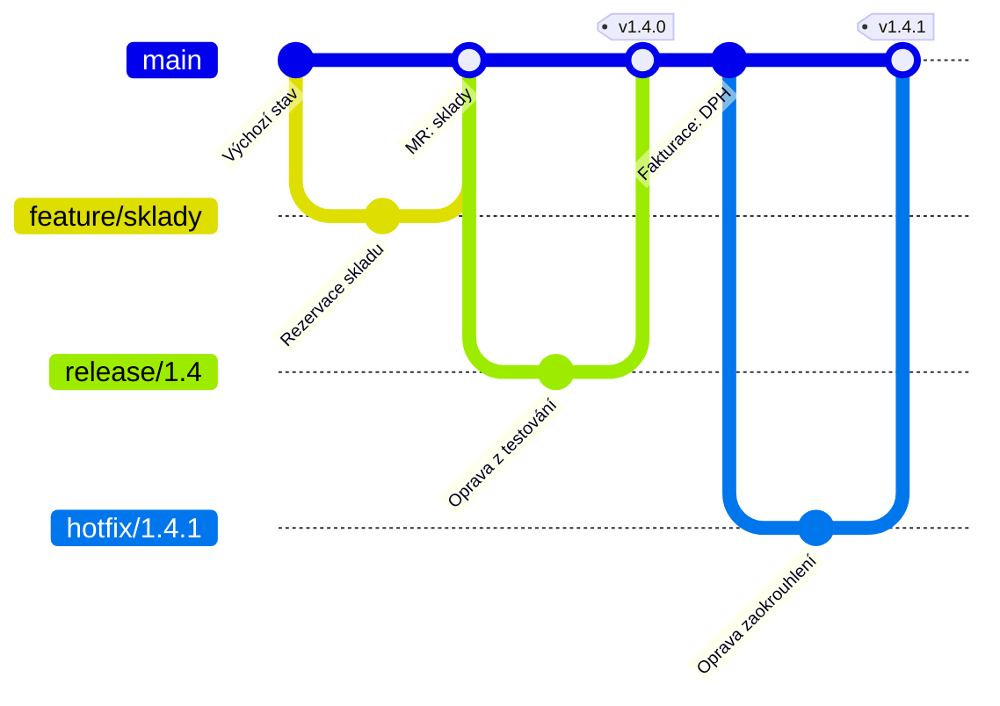

# OneFlow

> [← zpět na Git Workflows](../)

> **V jedné větě:** [GitFlow](../GitFlow/) bez `develop` — release a hotfix větve zůstávají, ubere se jedna trvalá větev a s ní i většina chyb, které se v GitFlow dělají.

> [!NOTE]
> Tenhle model se od ostatních liší tím, že **je celý postavený na kritice jednoho konkrétního modelu**. Nedá se pochopit bez [GitFlow](../GitFlow/) — když ho neznáš, přečti si ho nejdřív. OneFlow je odpověď na otázku „co z GitFlow opravdu potřebujeme?“

---

## Pro koho a proč vznikl

Adam Ruka publikoval v květnu 2015 článek *GitFlow considered harmful* a o dva roky později v něm navržený postup sepsal jako samostatný model. Jeho výhrady byly tři a stojí za to je znát, protože **každé pravidlo OneFlow je odpovědí na jednu z nich**.

**1. Dvě trvalé větve nic nepřidávají.** Když je každý commit na `main` vydáním a přišel z `develop`, obsahuje `develop` plus [značky](../Glossary.md#tag-značka) úplně stejnou informaci. Ruka to shrnul nekompromisně:

> „After using it for one year, I still have no idea“

proč by měly být věčné větve dvě. Druhá podle něj jen přidává merge commity a složitost.

**2. Historie se nedá číst.** Rada používat `--no-ff` úplně všude vyrobí z historie to, co nazval *„a giant ball of spaghetti“*. A všiml si u toho ironie: zdůvodnění pro `--no-ff` je, že podle merge commitu poznáš, kde se implementovala funkce — jenže

> „the only way to find that merge commit created by the `--no-ff` flag is by, you know, manually reading all the log messages.“

**3. Složitost plodí chyby.** Špatný cíl merge, větev založená z nesprávného místa, zapomenutá značka. Podle Ruky se to děje

> „over and over again“

i zkušeným lidem, protože **není jasné, co vlastně představuje aktuální stav projektu**.

To je stejná chyba, kterou náš dokument o GitFlow popisuje jako [nejčastější](../GitFlow/#vydání-a-hotfix): zapomenutý druhý merge. OneFlow ji neřeší kázní ani nástrojem — **odstraní větev, kvůli které vzniká.**

**Poznáš, že je to tvoje situace, podle:**

- vydáváš **verze** a potřebuješ release i hotfix větve
- ale `develop` ti přijde jako **větev navíc**, kterou nikdo pořádně nepoužívá
- v týmu se opakovaně stává, že se **zapomene merge zpátky**
- historie v `git log` je **nečitelná** a nikdo do ní nekouká
- [GitHub Flow](../GitHubFlow/) je málo, [GitFlow](../GitFlow/) moc

---

## Větve a jejich role

| Větev | Vzniká z | Merge do | Jak dlouho žije | Kdo ji zakládá |
| ----- | -------- | -------- | --------------- | -------------- |
| `main` | — | — | trvale | — |
| `feature/*` | `main` | `main` | dny | vývojář |
| `release/*` | `main` | **`main`** + značka | dny | ten, kdo vydává |
| `hotfix/*` | **značka vydání** | **`main`** + značka | hodiny | kdokoli při incidentu |

Porovnej s [tabulkou u GitFlow](../GitFlow/#větve-a-jejich-role). Typy větví jsou stejné, ubyla jedna trvalá — a s ní **zmizel sloupec se dvěma cíli merge**. Release i hotfix se vracejí na jedno místo, takže se nedá zapomenout na to druhé.

**Co je na `main`:** aktuální stav vývoje. Vydané verze jsou **značky**, ne větev — a v tom je hlavní rozdíl proti GitFlow, kde je vydání to, co je na `main`.

**Hotfix vzniká ze značky**, ne z větve:

```bash
git switch -c hotfix/1.4.1 v1.4.0
```

Tohle je detail, který stojí za zapamatování: značka je jediné, co spolehlivě označuje vydaný stav, takže se opravuje přesně od ní.

---

## Diagram



Jedna vodorovná čára a z ní krátké odbočky. **Porovnej s [diagramem GitFlow](../GitFlow/#diagram)** — tam se release i hotfix vracejí dvakrát, tady jednou. To je celý rozdíl mezi modely, na jednom obrázku.

---

## Běžný den

**1. Začínám úkol**

```bash
git switch main
git pull
git switch -c feature/skladove-rezervace
```

Větev vzniká z `main`, protože jiná trvalá není. **U GitFlow je tohle klasická chyba** — tady ji nejde udělat.

**2. Práce**

```bash
git add .
git commit -m "Sklady: rezervace při vytvoření objednávky"
git push -u origin feature/skladove-rezervace
```

**3. Integrace hotové větve**

Tady model nabízí **tři cesty a je to jeho nejpodstatnější rozhodnutí** — má vlastní [sekci níž](#tři-způsoby-integrace--vyber-jeden).

**4. Vydání**

```bash
git switch main
git pull
git switch -c release/1.4
# číslo verze, changelog, opravy z testování
git commit -m "Verze 1.4"
```

Od téhle chvíle jde do `release/1.4` **jen to, co se najde při testování**. Nové funkce pokračují do `main` a půjdou v 1.5 — stejně jako u GitFlow.

Uzavření vydání:

```bash
git switch main
git merge --no-ff release/1.4
git tag -a v1.4.0 -m "Skladové zásoby"
git push origin main --tags
git branch -d release/1.4
```

**Jeden merge. Ne dva.**

---

## Tři způsoby integrace — vyber jeden

Model nechává na týmu, jak se hotová větev vrací do `main`, a nabízí tři možnosti. Není to detail — určuje to, jak bude vypadat celá historie projektu.

### A) Rebase (autorem doporučeno)

```bash
git switch feature/skladove-rezervace
git rebase -i main
git switch main
git merge --ff-only feature/skladove-rezervace
```

Historie je **dokonale lineární**, `git log` se čte jako seznam. Cena: po větvi nezbude stopa, takže vrátit celou funkci znamená vracet commity po jednom. A [rebase](../Glossary.md#rebase) přepisuje historii — na sdílené větvi se nesmí.

### B) Merge `--no-ff`

```bash
git switch main
git merge --no-ff feature/skladove-rezervace
```

Zůstane merge commit, takže je vidět, co byla větev, a **revert je jedna operace**. Cena je přesně to, co Ruka kritizuje na GitFlow — při větším počtu větví se historie zamotá.

### C) Rebase a pak merge `--no-ff`

```bash
git switch feature/skladove-rezervace
git rebase -i main
git switch main
git merge --no-ff feature/skladove-rezervace
```

Commity jsou srovnané za sebou **a přesto je vidět, kde větev začala a skončila**.

| | **A) Rebase** | **B) Merge `--no-ff`** | **C) Rebase + merge** |
| --- | --- | --- | --- |
| Historie | dokonale lineární | větvená | **lineární i s hranicí větve** |
| Vidět, co byla větev | ne | ano | **ano** |
| Revert celé funkce | commit po commitu | **jedna operace** | **jedna operace** |
| Přepisuje historii | ano | ne | ano |
| Commitů v `main` | všechny | všechny | všechny |

**Výchozí volba je C.** Dá obojí — čitelnou historii i možnost vrátit funkci jedním příkazem — a cena je jeden příkaz navíc. Autor doporučuje A, ale to je volba pro tým, který revert celé funkce nepotřebuje.

Ať zvolíš cokoli, **musí to dělat celý tým stejně.** Historie, ve které se tři způsoby střídají, je horší než kterýkoli z nich důsledně.

---

## Varianta se dvěma trvalými větvemi

Autor připouští i podobu s `develop` **a** `main`, kde ale mají jiné role než v GitFlow:

- `develop` je **pracovní větev** — to, čemu se jinde v tomhle dokumentu říká `main`
- `main` **jen ukazuje na poslední vydání** a posouvá se [fast-forwardem](../Glossary.md#fast-forward) na novou značku

Rozdíl proti GitFlow je jemný, ale podstatný: `main` tu **není větev, do které se merguje** — je to ukazatel, který se posouvá. Nevznikají na něm merge commity a nedá se rozejít.

| | **Jedna větev** | **`develop` + `main`** |
| --- | --- | --- |
| Kolik trvalých větví | 1 | 2 |
| Co je `main` | vývoj | **jen poslední vydání** |
| Co dostane, kdo naklonuje repozitář | rozpracovaný stav | **poslední stabilní verze** |
| Merge do `main` | ano | **ne, jen fast-forward** |
| Kdy | většina týmů | knihovny a nástroje, kde se čeká stabilní `main` |

**Výchozí volba je jedna větev** — jinak přicházíš o hlavní přínos modelu. Druhá podoba dává smysl u veřejné knihovny, kde `git clone` má vydat vydanou verzi, ne rozdělanou práci.

---

## Vydání a hotfix

**Vydání** je release větev, která se vrátí do `main` a dostane značku. Popsané [výš](#běžný-den).

**Hotfix** začíná u značky vydané verze:

```bash
git switch -c hotfix/1.4.1 v1.4.0
# oprava
git commit -m "Fakturace: oprava zaokrouhlení DPH"

git switch main
git merge --no-ff hotfix/1.4.1
git tag -a v1.4.1 -m "Oprava zaokrouhlení DPH"
git push origin main --tags
git branch -d hotfix/1.4.1
```

Když je zrovna otevřená release větev, patří oprava i do ní — jinak z ní příští vydání vypadne. To je jediná situace, kde se i tady merguje na dvě místa, a je vzácná.

Srovnání s tím, jak totéž řeší ostatní:

| Model | Hotfix se vrací | Riziko |
| ----- | --------------- | ------ |
| [GitFlow](../GitFlow/) | do `main` **i** `develop` | **zapomenutý druhý merge** |
| **OneFlow** | do `main` | jen když běží release větev |
| [Trunk-Based](../TrunkBasedDevelopment/) | jen do trunku, pak cherry-pick ven | žádné — zpátky se nevrací nic |
| [GitHub Flow](../GitHubFlow/) | do `main` (= produkce) | žádné, ale neumí opravit starou verzi |

---

## Co si to vyžaduje

| Předpoklad | Proč | Bez toho |
| ---------- | ---- | -------- |
| **Značky u každého vydání** | Model je nahradil větví `main` z GitFlow — jsou jediný záznam o tom, co bylo vydáno | Nepoznáš, co běží u zákazníka, a hotfix nemá z čeho vzniknout |
| **Jeden způsob integrace pro celý tým** | Tři možnosti jsou nabídka, ne volba pro každého zvlášť | Historie promíchaná ze tří stylů — horší než kterýkoli z nich |
| **Někdo řídí vydání** | Release větev musí někdo založit a uzavřít | Zůstane otevřená a stane se druhým `develop` — přesně tím, co model odstranil |
| **Znalost rebase** (u variant A a C) | Interaktivní rebase je běžná operace, ne výjimka | Lidé ho budou obcházet a zvolí B, aniž by se domluvili |
| **Krátké feature větve** | Model je nehlídá; konflikty rostou stejně | Rebase dlouhé větve znamená řešit tytéž konflikty opakovaně |
| **Znalost GitFlow v týmu** | Model se vysvětluje rozdílem proti němu | Lidé si domyslí `develop` a vznikne polovičatý GitFlow |

Poslední řádek je specialita tohohle modelu. **Je odvozený, ne samostatný** — kdo nezná GitFlow, nepochopí, proč jsou pravidla zrovna takhle.

---

## Pro jaký tým a projekt

| | |
| --- | --- |
| **Velikost týmu** | malý až velký |
| **Způsob dodávání** | plánovaná vydání |
| **Stabilizační fáze před vydáním** | **ano** — release větev |
| **Frekvence nasazení** | jednou za sprint až jednou za kvartál |
| **Typ produktu** | knihovna, instalovaný software, mobilní aplikace, produkt s verzemi |
| **Kolik verzí se podporuje** | **jedna aktivní**, starší jen krátkodobě |
| **Provozní náročnost** | ●●●○○ |

**Hodí se, když:**

- ✅ Vydáváš **verze** a potřebuješ release i hotfix větve.
- ✅ [GitFlow](../GitFlow/) ti sedí, ale **`develop` je v něm větev navíc**.
- ✅ V týmu se opakovaně **zapomíná druhý merge** a chceš tu příčinu odstranit.
- ✅ Chceš **čitelnou historii**, ne změť merge commitů.
- ✅ Přecházíš z GitFlow a chceš **malý krok**, ne přestavbu celého procesu.

## Kdy nepoužít

- ❌ **Nasazuješ průběžně.** Release větev nemá co stabilizovat — [GitHub Flow](../GitHubFlow/) nebo [Trunk-Based](../TrunkBasedDevelopment/).
- ❌ **Podporuješ víc verzí současně.** Tohle je jediná věc, kterou `develop` v GitFlow pomáhá zvládat lépe; při třech živých verzích sáhni po [GitFlow](../GitFlow/).
- ❌ **Tým nezná GitFlow.** Model se vysvětluje rozdílem proti němu a bez toho kontextu působí pravidla nahodile.
- ❌ **Tým se nedomluví na jednom způsobu integrace.** Pak vznikne historie ze tří stylů a hlavní přínos je pryč.
- ❌ **Máš staging a akceptaci, ne verze.** To je [GitLab Flow](../GitLabFlow/).

---

## Časté chyby

| Chyba | Proč vadí | Jak správně |
| ----- | --------- | ----------- |
| Znovu vznikne `develop` | Jsi zpátky u GitFlow, ale bez jeho nástrojů a pravidel | Jedna trvalá větev; když ti chybí, potřebuješ GitFlow |
| Každý integruje jinak | Historie ze tří stylů; nikdo v ní nic nenajde | Domluvit se a vynutit nastavením |
| Hotfix vzniká z `main` místo ze značky | Vezme s sebou rozpracované věci do opravy vydané verze | `git switch -c hotfix/1.4.1 v1.4.0` |
| Chybí značka u vydání | Model nemá jiný záznam o vydání — přišel jsi o všechno | Značka při každém uzavření release i hotfix větve |
| Release větev žije měsíce | Stane se druhým `develop` a model přestal existovat | Release větve jsou dny |
| Rebase sdílené větve | Přepsaná historie rozbije práci kolegům | Rebase jen na vlastní větvi |
| Hotfix se nedostane do otevřené release větve | V příštím vydání chyba je zpátky | Když běží release větev, patří oprava i tam |
| Do release větve přibývají funkce | [Zmrazení kódu](../Glossary.md#code-freeze-zmrazení-kódu) přestane platit | Do `release/*` jen opravy z testování |

---

## Nastavení v GitHubu / GitLabu

| Nastavení | Hodnota | Proč |
| --------- | ------- | ---- |
| Protected branch | `main` | Jediná trvalá větev; jen přes pull request |
| Chráněné značky (`v*`) | **zapnuto** | Značky tu nesou to, co v GitFlow nesla větev `main` |
| Required status checks | testy + lint | Na `main` i na `release/*` |
| Merge strategy | podle [zvoleného způsobu](#tři-způsoby-integrace--vyber-jeden) | A → rebase; B → merge commit; C → rebase merge, nebo ručně |
| Squash | **vypnout** | Model počítá s tím, že si commity srovnáš rebasem sám |
| Required approvals | 1–2 | Jako u ostatních modelů s vydáními |

Squash je tu záměrně jinak než u [GitHub Flow](../GitHubFlow/#nastavení-v-githubu--gitlabu). Tam nahrazuje úklid historie; tady ho dělá vývojář interaktivním rebasem a squash by mu ho vzal z ruky.

---

## Přechod z GitFlow

Nejmenší přechod v celé sekci — typy větví zůstávají, mizí jedna trvalá.

1. **Dokonči rozpracovaná vydání**, ať nezůstane otevřená release větev.
2. **Zkontroluj, že v `develop` je všechno, co je v `main`** — hlavně hotfixy, u kterých se mohlo zapomenout na druhý merge. Tohle je jediný riskantní krok.
3. **Sluč `develop` do `main`** a `develop` zruš.
4. **Domluvte se na způsobu integrace** (A, B, nebo C) a zapište to.
5. Feature větve od teď zakládej z `main`.

Body 1–3 jsou totožné s [přechodem na GitHub Flow](../GitHubFlow/); liší se to, co zůstane — tady release a hotfix větve, tam nic.

---

## Související workflow

| Workflow | Vztah |
| -------- | ----- |
| [GitFlow](../GitFlow/) | **Model, ze kterého vznikl.** Stejné typy větví, o jednu trvalou míň. Autorova kritika GitFlow je celý důvod existence OneFlow. |
| [GitHub Flow](../GitHubFlow/) | Druhá cesta pryč od GitFlow — ubere víc: i release a hotfix větve. Volba mezi nimi je otázka, jestli vydáváš verze, nebo nasazuješ. |
| [GitLab Flow](../GitLabFlow/) | Řeší totéž zjednodušení, ale z opačné strany: vychází z GitHub Flow a přidává. OneFlow vychází z GitFlow a ubírá. |
| [Trunk-Based Development](../TrunkBasedDevelopment/) | Sdílí důraz na krátké větve a čitelnou historii, ale odmítá stabilizační fázi, na které OneFlow stojí. |

---

## Původ

|             |                    |
| ----------- | ------------------ |
| **Autor**   | Adam Ruka          |
| **Rok**     | 2015 (kritika), 2017 (model) |
| **Zdroj**   | blog *End of Line* |
| **Provozní náročnost** | ●●●○○ |

Model má **dvě data a to je pro jeho pochopení podstatné**. Nejdřív přišla kritika: *GitFlow considered harmful*, **3. května 2015**. Teprve **30. dubna 2017** Ruka sepsal, co tedy dělat místo toho, a dal tomu jméno.

To pořadí vysvětluje povahu OneFlow. **Nevznikl z pozorování, co týmy potřebují, ale z odečítání toho, co v jiném modelu překáží.** Proto je tak konkrétní — každé pravidlo má protějšek v GitFlow — a proto se bez znalosti GitFlow špatně chápe.

Je férové dodat, že jde o **názor jednoho autora**, ne o postup vzešlý z praxe velké organizace jako [GitHub Flow](../GitHubFlow/) nebo z měření jako [Trunk-Based Development](../TrunkBasedDevelopment/). To z něj nedělá horší model, ale znamená to, že rozšířený je výrazně míň — a **v týmu bude potřebovat vysvětlení, kdežto GitFlow lidé znají.**

> [!NOTE]
> Jedno napětí stojí za pojmenování. Ruka ostře kritizuje radu používat `--no-ff` všude, kdežto [náš dokument o GitFlow](../GitFlow/#nastavení-v-githubu--gitlabu) ho doporučuje. Není to rozpor: u GitFlow drží `--no-ff` viditelnou vazbu mezi vydáním a oběma trvalými větvemi, bez které se model neuhlídá. Ruka měří tutéž věc jinou váhou — čitelnost historie mu stojí za to, aby tu vazbu obětoval, a v modelu s jednou trvalou větví ji tolik nepotřebuje. **Je to volba, ne pravda**, a proto ji OneFlow nechává na týmu jako [tři možnosti](#tři-způsoby-integrace--vyber-jeden).

---

## Zdroje

- Adam Ruka: [*OneFlow – a Git branching model and workflow*](https://www.endoflineblog.com/oneflow-a-git-branching-model-and-workflow), 30. 4. 2017
- Adam Ruka: [*GitFlow considered harmful*](https://www.endoflineblog.com/gitflow-considered-harmful), 3. 5. 2015 — kritika, ze které model vzešel
- Adam Ruka: [*Follow-up to 'GitFlow considered harmful'*](https://www.endoflineblog.com/follow-up-to-gitflow-considered-harmful) — reakce na diskusi

---

<details>
<summary>Metadata workflow</summary>

```yaml
name: OneFlow
author: Adam Ruka
year: 2017
branches: [main, feature/*, release/*, hotfix/*]
variants: [rebase, merge --no-ff, rebase + merge, develop + main]
long_lived_branches: ne (jedna trvalá)
team_size: malý až velký
release_cadence: plánovaná vydání
requires_ci: doporučeno
requires_feature_flags: ne
supports_multiple_versions: omezeně
complexity: 3
tags: [jedna trvalá větev, release větve, značky, rebase, kritika GitFlow]
related: [GitFlow, GitHubFlow, GitLabFlow, TrunkBasedDevelopment]
status: done
```

</details>
