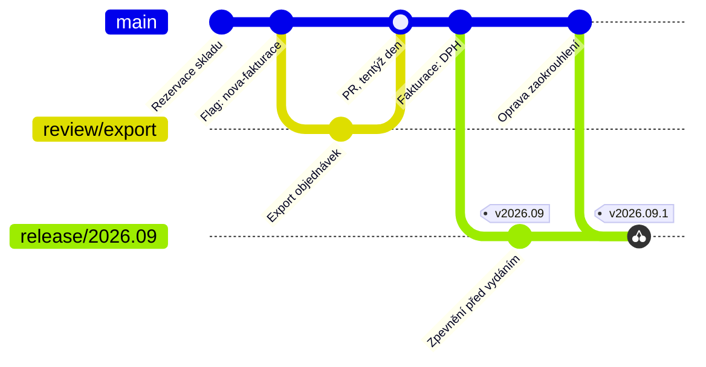

# Trunk-Based Development

> [← zpět na Git Workflows](../)

> **V jedné větě:** Všichni slučují do jedné větve **aspoň jednou denně**, takže integrace nikdy není událost — a nedokončená práce se skrývá [přepínačem](../Glossary.md#feature-flag), ne větví.

> [!IMPORTANT]
> **Trunk-Based Development neznamená „bez větví“.** To je nejčastější nedorozumění. Krátké větve jsou v něm legitimní a u týmů s code review běžné — jen žijí **hodiny, ne týdny**. Pravidlo není „nevětvi“, ale **„integruj denně“**.

---

## Pro koho a proč vznikl

Všechny ostatní modely řeší, **jak sloučit práci, která se rozešla**. Tenhle řeší, **aby se nerozešla.**

Úvaha za tím je jednoduchá: bolest při slučování neroste s počtem větví, ale s **časem**. Větev stará dva dny se sloučí bez přemýšlení; větev stará tři týdny je půldenní práce a riziko, že se něco tiše ztratí. Když se tedy integruje každý den, konflikt nemá kdy vzniknout — a s ním mizí i celá kategorie problémů, kterou ostatní modely pracně řeší.

Cena je vysoká a platí se **jinde**: v hlavní větvi je pak neustále i nedokončená práce. Model proto stojí na tom, že se rozpracované věci dají **schovat před uživatelem** ([feature flag](../Glossary.md#feature-flag)) a že **testy poznají rozbitý stav dřív než člověk**. Bez toho to není Trunk-Based Development, jen chaos na `main`.

**Poznáš, že je to tvoje situace, podle:**

- integrace je u vás **událost**, na kterou se tým chystá — a to chceš odstranit
- CI běží na každý push a je **zelená většinu času**
- umíte (nebo chcete umět) **oddělit nasazení od vydání** přepínačem
- nasazujete **několikrát denně** nebo byste chtěli
- code review je **rychlé** — hodiny, ne dny

---

## Dvě varianty

Model má dvě podoby a rozdíl mezi nimi je jen v tom, jestli je mezi vývojářem a hlavní větví code review.

### Přímo do trunku

Vývojář commituje rovnou do `main`, po lokálním sestavení a testech.

```bash
git switch main
git pull --rebase
# práce, testy lokálně
git commit -m "Sklady: rezervace při vytvoření objednávky"
git push
```

Používají to **velmi malé týmy**, kde se lidé znají a review probíhá průběžně u stolu nebo v páru.

### Krátké větve (scaled trunk-based)

Větev existuje kvůli code review a CI, ne kvůli oddělení práce:

```bash
git switch main
git pull
git switch -c sklady-rezervace
# práce, commit, push, pull request
# review a merge ještě dnes
```

| | Přímo do trunku | Krátké větve |
| --- | --- | --- |
| Velikost týmu | velmi malý | **střední a větší** |
| Code review | průběžně, v páru | pull request |
| Život větve | žádná | **hodiny, max den** |
| CI před sloučením | lokálně | **na pull requestu** |
| Riziko rozbití `main` | vyšší | nižší |

**Výchozí volba je varianta s krátkými větvemi.** Nepřijdeš o nic z podstaty modelu — integruješ pořád denně — a získáš review i CI před sloučením. Přímo do trunku má smysl u tří lidí na jednom produktu, ne jako cíl, ke kterému se má tým propracovat.

---

## Větve a jejich role

| Větev | Vzniká z | Merge do | Jak dlouho žije | Kdo ji zakládá |
| ----- | -------- | -------- | --------------- | -------------- |
| `main` (trunk) | — | — | trvale | — |
| krátká větev | `main` | `main` | **hodiny, max den** | vývojář |
| `release/*` | `main` | **nikam** | do vydání, pak se smaže | ten, kdo vydává |

Třetí řádek je to, co lidi na tomhle modelu překvapí: **release větve existují, ale nikdy se nevracejí zpátky.** Vznikají podle potřeby, těsně před vydáním, a po vydání se mažou.

**Co je na `main`:** všechno, co prošlo CI — včetně nedokončených věcí schovaných za přepínačem. Tahle větev **není totožná s produkcí**, a v tom se liší od [GitHub Flow](../GitHubFlow/).

---

## Diagram



Dvě věci k všimnutí. Větev `review/export` žije **jeden den**. A oprava jde **nejdřív do `main`** a teprve odtud [cherry-pickem](../Glossary.md#cherry-pick) do vydání — nikdy naopak. Tomu se říká **fix forward**: opravuje se dopředu, do hlavní větve, protože ta je jediné místo, kde musí být pravda.

Porovnej s [GitFlow](../GitFlow/#diagram), kde se hotfix vrací zpátky do obou trvalých větví. Tady se nevrací nic, a proto se nedá zapomenout.

---

## Běžný den

**1. Začínám úkol**

```bash
git switch main
git pull
git switch -c sklady-rezervace
```

Než začneš, rozmysli si jednu věc: **vejde se to do jednoho dne?** Když ne, rozděl to — na kroky, které se dají sloučit samostatně a nic nerozbijí. Tohle rozhodnutí je na celém modelu to nejtěžší a nedá se obejít nástrojem.

**2. Práce**

```bash
git add .
git commit -m "Sklady: rezervace při vytvoření objednávky"
git push -u origin sklady-rezervace
```

**3. Pull request a merge — tentýž den**

Review má u tohohle modelu **přednost před vlastní prací**. Větev, která čeká na schválení do zítřka, porušuje jediné pravidlo, na kterém všechno stojí.

```bash
git switch main
git pull
git branch -d sklady-rezervace
```

**4. Velká změna, která se do dne nevejde**

Dvě techniky, a obě jsou povinnou výbavou:

**Feature flag** — kód je nasazený, uživatel ho nevidí:

```php
if ($features->enabled('nova-fakturace')) {
    return $this->novaFakturace->render();
}

return $this->staraFakturace->render();
```

**Branch by abstraction** — přestavba za rozhraním. Místo třítýdenní větve postupně:

1. Vlož mezi volající kód a starou implementaci **rozhraní** (`FakturaGenerator`). Sluč — nic se nezměnilo.
2. Přidej vedle staré **novou implementaci**, zatím nepoužitou. Sluč — pořád se nic nezměnilo.
3. Přepni volající na novou, klidně [přepínačem](../Glossary.md#feature-flag) a po částech uživatelů. Sluč.
4. Až se nová osvědčí, **smaž starou** i přepínač. Sluč.

Čtyři sloučení místo jednoho velkého, každé bezpečné. **Tohle je odpověď na námitku „ale my máme velké změny“** — má ji každý, jen se dají udělat po částech.

---

## Vydání a hotfix

Model nabízí dvě cesty a rozdíl mezi nimi je praktický.

**Vydání přímo z trunku.** Každý commit v `main` je kandidát; vydá se tím, že se nasadí. Žádná release větev.

**Vydání z release větve**, když mezi „hotovo“ a „u zákazníka“ potřebuješ pár dní zpevnění:

```bash
git switch main
git pull
git switch -c release/2026.09
git tag -a v2026.09 -m "Zářijové vydání"
git push origin release/2026.09 --tags
```

Větev vzniká **těsně před vydáním**, ne měsíc dopředu. Po vydání se smaže.

**Oprava vydané verze — vždycky přes trunk:**

```bash
# 1) oprava nejdřív do main
git switch main
git pull
git switch -c oprava-zaokrouhleni
# oprava, PR, merge do main

# 2) teprve pak do vydání
git switch release/2026.09
git cherry-pick <hash opravy z main>
git tag -a v2026.09.1 -m "Oprava zaokrouhlení DPH"
git push origin release/2026.09 --tags
```

Pořadí je **pravidlo, ne zvyk**. Kdyby oprava vznikla v release větvi, musel by ji někdo donést do `main` — a to je přesně ten [zapomenutý druhý merge](../GitFlow/#vydání-a-hotfix), kterým trpí GitFlow. Tady se problém neřeší kázní, ale směrem toku: **do trunku se nikdy nevrací nic.**

---

## Co si to vyžaduje

Nejnáročnější model ze všech na předpoklady — a přitom má jednu větev. Právě proto se tak snadno zavede špatně.

| Předpoklad | Proč | Bez toho |
| ---------- | ---- | -------- |
| **CI na každý push, rychlá a zelená** | Do `main` teče práce celého týmu průběžně | Rozbitý `main` zablokuje všechny; při pomalé CI ji lidé začnou obcházet |
| **[Feature flagy](../Glossary.md#feature-flag)** | Nedokončená práce musí do `main`, ale ne k uživateli | Buď dlouhé větve (a není to TBD), nebo polohotové funkce v produkci |
| **Automatické testy, kterým tým věří** | Jsou jediné, co drží `main` použitelný | Nikdo se neodváží slučovat denně a model se rozpadne sám |
| **Rychlé review — hodiny** | Větev musí zmizet tentýž den | Větve čekají, stárnou a jsi zpátky u [GitHub Flow](../GitHubFlow/) v horší podobě |
| **Umět dělit práci na malé kroky** | Největší a nejtěžší dovednost celého modelu | Tým bude tvrdit, že „naše změny jsou moc velké“, a vrátí se k dlouhým větvím |
| **Branch by abstraction** | Velká přestavba jinak nemá jak projít po částech | Vznikne „refaktoringová větev“, která žije tři měsíce |
| **Úklid přepínačů** | Flag je větvení navíc, které se testuje v obou stavech | Za rok padesát flagů a nikdo neví, které platí |

První tři jsou nepodkročitelné. **Tým bez zelené CI a bez feature flagů si tenhle model vybrat nemůže** — ne proto, že by to bylo nesprávné, ale protože to technicky nefunguje.

---

## Co na to výzkum

Tenhle model má jako jediný v katalogu **měřená data**. Výzkum DORA (publikovaný i v knize *Accelerate*) na datech z let 2016 a 2017 uvádí, že týmy dosahují lepších výsledků v rychlosti dodávání i stabilitě, když:

> „Have three or fewer active branches in the application's code repository.“
>
> „Merge branches to trunk at least once a day.“
>
> „Don't have code freezes and don't have integration phases.“

Stojí za to číst to opatrně. **Je to korelace na datech z průzkumu, ne důkaz**, a všechny tři body popisují chování, které se dá dělat i špatně — tři aktivní větve mít můžeš tak, že prostě všechno commituješ rovnou a doufáš. Údaj o [code freeze](../Glossary.md#code-freeze-zmrazení-kódu) navíc rovnou vylučuje modely se stabilizační fází, což je [legitimní volba](../GitFlow/#pro-koho-a-proč-vznikl) pro verzovaný software — výzkum měřil webové a interní systémy, ne software u zákazníků.

Užitečnější než závěr „TBD je nejlepší“ je ta střední věta: **denní integrace je to, co se ukázalo jako podstatné.** Je to zároveň jediné pravidlo modelu, které se dá změřit u vás.

---

## Pro jaký tým a projekt

| | |
| --- | --- |
| **Velikost týmu** | od dvou lidí po velké organizace; škáluje líp než ostatní modely |
| **Způsob dodávání** | průběžně (continuous delivery / deployment) |
| **Stabilizační fáze před vydáním** | **ne** (nebo pár dní v release větvi bez návratu do trunku) |
| **Frekvence nasazení** | několikrát denně |
| **Typ produktu** | SaaS, webová aplikace, interní systém, API |
| **Kolik verzí se podporuje** | jedna, výjimečně pár krátkodobě |
| **Provozní náročnost** | ●●●○○ |

**Hodí se, když:**

- ✅ Integrace je u vás **bolestivá** a chcete tu bolest odstranit u zdroje.
- ✅ Máte **zelenou CI** a testy, kterým tým věří.
- ✅ Chcete **oddělit nasazení od vydání** a řídit funkce přepínačem.
- ✅ Na jednom kódu pracuje **hodně lidí** a dlouhé větve se nedají udržet.
- ✅ Chcete nasazovat **několikrát denně**.

## Kdy nepoužít

- ❌ **Nemáte spolehlivou CI.** Bez ní se rozbitý `main` stane normálem a zablokuje celý tým.
- ❌ **Nemáte a nechcete feature flagy.** Pak nedokončená práce nemá kde být a vrátíte se k dlouhým větvím.
- ❌ **Podporujete víc verzí u zákazníků.** Cherry-pick do několika release větví je udržitelný krátce, ne trvale — tohle je [GitFlow](../GitFlow/).
- ❌ **Mezi hotovo a produkcí je dlouhý QA cyklus.** Model s ním počítá v řádu dnů, ne týdnů.
- ❌ **Code review trvá dny.** Pak větve nemají jak zmizet tentýž den a model nemá jak fungovat.
- ❌ **Tým neumí dělit práci na malé kroky** a nechce se to učit. Tohle je dovednost, ne nastavení.

---

## Časté chyby

| Chyba | Proč vadí | Jak správně |
| ----- | --------- | ----------- |
| „TBD znamená žádné větve“ | Tým commituje rovnou do `main` bez review a rozbíjí ho | Krátké větve jsou v pořádku; podstatná je denní integrace |
| Větve žijí týden | Model přestal existovat, zůstalo jen jméno | Nevejde-li se úkol do dne, rozděl ho |
| Zavedení bez feature flagů | Nedokončená práce nemá kde být | Nejdřív flagy, pak model |
| Rozbitý `main` se neopravuje hned | Blokuje celý tým, protože všichni slučují průběžně | Zelená CI je nejvyšší priorita, přednost před vlastní prací |
| Oprava vznikne v release větvi | Musí ji někdo donést do `main` — a zapomene | Vždy nejdřív do `main`, pak cherry-pick |
| Release větev se merguje zpátky | Model na tom nestojí a vznikne z toho poloviční GitFlow | Do trunku se nevrací nic |
| Flagy se po vydání nemažou | Za rok padesát přepínačů, exponenciálně kombinací a nikdo neví, co platí | Smazání flagu je součást úkolu, ne úklid „až bude čas“ |
| Pomalá CI | Lidé ji začnou obcházet nebo slučovat bez čekání | Rychlost CI je předpoklad, ne komfort |
| Review čeká do zítřka | Porušuje jediné pravidlo modelu | Review má přednost před rozpracovanou prací |
| Velká přestavba ve vlastní větvi | Přesně to, čemu se model vyhýbá | Branch by abstraction |

---

## Nastavení v GitHubu / GitLabu

| Nastavení | Hodnota | Proč |
| --------- | ------- | ---- |
| Protected branch | `main` | I u varianty s přímými commity aspoň vynucená zelená CI |
| Require pull request | zapnuto (varianta s větvemi) | Review před sloučením |
| Required status checks | testy + lint, **rychlé** | Drží `main` použitelný; pomalá CI model rozbije |
| Require branches to be up to date | zapnuto | Vynutí denní srovnání s `main` |
| Required approvals | **1** | Dva schvalovatelé znamenají čekání, a to je tu drahé |
| Merge strategy | **squash** | Krátká větev je jeden úkol; historie `main` zůstane čitelná |
| Automatically delete head branches | zapnuto | Větve mají mizet, ne se hromadit |
| Merge queue (u velkých týmů) | zvážit | Při desítkách sloučení denně otestuje pořadí změn dřív, než se dostanou do `main` |

---

## Přechod na tenhle model

Nedá se udělat přepnutím — chybějící předpoklady je potřeba doplnit **předem**, jinak se první týden rozbije `main` a tým se vrátí zpátky.

1. **Zrychli CI** natolik, aby výsledek přišel do pár minut. Bez tohohle nemá smysl pokračovat.
2. **Zaveď feature flagy** a vyzkoušej je na jedné reálné funkci.
3. **Zkrať větve postupně** — z týdnů na dny, pak na jeden den. Měř to; je to jediné číslo, na kterém záleží.
4. **Nauč tým dělit práci.** Tohle trvá nejdél a je to skutečná změna, ne nastavení nástroje.
5. Až tohle funguje, **zruš zbylé dlouhé větve**. Do té doby by ses jen připravil o jejich užitek a nic nezískal.

---

## Související workflow

| Workflow | Vztah |
| -------- | ----- |
| [GitHub Flow](../GitHubFlow/) | **Nejbližší příbuzný.** Stejný směr, mírnější pravidla: větve smějí žít dny a `main` se rovná produkci. Nejčastější odrazový můstek. |
| [GitFlow](../GitFlow/) | **Opačný konec škály.** Kde GitFlow odděluje vývoj od vydání větvemi, tenhle model to řeší přepínači v kódu. |
| **GitLab Flow** | Kompromis pro tým, který chce trunk, ale nemůže nasazovat rovnou do produkce. *(zatím nezpracováno)* |
| **OneFlow** | Míří opačným směrem — k vydáním, ne k průběžné integraci. *(zatím nezpracováno)* |

---

## Původ

|             |                    |
| ----------- | ------------------ |
| **Autor**   | Paul Hammant (sepsání a údržba), praxe je starší |
| **Rok**     | trunkbaseddevelopment.com, kniha 2020 |
| **Zdroj**   | *trunkbaseddevelopment.com*; výzkum DORA / *Accelerate* |
| **Provozní náročnost** | ●●●○○ |

Tenhle model se od ostatních liší tím, že **nemá zakládající článek**. GitFlow i GitHub Flow vznikly jako popis jednoho konkrétního postupu; Trunk-Based Development je **pojmenování praxe, která byla starší** než její jméno — velké firmy pracovaly nad jedním kmenem dávno předtím, než se tomu tak začalo říkat, často proto, že jejich tehdejší nástroje větvení pořádně neuměly.

Paul Hammant tu praxi sepsal a udržuje ji na *trunkbaseddevelopment.com*; v roce 2020 k tématu vyšla i kniha. Myšlenkově navazuje na **continuous integration** v původním významu — ne „máme server, který pouští testy“, ale „**opravdu integrujeme průběžně**“. To druhé se z pojmu časem vytratilo a Trunk-Based Development je do velké míry snaha ho vrátit.

Druhý zdroj popularity je **výzkum DORA**, který denní integraci a malý počet aktivních větví spojil s [měřitelně lepšími výsledky](#co-na-to-výzkum). Tím se z modelu stalo doporučení, které se cituje v prezentacích — a bohužel taky zavádí bez toho, co si vyžaduje. **Zelená CI a feature flagy nejsou detail implementace, jsou to vstupní podmínky.**

---

## Zdroje

- [trunkbaseddevelopment.com](https://trunkbaseddevelopment.com/) — Paul Hammant
- [DORA: Trunk-based development](https://dora.dev/capabilities/trunk-based-development/) — shrnutí výzkumu a odkazy na data
- Forsgren, Humble, Kim: *Accelerate*, IT Revolution Press, 2018
- Martin Fowler: [*Branch By Abstraction*](https://martinfowler.com/bliki/BranchByAbstraction.html)

---

<details>
<summary>Metadata workflow</summary>

```yaml
name: Trunk-Based Development
author: Paul Hammant (sepsání), praxe starší
year: 2020
branches: [main, krátké větve, release/*]
long_lived_branches: ne
team_size: malý až velmi velký
release_cadence: průběžně
requires_ci: nutně
requires_feature_flags: nutně
supports_multiple_versions: ne
complexity: 3
tags: [denní integrace, feature flag, branch by abstraction, fix forward, DORA]
related: [GitHubFlow, GitFlow, GitLabFlow, OneFlow]
status: done
```

</details>
