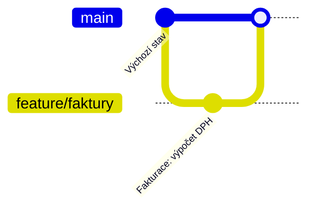

# <Název workflow>

> [← zpět na Git Workflows](../)

> **V jedné větě:** <čím se tenhle model liší od ostatních — ne definice, ale to podstatné rozhodnutí>

<!--
Volitelně upozornění hned na začátku, když u workflow existuje častý omyl:

> [!IMPORTANT]
> <např. že autor sám model nedoporučuje pro webové aplikace>
-->

---

## Pro koho a proč vznikl

<!--
Situace, na kterou je tenhle model odpovědí. Ne „co to je“, ale
„co tým řešil, když k tomuhle došel“.

Napiš i to, co daný tým NEmohl: verzovaný software se nedá vrátit
zpátky u zákazníka, SaaS zase nemá smysl držet v release větvích.
Odtud plynou všechna pravidla níž.
-->

**Poznáš, že je to tvoje situace, podle:**

- <konkrétní znak týmu nebo produktu>
- <…>
- <…>

---

## Větve a jejich role

| Větev | Vzniká z | Merge do | Jak dlouho žije | Kdo ji zakládá |
| ----- | -------- | -------- | --------------- | -------------- |
| `main` | — | — | trvale | — |
| `<větev>` | `<z čeho>` | `<kam>` | `<hodiny / dny / do vydání>` | `<vývojář / release manažer>` |

<!--
Sloupec „Jak dlouho žije“ je nejdůležitější — právě délka života větve
rozhoduje o tom, jak bolestivé budou konflikty.
-->

**Co je na `main`:** <co přesně tahle větev znamená — poslední vydání? to, co běží v produkci? cokoli, co prošlo CI?>

---

## Diagram



<!--
Malý diagram, dva až tři commity na větev. Musí ukázat celý cyklus
a NESMÍ si odporovat se sekcí „Běžný den“.
-->

---

## Běžný den

<!-- Konkrétní příkazy, ne popis kroků. Od zadání úkolu po nasazení. -->

**1. Začínám úkol**

```bash
git switch main
git pull
git switch -c feature/faktury
```

**2. Práce a průběžné odesílání**

```bash
git add .
git commit -m "Fakturace: výpočet DPH"
git push -u origin feature/faktury
```

**3. Než požádám o review**

```bash
# <co dělá tenhle workflow: rebase? merge z main? nic?>
```

**4. Po schválení**

```bash
# <jak se to dostane dál — a co se stane s větví>
```

---

## Vydání a hotfix

<!--
Právě tímhle se workflow liší nejvíc a je to první otázka, kterou
junior dostane naostro: „produkce je rozbitá, co teď?“
-->

**Vydání:**

```bash
# <…>
```

**Hotfix do produkce:**

```bash
# <…>
```

<!-- Napiš i to, jak se oprava dostane zpátky do vývojové větve,
     aby v příštím vydání nezmizela. -->

---

## Co si to vyžaduje

<!--
Jádro dokumentu. Model, jehož předpoklady tým nesplní, nefunguje —
a nefunguje potichu.
-->

| Předpoklad | Proč | Bez toho |
| ---------- | ---- | -------- |
| <CI na každý push> | <…> | <co se stane> |
| <…> | <…> | <…> |

---

## Pro jaký tým a projekt

| | |
| --- | --- |
| **Velikost týmu** | <…> |
| **Způsob dodávání** | <průběžně (agile, continuous delivery) / plánovaná vydání (fázový vývoj)> |
| **Stabilizační fáze před vydáním** | <ano — QA cyklus, regresní testy / ne — nasazuje se rovnou> |
| **Frekvence nasazení** | <několikrát denně / týdně / jednou za sprint / jednou za kvartál> |
| **Typ produktu** | <SaaS / instalovaný software / knihovna / mobilní aplikace> |
| **Kolik verzí se podporuje** | <jedna / několik současně> |
| **Provozní náročnost** | ●●●○○ |

<!--
Řádek „Stabilizační fáze“ rozhoduje víc než metodika. Existuje-li mezi
„hotovo“ a „v produkci“ testovací cyklus, musí kód někde počkat —
a to jsou release větve. Když se nasazuje rovnou, jsou jen režie.
Tým může dělat Scrum a přitom vydávat jednou za dva měsíce; pak mu
sedí model, který se tváří „neagilně“.
-->

**Hodí se, když:**

- ✅ <…>
- ✅ <…>

## Kdy nepoužít

- ❌ <…> — <proč>
- ❌ <…> — <proč>

---

## Časté chyby

| Chyba | Proč vadí | Jak správně |
| ----- | --------- | ----------- |
| <…> | <konkrétní následek, ne „je to nepěkné“> | <…> |

---

## Nastavení v GitHubu / GitLabu

<!-- Workflow, který není vynucený nastavením, se do měsíce rozsype. -->

| Nastavení | Hodnota | Proč |
| --------- | ------- | ---- |
| Protected branch | `<větve>` | <…> |
| Required reviews | <počet> | <…> |
| Merge strategy | <merge commit / squash / rebase> | <…> |
| <…> | <…> | <…> |

---

## Přechod na jiný workflow

<!-- Nepovinné. Týmy málokdy začínají na zelené louce. -->

---

## Související workflow

| Workflow | Vztah |
| -------- | ----- |
| [<Název>](../<Slozka>/) | <v čem se liší a kdy sáhnout po něm místo tohohle> |

---

## Původ

|             |                    |
| ----------- | ------------------ |
| **Autor**   | <…>                |
| **Rok**     | <…>                |
| **Zdroj**   | <článek / kniha / dokumentace> |
| **Provozní náročnost** | ●●●○○ |

<!--
Kontext vzniku: co se tehdy dělo, proč to autor napsal, jak se to
od té doby posunulo. Když autor sám později model přehodnotil,
patří to sem.
-->

---

## Zdroje

- <odkaz na původní článek>
- <…>

---

<details>
<summary>Metadata workflow</summary>

```yaml
name: <Název>
author: <…>
year: <…>
branches: [main, feature/*]
long_lived_branches: <ano/ne>
team_size: <malý / střední / velký>
release_cadence: <průběžně / plánovaná vydání>
requires_ci: <ano / doporučeno>
requires_feature_flags: <ano / ne>
supports_multiple_versions: <ano / ne>
complexity: <1–5>
tags: []
related: []
status: draft
```

</details>
