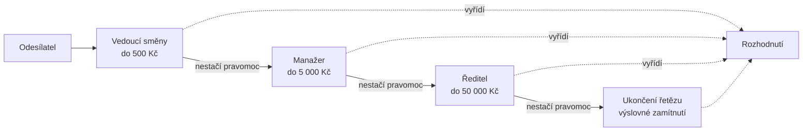

# Chain of Responsibility (Řetěz odpovědnosti)

> [← zpět na Behavioral](../)

> **V jedné větě:** Požadavek putuje řetězem zpracovatelů, dokud ho někdo nevyřídí — a odesílatel nemusí vědět, kdo to bude.

---

## Problém

Máš požadavek, který umí vyřídit několik různých míst, a rozhodnutí *které* závisí na jeho obsahu. Napsané je to podmínkou, a proto o vazbě mezi odesílatelem a zpracovateli ví každý všechno.

**Poznáš to podle:**

- odesílatel obsahuje `if`/`switch`, kterým **vybírá zpracovatele** — a tím zná všechny
- přidání dalšího zpracovatele znamená zásah do odesílatele
- kontroly a předzpracování se hromadí na začátku jedné metody: nejdřív validace, pak oprávnění, pak limity, pak teprve práce
- z kódu nejde vyčíst **pořadí**, ve kterém se to posuzuje, ani jestli na něm záleží
- táž posloupnost kroků existuje na dvou místech, jen v každém trochu jinak

```php
// Před: odesílatel zná všechny schvalovatele i jejich limity
public function approve(ApprovalRequest $request): Decision
{
    if ($request->discountInCents <= 50000) {
        return $this->teamLead->approve($request);
    }

    if ($request->discountInCents <= 500000) {
        return $this->manager->approve($request);
    }

    if ($request->discountInCents <= 5000000) {
        return $this->director->approve($request);
    }

    // …a co teď? Tady se často zapomene na `return` úplně.
}
```

Změna limitu vedoucího směny znamená sáhnout do třídy, která s vedoucím směny nemá nic společného. A poslední větev je ta, na kterou se v praxi zapomíná nejčastěji.

---

## Řešení

Spoj zpracovatele do řetězu. Každý článek se rozhodne, jestli požadavek vyřídí, nebo ho pošle dál — a **odesílatel zná jen první článek**.



Přidání dalšího stupně je jeden článek navíc; odesílatel se nemění. Změna limitu se dotkne jediné třídy.

### Dvě podoby téhož patternu

Tohle je nejdůležitější rozlišení celého dokumentu a v původním GoF popisu není — vzniklo až praxí.

| | **Klasický řetěz** | **Pipeline / middleware** |
| --- | --- | --- |
| Kdo vyřizuje | **První schopný**, pak konec | **Každý** dostane slovo |
| Článek dostane | Jen požadavek | Požadavek **a `$next`** |
| Kdy se předává dál | Automaticky, když článek nemůže | Když článek sám zavolá `$next` |
| Práce po návratu | Nejde | **Jde** — článek obaluje zbytek řetězu |
| Typické použití | Eskalace, výběr zpracovatele | Validace, logování, transakce, autorizace |
| Znáš z | Zpracování výjimek | **PSR-15 middleware** |

V moderním PHP je dominantní ta druhá. Když někdo řekne „middleware“, mluví o Chain of Responsibility — jen o variantě, kde článek nedostane jen požadavek, ale i možnost rozhodnout, **kdy** pustí dál:

```php
public function process(OrderRequest $request, callable $next): OrderResult
{
    // před
    $result = $next($request);
    // po

    return $result;
}
```

Tomu tvaru se říká cibule: vstoupíš zvenčí, projdeš všechny vrstvy do jádra a stejnou cestou ven. Klasický řetěz cestu zpátky nemá — a proto v něm nejde měřit čas ani obalit zpracování transakcí.

### Middleware v API — ten příklad, který znáš

Nejrozšířenější nasazení tohohle patternu vůbec. Každý HTTP požadavek do API projde stackem middleware, a **jejich pořadí je součástí návrhu**, ne detail konfigurace:

```
požadavek ─┐
           │  ErrorHandler          ← chytá výjimky ze všeho pod sebou
           │    CorrelationId       ← ID požadavku do všech logů níž
           │      Cors              ← preflight nesmí projít autentizací
           │        RateLimit       ← chrání i přihlašovací endpoint
           │          Authentication
           │            Authorization
           │              BodyValidation
           │                Transaction
           │                  ► Controller / handler
odpověď ◄──┘
```

Každá vrstva je článek řetězu: dostane požadavek a funkci `$next`, něco udělá před ní, něco po ní — nebo ji nezavolá vůbec a odpoví sama. Přesně to popisuje **PSR-15**.

A teď to podstatné. Prohození dvou sousedních vrstev nevypadá jako velká změna, ale rozbije konkrétní věci:

| Prohození | Co se rozbije |
| --------- | ------------- |
| **CORS až za autentizaci** | Preflight `OPTIONS` nemá token, dostane 401 — a prohlížeč hlásí neurčitou CORS chybu místo skutečné příčiny. Frontend hledá problém u sebe. |
| **RateLimit až za autentizaci** | Přihlašovací endpoint zůstane bez ochrany. Ověření hesla je záměrně výpočetně drahé, takže z brute force útoku je rovnou i vyčerpání CPU. |
| **ErrorHandler není nejvýš** | Výjimka z vrstvy nad ním uteče ven nezpracovaná — v lepším případě 500 bez kontextu, v horším stack trace v odpovědi. |
| **Validace těla před autentizací** | Nepřihlášený klient tě donutí parsovat a validovat desetimegabajtový payload. |
| **Transakce vně autorizace** | Otevřená transakce běží i pro požadavky, které stejně skončí na 403; drží spojení a zámky zbytečně. |
| **CorrelationId příliš hluboko** | Logy z vrstev nad ním nemají ID požadavku, takže se incident nedá poskládat dohromady. |

Obecné pravidlo, které z toho plyne: **čím levnější a čím univerzálnější kontrola, tím výš.** Odmítni požadavek co nejdřív a co nejlevněji; drahé věci (parsování, databáze, transakce) nech až za vším, co ho může zamítnout.

Proto pořadí middleware patří do kódu na jedno viditelné místo s komentářem, proč je zrovna takhle — ne do konfiguračního souboru, kde ho někdo za rok „srovná podle abecedy“.

### Konec řetězu musí být ošetřený

Původní GoF popis výslovně připouští, že požadavek **nemusí vyřídit nikdo**. To je v praxi zdroj těch nejnepříjemnějších chyb, protože se neprojeví výjimkou, ale tichým `null` o tři vrstvy dál.

```php
// Poslední článek nemá `next` — a co teď?
return $this->next?->handle($request)
    ?? ApprovalDecision::rejected('Žádný schvalovatel nemá dostatečnou pravomoc.');
```

Buď výslovné zamítnutí, nebo výjimka. **Nikdy `null` a nikdy tiché nic.**

### Pořadí není konfigurace

Články jsou zaměnitelné, ale jejich pořadí zaměnitelné není — je to rozhodnutí o chování. Táž vadná objednávka dvěma stejnými články v jiném pořadí:

```
sklad první:    Zboží není skladem.
validace první: Objednávka neobsahuje žádné položky.
```

Zákazník dostane jinou hlášku. Řetěz tuhle vazbu **skrývá** — na rozdíl od `if`ů, kde je pořadí aspoň vidět. V doméně je z toho horší chybová hláška; [ve stacku middleware](#middleware-v-api--ten-příklad-který-znáš) z toho bývá bezpečnostní díra. Proto pořadí patří do composition rootu na jedno viditelné místo, ne do konfigurace, kterou nikdo nečte.

---

## Účastníci

| Role | V příkladu | Odpovědnost |
| ---- | ---------- | ----------- |
| **Handler** (rozhraní/základ) | `Approver`, `OrderMiddleware` | Kontrakt článku a průchod řetězem |
| **Konkrétní článek** | `LimitedApprover`, `CheckStockMiddleware` | Rozhodne, jestli vyřídí, nebo pustí dál |
| **Ukončení řetězu** | zamítnutí v `Approver::handle()` | Co se stane, když nevyřídí nikdo |
| **Skladatel** | `Approver::chain()`, `OrderPipeline` | Sestaví řetěz a určí pořadí |
| **Odesílatel** | volající kód | Zná jen první článek |

---

## Implementace v PHP

Klasický řetěz. Všimni si, že `handle()` je **`final`**:

```php
<?php
declare(strict_types=1);

abstract class Approver
{
    private ?self $next = null;

    public static function chain(self ...$approvers): self
    {
        for ($i = 0; $i < count($approvers) - 1; $i++) {
            $approvers[$i]->next = $approvers[$i + 1];
        }

        return $approvers[0];
    }

    final public function handle(ApprovalRequest $request): ApprovalDecision
    {
        if ($this->canApprove($request)) {
            return ApprovalDecision::approvedBy($this->name());
        }

        return $this->next?->handle($request)
            ?? ApprovalDecision::rejected('Žádný schvalovatel nemá dostatečnou pravomoc.');
    }

    abstract public function name(): string;

    abstract protected function canApprove(ApprovalRequest $request): bool;
}
```

Potomek rozhoduje **jen o tom, jestli umí požadavek vyřídit** — ne o tom, jak se řetěz prochází. Kdyby si předávání řídil každý článek sám, stačí jeden zapomenutý `return` a řetěz se tiše utne. Tohle je rozdíl mezi patternem, který drží, a patternem, který se rozpadne při třetím přidaném článku.

Konkrétní článek je pak triviální:

```php
final class LimitedApprover extends Approver
{
    public function __construct(
        private readonly string $name,
        private readonly int $limitInCents,
    ) {
    }

    public function name(): string
    {
        return $this->name;
    }

    protected function canApprove(ApprovalRequest $request): bool
    {
        return $request->discountInCents <= $this->limitInCents;
    }
}
```

### Pipeline

Skládá se odzadu: poslední článek dostane jako `$next` cílovou akci, předposlední dostane ten poslední, a tak dál.

```php
final readonly class OrderPipeline
{
    /** @param list<OrderMiddleware> $middleware */
    public function __construct(
        private array $middleware,
    ) {
    }

    public function process(OrderRequest $request): OrderResult
    {
        // Jádro cibule: co se stane, když všechny články pustí dál.
        $next = static fn (OrderRequest $r): OrderResult => OrderResult::accepted($r->orderNumber);

        foreach (array_reverse($this->middleware) as $layer) {
            $inner = $next;
            $next = static fn (OrderRequest $r): OrderResult => $layer->process($r, $inner);
        }

        return $next($request);
    }
}
```

Ta dvojice `$inner = $next;` a nová closure je jediné místo, kde se dá chybovat: šipkové funkce **zachytávají hodnotu v okamžiku vzniku**, takže bez pomocné proměnné by všechny vrstvy ukazovaly na tutéž (poslední) hodnotu `$next`.

Článek, který obaluje zpracování z obou stran — to klasický řetěz neumí:

```php
final readonly class AuditMiddleware implements OrderMiddleware
{
    public function process(OrderRequest $request, callable $next): OrderResult
    {
        $startedAt = hrtime(true);

        $result = $next($request);

        return $result->withLogEntry(sprintf(
            'audit: %s za %.2f ms',
            $result->isAccepted ? 'přijato' : 'zamítnuto',
            (hrtime(true) - $startedAt) / 1e6,
        ));
    }
}
```

### Použití

```php
// Klasický řetěz
$chain = Approver::chain(
    new LimitedApprover('Vedoucí směny', 50000),
    new LimitedApprover('Manažer', 500000),
    new LimitedApprover('Ředitel', 5000000),
);

$decision = $chain->handle($request);

// Pipeline — pořadí je vidět na jednom místě
$pipeline = new OrderPipeline([
    new AuditMiddleware(),          // vnější vrstva, vidí i výsledek
    new ValidateOrderMiddleware(),
    new CheckStockMiddleware(),
]);

$result = $pipeline->process($order);
```

---

## Kdy použít

- ✅ Požadavek umí vyřídit **několik zpracovatelů** a který, závisí na jeho obsahu.
- ✅ Odesílatel nemá mít důvod znát zpracovatele — a přibývání dalších ho nemá zajímat.
- ✅ Máš **posloupnost kroků**, z nichž kterýkoli může zpracování zastavit (validace, oprávnění, limity).
- ✅ Potřebuješ **obalit zpracování** měřením, logováním nebo transakcí — pipeline varianta.
- ✅ Stavíš **stack middleware pro API** — autentizace, limity, validace, CORS. To je tenhle pattern, ať už si to tak pojmenuješ, nebo ne.
- ✅ Řetěz se skládá **za běhu** podle konfigurace nebo role uživatele.

## Kdy nepoužít

- ❌ **Zpracovatel je vždycky právě jeden a je jasný předem.** Pak nepotřebuješ řetěz, ale [Strategy](../Strategy/).
- ❌ **Články jsou dva a další nepřibudou.** Dvě podmínky pod sebou přečte každý; řetěz je tu jen režie.
- ❌ **Potřebuješ vědět o všech, kdo by požadavek vyřídili.** Řetěz ti řekne jen o tom prvním. Na „která všechna pravidla sedla“ je [Rules Engine](../../../Architecture/RulesEngine/).
- ❌ **Pořadí je složité a mění se podle dat.** Skrytá vazba na pořadí se stane neodladitelnou; radši explicitní rozhodovací kód.
- ❌ **Řetěz by měl patnáct článků.** Stack trace se stane nečitelným a průchod nikdo nesleduje. Rozděl to na několik kratších, pojmenovaných řetězů.

---

## Časté chyby

| Chyba | Proč vadí | Jak správně |
| ----- | --------- | ----------- |
| Konec řetězu není ošetřený | Požadavek tiše zmizí; projeví se to jako `null` o tři vrstvy dál nebo až u zákazníka | Poslední článek vrací výslovné zamítnutí, nebo vyhoď výjimku |
| Průchod řetězem si řídí každý článek sám | Jeden zapomenutý `return $this->next->handle(...)` řetěz utne a nikdo si nevšimne | Průchod dej do `final` metody základní třídy |
| Článek zná ostatní články | Vazba, kterou měl pattern odstranit, se vrátila | Článek zná jen `$next`, nikoho jiného |
| Článek mění požadavek pro ty za sebou | Chování začne záviset na pořadí i na obsahu změn; odladit se to nedá | Požadavek `readonly`; potřebuje-li článek něco přidat, ať vrátí nový objekt |
| Pořadí článků je schované v konfiguraci | Chování aplikace závisí na souboru, který nikdo nečte | Pořadí do composition rootu, na jedno viditelné místo |
| Řetěz roste do desítek článků | Nečitelné stack trace, nikdo neví, kudy požadavek šel | Kratší pojmenované řetězy; přidej stopu průchodu |
| Chybí stopa, kudy požadavek prošel | Nejčastější otázka u řetězu je „proč to skončilo zrovna tady?“ | Sbírej cestu do výsledku (v ukázce `consulted`) |
| Middleware zavolá `$next` dvakrát | Zpracování proběhne dvakrát, včetně vedlejších efektů | `$next` právě jednou, nebo vůbec |

---

## V praxi

- **PSR-15** — `MiddlewareInterface::process($request, $handler)` je tenhle pattern v podobě standardu. **Stack middleware v každém API je Chain of Responsibility**, a jeho pořadí je návrhové rozhodnutí — [rozebráno výše](#middleware-v-api--ten-příklad-který-znáš). Když píšeš middleware pro Slim, Mezzio nebo Laminas, píšeš tenhle vzor.
- **Symfony HttpKernel** — události `kernel.request`, `kernel.response` fungují na stejném principu; listener může zpracování ukončit vlastní odpovědí.
- **Symfony Messenger** — middleware kolem sběrnice zpráv: transakce, opakování, logování. Ukázkový případ „obalit zpracování“.
- **Zpracování výjimek v PHP** — `catch` bloky jsou řetěz odpovědnosti zabudovaný do jazyka: výjimka putuje nahoru, dokud ji někdo nezachytí. Neošetřený konec řetězu je fatální chyba — přesně to, co dělá poslední článek.
- **Nette / Laravel** — routing i middleware stacky stojí na témže.

---

## Související patterny

| Pattern | Vztah |
| ------- | ----- |
| **Decorator** (GoF) | Strukturou skoro totožné — objekt drží objekt a deleguje. Rozdíl je v záměru: Decorator **přidává chování ke každému volání** a vždycky pustí dál; řetěz předává dál, **dokud někdo nevyřídí**. Pipeline varianta stojí přesně na hranici mezi nimi. |
| [Strategy](../Strategy/) | Strategy vybere **jednoho** zpracovatele předem a zavolá ho. Řetěz se ptá postupně, dokud někdo neřekne ano. |
| [Rules Engine](../../../Architecture/RulesEngine/) | Řetěz zná jen prvního schopného. Rules engine vidí **všechny**, kdo by vyhověli, a teprve pak se rozhoduje — a proto umí auditní stopu i řešení konfliktů. |
| **Composite** (GoF) | Často spolu: řetěz může být článkem jiného řetězu. |
| [Specification](../../../DDD/Specification/) | Přirozený obsah metody `canApprove()` — podmínka článku jako samostatný objekt. |
| [State](../State/) | Také deleguje na vyměnitelný objekt, ale ví přesně na který. Řetěz hledá, stav ne. |
| **Command** (GoF) | Požadavek putující řetězem bývá právě příkaz. |

---

## Vztah k principům

| Princip | Jak souvisí |
| ------- | ----------- |
| [OCP](../../../Principles/SOLID.md#openclosed-principle-ocp) | Nový zpracovatel = nový článek. Odesílatel ani ostatní články se nemění. |
| [SRP](../../../Principles/SOLID.md#single-responsibility-principle-srp) | Každý článek řeší jednu věc. Změna limitu manažera se nedotkne ničeho jiného. |
| [DIP](../../../Principles/SOLID.md#dependency-inversion-principle-dip) | Odesílatel závisí na abstrakci článku, ne na konkrétních zpracovatelích. |

---

## Demo

```bash
php GoF/Behavioral/ChainOfResponsibility/demo/run.php
```

Tři části: klasický řetěz schvalování se stopou, kudy žádost prošla (včetně případu, kdy pravomoc nemá nikdo) · pipeline se třemi middleware, kde vnější audit vidí i zamítnutí z hlubší vrstvy · a nakonec **táž objednávka dvěma stejnými články v prohozeném pořadí** — s jinou chybovou hláškou pro zákazníka.

---

## Původ

|               |                                                   |
| ------------- | ------------------------------------------------- |
| **Zdroj**     | *Design Patterns: Elements of Reusable Object-Oriented Software* |
| **Autoři**    | Gamma, Helm, Johnson, Vlissides („Gang of Four“)   |
| **Rok**       | 1994                                              |
| **Kategorie** | Behavioral                                        |
| **Obtížnost** | ●●●○○                                             |

Autoři vzor demonstrují na kontextové nápovědě v grafickém rozhraní: uživatel klikne na tlačítko a zeptá se „co to dělá?“. Tlačítko samo nápovědu nemá, tak dotaz předá panelu, ten oknu, okno aplikaci. Někde po cestě se najde ten, kdo odpověď zná — a tlačítko nemuselo vědět, kdo to bude.

Původní popis zmiňuje jako přednost i to, že požadavek **nemusí vyřídit nikdo**. Praxe ukázala, že je to spíš past než přednost: v grafickém rozhraní roku 1994 znamenalo nezobrazení nápovědy drobnou nepříjemnost, v dnešní aplikaci znamená nevyřízený požadavek tiše ztracenou objednávku. Proto tenhle text trvá na výslovném ukončení řetězu.

Druhá věc, kterou GoF popis nemá, je **pipeline** — varianta, kde článek dostane i funkci `$next` a rozhoduje, kdy ji zavolá. Vznikla ve webových frameworcích a v PHP ji dnes standardizuje **PSR-15**. Je to tentýž pattern, jen s možností dostat se ke slovu i po návratu — a v praxi se s ní setkáš mnohem častěji než s tou původní.

---

## Zdroje

- Gamma, Helm, Johnson, Vlissides: *Design Patterns*, Addison-Wesley, 1994 — kapitola 5, str. 223
- [PSR-15: HTTP Server Request Handlers](https://www.php-fig.org/psr/psr-15/)
- [Symfony Messenger: Middleware](https://symfony.com/doc/current/messenger.html#middleware)

---

<details>
<summary>Metadata patternu</summary>

```yaml
name: ChainOfResponsibility
name_cs: Řetěz odpovědnosti
category: Behavioral
source: GoF – Design Patterns
authors: Gamma, Helm, Johnson, Vlissides
year: 1994
difficulty: 3
tags: [kompozice, delegování, middleware, pipeline, api, oddělení odesílatele]
principles: [OCP, SRP, DIP]
related: [Decorator, Strategy, RulesEngine, Composite, Specification, Command]
status: done
```

</details>
