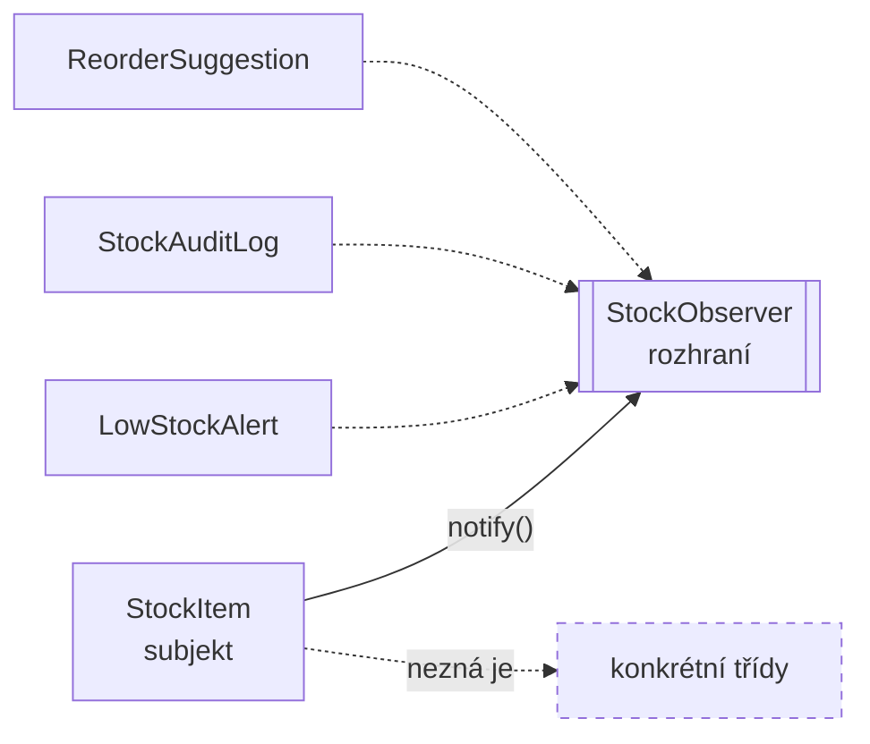

# Observer (Pozorovatel)

> [← zpět na Behavioral](../)

> **V jedné větě:** Objekt dá vědět o své změně všem, kdo o to stáli — a nemusí přitom vědět, kdo to je ani kolik jich je.

---

## Problém

Když se něco změní, má na to zareagovat několik nesouvisejících věcí. Přirozené první řešení je zavolat je přímo — a tím se ten, kdo se změnil, seznámí s celým světem.

**Poznáš to podle:**

- objekt, který se mění, **zná mailer, cache, statistiky i logger**
- přidání další reakce znamená zásah do třídy, jejíž práce se vůbec nemění
- v konstruktoru přibývají závislosti, které s odpovědností té třídy nesouvisejí
- test jedné změny musí namockovat pět služeb
- táž reakce se opakuje na několika místech, protože změna může přijít víc cestami
- nejde zapnout reakci jen někdy — je zadrátovaná

```php
// Před: sklad zná všechny, kdo ho zajímají
final class StockItem
{
    public function __construct(
        private Mailer $mailer,               // ↓ tohle všechno
        private CacheInvalidator $cache,      //   se skladem
        private StatisticsCollector $stats,   //   nemá nic
        private ReorderService $reorder,      //   společného
    ) {
    }

    public function changeQuantity(int $quantity): void
    {
        $this->quantity = $quantity;

        if ($quantity <= 10) {
            $this->mailer->sendLowStockAlert($this);
        }

        $this->cache->invalidate('stock');
        $this->stats->record($this);
        $this->reorder->maybeOrder($this);
    }
}
```

---

## Řešení

Otoč to: **subjekt drží seznam pozorovatelů** a po změně je obejde. Zná jen rozhraní, nikoho konkrétního.



```php
final class StockItem
{
    /** @var list<StockObserver> */
    private array $observers = [];

    public function subscribe(StockObserver $observer): void
    {
        $this->observers[] = $observer;
    }

    public function changeQuantity(int $quantity): void
    {
        if ($quantity === $this->quantity) {
            return;                    // nic se nezměnilo, není co oznamovat
        }

        $previous = $this->quantity;
        $this->quantity = $quantity;

        foreach ($this->observers as $observer) {
            $observer->stockChanged($this, $previous);
        }
    }
}
```

Přidání reakce je nová třída a jeden `subscribe()`. **Do `StockItem` se nesahá.**

### Každý si vybírá sám

Podstatná vlastnost, která se přehlíží: subjekt oznamuje **všem stejně** a filtrování je věc pozorovatele.

```
záznamů v auditu:  3
upozornění:        1
```

Audit zaznamenal všechny tři změny, upozornění jen tu jednu, kdy se překročila hranice. Kdyby subjekt rozhodoval, komu co pošle, věděl by o pozorovatelích víc, než má.

### Předej i to, co bylo

Detail, který rozhoduje o použitelnosti. `LowStockAlert` nereaguje na *stav*, ale na **přechod** — a bez předchozí hodnoty to nepozná:

```php
public function stockChanged(StockItem $item, int $previousQuantity): void
{
    // reaguje jen na PŘEKROČENÍ hranice, ne na každou změnu pod ní
    if ($previousQuantity > $this->threshold && $item->quantity() <= $this->threshold) {
        // …upozorni…
    }
}
```

Bez `$previousQuantity` by se upozornění poslalo při každé změně pod limitem — tedy třeba dvacetkrát za sebou.

### Když pozorovatel selže

Nejnepříjemnější vlastnost synchronního Observeru, a demo ji ukazuje bez příkras:

```
výjimka z pozorovatele: Doplňovací systém neodpovídá.
množství na skladě:  5   ← změna proběhla
záznamů v auditu:    0   ← druhý pozorovatel se ke slovu nedostal
```

Vadný pozorovatel shodil **i ten druhý**, a hlavně vyhodil výjimku do operace, která s doplňováním zásob nemá nic společného.

Rozhodnutí, které je potřeba udělat vědomě:

| Přístup | Kdy | Cena |
| ------- | --- | ---- |
| **Chytat kolem každého zvlášť** | Reakce jsou doplňkové (log, cache, statistika) | Chyba se ztratí, když se nezaloguje |
| **Nechat propadnout** | Reakce je součástí operace a bez ní nemá smysl | Vedlejší věc shodí hlavní |

Výchozí volba je ta první — **selhání pozorovatele nemá shodit původní operaci**. Ale musí se logovat, jinak vzniknou tiché chyby.

### Observer, nebo doménová událost?

Nejdůležitější rozlišení pro každého, kdo píše doménový model:

| | **Observer** | **[Domain Event](../../../DDD/DomainEvent/)** |
| --- | --- | --- |
| Kdo oznamuje | **Objekt sám** | Aplikační vrstva |
| Kdy | **Okamžitě při změně** | Až **po commitu** |
| Rozsah | Jeden proces, jedna paměť | I mimo proces (fronta, jiná služba) |
| Přežije rollback | **Ne** — reakce už proběhly | Ano — nepublikuje se |
| Kdo zná koho | Subjekt drží pozorovatele | Nikdo nikoho; události jdou přes dispatcher |
| Vhodné pro | UI, cache, ladění, in-memory reakce | Doménové reakce, integrace |

> **Observer oznamuje hned.** Když se transakce vrátí zpět, reakce už proběhly — a to je přesně důvod, proč doménové události vznikly.

Praktické pravidlo: **uvnitř jednoho objektu a jedné operace Observer, přes hranici transakce doménová událost.** Odeslat e-mail z pozorovatele je stejná chyba jako [publikovat událost před commitem](../../../DDD/DomainEvent/#publikuj-až-po-commitu).

---

## Účastníci

| Role | V příkladu | Odpovědnost |
| ---- | ---------- | ----------- |
| **Subjekt** | `StockItem` | Drží pozorovatele, oznamuje změnu |
| **Rozhraní pozorovatele** | `StockObserver` | Jediné, co subjekt o pozorovatelích ví |
| **Konkrétní pozorovatel** | `LowStockAlert`, `StockAuditLog` | Reaguje; sám si filtruje, co ho zajímá |
| **Klient** | složení v aplikaci | Rozhodne, kdo koho pozoruje |

---

## Implementace v PHP

Oznamování je triviální — celá práce je v tom, co se předá:

```php
private function notify(int $previousQuantity): void
{
    foreach ($this->observers as $observer) {
        $observer->stockChanged($this, $previousQuantity);
    }
}
```

### Push, nebo pull

GoF popsali dvě varianty a rozdíl je praktický:

| | **Push** | **Pull** |
| --- | --- | --- |
| Co se předá | Data o změně | Jen odkaz na subjekt |
| Podpis | `stockChanged(StockItem $item, int $previous)` | `stockChanged(StockItem $item)` |
| Pozorovatel | Dostane, co potřebuje | Musí si dojít |
| Když přibude údaj | Změna rozhraní pro všechny | Beze změny |
| Předchozí hodnota | **Jde předat** | **Nejde** — subjekt už ji nemá |

Demo používá **push s minimem dat**: subjekt a předchozí hodnota. Čistý pull by nefungoval, protože přechod přes hranici by nešlo poznat.

### PHP to má v jádru

```php
final class StockItem implements SplSubject { /* attach, detach, notify */ }
final class StockAuditLog implements SplObserver { /* update(SplSubject $subject) */ }
```

`SplSubject` a `SplObserver` jsou v PHP zabudované — ale používají se zřídka a je dobré vědět proč: `update(SplSubject $subject)` je **čistý pull bez typu**, takže pozorovatel musí dělat `instanceof` a nemá jak dostat, co bylo předtím. **Vlastní rozhraní je skoro vždycky lepší.**

### V Symfony to nepíšeš ručně

```php
$dispatcher->addListener(StockChanged::class, $listener);
$dispatcher->dispatch(new StockChanged($item, $previous));
```

Symfony EventDispatcher je Observer s jedním rozdílem: **subjekt a pozorovatelé se neznají vůbec** — mezi ně vstoupil prostředník. Objekt tak nemusí držet seznam a nemusí mít `subscribe()`.

To je v aplikačním kódu obvykle lepší volba. Ruční Observer má smysl tam, kde je vazba přirozeně **uvnitř jednoho objektu** — a kde by dispatcher znamenal globální infrastrukturu kvůli jedné věci.

---

## Kdy použít

- ✅ Na jednu změnu má reagovat **víc nezávislých věcí**.
- ✅ Reakce **přibývají a ubývají**, klidně za běhu.
- ✅ Ten, kdo se mění, **nemá důvod znát** ty, kdo reagují.
- ✅ Jde o reakce **uvnitř jednoho procesu** — UI, cache, ladění.
- ✅ Chceš mít vypsané, co všechno se na změnu naváže.

## Kdy nepoužít

- ❌ **Reakce je jedna a nikdy nebude druhá.** Přímé volání je čitelnější.
- ❌ **Reakce musí přežít transakci nebo opustit proces.** To je [doménová událost](../../../DDD/DomainEvent/), ne Observer.
- ❌ **Volající potřebuje výsledek.** Oznámení nic nevrací; když čekáš odpověď, je to volání.
- ❌ **Reakcí je hodně a řetězí se.** Když pozorovatel mění subjekt a tím spustí další oznámení, tok kódu se stane nesledovatelným.
- ❌ **Jako univerzální lepidlo.** Aplikace, kde se všechno děje přes oznámení, se ladí hůř než ta s přímými voláními.

---

## Časté chyby

| Chyba | Proč vadí | Jak správně |
| ----- | --------- | ----------- |
| **Selhání pozorovatele shodí operaci** | Nedoručený e-mail zruší změnu skladu | Chytej kolem každého zvlášť — a loguj |
| Oznamuje se i beze změny | Pozorovatelé dostanou oznámení o ničem, audit se plní prázdnými řádky | Porovnej starou a novou hodnotu |
| Nepředá se předchozí hodnota | Nejde poznat **přechod**, jen stav; upozornění se pošle dvacetkrát | Push s minimem potřebných dat |
| Pozorovatel mění subjekt | Vznikne rekurze nebo nekonečná smyčka oznámení | Pozorovatel jen reaguje |
| Odběr se nikdy neruší | U dlouho žijících subjektů únik paměti | `unsubscribe()`, nebo slabé reference |
| Pozorovatelé se spoléhají na pořadí | Skrytá vazba, kterou nikdo nevidí | Pozorovatelé musí být nezávislí |
| E-mail nebo zápis do DB z pozorovatele | Vedlejší efekt uvnitř transakce, kterou může někdo vrátit | [Doménová událost](../../../DDD/DomainEvent/) po commitu |
| Subjekt filtruje, komu co pošle | Ví o pozorovatelích víc, než má | Filtruje si pozorovatel |

---

## V praxi

- **Symfony EventDispatcher** — Observer s prostředníkem. V aplikačním kódu obvykle lepší volba než ruční seznam.
- **`SplSubject` / `SplObserver`** — v PHP zabudované, ale kvůli netypovanému `update()` se skoro nepoužívají.
- **Doctrine lifecycle events** — `postPersist`, `postUpdate` jsou Observer nad entitami. Pozor: běží **uvnitř** transakce, takže tam e-mail nepatří.
- **Reaktivní knihovny v JS** — `addEventListener` je Observer, jen se tomu tak neříká.
- **Ladění a metriky** — nejbezpečnější použití, protože reakce nemají vedlejší efekty.

---

## Související patterny

| Pattern | Vztah |
| ------- | ----- |
| [Domain Event](../../../DDD/DomainEvent/) | **Přímý potomek.** Řeší totéž o vrstvu výš a s tím podstatným rozdílem, že se publikuje **až po commitu**. Uvnitř procesu Observer, přes transakci událost. |
| **Mediator** (GoF) | Také rozvazuje, ale prostředník **řídí** komunikaci. Symfony EventDispatcher je někde mezi obojím. |
| [Chain of Responsibility](../ChainOfResponsibility/) | Řetěz hledá **jednoho** zpracovatele a čeká na výsledek; Observer oznamuje **všem** a nečeká. |
| [Strategy](../Strategy/) | Také drží vyměnitelné objekty, ale volá **jeden** a chce výsledek. |
| [Specification](../../../DDD/Specification/) | Přirozený obsah filtru uvnitř pozorovatele. |
| [State](../State/) | Oznamování změny stavu je nejčastější důvod, proč subjekt Observer vůbec dostane. |

---

## Vztah k principům

| Princip | Jak souvisí |
| ------- | ----------- |
| [OCP](../../../Principles/SOLID.md#openclosed-principle-ocp) | Nová reakce = nová třída a jeden `subscribe()`. Subjekt se nemění. |
| [SRP](../../../Principles/SOLID.md#single-responsibility-principle-srp) | Sklad se stará o zásobu. To, že se má poslat e-mail, není jeho důvod ke změně. |
| [Nízká provázanost](../../../Principles/CohesionAndCoupling.md) | Subjekt zná jen rozhraní; konkrétní reakce jsou mu neznámé. |
| [DIP](../../../Principles/SOLID.md#dependency-inversion-principle-dip) | Závislost míří na abstrakci pozorovatele, kterou vlastní subjekt. |

---

## Demo

```bash
php GoF/Behavioral/Observer/demo/run.php
```

Přihlásí tři pozorovatele ke skladové položce a ukáže, že **každý si filtruje sám** (audit 3 záznamy, upozornění 1). Pak odhlásí jednoho za běhu, ověří, že se **beze změny neoznamuje**, a nechá jednoho pozorovatele selhat — druhý se ke slovu nedostane a výjimka vyletí do operace, která s ním nesouvisí. Končí tabulkou rozdílů proti doménové události.

---

## Původ

|               |                                                   |
| ------------- | ------------------------------------------------- |
| **Zdroj**     | *Design Patterns: Elements of Reusable Object-Oriented Software* |
| **Autoři**    | Gamma, Helm, Johnson, Vlissides („Gang of Four“)   |
| **Rok**       | 1994                                              |
| **Kategorie** | Behavioral                                        |
| **Obtížnost** | ●●○○○                                             |

Autoři vzor demonstrují na tabulkovém procesoru: tatáž data se zobrazují jako tabulka, sloupcový graf a koláčový graf. Když se změní číslo, mají se překreslit všechny — a tabulka nemá důvod vědět, kolik grafů zrovna existuje.

Observer je základ toho, čemu se říká **MVC**: model o pohledech neví a jen oznamuje, že se změnil. Vzor je tak starý, že ho GoF sami neoznačili za nový — Smalltalk-80 ho měl zabudovaný už na začátku 80. let pod jmény *dependents* a *changed/update*.

Za pozornost stojí, co se s ním stalo od té doby. Původní podoba — subjekt drží seznam pozorovatelů — je v aplikačním kódu na ústupu, protože ji **nahradil prostředník**: event dispatcher, message bus, signály. Ten rozvazuje ještě víc, protože subjekt a pozorovatelé se neznají vůbec.

A z Observeru vyrostla i [doménová událost](../../../DDD/DomainEvent/), která přidala to, co GoF řešit nemuseli: **transakce**. V roce 1994 se oznamovalo hned, protože nebylo do čeho čekat. Jakmile se objekty začaly ukládat v transakcích, ukázalo se, že „hned“ je špatná odpověď — a to je celý rozdíl mezi oběma vzory.

---

## Zdroje

- Gamma, Helm, Johnson, Vlissides: *Design Patterns*, Addison-Wesley, 1994 — kapitola 5, str. 293
- [Symfony EventDispatcher](https://symfony.com/doc/current/components/event_dispatcher.html)
- [PHP: SplObserver](https://www.php.net/manual/en/class.splobserver.php)

---

<details>
<summary>Metadata patternu</summary>

```yaml
name: Observer
name_cs: Pozorovatel
category: Behavioral
source: GoF – Design Patterns
authors: Gamma, Helm, Johnson, Vlissides
year: 1994
difficulty: 2
tags: [oznamování, rozvázání vazeb, reakce, události, mvc]
principles: [OCP, SRP, CohesionAndCoupling, DIP]
related: [DomainEvent, Mediator, ChainOfResponsibility, Strategy, Specification, State]
status: done
```

</details>
