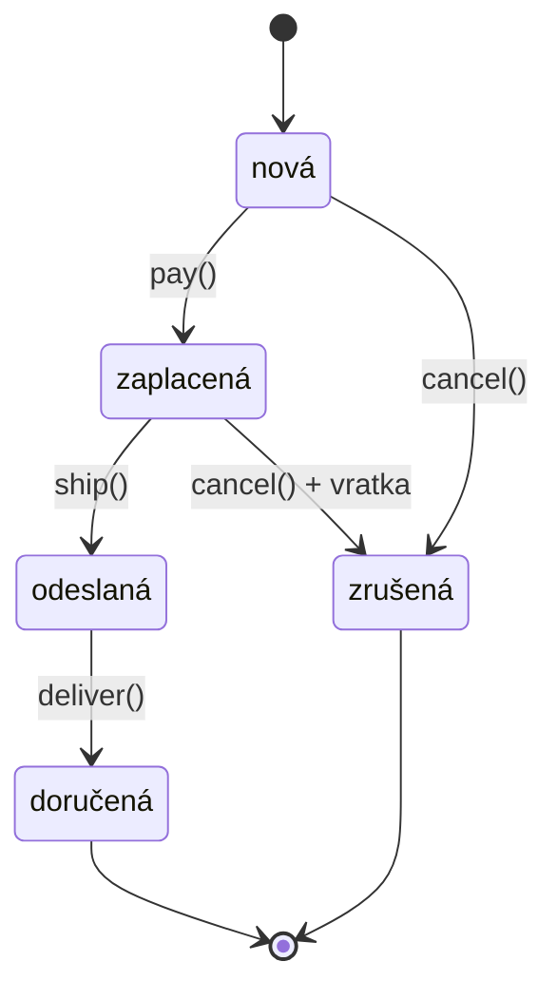

# State (Stav)

> [← zpět na Behavioral](../)

> **V jedné větě:** Objekt mění své chování podle toho, v jakém je stavu — a každý stav je vlastní třída, takže zakázané operace nejde omylem povolit.

---

## Problém

Objekt prochází životním cyklem a v každé fázi smí něco jiného. Napsané je to podmínkami — a ta samá kaskáda se opakuje v každé metodě.

**Poznáš to podle:**

- `switch ($this->status)` nebo `if ($this->status === …)` se opakuje **v každé metodě** objektu
- přidání nového stavu znamená projít všechny metody — a na jednu se vždycky zapomene
- **nikde není napsané, jaké přechody jsou dovolené**; musíš si je poskládat z podmínek
- neplatná operace **tiše neudělá nic**, protože v kaskádě chybí `else`
- na otázku „co se s objednávkou dá zrovna teď dělat?“ neumí odpovědět nic než čtení kódu
- stav je `string` nebo `int` a nikdo nehlídá, jaké hodnoty smí nabývat

```php
// Před: táž kaskáda v každé metodě, dovolené přechody nikde
final class Order
{
    private string $status = 'new';

    public function pay(): void
    {
        if ($this->status === 'new') {
            $this->status = 'paid';
        }
        // chybí else — zaplacení odeslané objednávky tiše neudělá nic
    }

    public function ship(): void
    {
        if ($this->status === 'paid') {
            $this->status = 'shipped';
        } elseif ($this->status === 'new') {
            throw new LogicException('Objednávka není zaplacená.');
        }
        // …a na 'cancelled' se zapomnělo
    }

    public function cancel(): void
    {
        if ($this->status === 'new' || $this->status === 'paid') {
            // a mimochodem: u zaplacené se má ještě vracet peníze.
            // Kde ta znalost je? Někde v use-case.
            $this->status = 'cancelled';
        }
    }
}
```

Tenhle kód má tři vady najednou: pravidla přechodů jsou rozpuštěná v podmínkách, na zakázané případy se musí **aktivně myslet** (a proto se zapomínají), a chování, které ke stavu patří, leží mimo něj.

---

## Řešení

Udělej z každého stavu třídu. Objekt si drží stav a operace na něj **deleguje**; stav sám rozhodne, co se smí a do jakého stavu se přejde.



Kontext se scvrkne na delegování a neobsahuje jedinou podmínku o stavu:

```php
public function pay(): self
{
    return new self($this->number, $this->state->pay());
}
```

### Zakázáno je všechno, co jsi nepovolil

Tohle je jádro patternu a zároveň to, co ho dělá bezpečnějším než `switch`. **Základní třída odpoví na každou operaci výjimkou.** Konkrétní stav přepíše jen to, co je v něm dovolené:

```php
abstract class OrderState
{
    public function pay(): self
    {
        throw IllegalTransition::from($this, 'zaplatit');
    }

    public function ship(): self
    {
        throw IllegalTransition::from($this, 'odeslat');
    }
    // …
}

final class NewOrder extends OrderState
{
    public function pay(): OrderState
    {
        return new PaidOrder();     // povoleno
    }

    public function cancel(): OrderState
    {
        return new CancelledOrder(); // povoleno
    }

    // ship() a deliver() nepřepisujeme → zakázané, samy od sebe
}
```

Obrať si to v hlavě proti původnímu kódu:

| | `switch` | State |
| --- | --- | --- |
| Co je výchozí | Povoleno (chybí `else`) | **Zakázáno** |
| Na co musíš myslet | Na každý zakázaný případ | Jen na povolené |
| Co se stane při opomenutí | Tiše projde | Vyhodí výjimku |
| Kde je seznam přechodů | Nikde, poskládáš si ho | V třídách, jedna za stav |

`DeliveredOrder` nepřepisuje **nic** — a je tím pádem hotový koncový stav. Napsat ho stojí čtyři řádky.

### Stav umí odpovědět, co v něm jde

Když jsou stavy objekty, dá se jich zeptat:

```
nová         zaplatit, zrušit
zaplacená    odeslat, zrušit
odeslaná     doručit
doručená     — koncový stav
zrušená      — koncový stav
```

Tohle je přímo použitelné v API i ve frontendu: tlačítka, která zákazník uvidí, vycházejí z téhož zdroje jako pravidla, která se pak vynutí. Nemůžou se rozejít.

### Kde je hranice mezi enumem a třídami

**Nejdůležitější praktické rozhodnutí v tomhle patternu**, protože PHP 8.1 změnilo početní úlohu. Backed enum s `match()` zvládne stavový automat na jeden soubor:

```php
enum OrderStatus: string
{
    case New = 'nová';
    case Paid = 'zaplacená';
    case Shipped = 'odeslaná';

    /** @return list<self> */
    public function allowedNext(): array
    {
        return match ($this) {
            self::New => [self::Paid, self::Cancelled],
            self::Paid => [self::Shipped, self::Cancelled],
            self::Shipped => [self::Delivered],
            self::Delivered, self::Cancelled => [],
        };
    }
}
```

Dostaneš přechody na jednom místě, výjimku při neplatném přechodu i vyčerpávající `match` hlídaný statickou analýzou. **Pro většinu stavových automatů to stačí a je to lepší volba než sedm tříd.**

Hranice je jasná: **enum je hodnota, stav se stává objektem, teprve když nese chování nebo data.**

```php
// Oba jsou „zrušená“, ale nenesou totéž
$cancelledBeforePayment;  // vratka: ne
$cancelledAfterPayment;   // vratka: ANO
```

| Sáhni po | Když |
| -------- | ---- |
| **Enum + `match`** | Stav je nálepka. Přechody jsou pravidla, chování je všude stejné. |
| **Třída za stav** | Stav nese **data** (jako `refundRequired`) nebo se v každém stavu chová **jinak** ta samá operace. |
| **Symfony Workflow** | Automat je složitý, potřebuješ guardy, události, audit nebo obrázek pro produkťáka. |

Praktické doporučení: **začni enumem.** Do tříd přejdi až ve chvíli, kdy ti do `match` začne přibývat chování — to je ten signál, ne počet stavů.

---

## Účastníci

| Role | V příkladu | Odpovědnost |
| ---- | ---------- | ----------- |
| **Context** | `Order` | Drží stav a deleguje na něj; neobsahuje podmínky o stavu |
| **State** (základ) | `OrderState` | Kontrakt operací; **výchozí odpovědí je „nelze“** |
| **Konkrétní stav** | `NewOrder`, `PaidOrder`, … | Přepíše dovolené operace a vrátí následující stav |
| **Koncový stav** | `DeliveredOrder`, `CancelledOrder` | Nepřepisuje nic; může nést data o tom, jak se sem přišlo |
| **Chyba přechodu** | `IllegalTransition` | Řekne stav, operaci **i to, co by šlo** |

---

## Implementace v PHP

Základní třída. Všimni si, že zakázání je pasivní — vzniká tím, že se metoda nepřepíše:

```php
<?php
declare(strict_types=1);

abstract class OrderState
{
    abstract public function name(): string;

    public function pay(): self
    {
        throw IllegalTransition::from($this, 'zaplatit');
    }

    public function ship(): self
    {
        throw IllegalTransition::from($this, 'odeslat');
    }

    public function deliver(): self
    {
        throw IllegalTransition::from($this, 'doručit');
    }

    public function cancel(): self
    {
        throw IllegalTransition::from($this, 'zrušit');
    }

    /** Rekonstrukce z úložiště — v databázi je jen jméno stavu. */
    public static function fromName(string $name): self
    {
        return match ($name) {
            'nová' => new NewOrder(),
            'zaplacená' => new PaidOrder(),
            'odeslaná' => new ShippedOrder(),
            'doručená' => new DeliveredOrder(),
            'zrušená' => new CancelledOrder(),
            default => throw new InvalidArgumentException(sprintf('Neznámý stav „%s“.', $name)),
        };
    }
}
```

Chybová hláška má obsahovat i to, **co by šlo** — u stavového automatu je nejčastější otázkou „proč to nešlo?“ a odpověď patří do výjimky, ne do debuggeru:

```
Objednávku ve stavu „nová“ nelze odeslat. Možné operace: zaplatit, zrušit.
```

### Kontext bývá neměnný

Původní GoF popis mění kontext na místě (`$this->state = new PaidOrder()`). S neměnnými entitami je přirozenější vracet novou instanci — odpadá tím celá kategorie chyb se sdílenou instancí, kterou ti někdo změní pod rukama:

```php
final readonly class Order
{
    private function __construct(
        public string $number,
        public OrderState $state,
    ) {
    }

    public function pay(): self
    {
        return new self($this->number, $this->state->pay());
    }
}
```

### Persistence

Do databáze jde **jméno stavu**, ne serializovaný objekt. Zpátky se z něj stav poskládá:

```php
$repository->save($order->status());                      // 'doručená'
$order = Order::reconstitute($number, $row['status']);    // → DeliveredOrder
```

Když stav nese data (`refundRequired`), musí se uložit i ta — a to je další signál, že jsi překročil hranici, kde by stačil enum.

### Použití

```php
$order = Order::place('OBJ-001')
    ->pay()
    ->ship()
    ->deliver();

$order->status();                        // 'doručená'
$order->state->allowedOperations();      // []

$order->cancel();
// IllegalTransition: Objednávku ve stavu „doručená“ nelze zrušit.
```

---

## Kdy použít

- ✅ Objekt má **životní cyklus** a v každé fázi smí něco jiného.
- ✅ Táž kaskáda podmínek o stavu se opakuje ve víc metodách.
- ✅ **Ta samá operace se v různých stavech chová jinak** (zrušení nezaplacené × zaplacené objednávky).
- ✅ Stav nese vlastní **data**, nejen jméno.
- ✅ Potřebuješ vypsat, co je v daném stavu dovoleno — pro API nebo pro tlačítka ve frontendu.
- ✅ Zakázané přechody musí spolehlivě spadnout, ne tiše projít.

## Kdy nepoužít

- ❌ **Stav je jen nálepka.** Když se chování nemění a jde jen o to, co po čem následuje, použij **enum s `match`**. Sedm tříd tu není za co.
- ❌ **Stavy jsou dva.** `if ($isActive)` je čitelnější než dvě třídy a abstraktní předek.
- ❌ **Přechody závisí na vnějších pravidlech, ne na stavu.** Když o přechodu rozhoduje role uživatele nebo kombinace podmínek, patří to do [Specification](../../../DDD/Specification/) nebo [Rules Engine](../../../Architecture/RulesEngine/), ne do stavu.
- ❌ **Automat je opravdu složitý** — paralelní větve, guardy, historie přechodů. Vezmi **Symfony Workflow**; dostaneš k tomu i vizualizaci a auditní stopu.

---

## Časté chyby

| Chyba | Proč vadí | Jak správně |
| ----- | --------- | ----------- |
| Základní třída nezakazuje, jen vrací `null` nebo nic nedělá | Přišel jsi o hlavní přínos — neplatná operace zase projde tiše | Výchozí implementace **vyhodí výjimku** |
| Kontextu zůstane `switch` na stav | Podmínka, kterou jsi chtěl odstranit, je zpátky | Kontext jen deleguje, žádné `instanceof` |
| Stav zná kontext a sahá do něj zpátky | Vznikne cyklická závislost a stav nejde testovat samostatně | Stav dostane vše potřebné v parametru a vrátí následující stav |
| Přechody jsou rozházené — část ve stavu, část v use-case | Pravidla přechodů zase nejsou na jednom místě | Následující stav vrací stav sám |
| Sedm tříd tam, kde stačí enum | Režie bez užitku; nováček tápe, proč je to tak složité | Enum, dokud stav nenese chování nebo data |
| Do databáze se serializuje objekt stavu | Změna třídy rozbije stará data | Ukládej **jméno** stavu a rekonstruuj přes továrnu |
| Chybová hláška říká jen „neplatný přechod“ | Nejčastější otázka je „a co teda jde?“ | Do výjimky dej stav, operaci i dovolené operace |
| Seznam dovolených operací se udržuje ručně vedle chování | Rozejde se to a frontend nabídne tlačítko, které spadne | Odvoď seznam z chování (v ukázce z přepsaných metod) |

---

## V praxi

- **Symfony Workflow** — hotový stavový automat s guardy, událostmi a **vygenerovaným obrázkem automatu**. Když má stavový diagram víc než pár uzlů, sáhni sem dřív, než si to napíšeš sám.
- **PHP 8.1 enumy** — pro většinu automatů dnes ta správná volba. `match` nad enumem navíc PHPStan kontroluje na vyčerpanost, takže nový stav rozsvítí všechna místa, kam patří.
- **Doctrine** — stav se mapuje jako `string` nebo enum sloupec; objekt stavu se z něj skládá v továrně (viz [Repository](../../../PoEAA/Repository/) a `reconstitute()`).
- **Objednávky, platby, reklamace, publikace obsahu** — všude, kde má doména slovo „stav“, je tenhle pattern kandidát.

---

## Související patterny

| Pattern | Vztah |
| ------- | ----- |
| [Strategy](../Strategy/) | **Nejčastěji zaměňovaná dvojice a strukturou jsou totožné.** Rozdíl je v tom, kdo rozhoduje a co ví: strategii vybírá **klient zvenčí** a ta se během operace nemění; stav si objekt přepíná **sám** a jednotlivé stavy **znají své následníky**. Strategy odpovídá na „jak to udělat“, State na „co teď smím“. |
| [Chain of Responsibility](../ChainOfResponsibility/) | Také deleguje dál, ale hledá zpracovatele. State nehledá — ví přesně, kdo je na řadě. |
| [Specification](../../../DDD/Specification/) | Přirozený obsah guardu: podmínka, za které je přechod dovolený. |
| [Rules Engine](../../../Architecture/RulesEngine/) | Když o přechodu nerozhoduje jen stav, ale sada vnějších pravidel. |
| [Value Object](../../../DDD/ValueObject/) | Stav bez dat je hodnota — proto ho v PHP nejčastěji zastoupí enum. |
| [Entity](../../../DDD/Entity/) (DDD) | Typický nositel stavového automatu: entita má životní cyklus, hodnota ne. |
| [Saga](../../../Architecture/Saga/) | Stav ságy je stavový automat; u složitějších procesů se vyplatí ho tak i napsat. |
| [Observer](../Observer/) (GoF) | Oznámení o změně stavu je nejčastější důvod, proč subjekt Observer vůbec dostane. |
| [Singleton](../../Creational/Singleton/) (GoF) | Bezstavové stavy se dají sdílet jako jediné instance. V PHP to díky enumům řeší jazyk sám — a je to [jediná podoba singletonu, která se doporučuje](../../Creational/Singleton/#enum-jako-jedináček-který-nevadí). |

---

## Vztah k principům

| Princip | Jak souvisí |
| ------- | ----------- |
| [OCP](../../../Principles/SOLID.md#openclosed-principle-ocp) | Nový stav = nová třída. Kontext ani ostatní stavy se nemění. |
| [SRP](../../../Principles/SOLID.md#single-responsibility-principle-srp) | Každý stav má jediný důvod ke změně — pravidla té své fáze. |
| [LSP](../../../Principles/SOLID.md#liskov-substitution-principle-lsp) | Zajímavý případ: potomek tu **záměrně** dědí metody, které vyhazují výjimku. Není to porušení — výjimka je součástí kontraktu předka, ne jeho obcházení. Rozdíl proti [porušení LSP](../../../Principles/SOLID.md#liskov-substitution-principle-lsp) je v tom, že volající se **může předem zeptat** přes `allowedOperations()`. |

---

## Demo

```bash
php GoF/Behavioral/State/demo/run.php
```

Projde životní cyklus objednávky, ukáže dvě zakázané operace i s vysvětlením, co by šlo, vypíše dovolené operace pro každý stav, předvede stav nesoucí data (`vratka: ANO/ne` u dvou různě zrušených objednávek), uložení a načtení stavu — a nakonec **týž automat postavený jen na enumu**, pro srovnání rozsahu.

---

## Původ

|               |                                                   |
| ------------- | ------------------------------------------------- |
| **Zdroj**     | *Design Patterns: Elements of Reusable Object-Oriented Software* |
| **Autoři**    | Gamma, Helm, Johnson, Vlissides („Gang of Four“)   |
| **Rok**       | 1994                                              |
| **Kategorie** | Behavioral                                        |
| **Obtížnost** | ●●●○○                                             |

Autoři vzor demonstrují na síťovém spojení: `TCPConnection` se chová jinak, když je navázané, naslouchající nebo uzavřené — a bez patternu je v každé metodě táž kaskáda podmínek. Odkazují se přitom na starší práci s konečnými automaty; nová nebyla myšlenka stavu, ale to, že **stav je objekt**, a ne hodnota, na kterou se všichni ptají.

V roce 1994 to byla dražší rada než dnes. Jazyky neuměly výčtové typy ani vyčerpávající `match`, takže „stav jako hodnota“ znamenalo `int` konstanty a `switch` bez jakékoli kontroly — třída za stav byla první rozumný způsob, jak si vynutit, že se na žádný případ nezapomene.

**PHP 8.1 tenhle výpočet změnilo.** Backed enum s `match`, který statická analýza kontroluje na vyčerpanost, pokryje značnou část toho, kvůli čemu pattern vznikl, a stojí jeden soubor. Původní podoba se sedmi třídami zůstává správnou volbou tam, kde stav nese **chování nebo data** — a přesně na tom rozdílu je postavená [sekce o hranici mezi enumem a třídami](#kde-je-hranice-mezi-enumem-a-třídami).

---

## Zdroje

- Gamma, Helm, Johnson, Vlissides: *Design Patterns*, Addison-Wesley, 1994 — kapitola 5, str. 305
- [Symfony Workflow Component](https://symfony.com/doc/current/workflow.html)
- [PHP: Enumerations](https://www.php.net/manual/en/language.enumerations.php)

---

<details>
<summary>Metadata patternu</summary>

```yaml
name: State
name_cs: Stav
category: Behavioral
source: GoF – Design Patterns
authors: Gamma, Helm, Johnson, Vlissides
year: 1994
difficulty: 3
tags: [stavový automat, polymorfismus, životní cyklus, enum, přechody]
principles: [OCP, SRP, LSP]
related: [Strategy, ChainOfResponsibility, Specification, RulesEngine, ValueObject, Singleton]
status: done
```

</details>
