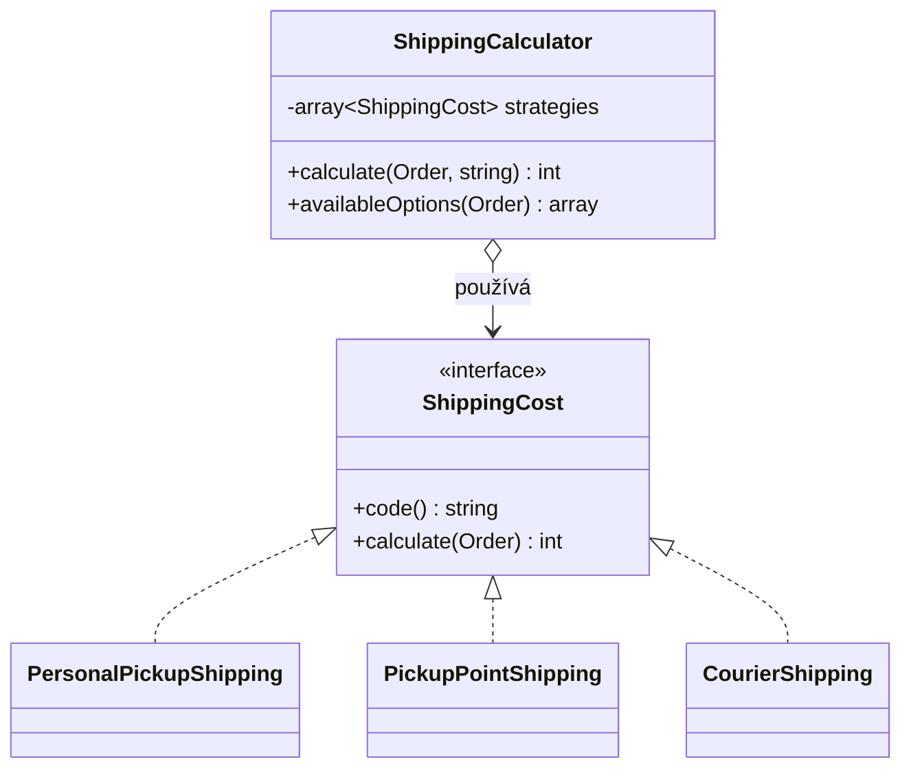

# Strategy (Strategie)

> [← zpět na Behavioral](../)

> **V jedné větě:** Zaměnitelné algoritmy schované za společným rozhraním — kód, který je používá, nemusí vědět, který z nich zrovna běží.

---

## Problém

Máš operaci, která se dá udělat několika způsoby, a volba mezi nimi padá až za běhu. Nejpřirozenější první řešení je podmínka — a ta postupně nabobtná.

**Poznáš to podle:**

- `switch`/`match` nebo kaskáda `if`ů, která se větví podle typu, kódu nebo konfigurace
- při přidání nové varianty musíš **editovat existující třídu**, i když jsi nic starého měnit nechtěl — porušení [OCP](../../../Principles/SOLID.md#openclosed-principle-ocp)
- větve rostou (do jedné přibude výpočet z hmotnosti, do druhé ze země) a metoda má 80 řádků
- test třídy musí procházet všechny větve, protože z venku se k jedné dostat nedá

```php
// Před: veškerá znalost o dopravě je natlačená do jedné metody
final class ShippingCalculator
{
    public function calculate(Order $order, string $shippingCode): int
    {
        if ($shippingCode === 'personal_pickup') {
            return 0;
        }

        if ($shippingCode === 'pickup_point') {
            return $order->totalInCents >= 150000 ? 0 : 6900;
        }

        if ($shippingCode === 'courier') {
            $price = $order->countryCode === 'CZ' ? 9900 : 19800;
            $overweight = $order->weightInGrams - 5000;

            if ($overweight > 0) {
                $price += (int) ceil($overweight / 1000) * 1500;
            }

            return $price;
        }

        // ...a tady za půl roku přibude 'drone', 'locker' a 'freight'
        throw new InvalidArgumentException('Neznámý způsob dopravy.');
    }
}
```

Třída ví o všech dopravcích současně. Změna sazby u kurýra znamená zásah do souboru, který se dotýká i osobního odběru — a tím i riziko, že rozbiješ něco nesouvisejícího.

---

## Řešení

Každou větev vytáhni do vlastní třídy za společným rozhraním. Kontext si pak drží jen odkaz na rozhraní a algoritmus zavolá, aniž by věděl který.



Podmínka nezmizela — **přesunula se z těla metody do výběru objektu**. Rozdíl je v tom, že ten výběr je teď na jednom místě (registrace v DI kontejneru) a samotné výpočty jsou na sobě nezávislé.

---

## Účastníci

| Role                    | V příkladu                                              | Odpovědnost                                                        |
| ----------------------- | ------------------------------------------------------- | ------------------------------------------------------------------ |
| **Strategy** (rozhraní) | `ShippingCost`                                          | Kontrakt společný všem variantám algoritmu                          |
| **Concrete Strategy**   | `CourierShipping`, `PickupPointShipping`, …             | Jedna konkrétní implementace algoritmu                              |
| **Context**             | `ShippingCalculator`                                    | Drží strategii a deleguje na ni; konkrétní implementace nezná       |
| **Client**              | DI kontejner / `run.php`                                | Rozhodne, které strategie do kontextu vstoupí                       |

---

## Implementace v PHP

Rozhraní — kvůli němu celý pattern existuje:

```php
<?php
declare(strict_types=1);

interface ShippingCost
{
    /** Strojový kód dopravy, pod kterým si ji zákazník vybere. */
    public function code(): string;

    /** Cena dopravy v haléřích. */
    public function calculate(Order $order): int;
}
```

Konkrétní strategie — každá ví jen o sobě:

```php
final readonly class CourierShipping implements ShippingCost
{
    private const int BASE_PRICE = 9900;
    private const int WEIGHT_LIMIT_GRAMS = 5000;
    private const int SURCHARGE_PER_KG = 1500;

    public function code(): string
    {
        return 'courier';
    }

    public function calculate(Order $order): int
    {
        $price = $order->countryCode === 'CZ'
            ? self::BASE_PRICE
            : self::BASE_PRICE * 2;

        $overweight = $order->weightInGrams - self::WEIGHT_LIMIT_GRAMS;

        if ($overweight > 0) {
            $price += (int) ceil($overweight / 1000) * self::SURCHARGE_PER_KG;
        }

        return $price;
    }
}
```

Kontext. Klasický GoF Strategy drží **jednu** strategii; v praxi je u výběru za běhu užitečnější mapa strategií podle kódu:

```php
final class ShippingCalculator
{
    /** @var array<string, ShippingCost> */
    private array $strategies = [];

    /** @param list<ShippingCost> $strategies */
    public function __construct(array $strategies)
    {
        foreach ($strategies as $strategy) {
            $this->strategies[$strategy->code()] = $strategy;
        }
    }

    public function calculate(Order $order, string $shippingCode): int
    {
        $strategy = $this->strategies[$shippingCode]
            ?? throw new InvalidArgumentException(
                sprintf('Neznámý způsob dopravy "%s".', $shippingCode),
            );

        return $strategy->calculate($order);
    }
}
```

### Použití

```php
$calculator = new ShippingCalculator([
    new PersonalPickupShipping(),
    new PickupPointShipping(),
    new CourierShipping(),
]);

$order = new Order(
    number: 'OBJ-003',
    totalInCents: 45000,
    weightInGrams: 8300,
    countryCode: 'CZ',
);

echo $calculator->calculate($order, 'courier'); // 15900
```

Nový dopravce = nová třída a jeden řádek v registraci. `ShippingCalculator` se nemění.

---

## Kdy použít

- ✅ Jedna operace má **víc variant** a volba padá za běhu (konfigurace, vstup uživatele, typ zákazníka).
- ✅ Varianty jsou **netriviální** — mají vlastní pravidla, konstanty nebo závislosti (kurzový lístek, repository, HTTP klient).
- ✅ Potřebuješ každou variantu **testovat samostatně**, bez obcházení přes kontext.
- ✅ Očekáváš, že variant bude přibývat a nechceš kvůli tomu sahat do existujícího kódu.

## Kdy nepoužít

- ❌ **Máš dvě varianty a víc jich nebude.** `match` na dvou řádcích je čitelnější než tři soubory. Pattern zaveď, až když tě bolest donutí.
- ❌ **Varianta je jednořádkový výraz bez závislostí.** Použij closure nebo first-class callable: `array_map($this->rate(...), $items)`.
- ❌ **Varianty se liší jen daty, ne chováním.** Pak nepotřebuješ třídy, ale konfigurační pole nebo enum s hodnotami.
- ❌ **Algoritmus se nevybírá, ale postupně prochází celý** — to je [Chain of Responsibility](../ChainOfResponsibility/), ne Strategy.

---

## Časté chyby

| Chyba | Proč vadí | Jak správně |
| ----- | --------- | ----------- |
| Kontext dostane strategii, ale uvnitř si stejně dělá `instanceof` | Podmínka, kterou jsi chtěl odstranit, se vrátila zadními vrátky | Vše, co se liší, patří do rozhraní strategie |
| Rozhraní se rozroste, protože jedna strategie potřebuje parametr navíc | Ostatní implementace ho musí ignorovat a rozhraní přestane dávat smysl | Předej celý kontextový objekt (`Order`), ne jednotlivé skaláry |
| Strategie si drží stav mezi voláními | Sdílená instance v DI kontejneru → data z jedné objednávky prosáknou do druhé | Strategie ať jsou `readonly` a bezstavové |
| Neznámý kód tiše vrátí `null` nebo `0` | Chyba se projeví až v objednávce se špatnou cenou | Chybějící strategie = výjimka |
| Strategie ví, kdo ji volá, a sahá zpátky do kontextu | Vznikne cyklická závislost a pattern ztratí smysl | Tok je jednosměrný: kontext → strategie |

---

## V praxi

- **Symfony** — [tagged services](https://symfony.com/doc/current/service_container/tags.html) jsou nástroj přímo na tenhle pattern: označíš implementace tagem a kontext dostane celou kolekci konstruktorem.
- **PSR-3 / Monolog** — handlery jsou strategie zápisu logu; logger neví, jestli píše do souboru nebo do Elasticu.
- **Doctrine** — `NamingStrategy`, `QuoteStrategy`: chování mapperu vyměníš konfigurací, ne dědičností.
- **PHP samotné** — `usort($items, $comparator)` je Strategy v nejjednodušší podobě, jen místo objektu předáváš callable.

---

## Související patterny

| Pattern | Vztah |
| ------- | ----- |
| [State](../State/) | Strukturou skoro totožný a nejčastěji zaměňovaná dvojice vůbec. Rozdíl je v tom, kdo rozhoduje a co ví: strategii vybírá **klient zvenčí** a ta se během operace nemění; stav si objekt přepíná **sám** a jednotlivé stavy **znají své následníky**. Strategy odpovídá na „jak to udělat“, State na „co teď smím“. |
| **Template Method** | Řeší totéž — variabilní část algoritmu — ale **dědičností** místo kompozice. Template Method mění kroky uvnitř pevné kostry, Strategy vymění celý algoritmus. |
| [Decorator](../../Structural/Decorator/) | Také obaluje chování, ale **přidává** k původnímu; Strategy původní chování **nahrazuje**. |
| **Command** | Také zabaluje operaci do objektu, ale kvůli odložení, frontě nebo undo — ne kvůli výběru z variant. |
| **Factory Method** | Častý doplněk: rozhoduje, která strategie se pro daný vstup vytvoří. |
| [Chain of Responsibility](../ChainOfResponsibility/) | Strategy vybere jednoho zpracovatele předem; řetěz se ptá postupně, dokud někdo neřekne ano. |
| [Rules Engine](../../../Architecture/RulesEngine/) | Jednotlivé pravidlo je Strategy pro výpočet důsledku. Rozdíl: Strategy se vybírá jedna, v enginu se vyhodnotí všechny a teprve pak se rozhoduje. |
| [Adapter](../../Structural/Adapter/) | Za adaptéry se cizí dodavatelé stanou zaměnitelnými — a tím i strategiemi. |
| [Ports & Adapters](../../../Architecture/PortsAndAdapters/) | Port se dvěma implementacemi je z pohledu jádra Strategy. Liší se záměrem: Strategy vybírá algoritmus, port odstiňuje vnější svět. |
| [Specification](../../../DDD/Specification/) (DDD) | Také zabaluje chování do objektu, ale odpovídá **ano/ne** místo toho, aby něco počítala. Často spolupracují: specifikace rozhodne, která strategie se použije. |

---

## Vztah k principům

| Princip | Jak souvisí |
| ------- | ----------- |
| [OCP](../../../Principles/SOLID.md#openclosed-principle-ocp) | Hlavní důvod, proč pattern existuje: nová varianta = nová třída, kontext se nemění. |
| [Nízká provázanost](../../../Principles/CohesionAndCoupling.md#řídicí-provázanost-protože-ta-je-nejzákeřnější) | Nahrazuje **řídicí provázanost** — místo `bool` příznaku, kterým volající řídí vnitřek, polymorfismus. |
| [DIP](../../../Principles/SOLID.md#dependency-inversion-principle-dip) | Kontext závisí na rozhraní `ShippingCost`, ne na konkrétním dopravci. |
| [SRP](../../../Principles/SOLID.md#single-responsibility-principle-srp) | Každá strategie má jediný důvod ke změně — sazbu vlastního dopravce. |
| [LSP](../../../Principles/SOLID.md#liskov-substitution-principle-lsp) | Kompozice místo dědičnosti; strategie jsou zaměnitelné z definice. |

---

## Demo

```bash
php GoF/Behavioral/Strategy/demo/run.php
```

Spočítá dopravu pro čtyři různé objednávky přes všechny registrované strategie a ukáže, jak se chová neznámý kód dopravy.

---

## Původ

|               |                                                                       |
| ------------- | --------------------------------------------------------------------- |
| **Zdroj**     | *Design Patterns: Elements of Reusable Object-Oriented Software*       |
| **Autoři**    | Gamma, Helm, Johnson, Vlissides („Gang of Four“)                       |
| **Rok**       | 1994                                                                   |
| **Kategorie** | Behavioral                                                             |
| **Obtížnost** | ●●○○○                                                                  |

Vzor pochází z prostředí, kde neexistovaly first-class funkce — v C++ roku 1994 se „předání algoritmu jako parametru“ muselo řešit objektem. Autoři ho v knize demonstrují na sazbě textu do řádků: `Composition` má několik způsobů, jak zalomit odstavec, a nechce je mít všechny zadrátované v sobě.

I když má dnešní PHP closures a first-class callables, Strategy nezastaral. Rozdíl je v tom, že strategie **má jméno, vlastní soubor a může mít závislosti** — což je u čehokoli složitějšího než jednořádkový výpočet rozdíl mezi udržovatelným a neudržovatelným kódem.

---

## Zdroje

- Gamma, Helm, Johnson, Vlissides: *Design Patterns*, Addison-Wesley, 1994 — kapitola 5, str. 315
- [Symfony: Service Tags](https://symfony.com/doc/current/service_container/tags.html)

---

<details>
<summary>Metadata patternu</summary>

```yaml
name: Strategy
name_cs: Strategie
category: Behavioral
source: GoF – Design Patterns
authors: Gamma, Helm, Johnson, Vlissides
year: 1994
difficulty: 2
tags: [kompozice, polymorfismus, open-closed, testovatelnost]
principles: [OCP, DIP, SRP, LSP]
related: [State, TemplateMethod, Decorator, Command]
status: done
```

</details>
