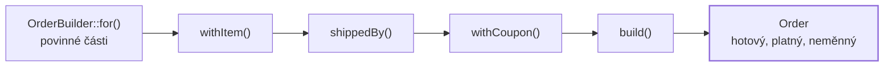

# Builder (Stavitel)

> [← zpět na Creational](../)

> **V jedné větě:** Objekt se sestaví po částech a teprve na konci vznikne — hotový, platný a neměnný.

---

## Problém

Objekt má hodně částí, půlka je volitelná a některé se přidávají postupně. Konstruktor to nezvládne.

**Poznáš to podle:**

- konstruktor má devět parametrů a z volání nepoznáš, co je co
- v kódu je `new Order($a, $b, $items, 'kurýr', 'převod', null, 'PODZIM26', false, $now)` — a ten `null` a `false` nikdo nerozklíčuje
- objekt se skládá **postupně** (košík, dotaz, konfigurace) a mezi kroky je nehotový
- na sestavení jsou tři různé cesty a každá vypadá jinak
- v testech se opakuje devět parametrů, ze kterých test zajímá jeden
- setterový přístup dovolí objekt vytvořit **v polovičatém stavu**

```php
// Před: konstruktor, který se nedá přečíst
new Order(
    'OBJ-001', 'a@b.cz', $items, 'kurýr', 'převod',
    null, 'PODZIM26', false, $now,
);
```

```
parametrů konstruktoru: 9
Co znamená ten `null` a ten `false`? Bez otevření třídy nic.
```

---

## Řešení

Rozděl sestavení do pojmenovaných kroků a nech objekt vzniknout až na konci:

```php
OrderBuilder::for('OBJ-002', 'a@b.cz', $now)
    ->withItem('MON-27', 799000)
    ->shippedBy('kurýr')
    ->paidBy('převod')
    ->withCoupon('PODZIM26')
    ->build();
```

Každá část má jméno, o tom, co se nenastavilo, se mlčí, a výchozí hodnoty jsou v builderu — ne v devíti `null`.



Dvě zásady, které z toho dělají pattern:

| Zásada | Proč |
| ------ | ---- |
| **Povinné části do továrny, volitelné do metod** | `for()` bere to, bez čeho objekt nedává smysl. Zbytek je nepovinný ze své podstaty. |
| **Objekt vzniká až v `build()`** | Do té doby existuje jen rozdělaná práce. Nikdo nedostane polovičatý `Order`. |

### Builder není místo pro doménová pravidla

Nejdůležitější věta celého dokumentu. Builder **sestavuje**, ale platnost hlídá pořád ten objekt:

```
prázdná objednávka:
    Objednávka musí mít alespoň jednu položku.

dárek bez vzkazu (obejití builderu, přímý konstruktor):
    Dárková objednávka musí mít vzkaz.
```

**Obě výjimky přišly z konstruktoru `Order`, ne z builderu.** Kdyby pravidla byla v builderu, obešel by je každý, kdo si objednávku sestaví jinak — a přesně tenhle problém [řeší Service Layer o vrstvu výš](../../../PoEAA/ServiceLayer/#proč-pravidlo-v-use-case-nestačí).

Builder smí kontrolovat **úplnost** („zapomněl jsi položky“) jen jako pohodlnější hlášku. Poslední slovo má konstruktor.

### Postupné sestavování je ten pravý důvod

Builder se často zavádí kvůli čitelnosti, ale tam ho dnes [porazí pojmenované argumenty](#kdy-ho-nepotřebuješ). Kde ho neporazí, je tohle:

```php
$builder = OrderBuilder::for('OBJ-003', 'zakaznik@example.com', $now);

$builder->withItem('MON-27', 799000);      // zákazník přidá monitor
$builder->withItem('KLA-01', 129000, 2);   // …pak klávesnici
$builder->shippedBy('osobní odběr');       // …a rozmyslí si dopravu

$cart = $builder->build();
```

**Builder drží rozdělanou práci**, dokud někdo neřekne `build()`. Továrna to neumí — ta vyrobí objekt jedním voláním a tím to končí.

### Test data builder

Nejužitečnější použití v PHP, a stojí za to ho znát i tam, kde builder v produkčním kódu nemáš:

```php
final class OrderMother
{
    public static function any(): OrderBuilder
    {
        return OrderBuilder::for('OBJ-TEST', 'test@example.com', new \DateTimeImmutable('2026-09-01'))
            ->withItem('MON-27', 799000);
    }

    public static function gift(): Order
    {
        return self::any()->asGift('Všechno nejlepší!')->build();
    }
}
```

```php
// Test řekne jen to, co je pro něj podstatné
$order = OrderMother::any()->withCoupon('SLEVA10')->build();
```

Bez toho má každý test devět parametrů, z nichž ho zajímá jeden — a když do konstruktoru přibude desátý, **přepisuje se sto testů místo jednoho místa**.

Rozumné výchozí hodnoty patří sem, do testovacího kódu. Do produkčního builderu jen tam, kde jsou skutečně doménovým rozhodnutím.

### Kdy ho nepotřebuješ

Poctivá část. **PHP 8 dalo pojmenované argumenty** a ty pokryjí většinu toho, kvůli čemu se builder zaváděl:

```php
new Order(
    number: 'OBJ-006',
    customerEmail: 'a@b.cz',
    isGift: false,
    couponCode: 'PODZIM26',
);
```

| | Pojmenované argumenty | Builder |
| --- | --- | --- |
| Každá hodnota má jméno | **ano** | ano |
| Nepovinné jde vynechat | **ano** | ano |
| Práce navíc | **žádná** | celá třída |
| Sestavení **postupně** | ne | **ano** |
| Pojmenovat kombinaci (`asGift()`) | ne | **ano** |
| Výchozí hodnoty jinde než v konstruktoru | ne | **ano** |

**Builder má navrch jen ve třech spodních řádcích.** Když ti jde o čitelnost volání, pojmenované argumenty stačí a jsou zadarmo.

---

## Účastníci

| Role | V příkladu | Odpovědnost |
| ---- | ---------- | ----------- |
| **Builder** | `OrderBuilder` | Sbírá části, drží výchozí hodnoty, vyrobí produkt |
| **Produkt** | `Order` | Neměnný, platný — a **hlídá si vlastní pravidla** |
| **Testovací builder** | `OrderMother` | Rozumné výchozí hodnoty pro testy |
| **Klient** | use-case, controller, test | Řekne, co potřebuje; zbytek nechá být |

---

## Implementace v PHP

Fluent rozhraní stojí na tom, že každá metoda vrací `$this`:

```php
public function withItem(string $sku, int $unitPriceInCents, int $quantity = 1): self
{
    $this->items[] = new OrderItem($sku, $unitPriceInCents, $quantity);

    return $this;
}
```

A rozdělení povinné × volitelné se dělá **továrnou**:

```php
private function __construct(
    private readonly string $number,
    private readonly string $customerEmail,
    private readonly \DateTimeImmutable $placedAt,
) {
}

public static function for(string $number, string $customerEmail, \DateTimeImmutable $placedAt): self
{
    return new self($number, $customerEmail, $placedAt);
}
```

Povinné části jdou do `for()`, takže se nedají zapomenout. Kdyby byly setterem, `build()` by musel kontrolovat, jestli je někdo nastavil — a to je práce, kterou za tebe udělá typový systém.

### Měnitelný builder, neměnný produkt

Builder **je** měnitelný a je to v pořádku — to je jeho práce. Produkt je naopak `readonly`:

| | Builder | Produkt |
| --- | --- | --- |
| Měnitelný | **ano** | ne |
| Může být v polovičatém stavu | **ano** | ne |
| Platnost se ověřuje | ne | **v konstruktoru** |
| Životnost | do `build()` | jak dlouho je potřeba |

Když potřebuješ z jednoho builderu vyrobit **víc různých produktů**, musí být buď neměnný (metody vracejí novou instanci), nebo se z něj musí dát udělat kopie. Jinak druhý `build()` dostane změny provedené po tom prvním.

### Fluent není totéž co builder

Časté nedorozumění: fluent rozhraní (`->a()->b()->c()`) je jen **zápis**. Builder je vzor, kde se rozdělaná práce drží stranou a produkt vzniká na konci.

```php
$queryBuilder->select('o')->from(Order::class)->where('o.paid = 1');   // fluent i builder
$money->add($tax)->multipliedBy(2);                                    // fluent, ale NE builder
```

Ve druhém případě každá metoda vrací **hotový a platný produkt**, ne rozdělanou práci. To je [value object](../../../DDD/ValueObject/), ne builder.

---

## Kdy použít

- ✅ Objekt se sestavuje **postupně** — košík, dotaz, konfigurace, dokument.
- ✅ Částí je hodně a většina je **volitelná**.
- ✅ Chceš pojmenovat **kombinace** (`asGift()` nastaví dvě věci najednou).
- ✅ Píšeš **testovací data** — tam se vyplatí skoro vždycky.
- ✅ Výchozí hodnoty nepatří do konstruktoru, ale někam vedle.

## Kdy nepoužít

- ❌ **Jde ti jen o čitelnost volání.** [Pojmenované argumenty](#kdy-ho-nepotřebuješ) to zvládnou zadarmo.
- ❌ **Objekt má tři parametry.** Builder je pak delší než to, co staví.
- ❌ **Všechny části jsou povinné.** Pak stačí továrna — objekt vznikne jedním voláním.
- ❌ **Chceš do builderu dát doménová pravidla.** Ta patří do produktu, jinak je někdo obejde.
- ❌ **Builder má vracet různé typy podle vstupu.** To je [Factory Method](../FactoryMethod/) nebo [Strategy](../../Behavioral/Strategy/).

---

## Časté chyby

| Chyba | Proč vadí | Jak správně |
| ----- | --------- | ----------- |
| **Doménová pravidla v builderu** | Kdo si objekt sestaví jinak, pravidla obejde | Pravidla do konstruktoru produktu |
| Povinné části jako settery | `build()` musí kontrolovat, co typový systém zvládne sám | Povinné do statické továrny |
| Builder vrací měnitelný produkt | Objekt se dá po sestavení rozbít | Produkt `readonly` |
| Opakované `build()` na měnitelném builderu | Druhý produkt dostane změny provedené po prvním | Neměnný builder, nebo jasně dokumentovat |
| Builder na objekt se třemi parametry | Víc kódu než užitku | Konstruktor s pojmenovanými argumenty |
| Metody se jmenují `setX()` | Zní jako setter na produktu; není vidět, že se jen sbírá | `withX()`, `shippedBy()`, `asGift()` |
| Builder s pěti různými `build*()` metodami | Dělá dvě věci — sestavuje a rozhoduje o typu | Sestavování odděl od výběru typu |
| Výchozí hodnoty produkčního builderu použité v testech | Test se rozbije, když se změní výchozí hodnota v produkci | Vlastní testovací builder |

---

## V praxi

- **Doctrine `QueryBuilder`** — nejznámější builder v PHP. Dotaz se skládá po částech a `getQuery()` je `build()`.
- **Symfony `FormBuilder`** — totéž pro formuláře.
- **Test data buildery** (`OrderMother`, `UserBuilder`) — nejcennější použití. Bez nich testy stárnou špatně.
- **PSR-7 `RequestFactory`** — neměnné buildery, kde každá metoda vrací novou instanci.
- **Pojmenované argumenty** — než napíšeš builder, ověř si, jestli nestačí. Většinou stačí.

---

## Související patterny

| Pattern | Vztah |
| ------- | ----- |
| [Factory Method](../FactoryMethod/) | Továrna vyrobí objekt **jedním voláním**; builder sbírá části a produkt vznikne na konci. Když jsou všechny části povinné, stačí továrna. |
| [Value Object](../../../DDD/ValueObject/) | Typický produkt builderu — neměnný a platný od vzniku. Pozor: fluent metody value objectu **nejsou** builder. |
| [Entity](../../../DDD/Entity/) | Builder sestavuje, entita hlídá pravidla. Ta hranice se nesmí smazat. |
| **Abstract Factory** (GoF) | Vyrábí rodiny objektů; builder jeden složitý. |
| **Fluent Interface** (Fowler) | Zápis, který builder obvykle používá — ale sám o sobě to není tenhle vzor. |
| [Specification](../../../DDD/Specification/) | Skládání pravidel přes `and()`/`or()` je fluent, ne builder: každý krok vrací hotovou specifikaci. |

---

## Vztah k principům

| Princip | Jak souvisí |
| ------- | ----------- |
| [Zviditelni implicitní](../../../Principles/ObjectDesign.md#zviditelni-implicitní) | `new Order(…, null, 'PODZIM26', false, …)` neříká nic; `withCoupon('PODZIM26')` říká všechno. |
| [Neměnnost](../../../Glossary.md#neměnnost-immutability) | Builder je měnitelný schválně, aby produkt nemusel být. |
| [SRP](../../../Principles/SOLID.md#single-responsibility-principle-srp) | Sestavování a platnost jsou dvě odpovědnosti — builder a konstruktor. |
| [KISS](../../../Principles/Simplicity.md#kiss--keep-it-simple) | Většinu případů vyřeší pojmenované argumenty. Builder až tam, kde nestačí. |

---

## Demo

```bash
php GoF/Creational/Builder/demo/run.php
```

Postaví tutéž objednávku konstruktorem s devíti parametry a pak builderem, ukáže **postupné sestavování** (zákazník přidává do košíku), ověří že **doménová pravidla zůstala v produktu** — obě výjimky přijdou z konstruktoru `Order`, ne z builderu — a předvede test data builder. Končí srovnáním s pojmenovanými argumenty, které builder ve většině případů nahradí.

---

## Původ

|               |                                                   |
| ------------- | ------------------------------------------------- |
| **Zdroj**     | *Design Patterns: Elements of Reusable Object-Oriented Software* |
| **Autoři**    | Gamma, Helm, Johnson, Vlissides („Gang of Four“)   |
| **Rok**       | 1994                                              |
| **Kategorie** | Creational                                        |
| **Obtížnost** | ●○○○○                                             |

Původní GoF Builder je o něco jiného, než co se tak dnes obvykle nazývá. V knize je to vzor pro **převod jedné struktury na několik různých výstupů**: čtečka textu prochází dokument a builder z něj staví buď HTML, nebo prostý text — čtečka o výsledném formátu neví.

To, čemu se dnes v PHP i v Javě říká builder, je spíš varianta popsaná **Joshuou Blochem** v *Effective Java* (2001): řešení konstruktoru s příliš mnoha parametry, kde má každá část jméno a nepovinné se dají vynechat. Tahle podoba se rozšířila natolik, že původní GoF variantu skoro vytlačila.

Zajímavý je i jeho osud v PHP. Blochův argument stál na tom, že Java nemá pojmenované argumenty — a **PHP 8 je dostalo**. Tím ubyl hlavní důvod pro builder a zůstaly mu dvě věci, které pojmenované argumenty neumí: **postupné sestavování** a **pojmenování celých kombinací**. To je dnes celý jeho prostor v produkčním kódu.

Zato v testech nezastaral vůbec. Test data buildery řeší problém, který se s jazykem nezměnil: test má mluvit o tom, co je pro něj podstatné, a mlčet o zbytku.

---

## Zdroje

- Gamma, Helm, Johnson, Vlissides: *Design Patterns*, Addison-Wesley, 1994 — kapitola 3, str. 97
- Joshua Bloch: *Effective Java*, Addison-Wesley, 2001 — Builder pattern
- [PHP: Named Arguments](https://www.php.net/manual/en/functions.arguments.php#functions.named-arguments)
- [Doctrine QueryBuilder](https://www.doctrine-project.org/projects/doctrine-orm/en/current/reference/query-builder.html)

---

<details>
<summary>Metadata patternu</summary>

```yaml
name: Builder
name_cs: Stavitel
category: Creational
source: GoF – Design Patterns
authors: Gamma, Helm, Johnson, Vlissides
year: 1994
difficulty: 1
tags: [vytváření objektů, postupné sestavení, testovací data, fluent, volitelné části]
principles: [MakeImplicitExplicit, Immutability, SRP, KISS]
related: [FactoryMethod, ValueObject, Entity, AbstractFactory, FluentInterface, Specification]
status: done
```

</details>
