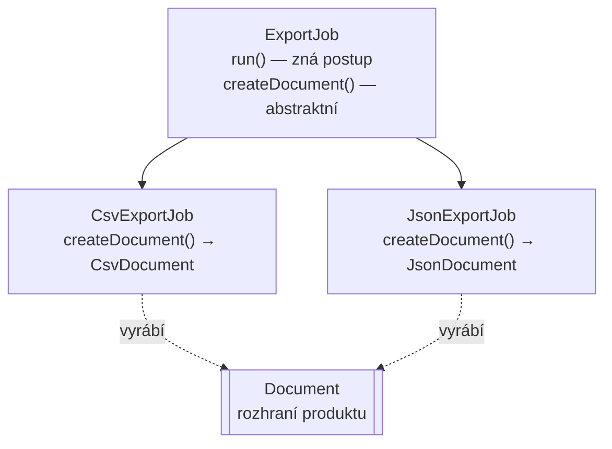

# Factory Method (Tovární metoda)

> [← zpět na Creational](../)

> **V jedné větě:** Vytvoření objektu se přesune z `new` do pojmenované metody — buď proto, aby mělo jméno a hlídalo si pravidla, nebo aby o něm mohl rozhodnout někdo jiný.

> [!NOTE]
> Pod tímhle jménem se v PHP míchají **dvě různé věci**: pojmenované konstruktory (`Money::fromCents()`), které píšeš denně, a původní GoF Factory Method, kde o vytvoření rozhoduje potomek. Sdílejí myšlenku, ne mechaniku — [srovnání je níž](#nezaměňovat-dvě-různé-věci).

---

## Problém

Objekt jde vytvořit víc způsoby, nebo jeho vytvoření něco obnáší. `new` na to nestačí.

**Poznáš to podle:**

- **konstruktor je jen jeden** a PHP nemá přetěžování — takže z `new Money(129000)` nepoznáš, jestli jsou to koruny nebo haléře
- v konstruktoru se parsuje, normalizuje a validuje, až má padesát řádků
- konstruktor má šest nepovinných parametrů, protože se z něj stalo pět různých způsobů vytvoření
- vzniká `new Order($a, $b, null, null, true, null)` a nikdo neví, co ta trojka `null` znamená
- **objekt jde vytvořit v neplatném stavu**, protože konstruktor je veřejný a validace je jinde
- základní třída zná celý postup, ale ne to, jaký objekt v něm má vzniknout

```php
// Před: jeden konstruktor pro pět různých situací
final class Money
{
    public function __construct(
        public int $amount,
        public string $currency = 'CZK',
        public bool $amountIsInCrowns = false,     // ← příznak řídící chování
        public ?string $parseFrom = null,          // ← a tohle už je zoufalství
    ) {
        // …a tady se to všechno rozplete
    }
}

new Money(129000);          // koruny? haléře? kdo ví
```

---

## Řešení

### A. Pojmenované konstruktory

Konstruktor udělej **privátní** a ven vystav statické metody, které mají jméno:

```php
final readonly class Money
{
    private function __construct(
        public int $amountInCents,
        public string $currency,
    ) {
    }

    public static function fromCents(int $amountInCents, string $currency = 'CZK'): self
    {
        return new self($amountInCents, $currency);
    }

    public static function fromCrowns(float $crowns, string $currency = 'CZK'): self
    {
        return new self((int) round($crowns * 100), $currency);
    }

    public static function fromString(string $formatted): self
    {
        // …parsování a validace…
        return self::fromCrowns((float) $normalized);
    }

    public static function zero(string $currency = 'CZK'): self
    {
        return new self(0, $currency);
    }
}
```

```
Money::fromCents(129000)         1 290,00 CZK
Money::fromCrowns(1290.00)       1 290,00 CZK
Money::fromString('1 290 Kč')    1 290,00 CZK
Money::zero()                    0,00 CZK
```

Tři věci, které z toho plynou:

| | Proč to je dobře |
| --- | --- |
| **Vytvoření má jméno** | Z volání je vidět, co se předává. `fromCents` × `fromCrowns` se nedá splést. |
| **Konstruktorů může být víc** | PHP přetěžování nemá; statické metody ho nahradí. |
| **Neplatná instance nevznikne** | Privátní konstruktor = jediná cesta dovnitř vede přes tvoje pravidla. |

A jedna zásada, která z toho dělá pattern a ne jen zvyk: **továrna parsuje a validuje, konstruktor zůstane hloupý a poslední.** Všechny továrny končí u jednoho konstruktoru, takže invariant je pořád na jednom místě.

Tohle je podoba, kterou v tomhle katalogu vidíš úplně všude — [`Order::place()`](../../../DDD/Entity/), [`EmailAddress::fromString()`](../../../DDD/ValueObject/), [`OrderId::generate()`](../../../PoEAA/Repository/).

### B. GoF Factory Method

Původní vzor je o něčem jiném: základní třída zná **celý postup**, ale ne to, co v něm má vzniknout. To doplní potomek.



```php
abstract class ExportJob
{
    final public function run(array $rows): string
    {
        $document = $this->createDocument();      // ← rozhodne potomek

        $content = $document->render($rows);
        $filename = sprintf('export-%s.%s', date('Y-m-d'), $document->extension());

        return sprintf('%s  (%d B)', $filename, strlen($content));
    }

    /** Tovární metoda. Co vznikne, ví jen potomek. */
    abstract protected function createDocument(): Document;
}
```

Volající zná jen `ExportJob` a dostane hotový výsledek — o tom, že vznikl CSV nebo JSON, neví.

### Nezaměňovat: dvě různé věci

| | **Pojmenovaný konstruktor** | **GoF Factory Method** |
| --- | --- | --- |
| Kdo rozhoduje, co vznikne | **Volající** (vybírá metodu) | **Potomek** (přepisuje metodu) |
| Kde metoda je | Statická, na vytvářené třídě | V hierarchii, na tvůrci |
| Co vrací | **Vlastní typ** (`self`) | **Rozhraní produktu** |
| Potřebuje dědičnost | Ne | **Ano** |
| Jak často v PHP | **Pořád** | Zřídka |

Obojí se běžně nazývá „factory method“ a v diskusi to nevadí. Vadí to při návrhu: **kdo rozhoduje** je úplně jiná otázka a odpověď se liší.

### Kdy GoF variantu nepotřebuješ

Tohle je poctivá část. V PHP s DI kontejnerem má injektáž skoro vždycky navrch:

```php
// GoF: dědičnost rozhoduje, co vznikne
final class CsvExportJob extends ExportJob
{
    protected function createDocument(): Document { return new CsvDocument(); }
}

// Injektáž: rozhodne kontejner, žádná hierarchie
final readonly class ExportJob
{
    public function __construct(private Document $document) {}
}
```

Druhá varianta je kratší, nemá dědičnost a `Document` jde v testu podstrčit. **Sáhni po GoF variantě, jen když potomek musí rozhodnout sám** a kontejner o té volbě nemůže vědět — typicky když si hierarchie tříd nese i jiné rozdíly než jen ten produkt.

Když potřebuješ jen vybrat implementaci podle vstupu, je to [Strategy](../../Behavioral/Strategy/) nebo prostá továrna se `match`, ne dědičnost.

---

## Účastníci

| Role | V příkladu | Odpovědnost |
| ---- | ---------- | ----------- |
| **Pojmenovaná továrna** | `Money::fromCents()` | Jediná cesta dovnitř; parsuje a validuje |
| **Privátní konstruktor** | `Money::__construct()` | Hloupý a poslední — jen přiřadí |
| **Tvůrce** (GoF) | `ExportJob` | Zná postup; produkt nechává na potomkovi |
| **Konkrétní tvůrce** | `CsvExportJob` | Rozhodne, co vznikne |
| **Produkt** | `Document` | Rozhraní toho, co se vyrábí |

---

## Implementace v PHP

Pojmenované konstruktory dodržují jedno pravidlo, které se snadno poruší — **všechny cesty vedou přes jeden konstruktor**:

```php
public static function fromString(string $formatted): self
{
    $normalized = str_replace([' ', ','], ['', '.'], trim($formatted));

    if (is_numeric($normalized) === false) {
        throw new \InvalidArgumentException(sprintf('„%s“ není částka.', $formatted));
    }

    return self::fromCrowns((float) $normalized);   // ← přes jinou továrnu, ne přes new
}
```

Kdyby každá továrna volala `new self(...)` s vlastním výpočtem, pravidlo o platnosti by se rozpadlo na čtyři místa.

### Pojmenování továren

Jména nejsou libovolná — ustálila se konvence, která se vyplatí dodržet:

| Předpona | Znamená | Příklad |
| -------- | ------- | ------- |
| `from…` | Převod z jiného tvaru | `fromString()`, `fromCents()`, `fromArray()` |
| `create…` / bez předpony | Nové vytvoření podle domény | `place()`, `register()`, `open()` |
| `reconstitute` | [Obnovení z úložiště](../../../Glossary.md#hydratace-a-dehydratace) mimo zakládací pravidla | `reconstitute()` |
| `generate` | Nová identita | `OrderId::generate()` |
| `zero` / `empty` | Prázdná či nulová hodnota | `Money::zero()`, `OrderItems::empty()` |

Doménová operace ať se jmenuje **doménově**: `Order::place()`, ne `Order::create()`. „Vytvoř objednávku“ v byznysu nikdo neříká.

### Statická továrna není totéž co statická metoda kdekoli

Pojmenované konstruktory jsou statické, ale **nejsou to statické závislosti**:

```php
// V pořádku: továrna vytváří vlastní typ, nic si nebere zvenčí
Money::fromCents(129000);

// Problém: statická metoda sahá do světa
Order::createFromRequest($_POST);           // ← globální stav
Invoice::createAndSave($order);             // ← databáze ve statické metodě
```

Pravidlo: **statická továrna smí použít jen to, co dostane v parametrech.** Jakmile potřebuje repository, čas nebo konfiguraci, patří to do nestatické továrny jako služby.

---

## Kdy použít

- ✅ Objekt jde vytvořit **víc způsoby** — z centů, z korun, z řetězce.
- ✅ Vytvoření něco **obnáší** — parsování, normalizaci, validaci.
- ✅ Chceš zaručit, že **neplatná instance nevznikne**.
- ✅ Vytvoření má v doméně **jméno** — `place()`, `register()`, `issue()`.
- ✅ *(GoF varianta)* Základní třída zná postup, ale produkt musí určit potomek.

## Kdy nepoužít

- ❌ **Konstruktor stačí.** Jedna cesta dovnitř, žádná validace — `new` je čitelnější než `Foo::create()`.
- ❌ **Továrna jen přeposílá do konstruktoru.** `Foo::create($a, $b)` s tělem `return new self($a, $b)` nepřidává nic.
- ❌ **Chceš vybrat implementaci podle vstupu.** To je [Strategy](../../Behavioral/Strategy/), nebo prostá továrna se `match` — ne dědičnost.
- ❌ **DI kontejner to udělá za tebe.** *(GoF varianta)* Injektáž produktu je kratší a testovatelnější.
- ❌ **Sestavení je opravdu složité, s mnoha volitelnými částmi.** Na to je [Builder](../Builder/).

---

## Časté chyby

| Chyba | Proč vadí | Jak správně |
| ----- | --------- | ----------- |
| Konstruktor zůstane veřejný | Existuje cesta, jak validaci obejít — a někdo ji najde | `private function __construct()` |
| Každá továrna volá `new self()` s vlastní logikou | Pravidlo o platnosti se rozpadne na několik míst | Továrny volají jedna druhou, konstruktor je jeden |
| Validace v konstruktoru, parsování taky | Konstruktor má padesát řádků a dělá tři věci | Parsuj v továrně, konstruktor jen přiřadí |
| Statická továrna sahá do databáze nebo do `$_POST` | Skrytá závislost, nejde testovat, nejde nahradit | Jen parametry; jinak nestatická služba |
| `create()` u doménové operace | Ztratí se doménový jazyk | `place()`, `register()`, `issue()` |
| Továrna vrací `static` místo `self` u `final` třídy | Zbytečná volnost, která nic nepřináší | U `final` tříd `self` |
| GoF varianta tam, kde stačí injektáž | Hierarchie tříd navíc, hůř se testuje | Injektuj produkt |

---

## V praxi

- **Value objecty a entity v tomhle katalogu** — `Money::fromCents()`, `EmailAddress::fromString()`, `Order::place()`, `OrderId::generate()`. Všechny jsou pojmenované konstruktory.
- **`DateTimeImmutable::createFromFormat()`** — pojmenovaný konstruktor zabudovaný do PHP.
- **PHP enumy** — `OrderStatus::from()` a `tryFrom()` jsou továrny přímo v jazyce.
- **Doctrine** — [rekonstrukce entity](../../../Glossary.md#hydratace-a-dehydratace) konstruktor obchází úplně; proto potřebuješ `reconstitute()` jen u ručního mapování.
- **Symfony DI** — `factory:` v konfiguraci pokryje případy, kdy služba nevzniká přes `new`.

---

## Související patterny

| Pattern | Vztah |
| ------- | ----- |
| [Value Object](../../../DDD/ValueObject/) | Pojmenovaný konstruktor je jeho standardní výbava — bez něj nejde zaručit, že neplatná hodnota nevznikne. |
| [Entity](../../../DDD/Entity/) | Dvojice `place()` a `reconstitute()`: zakládání s pravidly, obnovení bez nich. |
| [Builder](../Builder/) | Když je sestavení složité, má mnoho volitelných částí nebo probíhá **postupně**, továrna nestačí — ta vyrobí objekt jedním voláním. |
| **Abstract Factory** (GoF) | O úroveň výš: vyrábí **rodiny** souvisejících objektů, ne jeden. |
| [Singleton](../Singleton/) | Sdílí mechaniku (privátní konstruktor, statická metoda), ale ne záměr: továrna vytváří **nové** instance, singleton vrací **pořád tutéž**. |
| [Strategy](../../Behavioral/Strategy/) | Když jde o výběr implementace podle vstupu, ne o způsob vytvoření. |
| [Repository](../../../PoEAA/Repository/) | `nextIdentity()` je továrna na identitu — a proto může agregát vzniknout platný ještě před uložením. |
| **Template Method** (GoF) | GoF Factory Method je jeho speciální případ: kostra v předkovi, jeden krok v potomkovi. |

---

## Vztah k principům

| Princip | Jak souvisí |
| ------- | ----------- |
| [Fail Fast](../../../Principles/ObjectDesign.md#fail-fast) | Privátní konstruktor plus validace v továrně znamená, že neplatná instance nevznikne vůbec. |
| [OCP](../../../Principles/SOLID.md#openclosed-principle-ocp) | *(GoF varianta)* Nový produkt = nový potomek; kostra se nemění. |
| [Zviditelni implicitní](../../../Principles/ObjectDesign.md#zviditelni-implicitní) | `new Money(129000)` neříká nic; `Money::fromCents(129000)` říká všechno. |
| [DRY](../../../Principles/Simplicity.md#dry--dont-repeat-yourself) | Všechny cesty dovnitř vedou přes jeden konstruktor, takže pravidlo o platnosti má jedno místo. |

---

## Demo

```bash
php GoF/Creational/FactoryMethod/demo/run.php
```

Část **A** ukazuje čtyři pojmenované konstruktory `Money`, které všechny končí u jednoho privátního — a co udělá neplatný vstup. Část **B** staví GoF variantu: `ExportJob` zná celý postup exportu a jen neví, jaký dokument vznikne. Na konci je tabulka rozdílů a srovnání s injektáží, která tu dědičnost ve většině případů nahradí.

---

## Původ

|               |                                                   |
| ------------- | ------------------------------------------------- |
| **Zdroj**     | *Design Patterns: Elements of Reusable Object-Oriented Software* |
| **Autoři**    | Gamma, Helm, Johnson, Vlissides („Gang of Four“)   |
| **Rok**       | 1994                                              |
| **Kategorie** | Creational                                        |
| **Obtížnost** | ●○○○○                                             |

GoF popsali Factory Method jako řešení situace, kdy framework zná postup, ale ne konkrétní třídy. Jejich příklad je editor dokumentů: `Application::newDocument()` umí dokument vytvořit, otevřít a zaregistrovat — a jen neví, jestli to bude text, nebo tabulka. To doplní podtřída.

V roce 1994 to bylo hlavní dostupné řešení. Jazyky neměly ani rozhraní jako první třídu, ani DI kontejnery, takže **dědičnost byla jediný způsob, jak nechat rozhodnutí na někom jiném**. Dnes to udělá injektáž lépe — a proto se původní varianta v PHP potkává zřídka.

Zato **pojmenované konstruktory zažily opačný osud**. V knize je najdeš spíš na okraji, v poznámkách o statických tovární metodách, ale v praxi se staly jednou z nejpoužívanějších technik vůbec — hlavně proto, že PHP nemá přetěžování konstruktorů a bez nich by nešlo napsat pořádný [value object](../../../DDD/ValueObject/).

Za rozšíření té druhé podoby může spíš **Joshua Bloch** (*Effective Java*, 2001) a jeho argument, že statická tovární metoda má oproti konstruktoru jméno, nemusí pokaždé vytvářet novou instanci a může vrátit podtyp. Ten první důvod je pořád ten nejlepší.

---

## Zdroje

- Gamma, Helm, Johnson, Vlissides: *Design Patterns*, Addison-Wesley, 1994 — kapitola 3, str. 107
- Joshua Bloch: *Effective Java*, Addison-Wesley, 2001 — statické tovární metody
- [PHP: Enumerations — `from()` a `tryFrom()`](https://www.php.net/manual/en/backedenum.from.php)

---

<details>
<summary>Metadata patternu</summary>

```yaml
name: FactoryMethod
name_cs: Tovární metoda
category: Creational
source: GoF – Design Patterns
authors: Gamma, Helm, Johnson, Vlissides
year: 1994
difficulty: 1
tags: [vytváření objektů, pojmenovaný konstruktor, validace, platnost od vzniku]
principles: [FailFast, OCP, MakeImplicitExplicit, DRY]
related: [ValueObject, Entity, Builder, AbstractFactory, Strategy, Repository, TemplateMethod]
status: done
```

</details>
