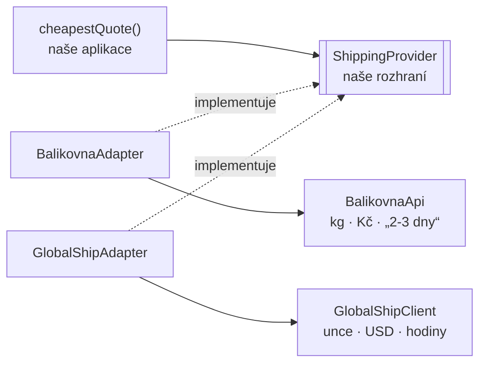

# Adapter (Adaptér)

> [← zpět na Structural](../)

> **V jedné větě:** Obal, který přeloží rozhraní cizí třídy na to, které očekává tvůj kód — takže se dá použít něco, co se použít nedalo.

---

## Problém

Potřebuješ knihovnu, službu nebo starý kus systému, který dělá to, co chceš, ale **mluví úplně jinak**. Jiné názvy metod, jiné jednotky, jiné návratové typy — a změnit ho nemůžeš.

**Poznáš to podle:**

- v aplikaci se objeví `if ($provider === 'balikovna')` a pod ním převod jednotek
- kilogramy, unce a gramy se přepočítávají na pěti různých místech
- **nejde napsat, co se má stát**, protože každá knihovna vrací něco jiného
- doménový kód ví, že „ten druhý dopravce počítá v dolarech“
- výměna dodavatele je projekt, i když dělá totéž
- dvě knihovny nejde porovnat, protože vracejí nesrovnatelné věci

```php
// Před: cizí tvary prosákly do aplikace
if ($carrier === 'balikovna') {
    $r = $this->balikovna->spocitejCenu($country, $grams / 1000);
    $price = (int) round($r['cena'] * 100);
    $days = 3;                                   // z „2-3 dny“, prostě natvrdo
} else {
    $r = $this->globalShip->getRate((int) ceil($grams / 28.3495), $country);
    $price = (int) round($r->amountUsdCents * 23.5);
    $days = (int) ceil($r->transitHours / 24);
}
```

Ten `if` poroste s každým dopravcem a přepočty se rozlezou všude.

---

## Řešení

Definuj si **vlastní rozhraní podle toho, co potřebuješ** — a ke každé cizí knihovně napiš třídu, která ho naplní.



Podstatné je, **odkud se to rozhraní vzalo**: z toho, co potřebuje naše aplikace — ne z toho, co náhodou nabízí první knihovna, na kterou jsme narazili. Kontrakt vlastníme my, dodavatelé se přizpůsobí.

```php
final readonly class BalikovnaAdapter implements ShippingProvider
{
    public function __construct(
        private BalikovnaApi $api,      // ← cizí objekt uvnitř
    ) {
    }

    public function quote(string $countryCode, int $weightInGrams, int $orderValueInCents): ShippingQuote
    {
        $response = $this->api->spocitejCenu($countryCode, $weightInGrams / 1000);

        return new ShippingQuote(
            carrier: $response['sluzba'],
            priceInCents: (int) round($response['cena'] * 100),
            deliveryDays: $this->parseDays($response['lhuta']),
        );
    }
}
```

Za adaptérem jsou obě knihovny **zaměnitelné** — a teprve díky tomu jde napsat něco, co bez nich napsat nešlo:

```
zásilka 6,2 kg do CZ, hodnota 3 200 Kč:
    → Balíkovna         84,00 Kč  3 dní
      GlobalShip       248,40 Kč  4 dní
```

### Objektový, ne třídní

GoF popsali dvě varianty. V PHP se prakticky používá jen jedna:

| | **Objektový adaptér** | Třídní adaptér |
| --- | --- | --- |
| Jak | Cizí objekt **drží uvnitř** | **Dědí** z cizí třídy |
| Funguje s `final` třídami | **Ano** | Ne |
| Umí adaptovat víc objektů | Ano | Jen jeden |
| Vidí `protected` vnitřek | Ne — a to je dobře | Ano |
| V PHP | **Vždycky tenhle** | Prakticky nikdy |

Dědit z cizí třídy znamená svázat se s jejím vnitřkem — a u `final` tříd to ani nejde. Objektová varianta je jednodušší i bezpečnější.

### Překlad je taky rozhodnutí

Adaptér „jen překládá“, ale ten překlad **není mechanický**. Cizí systém často vrací něco, co v našem světě nemá přesný protějšek:

| Cizí tvar | Rozhodnutí adaptéru |
| --------- | ------------------- |
| `„2-3 dny“` | Bereme **horní** odhad → 3. Ať zákazníka nezklameme. |
| `96 hodin` | Zaokrouhlíme **nahoru** → 4 dny |
| `USD centy` | Přepočet kurzem, o kterém doména neví |
| `6200 g → unce` | `ceil`, ať neplatíme míň, než dopravce chce |

Tahle rozhodnutí patří **do adaptéru**, protože vyplývají z cizího systému. Kdyby prosákla ven, začala by doména vědět, že někdo měří v uncích.

Zároveň je to hranice: **rozhodnutí o převodu ano, rozhodnutí o byznysu ne.** „Zaokrouhli nahoru“ je převod. „Nad 5 000 Kč posíláme expres“ je pravidlo, a to patří jinam.

---

## Účastníci

| Role | V příkladu | Odpovědnost |
| ---- | ---------- | ----------- |
| **Cílové rozhraní** | `ShippingProvider` | Kontrakt, který si definuje **naše** aplikace |
| **Adaptér** | `BalikovnaAdapter`, `GlobalShipAdapter` | Překlad cizího tvaru na náš |
| **Adaptovaný** | `BalikovnaApi`, `GlobalShipClient` | Cizí kód, který nezměníme |
| **Klient** | `cheapestQuote()` | Zná jen cílové rozhraní |

---

## Implementace v PHP

Druhý adaptér ukazuje, že se překlady můžou lišit jak chtějí — kontrakt zůstává:

```php
final readonly class GlobalShipAdapter implements ShippingProvider
{
    private const float GRAMS_PER_OUNCE = 28.3495;

    public function __construct(
        private GlobalShipClient $client,
        private int $usdToCzkRateInHundredths,   // závislost adaptéru, ne domény
    ) {
    }

    public function quote(string $countryCode, int $weightInGrams, int $orderValueInCents): ShippingQuote
    {
        $response = $this->client->getRate(
            ounces: (int) ceil($weightInGrams / self::GRAMS_PER_OUNCE),
            destination: $countryCode,
            express: $orderValueInCents > 500000,
        );

        return new ShippingQuote(
            carrier: $response->serviceName,
            priceInCents: (int) round($response->amountUsdCents * $this->usdToCzkRateInHundredths / 100),
            deliveryDays: (int) ceil($response->transitHours / 24),
        );
    }
}
```

Všimni si **kurzu v konstruktoru**. Doména ho nezná a nemá ho znát — je to detail integrace, ne doménové pravidlo. Adaptér smí mít závislosti, které doména nemá.

### Rozhraní ať vznikne z potřeby, ne z knihovny

Nejčastější způsob, jak tenhle pattern minout: napsat rozhraní podle toho, co umí první knihovna. Pak druhý adaptér nepasuje a začne se ohýbat.

```php
// Špatně — rozhraní je opsané z první knihovny
interface ShippingProvider
{
    public function spocitejCenu(string $zeme, float $kilogramy): array;
}

// Správně — rozhraní je z toho, co potřebuje naše aplikace
interface ShippingProvider
{
    public function quote(string $countryCode, int $weightInGrams, int $orderValueInCents): ShippingQuote;
}
```

Test: **zvládl bys to rozhraní napsat dřív, než sis vybral dodavatele?** Když ne, opisuješ.

---

## Kdy použít

- ✅ Cizí knihovna dělá, co potřebuješ, ale **mluví jinak**.
- ✅ Máš **víc dodavatelů téhož** a chceš je porovnávat nebo přepínat.
- ✅ Chceš cizí kód **vyměnit** bez zásahu do aplikace.
- ✅ Potřebuješ v testech cizí službu nahradit — adaptér je místo, kde se to dá.
- ✅ Cizí knihovna se **mění častěji** než tvoje aplikace.

## Kdy nepoužít

- ❌ **Rozhraní už sedí.** Když knihovna mluví tvým jazykem, obal nic nepřidá.
- ❌ **Jeden dodavatel a nikdy jiný nebude.** Vrstva navíc bez užitku — a ověř si to, tahle věta bývá optimistická.
- ❌ **Potřebuješ chránit doménu před cizím modelem, ne jen rozhraní.** To je [antikorupční vrstva](../../../DDD/AnticorruptionLayer/), o patro výš.
- ❌ **Rozhraní jsi opsal z knihovny.** Pak to není adaptér, jen přejmenování.
- ❌ **Chceš přidat chování, ne změnit rozhraní.** To je [Decorator](../Decorator/).

---

## Časté chyby

| Chyba | Proč vadí | Jak správně |
| ----- | --------- | ----------- |
| **Rozhraní opsané z první knihovny** | Druhý adaptér nepasuje; cizí tvar se stal tvým | Rozhraní z potřeb aplikace, ne z knihovny |
| Adaptér vrací cizí typ | Cizí model prosákl, jen o jednu vrstvu dál | Ven jde **tvůj** typ |
| Adaptér obsahuje byznysové pravidlo | Pravidlo je v integraci; druhá cesta ho obejde | Adaptér **převádí**, nerozhoduje o doméně |
| Adaptér drží stav mezi voláními | Sdílená instance se chová nepředvídatelně | Bezstavový |
| Jeden adaptér pro dvě knihovny s `if` | Vrátil ses k tomu, co jsi chtěl odstranit | Adaptér na dodavatele |
| Cizí výjimky prochází ven | Aplikace chytá `GuzzleException` a ví o Guzzlu | Přelož i chyby na svoje |
| Adaptér přidává metody nad rámec rozhraní | Klient je začne používat a přestane být zaměnitelný | Jen to, co je v kontraktu |

---

## V praxi

- **PSR rozhraní** (`PSR-3` log, `PSR-6`/`PSR-16` cache, `PSR-18` HTTP) — celý ekosystém adaptérů. `Monolog` je adaptér mezi tvým kódem a desítkami cílů.
- **Symfony Mailer / Notifier** — jedno rozhraní, adaptéry pro poskytovatele. Výměna je změna DSN.
- **Doctrine DBAL** — adaptér nad ovladači databází.
- **Testy** — nejlevnější důvod: adaptér je jediné místo, které je potřeba nahradit fake implementací.
- **Flysystem** — jeden z nejčistších adaptérů v PHP: lokální disk, S3 i FTP za jedním rozhraním.

---

## Související patterny

| Pattern | Vztah |
| ------- | ----- |
| [Decorator](../Decorator/) | Také obaluje, ale **zachovává rozhraní** a přidává chování. Adaptér rozhraní **mění** a chování nechává být. |
| [Anticorruption Layer](../../../DDD/AnticorruptionLayer/) (DDD) | **O patro výš.** Adaptér překládá *rozhraní* jednoho objektu; antikorupční vrstva brání celý *model* — a bývá z adaptérů složená. |
| [Ports & Adapters](../../../Architecture/PortsAndAdapters/) | Sdílejí jméno, ne měřítko. Tam je „adaptér“ **architektonická role** na hranici aplikace; tady jeden objekt. Ten hexagonální bývá tímhle implementovaný. |
| [Strategy](../../Behavioral/Strategy/) | Za adaptéry se dodavatelé stanou zaměnitelnými — a tím i strategiemi. |
| **Facade** (GoF) | Také zjednodušuje cizí kód, ale **z vlastní vůle** a bez daného kontraktu. Adaptér plní rozhraní, které už existuje. |
| **Proxy** (GoF) | Zachovává rozhraní a řídí přístup. Adaptér rozhraní mění. |

---

## Vztah k principům

| Princip | Jak souvisí |
| ------- | ----------- |
| [DIP](../../../Principles/SOLID.md#dependency-inversion-principle-dip) | **Jádro věci.** Rozhraní vlastní tvoje aplikace; cizí knihovny se mu přizpůsobují, ne naopak. |
| [OCP](../../../Principles/SOLID.md#openclosed-principle-ocp) | Nový dodavatel = nový adaptér. Aplikace se nemění — demo to počítá. |
| [Nízká provázanost](../../../Principles/CohesionAndCoupling.md) | Aplikace nezávisí na cizím tvaru; závislost končí v jedné třídě. |
| [ISP](../../../Principles/SOLID.md#interface-segregation-principle-isp) | Cílové rozhraní obsahuje jen to, co aplikace potřebuje — ne celou schopnost knihovny. |

---

## Demo

```bash
php GoF/Structural/Adapter/demo/run.php
```

Postaví dvě cizí knihovny, které spolu nemají nic společného — jedna počítá v kilogramech a korunách a lhůtu vrací jako `„2-3 dny“`, druhá v uncích, dolarech a hodinách. Za adaptéry se stanou **porovnatelnými** a aplikace z nich vybere levnějšího dopravce, aniž by o kterékoli z nich věděla. Nakonec rozepíše, která rozhodnutí při překladu adaptér dělá a proč patří právě jemu.

---

## Původ

|               |                                                   |
| ------------- | ------------------------------------------------- |
| **Zdroj**     | *Design Patterns: Elements of Reusable Object-Oriented Software* |
| **Autoři**    | Gamma, Helm, Johnson, Vlissides („Gang of Four“)   |
| **Rok**       | 1994                                              |
| **Kategorie** | Structural                                        |
| **Obtížnost** | ●○○○○                                             |

GoF ho popsali na grafickém editoru, který umí kreslit tvary a potřebuje do sebe zapojit hotovou knihovnu na sazbu textu. Ta knihovna má úplně jiné rozhraní a přepsat ji nemá smysl — tak se kolem ní napíše obal.

Je to jeden z **nejjednodušších a nejpoužívanějších vzorů z celé knihy**, a taky jeden z mála, které nezastaraly ani o kousek. Důvod je prostý: dokud existuje cizí kód, který nejde změnit, bude potřeba ho obalit.

Autoři zmiňují dvě varianty — objektovou a třídní (dědičnost). V roce 1994 se v C++ používaly obě; dnes prakticky výhradně objektová, protože dědit z cizí třídy znamená svázat se s jejím vnitřkem, a u `final` tříd to ani nejde.

Za pozornost stojí, jak se to slovo v oboru rozrostlo. **„Adaptér“ dnes označuje tři různě velké věci**: tenhle jeden objekt, [řízený adaptér](../../../Architecture/PortsAndAdapters/#dvě-strany-na-jednu-se-zapomíná) v hexagonální architektuře a celou [antikorupční vrstvu](../../../DDD/AnticorruptionLayer/). Princip je stejný, měřítko se liší o řády — a v diskusi se vyplatí si ujasnit, o kterém se mluví.

---

## Zdroje

- Gamma, Helm, Johnson, Vlissides: *Design Patterns*, Addison-Wesley, 1994 — kapitola 4, str. 139
- [PSR-18: HTTP Client](https://www.php-fig.org/psr/psr-18/)
- [Flysystem](https://flysystem.thephpleague.com/) — adaptéry nad úložišti

---

<details>
<summary>Metadata patternu</summary>

```yaml
name: Adapter
name_cs: Adaptér
category: Structural
source: GoF – Design Patterns
authors: Gamma, Helm, Johnson, Vlissides
year: 1994
difficulty: 1
tags: [kompozice, překlad rozhraní, integrace, cizí knihovna, zaměnitelnost]
principles: [DIP, OCP, ISP, CohesionAndCoupling]
related: [Decorator, AnticorruptionLayer, PortsAndAdapters, Strategy, Facade, Proxy]
status: done
```

</details>
