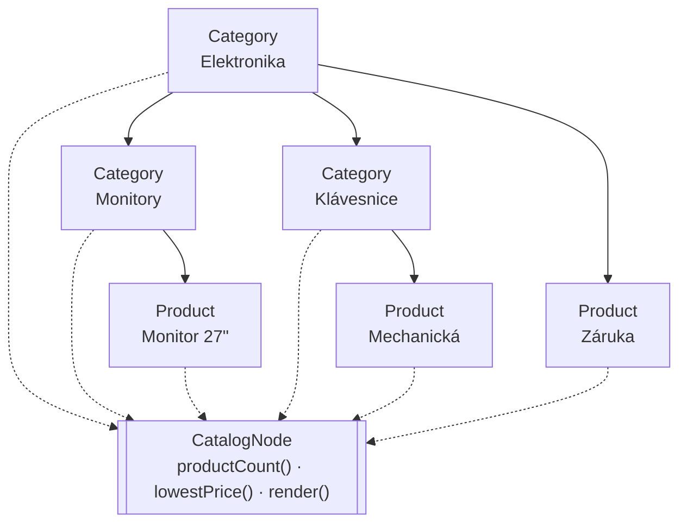

# Composite (Kompozit)

> [← zpět na Structural](../)

> **V jedné větě:** Strom objektů, ve kterém se s jedním listem zachází stejně jako s celou větví — takže volající nemusí vědět, co drží.

---

## Problém

Máš strukturu, která se **větví do sebe samé**: kategorie obsahují podkategorie, ty další podkategorie a někde dole jsou produkty. A potřebuješ se ptát na věci, které se týkají celku — kolik je tam produktů, jaká je nejnižší cena.

**Poznáš to podle:**

- v kódu je `if ($node instanceof Category) { … } else { … }` — a ta podmínka se opakuje u každé operace
- rekurze je napsaná ručně u každého dotazu zvlášť, pokaždé trochu jinak
- **hloubka stromu je zadrátovaná** („kategorie mají maximálně tři úrovně“)
- přidání čtvrté úrovně znamená zásah do každé metody
- list a uzel mají odlišná rozhraní, takže je nejde předat téže funkci

```php
// Před: volající musí vědět, s čím pracuje
function countProducts(object $node): int
{
    if ($node instanceof Product) {
        return 1;
    }

    if ($node instanceof Category) {
        $total = 0;

        foreach ($node->getSubcategories() as $sub) {
            $total += countProducts($sub);        // …a totéž znovu u ceny,
        }                                         //   u dostupnosti, u výpisu

        foreach ($node->getProducts() as $product) {
            $total += 1;
        }

        return $total;
    }

    throw new InvalidArgumentException('Neznámý typ uzlu.');
}
```

Dvě různé kolekce, dvě smyčky, `instanceof` a výjimka pro případ, na který nikdo nemyslel. A tohle celé se zopakuje u každé další operace.

---

## Řešení

Dej listu i uzlu **totéž rozhraní**. Uzel pak drží potomky toho rozhraní — tedy i další uzly.



```php
interface CatalogNode
{
    public function name(): string;
    public function productCount(): int;
    public function lowestPriceInCents(): ?int;
}
```

A pak už jen dvě implementace, obě triviální:

```php
// LIST
final readonly class Product implements CatalogNode
{
    public function productCount(): int
    {
        return 1;
    }
}

// UZEL — drží CatalogNode, ne Product
final class Category implements CatalogNode
{
    /** @var list<CatalogNode> */
    private array $children = [];

    public function productCount(): int
    {
        return array_sum(array_map(
            static fn (CatalogNode $child): int => $child->productCount(),
            $this->children,
        ));
    }
}
```

**Kategorie se neptá, jestli je potomek list nebo uzel** — zeptá se ho na totéž, co by se zeptal kdokoli jiný. Rekurze vznikne sama a `instanceof` nikde není.

Volající pak může napsat funkci, která bere `CatalogNode`, a bude fungovat na obojím:

```
Myš                     produktů: 1, nejlevnější: 450 Kč
Monitory                produktů: 3, nejlevnější: 4 490 Kč
Elektronika             produktů: 8, nejlevnější: 190 Kč
```

### Hloubka nikoho nezajímá

Protože uzel drží rozhraní a ne konkrétní typ, může se strom větvit libovolně. Demo má tři úrovně; kdyby jich bylo osm, **žádná třída se nezmění** — přibudou jen instance.

To je rozdíl proti ručně psané rekurzi, kde je hloubka obvykle nějak zadrátovaná (dvě vnořené smyčky, tři joiny v SQL).

### Kdy to Composite je a kdy ne

Rozlišení, které se plete — a v tomhle katalogu je na to hezký příklad z obou stran:

| | Composite? | Proč |
| --- | --- | --- |
| [`AndSpecification`](../../../DDD/Specification/) drží dvě specifikace a **sama je specifikací** | **Ano** | Uzel obsahuje **tentýž typ**, jakým sám je |
| [Objednávka](../../../DDD/Aggregate/) drží položky | **Ne** | Položka není objednávka; strom se nevětví do sebe |
| Kategorie drží podkategorie i produkty | **Ano** | Obojí je `CatalogNode` |
| Kolekce produktů | **Ne** | Plochý seznam, žádná rekurze |

> **Rozdíl je v rekurzi: Composite znamená, že uzel obsahuje tentýž typ, jakým sám je.** Bez toho je to obyčejná kolekce — a [First Class Collection](../../../ObjectCalisthenics/FirstClassCollection/) je na to lepší nástroj.

### Kompromis, který GoF přiznali

Do rozhraní patří i operace, které dávají smysl **jen uzlu** — přidat potomka, odebrat potomka. A tady je vidlička:

| | **Bezpečnost** | **Průhlednost** |
| --- | --- | --- |
| Kde je `add()` | Jen na uzlu | V rozhraní, i na listu |
| List na `add()` | Metodu nemá | Vyhodí výjimku |
| Klient | Musí občas znát typ | Nemusí nikdy |
| Kdy volit | Strom se staví na jednom místě | Strom se staví z různých míst |

GoF sami psali, že tady se **volí mezi dvěma nepříjemnostmi**. Demo volí bezpečnost: `add()` je jen na `Category` a klient ho volá při stavbě stromu, kde typ zná. Dotazy jsou pak na společném rozhraní a tam už typ znát nemusí.

Praktické doporučení: **stavba stromu a práce se stromem jsou dvě různé věci.** Při stavbě typ znáš, takže bezpečná varianta neškodí; při práci s ním ho znát nemusíš, a tam pattern skutečně pomáhá.

---

## Účastníci

| Role | V příkladu | Odpovědnost |
| ---- | ---------- | ----------- |
| **Komponenta** | `CatalogNode` | Rozhraní společné listu i uzlu |
| **List** | `Product` | Nemá potomky; odpovídá triviálně |
| **Kompozit** | `Category` | Drží potomky **téhož rozhraní**, deleguje na ně |
| **Klient** | `summarize()` | Pracuje s rozhraním; typ nezná |

---

## Implementace v PHP

Uzel deleguje a sčítá:

```php
public function lowestPriceInCents(): ?int
{
    $prices = array_filter(array_map(
        static fn (CatalogNode $child): ?int => $child->lowestPriceInCents(),
        $this->children,
    ), static fn (?int $price): bool => $price !== null);

    return $prices === [] ? null : min($prices);
}
```

Všimni si, že i **null se řeší jednotně**: nedostupný produkt vrátí `null`, prázdná kategorie taky. Klient dostane `?int` a nemusí rozlišovat, proč nic nedostal.

### Fluent stavba stromu

`add()` vracející `$this` udělá ze stavby stromu čitelný zápis:

```php
$catalog = (new Category('Elektronika'))
    ->add(
        (new Category('Monitory'))
            ->add(new Product('Monitor 24"', 449000))
            ->add(new Product('Monitor 27"', 799000)),
    )
    ->add(new Product('Prodloužená záruka', 99000));
```

Struktura kódu odpovídá struktuře dat, což je při stavbě stromů vzácně příjemné.

### Pozor na výkon

Composite skrývá rekurzi — a s ní i její cenu:

| Past | Co s tím |
| ---- | -------- |
| `productCount()` prochází celý strom **při každém volání** | Zapamatuj si výsledek, nebo ho drž v uzlu a aktualizuj při změně |
| Strom se skládá z databáze uzel po uzlu → [N+1](../../../Glossary.md#n1) | Načti všechno jedním dotazem a strom postav v paměti |
| Velmi hluboký strom | Rekurze může narazit na limit zásobníku; u tisíců úrovní řeš iterativně |

U kategorií e-shopu (desítky uzlů) nic z toho nevadí. U stromu s milionem uzlů vadí všechno.

---

## Kdy použít

- ✅ Data mají **stromovou strukturu**, která se větví do sebe — kategorie, menu, organizační struktura, souborový systém.
- ✅ Chceš se ptát na **celek stejně jako na část**.
- ✅ Hloubka není pevně daná a může se měnit.
- ✅ Opakuje se ti `instanceof` při procházení struktury.
- ✅ Skládáš pravidla nebo výrazy, kde složenina je zase pravidlem.

## Kdy nepoužít

- ❌ **Struktura není rekurzivní.** Objednávka a její položky nejsou strom — položka neobsahuje objednávku. Na to je [First Class Collection](../../../ObjectCalisthenics/FirstClassCollection/).
- ❌ **List a uzel dělají opravdu jiné věci.** Když je společné rozhraní vynucené a polovina metod na listu nedává smysl, pattern škodí.
- ❌ **Hloubka je pevně dvě úrovně a nikdy nebude jinak.** Dvě třídy a jedna smyčka jsou čitelnější.
- ❌ **Strom je obrovský a operace nad ním časté.** Rekurze skrytá za rozhraním se pak stane výkonnostním problémem, který není vidět.

---

## Časté chyby

| Chyba | Proč vadí | Jak správně |
| ----- | --------- | ----------- |
| Uzel drží konkrétní typ místo rozhraní | Strom se nemůže větvit; vnořená kategorie nepasuje | `list<CatalogNode>`, ne `list<Product>` |
| `instanceof` zůstane ve volajícím kódu | Nezískal jsi nic, jen přidal rozhraní | Vše, co se liší, patří do metod na rozhraní |
| Uzel a list mají odlišné rozhraní | Klient je musí rozlišovat a pattern nefunguje | Jedno rozhraní pro obojí |
| Rekurze bez memoizace u drahých operací | Každé volání projde celý strom znovu | Zapamatuj si výsledek |
| Strom se skládá dotazem na uzel | [N+1](../../../Glossary.md#n1) při každém načtení | Jeden dotaz, strom v paměti |
| Do rozhraní se přidá `getParent()` | Vzniknou cykly a `null` u kořene, které nikdo neřeší | Odkaz nahoru přidej, jen když ho opravdu potřebuješ |
| Composite tam, kde není rekurze | Zbytečná abstrakce nad plochým seznamem | Kolekce |

---

## V praxi

- **Symfony Form** — formulář obsahuje pole i další formuláře a chová se stejně. Učebnicový Composite v PHP.
- **Symfony Validator** — `Collection` a `All` obalují další constrainty a samy constraintem jsou.
- **DOM** — `DOMNode` je Composite zabudovaný do jazyka; `DOMElement` i `DOMText` odpovídají na totéž.
- **`RecursiveIteratorIterator`** — PHP má na procházení stromů vlastní nástroj, který Composite předpokládá.
- **Kategorie a menu v e-shopu** — nejčastější doménový výskyt vůbec.

---

## Související patterny

| Pattern | Vztah |
| ------- | ----- |
| [Specification](../../../DDD/Specification/) | `AndSpecification` a `OrSpecification` **jsou** Composite — složenina je zase specifikací. Tam je pattern vidět v praxi. |
| [Decorator](../Decorator/) | Také obaluje se stejným rozhraním, ale **právě jeden** objekt a kvůli přidání chování. Composite jich obaluje víc a kvůli struktuře. |
| [First Class Collection](../../../ObjectCalisthenics/FirstClassCollection/) | Co použít, když **struktura není rekurzivní**. Plochý seznam Composite nepotřebuje. |
| [Chain of Responsibility](../../Behavioral/ChainOfResponsibility/) | Články řetězu bývají uspořádané do stromu právě přes Composite. |
| [Iterator](../../Behavioral/Iterator/) (GoF) | Přirozený doplněk: jak strom projít, aniž bys znal jeho tvar. `yield from` je na to v PHP nejjednodušší nástroj. |
| **Visitor** (GoF) | Jak nad stromem přidat operaci, aniž bys sahal do uzlů. |
| [Aggregate](../../../DDD/Aggregate/) | **Nezaměňovat.** Agregát drží části, ale ne rekurzivně — a hlavně jde o hranici konzistence, ne o strukturu. |
| [Command](../../Behavioral/Command/) (GoF) | `MacroCommand` je Composite doslova: skupina příkazů se chová jako jeden. Vrácení ale běží v opačném pořadí. |

---

## Vztah k principům

| Princip | Jak souvisí |
| ------- | ----------- |
| [OCP](../../../Principles/SOLID.md#openclosed-principle-ocp) | Nový typ uzlu = nová třída. Volající kód ani ostatní uzly se nemění. |
| [LSP](../../../Principles/SOLID.md#liskov-substitution-principle-lsp) | **Celý pattern na něm stojí:** list musí být plnohodnotnou náhradou uzlu. Jakmile jeden z nich vyhodí výjimku tam, kde druhý funguje, klient začne rozlišovat typy. |
| [Tell, Don't Ask](../../../Principles/ObjectDesign.md#tell-dont-ask) | Neptáš se uzlu, co je zač — zeptáš se ho na výsledek a on si poradí. |
| [Kompozice před dědičností](../../../Principles/ObjectDesign.md#kompozice-před-dědičností) | Struktura vzniká skládáním objektů za běhu, ne hierarchií tříd. |

---

## Demo

```bash
php GoF/Structural/Composite/demo/run.php
```

Postaví katalog e-shopu o třech úrovních a pustí **tutéž funkci na produkt, na kategorii i na kořen stromu** — bez jediného `instanceof`. Ukáže, že rekurze vznikne sama ze dvou triviálních implementací, spočítá uzly a hloubku, a nakonec vymezí, kdy Composite je a kdy není: `AndSpecification` ano, objednávka s položkami ne.

---

## Původ

|               |                                                   |
| ------------- | ------------------------------------------------- |
| **Zdroj**     | *Design Patterns: Elements of Reusable Object-Oriented Software* |
| **Autoři**    | Gamma, Helm, Johnson, Vlissides („Gang of Four“)   |
| **Rok**       | 1994                                              |
| **Kategorie** | Structural                                        |
| **Obtížnost** | ●●○○○                                             |

Autoři vzor demonstrují na grafickém editoru: uživatel nakreslí několik tvarů, seskupí je, skupinu seskupí s další skupinou — a program pak musí umět „posuň to“ nebo „spočítej ohraničení“ bez ohledu na to, jestli má v ruce jednu čáru nebo skupinu skupin.

Jádro jejich argumentu bylo, že **`instanceof` v klientském kódu je příznak chybějící abstrakce**. Když se program musí ptát „je tohle skupina?“, znamená to, že skupina a tvar nemají společné rozhraní, které by měly mít.

Composite je zároveň jeden z mála vzorů, u kterých GoF **otevřeně přiznali nevyřešený kompromis** — jestli operace pro práci s potomky (`add`, `remove`) dát do společného rozhraní. Průhlednost, nebo bezpečnost; obojí naráz nejde. Ten spor se dodnes neuzavřel a v praxi se řeší podle toho, kdo strom staví.

---

## Zdroje

- Gamma, Helm, Johnson, Vlissides: *Design Patterns*, Addison-Wesley, 1994 — kapitola 4, str. 163
- [Symfony Form: Composite](https://symfony.com/doc/current/forms.html)
- [PHP: RecursiveIteratorIterator](https://www.php.net/manual/en/class.recursiveiteratoriterator.php)

---

<details>
<summary>Metadata patternu</summary>

```yaml
name: Composite
name_cs: Kompozit
category: Structural
source: GoF – Design Patterns
authors: Gamma, Helm, Johnson, Vlissides
year: 1994
difficulty: 2
tags: [strom, rekurze, jednotné zacházení, kategorie, struktura]
principles: [OCP, LSP, TellDontAsk, CompositionOverInheritance]
related: [Specification, Decorator, FirstClassCollection, ChainOfResponsibility, Iterator, Visitor, Aggregate]
status: done
```

</details>
