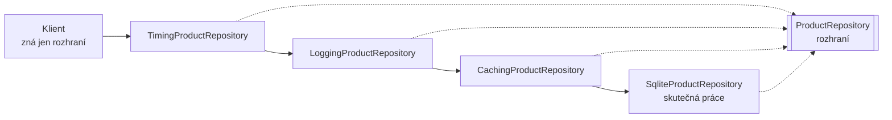

# Decorator (Dekorátor)

> [← zpět na Structural](../)

> **V jedné větě:** Přidání chování obalením objektu do jiného se stejným rozhraním — bez dědičnosti a bez zásahu do původní třídy.

---

## Problém

Máš funkční třídu a potřebuješ k ní přidat něco navíc: cache, logování, měření času, opakování při chybě. A za měsíc další věc. A pak kombinaci obojího.

**Poznáš to podle:**

- do fungující třídy přibývají věci, které s její prací nesouvisí (`if ($this->cacheEnabled)`)
- vzniká `CachedFooRepository extends FooRepository`, pak `LoggedFooRepository`, a pak **`CachedLoggedFooRepository`**
- příznaky v konstruktoru: `new Foo($db, cache: true, log: false)` — [řídicí provázanost](../../../Principles/CohesionAndCoupling.md#řídicí-provázanost-protože-ta-je-nejzákeřnější)
- doplňkovou vlastnost nejde zapnout jen někde, protože je zadrátovaná uvnitř
- třídu nejde rozšířit, protože je `final` nebo je z cizí knihovny

```php
// Před: všechno v jedné třídě, spínané příznaky
final class ProductRepository
{
    public function __construct(
        private PDO $connection,
        private bool $useCache = false,     // ← chování řídí volající
        private bool $logCalls = false,
    ) {
    }

    public function find(string $sku): ?string
    {
        if ($this->logCalls) { /* … */ }
        if ($this->useCache && isset($this->cache[$sku])) { /* … */ }
        // …a kde je vlastně ta práce, kvůli které třída existuje?
    }
}
```

Dědičnost to nespraví, jen přesune. Pro tři nezávislé vlastnosti potřebuješ **osm podtříd**, aby šly všechny kombinace — a s každou další se to zdvojnásobí.

---

## Řešení

Vytvoř třídu, která **implementuje totéž rozhraní** a **drží uvnitř objekt téhož rozhraní**. Přidá svoje a zbytek předá dál.



Všechny čtyři třídy jsou z pohledu klienta **zaměnitelné**. Právě proto se dají skládat v libovolném pořadí a libovolném počtu.

```php
final class CachingProductRepository implements ProductRepository
{
    public function __construct(
        private readonly ProductRepository $inner,   // ← rozhraní, ne konkrétní třída
    ) {
    }

    public function find(string $sku): ?string
    {
        if (array_key_exists($sku, $this->cache)) {
            return $this->cache[$sku];
        }

        return $this->cache[$sku] = $this->inner->find($sku);
    }
}
```

Dvě podmínky, bez kterých to není dekorátor:

1. **Implementuje totéž rozhraní** — klient nesmí poznat rozdíl. Kdyby přidal veřejnou metodu navíc, přestane být zaměnitelný.
2. **Drží rozhraní, ne konkrétní třídu** — proto obalí i jiný dekorátor.

### Proč ne dědičnost

Demo to počítá:

```
vlastností: 3
dědičnost:  8 podtříd pro všechny kombinace
dekorátory: 3 třídy, kombinace se skládají za běhu

U šesti vlastností:
    dědičnost:  64 podtříd
    dekorátory: 6 tříd
```

Dědičnost roste **exponenciálně**, dekorátory **lineárně**. A hlavně: u dědičnosti vybírá kombinaci autor tříd, u dekorátorů **volající za běhu**.

Tohle je [kompozice před dědičností](../../../Principles/ObjectDesign.md#kompozice-před-dědičností) v nejčistší podobě, jakou GoF nabízí.

### Na pořadí záleží

Dekorátory nejsou zaměnitelné mezi sebou — jejich pořadí je součástí chování:

```
pořadí                     zapsáno do logu   dotazů do DB
log → cache → DB           4                 2
cache → log → DB           2                 2
```

Když je log **vně** cache, zaznamená se každý dotaz aplikace. Když **uvnitř**, jen ty, které cache pustila dál. Obojí je legitimní — jen to musíš chtít vědomě, a proto pořadí patří do [composition rootu](../../../PoEAA/ServiceLayer/) na jedno viditelné místo.

### Co dekorátor umí navíc proti řetězu

Dekorátor pracuje **před i po** zavolání obaleného objektu:

```php
public function find(string $sku): ?string
{
    $startedAt = hrtime(true);          // před

    $result = $this->inner->find($sku);

    $this->durations[] = /* … */;       // po

    return $result;
}
```

Proto se dá měřit čas, chytat výjimky, obalit transakcí nebo upravit výsledek. To klasický [řetěz odpovědnosti](../../Behavioral/ChainOfResponsibility/) neumí — ten předá dál a skončí.

---

## Účastníci

| Role | V příkladu | Odpovědnost |
| ---- | ---------- | ----------- |
| **Rozhraní** | `ProductRepository` | Kontrakt sdílený základem i dekorátory |
| **Konkrétní komponenta** | `SqliteProductRepository` | Dělá skutečnou práci |
| **Dekorátor** | `CachingProductRepository`, `LoggingProductRepository` | Přidá své a předá dál |
| **Klient** | `lookup()` | Zná jen rozhraní; o obalení neví |
| **Skladatel** | DI kontejner, composition root | Určuje pořadí a složení |

---

## Implementace v PHP

Dekorátor je vždycky stejná kostra — a to je dobře, protože se pozná na první pohled:

```php
final class LoggingProductRepository implements ProductRepository
{
    public function __construct(
        private readonly ProductRepository $inner,
    ) {
    }

    public function find(string $sku): ?string
    {
        $this->log[] = $sku;

        return $this->inner->find($sku);
    }
}
```

### Když má rozhraní deset metod

Slabina patternu: dekorátor musí implementovat **všechny** metody rozhraní, i ty, které nemění. U velkého rozhraní je to hromada delegací.

| Řešení | Jak | Poznámka |
| ------ | --- | -------- |
| **Menší rozhraní** | Rozděl podle [ISP](../../../Principles/SOLID.md#interface-segregation-principle-isp) | Nejlepší odpověď — velké rozhraní je vlastní problém |
| **Abstraktní dekorátor** | Základní třída deleguje vše, potomek přepíše jen své | Vyměníš delegace za dědičnost v hierarchii dekorátorů |
| **Magické `__call()`** | Automatické přeposílání | **Nedělej to** — přijdeš o typovou kontrolu i o čitelnost |

### Symfony to umí konfigurací

```yaml
services:
    App\Repository\CachingProductRepository:
        decorates: App\Repository\ProductRepository
        arguments: ['@.inner']
```

Kontejner podstrčí původní službu jako `.inner` a všem, kdo si žádají `ProductRepository`, začne dávat dekorovanou verzi. **Volající kód se nezmění ani o písmeno** — a to je přesně ten test, jestli je dekorátor napsaný správně.

---

## Kdy použít

- ✅ Přidáváš **doplňkové chování** k něčemu, co funguje — cache, log, měření, opakování, autorizace.
- ✅ Kombinace vlastností se má vybírat **za běhu nebo v konfiguraci**, ne při psaní kódu.
- ✅ Původní třídu **nemůžeš měnit** — je `final`, je cizí, nebo je odladěná a nechceš do ní sahat.
- ✅ Vlastností je víc a byly by z nich kombinace.

## Kdy nepoužít

- ❌ **Přidávané chování patří dovnitř.** Když je to vlastní práce té třídy, patří tam a ne do obalu.
- ❌ **Je to jedna vlastnost a nikdy nebude druhá.** Jedna třída navíc kvůli jednomu `if` je režie.
- ❌ **Dekorátor by potřeboval metodu navíc.** Pak už není zaměnitelný a je to jiný pattern — nejspíš [Adapter](../Adapter/) nebo prostě nová služba.
- ❌ **Chceš hledat zpracovatele.** To je [Chain of Responsibility](../../Behavioral/ChainOfResponsibility/): řetěz hledá, kdo to vyřídí; dekorátor pouští dál vždycky.
- ❌ **Stack má osm vrstev.** Stack trace se stane nečitelným a nikdo nepozná, kde se co stalo.

---

## Časté chyby

| Chyba | Proč vadí | Jak správně |
| ----- | --------- | ----------- |
| Dekorátor dědí z konkrétní třídy | Obalí jen ji, ne jiný dekorátor; stohování padá | Drž **rozhraní**, ne třídu |
| Přidá veřejnou metodu navíc | Přestane být zaměnitelný; klient musí vědět, co je uvnitř | Rozhraní se nesmí rozšířit |
| Nepředá dál | Tiše se ztratí chování obaleného objektu | Vždy zavolej `$this->inner`, nebo to není dekorátor |
| Obsahuje byznysové pravidlo | Pravidlo je schované v obalu, který si někdo příště nenasadí | Dekorátor řeší **průřezové** věci, ne doménu |
| Pořadí vzniká náhodou | Chování závisí na pořadí a nikdo o tom neví | Pořadí do composition rootu, s komentářem proč |
| `__call()` místo explicitních metod | Konec typové kontroly, statická analýza je slepá | Napiš delegace, nebo zmenši rozhraní |
| Osmivrstvý stack | Neodladitelné, stack trace nečitelný | Málo vrstev, nebo jinou strategii |

---

## V praxi

- **Symfony `decorates:`** — dekorátor jako konfigurace, bez zásahu do kódu.
- **PSR-3 loggery** — `Monolog` skládá handlery a processory přesně takhle.
- **PSR-18 HTTP klienti** — opakování, logování a cache se přidávají obalením klienta.
- **PHP streamy** — `php://filter` je dekorátor zabudovaný do jazyka.
- **Cache a měření nad repository** — nejběžnější použití vůbec, přesně jako v demu.

---

## Související patterny

| Pattern | Vztah |
| ------- | ----- |
| [Chain of Responsibility](../../Behavioral/ChainOfResponsibility/) | **Nejbližší příbuzný a nejčastější záměna.** Struktura stejná, záměr jiný: dekorátor **vždycky pustí dál** a přidává; řetěz hledá, **kdo požadavek vyřídí**, a končí u prvního schopného. Middleware stojí přesně na hranici obojího. |
| [Adapter](../Adapter/) | Také obaluje, ale **mění rozhraní**. Dekorátor ho zachovává. |
| **Proxy** (GoF) | Také obaluje se stejným rozhraním, ale kvůli **řízení přístupu** (lazy loading, oprávnění), ne kvůli přidání chování. |
| [Composite](../Composite/) (GoF) | Obaluje **víc** objektů najednou a kvůli struktuře; dekorátor právě jeden a kvůli chování. |
| [Strategy](../../Behavioral/Strategy/) | Strategy chování **nahradí**, dekorátor ho **obalí**. |
| [Service Layer](../../../PoEAA/ServiceLayer/) | Typické místo použití: transakce, autorizace a měření kolem use-case. |
| [Repository](../../../PoEAA/Repository/) | Nejčastěji dekorovaná věc v PHP aplikacích. |

---

## Vztah k principům

| Princip | Jak souvisí |
| ------- | ----------- |
| [Kompozice před dědičností](../../../Principles/ObjectDesign.md#kompozice-před-dědičností) | **Učebnicová ukázka.** Demo počítá rozdíl: 3 vlastnosti = 8 podtříd proti 3 dekorátorům. |
| [OCP](../../../Principles/SOLID.md#openclosed-principle-ocp) | Nové chování = nová třída. Původní se nemění — demo to ukazuje na přidání cache. |
| [SRP](../../../Principles/SOLID.md#single-responsibility-principle-srp) | Každý dekorátor řeší jednu věc. Alternativou je jedna třída s příznaky pro všechno. |
| [Soudržnost a provázanost](../../../Principles/CohesionAndCoupling.md#řídicí-provázanost-protože-ta-je-nejzákeřnější) | Nahrazuje `bool` příznaky v konstruktoru, které jsou řídicí provázanost. |

---

## Demo

```bash
php GoF/Structural/Decorator/demo/run.php
```

Přidá cache k repository **bez zásahu do jeho třídy** i do volajícího kódu, poskládá tři dekorátory na sebe a ukáže, že **prohození pořadí mění počet zápisů do logu** (4 proti 2). Nakonec spočítá, kolik podtříd by stála táž funkcionalita dědičností — u tří vlastností osm, u šesti čtyřiašedesát.

---

## Původ

|               |                                                   |
| ------------- | ------------------------------------------------- |
| **Zdroj**     | *Design Patterns: Elements of Reusable Object-Oriented Software* |
| **Autoři**    | Gamma, Helm, Johnson, Vlissides („Gang of Four“)   |
| **Rok**       | 1994                                              |
| **Kategorie** | Structural                                        |
| **Obtížnost** | ●●○○○                                             |

Autoři vzor demonstrují na grafickém rozhraní: textové pole, kolem něj rámeček, k tomu posuvník. Kdyby se to řešilo dědičností, vznikly by třídy jako `TextViewWithBorderAndScrollbar` — a při čtvrté vlastnosti by jejich počet dosáhl šestnácti. Právě tahle kombinatorická past byla jejich motivací.

Decorator je jedním ze vzorů, které nejlépe ilustrují **první ze dvou zásad, jimiž GoF svou knihu uvádí**: *dávej přednost skládání objektů před dědičností tříd*. Není náhoda, že se používá dodnes prakticky beze změny — na rozdíl od několika jiných vzorů z knihy ho moderní jazyky nezlevnily ani nenahradily.

V PHP mu navíc přálo, že se dá zapnout konfigurací DI kontejneru. Symfony `decorates:` znamená, že se dekorátor nasadí **bez jediné změny volajícího kódu** — a to je vlastnost, kterou v roce 1994 nikdo nečekal.

---

## Zdroje

- Gamma, Helm, Johnson, Vlissides: *Design Patterns*, Addison-Wesley, 1994 — kapitola 4, str. 175
- [Symfony: Service Decoration](https://symfony.com/doc/current/service_container/service_decoration.html)
- [PSR-18: HTTP Client](https://www.php-fig.org/psr/psr-18/)

---

<details>
<summary>Metadata patternu</summary>

```yaml
name: Decorator
name_cs: Dekorátor
category: Structural
source: GoF – Design Patterns
authors: Gamma, Helm, Johnson, Vlissides
year: 1994
difficulty: 2
tags: [kompozice, obalení, průřezové starosti, cache, logování]
principles: [CompositionOverInheritance, OCP, SRP, CohesionAndCoupling]
related: [ChainOfResponsibility, Adapter, Proxy, Composite, Strategy, ServiceLayer, Repository]
status: done
```

</details>
