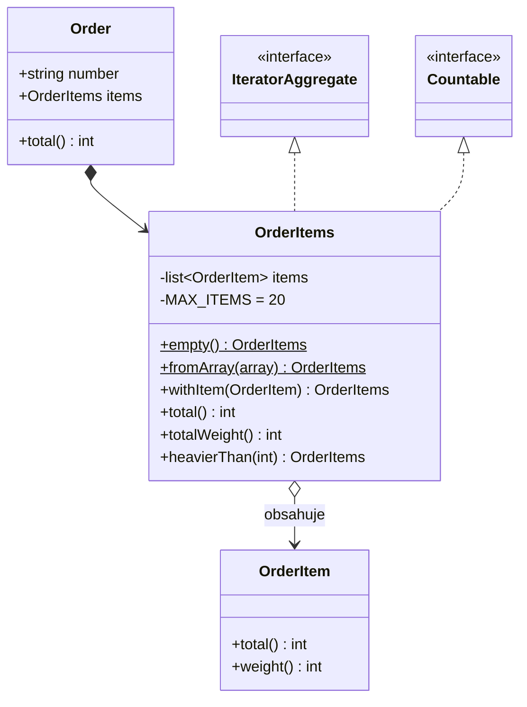

# First Class Collection (Kolekce jako plnohodnotný objekt)

> [← zpět na Object Calisthenics](../)

> **V jedné větě:** Pole zabalené do vlastní třídy, která k němu přidá doménové metody a hlídá pravidla platná pro celou skupinu.

---

## Problém

Doménový objekt drží pole a všechno ostatní se s tím polem musí umět vypořádat samo. Znalost o tom, *co ta skupina znamená*, se rozteče po celé aplikaci.

**Poznáš to podle:**

- entita má veřejné `array $items` a volající si ho prochází sám
- stejné `array_sum(array_map(...))` najdeš na pěti místech v pěti mírně odlišných variantách
- z typu `array` nepoznáš, co je uvnitř — jen z PHPDoc komentáře, kterému nikdo nevěří
- pravidlo typu „objednávka smí mít nejvýš 20 položek“ se kontroluje ve dvou use-caseech a ve třetím se zapomnělo
- kdokoli může do pole kdykoli něco přidat, protože je veřejné nebo se vrací referencí

```php
// Před: objednávka je jen obal na pole, znalosti jsou všude okolo
final class Order
{
    /** @var OrderItem[] */
    public array $items = [];
}

// …a tohle se pak opakuje v každém use-case, který cenu potřebuje
$total = array_sum(array_map(
    static fn (OrderItem $item): int => $item->unitPriceInCents * $item->quantity,
    $order->items,
));

// …limit na počet položek zná jen tenhle jeden use-case
if (count($order->items) > 20) {
    throw new TooManyItems();
}

// …a tady si někdo klidně přidá cokoli, i něco, co OrderItem vůbec není
$order->items[] = $whatever;
```

Objednávka o svých položkách neví nic. Neví, kolik stojí, neví, kolik jich smí být, a neumí zabránit tomu, aby v ní skončil nesmysl. Tuhle znalost nese kód okolo — a proto je pokaždé trochu jinde a trochu jinak.

---

## Řešení

Pole obal do vlastní třídy. Ta se stane **jediným místem, kde znalost o skupině žije**: součty, filtry i pravidla, která pro skupinu platí.



Tři vlastnosti, které z toho plynou a kvůli kterým to celé stojí za tu jednu třídu navíc:

| Vlastnost | Co to znamená v praxi |
| --------- | --------------------- |
| **Typová bezpečnost** | Dovnitř se nedostane nic než `OrderItem`. Žádný PHPDoc, na který se nedá spolehnout. |
| **Invarianty na jednom místě** | Limit počtu položek se hlídá v konstruktoru. Nejde ho obejít ani zapomenout. |
| **[Neměnnost](../../Glossary.md#neměnnost-immutability)** | Každá úprava vrací novou instanci, takže kolekci jde bezpečně sdílet a předávat dál. |

Zásadní detail: **operace nad kolekcí vracejí zase kolekci**, ne pole. Díky tomu jde na výsledku filtru rovnou volat `total()` a řetězit dál.

---

## Účastníci

| Role                  | V příkladu   | Odpovědnost                                                              |
| --------------------- | ------------ | ------------------------------------------------------------------------ |
| **Collection**        | `OrderItems` | Drží prvky, hlídá invarianty skupiny, nabízí doménové operace nad celkem |
| **Item**              | `OrderItem`  | Jeden prvek; zná jen sám sebe                                            |
| **Owner** (nepovinný) | `Order`      | Vlastní kolekci a deleguje na ni                                          |

---

## Implementace v PHP

Kolekce. Privátní konstruktor a pojmenované továrny jsou schválně — z volajícího kódu je pak vidět, co se děje:

```php
<?php
declare(strict_types=1);

/**
 * @implements IteratorAggregate<int, OrderItem>
 */
final readonly class OrderItems implements IteratorAggregate, Countable
{
    private const int MAX_ITEMS = 20;

    /** @var list<OrderItem> */
    private array $items;

    /** @param list<OrderItem> $items */
    private function __construct(array $items)
    {
        if (count($items) > self::MAX_ITEMS) {
            throw new InvalidArgumentException(
                sprintf('Objednávka smí mít nejvýš %d položek, dostal jsem %d.', self::MAX_ITEMS, count($items)),
            );
        }

        $this->items = array_values($items);
    }

    public static function empty(): self
    {
        return new self([]);
    }

    /** @param list<OrderItem> $items */
    public static function fromArray(array $items): self
    {
        return new self($items);
    }

    public function withItem(OrderItem $item): self
    {
        return new self([...$this->items, $item]);
    }

    /**
     * Hromadné přidání. Použij ho vždy, když položky přidáváš ve smyčce —
     * withItem() volaný N× kopíruje pole N× a chová se kvadraticky.
     *
     * @param list<OrderItem> $items
     */
    public function withItems(array $items): self
    {
        return new self([...$this->items, ...$items]);
    }

    /** Cena všech položek v haléřích. */
    public function total(): int
    {
        return array_sum(array_map(
            static fn (OrderItem $item): int => $item->total(),
            $this->items,
        ));
    }

    /** Filtrování vrací zase OrderItems — jde na něm volat total() a řetězit dál. */
    public function heavierThan(int $grams): self
    {
        return new self(array_values(array_filter(
            $this->items,
            static fn (OrderItem $item): bool => $item->weight() > $grams,
        )));
    }

    public function isEmpty(): bool
    {
        return $this->items === [];
    }

    public function count(): int
    {
        return count($this->items);
    }

    public function getIterator(): Traversable
    {
        return new ArrayIterator($this->items);
    }
}
```

`IteratorAggregate` a `Countable` jsou to minimum, které z kolekce udělá v PHP plnohodnotného občana — jde přes ni `foreach` i `count()`, aniž bys komukoli musel vydat vnitřní pole.

### Neměnná, nebo měnitelná?

Obě varianty jsou pořád tentýž pattern — vlastní jméno, typová homogenita, invarianty na jednom místě, doménové metody. Liší se **jediná věc**: jestli úprava vrací novou instanci, nebo mění tu stávající.

**Výchozí volba je neměnná.** Bezpečně ji předáš kamkoli a nikdo ti ji pod rukama nezmění. Má ale cenu, kterou je potřeba znát.

#### Cena neměnnosti

`withItem()` kopíruje celé pole. Volaný ve smyčce se proto chová **kvadraticky** — N přidání znamená N kopií o průměrné délce N/2. Naměřeno na PHP 8.5 ([`demo/benchmark.php`](demo/benchmark.php), čísla jsou pro představu o řádu, ne absolutní):

| N položek | `withItem()` ve smyčce | `withItems()` hromadně | měnitelné `add()` ve smyčce |
| --------- | ---------------------- | ---------------------- | --------------------------- |
| 1 000     | 1,4 ms                 | 0,01 ms                | 0,4 ms                      |
| 5 000     | 34 ms                  | 0,02 ms                | 0,5 ms                      |
| 20 000    | 608 ms                 | 0,09 ms                | 2,1 ms                      |
| 50 000    | 3 990 ms               | 0,25 ms                | 5,5 ms                      |

Z toho plynou tři věci, a ta prostřední je nejdůležitější:

1. **Kvadratické chování je reálné.** Mezi 5 000 a 50 000 položkami vyroste čas 117×, ne 10×.
2. **Řešením není měnitelnost, ale hromadná operace.** `withItems()` je lineární a i pro 50 000 položek je **rychlejší než měnitelné `add()` ve smyčce**. Neměnnost sama o sobě nestojí prakticky nic — draze vyjde jen *přidávání po jednom*.
3. **Paměť problém není.** Mezivýsledky se uvolňují hned, jak přepíšeš proměnnou; kvadratický je čas kopírování, ne spotřeba paměti.

Pro doménovou kolekci v běžné aplikaci — položky objednávky, přílohy, adresy — je tohle celé akademické. Tam jde o jednotky až desítky prvků a rozdíl je v mikrosekundách.

#### Kdy sáhnout po měnitelné

Až když **sbíráš prvky ve smyčce a je jich hodně** a hromadná operace se nehodí, protože prvky vznikají postupně (import z CSV, stránkované čtení z API, agregace ve streamu). I pak platí:

```php
// Měnitelná kolekce zůstane uvnitř jedné operace…
$collecting = new MutableOrderItems();

foreach ($rows as $row) {
    $collecting->add(OrderItem::fromRow($row));
}

// …a ven z ní vyleze neměnná, kterou už jde bezpečně předat dál
return $collecting->toImmutable();
```

Tomuhle se říká **mutable builder**: měnitelnost je lokální optimalizace schovaná uvnitř jedné metody, ne vlastnost, kterou pouštíš do celé aplikace.

| | Neměnná | Měnitelná |
| --- | ------- | --------- |
| **Předávání dál** | Bezpečné bez rozmyslu | Jen s vědomím, že ji příjemce může změnit |
| **Plnění po jednom** | Kvadratické — vyhni se | Lineární |
| **Plnění hromadně** | Lineární, nejrychlejší varianta vůbec | — |
| **Sdílení mezi vlákny/požadavky** | Bez rizika | Zdroj těžko dohledatelných chyb |
| **Použij, když** | Skoro vždy (výchozí volba) | Sbíráš postupně velké množství prvků uvnitř jedné operace |

Obě varianty jsou v demu: [`OrderItems.php`](demo/OrderItems.php) a [`MutableOrderItems.php`](demo/MutableOrderItems.php).

---

### Použití

```php
$order = Order::empty('OBJ-001')
    ->withItem(new OrderItem('Klávesnice', 129000, 1, 900))
    ->withItem(new OrderItem('Monitor 27"', 799000, 1, 6200));

echo $order->total();                        // 928000
echo count($order->items);                   // 2
echo $order->items->heavierThan(500)->total(); // 928000 — filtr vrací kolekci

foreach ($order->items as $item) {
    echo $item->productName;
}
```

---

## Kdy použít

- ✅ Pole má v doméně **vlastní jméno a vlastní pravidla** — „položky objednávky“, ne „nějaké pole“.
- ✅ Nad skupinou počítáš **souhrny** (součet, hmotnost, počet splňujících podmínku) na víc než jednom místě.
- ✅ Pro skupinu platí **invariant** — maximální počet, žádné duplicity, aspoň jeden prvek.
- ✅ Chceš zaručit **typovou homogenitu**, kterou `array` v PHP zaručit neumí.
- ✅ Kolekce se předává dál a potřebuješ jistotu, že ji **nikdo cestou nezmění**.

## Kdy nepoužít

- ❌ **Pole je čistě technický mezivýsledek** uvnitř jedné metody. Kolekce kolem tříprvkového pole v privátní metodě je jen šum.
- ❌ **Nemáš žádnou doménovou operaci ani pravidlo** a třída by obsahovala jen `add()` a `toArray()`. To není kolekce, to je pomalejší pole.
- ❌ **Chceš univerzální kolekci pro cokoli.** Na to už existuje `ramsey/collection` nebo `illuminate/collections`; tenhle pattern je o *doménové* kolekci s konkrétním jménem.
- ❌ **Kolekce mají být obrovské a operace nad nimi patří do databáze.** `SUM()` v SQL nenahradíš tím, že načteš sto tisíc entit do paměti — to je práce pro **Repository**.

---

## Časté chyby

| Chyba | Proč vadí | Jak správně |
| ----- | --------- | ----------- |
| Kolekce má `toArray()` / `all()` a volající si zase dělá `array_map` sám | Zapouzdření je jen naoko — znalost se vrátila ven a pattern nepřinesl nic | Přidej doménovou metodu do kolekce. `toArray()` nech jen pro hranici aplikace (serializace, šablona), nikdy pro doménovou logiku |
| Kolekce je měnitelná — `add()` mění `$this` | Sdílenou instanci ti změní někdo pod rukama a chyba se projeví jinde, než vznikla | `readonly`, metody `withX()` vracející novou instanci |
| Filtrovací metoda vrací `array` | Na výsledku už nejde volat `total()` ani řetězit; pattern končí u první operace | Vracej `self` |
| Invariant se kontroluje v `add()`, ale ne v konstruktoru | Přes `fromArray()` se do kolekce dostane neplatný stav | Kontrola patří do konstruktoru, kterým **všechny** cesty procházejí |
| Kolekce se plní `withItem()` ve smyčce | Každé volání kopíruje celé pole — u tisíců prvků kvadratické zpomalení | Přidej hromadné `withItems()` / `fromArray()`, nebo použij měnitelný builder uvnitř operace |
| Kolekce sahá do databáze nebo volá repository | Doménový objekt závislý na infrastruktuře — nejde otestovat bez DB | Kolekce pracuje jen s tím, co dostala; načítání je práce repository |
| Postupné dopisování celého API pole (`map`, `reduce`, `slice`, `chunk`…) | Vyrábíš horší kopii existující knihovny a nikdo nepozná, co je doménová operace | Přidávej **jen** metody, které mají doménový význam |

---

## V praxi

- **Doctrine** — `Doctrine\Common\Collections\Collection` je infrastrukturní kolekce pro asociace. Doména by ale měla mít vlastní: entita drží `Collection`, navenek vystavuje `OrderItems`.
- **PHP samotné** — `IteratorAggregate`, `Countable`, `JsonSerializable`. Kolekce, která je implementuje, se chová jako vestavěný typ.
- **`ramsey/collection`** — typované kolekce jako obecná knihovna; dobrý základ, nad kterým doménová kolekce staví.
- **Symfony** — `InputBag`, `HeaderBag`, `FileBag`. Přesně tenhle pattern: pole plus pravidla plus pojmenované operace.

---

## Související patterny

| Pattern | Vztah |
| ------- | ----- |
| **Iterator** (GoF) | First Class Collection ho v PHP typicky implementuje přes `IteratorAggregate`. Iterator řeší *jak procházet*, tahle kolekce *co skupina znamená*. |
| [Value Object](../../DDD/ValueObject/) (DDD) | Sourozenec: tenhle pattern obaluje pole, Value Object primitiv. Neměnná kolekce je vlastně value object nad seznamem. |
| [Aggregate](../../DDD/Aggregate/) (DDD) | Přirozený způsob, jak kořen agregátu drží své vnitřní entity — i s pravidly platnými pro skupinu. |
| **Composite** (GoF) | Také zachází se skupinou jako s jedním prvkem, ale kvůli stromové struktuře; kolekce je plochá. |
| [Repository](../../PoEAA/Repository/) (PoEAA) | Přirozený návratový typ repository — místo `array` vrací rovnou doménovou kolekci. |
| [Specification](../../DDD/Specification/) (DDD) | Filtrovací pravidlo vytažené do samostatného objektu: `$items->satisfying($spec)` místo `array_filter` venku. |

---

## Vztah k principům

| Princip | Jak souvisí |
| ------- | ----------- |
| [SRP](../../Principles/SOLID.md#single-responsibility-principle-srp) | Kolekce má jediný důvod ke změně: pravidla platná pro skupinu položek. Objednávka se kvůli nim už měnit nemusí. |
| [OCP](../../Principles/SOLID.md#openclosed-principle-ocp) | Nové pravidlo nebo souhrn = nová metoda kolekce; use-case, které ji používají, zůstávají beze změny. |

| [Tell, Don't Ask](../../Principles/ObjectDesign.md#tell-dont-ask) | Neptáš se kolekce na její pole — řekneš jí, ať spočítá součet. |
| [Zákon Demeter](../../Principles/ObjectDesign.md#zákon-demeter-law-of-demeter) | Volající nesahá skrz `$order->items[3]->price`. |

---

## Demo

```bash
php ObjectCalisthenics/FirstClassCollection/demo/run.php
```

Sestaví objednávku, ukáže souhrny nad kolekcí, řetězení filtru, neměnnost při odebrání položky a vynucení invariantu na maximálním počtu položek.

```bash
php ObjectCalisthenics/FirstClassCollection/demo/benchmark.php
```

Změří cenu neměnnosti: `withItem()` ve smyčce proti hromadnému `withItems()` a proti měnitelnému `add()`, pro 1 000 až 50 000 položek.

---

## Původ

|               |                                                            |
| ------------- | ---------------------------------------------------------- |
| **Zdroj**     | *The ThoughtWorks Anthology* — esej *Object Calisthenics*    |
| **Autor**     | Jeff Bay                                                    |
| **Rok**       | 2008                                                        |
| **Kategorie** | — (Object Calisthenics kategorie nemá, je to sada 9 pravidel) |
| **Obtížnost** | ●●○○○                                                       |

Jeff Bay v eseji *Object Calisthenics* („objektová rozcvička“) sepsal devět záměrně přísných pravidel jako **cvičení**, ne jako předpis pro produkci. Nápad byl provokativní: napiš tisícřádkový projekt tak, že všech devět dodržíš do posledního písmene, a uvidíš, jak jinak začneš přemýšlet. Pravidlo č. 4 znělo *„First Class Collections“* — každá třída, která obsahuje kolekci, nesmí obsahovat nic jiného.

Z těch devíti pravidel se právě tohle uchytilo nejvíc a přežilo i mimo cvičení. Důvod je praktický: v jazycích bez generik — a PHP mezi ně patří — je vlastní typ kolekce jediný způsob, jak vůbec zaručit, co je uvnitř. Původní formulace („nic jiného než ta kolekce“) je pro produkci zbytečně dogmatická; co z ní zůstalo, je myšlenka, že **skupina objektů si zaslouží vlastní jméno a vlastní chování**.

---

## Zdroje

- Jeff Bay: *Object Calisthenics*, in: *The ThoughtWorks Anthology*, Pragmatic Bookshelf, 2008
- [Doctrine Collections](https://www.doctrine-project.org/projects/collections.html)

---

<details>
<summary>Metadata patternu</summary>

```yaml
name: FirstClassCollection
name_cs: Kolekce jako plnohodnotný objekt
category: —
source: Object Calisthenics – The ThoughtWorks Anthology
authors: Jeff Bay
year: 2008
difficulty: 2
tags: [kolekce, zapouzdření, neměnnost, typová bezpečnost, doménový model, výkon]
principles: [SRP, OCP]
related: [Iterator, ValueObject, Composite, Repository, Specification]
status: done
```

</details>
