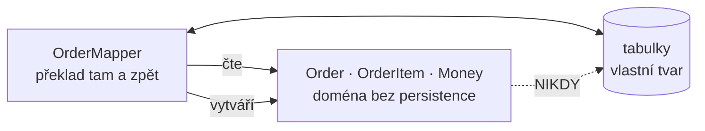

# Data Mapper (Mapovač dat)

> [← zpět na PoEAA](../)

> **V jedné větě:** Vrstva, která přenáší data mezi objekty a databází tak, že **ani jedna strana o té druhé neví** — objekt nemá `save()` a schéma nemusí kopírovat tvar objektu.

---

## Problém

Doménový objekt a databázová tabulka jsou dvě různé věci s různými pravidly, ale mají držet tatáž data. Když se ta hranice neřeší, obě strany se propojí — a od té chvíle jedna diktuje druhé.

**Poznáš to podle:**

- doménová třída má `save()`, `find()` nebo drží spojení do databáze
- **model má tvar tabulky**, ne domény: ploché atributy, samé skaláry, žádné hodnoty
- změna sloupce si vynutí změnu doménového objektu — a naopak
- **test byznysového pravidla potřebuje databázi**, protože objekt bez ní nedává smysl
- v doméně jsou `nullable` pole jen proto, že sloupec v databázi je `NULL`
- vzniká tlak nemodelovat [value object](../../DDD/ValueObject/), protože „to by se špatně ukládalo“

Ten poslední bod je nejzákeřnější: **návrh domény se začne řídit tím, co je pohodlné pro databázi.**

---

## Řešení

Postav mezi ně vrstvu, jejíž jediná práce je **překlad**. Doménový objekt o ní neví, databázové schéma taky ne.



Šipky jsou schválně jednosměrné: **mapper zná obojí, doména nezná nic.** Demo to ověřuje na zdrojovém kódu — v `Order.php` (jen kód, bez komentářů) není `PDO`, `SELECT`, `save`, `Doctrine` ani `Repository`.

### Co všechno musí mapper srovnat

Objektový a relační model se neshodují a nikdy nebudou — tomu se říká **impedance mismatch**. Mapper je místo, kde se ten nesoulad spolkne:

| V doméně | V databázi | Co mapper udělá |
| -------- | ---------- | --------------- |
| `Money(1727000, 'CZK')` | `castka_kc` + `mena` | Jedna hodnota → dva sloupce |
| `OrderStatus::New` (enum) | `stav_kod = 1` | Enum ↔ číselník |
| `DateTimeImmutable` | `'01.09.2026'` | Typ ↔ formát |
| `list<OrderItem>` | vlastní tabulka s cizím klíčem | Objekt ↔ řádky |
| `total()` — **počítá se** | `castka_kc` — **uložený sloupec** | Při zápisu dopočítá, při čtení ignoruje |

Ten poslední řádek stojí za pozornost. Staré schéma drží denormalizovaný součet, doména ne — a **doména se to nikdy nedozví**. Přesně tohle by u [Active Recordu](#data-mapper-vs-active-record) nešlo: tam by ten sloupec musel být vlastností objektu.

### Odměna: schéma se změní, doména ne

Demo drží **dvě úplně jiná schémata pro tentýž doménový objekt** — staré české a nové anglické:

```
sloupců ve starém schématu:  12  (cislo, zakaznik, castka_kc…)
sloupců v novém schématu:    11  (id, customer_email, currency…)
společných:                  1  id

Řádků změněných v Domain/Order.php:  0
```

Ten jeden společný sloupec je navíc náhoda — autoincrement `id` v obou tabulkách položek. **Prakticky nemají společného nic, a doména je identická.**

Tohle je celý přínos patternu vyjádřený jedním číslem.

### Jak se mapper dostane objektu dovnitř

Praktický problém, na který se narazí hned: doménový objekt si hlídá pravidla, ale mapper načítá data, která **už jednou platná byla** — a dnešní pravidlo tehdy nemuselo existovat.

```php
Order::place('OBJ-X', 'a@b.cz', [], $now);
// DomainException: Objednávka musí mít alespoň jednu položku.
```

Dvě řešení, a obě se používají:

| Způsob | Jak | Kdo tak dělá |
| ------ | --- | ------------ |
| **Druhá továrna** | `Order::reconstitute()` — obchází zakládací pravidla, protože rekonstruuje, nezakládá | Ruční mapper, tenhle katalog |
| **Obejít konstruktor** | Reflexí vytvořit instanci a nastavit vlastnosti | **Doctrine** |

Doctrine používá `newInstanceWithoutConstructor()` a [hydratuje](../../Glossary.md#hydratace-a-dehydratace) reflexí. Výsledek je stejný, jen to není vidět — a je dobré vědět, že se to děje, protože z toho plyne pár překvapení (konstruktor se při načtení nezavolá, `readonly` vlastnosti jdou naplnit).

---

### Jak v Doctrine udržet doménu opravdu čistou

Nejčastější námitka proti „doména nesmí vědět o persistenci“ zní: *„v Doctrine to nejde, entita má atributy.“* **Jde to** — a stojí za to vědět jak, protože jinak z toho vznikne kompromis, který nikdo nezvolil.

Výchozí nastavení opravdu vede k tomuhle:

```php
#[ORM\Entity]
#[ORM\Table(name: 'orders')]
final class Order
{
    #[ORM\Id]
    #[ORM\Column(type: 'string')]
    private string $id;              // ← mapování v doméně
}
```

Není to katastrofa a spousta týmů s tím žije. Ale je to přesně to, čemu se Data Mapper snaží vyhnout: **schéma se propsalo do doménové třídy.**

#### 1. XML mapování — entita zůstane bez jediného atributu

Doctrine umí metadata číst z několika zdrojů. Když zvolíš XML, doménová třída je čistý PHP objekt:

```php
namespace Domain\Order;

final class Order            // ← žádné `use Doctrine\…`, žádné atributy
{
    private OrderId $id;
    private EmailAddress $customerEmail;
    private Money $total;
}
```

```xml
<!-- config/doctrine/Order.orm.xml -->
<doctrine-mapping xmlns="http://doctrine-project.org/schemas/orm/doctrine-mapping">
    <entity name="Domain\Order\Order" table="orders">
        <id name="id" type="order_id" column="id"/>
        <field name="customerEmail" type="email_address" column="customer_email"/>
        <embedded name="total" class="Domain\Money"/>
    </entity>
</doctrine-mapping>
```

```yaml
# config/packages/doctrine.yaml
doctrine:
    orm:
        mappings:
            Domain:
                type: xml
                dir: '%kernel.project_dir%/config/doctrine'
                prefix: 'Domain'
```

Tohle je způsob, jakým se dělá „čistá doména s Doctrine“ v projektech, které to myslí vážně.

#### 2. Custom types — value object jako sloupec

Druhá věc, o které se málo ví: Doctrine umí mapovat **[value object](../../DDD/ValueObject/) rovnou na databázový sloupec**. Napíšeš vlastní typ a doména může mít v property `EmailAddress`, ne `string`:

```php
namespace Domain\Type;

final class EmailAddressType extends StringType
{
    public function convertToDatabaseValue($value, AbstractPlatform $platform): ?string
    {
        return $value instanceof EmailAddress ? $value->value : null;
    }

    public function convertToPHPValue($value, AbstractPlatform $platform): ?EmailAddress
    {
        return $value === null ? null : EmailAddress::fromString((string) $value);
    }
}
```

```yaml
doctrine:
    dbal:
        types:
            email_address: Domain\Type\EmailAddressType
```

Od té chvíle je v databázi obyčejný `VARCHAR` — **dotazovatelný, indexovatelný, čitelný v adminu** — a v doméně plnohodnotný value object. Žádné `->getValue()` v každém use-case.

> API se mezi DBAL 3 a 4 v detailech liší (zejména kolem `getName()`). Ověř si tvar podle verze, kterou máte.

#### 3. Embeddables — hodnota přes víc sloupců

Custom type funguje na **jednu hodnotu = jeden sloupec**. Když má value object víc složek, jsou na to embeddables:

```xml
<embedded name="total" class="Domain\Money" column-prefix="total_"/>
```

Vznikne z toho `total_amount` a `total_currency` — tedy přesně ten [první řádek tabulky nesouladu](#co-všechno-musí-mapper-srovnat), jen řešený za tebe.

#### Co si vybrat

| Tvar value objectu | Řešení | Příklad |
| ------------------ | ------ | ------- |
| Jedna hodnota | **Custom type** | `EmailAddress`, `OrderId`, `IČO`, `PSČ` |
| Víc složek | **Embeddable** | `Money` (částka + měna), `Address` |
| Kolekce hodnot | Vlastní tabulka, nebo JSON sloupec | `list<Tag>` |
| Výčet | **Enum type** (Doctrine umí nativně) | `OrderStatus` |

#### Co to stojí

Aby to nebylo jednostranné — XML mapování má svou cenu a je fér ji znát dopředu:

| | Atributy v entitě | XML mapování |
| --- | --- | --- |
| Doména čistá | Ne | **Ano** |
| Mapování vidíš u kódu | **Ano** | Ne — je v jiném souboru |
| Přejmenování vlastnosti | IDE zvládne | **IDE mapování minule** — rozbije se za běhu |
| Ukecanost | Malá | Větší |
| Kolik lidí to zná | Většina | Menšina |

Praktický závěr: **XML mapování se vyplatí tam, kde na čistotě domény opravdu záleží** — v jádru s netriviálními pravidly. U číselníků a administrace jsou atributy naprosto v pořádku a nic tím neztratíš. Custom types se naopak vyplatí skoro vždycky, protože doména na nich vydělá, ať mapuješ čímkoli.

---

## Data Mapper vs Active Record

Fowler popsal v téže knize i protipól. **Ani jeden z nich není špatně** — jsou to dva různé kompromisy a stojí za to vědět který kdy.

| | **Data Mapper** | **Active Record** |
| --- | --- | --- |
| Kdo umí uložit | Mapper | **Objekt sám** (`$order->save()`) |
| Objekt zná jméno tabulky | Ne | **Ano** |
| Objekt drží spojení do DB | Ne | **Ano** |
| Změna schématu mění doménu | Ne | **Ano** |
| Test pravidla potřebuje DB | Ne | **Ano** |
| Tvar objektu určuje | **Doména** | Tabulka |
| Kolik tříd | Dvě | Jedna |
| Kolik kódu na start | Víc | **Míň** |
| V PHP | **Doctrine** | **Eloquent** |

**Kdy vyhrává Active Record:** aplikace, kde model *je* v podstatě tabulka. CRUD, administrace, prototyp, malý projekt. Píše se rychleji, čte se dobře a vrstva navíc by nic nepřinesla. Půlka úspěšných PHP aplikací stojí na Eloquentu a je to v pořádku.

**Kdy vyhrává Data Mapper:** doména má vlastní pravidla a vlastní tvar, který se s tabulkou neshoduje. Chceš [value objecty](../../DDD/ValueObject/), [agregáty](../../DDD/Aggregate/) a testy bez databáze. Schéma je staré nebo sdílené a nemůžeš ho ohýbat podle sebe.

Rozhodovací otázka: **řídí tvar objektu doména, nebo tabulka?** Když tabulka, Active Record ti nic nebere. Když doména, Active Record ti bude překážet každý den.

---

## Účastníci

| Role | V příkladu | Odpovědnost |
| ---- | ---------- | ----------- |
| **Doménový objekt** | `Order`, `OrderItem`, `Money` | Pravidla a chování; o persistenci neví |
| **Mapper** | `LegacyOrderMapper`, `ModernOrderMapper` | Překlad objekt ↔ řádky, oběma směry |
| **Rekonstrukce** | `Order::reconstitute()` | Cesta dovnitř mimo zakládací pravidla |
| **Schéma** | tabulky | Vlastní tvar, nezávislý na objektu |

---

## Implementace v PHP

Mapování tam:

```php
public function insert(Order $order): void
{
    $head = $this->connection->prepare(
        'INSERT INTO objednavky (cislo, zakaznik, castka_kc, mena, stav_kod, dt_vytvoreni)
         VALUES (:cislo, :zakaznik, :castka, :mena, :stav, :dt)',
    );

    $head->execute([
        'cislo' => $order->number,
        'zakaznik' => $order->customerEmail,
        // Denormalizovaný součet — schéma ho chce, doména ho neukládá.
        'castka' => number_format($order->total()->amountInCents / 100, 2, '.', ''),
        'mena' => $order->total()->currency,
        'stav' => array_search($order->status()->value, self::STATUS_CODES, strict: true),
        'dt' => $order->placedAt->format('d.m.Y'),
    ]);

    // …a položky do vlastní tabulky
}
```

A zpátky:

```php
return Order::reconstitute(
    $row['cislo'],
    $row['zakaznik'],
    OrderStatus::from(self::STATUS_CODES[(int) $row['stav_kod']]),
    \DateTimeImmutable::createFromFormat('!d.m.Y', $row['dt_vytvoreni']),
    $items,
);
```

**Veškerá ošklivost je tady** — a to je v pořádku. Mapper je jediné místo v aplikaci, které smí vědět, že sloupec se jmenuje `castka_kc` a stav je číslo.

### Mapper, Repository, nebo obojí?

Dvojice, která se plete, protože obě vrstvy stojí mezi doménou a databází:

| | **Data Mapper** | **[Repository](../Repository/)** |
| --- | --- | --- |
| Co řeší | **Překlad** objekt ↔ řádek | **Rozhraní** v jazyce domény |
| Tvar | `insert()`, `find()`, mapovací metody | `save()`, `get()`, `unpaidPlacedBefore()` |
| Kdo ho vidí | Nikdo mimo infrastrukturu | Doména — vlastní jeho rozhraní |
| Vrstva | Níž | **Výš, nad mapperem** |

V praxi se používají spolu: **repository je fasáda v jazyce domény, mapper je vrstva pod ní, která dělá překlad.** S Doctrine je mapper hotový (ORM) a ty píšeš jen repository.

### Kdy si mapper psát ručně

Skoro nikdy — a je dobré to říct rovnou, aby z toho nevznikl zbytečný projekt:

| Situace | Co použít |
| ------- | --------- |
| Běžná aplikace nad SQL | **Doctrine**. Je to Data Mapper a je hotový. |
| Cizí systém, API, soubory | **Ruční mapper** — ORM tam nedosáhne |
| Staré schéma, které nejde měnit | Doctrine s vlastním mapováním, nebo ruční mapper |
| Read-only projekce | Ruční mapper rovnou do DTO — viz [CQRS](../../Architecture/CQRS/) |
| Chceš „lehčí ORM“ | Nechceš. Skončíš u vlastního, horšího. |

---

## Kdy použít

- ✅ **Doména má vlastní tvar**, který se s tabulkou neshoduje.
- ✅ Chceš [value objecty](../../DDD/ValueObject/), [agregáty](../../DDD/Aggregate/) a bohatý model.
- ✅ Potřebuješ **testovat pravidla bez databáze**.
- ✅ Schéma je **staré nebo sdílené** a nemůžeš ho ohýbat podle objektů.
- ✅ Předpokládáš, že se schéma bude vyvíjet nezávisle na doméně.

## Kdy nepoužít

- ❌ **Model je v podstatě tabulka.** CRUD, administrace, číselníky — [Active Record](#data-mapper-vs-active-record) je kratší a nic ti nebere.
- ❌ **Prototyp nebo krátkodobá věc.** Vrstva navíc se nevrátí.
- ❌ **Chceš si ho napsat sám místo ORM.** Doctrine je Data Mapper; vlastní bude po roce horší a bez Unit of Work.
- ❌ **Čtení pro obrazovku.** Tam nepotřebuješ doménový objekt vůbec — [čtecí model](../../Architecture/CQRS/) jde z SQL rovnou do DTO.

---

## Časté chyby

| Chyba | Proč vadí | Jak správně |
| ----- | --------- | ----------- |
| Doménový objekt má `save()` nebo drží spojení | To už není Data Mapper, ale Active Record — a k tomu nepřiznaný | Persistence patří mapperu |
| Model má tvar tabulky | Doména se řídí databází; value objecty ani agregáty nevzniknou | Modeluj podle domény, mapper to srovná |
| Anotace/atributy ORM na doménové entitě | Mapování v doméně znamená, že persistence ovlivňuje tvar domény | **Nemusí to tak být** — [XML mapování a custom types](#jak-v-doctrine-udržet-doménu-opravdu-čistou) doménu udrží bez jediného `use Doctrine\…`. Když zvolíš atributy, ať je to volba, ne výchozí stav |
| Mapper obsahuje byznysovou logiku | Pravidlo je mimo doménu a druhá cesta k datům ho obejde | Mapper **jen překládá** |
| Rekonstrukce prochází zakládacími pravidly | Historický záznam nejde načíst, protože dnešní pravidlo tehdy neplatilo | Oddělené `place()` a `reconstitute()` |
| Mapper vrací pole nebo `stdClass` | Nemapuješ, jen přejmenováváš sloupce | Ven jde doménový objekt |
| Psaní vlastního ORM | Bez Unit of Work, Identity Map a lazy loadingu to za rok bolí | Doctrine |
| Jeden mapper na všechny entity | Naroste do nečitelné třídy | Mapper na agregát |

---

## V praxi

- **Doctrine ORM** je Data Mapper — to je jeho oficiální i faktické zařazení. Entity nemají `save()`, ukládá je `EntityManager`.
- **Eloquent** je Active Record. Když srovnáváš Laravel a Symfony, tohle je jeden z podstatných rozdílů.
- **Doctrine embeddables** mapují [value object](../../DDD/ValueObject/) do sloupců rodičovské tabulky — přesně ten první řádek tabulky nesouladu.
- **Doctrine [hydratace](../../Glossary.md#hydratace-a-dehydratace) reflexí** — konstruktor se při načtení entity nezavolá. Dobré vědět, než na to narazíš.
- **XML mapování** — jediný způsob, jak mít doménovou entitu úplně bez stopy po ORM. Viz [výše](#1-xml-mapování--entita-zůstane-bez-jediného-atributu).
- **Custom DBAL types** — value object rovnou jako sloupec: v databázi `VARCHAR`, v doméně `EmailAddress`. Vyplatí se skoro vždycky, nezávisle na tom, jak mapuješ zbytek.
- **Ruční mapper** má smysl u cizích API, importů a čtecích projekcí — tam, kam ORM nedosáhne.

---

## Související patterny

| Pattern | Vztah |
| ------- | ----- |
| [Repository](../Repository/) | **Vrstva nad mapperem.** Repository dává rozhraní v jazyce domény, mapper pod ním překládá. Používají se spolu. |
| **Active Record** (PoEAA) | Protipól ze stejné knihy. [Srovnání výše](#data-mapper-vs-active-record). |
| **Unit of Work** (PoEAA) | Sleduje změny a zapíše je najednou. Bez něj musí mapper ukládat ručně po každé změně. |
| **Identity Map** (PoEAA) | Zaručuje, že tentýž záznam načtený dvakrát je tentýž objekt. |
| [Optimistic Offline Lock](../OptimisticOfflineLock/) (PoEAA) | Verze je sloupec navíc, který mapper drží mimo doménový model. |
| [Value Object](../../DDD/ValueObject/) | To, co bez mapperu neuděláš pohodlně — jedna hodnota, víc sloupců. |
| [Entity](../../DDD/Entity/) | Objekt, který mapper překládá; odtud i dvojice `place()` / `reconstitute()`. |
| [Anticorruption Layer](../../DDD/AnticorruptionLayer/) | Táž myšlenka o patro výš: tam se překládá cizí **model**, tady cizí **schéma**. |
| [CQRS](../../Architecture/CQRS/) | Čtecí strana mapper obchází — z SQL rovnou do DTO, bez doménového objektu. |

---

## Vztah k principům

| Princip | Jak souvisí |
| ------- | ----------- |
| [SRP](../../Principles/SOLID.md#single-responsibility-principle-srp) | Doména se mění kvůli byznysu, mapper kvůli schématu. Dva důvody, dvě třídy. U Active Recordu je to jedna třída se dvěma důvody. |
| [Nízká provázanost](../../Principles/CohesionAndCoupling.md) | Přesně to, co pattern kupuje: doména a schéma se mění nezávisle. Demo to měří — dvě schémata bez společných sloupců, doména beze změny. |
| [DIP](../../Principles/SOLID.md#dependency-inversion-principle-dip) | Doména nezávisí na persistenci. Závislost vede jen jedním směrem — od mapperu k doméně. |
| [Fail Fast](../../Principles/ObjectDesign.md#fail-fast) | S výhradou: rekonstrukce zakládací pravidla schválně **neprochází**, protože ta data už jednou platná byla. |

---

## Demo

```bash
php PoEAA/DataMapper/demo/run.php
```

Nejdřív **prohledá zdrojový kód** `Order.php` (jen kód, bez komentářů) a ukáže, že tam není `PDO`, `SELECT`, `save` ani `Doctrine`. Pak rozepíše, co všechno musí mapper srovnat — hodnotu do dvou sloupců, enum na číselný kód, počítaný součet do uloženého sloupce.

Hlavní část ukládá **tentýž doménový objekt do dvou úplně jiných schémat** a spočítá, kolik sloupců mají společných (jeden, a ten náhodou). Nakonec postaví tutéž objednávku jako Active Record pro srovnání a ukáže, proč doména potřebuje druhou továrnu pro rekonstrukci.

---

## Původ

|               |                                                   |
| ------------- | ------------------------------------------------- |
| **Zdroj**     | *Patterns of Enterprise Application Architecture*  |
| **Autor**     | Martin Fowler                                      |
| **Rok**       | 2002                                               |
| **Kategorie** | — (PoEAA kategorie nemá)                           |
| **Obtížnost** | ●●●○○                                              |

Fowler pattern popsal větou, ve které je celý: *„Vrstva mapovačů, která přesouvá data mezi objekty a databází a přitom je udržuje navzájem nezávislé — a nezávislé i na samotném mapovači.“* To trojí „nezávislé“ je podstatné: nejen že objekt nezná databázi, on nezná ani mapper.

V knize stojí Data Mapper vedle **Active Recordu** jako dvě protikladné odpovědi na tutéž otázku, a Fowler u obou uvádí, kdy se hodí. Jeho vlastní shrnutí bylo, že Active Record je skvělý, dokud model odpovídá tabulce — a přestane fungovat ve chvíli, kdy se doména začne vyvíjet vlastním směrem.

V PHP se to rozdělení promítlo do dvou ekosystémů: **Doctrine** postavená na Data Mapperu a **Eloquent** na Active Recordu. Spor o to, který je „lepší“, je většinou spor o to, jestli má model tvar domény, nebo tabulky — a to je vlastnost projektu, ne názor.

---

## Zdroje

- Martin Fowler: *Patterns of Enterprise Application Architecture*, Addison-Wesley, 2002 — Data Mapper, str. 165
- [Doctrine ORM: Architecture](https://www.doctrine-project.org/projects/doctrine-orm/en/current/reference/architecture.html)
- [martinfowler.com/eaaCatalog/dataMapper.html](https://martinfowler.com/eaaCatalog/dataMapper.html)

---

<details>
<summary>Metadata patternu</summary>

```yaml
name: DataMapper
name_cs: Mapovač dat
category: —
source: PoEAA – Patterns of Enterprise Application Architecture
authors: Martin Fowler
year: 2002
difficulty: 3
tags: [persistence, oddělení vrstev, impedance mismatch, orm, doménový model]
principles: [SRP, DIP, CohesionAndCoupling]
related: [Repository, ActiveRecord, UnitOfWork, IdentityMap, ValueObject, Entity, AnticorruptionLayer, CQRS]
status: done
```

</details>
