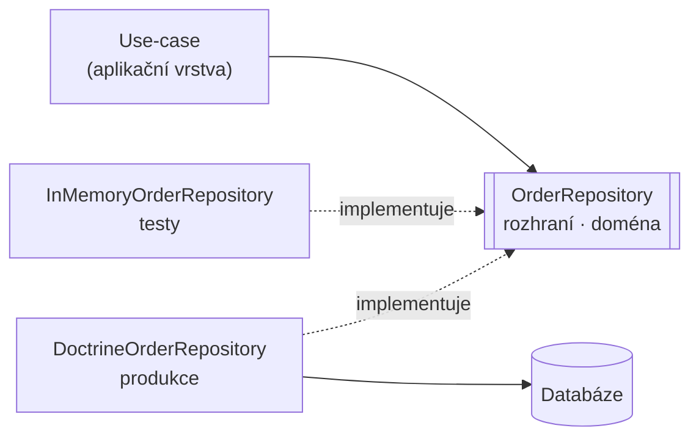

# Repository (Repozitář)

> [← zpět na PoEAA](../)

> **V jedné větě:** Rozhraní, které se tváří jako kolekce doménových objektů v paměti — a schová za sebe všechno, co se ve skutečnosti děje s [persistencí](../../Glossary.md#persistence).

---

## Problém

Znalost o tom, jak se data ukládají a čtou, se rozteče po celé aplikaci. Doménový kód začne znát tabulky, sloupce a joiny — a tím přestane být doménový.

**Poznáš to podle:**

- SQL nebo `createQueryBuilder()` v use-case, v controlleru, ve službě
- **tentýž dotaz na několika místech**, pokaždé o kousek jinak; jedna z kopií zapomněla na `deleted_at IS NULL`
- sestavení objektu z řádku (`new Order($row['id'], …)`) se opakuje pokaždé znovu
- test logiky potřebuje databázi, protože jinak se k datům nedostane
- entita má `id === null`, dokud se neudělá `flush()`, a půlka kódu s tím musí počítat
- nikdo neví, kde se objednávky vlastně načítají — je to na sedmi místech

```php
// Před: doménová služba ví o tabulkách, sloupcích i o tom, že existuje SQL
final class OverdueOrderService
{
    public function __construct(
        private Connection $db,
    ) {
    }

    public function notifyOverdue(): void
    {
        $rows = $this->db->fetchAllAssociative(
            'SELECT * FROM orders WHERE is_paid = 0 AND placed_at < ?',
            [(new DateTimeImmutable('-7 days'))->format('Y-m-d H:i:s')],
        );

        foreach ($rows as $row) {
            // sestavení objektu z řádku — a totéž o tři soubory dál znovu
            $order = new Order();
            $order->setId($row['id']);
            $order->setEmail($row['customer_email']);
            $order->setTotal((int) $row['total_cents']);

            $this->mailer->send($order);
        }
    }
}
```

Změna sloupce `is_paid` na `payment_status` znamená projít celou aplikaci a doufat, že jsi na nic nezapomněl.

---

## Řešení

Postav před persistenci rozhraní, které se chová jako **kolekce objektů v paměti**. Volající si přidává, hledá a odebírá; že za tím je databáze, poznat nemá.

```php
interface OrderRepository
{
    public function nextIdentity(): OrderId;

    public function save(Order $order): void;

    public function remove(OrderId $id): void;

    /** @throws OrderNotFound */
    public function get(OrderId $id): Order;

    /** @return list<Order> */
    public function unpaidPlacedBefore(DateTimeImmutable $moment): array;
}
```



Dvě věci na tom diagramu jsou podstatné:

1. **Rozhraní patří do domény**, implementace do infrastruktury. Šipky míří dovnitř — je to tentýž princip jako u [Ports & Adapters](../../Architecture/PortsAndAdapters/), repository je jeho nejběžnější [řízený port](../../Architecture/PortsAndAdapters/#dvě-strany-na-jednu-se-zapomíná).
2. **Implementace může být víc.** Ta v paměti není hračka na ukázku; je to ta, kterou pouštíš v testech.

### Iluze kolekce

Tohle je jádro patternu a zároveň to, co se z něj v praxi nejčastěji ztratí. Repository má vypadat, jako bys pracoval s polem objektů:

```php
$order = $orders->get($id);          // ne „SELECT“
$orders->save($order->markPaid());   // ne „UPDATE“
$orders->remove($id);                // ne „DELETE“
```

Jakmile se v rozhraní objeví `flush()`, `getQueryBuilder()`, `beginTransaction()` nebo `array $criteria`, iluze praskla a doména zase ví o databázi.

### Identitu vyrábí aplikace, ne databáze

Detail s velkým dopadem. `nextIdentity()` znamená, že **agregát je platný od chvíle, kdy vznikne** — nemusíš čekat na `INSERT`, abys znal jeho ID:

```php
$id = $orders->nextIdentity();       // žádný dotaz do databáze
$order = Order::place($id, $email, $total, $now);

// můžeš rovnou publikovat událost, logovat, vrátit číslo uživateli
$orders->save($order);
```

Odpadá tím celá kategorie problémů kolem „ID je null, dokud se neflushne“ a s ní i objekty, které jsou chvíli v polovičatém stavu.

### Dotazy pojmenované záměrem

Metoda se má jmenovat podle toho, **na co se ptáš**, ne podle toho, jak se to filtruje:

```php
// Ano — čitelné, testovatelné, dá se optimalizovat na jednom místě
$orders->unpaidPlacedBefore($sevenDaysAgo);

// Ne — jen jinak zapsané SQL, doména z toho nic nemá
$orders->findBy(['is_paid' => 0, 'placed_at' => ['<', $sevenDaysAgo]]);
```

---

## Účastníci

| Role | V příkladu | Odpovědnost |
| ---- | ---------- | ----------- |
| **Repository** (rozhraní) | `OrderRepository` | Kontrakt v pojmech domény; vlastní ho doména |
| **Kořen agregátu** | `Order` | To jediné, na co se repository zakládá |
| **Identita** | `OrderId` | Value object; vzniká v aplikaci, ne v databázi |
| **Konkrétní repository** | `SqliteOrderRepository` | Mapování doména ↔ úložiště, dotazy |
| **Testovací repository** | `InMemoryOrderRepository` | Táž smlouva bez infrastruktury |
| **Klient** | use-case, doménová služba | Zná jen rozhraní |

---

## Implementace v PHP

Mapování je celá práce konkrétní implementace — a je to jediné místo, kde smí být znalost o sloupcích:

```php
final class SqliteOrderRepository implements OrderRepository
{
    public function __construct(
        private readonly PDO $connection,
    ) {
    }

    public function nextIdentity(): OrderId
    {
        // Identita nevzniká v databázi — nepotřebujeme INSERT, abychom ji znali.
        return OrderId::generate();
    }

    public function get(OrderId $id): Order
    {
        return $this->find($id) ?? throw OrderNotFound::withId($id);
    }

    public function find(OrderId $id): ?Order
    {
        $statement = $this->connection->prepare('SELECT * FROM orders WHERE id = :id');
        $statement->execute(['id' => $id->value]);

        $row = $statement->fetch(PDO::FETCH_ASSOC);

        return $row === false ? null : $this->toOrder($row);
    }

    public function countUnpaid(): int
    {
        // Agregace patří do databáze. Načíst všechno do PHP a spočítat to tam
        // je přesně ta chyba, které se repository má vyhnout.
        return (int) $this->connection
            ->query('SELECT COUNT(*) FROM orders WHERE is_paid = 0')
            ->fetchColumn();
    }

    /** řádek → doména */
    private function toOrder(array $row): Order
    {
        return Order::reconstitute(
            OrderId::fromString((string) $row['id']),
            (string) $row['customer_email'],
            (int) $row['total_cents'],
            (bool) $row['is_paid'],
            new DateTimeImmutable((string) $row['placed_at']),
        );
    }
}
```

Povšimni si `Order::reconstitute()` vedle `Order::place()`. Zakládání objednávky má doménová pravidla (kladná částka, výchozí stav); **rekonstrukce z databáze je nemá znovu procházet** — ta data už jednou platná byla. Míchat obojí do jednoho konstruktoru vede k tomu, že buď nejde načíst historický záznam, nebo se pravidlo obchází i při zakládání.

### `add()` nebo `save()`?

Fowlerova definice mluví o kolekci, a do kolekce se `add()`. Jenže to platí jen s ORM, které sleduje změny:

| | S Doctrine (Unit of Work) | Bez ORM (ruční SQL, in-memory) |
| --- | --- | --- |
| Nový objekt | `$orders->add($order)` | `$orders->save($order)` |
| Změna existujícího | **nic** — `flush()` to pozná sám | `$orders->save($order)` |
| Iluze kolekce | Úplná | Částečná — `save()` prozrazuje, že se něco ukládá |

Obojí je v pořádku, jen to nemíchej v rámci jednoho projektu. V demu je `save()`, protože obě implementace jsou psané ručně a žádné sledování změn nemají.

### Jak nedopustit repository o čtyřiceti metodách

Nejčastější konec tohohle patternu: rozhraní, které roste s každou obrazovkou, až má `findPaidByCustomerOrderedByDateWithItems()`. Máš tři východiska:

| Řešení | Kdy sáhnout | Cena |
| ------ | ----------- | ---- |
| **[Specification](../../DDD/Specification/)** | Kritéria se kombinují a mají doménový význam | Překlad specifikace do SQL je netriviální — viz varování u toho patternu |
| **Samostatná read-model služba** | Dotaz je pro obrazovku, ne pro doménu | Druhá cesta k datům; ale je to poctivější než ohýbat repository |
| **Nová doménová metoda** | Dotazů je málo a mají jasný záměr | Nejjednodušší; funguje, dokud jich nejsou desítky |

Prakticky: **repository je pro zápisovou stranu.** Když potřebuješ tabulku s filtry, stránkováním a joiny přes tři agregáty pro výpis v administraci, nepiš to do repository — udělej si `OrderListQuery`, které vrátí čtecí DTO a klidně sáhne přímo na SQL. Doména z toho nic nemá a repository zůstane čitelné. Domyšleno do konce je tohle [CQRS](../../Architecture/CQRS/) — a nepotřebuje k tomu ani druhou databázi, ani Event Sourcing.

### Kam to dát ve složkách

```
src/
    Domain/Order/
        Order.php                    kořen agregátu
        OrderId.php
        OrderNotFound.php
        OrderRepository.php          ← ROZHRANÍ patří sem
    Infrastructure/Persistence/
        DoctrineOrderRepository.php  ← implementace sem
    Tests/Double/
        InMemoryOrderRepository.php
```

Symfony pak jen spojí obojí:

```yaml
Domain\Order\OrderRepository: '@Infrastructure\Persistence\DoctrineOrderRepository'
```

### Použití

```php
// Aplikační kód nezná ani jednu implementaci.
function markOverdue(OrderRepository $orders, DateTimeImmutable $now): int
{
    $stale = $orders->unpaidPlacedBefore($now->modify('-7 days'));

    foreach ($stale as $order) {
        $orders->save($order->cancel());
    }

    return count($stale);
}

// V testu
markOverdue(new InMemoryOrderRepository(), $now);

// V produkci
markOverdue(new DoctrineOrderRepository($entityManager), $now);
```

---

## Kdy použít

- ✅ Máš **doménový model**, který chceš držet nezávislý na tom, jak se ukládá.
- ✅ Potřebuješ **testovat bez databáze** — a myslíš to vážně.
- ✅ Tentýž dotaz se používá na víc místech a nemá se rozejít.
- ✅ Uvažuješ o **výměně nebo doplnění úložiště** (jiná DB, cache, cizí API).
- ✅ Chceš, aby bylo na jednom místě vidět, **jak se s agregátem pracuje**.

## Kdy nepoužít

- ❌ **Jednoduchá CRUD aplikace nad tabulkou.** Když je „doména“ jen formulář, přidá repository vrstvu navíc a nic za ni nedostaneš. Použij, co framework nabízí.
- ❌ **Repository jen jako obal ORM.** Rozhraní, které jen přeposílá `findBy()` do Doctrine, je práce navíc bez užitku. Buď mluv doménově, nebo to nedělej.
- ❌ **Reporting a složité výpisy.** Repository pro ně není; udělej read-model službu.
- ❌ **Nemáš agregáty.** Když jsou entity anemické a pravidla jsou v service vrstvě, repository jen přesune SQL o soubor vedle.

---

## Časté chyby

| Chyba | Proč vadí | Jak správně |
| ----- | --------- | ----------- |
| Rozhraní leží v infrastruktuře vedle implementace | Závislost míří ven; doména zase závisí na Doctrine | Rozhraní patří do domény |
| V rozhraní jsou `flush()`, `getQueryBuilder()`, `array $criteria` | Iluze kolekce praskla, ORM proteklo do domény | Metody v pojmech domény |
| Repository pro každou entitu, i pro položku agregátu | Části agregátu jde měnit mimo něj a přestanou platit jeho pravidla | Repository jen pro **kořeny agregátů** |
| `find()` vrací `null` a volající to nikde neřeší | Chyba se projeví o tři vrstvy dál jako „call on null“ | `get()` vyhodí doménovou výjimku, `find()` nechej jen tam, kde je nepřítomnost normální stav |
| Repository roste o metodu za každou obrazovku | Po roce má čtyřicet metod a nikdo neví, které se používají | Specification, nebo samostatné read-modely |
| Filtrování a počítání v PHP nad `all()` | Funguje na 50 řádcích, položí aplikaci na 500 000; typicky se k tomu přidá [N+1](../../Glossary.md#n1) | `WHERE` a `COUNT()` patří do databáze |
| In-memory implementace se chová jinak než ostrá | Testy zeleně, produkce jinak. **Typicky řazení** — SQL má `ORDER BY`, paměťová vrací pořadí vložení | Napiš jednu sadu testů proti rozhraní a **pusť ji na obě implementace** |
| Rekonstrukce z databáze prochází zakládacími pravidly | Historický záznam nejde načíst, protože dnešní pravidlo tehdy neplatilo | Oddělená továrna `reconstitute()` vedle `place()` |
| Repository vrací `array` | Volající si dělá `array_map`/`array_filter` sám a logika se rozutíká | Zvaž návrat [First Class Collection](../../ObjectCalisthenics/FirstClassCollection/) |

---

## V praxi

- **Doctrine** — `EntityRepository` je repository jen napůl: zná dotazy, ale je součástí ORM a rovnou nabízí `findBy()`. Doporučený postup je rozhraní v doméně a vlastní implementace, která si `EntityRepository` drží uvnitř (ne z něj dědí).
- **Doctrine `Criteria`** — most mezi repository a [Specification](../../DDD/Specification/); běží v paměti i v SQL.
- **Symfony DI** — vazba rozhraní na implementaci jedním řádkem v `services.yaml`.
- **Testy** — praktické měřítko: když unit test use-case sahá na databázi, repository buď chybí, nebo netěsní.

---

## Související patterny

| Pattern | Vztah |
| ------- | ----- |
| [Ports & Adapters](../../Architecture/PortsAndAdapters/) | Repository **je [řízený port](../../Architecture/PortsAndAdapters/#dvě-strany-na-jednu-se-zapomíná)** — ten nejběžnější. Hexagon říká *proč* rozhraní patří do domény, Repository *jak* má vypadat. |
| [Specification](../../DDD/Specification/) | Odpověď na repository o čtyřiceti metodách: kritérium se předá jako objekt. Pozor na překlad do SQL. |
| [Value Object](../../DDD/ValueObject/) | `OrderId` je value object. Repository jimi mluví místo `int` a `string`. |
| [First Class Collection](../../ObjectCalisthenics/FirstClassCollection/) | Přirozený návratový typ místo `array` — výsledek pak nese doménové operace. |
| [Data Mapper](../DataMapper/) (PoEAA) | **Vrstva pod repository**, která překládá objekt na řádek. Doctrine je Data Mapper; repository je fasáda nad ním v jazyce domény. |
| [Optimistic Offline Lock](../OptimisticOfflineLock/) (PoEAA) | Místo, kde se kontroluje verze — `save()` buď projde, nebo vyhodí konflikt. |
| [Singleton](../../GoF/Creational/Singleton/) (GoF) | **Častá oběť.** `Repository::getInstance()` znemožní in-memory implementaci v testech — a tím i celý přínos tohohle patternu. |
| [Factory Method](../../GoF/Creational/FactoryMethod/) (GoF) | `nextIdentity()` je továrna na identitu — proto může agregát vzniknout platný ještě před uložením. |
| [Unit of Work](../UnitOfWork/) (PoEAA) | Sleduje změny a zapisuje je najednou. Díky němu stačí `add()` a `save()` pro změny netřeba. |
| [Aggregate](../../DDD/Aggregate/) (DDD) | Určuje, pro co repository vůbec smí vzniknout — **jeden agregát, jedno repository**. Repository pro vnitřní entitu je druhá cesta dovnitř, která obchází všechna pravidla celku. |
| [Entity](../../DDD/Entity/) (DDD) | To, co repository načítá a ukládá. Odtud pochází `nextIdentity()` i oddělené `reconstitute()`. |
| [Bounded Context](../../DDD/BoundedContext/) | Repository patří dovnitř kontextu. Do cizího kontextu se nesahá jeho repositorym, ale překladem na hranici. |
| **Identity Map** (PoEAA) | Zaručuje, že tentýž agregát načtený dvakrát je tentýž objekt. V Doctrine je součástí Unit of Work. |
| [Service Layer](../ServiceLayer/) | Nejběžnější konzument repository — use-case si o něj řekne v konstruktoru. |
| [CQRS](../../Architecture/CQRS/) | Odpověď na repository o čtyřiceti metodách dotažená do konce: výpisy dostanou vlastní cestu k datům, repository zůstane jen pro zápis. |

---

## Vztah k principům

| Princip | Jak souvisí |
| ------- | ----------- |
| [DIP](../../Principles/SOLID.md#dependency-inversion-principle-dip) | Učebnicový příklad: rozhraní vlastní doména, infrastruktura se mu přizpůsobuje. |
| [SRP](../../Principles/SOLID.md#single-responsibility-principle-srp) | Mapování doména ↔ úložiště má jedno místo. Změna schématu se nedotkne domény. |
| [ISP](../../Principles/SOLID.md#interface-segregation-principle-isp) | Důvod, proč repository nemá mít čtyřicet metod. Když je konzument potřebuje jen tři, rozděl kontrakt. |
| [LSP](../../Principles/SOLID.md#liskov-substitution-principle-lsp) | In-memory implementace musí být **plnohodnotná náhrada** té ostré. Jiné řazení nebo jiné chování při chybějícím záznamu je porušení — a testy pak lžou. |

---

## Demo

```bash
php PoEAA/Repository/demo/run.php
```

Funkce `exercise()` projde celý životní cyklus agregátu — identita, uložení, načtení, doménový dotaz, agregace, změna, odebrání. Spustí se dvakrát: nad implementací v paměti a nad skutečnou SQLite databází. **Mezi během 1 a 2 se nezmění ani písmeno volajícího kódu.**

---

## Původ

|               |                                                    |
| ------------- | -------------------------------------------------- |
| **Zdroj**     | *Patterns of Enterprise Application Architecture*   |
| **Autor**     | Martin Fowler                                       |
| **Rok**       | 2002                                                |
| **Kategorie** | — (PoEAA kategorie nemá)                            |
| **Obtížnost** | ●●●○○                                               |

Fowler pattern popsal větou, která platí dodnes: *„Mediates between the domain and data mapping layers using a collection-like interface for accessing domain objects.“* Klíčové slovo je **collection-like** — repository nemá být obal nad SQL, má se tvářit jako kolekce.

O rok později ho **Eric Evans** zařadil do *Domain-Driven Design* (2003) s jiným důrazem, a rozdíl mezi oběma pojetími stojí za zapamatování:

| | **Fowler (PoEAA, 2002)** | **Evans (DDD, 2003)** |
| --- | --- | --- |
| Pro co vzniká | Pro doménový objekt obecně | **Jen pro kořeny agregátů** |
| Hlavní důraz | Zapouzdření dotazů, oddělení od mapování dat | Ochrana hranice agregátu |
| Typický obsah | Dotazovací metody, kritéria | Kolekce agregátů, `nextIdentity()` |

V praxi se používá směs obojího a tenhle text taky: Fowlerova iluze kolekce plus Evansovo pravidlo, že repository se zakládá **jen na kořeny agregátů**. To druhé je to, co brání rozpadu modelu — kdyby měla vlastní repository i položka objednávky, šlo by ji měnit mimo objednávku a pravidla, která objednávka hlídá, by přestala platit.

Sem je pattern zařazený podle Fowlera, protože PoEAA je jeho pojmenovaný původ a vyšlo o rok dřív.

---

## Zdroje

- Martin Fowler: *Patterns of Enterprise Application Architecture*, Addison-Wesley, 2002 — Repository, str. 322
- Eric Evans: *Domain-Driven Design*, Addison-Wesley, 2003 — kapitola 6
- [Doctrine: Working with Objects](https://www.doctrine-project.org/projects/doctrine-orm/en/current/reference/working-with-objects.html)

---

<details>
<summary>Metadata patternu</summary>

```yaml
name: Repository
name_cs: Repozitář
category: —
source: PoEAA – Patterns of Enterprise Application Architecture
authors: Martin Fowler
year: 2002
difficulty: 3
tags: [persistence, doménový model, agregát, testovatelnost, zapouzdření]
principles: [DIP, SRP, ISP, LSP]
related: [PortsAndAdapters, Specification, ValueObject, FirstClassCollection, DataMapper, UnitOfWork, Aggregate, IdentityMap]
status: done
```

</details>
