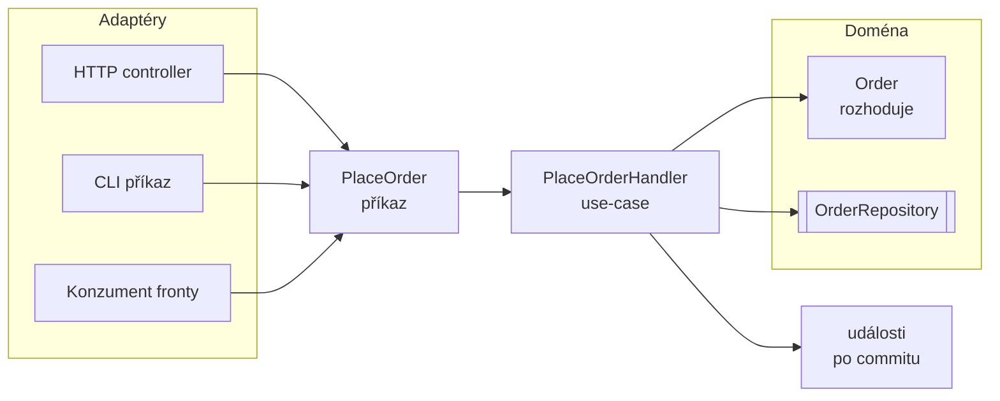

# Service Layer (Aplikační vrstva)

> [← zpět na PoEAA](../)

> **V jedné větě:** Tenká vrstva na hranici aplikace, která pro každou operaci **zorganizuje** práci domény — a sama nerozhoduje o ničem byznysovém.

---

## Jak se tomu říká

Tenhle pattern má čtyři jména a všechna míří na totéž. Stojí za to je znát, protože každé pochází z jiného světa a v diskusi na ně narazíš:

| Jméno | Odkud | Jak se jmenuje ta třída |
| ----- | ----- | ----------------------- |
| **Service Layer** | Fowler, PoEAA 2002 | `OrderService` — jedna třída, víc metod |
| **Application Service** | Evans, DDD 2003 | Totéž ve slovníku DDD; důraz na „žádná doménová logika“ |
| **Use Case** | Clean Architecture, 2012 | **`Interactor`** — jedna třída na jednu operaci |
| **Command / Query Handler** | CQRS a sběrnice, ~2010 | `PlaceOrderHandler` — vstupem je pojmenovaný příkaz |

Dvě upřesnění, na kterých v diskusi záleží:

- **Clean Architecture slovo „handler“ nepoužívá.** Ta vrstva se jmenuje *Use Cases* a třída v ní je **Interactor** — pojem, který Robert C. Martin převzal z Jacobsonova vzoru *Entity–Boundary–Interactor* (Objectory, 1992). „Handler“ pochází ze světa **sběrnic a CQRS**, kde označuje to, co obslouží konkrétní zprávu.
- **Rozdíl mezi těmi jmény není v odpovědnosti, ale v granularitě** — a k té se dostaneme [níž](#jedna-služba-nebo-třída-na-operaci).

Tenhle text říká **use-case** pro tu operaci a **handler** pro třídu, která ji provádí — protože to je pojmenování, které se v PHP ustálilo. Když někdo řekne *interactor*, myslí totéž.

---

## Problém

Někam musí přijít kód, který drží operaci pohromadě: načti, ověř oprávnění, otevři transakci, nech doménu rozhodnout, ulož, oznam. Když pro něj neexistuje vrstva, usadí se na dvou špatných místech.

**Poznáš to podle:**

- **tlustý controller** — v HTTP vrstvě je transakce, oprávnění i rozhodování o doméně
- táž operace existuje **dvakrát**, protože z fronty ji přes controller zavolat nešlo
- naopak **jedna služba na všechno**: `OrderService` s osmi závislostmi a čtrnácti metodami
- žádná z těch metod nepotřebuje víc než tři závislosti, ale dostane všech osm
- test jedné operace musí namockovat celý svět
- nikdo neumí říct, **co aplikace vlastně umí** — není kam ukázat
- nejasné, **co obaluje transakce**

Demo to změří:

```
Before\OrderService               závislostí: 8, veřejných metod: 9
Application\PlaceOrderHandler     závislostí: 3, veřejných metod: 1
Application\CancelOrderHandler    závislostí: 2, veřejných metod: 1
```

`CancelOrderHandler` úvěrový limit nepotřebuje, tak si o něj neřekne. Ve velké službě by ho dostal taky — konstruktor je jeden pro všechny.

---

## Řešení

Jedna třída na jednu operaci. Dostane **příkaz** (co se má stát), zorganizuje práci a vrátí nanejvýš identitu.



Kostra každého use-case vypadá skoro stejně — a je to dobře:

```php
public function handle(PlaceOrder $command): string
{
    // 1. posbírej, co doména potřebuje (cizí agregáty, čas, kurzy)
    $limit = $this->credit->limitFor($command->customerId);

    // 2.–4. nech doménu rozhodnout a ulož
    $order = Order::place($this->orders->nextIdentity(), $command->customerId, $command->totalInCents, $limit);

    $this->orders->save($order);

    // 5. až po uložení publikuj, co se stalo
    $this->events->publish('order.placed', ['orderId' => $order->id->value]);

    // ven jde identita, ne agregát
    return $order->id->value;
}
```

Pět kroků, a **ani jeden z nich není byznysové rozhodnutí**.

### Co do aplikační vrstvy patří a co ne

Nejdůležitější a nejčastěji řešená otázka celého patternu. Existuje na ni jedna spolehlivá kontrolní otázka:

> **Platilo by to pravidlo i tehdy, kdyby aplikace neměla HTTP, frontu ani databázi?**
>
> Ano → **doména.** Ne → **use-case.**

| Do use-case | Do domény |
| ----------- | --------- |
| Transakce | Doménová pravidla a invarianty |
| Oprávnění (*smí to tenhle uživatel?*) | Platnost (*dá se to vůbec?*) |
| Načtení cizích agregátů a jejich předání | Výpočty nad vlastními daty |
| Publikace událostí po commitu | Rozhodnutí, že se událost stala |
| Překlad doménové výjimky na odpověď | Vyhození té výjimky |
| Volání externích služeb | — |
| Logování a metriky | — |

Praktický příznak: **`if` o byznysu v use-case je vždycky podezřelý.** Use-case koordinuje, nerozhoduje.

### Proč pravidlo v use-case nestačí

Nejčastější obhajoba zní: *„to pravidlo potřebuje data z jiného agregátu, tak ať to řeší aplikační vrstva.“* Vypadá to rozumně. Demo ukazuje, co to udělá.

Pravidlo o úvěrovém limitu je v `PlaceOrderHandler`. Funguje:

```
přes PlaceOrderHandler (pravidlo tam je):
    Objednávka přesahuje úvěrový limit.   ← zachyceno
```

O půl roku později napíše někdo jiný import z CSV:

```
přes ImportOrdersHandler (jiná cesta, o pravidle neví):
    IMP-0  zákazník CUST-BEZNY   9 000 Kč   ← limit 2 000 Kč, PROŠLO
    IMP-1  zákazník CUST-BEZNY  45 000 Kč   ← limit 2 000 Kč, PROŠLO
```

**Import nikdo nenapsal špatně.** Autor jen nemohl vědět o pravidle, které bydlí v cizím use-case místo v doméně.

Řešení té původní námitky je přitom snadné: cizí data si **nenačítá doména**, ale use-case — a doméně je předá jako parametr:

```php
$limit = $this->credit->limitFor($command->customerId);      // use-case načte

Order::place($id, $customerId, $total, $limit);              // doména rozhodne
```

Doména dostane vše potřebné a rozhodne sama. Zůstane testovatelná bez infrastruktury a pravidlo platí pro **každou** cestu dovnitř.

### Jedna služba, nebo třída na operaci?

| | **Jedna služba s metodami** | **Třída na use-case** |
| --- | --- | --- |
| Závislosti | Sjednocení všech operací | Jen co ta jedna potřebuje |
| Test | Namockuj všechno | Namockuj dvě věci |
| Přidání operace | Zásah do rostoucího souboru | Nový soubor |
| Najdi, co aplikace umí | Přečti 600 řádků | Vypiš složku |
| Autorizace, transakce, logy | `if` uvnitř metod | Dekorátor nebo middleware kolem handleru |
| Kdy stačí | 3–4 operace, které se nerozrostou | Cokoli většího |

**Výchozí volba je třída na use-case.** Nevýhodou je víc souborů; výhodou je, že složka `Application/` je čitelný seznam toho, co aplikace umí — a že se každý handler dá obalit dekorátorem, aniž by to ovlivnilo ostatní.

### Vstup a výstup

Dvě pravidla, která drží hranici:

**Vstup je pojmenovaný příkaz, ne hromada parametrů.** `PlaceOrder`, ne `place(string $a, int $b, ?string $c = null)`. Adaptér přeloží HTTP request, CLI argumenty nebo zprávu z fronty do téhož tvaru — a use-case pak nemusí vědět, odkud podnět přišel.

**Ven jde identita nebo čtecí [DTO](../../Glossary.md#dto--data-transfer-object), nikdy agregát.** Kdyby use-case vracel `Order`, mohl by ho controller změnit mimo transakci a mimo pravidla. A šablona by si na něm začala volat gettery, čímž by se doména začala ohýbat kvůli zobrazení — viz [CQRS](../../Architecture/CQRS/).

### A co dotazy?

Zatím byla řeč o příkazech — o operacích, které něco mění. Dotazy se v aplikační vrstvě chovají **jinak**, a stojí za to vědět jak.

| | **Příkazový handler** | **Dotazovací handler** |
| --- | --- | --- |
| Transakce | Ano | **Ne** — nic se nemění |
| Publikuje události | Ano | **Ne** — nic se nestalo |
| Prochází agregátem | Ano | **Ne** — pravidla nemají co chránit |
| Vrací | Identitu | **Čtecí DTO** |
| Lze cachovat | Ne | **Ano** |
| Dá se odmítnout | Ano | Ne, jen zamítnout přístup |

Tohle je [CQS](../../Principles/ObjectDesign.md#cqs--command-query-separation) povýšené z metody na use-case — a je to zároveň důvod, proč je dotazovací handler **tenký až podezřele**. Často jen přebere parametry a předá je čtecí službě:

```php
final readonly class OrderSummaryHandler
{
    public function __construct(
        private OrderReadSource $source,
    ) {
    }

    /** @return list<OrderSummary> */
    public function handle(OrderSummaryQuery $query): array
    {
        return $this->source->summariesFor($query->customerId, $query->limit);
    }
}
```

A tady vzniká legitimní otázka: **není to ta „vrstva bez obsahu“, před kterou tenhle text sám varuje?**

#### Kdy dotazovací handler zavést

| Zaveď ho, když | Vynech ho, když |
| -------------- | --------------- |
| Chceš **jednotnou sběrnici** a kolem obojího tytéž middleware | Máš pár jednoduchých čtení a žádné průřezové starosti |
| Dotaz potřebuje **autorizaci** („vidí tenhle uživatel cizí objednávky?“) | Autorizaci řeší už firewall nebo voter nad controllerem |
| Výsledek se dá **cachovat** a chceš to na jednom místě | Cache je stejně na úrovni HTTP |
| Dotaz má **parametry, které si zaslouží jméno** — filtry, stránkování, řazení | Předáváš jedno ID |
| Skládáš data z **víc zdrojů** | Je to jedno SQL |

Hlavní argument je ten první a demo ho ukazuje: **když má dotaz i příkaz stejný tvar `handle($vstup): $výstup`, jde kolem obou obalit cokoli průřezového** — cache, autorizaci, měření času, audit — jedním dekorátorem místo copy-paste do každé metody.

```
4× tentýž dotaz přes dekorátor:
    zásahy do cache: 3, minutí: 1
    volání čtecího zdroje celkem: 2
```

**Když žádný takový důvod nemáš, zavolej čtecí službu z controlleru rovnou.** Dotazovací handler zavedený jen kvůli symetrii s příkazy je stovka jednořádkových tříd bez obsahu — a to je přesně ta ceremonie, kterou sekce [Kdy nepoužít](#kdy-nepoužít) odmítá.

> Kam vede čtecí strana dál — vlastní modely, vlastní úložiště, projekce — řeší [CQRS](../../Architecture/CQRS/). Tenhle pattern se zastavuje u toho, jestli má dotaz dostat handler.

### Application service není domain service

Dvojice, která se plete pravidelně, protože obojí končí na „service“:

| | **Application service** (use-case) | **Domain service** |
| --- | --- | --- |
| Kde žije | Aplikační vrstva | **Doména** |
| Co obsahuje | Orchestraci | **Doménovou logiku** |
| Kdy vzniká | Pro každou operaci aplikace | Když pravidlo nepatří žádné entitě |
| Zná infrastrukturu | Ano (transakce, události) | **Ne** |
| Příklad | `PlaceOrderHandler` | `ExchangeRateConverter`, `PriceCalculator` |

Domain service je pořád doména — nesmí znát transakce ani databázi. Když by ji potřeboval, není to domain service, ale use-case.

---

## Účastníci

| Role | V příkladu | Odpovědnost |
| ---- | ---------- | ----------- |
| **Příkaz** | `PlaceOrder`, `CancelOrder` | Vstupní kontrakt; popisuje záměr |
| **Use-case** | `PlaceOrderHandler` | Zorganizuje operaci; nerozhoduje |
| **Doména** | `Order` | Rozhoduje a hlídá pravidla |
| **Porty** | `OrderRepository`, `CustomerCredit` | Co use-case potřebuje zvenčí |
| **Dotaz** | `OrderSummaryQuery` | Vstupní kontrakt čtení; bez vedlejších efektů |
| **Čtecí DTO** | `OrderSummary` | Tvar obrazovky; žádné chování |
| **Adaptér** | controller, CLI, konzument | Přeloží podnět na příkaz nebo dotaz |

---

## Implementace v PHP

```php
final readonly class PlaceOrderHandler
{
    public function __construct(
        private OrderRepository $orders,
        private CustomerCredit $credit,
        private EventPublisher $events,
    ) {
    }

    public function handle(PlaceOrder $command): string
    {
        $limit = $this->credit->limitFor($command->customerId);

        $order = Order::place(
            $this->orders->nextIdentity(),
            $command->customerId,
            $command->totalInCents,
            $limit,
        );

        $this->orders->save($order);
        $this->events->publish('order.placed', ['orderId' => $order->id->value]);

        return $order->id->value;
    }
}
```

Jedna veřejná metoda. Pojmenuj ji konzistentně napříč projektem — `handle()`, `execute()` nebo `__invoke()`; na tom, kterou zvolíš, nezáleží, na tom, že je všude stejná, ano.

### Průřezové věci patří kolem, ne dovnitř

Transakce, autorizace, logování a měření času nemají být v každém handleru zkopírované. Zabal handler:

```php
final readonly class TransactionalHandler
{
    public function __construct(
        private object $inner,
        private Connection $connection,
    ) {
    }

    public function handle(object $command): mixed
    {
        return $this->connection->transactional(fn (): mixed => $this->inner->handle($command));
    }
}
```

To je [Decorator](../../GoF/Structural/Decorator/) — a v Symfony Messengeru je to přímo middleware kolem sběrnice, takže si to psát nemusíš.

### Sběrnice, nebo přímé volání?

V praxi se s use-case skoro vždycky potká **command bus / query bus** — sběrnice, které předáš příkaz a ona najde a zavolá jeho handler:

```php
// Přímé volání — controller zná konkrétní handler
$orderId = $this->placeOrderHandler->handle(new PlaceOrder($customerId, $total));

// Přes sběrnici — controller zná jen sběrnici
$orderId = $this->commandBus->dispatch(new PlaceOrder($customerId, $total));
```

Dvě sběrnice, ne jedna, a je to záměr: **příkazová** může mít middleware na transakci a asynchronní transport, **dotazovací** cache a jinou autorizaci. Sjednotit je znamená přijít o to hlavní.

| | **Přímé volání** | **Sběrnice** |
| --- | --- | --- |
| Průřezové věci | Dekorátor kolem každého handleru | **Middleware na jednom místě** |
| Asynchronní zpracování | Musíš si ho zařídit | Přepnutí transportu |
| Navigace v IDE | Skočíš na implementaci | **Nejde** — vazba příkaz → handler je za běhu |
| Stack trace | Krátký a čitelný | Prochází vrstvami sběrnice |
| Nový vývojář | Vidí, co se volá | Musí vědět, že sběrnice existuje a jak mapuje |
| Kdy | Pár operací, žádné průřezové starosti | Desítky operací, transakce, fronty, audit |

Nejdůležitější věta té tabulky: **sběrnice není podmínka toho, abys měl use-case.** Ty dvě věci se pletou často — tým chce oddělit aplikační vrstvu a rovnou si nainstaluje Messenger, protože „tak se to dělá“. Handler s vlastním konstruktorem funguje sám o sobě a controller ho může volat přímo; sběrnici přidej, až když ti dojde, že píšeš tentýž dekorátor potřetí.

Nevýhoda, kterou je dobré znát dopředu, je ta s navigací: u sběrnice **nedoskáčeš z místa odeslání na handler**, protože ta vazba vzniká až za běhu. U tří operací je to jedno, u sta se to pozná.

### Kam to dát ve složkách

```
src/Order/
    Application/
        PlaceOrder.php               příkaz
        PlaceOrderHandler.php        use-case
        CancelOrder.php
        CancelOrderHandler.php
        CustomerCredit.php           port, který use-case potřebuje
    Domain/
        Order.php
        OrderRepository.php
    Infrastructure/
        DoctrineOrderRepository.php
```

Složka `Application/` je pak **čitelný seznam toho, co aplikace umí**. To je vedlejší efekt, ale patří k nejužitečnějším.

---

## Kdy použít

- ✅ Do téže operace se vstupuje **víc cestami** — HTTP, fronta, CLI, cron.
- ✅ Máš **doménový model**, který je potřeba někde zorganizovat.
- ✅ Potřebuješ jasnou hranici pro **transakci a autorizaci**.
- ✅ Chceš, aby šlo vypsat, co aplikace umí.
- ✅ Chceš testovat operace bez HTTP.

## Kdy nepoužít

- ❌ **Čisté CRUD nad tabulkou.** Handler, který jen přepošle volání do repository, je vrstva bez obsahu.
- ❌ **Jedna cesta dovnitř a triviální operace.** Malý controller volající repository je čitelnější než tři soubory.
- ❌ **Jako místo pro doménovou logiku.** To je ten nejdražší způsob, jak tenhle pattern použít špatně — viz demo.
- ❌ **Handler na každý dotaz do databáze.** Čtení nepotřebuje orchestraci; tam patří [čtecí model](../../Architecture/CQRS/).

---

## Časté chyby

| Chyba | Proč vadí | Jak správně |
| ----- | --------- | ----------- |
| **Byznysové pravidlo v use-case** | Chrání jen tu jednu cestu; druhý vstupní bod ho obejde a nikdo si toho nevšimne | Pravidlo do domény, cizí data předej parametrem |
| Jedna služba se čtrnácti metodami | Každá operace dostane všechny závislosti; test mockuje celý svět | Třída na use-case |
| Use-case vrací agregát | Controller ho může změnit mimo transakci; šablona si na něm volá gettery | Vrať identitu nebo čtecí DTO |
| Vstup jako sada parametrů | Nejde poznat záměr; při šestém parametru to nikdo nepřečte | Pojmenovaný příkaz |
| Transakce v controlleru | Z fronty se operace zavolá bez ní | Transakce v aplikační vrstvě (nebo dekorátorem kolem ní) |
| Události se publikují před commitem | Reakce proběhnou i pro operaci, která se vrátila zpět | Až po commitu — viz [Domain Event](../../DDD/DomainEvent/) |
| Use-case volá jiný use-case | Vznikne skrytý řetěz s dvojí transakcí a nejasným selháním | Sdílenou část vytáhni do domény, nebo použij událost |
| Handler jen přeposílá do repository | Vrstva bez obsahu | Buď má co organizovat, nebo tam být nemusí |
| Dotazovací handler zavedený jen kvůli symetrii s příkazy | Stovka jednořádkových tříd, které nic nedělají | Handler jen tam, kde je [důvod](#kdy-dotazovací-handler-zavést) — jinak volej čtecí službu rovnou |
| Sběrnice zavedená dřív, než je co obalovat | Přišel jsi o navigaci v IDE a čitelné stack trace, a nic za to nedostal | Nejdřív handlery, sběrnici až když píšeš třetí dekorátor |
| Jedna sběrnice pro příkazy i dotazy | Transakce kolem dotazů, cache kolem příkazů — obojí špatně | Dvě sběrnice s vlastními middleware |
| Dotaz otevírá transakci nebo publikuje událost | Čtení má vedlejší efekty; porušené CQS | Dotaz jen čte |
| Doménová výjimka projde až do šablony | HTTP vrstva rozumí doménovým typům, což nemá | Use-case nebo adaptér ji přeloží |

---

## V praxi

- **Symfony Messenger** — hotová sběrnice s middleware pro transakci, opakování a odložené publikování událostí. Podporuje [víc sběrnic](https://symfony.com/doc/current/messenger/multiple_buses.html) najednou, takže `command.bus` a `query.bus` s různými middleware jsou konfigurace, ne kód.
- **`__invoke()` handlery** — Symfony i Messenger je podporují; jedna třída, jedna metoda, jasná signatura.
- **Autowiring** — s třídou na use-case dostane každý handler jen své závislosti, aniž bys je vypisoval.
- **Dekorátory** — autorizace, měření času a audit patří kolem handleru, ne do něj. Bez sběrnice je zabalíš ručně v DI, se sběrnicí je z nich middleware.
- **Pozor na záměnu** — sběrnice a use-case jsou dvě nezávislá rozhodnutí. Handler volaný přímo z controlleru je pořád use-case.

---

## Související patterny

| Pattern | Vztah |
| ------- | ----- |
| [Ports & Adapters](../../Architecture/PortsAndAdapters/) | Use-case je to, co sedí uvnitř hexagonu za **[řídicím portem](../../Architecture/PortsAndAdapters/#dvě-strany-na-jednu-se-zapomíná)**. Pattern říká *kde* vrstva je, tenhle *co* v ní je. |
| [CQRS](../../Architecture/CQRS/) | Pokračování dotazovací strany: vlastní čtecí modely, vlastní úložiště, projekce. Tenhle pattern se zastavuje u otázky, jestli má dotaz dostat handler. |
| [Aggregate](../../DDD/Aggregate/) | To, co use-case obsluhuje. Pravidlo „jedna transakce = jeden agregát“ platí právě tady. |
| [Domain Event](../../DDD/DomainEvent/) | Use-case je místo, kde se události publikují — **až po commitu**. |
| [Repository](../Repository/) | Nejběžnější závislost use-case. |
| [Unit of Work](../UnitOfWork/) | Use-case určuje **hranici** — kdy se transakce otevře a kdy se zavolá commit. |
| [Service Composition](../../Architecture/ServiceComposition/) | Use-case o úroveň výš: místo domény volá veřejné use-case jiných kontextů. |
| [Chain of Responsibility](../../GoF/Behavioral/ChainOfResponsibility/) | Middleware kolem sběrnice příkazů: transakce, autorizace, logování. |
| [Domain Service](../../DDD/DomainService/) (DDD) | **Nezaměňovat.** Domain service obsahuje doménovou logiku a nesmí znát infrastrukturu; use-case je naopak jen orchestrace. Obvykle spolu sousedí: use-case načte, služba rozhodne. |
| [Command](../../GoF/Behavioral/Command/) (GoF) | Příkaz na vstupu use-case je verze **bez chování** — práci dělá handler. GoF příkaz si ji nese uvnitř. |
| [Active Record](../ActiveRecord/) (PoEAA) | Kam patří logika, která přerostla jeden model — orchestrace přes víc modelů do modelu nepatří. |

---

## Vztah k principům

| Princip | Jak souvisí |
| ------- | ----------- |
| [SRP](../../Principles/SOLID.md#single-responsibility-principle-srp) | Jeden use-case = jeden důvod ke změně. Velká služba se mění při každé změně kterékoli ze čtrnácti operací. |
| [ISP](../../Principles/SOLID.md#interface-segregation-principle-isp) | Handler si řekne jen o závislosti, které skutečně používá — demo to měří (2 a 3 proti 8). |
| [DIP](../../Principles/SOLID.md#dependency-inversion-principle-dip) | Use-case závisí na portech, které si definuje aplikace, ne na Doctrine a HTTP klientech. |
| [Tell, Don't Ask](../../Principles/ObjectDesign.md#tell-dont-ask) | Use-case se domény neptá na stav, aby rozhodl za ni — řekne jí, co má udělat, a chytí výjimku. |
| [CQS](../../Principles/ObjectDesign.md#cqs--command-query-separation) | Rozdělení na příkazové a dotazovací handlery je Meyerův princip povýšený z metody na celý use-case. |

---

## Demo

```bash
php PoEAA/ServiceLayer/demo/run.php
```

Změří závislosti velké služby proti dvěma handlerům (8 : 3 : 2), projde kostru use-case a ukáže, **co udělá byznysové pravidlo umístěné v aplikační vrstvě**: přes svůj handler funguje, ale import z CSV ho o půl roku později obejde a založí objednávky daleko nad limitem.

Poslední dvě části patří **dotazovací straně** — v čem se liší od příkazové a kdy se ten tenký handler vyplatí (cache přes dekorátor: čtyři volání, dva zásahy do zdroje).

---

## Původ

|               |                                                    |
| ------------- | -------------------------------------------------- |
| **Zdroj**     | *Patterns of Enterprise Application Architecture*   |
| **Autor**     | Martin Fowler                                       |
| **Rok**       | 2002                                                |
| **Kategorie** | — (PoEAA kategorie nemá)                            |
| **Obtížnost** | ●●○○○                                               |

Fowler pattern popsal jako *„hranici aplikace vrstvou služeb, která stanoví dostupné operace a koordinuje odpověď aplikace v každé z nich“*. Podstatné je slovo **koordinuje** — už tehdy zdůrazňoval, že tahle vrstva má být tenká a že doménová logika do ní nepatří.

O rok později ji **Eric Evans** popsal pod jménem *Application Service* a vymezil ještě ostřeji: aplikační služba **nemá obsahovat žádnou doménovou logiku**, jen řídí objekty domény, aby práci udělaly.

Zásadní posun přinesla **Clean Architecture** (Robert C. Martin, 2012) s myšlenkou **jedné třídy na jednu operaci**. Martin pro ni použil pojem *Interactor*, který převzal z Jacobsonova vzoru *Entity–Boundary–Interactor*; slovo „handler“ u něj nenajdeš — to pochází ze světa sběrnic. Zhruba ve stejné době přišlo CQRS s *command handlery*, což je totéž s jiným jménem. Rozdíl proti Fowlerově původní podobě není v odpovědnosti, ale v granularitě — a praxe dala za pravdu tomu jemnějšímu členění, protože jedna služba s mnoha metodami se ukázala jako spolehlivý zárodek božského objektu.

Zajímavé je, že pojem **use case** je ještě starší než všechno výše: zavedl ho **Ivar Jacobson** v roce 1987 jako nástroj analýzy požadavků. Trvalo dvacet pět let, než se z analytického pojmu stala třída v kódu.

---

## Zdroje

- Martin Fowler: *Patterns of Enterprise Application Architecture*, Addison-Wesley, 2002 — Service Layer, str. 133
- Eric Evans: *Domain-Driven Design*, Addison-Wesley, 2003 — kapitola 4
- Robert C. Martin: *Clean Architecture*, Prentice Hall, 2017 — Use Cases
- [Symfony Messenger](https://symfony.com/doc/current/messenger.html)

---

<details>
<summary>Metadata patternu</summary>

```yaml
name: ServiceLayer
name_cs: Aplikační vrstva
category: —
source: PoEAA – Patterns of Enterprise Application Architecture
authors: Martin Fowler, Eric Evans, Robert C. Martin
year: 2002
difficulty: 2
tags: [aplikační vrstva, use-case, command handler, query handler, orchestrace, transakce]
principles: [SRP, ISP, DIP, TellDontAsk, CQS]
related: [PortsAndAdapters, CQRS, Aggregate, DomainEvent, Repository, ChainOfResponsibility, DomainService]
status: done
```

</details>
