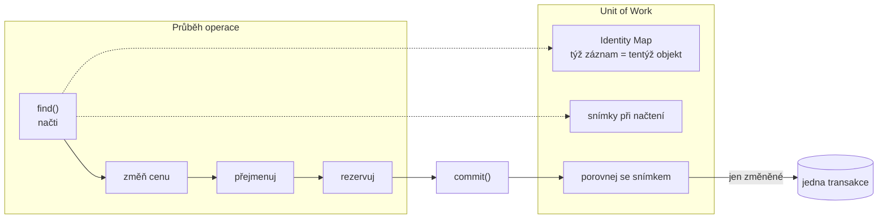

# Unit of Work (Jednotka práce)

> [← zpět na PoEAA](../)

> **V jedné větě:** Během operace se objekty jen mění v paměti; kdo si všímá, **co se změnilo**, a zapíše to najednou na konci, je Unit of Work.

---

## Problém

Objekty se během jedné operace mění na několika místech. Kdo a kdy je má uložit?

**Poznáš to podle:**

- po každé změně následuje `$repository->save($object)` — a když se zapomene, změna zmizí
- **jeden objekt se během operace uloží třikrát**, protože se třikrát změnil
- ukládá se i to, co se nezměnilo, „pro jistotu“
- když operace uprostřed selže, **půlka změn už je v databázi** a nikdo je nevrátí
- táž entita se načte na dvou místech, vzniknou dvě kopie a jedna přepíše druhou
- nikdo neví, co má obalit transakce, protože zápisy jsou rozeseté

```php
// Před: ukládání po každé změně
$product->changePrice(749000);
$repository->save($product);          // zápis 1

$product->rename('Monitor 27" Full HD');
$repository->save($product);          // zápis 2

$product->reserve(2);
$repository->save($product);          // zápis 3 — a to je pořád tentýž objekt
```

Demo to počítá: **tři změny jednoho objektu = tři zápisy do databáze.** A volající si musel po každé změně pamatovat, že má uložit.

---

## Řešení

Nechej objekty měnit se v paměti a **na konci se rozhodni, co je opravdu potřeba zapsat**.



Pattern stojí na třech částech, které dohromady dávají smysl:

| Část | Co dělá | Bez ní |
| ---- | ------- | ------- |
| **Identity Map** | Týž záznam načtený dvakrát je **tentýž objekt** | Vzniknou dvě kopie a jedna přepíše druhou |
| **Sledování změn** | Při načtení snímek, na konci porovnání | Zapisuje se i to, co se nezměnilo |
| **Jeden commit** | Všechny zápisy najednou, v transakci | Půlka změn zůstane v databázi po selhání |

### Sledování změn: zapisuje se jen to, co se změnilo

Při načtení si Unit of Work udělá **snímek** objektu. Na konci ho porovná se současným stavem — a zapíše jen rozdíly:

```
načteny 3 produkty, změněny 2
zápisů do databáze: 2   (aktualizováno 2, beze změny 1)
```

Klávesnice se jen „podívala“ a nezapsala se. Bez sledování změn by se přepsala vlastní hodnotou — **zbytečný zápis, zbytečný zámek a zbytečné zvýšení verze** u [optimistického zamykání](../OptimisticOfflineLock/).

### Identity Map: týž záznam, tentýž objekt

```
dotazů do databáze: 1
$a === $b:          true
změna přes $a je vidět na $b: ano
```

Dva `find()` na tentýž záznam vrátí **jednu a tutéž instanci**. Kdyby ne, měly by dvě části kódu dvě kopie — každá by dostala jinou změnu a jedna by druhou tiše přepsala.

Vedlejším efektem je úspora dotazů, ale to není hlavní důvod. **Hlavní důvod je konzistence uvnitř jedné operace.**

### Všechno, nebo nic

Nejviditelnější přínos. Když operace selže uprostřed:

```
BEZ Unit of Work:
    výjimka: Skladem je jen 40 ks KLA-01.
    cena monitoru v databázi: 0,01   ← změna zůstala

S Unit of Work:
    výjimka: Skladem je jen 40 ks KLA-01.
    cena monitoru v databázi: 7 990,00   ← nic se nezapsalo
```

Změny žily jen v paměti, dokud někdo neřekl `commit()`. **Když se k němu nedošlo, není co vracet.**

### Tohle dělá `flush()`

Když v Doctrine napíšeš:

```php
$product = $entityManager->find(Product::class, 'MON-27');
$product->changePrice(749000);
$product->rename('Monitor 27" Full HD');

$entityManager->flush();     // ← tady se stane všechno výše
```

…tak `flush()` projde všechny sledované entity, porovná je se snímky pořízenými při načtení, sestaví `INSERT`/`UPDATE`/`DELETE` a pošle je v jedné transakci. **Proto tam není žádné `save()`** — a proto se lidé při přechodu z Eloquentu diví, kam se podělo.

Za pozornost stojí i důsledek, který překvapí: **entita načtená přes `find()` se uloží, i když jsi na ni `persist()` nikdy nezavolal.** `persist()` je jen pro nové objekty; ty načtené Doctrine sleduje sama.

---

## Účastníci

| Role | V příkladu | Odpovědnost |
| ---- | ---------- | ----------- |
| **Unit of Work** | `UnitOfWork` | Sleduje objekty, porovnává se snímky, zapisuje najednou |
| **Identity Map** | `$identityMap` | Zaručuje jednu instanci na záznam |
| **Snímky** | `$originals` | Stav při načtení — proti němu se porovnává |
| **Doménový objekt** | `Product` | Mění se a **o Unit of Work neví** |
| **Volající** | use-case | Na konci zavolá `commit()` |

---

## Implementace v PHP

Jádro je porovnání se snímkem:

```php
foreach ($this->identityMap as $sku => $product) {
    if ($product->snapshot() === $this->originals[$sku]) {
        $unchanged++;      // beze změny, nezapisujeme

        continue;
    }

    $this->update($product);
    $this->originals[$sku] = $product->snapshot();
    $updated++;
}
```

A identity map při načtení:

```php
public function find(string $sku): ?Product
{
    if (isset($this->identityMap[$sku])) {
        return $this->identityMap[$sku];      // podruhé už do databáze nechodíme
    }

    // …načti, vytvoř objekt…

    $this->identityMap[$sku] = $product;
    $this->originals[$sku] = $product->snapshot();   // snímek pro pozdější porovnání

    return $product;
}
```

Podstatné je, že **doménový objekt o ničem neví**. `Product` nemá `save()`, `markDirty()` ani odkaz na Unit of Work — prostě se mění a někdo jiný si toho všimne.

### Dva způsoby, jak poznat změnu

| Způsob | Jak | Cena |
| ------ | --- | ---- |
| **Porovnání se snímkem** | Při načtení kopie, na konci `===` | Paměť navíc; drahé u velkého grafu objektů |
| **Explicitní ohlášení** | Objekt sám hlásí `markDirty()` | Levné, ale **doména ví o persistenci** |

Doctrine používá první způsob (říká mu *computeChangeSets*) právě proto, aby entity zůstaly čisté. Druhý je rychlejší, ale za cenu, kterou tenhle katalog jinde odmítá.

### Kde jsou hranice

Unit of Work funguje **uvnitř jedné databázové transakce**. Neřeší:

| Co | Kam patří |
| -- | --------- |
| Souběžné změny mezi requesty | [Optimistic Offline Lock](../OptimisticOfflineLock/) |
| Konzistence přes víc služeb | [Saga](../../Architecture/Saga/) |
| Kdy transakci otevřít a zavřít | [Service Layer](../ServiceLayer/) — patří to do aplikační vrstvy |
| Publikace událostí po commitu | [Domain Event](../../DDD/DomainEvent/) |

Ten poslední řádek je praktický: **události se publikují až po `commit()`**, a Unit of Work je přesně to místo, kde se to dá zavěsit (v Doctrine `postFlush`).

---

## Kdy použít

- ✅ Jedna operace mění **víc objektů** nebo jeden objekt vícekrát.
- ✅ Chceš, aby operace byla **atomická** — všechno, nebo nic.
- ✅ Doménové objekty nemají vědět o persistenci.
- ✅ Vadí ti zbytečné zápisy toho, co se nezměnilo.
- ✅ Táž entita se během operace načítá na víc místech.

## Kdy nepoužít

- ❌ **Píšeš si ji sám k ORM, které ji má.** Doctrine je Unit of Work; druhá vrstva nad ní jen mate.
- ❌ **Jedna změna, jeden zápis.** Prosté `UPDATE` je čitelnější než infrastruktura kolem.
- ❌ **Hromadné operace nad tisíci záznamy.** Sledování změn stojí paměť i čas; tam patří dávkové `UPDATE`.
- ❌ **Čtení.** Čtecí strana nic nemění, takže nemá co sledovat — viz [CQRS](../../Architecture/CQRS/).
- ❌ **Práce přesahuje jednu transakci.** Přes víc requestů nebo služeb je to jiný problém.

---

## Časté chyby

| Chyba | Proč vadí | Jak správně |
| ----- | --------- | ----------- |
| `flush()` uvnitř cyklu | Rozpadne se to na N transakcí a přijdeš o atomicitu i o rychlost | Jeden `flush()` na konci operace |
| `flush()` v repository nebo v entitě | Rozhodnutí o hranici transakce patří výš | Do [aplikační vrstvy](../ServiceLayer/) |
| Doménový objekt drží Unit of Work | Doména závisí na persistenci a nejde testovat izolovaně | Objekt se jen mění; sledování je vnější |
| Sledování změn u desítek tisíc entit | Porovnávání snímků sežere paměť i čas | Dávkové operace mimo Unit of Work |
| Události se publikují před commitem | Reakce proběhnou i pro operaci, která se vrátila zpět | Až po commitu — [Domain Event](../../DDD/DomainEvent/) |
| Vlastní Unit of Work nad Doctrine | Dvě vrstvy sledování změn, které o sobě nevědí | Použij tu, kterou ORM má |
| `clear()` uprostřed operace | Identity map se vyprázdní a zbylé objekty přestanou být sledované | Používej jen mezi dávkami |

---

## V praxi

- **Doctrine** — `EntityManager` **je** Unit of Work. `flush()` je `commit()` z tohohle patternu, `persist()` je registrace nového objektu.
- **`postFlush`** — místo, kam patří publikace [doménových událostí](../../DDD/DomainEvent/). Dřív ne, transakce ještě neskončila.
- **Doctrine `clear()`** — u dávkových importů se identity map vyprázdní každých pár set záznamů, jinak paměť neuteče.
- **`EntityManager::wrapInTransaction()`** — explicitní hranice transakce, když nechceš spoléhat na implicitní.
- **Eloquent** ho nemá — Active Record ukládá hned. To je jeden z podstatných rozdílů proti Doctrine.

---

## Související patterny

| Pattern | Vztah |
| ------- | ----- |
| [Data Mapper](../DataMapper/) | Unit of Work rozhoduje **co** zapsat, Data Mapper **jak**. V Doctrine to je tentýž `EntityManager`. |
| **Identity Map** (PoEAA) | Samostatný pattern, ale v praxi součást Unit of Work — je to jeho paměť. |
| [Repository](../Repository/) | Repository objekty načítá a registruje; Unit of Work je zapisuje. `save()` v repository často jen registruje. |
| [Service Layer](../ServiceLayer/) | Určuje **hranici** — kdy se transakce otevře a kdy zavolá `commit()`. |
| [Optimistic Offline Lock](../OptimisticOfflineLock/) | Doplňuje se: Unit of Work řeší souběh **uvnitř** transakce, optimistický zámek **mezi** requesty. |
| [Domain Event](../../DDD/DomainEvent/) | Události se publikují až po commitu, a Unit of Work je to místo. |
| [Aggregate](../../DDD/Aggregate/) | Pravidlo „jedna transakce = jeden agregát“ mluví přesně o rozsahu jedné Unit of Work. |
| [Command](../../GoF/Behavioral/Command/) (GoF) | Také drží seznam operací a provede je najednou — jen odvozený ze změn objektů, ne sestavený volajícím. |

---

## Vztah k principům

| Princip | Jak souvisí |
| ------- | ----------- |
| [SRP](../../Principles/SOLID.md#single-responsibility-principle-srp) | Doména se stará o pravidla, Unit of Work o to, co a kdy zapsat. Bez ní má doménový objekt oba důvody ke změně. |
| [Nízká provázanost](../../Principles/CohesionAndCoupling.md) | Doménový objekt o persistenci neví vůbec — mění se a nic víc. |
| [Fail Fast](../../Principles/ObjectDesign.md#fail-fast) | Selhání uprostřed operace nenechá poloviční stav; buď se zapíše všechno, nebo nic. |

---

## Demo

```bash
php PoEAA/UnitOfWork/demo/run.php
```

Porovná ukládání po každé změně (**3 zápisy**) s jedním commitem (**1 zápis**), ukáže, že se **nezměněný objekt vůbec nezapisuje**, ověří identity map (`$a === $b` a jeden dotaz místo dvou) a nakonec nechá operaci selhat uprostřed: bez Unit of Work zůstane v databázi cena 0,01 Kč, s ní se nezapíše nic.

---

## Původ

|               |                                                   |
| ------------- | ------------------------------------------------- |
| **Zdroj**     | *Patterns of Enterprise Application Architecture*  |
| **Autor**     | Martin Fowler                                      |
| **Rok**       | 2002                                               |
| **Kategorie** | — (PoEAA kategorie nemá)                           |
| **Obtížnost** | ●●●○○                                              |

Fowlerova definice zní: *„Udržuje seznam objektů ovlivněných obchodní transakcí a koordinuje zápis změn i řešení problémů se souběžností.“* Slovo **koordinuje** je klíčové — Unit of Work sama nic nemapuje ani neukládá, jen ví, **co** a **kdy**.

Motivace byla praktická. Fowler pozoroval, že aplikace buď ukládaly po každé změně (a byly pomalé a nekonzistentní), nebo si volající vedl seznam ručně (a zapomínal). Unit of Work ten seznam vede za něj.

Pro dnešního PHP vývojáře je hlavní hodnota v tom, že **vysvětluje, co se děje pod kapotou**. Doctrine je Unit of Work; kdo tenhle pattern zná, přestane se divit, proč entita bez `save()` skončí v databázi, proč `flush()` uvnitř cyklu ničí výkon a proč se doménové události publikují až v `postFlush`. Bez něj je to magie — s ním je to čtyřicet řádků, které si dokážeš představit.

---

## Zdroje

- Martin Fowler: *Patterns of Enterprise Application Architecture*, Addison-Wesley, 2002 — Unit of Work, str. 184
- [Doctrine ORM: Working with Objects](https://www.doctrine-project.org/projects/doctrine-orm/en/current/reference/working-with-objects.html)
- [Doctrine ORM: Batch Processing](https://www.doctrine-project.org/projects/doctrine-orm/en/current/reference/batch-processing.html)

---

<details>
<summary>Metadata patternu</summary>

```yaml
name: UnitOfWork
name_cs: Jednotka práce
category: —
source: PoEAA – Patterns of Enterprise Application Architecture
authors: Martin Fowler
year: 2002
difficulty: 3
tags: [persistence, sledování změn, transakce, identity map, orm]
principles: [SRP, CohesionAndCoupling, FailFast]
related: [DataMapper, IdentityMap, Repository, ServiceLayer, OptimisticOfflineLock, DomainEvent, Aggregate]
status: done
```

</details>
