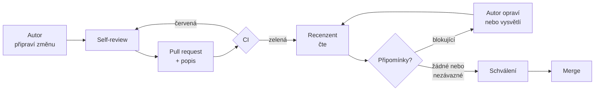

# Code review

> [← zpět na Procesy](../)

> **V jedné větě:** Než se změna dostane do hlavní větve, přečte ji někdo další — ne proto, aby hlídal, ale aby o ní věděl.

---

## K čemu to je

Nejrozšířenější představa je, že code review **hledá chyby**. Výzkum říká něco jiného.

Bacchelli a Bird v roce 2013 pozorovali, dotazovali a ručně roztřídili stovky komentářů u vývojářů v Microsoftu. Závěr:

> „While finding defects remains the main **motivation** for review, reviews are less about defects than expected and instead provide additional benefits such as **knowledge transfer, increased team awareness, and creation of alternative solutions** to problems.“

Čili: chyby jsou hlavní **důvod**, proč se do review chodí, ale ne to hlavní, co z něj vypadne. **Nejvíc na něm vydělá tým na tom, že o kódu ví víc lidí.**

To zjištění mění celý tón procesu:

| Když je review kontrola | Když je review sdílení |
| --- | --- |
| Recenzent je brána, kterou je třeba projít | Recenzent je druhý pár očí |
| Schválení znamená „je to bez chyby“ | Schválení znamená „tomuhle rozumím a je to lepší než dosud“ |
| Junior se bojí, že něco přehlédl | Junior se učí na cizím kódu |
| Nikdo nechce recenzovat | Recenze je způsob, jak zůstat v obraze |

**Poznáš, že proces nefunguje, podle:**

- pull requesty čekají **dny** a autor mezitím dělá něco jiného
- schvaluje se **bez čtení**, protože „to je od kolegy, ten to umí“
- komentáře jsou o **mezerách a názvech proměnných**, ne o návrhu
- pull request má **osm set řádků** a nikdo neví, kde začít
- o části kódu **rozumí jeden člověk** a všichni to vědí
- autor bere připomínky **osobně** a recenzent se je proto bojí psát

---

## Jak proces probíhá

| Krok | Kdo | Co se od něj čeká |
| ---- | --- | ----------------- |
| Příprava změny | autor | Malá, samostatná, s popisem — [jak na to](Author/) |
| Self-review | autor | Přečíst si vlastní diff dřív než kdokoli jiný |
| Čtení | recenzent | Návrh dřív než detaily — [co hledat](Reviewer/) |
| Komentáře | recenzent | Označit, co blokuje a co ne — [jak psát](Comments/) |
| Reakce | autor | Opravit, nebo vysvětlit; nenechat viset |
| Schválení | recenzent | Když je kód **lepší než dosud**, ne když je dokonalý |

---

## Kdy schválit

Tohle je nejdůležitější pravidlo celého procesu a Google ho ve své příručce označuje za

> „the senior principle among all of the code review guidelines“:
>
> „In general, reviewers should favor approving a CL once it is in a state where it **definitely improves the overall code health** of the system being worked on, **even if the CL isn't perfect**.“

**Měřítkem není dokonalost, ale zlepšení.** Změna nemusí být to nejlepší, co by šlo napsat — stačí, že je kód po ní lepší než před ní.

Důvod je praktický: kdyby se schvalovala jen dokonalost, nikdy by se nic nesloučilo, autoři by se přestali pouštět do úprav navíc a **kvalita by tím klesla**, ne stoupla. Recenzent, který blokuje merge kvůli něčemu, co by udělal jinak, mění proces v překážku.

Co z toho plyne prakticky:

- **Blokuj jen to, co je opravdu problém** — chyba, bezpečnostní riziko, návrh, který se bude špatně měnit.
- **Všechno ostatní označ jako nezávazné.** K tomu slouží [značkování komentářů](Comments/).
- **„Udělal bych to jinak“ není důvod k blokování.** Je to důvod k rozhovoru.

---

## Do kdy odpovědět

Google uvádí konkrétní lhůtu:

> „One business day is the maximum time it should take to respond to a code review request (i.e., first thing the next morning).“

Podstatné je slovo **odpovědět**, ne dokončit. Rozdíl je zásadní: první reakce do jednoho pracovního dne, i kdyby zněla „dívám se na to zítra ráno, je to na dýl“. Autor pak ví, na čem je.

Zároveň to **není výzva k okamžitému přerušení práce**:

> „If you are in the middle of a focused task, such as writing code, don't interrupt yourself to do a code review.“

Recenze patří do přirozené pauzy — po dokončení úkolu, po obědě, po schůzce. Přepínání kontextu je drahé a rozbitý den recenzenta není lacinější než čekání autora.

**Proč na rychlosti záleží.** Podle Googlu pomalé review nezpomaluje jen jednoho člověka: práce se hromadí, autoři jsou otrávení a — což je nejméně zjevné — **tým začne tlačit na to, aby prošlo i to, co by nemělo**, a přestane se pouštět do úprav navíc.

Že to jde, ukazují data. Sadowski a kolektiv v roce 2018 popsali praxi v Googlu: **70 % změn je odbaveno do 24 hodin** od odeslání na review.

---

## Kolik recenzentů

Nemá to jednu správnou odpověď a stojí za to volit vědomě:

| Počet | Kdy dává smysl | Cena |
| ----- | -------------- | ---- |
| **1** | Výchozí volba pro většinu změn | Rychlé; závisí na jednom člověku |
| **2** | Kritická část systému, bezpečnost, platby | Čeká se na dva; roste průběžná doba |
| **1 + vlastník oblasti** | Změna v cizí části kódu | Nejlepší pro sdílení znalostí, ale najdi ho včas |
| **0** | Překlep v dokumentaci, generovaný soubor | Uveď výslovně, kdy to platí — jinak si to každý vyloží po svém |

**Víc schvalovatelů neznamená lepší kvalitu.** Znamená to delší čekání a rozptýlenou odpovědnost — když čtou tři lidé, každý spoléhá na ty ostatní.

---

## Když se autor a recenzent neshodnou

Nejdřív se pokuste dohodnout věcně a s odkazem na to, co je psané — v tomhle repozitáři třeba na [principy návrhu](../../SoftwareDesign/Principles/). Když to nestačí, **eskalujte**: přiberte dalšího člověka, technického vedoucího, nebo to proberte v týmu.

Podstatné je, co se stát nesmí:

> „Don't let a CL sit around because the author and the reviewer can't come to an agreement.“

Neshoda, kterou nikdo neřeší, je horší než kterékoli z obou řešení. Blokovaná změna zdržuje, kazí náladu a po týdnu už nikdo neví, o co šlo.

Užitečné pravidlo: **kdo blokuje, ten navrhuje.** Připomínka „takhle ne“ bez alternativy nepohne ničím.

---

## Časté chyby

| Chyba | Proč vadí | Jak správně |
| ----- | --------- | ----------- |
| Schválení bez čtení | Formalita bez užitku, a přitom stojí čas | Když nemáš čas číst, řekni to a předej to dál |
| Blokování kvůli osobní preferenci | Proces se mění v překážku a autoři se přestanou pouštět do úprav | Blokuj chyby a návrh; zbytek [označ jako nezávazné](Comments/) |
| Připomínky k formátování | Zabírají pozornost, kterou má dostat návrh | Automatický formátovač a lint v CI |
| Review trvá dny | Autor mezitím přepnul kontext a musí se vracet | Odpověz do pracovního dne, i kdyby jen „dívám se zítra“ |
| Pull request na osm set řádků | Nikdo ho pořádně nepřečte, schválení je fikce | [Rozdělit](Author/) |
| Neshoda visí bez řešení | Zdržuje a otravuje víc než kterékoli z obou řešení | Eskalovat |
| Recenzent je pořád jeden a týž člověk | Znalosti se nešíří a vznikne úzké hrdlo | Střídat; využít review k učení |
| Junior nikdy nerecenzuje | Přijde o nejrychlejší způsob, jak poznat cizí kód | Nechat ho recenzovat — i když schvaluje někdo další |
| Komentář bez odůvodnění | Nedá se s ním nic dělat než poslechnout | Napsat **proč** |

Předposlední řádek stojí za rozvedení. Zvyk, že junior je jen recenzovaný a nikdy nerecenzuje, vypadá logicky — a přitom mu bere to nejcennější, co proces nabízí. **Čtení cizího kódu je nejrychlejší způsob, jak se v projektu zorientovat.** Že jeho schválení nakonec nestačí, tomu nijak nepřekáží.

---

## Nastavení v GitHubu / GitLabu

| Nastavení | Proč |
| --------- | ---- |
| Protected branch na hlavní větev | Bez toho je celý proces dobrovolný |
| Require pull request before merging | Jediná cesta do hlavní větve |
| Required approvals | Číslo podle [tabulky výš](#kolik-recenzentů) |
| Required status checks (testy, lint, formát) | Aby review neřešilo to, co pozná stroj |
| CODEOWNERS | Automaticky přizve vlastníka oblasti |
| Dismiss stale approvals | Schválení se ruší, když přijdou další commity |
| Auto-merge po schválení | Odstraní prodlevu mezi „schváleno“ a „sloučeno“ |
| Draft pull requests | Umožní otevřít PR dřív, než je hotovo |

**Automatické kontroly udělej dřív než cokoli jiného.** Každá připomínka k mezerám, formátování nebo pořadí importů je pozornost, která nešla na návrh — a tu strojovou práci má dělat stroj.

---

## Kudy dál

| Dokument | Pro koho |
| -------- | -------- |
| [**Pro autora**](Author/) | Jak připravit změnu, aby se dala rozumně recenzovat |
| [**Pro recenzenta**](Reviewer/) | Co hledat, v jakém pořadí a kdy schválit |
| [**Komentáře**](Comments/) | Jak je psát, aby vedly ke změně a ne k obraně |

---

## Související

| Dokument | Vztah |
| -------- | ----- |
| [Git Workflows](../../GitWorkflows/) | Kde v modelu větvení review sedí. Všech pět modelů s ním počítá, liší se jen tím, kam se slučuje. |
| [GitHub Flow](../../GitWorkflows/GitHubFlow/) | Model, ve kterém je pull request jádrem procesu. |
| [Trunk-Based Development](../../GitWorkflows/TrunkBasedDevelopment/) | Klade na rychlost review největší nároky — větev musí zmizet tentýž den. |
| [Principy návrhu](../../SoftwareDesign/Principles/) | Společný jazyk pro věcnou diskusi nad návrhem. Odkaz na princip je lepší argument než „mně se to nelíbí“. |
| [Scrum](../Scrum/) | Review bývá součástí **[Definice Hotovo](../Scrum/#inkrement-a-definice-hotovo)** — položka není hotová, dokud jí neprošla. |
| [Kanban](../Kanban/) | Čekající review je nejčastější místo, kde se zadrhne tok. Sloupec „review“ s WIP limitem to zviditelní. |

---

## Zdroje

- [Google Engineering Practices: Code Review](https://google.github.io/eng-practices/review/) — příručka pro recenzenty i autory
- [The Standard of Code Review](https://google.github.io/eng-practices/review/reviewer/standard.html)
- [Speed of Code Reviews](https://google.github.io/eng-practices/review/reviewer/speed.html)
- Bacchelli, Bird: [*Expectations, Outcomes, and Challenges of Modern Code Review*](https://www.microsoft.com/en-us/research/publication/expectations-outcomes-and-challenges-of-modern-code-review/), ICSE 2013
- Sadowski et al.: [*Modern Code Review: A Case Study at Google*](https://sback.it/publications/icse2018seip.pdf), ICSE-SEIP 2018
