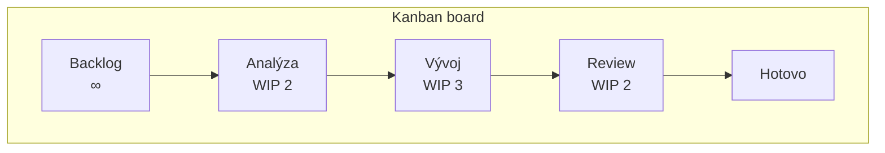

# Kanban

> [← zpět na Procesy](../)

> **V jedné větě:** Strategie pro optimalizaci toku hodnoty — zviditelníš práci, omezíš, kolik jí běží současně, a řídíš, aby netrčela.

> [!IMPORTANT]
> **Pod jménem „Kanban" existují dva různé dokumenty** a lidé je běžně míchají. **[Kanban Method](#kanban-method-anderson)** (David J. Anderson, Kanban University) je starší a širší — šest principů a šest praktik o tom, jak měnit organizaci. **[Kanban Guide](#kanban-guide-vacanti-coleman-a-další)** (kanbanguides.org, verze v2025.5) je novější a stručnější — tři praktiky a čtyři metriky. Nejsou v rozporu, ale **než se začnete o Kanbanu bavit, vyjasněte si, který z nich má kdo na mysli.**

---

## Odkud pochází

Slovo **kanban** (看板) znamená japonsky „cedule" nebo „vizuální signál". Pochází z **Toyota Production System** — z výroby, kde kartička putovala proti směru výroby a byla signálem, že se má něco doplnit. Nic se nevyrábělo dopředu; vyrábělo se, až když přišel signál, že je po tom poptávka. Tomu se říká **tahový systém** (pull).

**David J. Anderson** tenhle princip v polovině dvoutisících let přenesl na znalostní práci a v roce 2010 ho popsal v knize *Kanban: Successful Evolutionary Change for Your Technology Business*. Podstatné je, co z výroby převzal: **nezačíná se přestavbou organizace, začíná se zviditelněním toho, co už děláte.**

---

## Kanban Method (Anderson)

Tahle podoba je metoda **řízení změny**. Nejsilnější je na ní to, že nevyžaduje reorganizaci — nasazuje se na proces, který už běží.

### Šest principů — dvě skupiny po třech

Od roku 2016 jsou principy rozdělené podle toho, čeho se týkají.

**Principy řízení změny** (Change Management Principles):

| | Princip |
| --- | ------- |
| **1** | **Start with what you do now** — začni tím, co děláš teď; pochop současný proces tak, jak se opravdu dělá, a respektuj stávající role a odpovědnosti |
| **2** | **Agree to pursue improvement through evolutionary change** — zlepšuj se postupnými, evolučními změnami, ne výměnou celého procesu |
| **3** | **Encourage acts of leadership at every level** — podporuj vedení na všech úrovních, od jednotlivců po vedení firmy |

**Principy poskytování služby** (Service Delivery Principles):

| | Princip |
| --- | ------- |
| **1** | **Understand and focus on customer needs and expectations** — pochop potřeby a očekávání zákazníka a zaměř se na ně |
| **2** | **Manage the work; let people self-organize around it** — řiď práci a nech lidi, ať se kolem ní zorganizují sami |
| **3** | **Regularly review the network of services and its policies** — pravidelně přezkoumávej síť služeb a její pravidla, abys zlepšil výsledky |

První princip je ten, kvůli kterému se Kanban zavádí snadněji než [Scrum](../Scrum/): **nic se nemusí rušit ani přejmenovávat.** Kdo je dnes tester, je testerem i zítra.

### Šest obecných praktik

| Praktika | Co znamená |
| -------- | ---------- |
| **Visualize** | Zviditelnit práci — jinak se o ní nedá mluvit ani ji zlepšovat |
| **Limit Work in Progress (WIP)** | Omezit, kolik věcí běží současně |
| **Manage Flow** | Řídit tok tak, aby byl plynulý a předvídatelný |
| **Make Policies Explicit** | Napsat nahlas pravidla, podle kterých se rozhoduje |
| **Implement Feedback Loops** | Zavést pravidelné příležitosti ke zpětné vazbě |
| **Improve Collaboratively, Evolve Experimentally** | Zlepšovat společně, měnit pokusy, u kterých je bezpečné selhat |

Čtvrtá praktika bývá nejvíc podceňovaná. *Make Policies Explicit* znamená napsat věci jako „co znamená hotovo", „co má přednost" nebo „kdy se smí vzít další úkol" — dokud jsou tahle pravidla v hlavách, každý si je vykládá jinak a tok se zadrhává na místech, která nikdo nevidí.

---

## Kanban Guide (Vacanti, Coleman a další)

Novější a podstatně stručnější dokument, který stojí na měření toku. Aktuální verze je **v2025.5 (1. května 2025)**.

> „Kanban is a strategy for optimizing the flow of value through a process."

### Definition of Workflow

Základ celé téhle podoby. Než začneš, musíš mít napsané, co vlastně tvůj tok je — **Definition of Workflow (DoW)** musí obsahovat všech šest bodů:

1. definici **pracovních položek** (jednotek hodnoty, které tokem procházejí)
2. definici, **kdy položka začíná a kdy končí**
3. jeden nebo víc **stavů**, kterými položka prochází
4. definici, jak se **kontroluje WIP** od začátku do konce
5. **výslovná pravidla** pro tok položky každým stavem
6. **Service Level Expectation (SLE)**

### Tři praktiky

| Praktika | Co obnáší |
| -------- | --------- |
| **Defining and visualizing a workflow** | Napsat DoW a udělat ho viditelným |
| **Actively managing items in a workflow** | Kontrolovat WIP, hlídat, aby položky zbytečně nestárly, a odblokovávat zablokované |
| **Improving a workflow** | Průběžně zlepšovat na základě toho, co metriky ukazují |

U druhé praktiky je definovaný tahový systém:

> „Kanban system members should start work on an item (pull or select) only when there is a clear signal that there is capacity to do so."

Čili **novou věc si vezmeš, až když je volná kapacita** — ne když ti ji někdo přidělí.

### Čtyři metriky, které se musí měřit

| Metrika | Definice z Průvodce |
| ------- | ------------------- |
| **WIP** | „The number of work items started but not finished" |
| **Throughput** | „The number of work items finished per unit of time" |
| **Work Item Age** | „The elapsed time between when a work item started and the current date" |
| **Cycle Time** | „The elapsed time between when a work item started and when a work item finished" |

**Work Item Age** je z nich nejužitečnější v každodenní práci a nejmíň známá. Cycle Time se dozvíš, až je hotovo — tehdy už s tím nic neuděláš. **Work Item Age ti řekne o věci, která visí, ještě dnes.**

### Service Level Expectation

> „a forecast of how long it should take a work item to flow from started to finished"

Skládá se ze dvou částí — **doby a pravděpodobnosti**, a Průvodce dává příklad:

> „85 % of work items will be finished in eight days or less"

Vychází z historických dat o Cycle Time. Není to slib ani termín — je to **předpověď**, a proto je u ní procento.

### Kanban se přidává k tomu, co máte

> „one can and likely should add other principles, methodologies, and techniques to the Kanban system. Still, the minimum set of practices, metrics, and the spirit of optimizing value must be preserved."

Kanban tedy **není kompletní metodika** a nesnaží se jí být. Nasazuje se na existující proces — a právě proto se dá kombinovat i se [Scrumem](../Scrum/).

---

## Jak vypadá nástěnka

Čísla u sloupců jsou **WIP limity** — kolik položek tam smí být najednou. Když je sloupec plný, **nesmí do něj nic přibýt**, dokud se něco neuvolní.

To je celý mechanismus a zároveň to, co lidi na Kanbanu nejvíc překvapí: **plný sloupec je signál, že máš jít pomoct dostat něco ven, ne začít další věc.** Bez limitů je nástěnka jen seznam úkolů obarvený na tři sloupce.

---

## Kanban a Scrum

Nejde o volbu „buď — anebo"; oba dokumenty to říkají výslovně. Kanban se dá použít i uvnitř Scrumu, protože **není kompletní metodikou** a nasazuje se na existující proces.

| | [**Scrum**](../Scrum/) | **Kanban** |
| --- | --- | --- |
| Co to je | rámec, který se zavádí celý | strategie/metoda přidaná k tomu, co už děláte |
| Rytmus | **Sprinty pevné délky** (měsíc nebo méně) | **plynulý tok**, bez předepsané kadence |
| Role | předepisuje tři odpovědnosti | **žádné nepředepisuje** — „start with what you do now" |
| Události | pět předepsaných | žádné předepsané (Kanban Method má „feedback loops") |
| Co reguluje zátěž | závazek na Sprint a Cíl Sprintu | **WIP limity** |
| Kdy se mění priorita | mimo Sprint; během něj se nemění Cíl | **kdykoli** — co ještě nezačalo, se dá přeskládat |
| Typické metriky | pokrok k Cíli Sprintu | **WIP, Throughput, Work Item Age, Cycle Time** |
| Předpověď termínu | z plánování Sprintu | **SLE** — „85 % do 8 dnů" |
| Zavedení | vyžaduje změnu rolí a rytmu | **nevyžaduje reorganizaci** |
| Neúplné zavedení | „výsledkem není Scrum" | v pořádku — přidává se postupně |

**Kdy sáhnout po Kanbanu spíš:** práce přichází průběžně a nedá se naplánovat na dva týdny dopředu (podpora, provoz, údržba), priority se mění častěji, než je délka Sprintu, nebo tým na změnu rolí a rytmu není připravený.

**Kdy spíš po Scrumu:** produkt se vyvíjí v dávkách kolem cíle, dává smysl pravidelně zastavit a přezkoumat směr, tým potřebuje rytmus a jasné odpovědnosti.

Obojí zároveň se dělá běžně — bývá to Scrum jako rámec a z Kanbanu vizualizace, WIP limity a metriky toku.

---

## Souvislost s naší prací

| Dokument | Souvislost |
| -------- | ---------- |
| [Scrum](../Scrum/) | Druhý přístup ke stejné práci. **Nevylučují se** — [srovnání výš](#kanban-a-scrum). |
| [Scrumban](../Scrumban/) | Název pro kombinaci obou. Kanban se přidávat **má** — a Definition of Workflow je to, co u Scrumbanu chybí nejvíc. |
| [Agile Manifesto](../AgileManifesto/) | Kanban vznikl mimo Snowbird a **není mezi přístupy, které tam byly zastoupené**; s manifestem se ale potkává v důrazu na reagování na změny. |
| [Code review](../CodeReview/) | Typický sloupec s WIP limitem. Čekající review je nejčastější místo, kde se tok zadrhne — a [rychlost odpovědi](../CodeReview/#do-kdy-odpovědět) je tím pádem otázka průtoku, ne zdvořilosti. |
| [Waterfall](../Waterfall/) | Protiklad plynulého toku — práce postupuje po velkých dávkách, které se schvalují. |
| [Trunk-Based Development](../../GitWorkflows/TrunkBasedDevelopment/) | Sdílí myšlenku malých dávek a průběžného toku; „větev nemá žít déle než den" je WIP limit vyjádřený jinak. |
| [Git Workflows](../../GitWorkflows/) | Kanban neurčuje, jak větvit ani nasazovat — to je samostatné rozhodnutí. |

---

## Zdroje

- [Kanban Guide](https://kanbanguides.org/english/) — v2025.5, květen 2025; Daniel Vacanti, John Coleman a další
- [The Official Guide to The Kanban Method](https://kanban.university/kanban-guide/) — Kanban University
- [Kanban's Change Management Principles](https://kanban.university/kanbans-change-management-principles/) — Kanban University
- David J. Anderson: *Kanban: Successful Evolutionary Change for Your Technology Business*, Blue Hole Press, 2010
