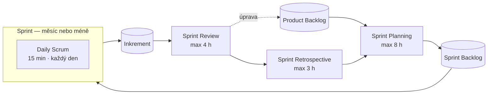

# Scrum

> [← zpět na Procesy](../)

> **V jedné větě:** Rámec, ve kterém malý tým v opakujících se Sprintech dodává hotový přírůstek produktu — tři odpovědnosti, pět událostí, tři artefakty.

> [!NOTE]
> Tenhle dokument popisuje Scrum **podle [Průvodce Scrum](https://scrumguides.org/) (Scrum Guide), verze z listopadu 2020** — to je aktuální oficiální vydání. Termíny i citace jsou z [oficiálního českého překladu](https://scrumguides.org/docs/scrumguide/v2020/2020-Scrum-Guide-Czech.pdf) (překlad Iveta Grüttner), ne z mého vlastního. Nic tu není doplněno o rady „jak to dělat lépe".

---

## Co Scrum je

> „Scrum je odlehčený rámec, který pomáhá lidem, týmům a organizacím vytvářet hodnotu prostřednictvím přizpůsobivých řešení pro složité problémy."

Průvodce shrnuje jeho běh do čtyř kroků:

1. Product Owner zadá práci na složitém problému do Produktového Backlogu.
2. Scrum Tým změní vybranou práci během Sprintu na přírůstek hodnoty.
3. Scrum Tým a jeho zainteresované osoby zkontrolují výsledky a přizpůsobí se pro další Sprint.
4. Opakovat.

Dvě věty z Průvodce, které se často přehlížejí a přitom určují, jak se má se Scrumem zacházet:

> „Rámec Scrum je **záměrně neúplný**, pouze definuje části potřebné k implementaci teorie Scrum."

> „Rámec Scrumu, jak je zde uvedeno, **je neměnný**. I když je možné implementovat pouze části Scrumu, výsledkem není Scrum."

Scrum tedy neříká, jak psát kód, jak odhadovat ani jak nasazovat — to si tým doplní sám. Co ale říká, se nemá ubírat.

Scrum je jeden z přístupů, jejichž zástupci se v roce 2001 sešli v Snowbirdu a sepsali [**Agile Manifesto**](../AgileManifesto/). **Ken Schwaber i Jeff Sutherland, autoři Průvodce Scrum, jsou mezi jeho signatáři.**

---

## Teorie: empirismus

> „Scrum je založen na empirismu a lean myšlení. Empirismus tvrdí, že znalosti vycházejí ze zkušeností a rozhodování na základě toho, co je pozorováno."

Stojí na **třech pilířích** a jsou na sobě závislé v tomhle pořadí:

| Pilíř | Co znamená |
| ----- | ---------- |
| **Transparentnost** | Práce i proces musí být viditelné pro ty, kdo je dělají, i pro ty, kdo výsledek přebírají. |
| **Kontrola** | Artefakty a pokrok k cílům se musí často a svědomitě kontrolovat, aby se odchylky zjistily včas. |
| **Přizpůsobení** | Když kontrola ukáže odchylku, upraví se postup nebo materiál — co nejdřív. |

Průvodce k té závislosti dodává:

> „Transparentnost umožňuje kontrolu. Kontrola bez průhlednosti je zavádějící a zbytečná."

> „Kontrola umožňuje přizpůsobení."

Proto pět událostí — každá je formální příležitostí ke kontrole a přizpůsobení.

---

## Hodnoty Scrum

> „Úspěšné použití Scrum závisí na tom, jak zdatně lidé dodržují následujících pět hodnot: **odhodlanost, soustředění, otevřenost, respekt a odvaha**."

| Hodnota | Podle Průvodce |
| ------- | -------------- |
| **Odhodlanost** | Scrum Team se zavazuje dosáhnout svých cílů a podporovat se navzájem. |
| **Soustředění** | Primární zaměření je na práci Sprintu, aby se dosáhlo co nejlepšího pokroku. |
| **Otevřenost** | Tým i zainteresované osoby jsou otevřeni, pokud jde o práci a výzvy. |
| **Respekt** | Členové týmu se navzájem respektují jako schopné, nezávislé lidi. |
| **Odvaha** | Členové mají odvahu dělat správnou věc a pracovat na náročných problémech. |

---

## Scrum Team

> „Základní jednotkou Scrumu je malý tým lidí, tzv. Scrum Team. Scrum Tým se skládá z jednoho Scrum Master, jednoho Product Owner (vlastníka produktu) a Developerů."

Tři věty, které vymezují, co Scrum Team je:

> „**V Scrum Týmu nejsou žádné dílčí týmy ani hierarchie.**"

> „Řídí se samy, což znamená, že interně rozhodují, kdo co dělá, kdy a jak."

> „Scrum Tým je dostatečně malý, aby zůstal hbitý a současně dostatečně velký, aby dokončil významnou práci v rámci Sprintu, **obvykle 10 nebo méně lidí**."

Je-li týmů na jednom produktu víc, mají podle Průvodce sdílet **stejný Produktový Cíl, stejný Produktový Backlog a stejného Product Ownera**.

Scrum definuje **tři odpovědnosti** (accountabilities) — nejsou to pracovní pozice, ale odpovědnosti uvnitř týmu.

### Developers

> „Developeři jsou lidé v Scrum Týmu, kteří se zavázali vytvářet jakýkoli aspekt použitelného přírůstku, tzv. Inkrementu, každého Sprintu."

Vždy odpovídají za:

- vytvoření plánu pro Sprint, tzv. Sprint Backlog
- vkládání kvality dodržováním **Definice Hotovo**
- přizpůsobení svého plánu každý den směrem k **Cíli Sprintu**
- vzájemnou odpovědnost všech členů jako profesionálů

### Product Owner

> „Product Owner odpovídá za maximalizaci hodnoty produktu vyplývající z práce Scrum Týmu."

Odpovídá také za efektivní správu Product Backlogu — rozvoj a komunikaci Produktového Cíle, vytváření a jasnou komunikaci položek, jejich pořadí a zajištění, aby byl backlog transparentní a srozumitelný.

Dvě věty, které se v praxi porušují nejčastěji:

> „**Product Owner je jedna osoba, nikoli výbor.**"

> „Aby Product Owners uspěli, **musí celá organizace respektovat jejich rozhodnutí**."

Práci může delegovat, ale odpovědnost zůstává jemu. Kdo chce změnit Product Backlog, musí přesvědčit jeho — ne obejít.

### Scrum Master

> „Scrum Master je odpovědný za založení Scrumu, jak je definováno v Scrum Průvodci. … Scrum Master odpovídá za **efektivitu Scrum Týmu**."

> „Scrum Masters jsou **skuteční vůdci, kteří slouží** Scrum Týmu a větší organizaci."

Slouží třem stranám:

| Komu | Například |
| ---- | --------- |
| **Scrum Týmu** | Koučuje samosprávu a více-funkcionalitu, pomáhá zaměřit se na hodnotné Inkrementy, **odstraňuje překážky pokroku**, zajišťuje, že se události konají a drží časový rámec. |
| **Product Ownerovi** | Pomáhá s technikami pro definici Produktového Cíle a Backlogu, se srozumitelnými položkami, s empirickým plánováním, moderuje spolupráci se zainteresovanými stranami. |
| **Organizaci** | Vede, školí a koučuje organizaci v přijetí Scrumu. |

---

## Události (ceremonie)

> „Sprint je přepravník pro všechny ostatní události. Každá událost ve Scrumu je formální příležitostí ke kontrole a přizpůsobení artefaktů Scrumu."

Timeboxy platí pro **měsíční Sprint**; u kratších Sprintů jsou události obvykle kratší.

| Událost | Timebox | Účel podle Průvodce |
| ------- | ------- | ------------------- |
| **Sprint** | měsíc nebo méně | Přepravník pro vše ostatní |
| **Sprint Planning** | max 8 hodin | „Zahájí Sprint stanovením práce, která má být během Sprintu provedena." |
| **Daily Scrum** | 15 minut | „Kontrolovat pokrok směrem k Cíli Sprintu a podle potřeby upravit Sprint Backlog." |
| **Sprint Review** | max 4 hodiny | „Zkontrolovat výsledek Sprintu a určit budoucí úpravy." |
| **Sprint Retrospective** | max 3 hodiny | „Naplánovat způsoby, jak zvýšit kvalitu a efektivitu." |

### Sprint

> „Sprinty jsou srdcem Scrumu, kde se nápady proměňují v hodnotu. Jsou to události **pevné délky jednoho měsíce nebo méně**, aby se vytvořila konzistence. **Nový Sprint začíná okamžitě po uzavření předchozího.**"

Během Sprintu platí čtyři pravidla:

- nejsou provedeny žádné změny, které by ohrozily **Cíl Sprintu**
- kvalita se nesnižuje
- Produktový Backlog je vylepšen podle potřeby
- rozsah může být vyjasněn a znovu projednán s Product Ownerem, jakmile je víc informací

K délce Průvodce dodává, že kratší Sprinty generují víc cyklů poučení a omezují riziko na kratší časový rámec. A jedna pravomoc, o které se málo ví:

> „Sprint může být zrušen, pokud Cíl Sprintu zastará. **Oprávnění zrušit Sprint má pouze Product Owner.**"

### Sprint Planning

Zahajuje Sprint. Plán vytváří **spoluprací celý Scrum Tým** a probírají se **tři témata**:

| Téma | Otázka | Kdo vede |
| ---- | ------ | -------- |
| **1** | Proč je tento Sprint cenný? | Product Owner navrhuje, tým společně definuje **Cíl Sprintu** |
| **2** | Co lze udělat tento Sprint? | Developeři vybírají položky z Produktového Backlogu |
| **3** | Jak bude zvolená práce provedena? | **Výhradně Developeři** |

> „Cíl Sprintu musí být dokončen před koncem Sprint Planning."

U třetího tématu je Průvodce nezvykle důrazný:

> „Jak se to dělá, je na výhradním uvážení Developerů. **Nikdo jiný jim neřekne**, jak proměnit položky Produktového Backlogu na Inkrementy hodnoty."

Výsledek všech tří témat dohromady — Cíl Sprintu, vybrané položky a plán jejich dodání — **je Sprint Backlog**.

### Daily Scrum

> „Daily Scrum je **15-ti minutová událost pro Developery** Scrum týmu. Aby se snížila složitost, koná se ve stejný čas a na stejném místě každý pracovní den Sprintu."

Product Owner a Scrum Master se účastní **jen tehdy**, pokud aktivně pracují na položkách ve Sprint Backlogu — a to jako Developeři.

Nejčastěji citovaná věta z celé sekce:

> „**Developeři si mohou vybrat libovolnou strukturu a techniky, které chtějí**, pokud se jejich Daily Scrum zaměřuje na pokrok směrem k Cíli Sprintu a vytvoří akční plán pro další pracovní den."

Průvodce z roku 2020 tedy **nepředepisuje tři otázky** („co jsem udělal / co budu dělat / co mi brání"). Ve starších verzích byly, dnes jsou jen jednou z možností.

A ještě jedna věta proti představě, že se plán mění jen ráno:

> „Daily Scrum není jediným okamžikem, kdy Developeři mohou upravit svůj plán. Často se setkávají po celý den."

### Sprint Review

> „Účelem Sprint Review je zkontrolovat výsledek Sprintu a určit budoucí úpravy. Scrum Tým prezentuje výsledky své práce klíčovým zúčastněným stranám a diskutuje se o pokroku směrem k Produktovému Cíli."

Dvě věty, které mění povahu téhle události:

> „**Sprint Review je pracovní schůzka a Scrum Tým by ji neměl omezovat jen na prezentaci.**"

> „Sprint Review by **nikdy neměl být považován za bránu k uvolnění hodnoty**."

Druhá znamená, že Inkrement může být doručen zainteresovaným stranám i **před** koncem Sprintu — na vydání se nečeká.

### Sprint Retrospective

> „Účelem Sprint Retrospektivy je **naplánovat způsoby, jak zvýšit kvalitu a efektivitu**."

Tým kontroluje, jak proběhl poslední Sprint — pokud jde o jednotlivce, interakce, procesy, nástroje a jejich Definici Hotovo. Diskutuje, co šlo dobře, na jaké problémy narazil a jak byly (nebo nebyly) vyřešeny.

> „Nejvýznamnější vylepšení budou řešena co nejdříve. **Mohou být dokonce přidány do Sprint Backlogu** pro další Sprint."

Retrospektiva **uzavírá Sprint**.

---

## Artefakty a jejich závazky

> „Každý Artefakt obsahuje závazek, aby bylo zajištěno, že poskytuje informace, které zvyšují transparentnost a soustředění, proti nimž lze měřit pokrok."

| Artefakt | Závazek | Co to je |
| -------- | ------- | -------- |
| **Product Backlog** | **Produktový Cíl** | Vyvíjející se, seřazený seznam toho, co je potřeba udělat pro vylepšení produktu |
| **Sprint Backlog** | **Cíl Sprintu** | Cíl Sprintu (proč) + vybrané položky (co) + plán dodání (jak) |
| **Inkrement** | **Definice Hotovo** | Konkrétní odrazový můstek k dosažení Cíle Produktu |

### Product Backlog a Produktový Cíl

> „Produktový Backlog je vyvíjející se, seřazený seznam toho, co je potřeba udělat pro vylepšení produktu. Jedná se o **jediný zdroj práce** prováděné Scrum Týmem."

Upřesňování backlogu (refinement) je průběžná činnost — rozpad položek na menší a přidávání detailu. Zajímavé rozdělení odpovědnosti:

> „**Developeři, kteří budou práci dělat, jsou zodpovědní za roztřídění.** Product Owner může ovlivnit Developery tím, že jim pomůže porozumět a vybrat kompromisy."

**Produktový Cíl** je dlouhodobý cíl pro tým:

> „Musí splnit (nebo opustit) jeden cíl, než se pustí do dalšího."

### Sprint Backlog a Cíl Sprintu

> „Sprint Backlog je **plán Developerů a je pro Developery**. Jedná se o vysoce viditelný obraz práce v reálném čase."

> „Jediným cílem Sprintu je Sprint Goal. Ačkoli je Cíl Sprintu závazkem Developerů, **poskytuje flexibilitu, pokud jde o přesnou práci** potřebnou k jeho dosažení."

Když se práce ukáže být jiná, než tým čekal, jedná s Product Ownerem o rozsahu Sprint Backlogu — **aniž by se měnil Cíl Sprintu**.

### Inkrement a Definice Hotovo

> „Inkrement je konkrétní odrazový můstek k dosažení Cíle Produktu. Každý Inkrement je aditivní ke všem předchozím Inkrementům a je důkladně ověřen. **Pro zajištění hodnoty musí být Inkrement použitelný.**"

Ve Sprintu může vzniknout **víc Inkrementů**.

> „**Definice Hotovo je formální popis stavu Inkrementu, když splňuje kvalitativní opatření požadovaná pro produkt.**"

A důsledek, který dělá z Definice Hotovo tvrdé pravidlo:

> „Pokud položka Produktového Backlogu nesplňuje Definici Hotovo, **nemůže být uvolněna nebo dokonce prezentována při Sprint Review**. Místo toho se vrátí do Produktového Backlogu."

Je-li Definice Hotovo standardem organizace, musí ji dodržet všechny týmy; jinak si ji tým vytvoří sám. Pracuje-li na produktu víc týmů, **musí mít stejnou**.

---

## Co Průvodce říká, a co se přesto dělá jinak

Následující rozdíly nejsou názor — u každého je věta z Průvodce, která to říká.

| Časté v praxi | Co říká Průvodce Scrum 2020 |
| ------------- | --------------------------- |
| Daily Scrum jako kolečko tří otázek | „Developeři si mohou vybrat **libovolnou strukturu a techniky**, které chtějí." Tři otázky už nejsou předepsané. |
| Daily Scrum jako reportování stavu vedoucímu | Je to „událost **pro Developery**"; PO a SM se účastní jen tehdy, když sami pracují na položkách Sprint Backlogu. |
| Sprint Review jako prezentace hotového | „Sprint Review je **pracovní schůzka** a Scrum Tým by ji neměl omezovat jen na prezentaci." |
| Nasazuje se až po Sprint Review | „Sprint Review by **nikdy neměl být považován za bránu k uvolnění hodnoty**." |
| Product Owner jako výbor nebo skupina | „Product Owner je **jedna osoba, nikoli výbor**." |
| Scrum Master jako koordinátor schůzek | „Scrum Masters jsou **skuteční vůdci, kteří slouží**"; odpovídá za efektivitu týmu. |
| Vedoucí rozděluje úkoly v týmu | Tým se řídí sám: „interně rozhodují, **kdo co dělá, kdy a jak**." |
| Někdo zvenčí říká, jak se práce udělá | „**Nikdo jiný jim neřekne**, jak proměnit položky Produktového Backlogu na Inkrementy hodnoty." |
| „Skoro hotovo" se ukáže na Review | Co nesplňuje Definici Hotovo, „**nemůže být uvolněno ani prezentováno** při Sprint Review". |
| Sprint se prodlouží, aby se stihlo | Sprinty jsou „události **pevné délky**"; nový začíná okamžitě po uzavření předchozího. |
| Sprint zruší management | „Oprávnění zrušit Sprint má **pouze Product Owner**." |
| Vybere se jen část Scrumu | „I když je možné implementovat pouze části Scrumu, **výsledkem není Scrum**." |

---

## Souvislost s naší prací

Scrum neurčuje, jak se vyvíjí ani nasazuje — to si tým doplní sám. Tady je, kde na to navazují ostatní dokumenty:

| Dokument | Souvislost |
| -------- | ---------- |
| [Extreme Programming](../ExtremeProgramming/) | **Nejčastější doplněk.** Scrum říká, jak se tým organizuje, XP jak psát kód — Průvodce Scrum o technických praktikách mlčí. |
| [Waterfall](../Waterfall/) | Fázový protiklad — hodnota se dodává až na konci, ne každý Sprint. |
| [Kanban](../Kanban/) | Druhý přístup ke stejné práci — plynulý tok místo Sprintů, WIP limity místo závazku na Sprint. **Nevylučují se**, kombinace je běžná. |
| [Scrumban](../Scrumban/) | Název pro tu kombinaci. Pozor: **nemá normativní dokument**, takže Průvodce Scrum je u něj jediné měřítko. |
| [Agile Manifesto](../AgileManifesto/) | Schwaber i Sutherland jsou signatáři. Scrum byl jedním z přístupů zastoupených v Snowbirdu roku 2001. |
| [Code review](../CodeReview/) | Typická součást **Definice Hotovo** — položka není hotová, dokud neprošla review. |
| [Git Workflows](../../GitWorkflows/) | Sprint **není** model větvení. Který zvolit, závisí na tom, jak často nasazujete, ne na délce Sprintu. |
| [GitHub Flow](../../GitWorkflows/GitHubFlow/) · [Trunk-Based](../../GitWorkflows/TrunkBasedDevelopment/) | Sedí k větě, že Sprint Review není brána k uvolnění hodnoty — nasazuje se průběžně. |
| [GitFlow](../../GitWorkflows/GitFlow/) | Vhodný, když se vydává ve verzích. Pozor: **Sprint není vydání**, a slučovat obojí do jednoho rytmu je běžná chyba. |
| [Software Design](../../SoftwareDesign/) | Průvodce mluví o „vkládání kvality dodržováním Definice Hotovo", ale neříká jak. Tohle je jedna z odpovědí. |

---

## Zdroje

- [Průvodce Scrum (Scrum Guide)](https://scrumguides.org/) — Ken Schwaber & Jeff Sutherland, listopad 2020
- [Oficiální český překlad](https://scrumguides.org/docs/scrumguide/v2020/2020-Scrum-Guide-Czech.pdf) (PDF) — překlad Iveta Grüttner
- [Revize Průvodce Scrum](https://scrumguides.org/revisions.html) — přehled změn mezi verzemi
- [Agile Manifesto](../AgileManifesto/) — v tomhle repozitáři

Citace pocházejí z Průvodce Scrum. © 2020 Ken Schwaber and Jeff Sutherland. Průvodce Scrum je nabízen pod licencí [Attribution ShareAlike 4.0 International](http://creativecommons.org/licenses/by-sa/4.0/legalcode) organizace Creative Commons.
