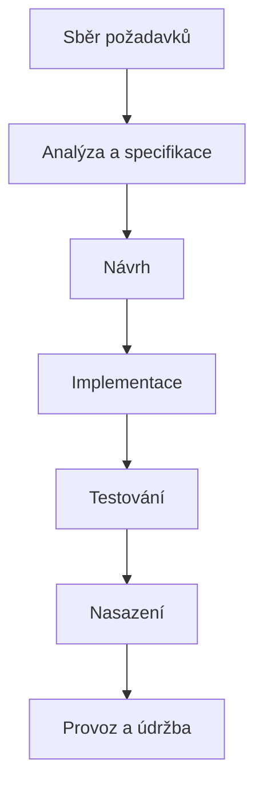

# Waterfall

> [← zpět na Procesy](../)

> **V jedné větě:** Vývoj rozdělený do fází, které jdou za sebou — každá se dokončí a schválí, než začne další.

> [!IMPORTANT]
> **Model je pojmenovaný podle článku, který ho kritizoval.** Winston W. Royce v roce 1970 nakreslil sekvenční postup jako *výchozí bod k diskusi*, hned pod něj napsal, že *„is risky and invites failure"*, a zbytek článku věnoval tomu, co s tím dělat. Slovo „waterfall" v jeho článku **není** — říkal tomu *„the simpler method"*. Kdo tvrdí, že Royce waterfall vymyslel a doporučoval, cituje článek, který nečetl.

---

## Jak model vypadá

Fáze jdou za sebou a každá se uzavírá výstupem, který se schválí:

Určující vlastnosti:

- **Fáze se nepřekrývají.** Nekóduje se, dokud není hotový návrh.
- **Každá fáze má výstup**, který se schvaluje — specifikace, návrhový dokument, testovací protokol.
- **Zpět se nechodí**, nebo jen za cenu formální změny (change request).
- **Rozsah se určuje na začátku** a je základem pro odhad ceny i termínu.

Z toho plyne i to hlavní: **hodnota se dodá až na konci.** Do té doby existuje dokumentace, ne fungující software.

---

## Co Royce doopravdy napsal

Článek *Managing the Development of Large Software Systems* přednesl Winston W. Royce na konferenci IEEE WESCON v srpnu **1970**. Postupuje v něm od jednoduchého k použitelnému.

Nejdřív ukázal sedmikrokový sekvenční postup — **System Requirements → Software Requirements → Analysis → Program Design → Coding → Testing → Operations** — a hned pod ním stojí věta, kterou celý pozdější mýtus popírá:

> „**I believe in this concept, but the implementation described above is risky and invites failure.**"

Jinde k tomu dodává:

> „in my experience, the simpler method has never worked on large software development efforts"

Problém, který na tom viděl, je konkrétní: **testování přijde až úplně na konci** — a právě tam se najdou věci, které se musí opravit v návrhu, tedy v tom, co je dávno hotové a schválené.

### Pět věcí, které navrhoval přidat

Zbytek článku není obhajobou sekvenčního postupu, ale seznamem toho, čím ho doplnit:

| | Doporučení |
| --- | ---------- |
| **1** | **Program design comes first** — navrhnout dřív, než se začne analyzovat do detailu |
| **2** | **Document the design** — návrh sepsat |
| **3** | **Do it twice** — udělat to dvakrát |
| **4** | **Plan, control and monitor testing** — testování plánovat a řídit, ne ho nechat na konec |
| **5** | **Involve the customer** — zapojit zákazníka v průběhu, ne až při předání |

Třetí bod je ten, kvůli kterému se o Roycovi mluví jako o předchůdci iterativního vývoje. Popsal ho takhle:

> „Note that it is simply **the entire process done in miniature**, to a time scale that is relatively small with respect to the overall effort."

Celý proces v malém, nanečisto, než se pustí ten ostrý. **To je prototyp — a myšlenkově iterace.** Páté doporučení, zapojit zákazníka průběžně, míří stejným směrem.

### Jak se z toho stal „waterfall"

Termín se v Roycově článku nevyskytuje. První doložené použití slova *waterfall* pro tenhle model je z roku **1976** — z článku Bella a Thayera *Software requirements: Are they really a problem?*

Rozšíření mu ale zajistilo něco jiného: **americké ministerstvo obrany**. Standard **DOD-STD-2167** (1985) a jeho revize **DOD-STD-2167A** (1988) v podstatě vyžadovaly sekvenční postup od dodavatelů vojenských systémů. Kdo chtěl dodávat státu, musel podle toho pracovat — a odtud se postup rozšířil do zbytku odvětví jako „ten správný způsob". Pozdější **MIL-STD-498** (1990. léta) omezení uvolnil, ale to už byl model zavedený.

**Waterfall se tedy nestal standardem proto, že by ho někdo obhájil.** Stal se jím proto, že se dal zapsat do smlouvy.

---

## Kdy dává smysl

Waterfall má pověst překonaného modelu, ale existují situace, kde je to rozumná volba — a mají společné to, že **změna je v nich opravdu drahá**:

- ✅ **Požadavky jsou známé a stabilní.** Migrace, přepis systému se stejným chováním, implementace předpisu.
- ✅ **Změna po nasazení stojí hodně.** Firmware v zařízení, které je u zákazníků a nejde vzdáleně aktualizovat.
- ✅ **Regulace nebo certifikace** vyžaduje schválenou dokumentaci před další fází — zdravotnictví, letectví, obrana.
- ✅ **Smlouva na pevný rozsah a cenu**, kde je specifikace zároveň právním dokumentem.
- ✅ **Software je součástí většího projektu** s hardwarem nebo stavbou, které iterovat nejdou.

Ve zkratce: **čím dražší je změna a čím jistější jsou požadavky, tím víc smyslu má rozhodnout dopředu.**

## Kdy nepoužít

- ❌ **Požadavky se během vývoje vyjasňují** — což je u nového produktu pravidlo, ne výjimka.
- ❌ **Zákazník neví přesně, co chce**, dokud něco neuvidí.
- ❌ **Zpětná vazba přijde až po nasazení** a to je pozdě na to, aby se z ní dalo těžit.
- ❌ **Trh nebo zadání se mění** rychleji, než trvá jeden průchod fázemi.
- ❌ **Riziko je v technologii**, ne v rozsahu — pak potřebuješ zkoušet brzy, ne plánovat dlouho.

---

## Časté chyby

Ne kritika modelu, ale věci, které se dělají špatně i tam, kde je waterfall na místě.

| Chyba | Proč vadí | Jak správně |
| ----- | --------- | ----------- |
| Testování až v poslední fázi | Chyby v návrhu se najdou, když je návrh dávno schválený | Royceovo doporučení č. 4 — testování plánovat od začátku |
| Zákazník vidí výsledek až při předání | Nedorozumění ze začátku se odhalí na konci | Doporučení č. 5 — zapojit ho průběžně |
| Žádný prototyp | Do ostrého běhu se jde bez ověření rizikových míst | Doporučení č. 3 — „do it twice" |
| Specifikace se považuje za neměnnou | Papír se schválil, realita se změnila | Změnové řízení, které není trestem |
| „Děláme waterfall, protože nemáme čas na proces" | Waterfall je víc procesu, ne míň | Chybí-li čas, ubírá se rozsah, ne fáze |
| Fáze se nepřekrývají ani tam, kde by mohly | Zbytečné prostoje | Royce sám překrývání navrhoval |
| Waterfall na nový produkt s neznámými požadavky | Nejdražší způsob, jak zjistit, že se zadání změnilo | Iterativní přístup — [Scrum](../Scrum/), [Kanban](../Kanban/) |

Předposlední řádek stojí za zdůraznění: **i „správně dělaný" waterfall podle Royce obsahuje prototyp, průběžné testování a zapojení zákazníka.** To, čemu se dnes waterfall říká — čistá sekvence bez zpětných vazeb — je přesně ta podoba, kterou označil za riskantní.

---

## Waterfall a agilní přístupy

[Agile Manifesto](../AgileManifesto/) z roku 2001 vznikl jako reakce na dodávání softwaru v tehdejší podobě. Jeho čtyři hodnoty se čtou jako přímý protiklad k sekvenčnímu modelu — zvlášť poslední:

> **Reagování na změny** před dodržováním plánu

Manifest ale ve své závěrečné větě dodává něco, co se cituje méně:

> „Jakkoliv jsou body napravo hodnotné, bodů nalevo si ceníme více."

**Plán tedy není bezcenný, jen se mu necení víc než reakci na změnu.** To je podstatné pro poctivé srovnání — nejde o „plánování versus žádné plánování".

| | **Waterfall** | **Iterativní přístupy** ([Scrum](../Scrum/), [Kanban](../Kanban/)) |
| --- | --- | --- |
| Rozsah | určen na začátku | upřesňuje se průběžně |
| Kdy je hodnota k dispozici | **na konci** | **průběžně** |
| Zpětná vazba | po nasazení | každou iteraci / průběžně |
| Co se považuje za jisté | požadavky | že se požadavky změní |
| Cena změny | roste s fází | drží se plochá |
| Vhodné, když | změna je drahá a zadání jisté | zadání se vyjasňuje za chodu |

**Hybridní podoby jsou běžné a legitimní.** Fázový postup na úrovni projektu s iteracemi uvnitř vývoje je v regulovaných prostředích standard — a je to blíž tomu, co Royce navrhoval, než čistá sekvence.

---

## Souvislost s naší prací

| Dokument | Souvislost |
| -------- | ---------- |
| [Agile Manifesto](../AgileManifesto/) | Vznikl jako reakce na dodávání v téhle podobě. |
| [Scrum](../Scrum/) · [Kanban](../Kanban/) | Iterativní protiklady; oba dodávají hodnotu průběžně. |
| [Git Workflows](../../GitWorkflows/#jak-vybrat) | Volba modelu větvení se ptá přesně na tohle: **je mezi „hotovo" a „v produkci" stabilizační fáze?** Fázový vývoj ji má. |
| [GitFlow](../../GitWorkflows/GitFlow/) | Model větvení, který s plánovanými vydáními a stabilizační fází počítá — proto k fázovému dodávání sedí nejlíp. |
| [GitHub Flow](../../GitWorkflows/GitHubFlow/) · [Trunk-Based](../../GitWorkflows/TrunkBasedDevelopment/) | Naopak předpokládají průběžné nasazování; s fázovým vývojem se nepotkají. |

> [!NOTE]
> Stojí za povšimnutí, že **metodika dodávání a model větvení jsou dvě různá rozhodnutí**, která spolu jen souvisejí. Tým může dělat [Scrum](../Scrum/) a přitom vydávat ve verzích přes [GitFlow](../../GitWorkflows/GitFlow/). Rozhoduje frekvence nasazení, ne název metodiky — je to [rozebrané u modelů větvení](../../GitWorkflows/#jak-vybrat).

---

## Zdroje

- Winston W. Royce: *Managing the Development of Large Software Systems*, Proceedings of IEEE WESCON, srpen 1970 — původní článek
- [David A. Wheeler: *The Waterfall Model*](https://dwheeler.com/essays/waterfall.html) — rozbor toho, co Royce skutečně napsal
- Bell, T. E., Thayer, T. A.: *Software requirements: Are they really a problem?*, Proceedings of the 2nd ICSE, 1976 — první doložené použití termínu „waterfall"
- [DOD-STD-2167A](https://en.wikipedia.org/wiki/DOD-STD-2167A) — standard, který model rozšířil
