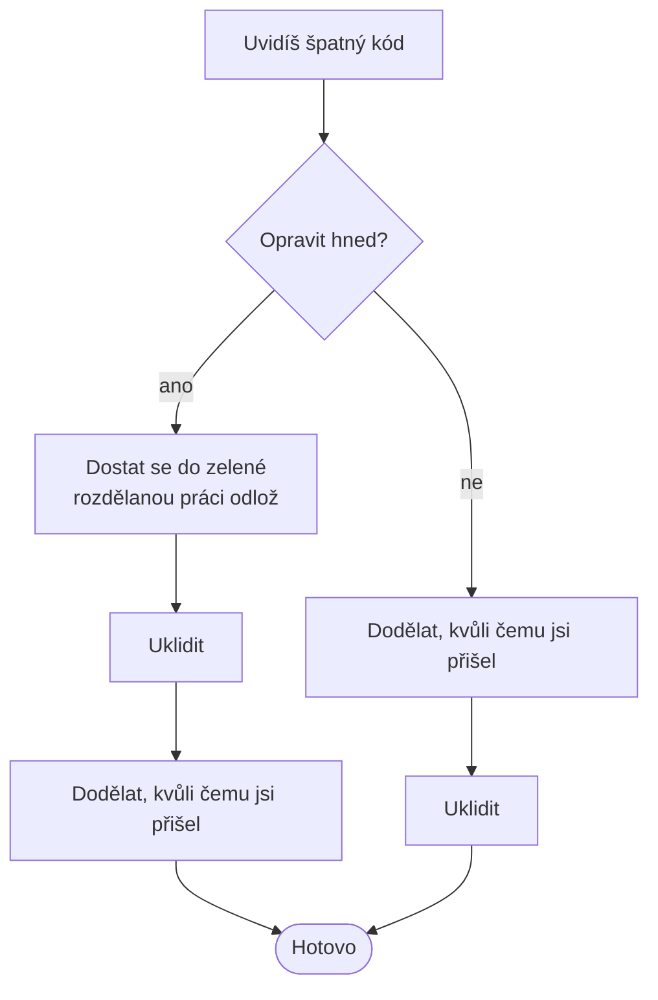

# Litter-pickup refactoring

> [← zpět na Refaktoring](../)

> **V jedné větě:** Když při práci na něčem jiném narazíš na nepořádek, ukliď ho — ale jen ten, na který stačí pár řádků, a nikdy ve stejném commitu jako změnu chování.

Fowler tomu říká **camp site rule**:

> „This is often referred to as the camp site rule. **Always leave the code better than when you found it.**"
>
> — Martin Fowler, *Workflows of Refactoring*, 2014

Pravidlo pochází ze skautingu a do programování ho přenesl Robert C. Martin v eseji *The Boy Scout Rule*. Jeho verze je konkrétnější, protože mluví o commitu:

> „Always check a module in **cleaner** than when you checked it out."
>
> — Robert C. Martin, *97 Things Every Programmer Should Know*, 2010

Skautské pravidlo zní „always leave the campground cleaner than you found it" a je samo o sobě parafrází věty Roberta Baden-Powella: *„Try and leave this world a little better than you found it."*

---

## Kdy po tom sáhnout

Spouštěč je jednoduchý a je to spouštěč, na který **nemáš zadání**: jsi v souboru kvůli něčemu jinému a vidíš nepořádek.

**Poznáš to podle:**

- nepoužitý `use` nahoře v souboru
- privátní metoda, kterou nikdo nevolá
- proměnná `$p`, u které musíš dohledat, co drží
- stejný řetězec podruhé o dvacet řádků níž
- komentář, který popisuje kód, jaký tam býval

Všech pět má společné, že **na jejich opravu se nemusíš ptát a nemusíš u nich přemýšlet**. To je definice odpadku. Věc, u které přemýšlet musíš, odpadek není — [a to je celý ten rozdíl](#kde-je-hranice).

> [!NOTE]
> Většinu z toho seznamu najde statická analýza dřív než ty. To není důvod ji nedělat ručně — je to důvod si ten nástroj pustit, než začneš.

---

## Fowlerův postup

Litter-pickup a [comprehension refactoring](../ComprehensionRefactoring/) jsou podle Fowlera **oportunistické refaktoringy**: u obou narazíš na problém, když děláš něco jiného. Proto mají společný postup.



Na tom diagramu jsou dvě věci, které se běžně přehlížejí.

**První: obě větve končí úklidem.** Odpověď „ne" neznamená „neuklidím", ale „uklidím až potom". Fowler to říká přímo:

> „Getting the feature finished is not enough to be done. You also have to ensure the code you touched is clean (or at least cleaner than when you found it)."

**Druhá: než začneš uklízet, musíš být v zelené.** Refaktoring se nedělá nad rozdělanou prací, protože pak nejde poznat, co rozbilo testy. Fowler doporučuje rozdělanou změnu odložit stranou (`git stash`) a vrátit se k ní po úklidu.

Kdy se rozhodnout pro „hned":

> „Fixing right away is a good move if it's **a simple fix**, or if the fix will **make it easier to add the feature** you're currently working on."

Ta druhá polovina věty je zajímavá: v okamžiku, kdy úklid usnadní tvou vlastní práci, přestává to být litter-pickup a stává se z toho [přípravný refaktoring](../PreparatoryRefactoring/).

---

## Jak to vypadá

Přišlo hlášení: **objednávka přesně za 1 000 Kč platí dopravu, i když ji má mít zdarma.** Oprava je jeden znak.

```php
if ($orderValue > self::FREE_FROM) {   // má být >=
    return 0;
}
```

Jenže v tom souboru je při té příležitosti vidět tohle:

```
nepoužitý import                DateTimeImmutable
mrtvá privátní metoda           oldLabel
jednopísmenná proměnná          $c, $p
duplicitní literál              'zdarma'
magické číslo v těle metody     10000, 5000
```

Nabízejí se tři cesty a demo je spočítá vedle sebe.

### Cesta C: opravím a jdu dál

```
+1  -1 řádek        chyba opravena        odpadků zbylo: 7
```

Nejmenší možný diff. Zákazník je spokojený, kód je stejně ošklivý jako předtím — a příští člověk začne přesně tam, kde jsi začal ty. Tohle je ta nejčastější cesta a **ve Fowlerově postupu vůbec není**.

### Cesta A: všechno v jednom commitu

```
+17 -21 řádků       chyba opravena        odpadků zbylo: 0
```

Výsledek je správný, ale **recenzent hledá tu jednu podstatnou řádku mezi 38**. A když se za měsíc ukáže, že oprava byla špatně, nedá se ten commit vrátit, aniž bys vrátil i úklid.

### Cesta B: dva commity

```
commit 1 (úklid)     +16 -20 řádků    mění chování? ne
commit 2 (oprava)     +1  -1 řádek    mění chování? ano — a je vidět kde
```

Stejný cílový stav jako cesta A. Rozdíl je jen v tom, že **v druhém commitu jsou dva řádky a jeden z nich je ta chyba**.

Demo navíc ověří, co je u refaktoringu to podstatné: úklidový commit **nezměnil ani jeden z 30 testovaných případů**. Změnu chování přinesla jen ta jedna řádka — v šesti případech, a všechny jsou to objednávky přesně za 1 000 Kč.

To je zase pravidlo [dvou klobouků](../TwoHats/): buď měníš chování, nebo strukturu, nikdy obojí v jednom commitu.

---

## Kde je hranice

Odpadek se pozná podle toho, že jeho úklid **nesáhne mimo soubor, ve kterém zrovna jsi**. Demo to měří:

| Úklid | Řádků diffu | Sáhne mimo soubor? |
| ----- | ----------- | ------------------ |
| Nepoužitý import | 2 | ne |
| Mrtvá privátní metoda | 5 | ne |
| Pojmenování a konstanty | 36 | ne |
| Rozdělit třídu podle [SRP](../../SoftwareDesign/Principles/SOLID.md#single-responsibility-principle-srp) | 66 | **ano — všechna volání** |

Ten poslední řádek není odpadek. Je to **správná změna ve špatnou chvíli** — a Fowler na ni má jasnou odpověď:

> „If the refactoring ends up being longer than is reasonable, **stash the refactoring and come back to it later**."

Praktické měřítko, které z toho plyne: **odpadek je to, co zvládneš, aniž bys musel otevřít druhý soubor.** Jakmile musíš, přestal jsi uklízet a začal jsi refaktorovat — a to je jiný úkol s jiným rozpočtem.

---

## Tři oportunistické spouštěče vedle sebe

Všechny tři vypadají zvenčí stejně (měníš kód, kvůli kterému jsi nepřišel), ale liší se tím, **co tě k tomu donutilo**. Fowler si toho rozdílu všímá výslovně — o comprehension píše, že by se dal považovat za druh litter-pickupu, ale *„I think of them as different since the trigger is different"*.

| | **Litter-pickup** | [Comprehension](../ComprehensionRefactoring/) | [Preparatory](../PreparatoryRefactoring/) |
| --- | --- | --- | --- |
| Spouštěč | „tohle je ošklivé" | „nerozumím tomu" | „nemám kam to napsat" |
| Souvisí to s tvým úkolem? | **ne** | ne | **ano, je to podmínka** |
| Kdy skončíš | když je to čitelnější | když tomu rozumíš | když jde změna napsat |
| Trvá | minuty | minuty až hodiny | hodiny až den |
| Co když to neuděláš | nepořádek roste | příště se to čte znovu | změna se udělá špatně |

Prostřední řádek je ten, který v praxi rozhoduje o rozpočtu. **Přípravný refaktoring si můžeš obhájit** — bez něj se úkol udělat nedá. Litter-pickup si obhájit nemůžeš, a proto musí být malý.

---

## Ekonomika

Fowler v témže infodecku předjímá námitku, kterou uslyšíš na každém plánování: *„Is refactoring wasteful rework?"* Odpověď formuluje jako pravidlo, které jde použít při rozhodování:

> „**Don't refactor unless you think you will recoup your investment later by quicker work.**"

A hned k tomu dodává, jak se ta investice drží malá:

> „Use refactoring to make things cleaner, but **don't try to completely fix things**. The key is gradual improvement through many passes through the codebase."

Tohle je vlastně celý litter-pickup v jedné větě. Nesnaží se soubor opravit — snaží se ho nechat **o kousek lepší**, a spoléhá na to, že tudy někdo půjde znovu.

---

## Časté chyby

| Chyba | Proč vadí | Jak správně |
| ----- | --------- | ----------- |
| Úklid a oprava v jednom commitu | Podstatná řádka se ztratí mezi 38 dalšími a nejde vrátit zvlášť | Dva commity |
| Úklid nad rozdělanou prací | Testy jsou červené a nejde poznat proč | `git stash`, uklidit v zelené, pak pokračovat |
| Z úklidu se stane přepis souboru | Z opravy na půl hodiny je půldenní pull request | Ven ze souboru = konec úklidu |
| „Poznamenám si to" a nikdy se to neudělá | Poznámka bez termínu je totéž jako nic | Buď hned, nebo jako úkol s vlastním commitem |
| Uklízí se v cizím modulu | Rozbiješ někomu diffy a pošleš mu review, o které nestál | Domluvit se; u cizího kódu jen to, čeho se opravdu dotýkáš |
| Úklid se neprobere s recenzentem | Recenzent netuší, proč pull request sahá do těchhle míst | Napsat do popisu, že commit 1 je úklid a nemění chování |
| Zamění se za refaktoring bez testů | Není jak poznat, že úklid něco rozbil | [Charakterizační testy](../CharacterizationTests/) |

Čtvrtý řádek je nejzrádnější a demo ho ilustruje cestou C. **Chování je totožné jako po uklizené cestě B** — rozdíl je jen v tom, co po sobě necháš. Právě proto se to tak snadno neudělá: nic to nerozbije a nikdo si toho hned nevšimne.

---

## Demo

```bash
php Refactoring/LitterPickupRefactoring/demo/run.php
```

Jednoznaková oprava chyby v souboru, ve kterém je sedm odpadků. Demo je nejdřív **najde tokenizérem** (nepoužitý import, mrtvá metoda, krátká jména, duplicitní literál, magická čísla) — a hned u toho ukáže past: mezi nálezy jsou i čísla `100` a `2` z `number_format()`, která odpadky nejsou. **Nástroj najde kandidáty, ne odpadky.**

Pak porovná tři cesty. Velikost commitů měří `git diff --numstat`, ne odhad:

```
commit                            + řádků    - řádků    mění chování?
C: jen oprava                     +1         -1         ano — a nic víc
A: jediný commit                  +17        -21        ano, někde uvnitř
B1: úklid                         +16        -20        ne
B2: oprava                        +1         -1         ano — a je vidět kde
```

Nakonec ověří na 30 vstupech, že **úklid nezměnil ani jeden případ**, a spočítá, kde je hranice mezi odpadkem a projektem: rozdělení třídy podle SRP vyjde na 66 řádků a sáhne na všechna volání.

---

## Související

| Dokument | Vztah |
| -------- | ----- |
| [Dva klobouky](../TwoHats/) | Pravidlo, kvůli kterému je úklid vlastní commit. |
| [Comprehension refactoring](../ComprehensionRefactoring/) | Druhý oportunistický refaktoring — stejný postup, jiný spouštěč. |
| [TDD refaktoring](../TddRefactoring/) | Úklid toho, čeho ses právě dotkl; tenhle dokument řeší zbytek souboru. |
| [Přípravný refaktoring](../PreparatoryRefactoring/) | Co se z litter-pickupu stane ve chvíli, kdy úklid usnadní tvou vlastní změnu. |
| [Charakterizační testy](../CharacterizationTests/) | Bez zelených testů se uklízet nedá; tohle je způsob, jak je získat. |
| [Plánovaný refaktoring](../PlannedRefactoring/) | Kam odložit úklid, který se do „pár řádků" nevejde — a proč je jeho převaha špatná zpráva. |
| [Refaktoring kódu](../Code/) | Konkrétní techniky pro úklid, který se do „pár řádků" nevejde. |
| [Extract Class](../Code/ExtractClass/) | Přesně ten případ z části „kde je hranice" — správná změna, špatná chvíle. |
| [Code review: autor](../../Processes/CodeReview/Author/) | Odkud pochází pravidlo o oddělených pull requestech a proč recenzentovi pomáhá. |
| [Code review: recenzent](../../Processes/CodeReview/Reviewer/) | Druhá strana: co dělat, když v pull requestu najdeš úklid smíchaný se změnou. |
| [SRP](../../SoftwareDesign/Principles/SOLID.md#single-responsibility-principle-srp) | Princip, jehož naplnění už je nad rámec úklidu. |
| [Pravidlo tří](../../SoftwareDesign/Principles/Simplicity.md#pravidlo-tří) | Kdy je duplicitní literál ještě náhoda a kdy už důvod k zásahu. |

---

## Původ

|             |                    |
| ----------- | ------------------ |
| **Autor**   | Robert C. Martin (pravidlo), Martin Fowler (pojmenování workflow) |
| **Rok**     | 2010 / 2014        |
| **Zdroj**   | Martin: *The Boy Scout Rule*; Fowler: *Workflows of Refactoring* |
| **Náročnost** | ●○○○○            |

Skautské pravidlo do programování přenesl **Robert C. Martin** v eseji *The Boy Scout Rule*, která vyšla v roce 2010 ve sbírce *97 Things Every Programmer Should Know* (editor Kevlin Henney). Jeho formulace mluví o commitu, ne o kódu obecně — *„always check a module in cleaner than when you checked it out"* — a to je na ní to podstatné.

**Martin Fowler** ho v roce 2014 zařadil mezi sedm workflow refaktoringu jako *Litter-Pickup Refactoring*, dal mu místo v postupu s rozhodovacím bodem „opravit hned?" a spojil ho s [comprehension refactoringem](../ComprehensionRefactoring/) pod hlavičku **oportunistických refaktoringů**.

Náročnost je jednička a je to jediná technika v téhle sekci, která ji má. Mechanika je triviální — smaž nepoužitý import. Těžké je jen jedno:

- **Přestat.** Uklizený soubor svádí uklidit ho celý. Hranice je v tom, jestli musíš otevřít druhý soubor.

---

## Zdroje

- Martin Fowler: [*Workflows of Refactoring*](https://martinfowler.com/articles/workflowsOfRefactoring/), 8. ledna 2014
- Robert C. Martin: [*The Boy Scout Rule*](https://github.com/97-things/97-things-every-programmer-should-know/blob/master/en/thing_08/README.md), in: *97 Things Every Programmer Should Know*, O'Reilly, 2010
- Martin Fowler: [*Opportunistic Refactoring*](https://martinfowler.com/bliki/OpportunisticRefactoring.html)

---

<details>
<summary>Metadata techniky</summary>

```yaml
name: Litter-pickup refactoring
level: příprava
author: Robert C. Martin (pravidlo), Martin Fowler (pojmenování workflow)
year: 2010
duration: minuty
reversible: ano — refaktoring nic nemění
requires_tests: ano
difficulty: 1
tags: [workflow, camp site rule, boy scout rule, dva klobouky, kdy refaktorovat]
leads_to: []
related: [ComprehensionRefactoring, PreparatoryRefactoring, CharacterizationTests, CodeReview]
status: done
```

</details>
