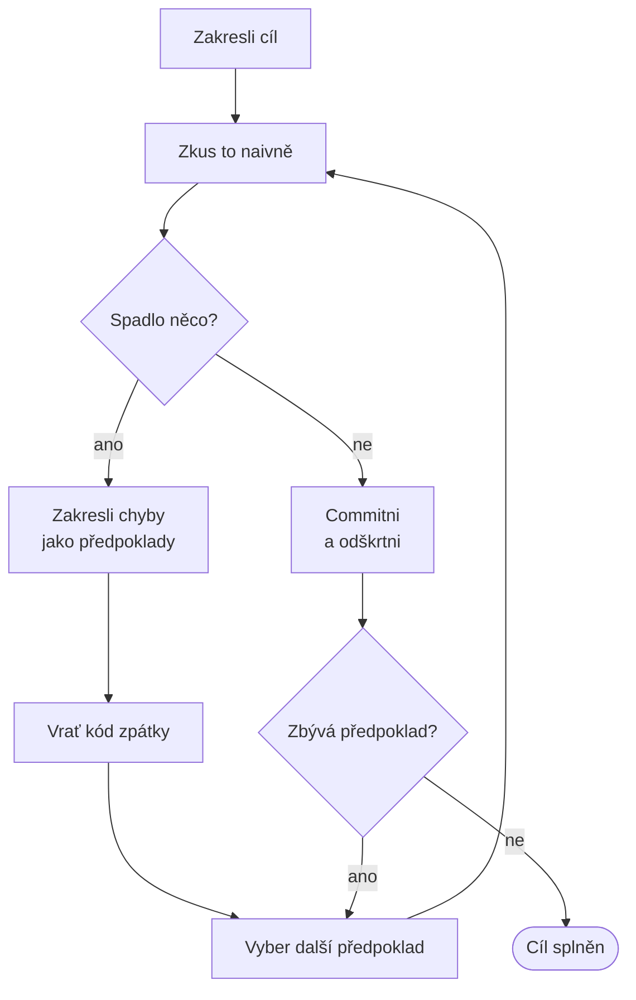

# Mikado metoda

> [← zpět na Refaktoring](../)

> **V jedné větě:** Postup, jak zjistit cestu velkou přestavbou — zkusíš změnu naivně, přečteš si, co spadlo, **vrátíš to zpátky**, a z nálezů poskládáš graf předpokladů, který pak projdeš od listů.

Metoda pochází z knihy **Oly Ellnestama a Daniela Brolunda** a její jméno je ze hry Mikado — tenkých tyčinek, ze kterých se odebírá jedna po druhé tak, aby se hromádka nesesypala.

> „The key to the Mikado Method is **removing the fewest obstacles at a time** in order to achieve real results, **without breaking the code**."
>
> — Ellnestam, Brolund: *The Mikado Method*, Manning, 2014

Stojí na čtyřech pojmech a tři z nich nikoho nepřekvapí: **stanov cíl, experimentuj, zakresli**. Čtvrtý je ten, kvůli kterému to celé funguje:

> „Of these four concepts, **the undo part is what people struggle with most**. At first, undoing feels very unintuitive and wasteful. But it's not waste; it's an important part of the learning process."

---

## Kdy po tom sáhnout

Když víš, **co** chceš, ale nevíš **kudy** — a čtení kódu ti to neřekne.

**Poznáš to podle:**

- „to nejde změnit, na tom visí půlka aplikace" — a nikdo neumí říct která
- zkusil jsi to a po hodině jsi měl třicet chyb od překladače a žádný plán
- odhad zní „nevím, může to být den i tři týdny"
- už jednou se to zkusilo a skončilo to zahozenou větví

Poslední bod je ten, na který Mikado odpovídá nejpřímočařeji. **Zahozená větev znamená, že se zahodilo i všechno, co se při tom zjistilo.** Mikado to zjištění vytáhne ven do grafu, takže revert kódu nic z něj neodnese.

> [!NOTE]
> Mikado není alternativa k technikám z [`System/`](../System/). Je to způsob, jak najít **pořadí**, ve kterém se použijí. Answer na otázku „kudy", ne „čím".

---

## Postup

Autoři ho popisují v osmi krocích. Zkráceně:

1. **Zakresli cíl** — jednou větou, jako kořen grafu.
2. **Zkus ho naivně splnit.** Bez přípravy, bez analýzy.
3. **Najdi chyby.** Když žádné nejsou, přeskoč na krok 8.
4. **Vymysli k nim okamžitá řešení** — bez přemýšlení nad tím, kam povedou.
5. **Zakresli je jako předpoklady** směřující k cíli.
6. **Vrať kód do výchozího stavu.**
7. **Opakuj to pro každý předpoklad** — vždycky nad čistým, funkčním kódem.
8. **Když nic nespadlo, commitni** a předpoklad v grafu odškrtni.



Šestý krok autoři píší nejdůrazněji z celé knihy:

> „When there are errors, you should **always roll back all changes. This is extremely important!** Editing code in an unknown state is very error-prone. […] **Repeatability and predictability trump activity, so roll back!**"

---

## Jak to vypadá

Cíl: **nikdo nevolá `Config::vatPercent()` staticky.** Jak se tam dostat, zatím nikdo neví.

### Pokus, chyba, revert

Demo skutečně provede pět pokusů a přečte, co po každém spadlo:

```
cíl: zrušit Config::vatPercent()    spadlo
  · Error: Call to undefined method Config::vatPercent()
  · Error: Call to undefined method Config::vatPercent()
PriceCalculator dostane DPH         spadlo
  · ArgumentCountError: … 0 passed in OrderService.php on line 9 …
  · ArgumentCountError: … 0 passed in Invoice.php on line 9 …
OrderService dostane DPH            spadlo
  · ArgumentCountError: … 0 passed in OrderReport.php on line 9 …
OrderReport dostane DPH             PROŠLO — je to list
Invoice dostane DPH                 PROŠLO — je to list
```

Chybové hlášky **jsou ten graf**. `0 passed in OrderService.php on line 9` neříká „chyba" — říká „`OrderService` je předpoklad."

Všimni si prvního pokusu: dvě hlášky, ale **jedna příčina**. Autoři na to upozorňují zvlášť — *„a single solution can sometimes take care of hundreds of errors with the same root cause. In that case, draw only one prerequisite."*

### Graf

```
Cíl: nikdo nevolá Config::vatPercent() staticky
└── PriceCalculator dostane DPH v konstruktoru
    ├── OrderService dostane DPH v konstruktoru
    │   └── OrderReport dostane DPH v konstruktoru   ← list
    └── Invoice dostane DPH v konstruktoru           ← list
```

**Graf se nekreslil dopředu. Vypadl z toho, co spadlo.** To je na metodě to podstatné: dependency mapa vznikne jako vedlejší produkt práce, ne jako fáze před ní.

### Průchod od listů

```
krok                                     změněno     kontrola
výchozí stav                             —           prošla
OrderReport dostane DPH           list   1 soubor    prošla
Invoice dostane DPH               list   1 soubor    prošla
OrderService dostane DPH                 2 soubory   prošla
PriceCalculator dostane DPH              3 soubory   prošla
Config::vatPercent() zrušena      CÍL    1 soubor    prošla
```

Pět kroků a **kód nebyl rozbitý ani jednou**. Každý z nich se dá samostatně nasadit a po každém se dá odejít.

### Proč to neprorazit rovnou

```
naráz od výchozího stavu k cíli     5 souborů
největší jednotlivý krok Mikada     3 soubory
```

Prorazit to znamená držet pět souborů v hlavě naráz a nemít mezitím funkční kód. To je přesně ta situace, ze které vzniká zahozená větev.

---

## Co se na tom lidem nelíbí

Stojí za to to pojmenovat dřív, než to řekne někdo v týmu, protože obě námitky jsou pochopitelné.

| Námitka | Co na to metoda |
| ------- | --------------- |
| „Zahazuju hodinu práce." | Zahazuješ kód, ne poznatek. Ten je v grafu — a **kód byl stejně špatně**, protože vznikal nad rozbitým stavem. |
| „Rychleji to opravím, než to celé vracet." | Někdy ano. Metoda se vyplatí tam, kde po opravě přijdou další tři chyby, které jsi nečekal. |

Autoři to shrnují takhle:

> „System development, and especially refactoring or restructuring, **focuses mostly on learning** about the system, the domain, the language, and the technology in use. Making the changes accounts for just a fragment of the total development time, and **the great value of the Naive Approach is what you learn** about the system."

Praktický kompromis, který kniha nabízí: když se ti změn nechce vzdát, ulož si je jako patch. Autoři k tomu ale poctivě dodávají, že *„often so many things have changed that the patch is invalid; with the prerequisites in place, it's usually easy to make the change anyway."*

---

## Mikado a zbytek sekce

Mikado se nepere s ničím, co v katalogu je. Doplňuje to z jiné strany:

| | Mikado odpovídá na | Ostatní odpovídají na |
| --- | --- | --- |
| [Dlouhodobý refaktoring](../LongTermRefactoring/) | **kudy** se k dohodnutému cíli dostat | že se to dělá v hlavní větvi mezi prací |
| [Plánovaný refaktoring](../PlannedRefactoring/) | **jak story rozdělit** na kroky, po kterých se dá odejít | že na ni je vyhrazený čas |
| [`System/`](../System/) | **v jakém pořadí** techniky nasadit | čím se ta výměna udělá |
| [Charakterizační testy](../CharacterizationTests/) | — | čím se pozná, že „spadlo" |

Ten poslední řádek je podmínka, ne doplněk. **Mikado stojí na tom, že se dá spolehlivě zjistit, co je rozbité.** Autoři to říkají přímo: *„these problems are hard to find by just reading the code, so an automated test suite is helpful."*

Vztah k [dlouhodobému refaktoringu](../LongTermRefactoring/) je nejtěsnější a autoři popisují stejnou past, jakou tam měří demo:

> „The Mikado Method path to change is a series of small, nondestructive changes **instead of the big, nasty integration at the end** of a refactoring project."

---

## Časté chyby

| Chyba | Proč vadí | Jak správně |
| ----- | --------- | ----------- |
| Pokus se neuvrátí a „doopraví se" | Edituješ kód ve stavu, o kterém nevíš, jak na tom je | Revert, vždycky |
| Cíl je vágní („uklidit konfiguraci") | Nepozná se, kdy je hotovo, a graf nemá kořen | Jedna věta, ověřitelná |
| Graf se kreslí dopředu analýzou | Strávíš den odhadem toho, co ti překladač řekne za minutu | Zkusit a přečíst chyby |
| Řeší se předpoklad, který není list | Rozbije se to znovu a jsi tam, kde jsi byl | Vždycky nejhlubší nevyřešený uzel |
| Předpoklady se vymýšlejí dopředu do hloubky | Většina z nich se ukáže jako zbytečná | Jen bezprostřední řešení chyby |
| Graf zůstane v hlavě | Po dvou dnech si ho nepamatuješ a tým do něj nevidí | Tabule nebo soubor v repozitáři |
| Používá se bez testů | „Spadlo" se pozná jen podle překladače, běhové chyby uniknou | [Charakterizační testy](../CharacterizationTests/) |

Předposlední řádek stojí za rozvedení. Kniha doporučuje volit médium podle délky práce: **tabule ve společném prostoru** u velkých přestaveb, papír u malých. U nás dává smysl i třetí možnost — graf jako soubor vedle kódu, protože přežije úklid kanceláře a jde ho revidovat.

---

## Demo

```bash
php Refactoring/MikadoMethod/demo/run.php
```

Demo **skutečně provede Mikado smyčku**, ne její popis. Vezme výchozí stav, aplikuje na kopii jeden naivní pokus, spustí kontrolu, vypíše všechno, co spadlo, a kopii zahodí. Pětkrát za sebou.

Tři pokusy spadnou a jejich chybové hlášky ukazují přesně na soubor a řádek, který je předpokladem. Dva projdou — to jsou listy grafu.

Pak projde připravené stavy od listů ke kořeni a u každého ověří chování. **Kód není rozbitý ani jednou z pěti kroků.** Nakonec spočítá, kolik souborů by se muselo změnit naráz (pět) proti největšímu jednotlivému kroku Mikada (tři).

Dočasné adresáře po sobě uklidí a dva běhy dávají totožný výstup.

---

## Související

| Dokument | Vztah |
| -------- | ----- |
| [Dlouhodobý refaktoring](../LongTermRefactoring/) | Nejtěsnější příbuzný: Mikado je odpověď na „kudy" u přestavby na měsíce. |
| [Plánovaný refaktoring](../PlannedRefactoring/) | Jak rozdělit story tak, aby po přerušení nezbyl nepořádek. |
| [Refaktoring systému](../System/) | Techniky, jejichž pořadí Mikado hledá. |
| [Branch by Abstraction](../System/BranchByAbstraction/) | Častý obsah uzlů v grafu u výměny implementace. |
| [Charakterizační testy](../CharacterizationTests/) | Podmínka: bez nich se nepozná, co „spadlo". |
| [Dva klobouky](../TwoHats/) | Každý odškrtnutý uzel je refaktoring — vlastní commit, beze změny chování. |
| [Comprehension refactoring](../ComprehensionRefactoring/) | Druhý způsob, jak se učit o cizím kódu; ten zapisuje význam, tenhle závislosti. |
| [Kanban](../../Processes/Kanban/) | Autoři metodu popisují jako nezávislou na procesu, ale s Kanbanem, Scrumem a XP se podle nich pojí dobře. |

---

## Původ

|             |                    |
| ----------- | ------------------ |
| **Autoři**  | Ola Ellnestam, Daniel Brolund |
| **Rok**     | 2014               |
| **Zdroj**   | *The Mikado Method*, Manning |
| **Náročnost** | ●●●○○            |

Metoda vznikla ve švédském Agical a knižně vyšla u Manningu v roce **2014**. Jméno je ze hry Mikado (u nás známé i jako „mikádo" nebo pick-up sticks): hromádka tyčinek, ze které se odebírá po jedné tak, aby se ostatní nepohnuly. Tyčinka uprostřed je cíl.

Autoři výslovně píšou, že metoda **není vázaná na proces** — *„agnostic to the development approach used, as long as there's room for executing the system and getting feedback from your actions"* — a že jim dobře funguje s XP, Scrumem a Kanbanem.

Trojka na náročnosti není za mechaniku; ta je triviální. Těžké jsou dvě věci a obě jsou proti instinktu:

- **Vracet fungující práci.** Instinkt říká „ještě jednu opravu a bude to". Metoda říká revert, a má pravdu.
- **Nepřemýšlet dopředu.** Pokušení je analyzovat, kam předpoklad povede. Autoři varují, že se tím ztratí hodiny za informaci, kterou překladač vydá za minutu.

---

## Zdroje

- Ola Ellnestam, Daniel Brolund: [*The Mikado Method*](https://www.manning.com/books/the-mikado-method), Manning, 2014 — [kapitola 1 zdarma](https://manning-content.s3.amazonaws.com/download/3/558b9be-92a7-4ebf-90ba-c7fdd830aea7/MikadoMethod_CH01.pdf)
- [mikadomethod.info](https://mikadomethod.info/) — stránky metody

---

<details>
<summary>Metadata techniky</summary>

```yaml
name: Mikado metoda
level: příprava
author: Ola Ellnestam, Daniel Brolund
year: 2014
duration: podle rozsahu — hodiny až měsíce
reversible: ano — revert je součást postupu
requires_tests: ano
difficulty: 3
tags: [postup, graf předpokladů, revert, velká přestavba, závislosti]
leads_to: [BranchByAbstraction]
related: [LongTermRefactoring, PlannedRefactoring, CharacterizationTests, System]
status: done
```

</details>
