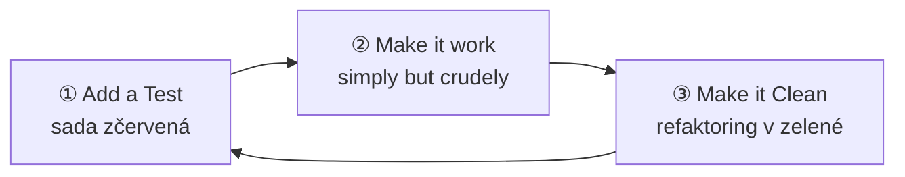

# TDD refactoring

> [← zpět na Refaktoring](../)

> **V jedné větě:** Třetí krok cyklu červená–zelená–refaktor, ve kterém se teprve dělá návrh — v zelené, na kódu, který už funguje.

Fowler cyklus popisuje třemi kroky a to číslování je podstatné:

> ① **Add a Test:** Use specification by example by adding a test for yet-to-be-built functionality. This test will fail, making the test suite red.
>
> ② **Make it work:** Make the failing test pass (go green) by implementing the necessary functionality **simply but crudely**.
>
> ③ **Make it Clean:** Use refactoring to ensure the overall code base is as clean and well-designed as possible **for currently-implemented functionality**.
>
> — Martin Fowler, *Workflows of Refactoring*, 2014



Nejdůležitější slova jsou ta zvýrazněná. **„Simply but crudely" znamená, že ve druhém kroku se má psát ošklivě.** Ne že se to toleruje — že se to má dělat. Návrh přijde až ve třetím kroku.

---

## Proč to nejsou dva kroky, ale tři

Nabízí se otázka obráceně: proč rovnou nenapsat kód dobře a druhý krok nespojit s třetím? Fowler na to odpovídá přímo:

> „While making the test work, we can focus just on the problem of adding the new functionality, **without thinking about how this functionality should be best structured**. Once things are working we can now concentrate on good design, while working in the **safer refactoring mode of small steps on a green test base**."

Jsou to tedy dvě různé práce a dělají se každá za jiných podmínek:

| | ② Make it work | ③ Make it Clean |
| --- | --- | --- |
| Na co myslíš | jak to zprovoznit | jak to má vypadat |
| Stav sady | červená → zelená | **zelená celou dobu** |
| Co znamená spadlý test | ještě nejsi hotový | **udělal jsi chybu** |
| Smí se změnit chování | ano, o to jde | **ne** |

Poslední dva řádky jsou celý rozdíl a pocházejí z metafory **dvou klobouků**, kterou Fowler používá jako základ pro všech sedm workflow:

> „When refactoring every change you make is a small behavior-preserving change. **You only refactor with green tests, and any test failing indicates a mistake.** […] During programming you may swap frequently between hats, perhaps every couple of minutes. But **you can only wear one hat at a time**."

V TDD se ty klobouky střídají nejrychleji ze všech workflow — někdy každé dvě minuty. Proto je tak snadné je splést dohromady a proto má cyklus tři kroky, ne dva.

---

## Jak to vypadá

Čtyři cykly, ve kterých vznikne validace hesla. Každý cyklus přidá jedno pravidlo a několik testů:

```
cyklus 1      sada má 2 testy
cyklus 2      sada má 3 testy
cyklus 3      sada má 6 testů
cyklus 4      sada má 11 testů
```

### Bez třetího kroku

Když se dělá jen červená–zelená, vznikne tohle: každá veřejná metoda vznikla proto, aby prošel jeden test, a pravidla si nese sama.

```php
public function isValid(string $password): bool
{
    if (strlen($password) < 8) {
        return false;
    }
    // …a další tři pravidla

public function problemsWith(string $password): array
{
    if (strlen($password) < 8) {
        $problems[] = 'heslo musí mít aspoň 8 znaků';
    }
    // …a tatáž další tři pravidla

public function firstProblem(string $password): ?string
{
    if (strlen($password) < 8) {
        return 'heslo musí mít aspoň 8 znaků';
    }
    // …a potřetí
```

**Ten kód je správně.** Prochází celou sadu, jedenáct z jedenácti. Jenom je v něm každé pravidlo napsané třikrát — a páté pravidlo se bude psát taky třikrát.

### S třetím krokem

```php
public function problemsWith(string $password): array
{
    $problems = [];

    foreach (self::rules() as $rule) {
        if (!$rule['isSatisfiedBy']($password)) {
            $problems[] = $rule['problem'];
        }
    }

    return $problems;
}

public function isValid(string $password): bool
{
    return $this->problemsWith($password) === [];
}

public function firstProblem(string $password): ?string
{
    return $this->problemsWith($password)[0] ?? null;
}
```

Táž sada, týž výsledek, jiný tvar:

```
varianta              testy     řádků    míst s pravidlem    složitost
bez třetího kroku     11/11     81       3                   13
s třetím krokem       11/11     65       1                   3
```

**Ten tvar nikdo nenavrhl dopředu.** Vznikl ve třetím kroku čtvrtého cyklu, kdy bylo poprvé vidět, že pravidla jsou čtyři a chovají se stejně. Po prvním pravidle by ho nešlo vymyslet a po druhém by to byl [odhad](../../SoftwareDesign/Principles/Simplicity.md#yagni--you-arent-gonna-need-it).

> [!NOTE]
> `isSatisfiedBy` není náhodné jméno. Tenhle tvar je krok od [Specification](../../SoftwareDesign/DDD/Specification/) — a to je na TDD refaktoringu to hezké: ke vzoru se nedojde tím, že se pro něj někdo rozhodne, ale tím, že se třikrát uklidí.

---

## Proč se refaktoruje až v zelené

Třetí krok vypadá bezpečně — nemění se přece chování. Demo ukazuje, jak snadno se to nepovede. Táž změna, jen udělaná úsporněji přes `array_filter()`:

```php
public function problemsWith(string $password): array
{
    return array_filter(
        array_map(/* … */),
        static fn (?string $problem): bool => $problem !== null,
    );
}
```

`array_filter()` **zachovává klíče**. Když projde první pravidlo a selže třetí, v poli není index `0` — a `firstProblem()` vrátí `null` místo hlášky.

```
prošlo      8/11
spadlo      3

  · heslo bez velkého písmene má jeden problém  (z cyklu 3)
  · mezera je hlášená jako problém  (z cyklu 4)
  · první problém je i ten, který není první v pořadí  (z cyklu 4)
```

**Tu chybu nenašel člověk ani nově psaný test.** Našly ji testy, které v sadě v tu chvíli už byly — napsané v cyklech předtím, kvůli něčemu jinému. To je celý důvod, proč třetí krok přichází až po zelené: sada z prvních dvou kroků je zadarmo dostupná síť a v tu chvíli je nejhustší, jaká kdy bude.

---

## Kdy to nestačí

TDD refaktoring uklidí **to, čeho ses právě dotkl** — Fowlerovými slovy „for currently-implemented functionality". Nic víc. Fowler to říká sám:

> „TDD refactoring is a common workflow for refactoring, but **it isn't the only way** that refactoring should be part of a programmer's day."

| Situace | TDD refaktoring | Co místo toho |
| ------- | --------------- | ------------- |
| Právě jsi rozsvítil test | **přesně tohle** | — |
| Nepořádek o dva soubory vedle | ne — nedotkl ses ho | [Litter-pickup](../LitterPickupRefactoring/) |
| Nerozumíš kódu, který voláš | ne — testy k němu nemáš | [Comprehension](../ComprehensionRefactoring/) |
| Musíš přidat funkci do nepřipraveného místa | ne — jsi před cyklem, ne v něm | [Přípravný](../PreparatoryRefactoring/) |
| Celý modul má pravidlo na třech místech | ne — to je na dny | [Plánovaný](../PlannedRefactoring/) |
| Kód, ke kterému testy neexistují | **nedá se** | [Charakterizační testy](../CharacterizationTests/) |

Poslední řádek je podmínka, ne varianta. **Bez testů žádný TDD refaktoring není** — a v cizím kódu je to ten obvyklý případ.

---

## Sedm workflow, a kde je najdeš

Tímhle dokumentem je pokryto všech sedm způsobů, kterými se podle Fowlera refaktoring dostává do práce:

| Workflow | Kdo rozhoduje | Kde je to popsané |
| -------- | ------------- | ----------------- |
| **Two Hats** | vývojář, průběžně | [Dva klobouky](../TwoHats/) |
| **TDD Refactoring** | vývojář, minuty | tenhle dokument |
| **Litter-Pickup** | vývojář, minuty | [Litter-pickup](../LitterPickupRefactoring/) |
| **Comprehension** | vývojář, hodiny | [Comprehension](../ComprehensionRefactoring/) |
| **Preparatory** | vývojář, hodiny až den | [Přípravný](../PreparatoryRefactoring/) |
| **Planned** | tým | [Plánovaný](../PlannedRefactoring/) |
| **Long Term** | tým, někdy byznys | [Refaktoring systému](../System/) |

Fowler k tomu dodává, co z toho plyne pro tým, který má pocit, že refaktoruje málo:

> „For most teams this needs **more effort into the day-to-day refactoring workflows** in order to introduce steady improvement."

Tabulka to ukazuje na prvním sloupci: **první čtyři řádky jsou práce, o které se nikoho neptáš.** Když se refaktoring odehrává hlavně na posledních dvou, něco není v pořádku — a to je [ten bad smell](../PlannedRefactoring/#kdy-je-to-špatná-zpráva).

---

## Časté chyby

| Chyba | Proč vadí | Jak správně |
| ----- | --------- | ----------- |
| Cyklus se dělá jako červená–zelená | Pravidlo se píše potřetí a nikdo si toho nevšimne | Třetí krok je součást cyklu, ne bonus |
| Ve druhém kroku se hned píše „hezky" | Řešíš dvě věci najednou a obojí hůř | „Simply but crudely" — návrh až potom |
| Refaktoruje se v červené | Spadlý test může znamenat obojí a nevíš co | Nejdřív zelená, pak refaktoring |
| Ve třetím kroku se přidá i chování | Přestává to být vratné a klobouky se smíchaly | Nová funkce = nový cyklus |
| Návrh se dělá dopředu | Uklízíš tvar, který se za dva cykly ukáže jako špatný | „For currently-implemented functionality" |
| Třetí krok se odloží „až po sprintu" | Sada je nejhustší teď; za týden bude práce dražší | Uklidit hned, dokud je kontext v hlavě |
| Uklízí se i to, čeho ses nedotkl | Diff nabobtná a review se rozpadne | To je [litter-pickup](../LitterPickupRefactoring/), a ten má vlastní pravidla |

Třetí řádek je ten, který demo měří. **V červené se nedá poznat, jestli test padá kvůli chybějící funkci, nebo kvůli tvé chybě** — a to je přesně informace, kvůli které refaktoring v zelené funguje.

---

## Demo

```bash
php Refactoring/TddRefactoring/demo/run.php
```

Validace hesla postavená ve čtyřech cyklech. Testovací sada je jedenáct testů bez frameworku a je pro všechny varianty stejná — liší se jen to, jestli se po zelené udělal třetí krok.

```
varianta              testy     řádků    míst s pravidlem    složitost
bez třetího kroku     11/11     81       3                   13
s třetím krokem       11/11     65       1                   3
```

Obě verze projdou. Rozdíl není v chování, ale v tom, kolikrát je každé pravidlo napsané.

Poslední část je ta zajímavá: demo udělá **třetí krok špatně** — `array_filter()` místo `foreach`, tedy změna, která vypadá jako úspora a mění chování. Sada spadne na třech testech a demo u každého vypíše, ze kterého cyklu pochází. Všechny tři tam byly **dřív**, než refaktoring začal.

---

## Související

| Dokument | Vztah |
| -------- | ----- |
| [Dva klobouky](../TwoHats/) | Pravidlo, kvůli kterému má cyklus tři kroky, a ne dva. |
| [Přípravný refaktoring](../PreparatoryRefactoring/) | Druhé místo, kde se ty dva commity oddělují. |
| [Litter-pickup](../LitterPickupRefactoring/) | Co s nepořádkem, kterého ses v cyklu nedotkl. |
| [Comprehension refactoring](../ComprehensionRefactoring/) | Když nerozumíš kódu, který v cyklu voláš. |
| [Plánovaný refaktoring](../PlannedRefactoring/) | Co zbude, když se třetí krok soustavně vynechává. |
| [Charakterizační testy](../CharacterizationTests/) | Jak dostat síť tam, kde ji TDD nevytvořilo. |
| [Refaktoring kódu](../Code/) | Konkrétní techniky, ze kterých se třetí krok skládá. |
| [Specification](../../SoftwareDesign/DDD/Specification/) | Kam ten tvar z dema vede, když pravidel přibude. |
| [Extreme Programming](../../Processes/ExtremeProgramming/) | Odkud TDD pochází a proč je refaktoring jeho praktikou, ne fází. |
| [YAGNI](../../SoftwareDesign/Principles/Simplicity.md#yagni--you-arent-gonna-need-it) | Proč se ve třetím kroku uklízí jen to, co už existuje. |
| [DRY](../../SoftwareDesign/Principles/Simplicity.md#dry--dont-repeat-yourself) | Co se ve třetím kroku obvykle odstraňuje. |

---

## Původ

|             |                    |
| ----------- | ------------------ |
| **Autor**   | Kent Beck (cyklus), Martin Fowler (pojmenování workflow) |
| **Rok**     | 2014 (pojmenování) |
| **Zdroj**   | Fowler: *Workflows of Refactoring* |
| **Náročnost** | ●●○○○            |

Cyklus červená–zelená–refaktor je součástí **test-driven development**, jak ho popsal Kent Beck — a TDD samo je jednou z praktik [Extreme Programming](../../Processes/ExtremeProgramming/). Fowler mu v roce 2014 dal místo mezi sedmi workflow refaktoringu jako *TDD Refactoring* a použil ho jako vstup do metafory dvou klobouků: *„Why have two distinct steps? […] To explain this, I'll introduce the metaphor of Two Hats."*

Náročnost je dvojka a je celá v disciplíně. Mechanika třetího kroku jsou běžné [refaktoringy kódu](../Code/) a testy k nim už máš. Těžké jsou dvě věci:

- **Psát ve druhém kroku ošklivě.** Zvlášť když je zřejmé, jak by to mělo vypadat. Fowlerovo „simply but crudely" je pokyn, ne omluva.
- **Neodejít po zelené.** Test svítí, úkol vypadá hotový a další čeká. Třetí krok nemá vlastní signál, který by řekl „ještě ne".

---

## Zdroje

- Martin Fowler: [*Workflows of Refactoring*](https://martinfowler.com/articles/workflowsOfRefactoring/), 8. ledna 2014
- Martin Fowler: [*Refactoring: Improving the Design of Existing Code*](https://martinfowler.com/books/refactoring.html), 2. vydání, 2018
- Kent Beck: *Test-Driven Development: By Example*, Addison-Wesley, 2002

---

<details>
<summary>Metadata techniky</summary>

```yaml
name: TDD refactoring
level: příprava
author: Kent Beck (cyklus), Martin Fowler (pojmenování workflow)
year: 2014
duration: minuty
reversible: ano — refaktoring nic nemění
requires_tests: ano — vznikly v prvním kroku
difficulty: 2
tags: [workflow, red-green-refactor, TDD, dva klobouky, emergentní návrh]
leads_to: [Specification]
related: [PreparatoryRefactoring, LitterPickupRefactoring, ComprehensionRefactoring, PlannedRefactoring, ExtremeProgramming]
status: done
```

</details>
