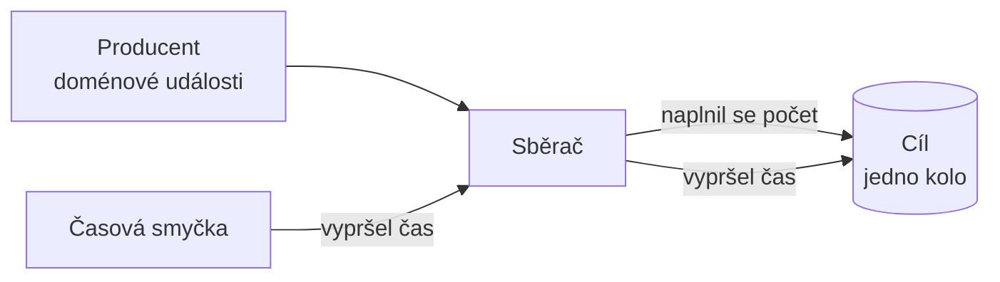

# Batching (Dávkování)

> [← zpět na Architecture](../)

> **V jedné větě:** Zprávy se nezpracovávají po jedné, ale sbírají se do dávky, která se odešle **při naplnění počtu, nebo po vypršení času** — podle toho, co nastane dřív.

> [!NOTE]
> **Tenhle vzor nemá jedno ustálené jméno** a hledá se proto špatně. Jako technika je to *batching* nebo *micro-batching*; v [EIP](../../EIP/) je nejbližší **Aggregator**; v reaktivních knihovnách se ta operace jmenuje `groupedWithin` (Akka) nebo `bufferTime` (RxJS). Popisuje se tu ta podoba, která řeší **zátěž**, ne slučování souvisejících zpráv.

---

## Problém

Systém je postavený na událostech a každá doménová entita při změně nějakou vydá. V běžném provozu je to pár událostí za minutu a nikdo si toho nevšimne.

Pak přijde **import**.

```php
foreach ($rows as $row) {
    $order = Order::fromImport($row);
    $this->repository->save($order);

    foreach ($order->releaseEvents() as $event) {
        $this->bus->publish($event);      // ← a tady to praskne
    }
}
```

Dva tisíce objednávek po pěti událostech je **deset tisíc kol** s cílovým systémem. Každé z nich má svou režii — spojení, transakci, potvrzení, zápis do indexu — a ta režie je obvykle dražší než ta práce sama.

**Poznáš to podle:**

- import, který v malém běží vteřinu a v produkci hodinu
- cílový systém (Elasticsearch, fronta, webhook, cizí API) začne odmítat nebo zpomalovat
- v grafu je vidět špička, která nemá nic společného s množstvím dat, jen s jejich rozdělením
- dávkový běh v noci položí i to, co přes den funguje
- při importu se zdrží i běžný provoz, přestože s ním nesouvisí

---

## Řešení

Mezi producenta a cíl se postaví **sběrač**, který drží zprávy a vyprázdní se při splnění kterékoli ze dvou podmínek.



```php
final class Batcher
{
    public function add(string $message, float $now): void
    {
        $this->firstAddedAt ??= $now;
        $this->buffer[] = $message;

        if (count($this->buffer) >= $this->maxSize) {
            $this->doFlush($now, 'velikost');
        }
    }

    /** Časová smyčka. Volá se pravidelně, ať se něco stalo, nebo ne. */
    public function tick(float $now): void
    {
        if ($this->buffer !== [] && $now - $this->firstAddedAt >= $this->maxSeconds) {
            $this->doFlush($now, 'čas');
        }
    }
}
```

### Proč zrovna dvě podmínky

Protože každá pokrývá jiný provozní režim a **ani jedna sama o sobě nestačí**. Demo to ukazuje na provozu, kde po importu následuje běžný den:

```
důvod           vyprázdnění     průměrná dávka
velikost        4               500
čas             12              1
```

Při importu se dávka plní a spouští ji **velikost**. V běžném provozu by jedna zpráva čekala na dalších 499 — možná do rána — a proto ji pouští **čas**.

| Jen počet | Jen čas |
| --------- | ------- |
| Poslední zprávy v bufferu čekají, dokud nepřijde další provoz | Špička se nerozloží — jen se posune o interval |
| V klidném období se nemusí odeslat nikdy | Při importu vzniknou obří, nebo naopak zbytečně malé dávky |

---

## Účastníci

| Účastník | Role |
| -------- | ---- |
| **Producent** | Vydává zprávy, o dávkování neví. |
| **Sběrač** | Drží buffer a zná obě podmínky. |
| **Časová smyčka** | Tiká nezávisle na provozu a spouští vyprázdnění podle času. |
| **Cíl** | Přijímá **dávku**, ne jednotlivé zprávy — a musí to umět. |

Poslední řádek je podmínka, ne detail. **Když cíl neumí přijmout dávku, nemáš co dávkovat** — jen bys N volání schoval do smyčky o vrstvu níž a nic tím neušetřil.

---

## Co tím získáš a co za to dáš

```
událostí celkem               2012
bez dávkování                 2012 kol
s dávkováním                  16 kol
```

**Kol ubylo 125×.** To je celý zisk a zároveň jediné číslo, které se dá spočítat bez znalosti tvojí infrastruktury — kolik ušetříš času, závisí na tom, co tě jedno kolo stojí.

A cena:

```
důvod vyprázdnění   nejdelší čekání     čím je omezené
velikost            1.25 s              rychlostí provozu
čas                 3.00 s              limitem 3.0 s + tikem 0.5 s
```

**Dávkování mění propustnost za latenci** a časový limit je cenovka toho obchodu: nastavuješ, jak dlouho smí nejpomalejší zpráva čekat.

> [!IMPORTANT]
> **Skutečná horní mez není limit, ale limit plus perioda časové smyčky.** Když smyčka kontroluje buffer každou půlsekundu a limit je 3 s, může zpráva čekat 3,5 s. Kdo si nastaví 3 a naměří 3,4, nemá chybu — má jen smyčku, o které zapomněl.

---

## Past, která se pozná až při pádu

```
přidáno do bufferu                120
předáno dál                       0
čeká na vyprázdnění               120
když teď proces spadne            120 zpráv je pryč
```

**Buffer je v paměti.** Nasazení, OOM killer i obyčejný restart ho vezmou s sebou — a nikde se to neprojeví, protože zprávy do systému dorazily a byly přijaty. Ztráta se pozná až tím, že něco chybí.

Proto k dávkování patří dvě věci, které nejsou volitelné:

1. **Vyprázdnění při ukončení.** Odchyť `SIGTERM` a buffer dopiš, než proces skončí.
2. **Zdroj, ze kterého jde nedoručené vyčíst znovu.** Dokud je zpráva jen v paměti, neexistuje. Bezpečná podoba je přijmout zprávu, uložit ji (fronta, tabulka) a dávkovat až **čtení** z toho úložiště.

Druhý bod je rozdíl mezi „zrychlili jsme to" a „zrychlili jsme to a občas nám mizí data".

---

## Kdy použít

- ✅ Režie jednoho volání je srovnatelná s prací samotnou, nebo větší.
- ✅ Cíl umí přijmout dávku a je na ni rychlejší (hromadný `INSERT`, bulk API, `_bulk` v Elasticsearchi).
- ✅ Provoz je nerovnoměrný — klid střídaný importy.
- ✅ Zpoždění v řádu sekund nikomu nevadí.

## Kdy nepoužít

- ❌ **Uživatel čeká na výsledek.** Latence je tu daň, ne bonus.
- ❌ **Cíl dávku neumí.** Pak se nic neušetří.
- ❌ **Zprávy na sobě závisejí pořadím a cíl to nezaručí.** Dávka pořadí uvnitř sebe držet může, mezi dávkami už ne.
- ❌ **Ztráta jedné zprávy je nepřijatelná a nemáš trvalý zdroj.** Nejdřív úložiště, pak dávkování.
- ❌ **Zátěž je rovnoměrná a systém stíhá.** Přidáváš pohyblivou část kvůli problému, který nemáš.

---

## Časté chyby

| Chyba | Proč vadí | Jak správně |
| ----- | --------- | ----------- |
| Jen počet, bez času | V klidném období zůstane dávka viset, možná do rána | Obě podmínky |
| Jen čas, bez počtu | Špička se nerozloží, jen posune | Obě podmínky |
| Buffer bez vyprázdnění při ukončení | Restart sežere, co v něm zrovna je | `SIGTERM` → flush |
| Dávkuje se zpráva, která ještě nikde není uložená | Ztráta je tichá a nedohledatelná | Dávkuj čtení z trvalého úložiště |
| Dávka se pošle jako jedna transakce a jedna chyba shodí všechno | 499 platných zpráv spadne kvůli jedné | Zpracovat po částech, chybné odložit stranou |
| Zpracování dávky není idempotentní | Opakování po chybě vyrobí duplicity | [Idempotence](../../Glossary.md#idempotence) |
| Dávka se zvětšuje, dokud to jde | Paměť, timeouty, a při chybě se ztratí víc | Horní mez a měřit, co cíl utáhne |
| Velikost se nastaví odhadem a už se nikdy nesáhne | Provoz se změnil, nastavení ne | Obě čísla jsou provozní, ne konstanty v kódu |

Předposlední řádek je nejčastější způsob, jak si dávkováním ublížit. **Větší dávka není lepší dávka** — je to větší ztráta při chybě, delší zámek a víc paměti.

---

## V praxi

- **Kafka producer** má přesně tyhle dvě páčky: [`batch.size`](https://kafka.apache.org/41/configuration/producer-configs/) a `linger.ms`, a dokumentace jejich vztah popisuje jako *„whichever happens first"*. Od verze 4.0 je výchozí `linger.ms` 5 ms — tedy i Kafka sama raději chvíli počká.
- **Elasticsearch** má `_bulk` API a knihovny k němu nabízejí *bulk processor* s týmiž dvěma podmínkami.
- **Doctrine ORM** dělá totéž na úrovni databáze: `persist()` jen označí, skutečný zápis proběhne ve `flush()`. Je to [Unit of Work](../../PoEAA/UnitOfWork/) — dávkování schované ve vzoru, který používáš, aniž bys o něm takhle přemýšlel.
- **Nagleův algoritmus** v TCP (RFC 896, **1984**) je totéž o čtyřicet let dřív: drž malé pakety, pošli, až je buffer plný nebo vyprší časovač.

---

## Související patterny

| Pattern | Vztah |
| ------- | ----- |
| **Aggregator** (EIP) | Nejbližší pojmenovaný příbuzný. Slučuje **související** zprávy do jedné podle *completeness condition* — což je táž dvojice podmínek, ale s jiným záměrem. |
| [Unit of Work](../../PoEAA/UnitOfWork/) (PoEAA) | Dávkování zápisů do databáze; `flush()` je ruční spuštění téhož. |
| [Domain Event](../../DDD/DomainEvent/) (DDD) | To, co se tu obvykle dávkuje. |
| [Event Sourcing](../EventSourcing/) | Projekce se typicky staví po dávkách, ne po jedné události. |
| [Saga](../Saga/) | Sdílí požadavek na idempotenci — z týchž důvodů. |
| [Iterator](../../GoF/Behavioral/Iterator/) (GoF) | Generátor je opačný konec téže úvahy: nenačítej naráz, ber po jednom. Dávkování je střed mezi tím a „všechno v paměti". |
| [Idempotence](../../Glossary.md#idempotence) | Bez ní se dávkování po první chybě změní v duplicity. |

---

## Vztah k principům

| Princip | Jak souvisí |
| ------- | ----------- |
| [SRP](../../Principles/SOLID.md#single-responsibility-principle-srp) | Producent vydává zprávy, sběrač řeší tempo. Dvě různé odpovědnosti a dva různé důvody ke změně. |
| [Fail Fast](../../Principles/ObjectDesign.md#fail-fast) | Chyba uvnitř dávky nesmí zmizet — zpráva, která neprošla, patří stranou a nahlas. |
| [Poka-yoke](../../Principles/ObjectDesign.md#poka-yoke--znemožni-chybu-nebo-ji-nakloň) | Vyprázdnění při ukončení je naklonění na bezpečnou stranu: když proces končí, raději pošli i malou dávku. |

---

## Demo

```bash
php SoftwareDesign/Architecture/Batching/demo/run.php
```

Dva tisíce událostí z importu a po nich běžný provoz. **Čas je simulovaný**, takže demo doběhne okamžitě a při každém spuštění dá totéž.

Ukáže, kolik kol ubude (2 012 → 16), **která z obou podmínek každé vyprázdnění spustila** (velikost čtyřikrát při importu, čas dvanáctkrát v provozu) a jak dlouho zprávy čekaly. Na tom je vidět i to, že horní mez je limit **plus** perioda časové smyčky.

Nakonec naplní buffer a nechá ho tak — aby bylo vidět, co přesně je v paměti ve chvíli, kdy proces spadne.

---

## Původ

|              |                            |
| ------------ | -------------------------- |
| **Zdroj**    | nemá jediný — technika starší než její jméno |
| **Nejbližší vzor** | *Aggregator* — Hohpe & Woolf, *Enterprise Integration Patterns*, 2003 |
| **Nejstarší podoba** | Nagleův algoritmus, RFC 896, 1984 |
| **Obtížnost**| ●●●○○                      |

Tenhle vzor se objevuje znovu a znovu, protože odpovídá na trvalý fakt: **režie na jednu operaci bývá dražší než ta operace sama.** Platilo to pro pakety v roce 1984 stejně jako pro zápisy do indexu dnes.

Jméno mu to ale nikdy nedalo jedno. **Hohpe a Woolf** popsali *Aggregator*, jehož *completeness condition* je přesně ta dvojice podmínek — jenže jejich záměrem je složit související zprávy do jedné. Reaktivní knihovny mu daly jméno až v API: `groupedWithin`, `bufferTime`. **Kafka** ho nepojmenovala vůbec, jen mu dala dvě konfigurační volby, které dnes zná každý.

Trojka na obtížnosti není za sběrač; ten je na padesát řádků. Je za to, co se na něj váže:

- **Dvě čísla, která se musí naměřit.** Velikost dávky a časový limit nejsou konstanty, jsou to provozní hodnoty.
- **Chování při pádu.** Bez vyprázdnění při ukončení a bez trvalého zdroje je to tichá ztráta dat.
- **Částečné selhání.** Jedna vadná zpráva nesmí shodit 499 platných.

---

## Zdroje

- Gregor Hohpe, Bobby Woolf: [*Aggregator*](https://www.enterpriseintegrationpatterns.com/patterns/messaging/Aggregator.html), *Enterprise Integration Patterns*, 2003
- [Apache Kafka: Producer Configs](https://kafka.apache.org/41/configuration/producer-configs/) — `batch.size` a `linger.ms`
- John Nagle: [RFC 896](https://www.rfc-editor.org/rfc/rfc896), 1984 — totéž o čtyřicet let dřív

---

<details>
<summary>Metadata patternu</summary>

```yaml
name: Batching
name_cs: Dávkování
aliases: [Micro-batching, Buffered Flush, Aggregator (EIP, s jiným záměrem)]
category: Architektura
source: nemá jediný — EIP Aggregator, Kafka, RFC 896
authors: []
year: 1984
difficulty: 3
tags: [dávkování, propustnost, latence, buffer, události, idempotence]
principles: [SRP, Fail Fast, Poka-yoke]
related: [UnitOfWork, DomainEvent, EventSourcing, Saga, Iterator]
status: done
```

</details>
