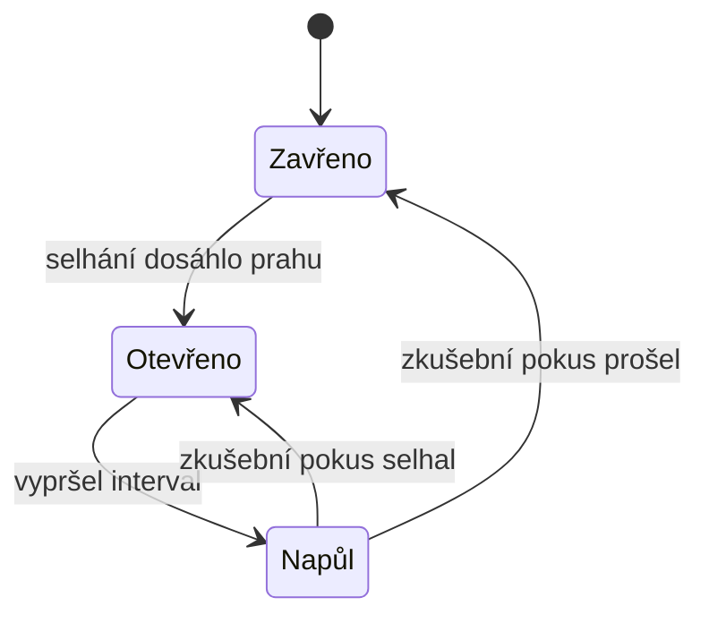

# Circuit Breaker (Jistič)

> [← zpět na Architecture](../)

> **V jedné větě:** Obal kolem volání cizí služby, který po sérii selhání přestane volat úplně — a po chvíli pustí jediný zkušební pokus, jestli už se druhá strana zvedla.

---

## Problém

Platební brána spadla. Neodmítá požadavky — **mlčí**, takže každé volání doběhne až na timeout.

```php
public function pay(Order $order): PaymentResult
{
    // Když brána mlčí, tenhle řádek trvá 5 sekund. Pokaždé.
    return $this->gateway->charge($order->totalInCents());
}
```

Vypadá to jako problém cizí služby. Není. **Je to už tvůj problém**, protože každý ten požadavek po dobu timeoutu drží vlákno nebo workera — a těch máš konečný počet. Demo to počítá:

```
požadavků                       120
volání na bránu                 120
z toho neúspěšných              60
času stráveno čekáním           303.0 s
```

Pět minut čekání za dvě minuty provozu. **Tudy se pád cizí služby přenese na tvoji** a odtud na tu, která volá tebe.

**Poznáš to podle:**

- fronta workerů naroste, přestože požadavků nepřibylo
- aplikace je „pomalá" a v profilu je vidět, že čeká na jednom volání
- výpadek jedné nepodstatné služby (doporučovač, kurzy měn) položí celý košík
- v logu je tisíc stejných timeoutů za sebou
- po obnovení cizí služby ji vlastní nahromaděné požadavky hned zase položí

---

## Řešení

> „You wrap a protected function call in a circuit breaker object, which monitors for failures. **Once the failures reach a certain threshold, the circuit breaker trips, and all further calls to the circuit breaker return with an error, without the protected call being made at all.**"
>
> — Martin Fowler, *CircuitBreaker*, 2014



| Stav | Co dělá | Jak z něj ven |
| ---- | ------- | ------------- |
| **Zavřeno** | Volá se normálně, počítají se selhání | Práh selhání → otevřeno |
| **Otevřeno** | **Nevolá se vůbec**, chyba se vrací okamžitě | Uplyne interval → napůl |
| **Napůl otevřeno** | Pustí se **jediný** pokus | Prošel → zavřeno · Selhal → otevřeno |

Prostřední stav je ten, kvůli kterému vzor existuje. **Otevřený jistič nevolá — vrací chybu hned.** Timeout se tím nepřeskočí, ten prostě nenastane.

### Zkušební pokus je jediný, a schválně

```
čas         přechod
12.0 s      zavřeno → otevřeno
32.0 s      otevřeno → napůl
32.0 s      napůl → otevřeno
52.0 s      otevřeno → napůl
52.0 s      napůl → otevřeno
72.0 s      otevřeno → napůl
72.0 s      napůl → zavřeno
```

Ten sled **otevřeno → napůl → otevřeno** je jádro vzoru. Po vypršení intervalu jistič pustí **jedno** volání. Když projde, zavírá se; když ne, zase se otevře a čeká další interval.

Kdyby po vypršení pustil všechno naráz, položil by tu službu znovu v okamžiku, kdy se sotva zvedla — **a udělal by to pokaždé**.

---

## Co tím získáš

```
                                bez jističe     s jističem
volání na bránu                 120             63
času stráveno čekáním           303.0 s         27.9 s
odmítnuto bez volání            0               57
```

**Čekání kleslo jedenáctkrát.** Ale je potřeba přečíst i to, co tam není:

> [!IMPORTANT]
> **Jistič nezachránil ani jeden požadavek.** Šedesát plateb neproběhlo s ním stejně jako bez něj. Zachránil **čas**, který by na nich tvoje aplikace prostála — tedy kapacitu obsloužit všechno ostatní.

Druhý zisk je pro protistranu: **brána dostala 63 volání místo 120.** Služba, která se topí, má šanci se zvednout, jen když jí přestaneš volat.

---

## Účastníci

| Účastník | Role |
| -------- | ---- |
| **Jistič** | Drží stav, počítá selhání, rozhoduje, jestli se vůbec zavolá |
| **Chráněné volání** | Cizí služba, databáze, cokoli, co může být pomalé |
| **Volající** | **Musí vědět, co dělat, když je otevřeno** — viz níž |
| **Monitoring** | Každá změna stavu je událost, která patří do logu a na graf |

Poslední řádek není dekorace. Fowler ho zdůrazňuje: *„any change in breaker state should be logged and breakers should reveal details of their state for deeper monitoring."* **Otevřený jistič je informace o cizím systému**, kterou nikde jinde nezískáš dřív.

---

## Co udělat, když je otevřeno

Tohle je ta část, která se přeskakuje — a bez ní je jistič jen rychlejší způsob, jak selhat.

| Odpověď | Kdy sedí |
| ------- | -------- |
| **Chyba uživateli** | Operace bez ní nedává smysl (platba, přihlášení) |
| **Zastaralá data z cache** | Čtení, kde je starší odpověď lepší než žádná (kurzy, doporučení, katalog) |
| **Výchozí hodnota** | Doplňková informace — schovej blok místo rozbití stránky |
| **Odložit do fronty** | Zápis, který nemusí proběhnout teď (odeslání e-mailu, synchronizace) |
| **Náhradní poskytovatel** | Máš-li druhého, tohle je chvíle ho použít |

**Výběr je návrhové rozhodnutí, ne technický detail** — je to [naklonění zbytkové chyby na bezpečnou stranu](../../Principles/ObjectDesign.md#třetí-stupeň-se-nenavrhuje-a-měl-by). Jistič sám za tebe nerozhodne; jen ti zaručí, že se rozhodovat budeš **rychle**, ne po pěti sekundách čekání.

---

## Kdy použít

- ✅ Voláš něco **přes síť**, co může být pomalé nebo mrtvé.
- ✅ Selhání té věci nesmí položit tvoji aplikaci.
- ✅ Existuje rozumná odpověď pro případ, že se nezavolá.
- ✅ Cizí službu je potřeba **chránit před tebou** — tvoje opakování ji drží dole.

## Kdy nepoužít

- ❌ **Volání uvnitř procesu.** Jistič nad `array_map` chrání před ničím.
- ❌ **Nemáš co dělat, když je otevřeno.** Pak jsi jen zrychlil chybovou hlášku; není to nic, ale je to málo.
- ❌ **Jde o jednorázový dávkový běh**, kde je opakování za hodinu v pořádku — na to stačí opakování s odstupem.
- ❌ **Chyba je na tvé straně** (špatný požadavek, neplatný token). Jistič je na výpadky, ne na `400`.

Poslední bod je i nejčastější chyba v nastavení — viz níž.

---

## Časté chyby

| Chyba | Proč vadí | Jak správně |
| ----- | --------- | ----------- |
| Za selhání se počítá `404` nebo `422` | Jistič se otevře kvůli chybě v datech, ne kvůli výpadku | Počítej timeouty, `5xx` a chyby spojení |
| Nemá timeout | Bez timeoutu nemá co detekovat — jen čeká s tebou | Timeout je podmínka, ne doplněk |
| Práh příliš nízký | Otevře se při běžném zakolísání a shodí funkční službu | Práh se nastavuje podle naměřené chybovosti |
| Interval příliš krátký | Zkušební pokusy nenechají službu vstát | Interval delší než doba, za kterou se obvykle zvedne |
| Všechny instance se otevřou i zavřou naráz | Po intervalu dorazí celá vlna a službu položí znovu | Přidat rozptyl (jitter) do intervalu |
| Změny stavu nejsou v logu | Přijdeš o nejrychlejší signál o cizím výpadku | Každý přechod je událost |
| Jeden jistič na všechna volání téže služby | Pomalý výpis shodí i rychlou platbu | Jeden jistič na jeden druh operace |
| Otevřeno = výjimka nahoru a nic víc | Přeměnil jsi pomalou chybu na rychlou, jinak nic | Zvolit odpověď [z tabulky výš](#co-udělat-když-je-otevřeno) |

První řádek je ten, který v praxi působí nejvíc zmatku. **`404` není výpadek** — služba odpověděla, a to správně. Když se počítá mezi selhání, jistič se otevře kvůli tomu, že někdo hledal neexistující objednávku.

---

## V praxi

- **Symfony** má od verze 6.4 [`HttpClient` s podporou retry](https://symfony.com/doc/current/http_client.html); jistič v jádru není, obvykle se přidává knihovnou.
- **Envoy, Istio a podobné proxy** jističe umí na úrovni infrastruktury, takže aplikace o nich nemusí vědět. Je to dobrá volba, když se totéž volá z víc služeb — jen pozor, že pak **odpověď při otevřeném jističi řeší proxy, ne tvůj kód**, a musí se domluvit, jaká má být.
- **Elektrický jistič**, ze kterého je jméno, dělá totéž doslova: při přetížení rozpojí obvod, a **musí se zapnout ručně nebo po čase**. Že se nezapne hned, je jeho vlastnost, ne nedostatek.

---

## Související patterny

| Pattern | Vztah |
| ------- | ----- |
| [Poka-yoke](../../Principles/ObjectDesign.md#poka-yoke--znemožni-chybu-nebo-ji-nakloň) | Jistič je jeho učebnicová podoba: upozornění, které spouští **automatickou** akci místo člověka. |
| [Fail Fast](../../Principles/ObjectDesign.md#fail-fast) | Otevřený jistič dělá přesně to — selže hned místo za pět sekund. |
| [Anticorruption Layer](../../DDD/AnticorruptionLayer/) (DDD) | Přirozené místo, kam jistič patří: obojí stojí na hranici k cizímu systému. |
| [Ports & Adapters](../PortsAndAdapters/) | Jistič bydlí v **adaptéru**, ne v doméně — ta o něm nemá vědět. |
| [Saga](../Saga/) | Kompenzace řeší, co s rozpracovaným procesem, když volání neprojde. |
| [Batching](../Batching/) | Sousední odpověď na zátěž: ten chrání cíl před množstvím, tenhle před opakováním. |
| [Retry](../Retry/) | Nutná dvojice, ale v tomhle pořadí: **opakuj uvnitř jističe**, ne kolem něj — jinak si opakováním otevřený jistič obejdeš. |

---

## Vztah k principům

| Princip | Jak souvisí |
| ------- | ----------- |
| [Fail Fast](../../Principles/ObjectDesign.md#fail-fast) | Rychlé selhání místo pomalého je celý smysl otevřeného stavu. |
| [Poka-yoke](../../Principles/ObjectDesign.md#poka-yoke--znemožni-chybu-nebo-ji-nakloň) | Systém se sám přepne do bezpečnějšího režimu, i když se nikdo nedívá. |
| [SRP](../../Principles/SOLID.md#single-responsibility-principle-srp) | Rozhodnutí „volat, nebo ne" je jiná odpovědnost než „jak zaplatit". |

---

## Demo

```bash
php SoftwareDesign/Architecture/CircuitBreaker/demo/run.php
```

Platební brána, která je šedesát sekund mimo provoz a **nemlčí odmítnutím, ale tichem** — každé volání doběhne až na timeout. Sto dvacet požadavků, čas simulovaný, takže demo doběhne okamžitě a dá vždycky totéž.

Bez jističe: 120 volání a **303 sekund čekání**. S jističem: 63 volání a 27,9 sekundy.

Třetí část vypíše všechny přechody stavů a je na ní vidět ten sled *otevřeno → napůl → otevřeno*, včetně toho, že jistič chytil obnovu dvě sekundy po tom, co brána ožila.

---

## Původ

|              |                            |
| ------------ | -------------------------- |
| **Zdroj**    | *Release It!*              |
| **Autor**    | Michael Nygard             |
| **Rok**      | 2007                       |
| **Rozšířil** | Martin Fowler, bliki, 2014 |
| **Obtížnost**| ●●●○○                      |

Vzor popsal **Michael Nygard** v knize *Release It!* (2007), která je celá o tom, co se s aplikací děje **po** nasazení — a je to dodnes jediná známá kniha, která tohle téma bere jako návrhové, ne provozní. **Martin Fowler** mu v roce 2014 věnoval bliki a tím ho dostal k širšímu publiku.

Jméno je z elektroinstalace a sedí lépe, než je obvyklé. Jistič v rozvaděči **nechrání spotřebič** — ten už je po výbuchu. Chrání **vedení a všechno ostatní, co na něm visí.** Přesně tak se má číst i ten softwarový: není to ochrana volané služby, je to ochrana tvojí aplikace před tím, co se stane, když ta služba přestane odpovídat.

Trojka na obtížnosti není za těch padesát řádků stavového automatu. Je za tři věci kolem:

- **Nastavit práh a interval.** Obě čísla jsou provozní a naměřená, ne zvolená.
- **Rozhodnout, co se stane při otevřeném stavu.** Bez toho je vzor k ničemu.
- **Nepoužít ho tam, kam nepatří.** Jistič nad chybou v datech shodí funkční službu.

---

## Zdroje

- Michael Nygard: *Release It! Design and Deploy Production-Ready Software*, Pragmatic Bookshelf, 2007 (2. vydání 2018)
- Martin Fowler: [*CircuitBreaker*](https://martinfowler.com/bliki/CircuitBreaker.html), 2014

---

<details>
<summary>Metadata patternu</summary>

```yaml
name: Circuit Breaker
name_cs: Jistič
category: Architektura
source: Release It!
authors: [Michael Nygard]
year: 2007
difficulty: 3
tags: [odolnost, výpadky, timeout, kaskádové selhání, fail fast]
principles: [Fail Fast, Poka-yoke, SRP]
related: [AnticorruptionLayer, PortsAndAdapters, Saga, Batching]
status: done
```

</details>
