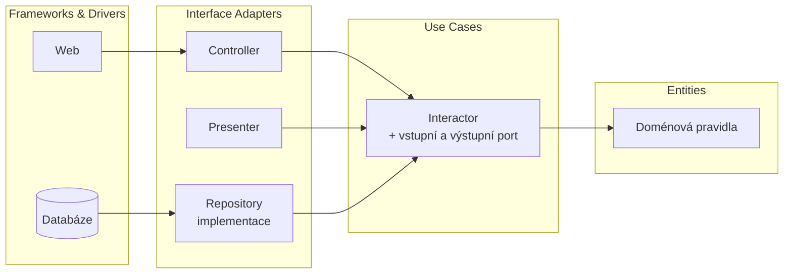

# Clean Architecture

> [← zpět na Architecture](../)

> **V jedné větě:** Soustředné kruhy, ve kterých **závislosti míří jen dovnitř** — a uvnitř je rozdělené, co platí v celém podniku, od toho, co platí jen pro tuhle aplikaci.

> [!IMPORTANT]
> **Není to soupeř [vrstvené architektury](../LayeredArchitecture/) ani [Ports & Adapters](../PortsAndAdapters/).** Martin to říká hned v úvodu: všechny mají týž cíl a všechny ho řeší rozdělením na vrstvy. Co přidává Clean Architecture navíc, je rozebrané [níž](#co-z-toho-je-nového) — a je toho míň, než se na internetu tvrdí.

---

## Problém

Aplikace je rozdělená na vrstvy a doména je čistá. A přesto: přidat k webové administraci ještě API a příkaz do konzole znamená napsat tutéž logiku třikrát — nebo z ní udělat něco, co vrací pole a doufá.

```php
final class ShowOrderController
{
    public function show(string $orderId): Response
    {
        $order = $this->orders->find($orderId);

        // Pravidlo aplikace, schované v kontroleru
        $canCancel = $order->status() !== 'shipped';

        return $this->render('order.html.twig', [
            'order' => $order,          // ← entita putuje až do šablony
            'canCancel' => $canCancel,
        ]);
    }
}
```

Dvě věci jsou tu špatně a obě se projeví až u třetího kanálu:

1. **Pravidlo „kdy jde stornovat" bydlí v kontroleru.** API ho bude mít taky, jen o kus jinak.
2. **Entita prošla až do šablony.** Od téhle chvíle je tvar domény součástí toho, co vidí uživatel — a u JSON API rovnou součástí veřejného kontraktu.

**Poznáš to podle:**

- táž podmínka je v kontroleru, v API a v konzolovém příkazu
- šablona nebo serializér volá metody entity
- přejmenování pole v entitě změní odpověď API
- use case vrací entitu a „ten si to už nějak zobrazí"
- přidání druhého kanálu znamená kopii celého kontroleru

---

## Řešení

> „**Source code dependencies can only point inwards. Nothing in an inner circle can know anything at all about something in an outer circle.**"
>
> — Robert C. Martin, *The Clean Architecture*, 2012



| Kruh | Co v něm je | Jak poznáš, že tam něco patří |
| ---- | ----------- | ----------------------------- |
| **Entities** | Pravidla podniku | Platilo by to, **i kdyby tahle aplikace neexistovala** |
| **Use Cases** | Pravidla téhle aplikace | Platí to pro tuhle aplikaci, ne pro firmu |
| **Interface Adapters** | Kontrolery, presentery, implementace repository | Překládá se tu tvar dat |
| **Frameworks & Drivers** | Databáze, HTTP, fronty | Dá se vyměnit, aniž by se změnil zbytek |

> [!NOTE]
> **Čtyři kruhy nejsou předpis.** Martin: *„No, the circles are schematic. You may find that you need more than just these four. However, The Dependency Rule always applies."* Kruhů může být pět i tři; neměnné je jen to pravidlo.

---

## Co z toho je nového

Tohle je ta část, kvůli které dokument existuje. Vedle [vrstev](../LayeredArchitecture/) a [hexagonu](../PortsAndAdapters/) přidává Clean Architecture **dvě věci**, a stojí za to vědět které.

### 1. Rozdělení Entities a Use Cases

Hexagon má uprostřed „aplikaci" jako jeden celek. Clean Architecture ji rozřízne:

| Pravidlo | Kde bydlí |
| -------- | --------- |
| Odeslanou objednávku nelze stornovat | **Entities** |
| Cena je součet položek | **Entities** |
| V administraci je vidět tlačítko Stornovat | **Use Cases** |
| Částka se zobrazí v korunách s čárkou | **Adapters** |

Zkouška, která to rozhodne, je jednoduchá: **platilo by to pravidlo i tehdy, kdyby tahle aplikace neexistovala?** Když ano, je to entita.

Praktický důsledek: firma, která má e-shop, administraci a účetní export, má **tři sady use cases a jednu sadu entit**. Bez toho rozdělení by se pravidla podniku psala třikrát.

### 2. Vstupní a výstupní port — a co přes ně smí

Druhá věc je mechanika překročení hranice. Tok řízení jde **ven** (interactor chce něco zobrazit), ale závislost musí mířit **dovnitř**. Řeší se to [DIP](../../Principles/SOLID.md#dependency-inversion-principle-dip) — a Martin k tomu přidává pravidlo, které se poruší nejčastěji:

> „**We don't want to cheat and pass Entities or Database rows.**"

Přes hranici jde **jednoduchá datová struktura**, ne entita:

```php
final readonly class ShowOrderResponse
{
    public function __construct(
        public string $orderId,
        public int $totalInCents,
        public int $lineCount,
        public string $status,
        public bool $canBeCancelled,
    ) {
    }
}
```

Kdyby ven šel `Order`, znal by ho každý presenter — a od té chvíle by **změna entity měnila tvar veřejného API**. Právě proto je to pravidlo tak ostré.

---

## Co to umí

Demo pustí jeden use case do tří kanálů:

```
HTML    <h1>Objednávka A-2026-118</h1><p>307,00 Kč</p><button>Stornovat</button>
JSON    {"id":"A-2026-118","total":30700,"cancellable":true}
CLI     A-2026-118           307,00 Kč  [lze stornovat]
```

Všechny tři dostaly **týž objekt** a ani jeden nesáhl na doménu:

```
typ, který přes hranici jde         ShowOrderResponse
je to entita?                       ne — jen hodnoty
kolikrát presenter sáhl na entitu   0
```

A cena za čtvrtý kanál:

```
přidáno kvůli CLI             1 soubor (CliPresenter)
změněno v Core/               žádný soubor
```

**To je celé tvrzení téhle architektury** — a je to tvrzení, které jde ověřit, ne jen slíbit.

---

## Kdy použít

- ✅ Aplikace má **víc než jeden způsob dodání** — web, API, konzole, fronta.
- ✅ Doménových pravidel je dost a mají přežít změnu frameworku.
- ✅ Use case je potřeba otestovat bez HTTP a bez databáze.
- ✅ Firma má víc aplikací nad týmiž pravidly.

## Kdy nepoužít

- ❌ **Jeden kanál, jedna aplikace, CRUD.** Vstupní a výstupní port kolem `SELECT` je pět souborů místo jednoho.
- ❌ **Doména je tenká.** Když entita nemá jediné pravidlo, není co chránit.
- ❌ **Tým to zavádí kvůli názvu složek.** Rozdělení bez pravidla závislosti je jen přestěhování.
- ❌ **Čeká se od toho výkon.** Přidává vrstvy překladu, ne rychlost.

> [!IMPORTANT]
> **Nejběžnější chyba není v architektuře, ale v dávce.** Clean Architecture se zavádí **postupně** — nejdřív tam, kde jsou pravidla a víc kanálů. Přepsat do ní celou aplikaci najednou je [dlouhodobý refaktoring](../../../Refactoring/LongTermRefactoring/) se všemi jeho pastmi.

---

## Časté chyby

| Chyba | Proč vadí | Jak správně |
| ----- | --------- | ----------- |
| Use case vrací entitu | Vnější kruh začne záviset na doméně; změna entity změní API | Vrátit jednoduchou datovou strukturu |
| Entita s anotacemi ORM | Vnitřní kruh zná vnější, což je porušení jediného pravidla | Mapování mimo entitu — [Data Mapper](../../PoEAA/DataMapper/) |
| Pravidlo aplikace v entitě | Entita přestane platit v jiné aplikaci téže firmy | Zkouška „platilo by to bez téhle aplikace?" |
| Pravidlo podniku v use case | Napíše se znovu v každém dalším use case | Totéž, opačným směrem |
| Interactor zná `Request` z frameworku | Nejde ho otestovat bez HTTP | Vstupní port je vlastní typ |
| Kruhy jsou jen složky, pravidlo nikdo nehlídá | Za měsíc míří šipka oběma směry | Kontrola v CI ([deptrac](https://github.com/qossmic/deptrac)) |
| Port a interactor pro každý `SELECT` | Pět souborů na výpis číselníku | Čtení může jít [kolem](../CQRS/) |

Poslední řádek je praktičtější, než vypadá. **Čtecí strana nemusí přes use case**; když se jen zobrazují data bez pravidel, je dotaz do databáze poctivější než pět tříd. Domyšleno je to [CQRS](../CQRS/).

---

## Vrstvy, hexagon, nebo kruhy?

Všechny tři jsou táž myšlenka a Martin to sám píše: *„They all have the same objective, which is the separation of concerns. They all achieve this separation by dividing the software into layers."* Rozdíl je v tom, co která zdůrazňuje.

| | [Vrstvy](../LayeredArchitecture/) | [Ports & Adapters](../PortsAndAdapters/) | Clean Architecture |
| --- | --- | --- | --- |
| Rok | 1996 | 2005 | 2012 |
| Hlavní myšlenka | Rozděl podle úrovně | Jádro nezná okolí | Závislosti míří dovnitř |
| Kolik je vnitřních částí | jedna doména | jedno jádro | **entity + use cases** |
| Řeší překročení hranice | ne | porty | **porty + zákaz posílat entity** |
| Co se z toho nejčastěji přebírá | názvy vrstev | testovatelnost jádra | **pravidlo závislosti jako věta** |

**Praktické doporučení:** začni [vrstvami](../LayeredArchitecture/), protože jsou nejlevnější. K portům sáhni, až tě začne bolet testování. Kruhy a rozdělení entit od use cases mají smysl tehdy, když jsou **kanály dodání aspoň dva** — dřív je to cena bez protihodnoty.

---

## V praxi

- **Symfony ani Laravel** tohle nevynucují a ani nebrání. `src/Core` a `src/Adapters` jsou jen složky; pravidlo závislosti se hlídá [deptrakem](https://github.com/qossmic/deptrac).
- **Doctrine** umí mapování přes XML místo atributů, což je v tomhle přístupu rozdíl mezi čistou entitou a entitou, která zná ORM.
- **Presenter v PHP** je vzácnější než v jazycích, ze kterých vzor pochází — obvykle se z výstupního portu rovnou serializuje. Je to legitimní zjednodušení, dokud ta datová struktura zůstane jednoduchá.

---

## Související patterny

| Pattern | Vztah |
| ------- | ----- |
| [Onion Architecture](../OnionArchitecture/) | Starší sourozenec (2008) a historicky prostřední krok; přidal postoj k databázi, Clean k tomu pravidlo závislosti. |
| [Ports & Adapters](../PortsAndAdapters/) | **Nejbližší příbuzný.** Táž myšlenka o sedm let dřív, bez rozdělení entit a use cases. |
| [Layered Architecture](../LayeredArchitecture/) | Předchůdce obou; ukazuje, proč rozdělení na vrstvy samo o sobě nestačí. |
| [Service Layer](../../PoEAA/ServiceLayer/) (PoEAA) | Use case je jeho zúžená podoba — jedna operace, vlastní vstup a výstup. |
| [Entity](../../DDD/Entity/) (DDD) | Co patří do nejvnitřnějšího kruhu. |
| [DTO](../../Glossary.md#dto--data-transfer-object) | Čím se překračuje hranice, aby přes ni nešla entita. |
| [CQRS](../CQRS/) | Odpověď na to, že čtení přes use case bývá zbytečně drahé. |
| [Modules](../../DDD/Modules/) (DDD) | Druhé dělení, kolmé na tohle: moduly nahoru, kruhy dovnitř. |

---

## Vztah k principům

| Princip | Jak souvisí |
| ------- | ----------- |
| [DIP](../../Principles/SOLID.md#dependency-inversion-principle-dip) | **To, čím se pravidlo závislosti drží.** Tok řízení jde ven, závislost dovnitř. |
| [SRP](../../Principles/SOLID.md#single-responsibility-principle-srp) | Každý kruh se mění z jiného důvodu — podnik, aplikace, rozhraní, technologie. |
| [Provázanost](../../Principles/CohesionAndCoupling.md#stupnice-provázanosti) | Vnitřní kruh nezná vnější vůbec; slabší vazba už není. |
| [Zviditelni implicitní](../../Principles/ObjectDesign.md#zviditelni-implicitní) | Vstupní a výstupní port pojmenují to, co bylo schované v podpisu kontroleru. |

---

## Demo

```bash
php SoftwareDesign/Architecture/CleanArchitecture/demo/run.php
```

Jeden use case (`ShowOrder`) a tři způsoby dodání — HTML, JSON, konzole. Demo nejdřív přečte importy a ověří, že **`Core/` nezná z vnějšku nic**, pak pustí všechny tři presentery nad týmž výstupem.

Třetí část kontroluje, co přes hranici prošlo: **ani jeden presenter nesáhl na entitu.** Čtvrtá spočítá cenu za přidání konzolového výstupu — jeden nový soubor, nula změn v jádře.

Poslední tabulka je ta, kterou junior potřebuje nejvíc: **která pravidla patří do entit, která do use cases a která až do adaptérů.**

---

## Původ

|              |                            |
| ------------ | -------------------------- |
| **Zdroj**    | článek *The Clean Architecture*, později kniha |
| **Autor**    | Robert C. Martin           |
| **Rok**      | 2012 (kniha 2017)          |
| **Obtížnost**| ●●●●○                      |

Martin vzor popsal na blogu v roce **2012** a v roce 2017 mu věnoval knihu. V úvodu článku vyjmenovává **pět architektur**, které podle něj dělají totéž — mimo jiné Cockburnovu [hexagonální](../PortsAndAdapters/) a Palermovu **Onion** — a píše, že *„they all have the same objective… They all achieve this separation by dividing the software into layers."*

Je poctivé to zdůraznit, protože Clean Architecture se dnes často prezentuje jako něco nového. **Není.** Její přínos je v tom, že pravidlo závislosti zformulovala do jediné věty, kterou si každý zapamatuje, a že rozdělila doménu na pravidla podniku a pravidla aplikace.

Čtyřka na obtížnosti není za ty kruhy. Je za dvě rozhodnutí, která se dělají u každého pravidla znovu:

- **Entita, nebo use case?** Špatná odpověď se pozná až u druhé aplikace nad týmiž daty.
- **Kdy tu cenu ještě neplatit.** U jednoho kanálu a tenké domény je to pět souborů místo jednoho a nic za to.

---

## Zdroje

- Robert C. Martin: [*The Clean Architecture*](https://blog.cleancoder.com/uncle-bob/2012/08/13/the-clean-architecture.html), 2012
- Robert C. Martin: *Clean Architecture: A Craftsman's Guide to Software Structure and Design*, Prentice Hall, 2017
- Alistair Cockburn: [*Hexagonal Architecture*](https://alistair.cockburn.us/hexagonal-architecture/), 2005 — jedna z pěti, které Martin jmenuje

---

<details>
<summary>Metadata patternu</summary>

```yaml
name: Clean Architecture
name_cs: Čistá architektura
category: Architektura
source: blog cleancoder.com, kniha 2017
authors: [Robert C. Martin]
year: 2012
difficulty: 4
tags: [pravidlo závislosti, use case, entity, porty, DIP]
principles: [DIP, SRP, Provázanost, Zviditelni implicitní]
related: [PortsAndAdapters, LayeredArchitecture, ServiceLayer, CQRS, Modules]
status: done
```

</details>
