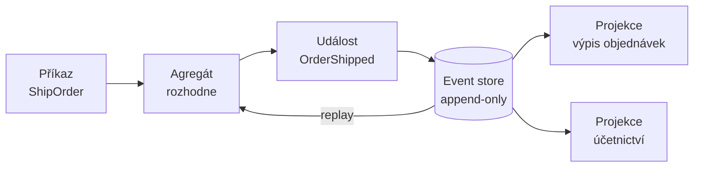

# Event Sourcing

> [← zpět na Architecture](../)

> **V jedné větě:** Zdrojem pravdy není stav, ale **posloupnost událostí**, které k němu vedly — stav se z nich pokaždé poskládá.

> [!IMPORTANT]
> **Event Sourcing není [CQRS](../CQRS/) a není [Domain Event](../../DDD/DomainEvent/).** Obojí se s ním plete a obojí je rozebrané tam: CQRS bez ES dává smysl výborně a je to obvyklá volba, kdežto ES bez CQRS skoro nikdy. Publikovat událost je taky něco jiného než ukládat ji jako pravdu.

---

## Problém

Objednávka se uloží jako řádek a každá změna ten řádek přepíše:

```php
$order->shippingAddress = 'Nádražní 5, Brno';   // co tam bylo předtím, je pryč
$order->status = 'shipped';
$order->save();
```

Funguje to, dokud se někdo nezeptá na něco, co v tom řádku není:

- **Na jakou adresu se to vlastně odeslalo?** Dnes je tam jiná.
- **Kolikrát zákazník měnil objednávku, než ji potvrdil?**
- **Změnil adresu až potom, co zboží odešlo?**
- **Jaká byla cena v okamžiku objednání**, když se ceník od té doby dvakrát změnil?

Obvyklá odpověď je přidat `updated_at`, pak tabulku `order_log`, pak druhou pro adresy. **A tím se buduje event sourcing — jen náhodně, nekonzistentně a bez záruky, že log a stav sedí.**

**Poznáš to podle:**

- vedle hlavní tabulky existuje „historie", kterou plní aplikace ručně
- na otázku „proč má tahle objednávka tuhle částku" se odpovídá čtením logů
- audit se řeší databázovými triggery
- někdo opravil data přímo v databázi a nikdo neví, co bylo předtím
- máš sloupce `cancelled_at`, `shipped_at`, `refunded_at` — a pořadí se dovozuje z toho, který není `NULL`

---

## Řešení

> „**Capture all changes to an application state as a sequence of events.**"
>
> — Martin Fowler, *Event Sourcing*, 2005

Ukládají se fakta v minulém čase. Stav je jejich součet.

```php
$stream = [
    new OrderPlaced('A-2026-118', 'Dlouhá 12, Brno', '2026-09-01'),
    new ItemAdded('KNIHA-1', 12900, 2, '2026-09-01'),
    new AddressChanged('Nádražní 5, Brno', '2026-09-03'),
    new OrderShipped('PPL', '2026-09-04'),
    new AddressChanged('Dlouhá 12, Brno', '2026-09-07'),
];

$order = Order::replay($stream);
```



Jména událostí jsou **v minulém čase** a není to kosmetika: událost se nedá odmítnout ani zrušit, protože se už stala. Tím se liší od příkazu, který selhat může.

### Co tím získáš

Demo se ptá na čtyři otázky:

```
otázka                              ze snímku           z proudu událostí
Jaká je dnes adresa?                Dlouhá 12, Brno     Dlouhá 12, Brno
Kolikrát se adresa změnila?         —                   2
Na jakou adresu se to odeslalo?     —                   Nádražní 5, Brno
Změnil ji zákazník až po odeslání?  —                   ano

zodpovězeno                         1 ze 4              4 ze 4
```

**Poslední řádek je ten, kvůli kterému se pro Event Sourcing lidé rozhodují.** Zákazník změnil adresu potom, co zboží odešlo — ze snímku to nikdo nikdy nezjistí, a přitom je to přesně ta informace, kterou reklamační oddělení potřebuje.

---

## Účastníci

| Účastník | Role |
| -------- | ---- |
| **Událost** | Neměnný fakt v minulém čase. `OrderShipped`, ne `ShipOrder`. |
| **Event store** | Úložiště, do kterého se jen přidává. Nikdy `UPDATE`, nikdy `DELETE`. |
| **Agregát** | Rozhoduje, jestli příkaz projde, a vydá událost. Stav si drží jen jako mezivýsledek přehrání. |
| **Projekce** | Odvozený pohled pro čtení — tabulka, cache, index. Dá se kdykoli zahodit a postavit znovu. |
| **Snímek** | Uložený mezistav po *n* událostech, aby se nemusel přehrávat celý proud. Optimalizace, ne pravda. |

---

## Dvě pasti, které se nečekají

Tohle je ta část dokumentu, kvůli které stojí za přečtení dřív, než se pro Event Sourcing rozhodne.

### Proud je neměnný, jeho výklad ne

Pravidlo o dopravě zdarma se změní z 1 000 Kč na 250 Kč. Události se nezměnily. Přehrajeme týž proud:

```
celkem přehráno pravidly 2026     406,00 Kč
celkem přehráno pravidly 2027     307,00 Kč
```

**Tytéž události, jiná historická částka.** „Historie" tedy není v proudu — je **v proudu plus ve verzi kódu, kterým ho přehraješ**. A kód se mění.

Z toho plyne pravidlo, které se v článcích o ES často nedočteš:

> [!IMPORTANT]
> **Do událostí patří výsledky rozhodnutí, ne vstupy pro jejich přepočítání.** Kdyby v proudu bylo `ShippingCharged(9900)` místo pouhého `OrderShipped`, žádné pozdější přehrání by tu částku nezměnilo. Událost má nést, **co se stalo**, ne dost informací na to, aby se to dalo spočítat znovu.

Stejná past má i druhou podobu, na kterou upozorňuje přímo Fowler: **při přehrávání se nesmí volat vnější systémy.** Jinak se při každém replayi znovu odešlou e-maily a znovu strhnou platby. Řeší se to přepínačem „jsme v replay módu" na každé bráně ven.

### Události jsou navždy, i ty staré

Před dvěma lety se `ItemAdded` ukládalo bez množství. Dnešní kód množství čeká:

```
proud z roku 2024 bez převodu     99,00 Kč  ← položka se vůbec nezapočítala
týž proud přes upcaster           228,00 Kč
```

**Nic nespadlo.** Stará událost propadla do `default` větve a v součtu chybí — a to je na tom to nebezpečné.

Starou událost **nejde změnit migrací** jako sloupec v tabulce; je to záznam o tom, co se stalo. Jediná cesta je převádět ji při čtení — tomu se říká **upcasting** — a ten převod v kódu zůstane napořád. Po pěti letech provozu je upcasterů deset a nikdo si netroufne žádný smazat.

---

## Kdy použít

- ✅ **Historie je požadavek, ne přání.** Audit, regulace, reklamace, „kdo to změnil a kdy".
- ✅ Doména je přirozeně o událostech — účetnictví, sklad, platby, workflow.
- ✅ Potřebuješ stejná data opakovaně vyhodnocovat **jinak** (nové projekce ze starých událostí).
- ✅ Zpětná analýza incidentů je pravidelná činnost, ne výjimka.

## Kdy nepoužít

- ❌ **Většina aplikací.** Fowler sám píše, že *„is not a natural choice and to use it means that you expect to get some form of return"*.
- ❌ **CRUD nad formulářem.** Historie nikoho nezajímá a `updated_at` stačí.
- ❌ **Tým to dělá poprvé a systém jde do produkce za tři měsíce.** Chyby v ES se opravují hůř než v CRUD, protože data nejdou přepsat.
- ❌ **Potřebuješ mazat osobní údaje.** Append-only log a „právo být zapomenut" jdou proti sobě; obvyklé řešení je šifrovat osobní data klíčem na zákazníka a při výmazu zahodit klíč. **Je to komplikace, se kterou je potřeba počítat předem.**
- ❌ **Chceš jen audit.** Na to stačí tabulka historie nebo `updated_by` — bez toho, aby se na události převedl celý zápis.

> [!NOTE]
> Existuje mezistupeň: **události ukládat vedle stavu**, ne místo něj. Stav zůstane zdrojem pravdy pro čtení, události slouží k auditu a integraci. Přijdeš o replay a o možnost stavět nové projekce z minulosti, ale zbavíš se většiny cen. Pro hodně týmů je to ta správná odpověď.

---

## Co to stojí

```
                                      snímek          proud událostí
typů událostí, které musíš udržovat   0               4
záznamů v úložišti                    1               6
změna schématu                        ALTER TABLE     upcaster navždy
smazání údaje (GDPR)                  UPDATE          nejde — jen šifrovat a zahodit klíč
„jaký je stav?"                       SELECT          přehrát celý proud
```

Poslední tři řádky se podceňují nejčastěji. Poslední se řeší snímky, ale ty přinesou vlastní problém: **snímek je odvozený stejným kódem, který se mění** — takže když se změní `apply()`, musí se snímky zahodit a postavit znovu.

---

## Časté chyby

| Chyba | Proč vadí | Jak správně |
| ----- | --------- | ----------- |
| Události v přítomném čase (`ShipOrder`) | Splete se příkaz s faktem; příkaz může selhat, fakt ne | Minulý čas, vždycky |
| Událost nese vstupy místo výsledku | Přehrání jiným kódem změní historii | Uložit, co se rozhodlo |
| Vnější volání i při replayi | Při každém přehrání se znovu odešlou e-maily | Brány znají replay mód |
| Události se mění migrací | Přepisuješ, co se stalo | Upcasting při čtení |
| Do události se dá celý agregát | Sváže se s dnešním tvarem modelu a zablokuje jeho změnu | Jen to, co se změnilo |
| Projekce se považuje za pravdu | Po výpadku se opravuje ručně místo přestavění | Projekci jde kdykoli zahodit |
| Zavede se kvůli auditu | Nejdražší možný způsob, jak získat `updated_by` | Tabulka historie |
| Osobní údaje přímo v událostech | Výmaz nejde provést | Šifrovat klíčem na subjekt |

---

## V praxi

- **[EventStoreDB](https://www.eventstore.com/)** je databáze postavená přímo pro tohle; v PHP se ale stejně často používá obyčejná tabulka `events` s indexem na `(stream_id, version)`.
- **[Prooph](https://github.com/prooph)** a **[Broadway](https://github.com/broadway/broadway)** jsou PHP knihovny pro ES; obě se dnes vyvíjejí pomalu, což o rozšířenosti vzoru v PHP něco vypovídá.
- **Optimistický zámek** je v ES nutnost, ne volba: dva souběžné zápisy do téhož proudu se hlídají číslem verze — viz [Optimistic Offline Lock](../../PoEAA/OptimisticOfflineLock/).
- **Účetnictví** je event sourcing starý pět set let. Účetní kniha se neopravuje přepsáním; chybný zápis se ruší **protizápisem**. Stejné pravidlo platí i v kódu — na zrušení události se vydá opravná událost.

---

## Související patterny

| Pattern | Vztah |
| ------- | ----- |
| [Batching](../Batching/) | Projekce se staví po dávkách, ne po jedné události. |
| [CQRS](../CQRS/) | **Nutná dvojice v tomhle směru.** ES bez CQRS skoro nedává smysl; CQRS bez ES ano a je to obvyklejší. |
| [Domain Event](../../DDD/DomainEvent/) (DDD) | **Nezaměňovat.** ES používá události jako úložiště, Domain Event jako oznámení. |
| [Memento](../../GoF/Behavioral/Memento/) (GoF) | Opačný přístup ke stejnému problému: snímek stavu proti posloupnosti změn. |
| [Optimistic Offline Lock](../../PoEAA/OptimisticOfflineLock/) (PoEAA) | Jak hlídat souběžný zápis do jednoho proudu. |
| [Aggregate](../../DDD/Aggregate/) (DDD) | Hranice proudu — jeden agregát, jeden proud. |
| [Saga](../Saga/) | Co dělá s událostmi, které překročí hranici jednoho agregátu. |
| [Out of the Tar Pit](../../Principles/OutOfTheTarPit.md) | Myšlenka „esenciální stav jako fakta, zbytek odvozený" je odsud. |
| [Idempotence](../../Glossary.md#idempotence) | Projekce musí snést, že tutéž událost dostane dvakrát. |

---

## Vztah k principům

| Princip | Jak souvisí |
| ------- | ----------- |
| [CQS](../../Principles/ObjectDesign.md#cqs--command-query-separation) | Dotažené na architekturu: zápis vydává události, čtení sahá do projekcí. |
| [SRP](../../Principles/SOLID.md#single-responsibility-principle-srp) | Agregát rozhoduje, projekce zobrazuje, store ukládá — tři různé důvody ke změně. |
| [Zviditelni implicitní](../../Principles/ObjectDesign.md#zviditelni-implicitní) | `AddressChanged` je pojem, který v `UPDATE orders SET address` není vidět. |

---

## Demo

```bash
php SoftwareDesign/Architecture/EventSourcing/demo/run.php
```

Táž objednávka jednou jako řádek v tabulce a jednou jako proud šesti událostí. Demo položí čtyři otázky — **snímek zodpoví jednu, proud všechny čtyři**.

Pak přehraje týž proud dvěma verzemi pravidla o dopravě a ukáže, že **historická částka se změnila, aniž by se změnila jediná událost**. A nakonec zkusí přehrát proud z roku 2024, jehož události neznají množství: **nic nespadne, položka se jen tiše nezapočítá** — dokud se nepřidá upcaster.

Závěrem tabulka cen, včetně těch dvou, na které se při rozhodování zapomíná: změna schématu a výmaz osobních údajů.

---

## Původ

|              |                            |
| ------------ | -------------------------- |
| **Zdroj**    | článek *Event Sourcing*    |
| **Autor**    | Martin Fowler              |
| **Rok**      | 2005                       |
| **Obtížnost**| ●●●●●                      |

Fowler vzor popsal v roce 2005 mezi *Enterprise Application Architecture Development* patterny — tedy v sadě, kterou z *PoEAA* vyřadil, protože ji nepovažoval za dost prověřenou. Do širšího povědomí se dostal až kolem roku 2010 spolu s **CQRS** a jménem **Grega Younga**.

Sám vzor je ale mnohem starší než software. **Podvojné účetnictví funguje takhle od 15. století**: kniha se nepřepisuje, chyba se ruší protizápisem a zůstatek je součet všech řádků.

Pětka na obtížnosti je jediná v tomhle katalogu a je zasloužená. Ta třída s `apply()` je triviální; drahé je všechno kolem:

- **Verzování událostí** — upcastery, které v kódu zůstanou navždy.
- **Projekce a eventuální konzistence** — čtecí model je pozadu a uživatel to vidí.
- **Provoz** — přestavování projekcí, snímky, souběžný zápis, velikost úložiště.
- **Nevratnost** — v CRUD se špatná data opraví `UPDATE`em. Tady ne.

Poslední bod je ten hlavní důvod té pětky: **Event Sourcing se dá udělat tiše špatně a pozná se to za rok**, kdy už je v proudu milion událostí ve špatném tvaru.

---

## Zdroje

- Martin Fowler: [*Event Sourcing*](https://martinfowler.com/eaaDev/EventSourcing.html), 2005
- Greg Young: [*CQRS Documents*](https://cqrs.files.wordpress.com/2010/11/cqrs_documents.pdf), 2010 — kde se ES a CQRS potkávají
- Martin Fowler: [*What do you mean by "Event-Driven"?*](https://martinfowler.com/articles/201701-event-driven.html), 2017 — rozlišení čtyř různých věcí, kterým se říká „událost"

---

<details>
<summary>Metadata patternu</summary>

```yaml
name: Event Sourcing
name_cs: Událostní zdroj pravdy
category: Architektura
source: Fowler — Enterprise Application Architecture Development
authors: [Martin Fowler]
year: 2005
difficulty: 5
tags: [události, historie, audit, replay, upcasting, projekce]
principles: [CQS, SRP, Zviditelni implicitní]
related: [CQRS, DomainEvent, Memento, Aggregate, OptimisticOfflineLock, Saga]
status: done
```

</details>
