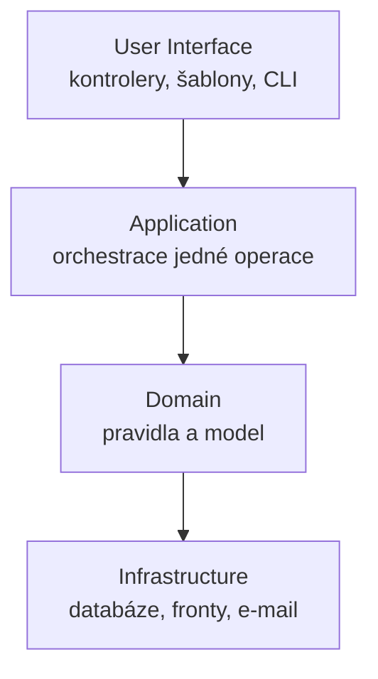

# Layered Architecture (Vrstvená architektura)

> [← zpět na Architecture](../)

> **V jedné větě:** Rozdělení aplikace na vrstvy, z nichž každá smí sahat jen na ty pod sebou — aby doménová pravidla nebyla rozptýlená v obsluze formulářů a v SQL.

> [!IMPORTANT]
> Tenhle vzor je předchůdce [Ports & Adapters](../PortsAndAdapters/) a čte se nejlíp jako **první krok k němu**, ne jako soupeř. Demo ukazuje, proč samo rozdělení na vrstvy k izolaci domény nestačí — a co se musí přidat.

---

## Problém

Aplikace, která vznikla nejrychlejší možnou cestou: jedna třída, která si přečte data, spočítá pravidlo a rovnou to vypíše.

```php
final class OrderReport
{
    public function render(string $orderId, int $customerTier): string
    {
        $total = 0;

        foreach (Db::lines($orderId) as $line) {          // ← infrastruktura
            $total += $line['price'] * $line['quantity'];
        }

        if ($customerTier <= 2) {                          // ← doménové pravidlo
            $total = (int) round($total * 0.9);
        }

        return '<strong>' . number_format($total / 100, 2, ',', ' ') . ' Kč</strong>';  // ← UI
    }
}
```

Evans popisuje, proč to tak vzniká i k čemu to vede:

> „UI, database, and other support code often gets written directly into the business objects. […] This happens because it is **the easiest way to make things work, in the short run**. When the domain-related code is diffused through such a large amount of other code, it becomes extremely difficult to see and to reason about. **Superficial changes to the UI can actually change business logic.** […] Automated testing is awkward."
>
> — Eric Evans, *Domain-Driven Design*, 2003

**Poznáš to podle:**

- pravidlo o slevě najdeš v šabloně, v kontroleru i v SQL dotazu — pokaždé o kousek jinak
- změna formátu data na výpisu rozbije výpočet
- test jednoho pravidla si musí připravit databázi
- na otázku „kde se počítá cena?" neumí nikdo odpovědět jedním souborem
- kód, který má co dělat s doménou, se pozná jen podle toho, že je mezi `echo` a `SELECT`

---

## Řešení

> „**Isolate the expression of the domain model and the business logic**, and eliminate any dependency on infrastructure, user interface, or even application logic that is not business logic. **Partition a complex program into layers.** Develop a design within each layer that is cohesive and that **depends only on the layers below**."



| Vrstva | Co v ní je | Co v ní **není** |
| ------ | ---------- | ---------------- |
| **User Interface** | Kontrolery, šablony, CLI příkazy, serializace | Jakékoli pravidlo |
| **Application** | Orchestrace jedné operace — načti, zavolej, ulož. Transakce. | Rozhodování o doméně |
| **Domain** | Model, pravidla, invarianty | HTTP, SQL, formátování |
| **Infrastructure** | Persistence, odesílání, cizí služby | Doménové rozhodování |

**Application vrstva je ta, kterou lidé nejčastěji vynechají** nebo si ji spletou s doménou. Pozná se podle toho, že sama nerozhoduje — [rozdíl proti doménové službě](../../PoEAA/ServiceLayer/) je rozebraný u Service Layer.

---

## Čím to samo o sobě nestačí

Tady je na celém vzoru to nejzajímavější a demo to ukazuje na běhu.

Rozdělíme aplikaci na čtyři vrstvy podle učebnice. Závislosti míří dolů, pravidlo platí:

```
Application       → Domain
Domain            → Infrastructure
Infrastructure    —
Ui                → Application
```

UI o doméně neví a změna šablony doménu nerozbije. Jenže:

```
spočítat slevu bez databáze       SPADLO — Není připojení k databázi.
```

**Doména sahá na infrastrukturu — a podle pravidla vrstev smí, protože infrastruktura je níž.** Rozdělení na vrstvy tedy oddělilo doménu od uživatelského rozhraní, ale ne od databáze. A přitom právě to Evans v řešení chce: *„eliminate any dependency on infrastructure"*.

### Otočení jedné šipky

Rozhraní si nadefinuje **doména** a infrastruktura ho naplní:

```php
// Domain/OrderLines.php — rozhraní patří doméně
interface OrderLines
{
    /** @return list<OrderLine> */
    public function of(string $orderId): array;
}
```

```php
// Infrastructure/DbOrderLines.php — infrastruktura ho implementuje
final class DbOrderLines implements OrderLines { /* … */ }
```

```
Application       → Domain
Domain            —
Infrastructure    → Domain
Ui                → Application
```

```
spočítat slevu bez databáze       prošlo, vyšlo 27630 haléřů
```

|  | Podle učebnice | S otočenou šipkou |
| --- | --- | --- |
| Odchozích závislostí z `Domain` | 1 | **0** |
| Doména testovatelná bez infrastruktury | ne | **ano** |
| Pravidlo „závislosti míří dolů" | platí | platí |

**Poslední řádek je ta pointa.** Pravidlo vrstev platí v obou případech — takže samo o sobě nestačí. Rozhoduje, **která vrstva je vlastně dole**, a to se pravidlem o vrstvách neurčí. Určí to [DIP](../../Principles/SOLID.md#dependency-inversion-principle-dip).

A ve chvíli, kdy tu šipku otočíš, přestává být infrastruktura vrstvou pod doménou a stává se z ní adaptér vedle ní. **Právě tam vrstvy končí a začíná [hexagon](../PortsAndAdapters/).** Evans to v závěru svého textu říká sám:

> „**The key goal here is isolation.** Related patterns, such as *Hexagonal Architecture* **may serve as well or better** to the degree that they allow our domain model expressions to avoid dependencies on and references to other system concerns."

---

## Kdy použít

- ✅ Aplikace, kde je doménových pravidel víc než pár `if`ů a přibývají.
- ✅ Chceš pravidla testovat bez databáze a bez HTTP.
- ✅ Tým potřebuje společnou odpověď na „kam to napsat".
- ✅ Jako **první krok** v kódu, kde dnes žádné rozdělení není — je levnější než skok rovnou na hexagon.

## Kdy nepoužít

- ❌ **Skript nebo CRUD nad formulářem.** Čtyři vrstvy nad `INSERT` jsou čtyři soubory místo jednoho.
- ❌ **Vrstvy jako jediné dělení velké aplikace.** Nad určitou velikost je nahoře potřeba mít [moduly](../../DDD/Modules/), vrstvy až uvnitř nich.
- ❌ **Když se od toho čeká izolace domény od infrastruktury.** Tu samo rozdělení nedá — viz [výš](#čím-to-samo-o-sobě-nestačí).
- ❌ **Vrstva se přidává „pro symetrii".** Application vrstva, která jen přeposílá volání do domény, je jen prostředník navíc.

---

## Časté chyby

| Chyba | Proč vadí | Jak správně |
| ----- | --------- | ----------- |
| Doména importuje `Doctrine\` nebo `Symfony\` | Model se nedá otestovat ani změnit bez frameworku | Rozhraní v doméně, implementace v infrastruktuře |
| Entita s anotacemi ORM se považuje za čistou doménu | Persistence rozhoduje o tvaru modelu | Doctrine to umí i přes XML mapování — [Data Mapper](../../PoEAA/DataMapper/) |
| Pravidla se usadí v Application vrstvě | Doména zůstane anemická, jen se to jinak jmenuje | Application orchestruje, doména rozhoduje |
| Vrstva se přeskakuje (UI volá rovnou repository) | Pravidlo „jen na vrstvy pod sebou" přestane platit a nikdo si toho nevšimne | Kontrola v CI ([deptrac](https://github.com/qossmic/deptrac)) |
| Vrstvy jsou nejvyšší dělení i u velké aplikace | `Domain/` má osmdesát souborů a nepoznáš, co systém dělá | Nahoru [moduly](../../DDD/Modules/), vrstvy dovnitř |
| Pravidlo se hlídá dohodou | Vydrží týdny; porušit ho je vždycky o řádek pohodlnější | Statická kontrola závislostí |

Předposlední řádek je ten, který v praxi rozhoduje o tom, jestli má rozdělení smysl i po roce. Je rozvedený [v úvodu DDD](../../DDD/#horizontálně-nebo-vertikálně).

---

## V praxi

- **Symfony** ani **Laravel** vrstvy nevynucují — výchozí `src/Controller`, `src/Entity`, `src/Repository` je dělení podle technického typu, ne podle vrstev. Nic ale nebrání tomu si je udělat.
- **Doctrine** umí mapování přes XML nebo atributy. Atributy v entitě jsou pohodlnější a znamenají závislost domény na ORM; XML je to, co drží doménu čistou.
- **[deptrac](https://github.com/qossmic/deptrac)** popisuje vrstvy podle jmenného prostoru a hlídá povolené závislosti — bez něj rozdělení vydrží jen do prvního spěchu.

---

## Související patterny

| Pattern | Vztah |
| ------- | ----- |
| [Ports & Adapters](../PortsAndAdapters/) | **Kam to vede.** Totéž dotažené: infrastruktura přestane být vrstvou dole a stane se adaptérem vedle. |
| [Modules](../../DDD/Modules/) (DDD) | Druhé dělení, kolmé na tohle. U větší aplikace patří moduly nahoru a vrstvy dovnitř. |
| [Service Layer](../../PoEAA/ServiceLayer/) (PoEAA) | Co přesně patří do Application vrstvy a čím se liší od doménové služby. |
| [Data Mapper](../../PoEAA/DataMapper/) (PoEAA) | Jak držet doménu bez anotací ORM. |
| [Repository](../../PoEAA/Repository/) (PoEAA) | Typické rozhraní, kterým se otáčí šipka mezi doménou a infrastrukturou. |
| [Anticorruption Layer](../../DDD/AnticorruptionLayer/) (DDD) | Co stojí na hranici, když za infrastrukturou je cizí model. |
| **Clean Architecture** · **Onion Architecture** | Pozdější varianty téhož s explicitním pravidlem závislosti. |

---

## Vztah k principům

| Princip | Jak souvisí |
| ------- | ----------- |
| [DIP](../../Principles/SOLID.md#dependency-inversion-principle-dip) | **To, co rozdělení na vrstvy samo nedá.** Rozhodne, která vrstva je vlastně dole. |
| [SRP](../../Principles/SOLID.md#single-responsibility-principle-srp) | Každá vrstva má jeden důvod ke změně: UI se mění s designem, doména s byznysem. |
| [Provázanost](../../Principles/CohesionAndCoupling.md#stupnice-provázanosti) | Vrstva zná jen rozhraní té pod sebou, ne její vnitřek. |
| [Soudržnost](../../Principles/CohesionAndCoupling.md#stupnice-soudržnosti) | Uvnitř vrstvy patří k sobě to, co se mění ze stejného důvodu. |

---

## Demo

```bash
php SoftwareDesign/Architecture/LayeredArchitecture/demo/run.php
```

Tentýž výpočet ve třech podobách. Demo u každé **zkusí spočítat slevu bez databáze** a vypíše, jak to dopadlo:

| Varianta | Výsledek |
| -------- | -------- |
| Všechno v jedné třídě | spadne — není připojení |
| Čtyři vrstvy podle učebnice | **spadne taky** |
| S otočenou šipkou k infrastruktuře | projde |

Mezi druhou a třetí variantou se změnilo jediné: kdo definuje rozhraní pro čtení dat. Demo k tomu vypíše závislosti mezi vrstvami v obou případech — a ukáže, že **pravidlo „závislosti míří dolů" platí v obou**.

---

## Původ

|              |                            |
| ------------ | -------------------------- |
| **Zdroj**    | *Pattern-Oriented Software Architecture, Vol. 1* — vzor *Layers* |
| **Autoři**   | Buschmann, Meunier, Rohnert, Sommerlad, Stal |
| **Rok**      | 1996                       |
| **Obtížnost**| ●●○○○                      |

Vzor je starší než DDD i než většina vzorů v téhle sbírce — pod jménem **Layers** ho popsala pětice autorů v prvním díle *POSA* v roce 1996, tehdy hlavně na příkladech operačních systémů a síťových protokolů.

**Eric Evans** ho v roce 2003 převzal jako jeden ze stavebních bloků DDD a pojmenoval čtyři vrstvy tak, jak se používají dodnes. Zároveň je to jediný z jeho stavebních bloků, u kterého v témže odstavci doporučuje **zvážit něco jiného** — hexagonální architekturu.

Dvojka na obtížnosti je za mechaniku, ne za rozhodnutí. Rozdělit kód do čtyř složek umí každý; těžké jsou dvě věci:

- **Poznat, co je doménové pravidlo a co orchestrace.** Hranice mezi Application a Domain je jediná, o které se v týmu opravdu diskutuje.
- **Udržet to.** Bez kontroly v CI se vrstva přeskočí při prvním spěchu a nikdo se to nedozví.

---

## Zdroje

- Buschmann, Meunier, Rohnert, Sommerlad, Stal: *Pattern-Oriented Software Architecture, Volume 1: A System of Patterns*, Wiley, 1996 — vzor *Layers*
- Eric Evans: [*Domain-Driven Design Reference*](https://www.domainlanguage.com/wp-content/uploads/2016/05/DDD_Reference_2015-03.pdf), 2015 — odkud pocházejí citace
- Martin Fowler: [*Presentation Domain Data Layering*](https://martinfowler.com/bliki/PresentationDomainDataLayering.html) — kdy vrstvy přestávají stačit jako nejvyšší dělení

---

<details>
<summary>Metadata patternu</summary>

```yaml
name: Layered Architecture
name_cs: Vrstvená architektura
category: Architektura
source: POSA (jako Layers), převzato do DDD
authors: [Buschmann, Meunier, Rohnert, Sommerlad, Stal]
year: 1996
difficulty: 2
tags: [vrstvy, izolace domény, směr závislostí, DIP]
principles: [DIP, SRP, Provázanost, Soudržnost]
related: [PortsAndAdapters, Modules, ServiceLayer, DataMapper, Repository]
status: done
```

</details>
