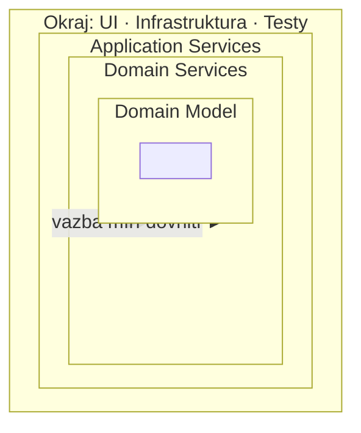

# Onion Architecture (Cibulová architektura)

> [← zpět na Architecture](../)

> **V jedné větě:** Soustředné vrstvy, kde **všechna vazba míří do středu** — a databáze není základ, na kterém to stojí, ale okraj, který se dá vyměnit.

> [!IMPORTANT]
> **Mechanika je stejná jako u [Clean Architecture](../CleanArchitecture/) a [Ports & Adapters](../PortsAndAdapters/)** a nebudeme ji opakovat. Tenhle dokument je o tom, **co Onion přidala navíc** — a je to jedna věta a jeden argument, ne jiný způsob psaní kódu.

---

## Proti čemu to vzniklo

Aby dávala smysl, je potřeba vědět, jak se v roce 2008 běžně stavělo. Vrstvená architektura se kreslila **odspodu nahoru** a úplně dole byla databáze:

```
       UI
       ↓
   Byznys logika
       ↓
   Datová vrstva        ← základ, na kterém všechno stojí
       ↓
     Databáze
```

Palermo na tom vidí jednu konkrétní věc:

> „**The biggest offender (and most common) is the coupling of UI and business logic to data access.**"

A dodává důvod, proč je to horší, než se zdá:

> „**Data access changes frequently.** Historically, the industry has modified data access techniques at least every three years."

To je celý argument. **Nejrychleji se mění to, na čem je všechno postavené** — a byznysová pravidla, která se mění nejpomaleji, na tom visí.

---

## Co Onion přidala

Jednu větu, a je to ta nejzapamatovatelnější z celé té rodiny:

> „**The database is not the center. It is external.**"
>
> — Jeffrey Palermo, *The Onion Architecture*, 2008



Pravidlo formuluje takhle:

> „The fundamental rule is that **all code can depend on layers more central, but code cannot depend on layers further out** from the core. In other words, **all coupling is toward the center**."

A jedna praktická věc, kterou uvádí konkrétněji než ostatní: **rozhraní repository patří do prvního prstence kolem doménového modelu**, implementace až na okraj. *„The first layer around the Domain Model is typically where we would find interfaces that provide object saving and retrieving behavior, called repository interfaces."*

> [!NOTE]
> Palermo v článku pojmenovává střed, prstenec s rozhraními a okraj (*„out on the edges we see UI, Infrastructure, and Tests"*). Obrázek se třemi vnitřními prstenci — **Domain Model → Domain Services → Application Services** — se rozšířil až pozdějším překreslováním. Je užitečný, ale není v původním textu.

---

## Čím se to liší od sousedů

| | [Ports & Adapters](../PortsAndAdapters/) | Onion | [Clean](../CleanArchitecture/) |
| --- | --- | --- | --- |
| Rok | 2005 | **2008** | 2012 |
| Tvar | šestiúhelník s porty | soustředné prstence | soustředné kruhy |
| Hlavní věta | jádro se dá řídit i testovat bez okolí | **databáze je vnějšek, ne základ** | závislosti míří dovnitř |
| Vnitřek dělí na | jedno jádro | model → doménové → aplikační služby | entity → use cases |
| Co řeší navíc | testovatelnost jádra | **vztah k datové vrstvě** | co smí přes hranici |

**Onion je historicky prostřední krok** mezi hexagonem a Clean Architecture a čte se z ní nejlíp ten přechod: Cockburn řekl „jádro nezná okolí", Palermo doplnil „a databáze do toho okolí patří", Martin to pak zobecnil na pravidlo závislosti a přidal, co smí přes hranici.

> [!IMPORTANT]
> **Rozhodovat se mezi nimi nemá smysl.** Jsou to tři popisy téhož pravidla. Praktická rada: použij tu slovní zásobu, kterou tým už zná — a když nezná žádnou, je jedno, kterou zvolíš, pokud se ta jediná věta dodržuje.

---

## Jak to poznat na svém projektu

Onion se od vrstev nepozná podle názvů složek, ale podle jedné otázky: **co by se stalo, kdyby se vyměnila databáze?**

| Odpověď | Co to znamená |
| ------- | ------------- |
| Doména se nezmění, přepíše se pár tříd na okraji | Vazba míří do středu |
| Musí se projít entity, protože mají anotace ORM | Databáze je pořád uvnitř |
| Nikdo neví, protože doména a dotazy jsou promíchané | Vrstvy existují jen ve složkách |

Druhý řádek je nejčastější a nejzrádnější: **entita s ORM anotacemi je doména, která zná infrastrukturu.** Doctrine to řeší mapováním v XML — je to nepohodlnější a je to přesně ta cena, o které tenhle vzor mluví.

---

## Kdy to (ne)použít

Platí totéž co u [Clean Architecture](../CleanArchitecture/#kdy-použít) a nemá cenu to opisovat. Jediný rozdíl v důrazu:

- ✅ **Sáhni po téhle slovní zásobě, když je hlavní problém vazba na databázi.** Onion na ni míří přímo a tým to pochopí rychleji než přes porty a adaptéry.
- ❌ **Nezakládej kvůli tomu nové složky, když už máš hexagon nebo vrstvy.** Přejmenovat `Core/` na `Domain/` není architektonická změna.

---

## Časté chyby

| Chyba | Proč vadí | Jak správně |
| ----- | --------- | ----------- |
| Prstence jsou složky, ale entity mají ORM anotace | Střed zná okraj — pravidlo je porušené na tom nejdůležitějším místě | Mapování mimo entitu ([Data Mapper](../../PoEAA/DataMapper/)) |
| Rozhraní repository je v infrastruktuře | Otočí se směr vazby a celé to padá | Rozhraní patří dovnitř, implementace ven |
| Doménová a aplikační služba splynou | Pravidla domény se rozlijí do orchestrace | Rozdíl je popsaný u [Service Layer](../../PoEAA/ServiceLayer/) |
| Zavede se pro CRUD | Prstence kolem `SELECT` nechrání před ničím | [Kdy nepoužít](../CleanArchitecture/#kdy-nepoužít) |
| Řeší se, jestli je to Onion, nebo Clean | Spor o jméno místo o směr šipky | Jedna věta, kontrola v CI |

---

## Související patterny

| Pattern | Vztah |
| ------- | ----- |
| [Clean Architecture](../CleanArchitecture/) | **Mladší sourozenec.** Táž myšlenka o čtyři roky později, navíc s rozdělením entit a use cases. Mechanika a demo jsou tam. |
| [Ports & Adapters](../PortsAndAdapters/) | Starší sourozenec; Onion na něj navazuje a přidává explicitní postoj k databázi. |
| [Layered Architecture](../LayeredArchitecture/) | **To, proti čemu Onion vznikla** — a [demo tam](../LayeredArchitecture/#čím-to-samo-o-sobě-nestačí) ukazuje přesně ten problém s databází dole. |
| [Repository](../../PoEAA/Repository/) (PoEAA) | Rozhraní v prvním prstenci, implementace na okraji — Palermo to uvádí jmenovitě. |
| [Data Mapper](../../PoEAA/DataMapper/) (PoEAA) | Čím se drží entita bez ORM anotací. |
| [Domain Service](../../DDD/DomainService/) (DDD) | Prstenec kolem modelu; rozdíl proti aplikační službě je rozebraný tam. |

---

## Vztah k principům

| Princip | Jak souvisí |
| ------- | ----------- |
| [DIP](../../Principles/SOLID.md#dependency-inversion-principle-dip) | Čím se ta vazba otáčí: rozhraní uvnitř, implementace venku. |
| [Provázanost](../../Principles/CohesionAndCoupling.md#stupnice-provázanosti) | Palermův argument je celý o ní — nejrychleji se měnící část nemá být ta, na které všechno visí. |
| [SRP](../../Principles/SOLID.md#single-responsibility-principle-srp) | Každý prstenec se mění z jiného důvodu. |

---

## Demo

**Vlastní nemá, a schválně.** Mechanika je shodná s [Clean Architecture](../CleanArchitecture/#demo), kde je demo se třemi kanály a kontrolou směru závislostí. Ten problém, proti kterému Onion vznikla, je změřený v [demu vrstvené architektury](../LayeredArchitecture/#demo): doména, která sahá na databázi, se nedá otestovat bez databáze — a po otočení jedné šipky se dá.

Kdyby tu demo bylo, jen by je opsalo.

---

## Původ

|              |                            |
| ------------ | -------------------------- |
| **Zdroj**    | čtyřdílná série na blogu   |
| **Autor**    | Jeffrey Palermo            |
| **Rok**      | 2008                       |
| **Obtížnost**| ●●●●○                      |

Palermo sérii napsal v červenci **2008** a psal ji z prostředí .NET, kde byla tehdy datová vrstva jako základ aplikace standardem — odtud ten důraz. Jeho věta o tom, že se techniky přístupu k datům mění **každé tři roky**, je dnes zajímavá i tím, jak zestárla: ORM se od té doby usadily víc, než čekal, ale argument platí dál — jen se místo ORM mění fronty, poskytovatelé a hostingová prostředí.

Čtyřka na obtížnosti je stejná jako u [Clean Architecture](../CleanArchitecture/) a ze stejného důvodu: samotné prstence jsou snadné, drahé je držet to pravidlo a nezaplatit za něj tam, kde se nevrátí.

---

## Zdroje

- Jeffrey Palermo: [*The Onion Architecture: part 1*](https://jeffreypalermo.com/2008/07/the-onion-architecture-part-1/), 2008 (série má čtyři díly)
- Robert C. Martin: [*The Clean Architecture*](https://blog.cleancoder.com/uncle-bob/2012/08/13/the-clean-architecture.html), 2012 — Onion jmenuje mezi pěti architekturami se stejným cílem

---

<details>
<summary>Metadata patternu</summary>

```yaml
name: Onion Architecture
name_cs: Cibulová architektura
category: Architektura
source: blog jeffreypalermo.com
authors: [Jeffrey Palermo]
year: 2008
difficulty: 4
tags: [prstence, vazba do středu, databáze na okraji, DIP]
principles: [DIP, Provázanost, SRP]
related: [CleanArchitecture, PortsAndAdapters, LayeredArchitecture, Repository, DataMapper]
status: done
```

</details>
