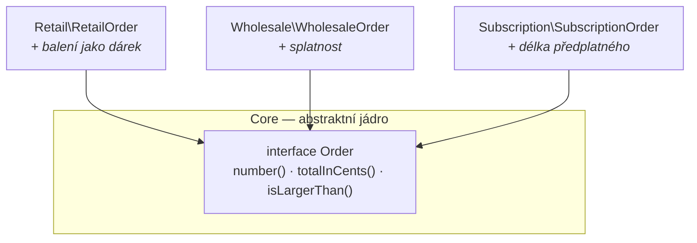

# Abstract Core (Abstraktní jádro)

> [← zpět na DDD](../)

> **V jedné větě:** Když se moduly musí znát navzájem, vytáhni to podstatné, čím spolu mluví, do abstrakcí ve vlastním modulu — a nech detaily tam, kde jsou.

---

## Problém

Model je rozdělený do modulů podle podoblastí. Vypadá to dobře — dokud se ukáže, že spolu ty podoblasti musí komunikovat.

Evans:

> „Even the core domain model usually has so much detail that **communicating the big picture can be difficult.** When there is a lot of interaction between subdomains in separate modules, **either many references will have to be created between modules, which defeats much of the value of the partitioning, or the interaction will have to be made indirect, which makes the model obscure.**"

Dvě špatné cesty a obě jsou běžné. Buď se moduly začnou odkazovat navzájem — a rozdělení přestane k čemukoli být. Nebo se komunikace zprostředkuje tak, že se v ní nikdo nevyzná.

**Poznáš to podle:**

- v `use` každého modulu jsou **všechny ostatní moduly**
- přidání čtvrtého typu znamená **sáhnout do tří existujících**
- metody `isLargerThanRetail()`, `isLargerThanWholesale()`, `isLargerThanSubscription()`
- rozdělení do modulů existuje, ale **nic nepřineslo**
- vysvětlit, jak model funguje jako celek, se nedá bez tabule

```php
// Před: každý typ objednávky zná všechny ostatní
namespace Before\Retail;

use Before\Subscription\SubscriptionOrder;
use Before\Wholesale\WholesaleOrder;

final class RetailOrder
{
    public function isLargerThanWholesale(WholesaleOrder $other): bool { /* … */ }
    public function isLargerThanSubscription(SubscriptionOrder $other): bool { /* … */ }
}
```

Demo to spočítá:

```
                    vazeb mezi moduly
Before              6
    Retail → Subscription
    Retail → Wholesale
    Subscription → Retail
    Subscription → Wholesale
    Wholesale → Retail
    Wholesale → Subscription
```

**Tři moduly, šest vazeb.** U pěti by jich bylo dvacet, u deseti devadesát — počet roste s druhou mocninou.

---

## Řešení

> „Therefore: **Identify the most fundamental differentiating concepts in the model and factor them into distinct classes, abstract classes, or interfaces.** Design this abstract model so that it **expresses most of the interaction between significant components.** Place this abstract overall model in its own module, while the specialized, detailed implementation classes are left in their own modules defined by subdomain."

Tři pokyny a v druhém je celý vzor:

| Pokyn | Co znamená |
| ----- | ---------- |
| **Most fundamental differentiating concepts** | Ne všechno — jen to, čím se ty věci od sebe liší a co je spojuje |
| **Expresses most of the interaction** | **Měřítko úspěchu:** jádro má popsat většinu komunikace mezi moduly |
| **Own module, details left in theirs** | Abstrakce zvlášť; podrobnosti zůstávají doma |



```php
namespace After\Core;

interface Order
{
    public function number(): string;
    public function totalInCents(): int;
    public function isLargerThan(self $other): bool;
}
```

```
                    vazeb mezi moduly
Before              6
After               3
    Retail → Core
    Wholesale → Core
    Subscription → Core
```

**Z šesti vazeb tři — a hlavně se změnil jejich tvar.** Přes jádro roste jejich počet lineárně, ne kvadraticky.

### Jádro popisuje interakci, ne všechno

Nejsnáz se tenhle vzor mine tím, že se do abstraktního jádra dá celý model. Evans žádá jen to, co **vyjadřuje interakci**:

```
                          v jádru     ve svém modulu
RetailOrder               3           1
WholesaleOrder            3           1
SubscriptionOrder         3           1
```

Balení jako dárek, splatnost faktury a délka předplatného **zůstaly ve svých modulech**. Do jádra se nedostaly, protože k tomu, aby spolu objednávky mluvily, nejsou potřeba.

Kontrolní otázka: **potřebují to ostatní moduly, aby s tím uměly pracovat?** Když ne, do jádra to nepatří.

### Interakce popsaná jednou

Když jádro nese i sdílené chování, zmizí duplicita:

```php
namespace After\Core;

trait ComparesByTotal
{
    public function isLargerThan(Order $other): bool
    {
        return $this->totalInCents() > $other->totalInCents();
    }
}
```

Metod `isLargerThan*` bylo v původní verzi šest — každý typ potřeboval jednu pro každý jiný. **Teď je jedna.** A všechny typy jdou zpracovat společně:

```php
usort($orders, static fn (Order $a, Order $b): int
    => $b->totalInCents() <=> $a->totalInCents());
```

```
W-001       8 900,00 Kč
S-001       3 480,00 Kč
R-001       1 290,00 Kč
```

### Co to udělá s růstem

Nejpřesvědčivější důvod se ukáže, až přijde další typ:

```
                              Before                      After
nových tříd                   1                           1
nových metod porovnání        3 (pro každý typ)           0
změn v existujících modulech  3 (každý o něm musí vědět)  0
nových vazeb mezi moduly      6                           1 (na jádro)
```

**V původní verzi se přidáním typu musí sáhnout do všech ostatních modulů.** S abstraktním jádrem se nesahá nikam — nový typ jen implementuje rozhraní.

---

## Účastníci

| Role | V příkladu | Odpovědnost |
| ---- | ---------- | ----------- |
| **Abstraktní jádro** | `Core\Order`, `ComparesByTotal` | Vyjadřuje, čím spolu moduly mluví |
| **Vlastní modul jádra** | `Core/` | Místo, kde abstrakce žijí; nezná implementace |
| **Implementace** | `RetailOrder`, `WholesaleOrder`, `SubscriptionOrder` | Znají jádro, navzájem se neznají |
| **Detaily** | balení, splatnost, období | Zůstávají ve svých modulech |

---

## Implementace v PHP

### Rozhraní, abstraktní třída, nebo trait?

Evans zmiňuje všechny tři (*„distinct classes, abstract classes, or interfaces"*) a v PHP se hodí každý na něco jiného:

| | **Rozhraní** | **Abstraktní třída** | **Trait** |
| --- | --- | --- | --- |
| Nese smlouvu | **ano** | ano | ne |
| Nese chování | ne | ano | **ano** |
| Kolik jich může třída mít | libovolně | **jednu** | libovolně |
| Kdy | Vyjádření interakce | Když je i společný stav | Sdílená implementace bez dědičnosti |

**Výchozí volba je rozhraní**, případně doplněné traitem pro sdílenou implementaci — tak je to i v demu. Abstraktní třída omezuje, protože v PHP je jen jedna, a u jádra to bolí nejvíc.

### Jádro nesmí znát implementace

```php
// Špatně — jádro ví o modulech, které ho implementují
namespace After\Core;

use After\Retail\RetailOrder;

interface Order
{
    public function isLargerThan(RetailOrder $other): bool;   // ← ne
}

// Správně — jádro mluví samo o sobě
interface Order
{
    public function isLargerThan(self $other): bool;
}
```

`self` v rozhraní je tu klíčové: **abstraktní jádro se odkazuje na vlastní abstrakci**, ne na konkrétní typ. Bez toho by se závislost otočila a vzor přestal platit — stejné pravidlo jako u [Segregated Core](../SegregatedCore/#směr-závislostí-je-celý-vzor), a hlídá se stejně, staticky.

### Kolik toho do jádra dát

Evansovo měřítko — *„expresses most of the interaction"* — se dá otestovat: **projdi místa, kde moduly komunikují, a spočítej, kolik z nich vystačí s jádrem.** Když jich většina sahá po konkrétních typech, jádro je moc chudé. Když je v jádru metoda, kterou používá jen jeden modul, je moc bohaté.

---

## Kdy použít

- ✅ **Moduly se musí znát navzájem** a počet vazeb roste.
- ✅ Přidání dalšího typu znamená **zásah do všech ostatních**.
- ✅ Existuje **společné chování napříč podoblastmi** (porovnání, řazení, souhrn).
- ✅ Model je rozdělený, ale **rozdělení nic nepřineslo**.
- ✅ Potřebuješ ukázat **celkový obraz** někomu, kdo nezná detaily.

## Kdy nepoužít

- ❌ **Moduly spolu skoro nemluví.** Pak není co abstrahovat a jádro bude prázdné.
- ❌ **Jsou jen dva.** Jedna vazba nestojí za samostatný modul.
- ❌ **Podoblasti nemají nic společného.** Abstrakce vynucená přes různé věci vyrobí rozhraní, které nikomu nesedí.
- ❌ **Není určené [jádro](../CoreDomain/).** Abstrahovat se má to podstatné — a to se musí nejdřív vědět.
- ❌ **Vystačíš s [odděleným jádrem](../SegregatedCore/).** Ten je jednodušší; tenhle vzor řeší až situaci, kdy je jádro samo velké.

---

## Časté chyby

| Chyba | Proč vadí | Jak správně |
| ----- | --------- | ----------- |
| Do jádra se dá celý model | Abstraktní jádro přestane být abstraktní | Jen to, co vyjadřuje interakci |
| Jádro zná konkrétní implementace | Závislost se otočí, vzor přestane platit | `self`; hlídat staticky |
| Abstrakce přes věci, které nemají nic společného | Vznikne rozhraní, které nikomu nesedí | Nejdřív ověřit, že společné chování existuje |
| Detaily se stěhují do jádra „ať jsou spolu" | Modulární rozdělení se rozpustí | Detaily zůstávají doma |
| Abstraktní třída místo rozhraní | V PHP jen jedna — svazuje na celý život třídy | Rozhraní, případně s traitem |
| Jádro bez vlastního modulu | Nedá se hlídat a splyne s implementacemi | Vlastní balíček |
| Zavedení dřív, než vazby vzniknou | Abstrakce dopředu, která nesedí | Až když je problém vidět |

Poslední řádek je u tohohle vzoru důležitější než jinde. **Abstraktní jádro navržené předem je [YAGNI](../../Principles/Simplicity.md#yagni--you-arent-gonna-need-it) v čisté podobě** — dokud nevidíš, jak spolu moduly reálně mluví, nemáš z čeho abstrahovat.

---

## V praxi

- **`Stringable`, `Countable`, `JsonSerializable`** — PHP má vlastní abstraktní jádro pro interakci mezi vlastními typy.
- **PSR rozhraní** (`LoggerInterface`, `ContainerInterface`) — táž myšlenka mezi knihovnami: společný slovník ve vlastním balíčku.
- **`src/Shared/` nebo `src/Common/`** v modulárních monolitech — nejčastější podoba tohohle vzoru v PHP; často zavedená bez znalosti jména.
- **Doctrine `Selectable`, `Collection`** — abstrakce, přes kterou spolu mluví různé druhy kolekcí.

---

## Související patterny

| Pattern | Vztah |
| ------- | ----- |
| [Segregated Core](../SegregatedCore/) | **Předchůdce.** Ten odděluje jádro od podpory; tenhle řeší situaci, kdy je i samotné jádro tak velké, že se v něm ztrácí obraz celku. |
| [Core Domain](../CoreDomain/) | Určuje, co abstrahovat. Bez něj se abstrahuje podle toho, co se komu zdá. |
| [Bounded Context](../BoundedContext/) | Uvnitř jednoho kontextu; abstraktní jádro **není** způsob, jak spojit dva kontexty. |
| [Strategy](../../GoF/Behavioral/Strategy/) (GoF) | Technicky totéž — rozhraní a zaměnitelné implementace. Abstract Core říká, **co** abstrahovat a proč do vlastního modulu. |
| [Composite](../../GoF/Structural/Composite/) (GoF) | Častý obyvatel abstraktního jádra: společné rozhraní pro celek i část. |
| [Cohesive Mechanism](../CohesiveMechanism/) | Také vytahuje do vlastního modulu — ale výpočty, ne abstrakce modelu. |
| [DIP](../../Principles/SOLID.md#dependency-inversion-principle-dip) | Princip, na kterém vzor stojí: moduly závisí na abstrakci, ne na sobě. |

---

## Vztah k principům

| Princip | Jak souvisí |
| ------- | ----------- |
| [DIP](../../Principles/SOLID.md#dependency-inversion-principle-dip) | Moduly závisí na abstraktním jádru, ne jeden na druhém. |
| [Nízká provázanost](../../Principles/CohesionAndCoupling.md#stupnice-provázanosti) | Vazeb ubyde a hlavně přestanou růst kvadraticky. |
| [OCP](../../Principles/SOLID.md#openclosed-principle-ocp) | Nový typ = nová třída; existující moduly se nemění. |
| [YAGNI](../../Principles/Simplicity.md#yagni--you-arent-gonna-need-it) | Zároveň mez: abstraktní jádro navržené dřív, než vazby vzniknou, nesedí. |
| [KISS](../../Principles/Simplicity.md#kiss--keep-it-simple) | Jádro má být malé — jen interakce, ne celý model. |

---

## Demo

```bash
php SoftwareDesign/DDD/AbstractCore/demo/run.php
```

Tři typy objednávek — maloobchodní, velkoobchodní a předplatné — jednou tak, že se znají navzájem, a jednou přes abstraktní jádro. Demo **spočítá vazby mezi moduly** (6 vs. 3) a ukáže, že v původní verzi rostou kvadraticky. Pak ověří, že jádro popisuje jen interakci a detaily zůstaly doma, seřadí všechny tři typy jedním `usort()` přes rozhraní a nakonec **vyčíslí, co stojí přidání čtvrtého typu**: v původní verzi tři zásahy do existujících modulů, s abstraktním jádrem žádný.

---

## Původ

|               |                                                   |
| ------------- | ------------------------------------------------- |
| **Zdroj**     | *Domain-Driven Design: Tackling Complexity in the Heart of Software* |
| **Autor**     | Eric Evans                                        |
| **Rok**       | 2003                                              |
| **Kategorie** | Strategický návrh — destilace (kapitola 15)       |
| **Obtížnost** | ●●●●○                                             |

Poslední vzor kapitoly **Distillation** a zároveň ten, který se používá nejméně — protože řeší problém, ke kterému se většina projektů nedostane. Předpokládá totiž, že **model už je rozdělený do modulů a jádro je samo o sobě tak velké**, že se v něm ztrácí celkový obraz.

Pořadí v kapitole to říká samo: [Core Domain](../CoreDomain/) → [Generic Subdomains](../GenericSubdomains/) → [Domain Vision Statement](../DomainVisionStatement/) → [Highlighted Core](../HighlightedCore/) → [Cohesive Mechanism](../CohesiveMechanism/) → [Segregated Core](../SegregatedCore/) → **Abstract Core**. Každý předchozí je levnější a tenhle má smysl teprve, když ostatní nestačily.

Obtížnost je čtyřka a je jinde než u [odděleného jádra](../SegregatedCore/). Tam je těžké **rozhodnout, kudy hranice vede**; tady je těžké **najít správnou míru abstrakce**:

- **Moc chudé jádro** nevyjádří interakci a moduly si stejně sáhnou po konkrétních typech.
- **Moc bohaté jádro** vtáhne dovnitř detaily a rozdělení do modulů se rozpustí.
- Obojí se pozná **až za nějakou dobu**, ne při návrhu.

Za povšimnutí stojí, že běžné `src/Shared/` v modulárních monolitech je v podstatě tenhle vzor — jen se do něj obvykle dává všechno, co se nehodilo jinam. Rozdíl proti Evansovi je právě v tom měřítku: **abstraktní jádro má vyjadřovat interakci, ne být skladištěm společných tříd.**

---

## Zdroje

- Eric Evans: *Domain-Driven Design*, Addison-Wesley, 2003 — kapitola 15, *Distillation*
- Eric Evans: [*Domain-Driven Design Reference*](https://www.domainlanguage.com/wp-content/uploads/2016/05/DDD_Reference_2015-03.pdf) (PDF, 2015) — souhrn definic, pod licencí CC BY 4.0

---

<details>
<summary>Metadata patternu</summary>

```yaml
name: Abstract Core
name_cs: Abstraktní jádro
category: Strategický návrh — destilace
source: DDD – Domain-Driven Design
authors: Eric Evans
year: 2003
difficulty: 4
tags: [destilace, abstrakce, moduly, interakce, rozhraní]
principles: [DIP, CohesionAndCoupling, OCP, YAGNI, KISS]
related: [SegregatedCore, CoreDomain, BoundedContext, Strategy, Composite, CohesiveMechanism]
status: done
```

</details>
