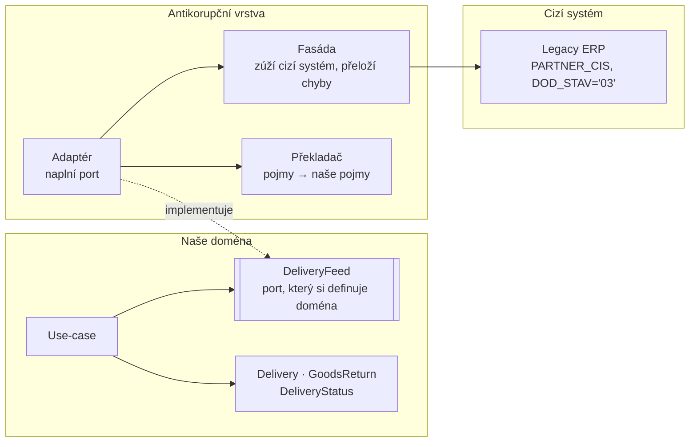

# Anticorruption Layer (Antikorupční vrstva)

> [← zpět na DDD](../)

> **V jedné větě:** Vrstva na hranici, jejímž jediným úkolem je překládat cizí model na tvůj — aby se cizí pojmy nedostaly do tvojí domény a nezůstaly v ní navždy.

---

## Problém

Musíš se integrovat se systémem, který sis nevybral: starým ERP, cizím API, službou jiného týmu. Jeho model je jiný než tvůj — a když ho pustíš dovnitř, **už ho nikdy nedostaneš ven**.

**Poznáš to podle:**

- doménové třídy mají pole pojmenovaná podle cizích sloupců: `partnerCis`, `dodStav`
- v kódu je `if ($status === '03')` a nad ním komentář vysvětlující, co znamená `03` **v jejich systému**
- `nullable` pole, které existuje jen proto, „že to ERP posílá takhle“
- jejich zvláštnost se stala tvým byznysovým pravidlem („partner s číslem 0 je hotovostní prodej“)
- doménové testy potřebují běžící cizí systém
- **cizí systém nejde vyměnit**, protože je propletený úplně vším
- jejich chybové kódy putují aplikací až do šablony

```php
// Před: cizí model se prostě předá dál a rozleze se
final class DeliveryService
{
    public function pendingDeliveries(): array
    {
        return $this->erp->volejFunkci('DOD_SEZNAM');   // pole s klíči PARTNER_CIS, DOD_STAV…
    }
}

// …a odteď o ERP ví každý, kdo se toho dotkne
foreach ($service->pendingDeliveries() as $row) {
    if ($row['DOD_STAV'] === '03' && (int) $row['DOD_MNOZ'] > 0) {
        $this->notify($row['PARTNER_NAZ']);
    }
}
```

Za rok bude `DOD_STAV` ve dvaceti souborech, `'03'` v deseti a nikdo si nevzpomene, co znamená `'07'`. Cizí systém se stal součástí tvé domény, aniž by to kdokoli rozhodl.

---

## Řešení

Postav mezi sebe a cizí systém vrstvu, jejíž **jediný úkol je překlad**. Všechna špína se soustředí v ní — a nikde jinde.



### Tři díly, ze kterých se skládá

Evans popsal antikorupční vrstvu jako složeninu tří věcí. Není to formalita — každá řeší jiný druh cizosti:

| Díl | Co řeší | V ukázce |
| --- | ------- | -------- |
| **Fasáda** | Cizí systém umí sto věcí, ty chceš tři. Zúží ho — a **přeloží jeho selhání**. | `ErpFacade` |
| **Překladač** | Převede cizí **pojmy** na tvoje. Tady bydlí veškerá špína. | `ErpTranslator` |
| **Adaptér** | Naplní port, který si definovala doména. | `LegacyErpDeliveryFeed` |

Ve zcela malé integraci se to smrskne do jedné třídy a je to v pořádku. U čehokoli většího se ty tři role rozdělí samy — a je lepší je pojmenovat dřív, než se slijí do jedné pětisetřádkové třídy.

### Není to mapper

**Nejdůležitější rozlišení celého dokumentu.** Mapper převádí tvary dat; antikorupční vrstva převádí **pojmy** — a ty se často nemapují jedna ku jedné.

V ukázkovém ERP znamená záporné množství vratku. Není to dodávka se záporným číslem, je to **jiná věc**:

```
ERP:    DOD_MNOZ = '-15'  → jedna věta jako každá jiná
Doména: Domain\GoodsReturn pro 15 ks, dobropis 6 062,50 Kč
```

Obyčejný mapper by převedl `-15` na `-15` a nechal doménu, ať si s tím poradí. Překlad pozná, že jde o jiný pojem, a vyrobí jiný typ. Podobně:

| V cizím systému | V naší doméně |
| --------------- | ------------- |
| Jeden pojem „partner“ (`PARTNER_TYP` D/O) | Dodavatel a odběratel jsou dvě různé věci — odběratel se **zahodí** |
| Kód stavu `'03'` | `DeliveryStatus::InTransit` |
| `'1 234,50'` jako text | `int` v haléřích |
| `'20260901'` | `DateTimeImmutable` |
| Řádek `['ERR' => 'X07']` | `DeliveryFeedUnavailable` |

### Selhání překládej taky

Nejčastěji opomíjená část. Když cizí chyba proteče ven, doména se o cizím systému **stejně dozví** — jen oklikou přes chybové hlášky, `try/catch` na cizí typ výjimky a HTTP kódy v use-case.

```php
private function assertNoError(array $rows): void
{
    foreach ($rows as $row) {
        if (isset($row['ERR'])) {
            throw new DeliveryFeedUnavailable(sprintf('Zdroj dodávek není dostupný (ERP %s).', $row['ERR']));
        }
    }
}
```

Doména neví, co je `ERR X07` ani co je HTTP 503. Ví jen, že zdroj není dostupný — a to jí k rozhodnutí stačí.

### Neznámou hodnotu neschovávej

Drobnost s velkým dopadem. Když překladač na neznámý kód vrátí výchozí hodnotu, propustil cizí nesmysl do domény bez povšimnutí:

```php
// Špatně — neznámý kód se tiše stane „ohlášenou“
return match ($code) {
    '01' => DeliveryStatus::Announced,
    '03' => DeliveryStatus::InTransit,
    default => DeliveryStatus::Announced,
};

// Správně — o nové hodnotě se chceš dozvědět
default => throw new \InvalidArgumentException(sprintf('Neznámý stav ERP „%s“.', $code)),
```

Cizí systém dřív nebo později přidá kód `'05'`, aniž by ti to řekl. Tohle je jediné místo, kde se to dá zachytit. Je to [Fail Fast](../../Principles/ObjectDesign.md#fail-fast) na hranici.

### Odměna přijde při výměně

Vrstva navíc stojí práci a je legitimní se ptát, co za to. Odpověď je vidět ve chvíli, kdy se cizí systém vymění — a to se dřív nebo později stane vždycky:

```
Legacy ERP:  PARTNER_CIS=4711, DOD_STAV='03', DOD_MNOZ='-15'
Modern ERP:  vendor.code=V-4711, state='IN_TRANSIT', credit=true

→ Doména a všechen kód nad ní: beze změny.
→ Mění se jedna třída.
```

Bez antikorupční vrstvy je výměna cizího systému projekt na půl roku. S ní je to jeden soubor.

---

## Účastníci

| Role | V příkladu | Odpovědnost |
| ---- | ---------- | ----------- |
| **Port** | `Domain\DeliveryFeed` | Kontrakt, který si definuje **doména** |
| **Fasáda** | `Acl\ErpFacade` | Zúží cizí systém, přeloží jeho selhání |
| **Překladač** | `Acl\ErpTranslator` | Cizí pojmy → naše pojmy; jediné místo se špínou |
| **Adaptér** | `Acl\LegacyErpDeliveryFeed` | Naplní port pomocí fasády a překladače |
| **Doména** | `Delivery`, `GoodsReturn`, `DeliveryStatus` | O cizím systému neví nic |
| **Cizí systém** | `LegacyErp\ErpClient` | Nemáš ho pod kontrolou a nezměníš ho |

---

## Implementace v PHP

Port si definuje doména — v jejích pojmech a s jejími výjimkami:

```php
namespace Domain;

interface DeliveryFeed
{
    /**
     * @return list<Delivery>
     *
     * @throws DeliveryFeedUnavailable
     */
    public function deliveries(): array;

    /** @return list<GoodsReturn> */
    public function returns(): array;
}
```

Fasáda zužuje a překládá chyby:

```php
namespace Acl;

final readonly class ErpFacade
{
    public function __construct(
        private ErpClient $client,
    ) {
    }

    /** @return list<array<string, string>> */
    public function supplierRows(): array
    {
        $rows = $this->client->volejFunkci('DOD_SEZNAM');

        $this->assertNoError($rows);

        // Že ERP míchá dodavatele s odběrateli do jednoho pojmu, končí tady.
        return array_values(array_filter(
            $rows,
            static fn (array $row): bool => ($row['PARTNER_TYP'] ?? '') === 'D',
        ));
    }
}
```

Překladač je ta třída, kde je dovoleno být ošklivý — protože se tím ošklivost soustředí na jedno místo:

```php
final readonly class ErpTranslator
{
    /** @param array<string, string> $row */
    public function isReturn(array $row): bool
    {
        return (int) $row['DOD_MNOZ'] < 0;   // záporné množství = jiný pojem
    }

    /** „1 234,50“ → 123450 */
    private function amountInCents(string $amount): int
    {
        $normalized = str_replace([' ', "\u{00A0}", ','], ['', '', '.'], $amount);

        return (int) round((float) $normalized * 100);
    }

    private function status(string $code): DeliveryStatus
    {
        return match ($code) {
            '01' => DeliveryStatus::Announced,
            '03' => DeliveryStatus::InTransit,
            '07' => DeliveryStatus::Received,
            '99' => DeliveryStatus::Cancelled,
            default => throw new \InvalidArgumentException(sprintf('Neznámý stav ERP „%s“.', $code)),
        };
    }
}
```

A adaptér obojí spojí a naplní port:

```php
final readonly class LegacyErpDeliveryFeed implements DeliveryFeed
{
    public function __construct(
        private ErpFacade $erp,
        private ErpTranslator $translator,
    ) {
    }

    public function deliveries(): array
    {
        $deliveries = [];

        foreach ($this->erp->supplierRows() as $row) {
            if ($this->translator->isReturn($row) === false) {
                $deliveries[] = $this->translator->toDelivery($row);
            }
        }

        return $deliveries;
    }
}
```

### Kam to dát ve složkách

```
src/Purchasing/
    Domain/
        Delivery.php
        GoodsReturn.php
        DeliveryStatus.php
        DeliveryFeed.php               ← port si vlastní doména
        DeliveryFeedUnavailable.php
    Infrastructure/Erp/                ← celá antikorupční vrstva
        ErpFacade.php
        ErpTranslator.php
        LegacyErpDeliveryFeed.php
```

Pravidlo pro CI: **`Domain/` nesmí obsahovat jediný `use` mířící do `Infrastructure/Erp/`** ani žádné cizí jméno. To je jediný spolehlivý způsob, jak vrstvu udržet — hlídá se stejně jako u [Ports & Adapters](../../Architecture/PortsAndAdapters/).

### Jak to testovat

Antikorupční vrstva je jediné místo, které cizí systém opravdu zná — takže je to i jediné místo, kde má smysl testovat proti němu:

- **Uložené odpovědi** (golden files) — vezmi skutečné odpovědi cizího systému, ulož je do fixture a testuj překlad proti nim. Když se cizí formát změní, test spadne.
- **Test na neznámou hodnotu** — ověř, že neznámý kód vyhodí výjimku a nespadne do defaultu.
- **Test na selhání** — cizí chyba se musí objevit jako tvoje výjimka.
- **Zbytek aplikace** používá in-memory implementaci portu a cizí systém nepotřebuje vůbec.

---

## Kdy použít

- ✅ Integruješ se **starým systémem** nebo cizím API, jehož model neodpovídá tvému.
- ✅ Cizí model je **horší než tvůj** — plochý, zakódovaný, historicky pokroucený.
- ✅ Jde o **jádro tvé domény**, a nechceš tam cizí pojmy za žádnou cenu.
- ✅ Očekáváš, že se cizí systém **jednou vymění** nebo změní.
- ✅ Cizí systém se mění častěji nebo nepředvídatelně a nechceš jeho změny po celé aplikaci.

## Kdy nepoužít

- ❌ **Cizí model je rozumný a blízký tvému.** Pak stačí [Conformist](../ContextMap/#katalog-vztahů) — vezmi ho, jak je, a ušetři si vrstvu.
- ❌ **Jde o okraj domény.** Kolem číselníku zemí se nebrání nikdo.
- ❌ **Kontrakt vlastníš ty.** Když si formát diktuješ, není před čím se chránit — oprav rovnou zdroj.
- ❌ **Jednorázový import.** Skript, který poběží jednou, vrstvu nepotřebuje.
- ❌ **Nemáš na její údržbu lidi.** Každá jejich změna znamená práci u tebe. Neudržovaná antikorupční vrstva je jen další místo, kde se lže.

> Pravidlo palce: **čím blíž je to k jádru tvé domény, tím spíš se braň.** Rozhodnutí Conformist vs. antikorupční vrstva patří do [Context Map](../ContextMap/), kde je i tabulka kompromisů.

---

## Časté chyby

| Chyba | Proč vadí | Jak správně |
| ----- | --------- | ----------- |
| Vrstva vrací cizí typ nebo pole s cizími klíči | Nic jsi neochránil, jen přidal soubor | Ven jde **jen** doménový typ |
| Překládají se data, ale ne pojmy | `-15` zůstane `-15` a doména si musí domyslet, že jde o vratku | Jiný pojem = jiný typ |
| Selhání se nepřekládají | Cizí chybové kódy putují aplikací a doména o systému stejně ví | Cizí chyba → tvoje výjimka |
| Neznámá hodnota spadne do `default` | Nová hodnota u nich projde tiše a rozbije se to jinde | Neznámá hodnota = výjimka |
| Port si definuje vrstva, ne doména | Závislost míří ven; doména se přizpůsobuje cizímu systému | Port vlastní **doména** |
| Vrstva obsahuje byznysovou logiku | Pravidla se rozdělí mezi doménu a integraci a nikdo je nenajde | Vrstva **jen překládá**, nerozhoduje |
| Jedna třída na všechno, 600 řádků | Nikdo se v tom nevyzná a testovat to nejde po částech | Fasáda, překladač, adaptér zvlášť |
| Vrstva jen kolem čtení, zápis jde napřímo | Cizí model proteče druhou stranou | Chránit se má obojí směr |
| Nikdo netestuje překlad proti reálným odpovědím | Změna jejich formátu se pozná až v produkci | Golden files se skutečnými odpověďmi |

---

## V praxi

- **Ports & Adapters** — antikorupční vrstva **je [řízený adaptér](../../Architecture/PortsAndAdapters/#dvě-strany-na-jednu-se-zapomíná)**. Rozdíl je v ambici: běžný adaptér překládá protokol, antikorupční vrstva se aktivně brání cizímu **modelu**.
- **Symfony DI** — port v doméně, vrstva v infrastruktuře, spojení jedním řádkem v `services.yaml`.
- **deptrac** — jediný způsob, jak uhlídat, že se cizí jméno neobjeví v doméně.
- **Golden files** v testech — uložené skutečné odpovědi cizího systému jako fixture.

---

## Související patterny

| Pattern | Vztah |
| ------- | ----- |
| [Context Map](../ContextMap/) | **Odsud pochází rozhodnutí, jestli tuhle vrstvu vůbec stavět.** Je to jeden ze sedmi vztahů; alternativou je Conformist. |
| [Bounded Context](../BoundedContext/) | Vrstva stojí přesně na hranici kontextu a je to nejsilnější podoba překladu, o kterém tenhle pattern mluví. |
| [Ports & Adapters](../../Architecture/PortsAndAdapters/) | Technická podoba: port v doméně, vrstva jako [řízený adaptér](../../Architecture/PortsAndAdapters/#dvě-strany-na-jednu-se-zapomíná). |
| [Adapter](../../GoF/Structural/Adapter/) (GoF) | Sdílejí princip, ne měřítko. GoF Adapter překládá **rozhraní** jednoho objektu; tahle vrstva překládá **model** celého systému — a bývá z adaptérů složená. |
| **Facade** (GoF) | Jeden ze tří dílů — zúží cizí systém na to, co potřebuješ. |
| [Repository](../../PoEAA/Repository/) | Když cizí systém slouží jako úložiště, vrstva se často schová právě za repository. |
| [Value Object](../ValueObject/) | Typický výstup překladu — `SupplierId`, částka v haléřích, `DateTimeImmutable`. |
| [Data Mapper](../../PoEAA/DataMapper/) | Táž myšlenka o patro níž: tam se překládá cizí **schéma**, tady cizí **model**. |
| [Segregated Core](../SegregatedCore/) (DDD) | Chrání model před **vlastními** podpůrnými částmi; anticorruption layer před cizím modelem. |
| [Generic Subdomains](../GenericSubdomains/) (DDD) | Nejčastější důvod, proč vrstvu stavíš — hotové řešení pro obecnou podoblast si nese vlastní model. |
| [Ubiquitous Language](../UbiquitousLanguage/) (DDD) | Vrstva je místo, kde překlad mezi jazyky legitimně probíhá; uvnitř kontextu se překládat nesmí. |
| [Conwayův zákon](../../Principles/ConwaysLaw.md) | Vrstva vzniká typicky tam, kde je organizační hranice — jiný tým, jiná firma, jiný dodavatel. |

---

## Vztah k principům

| Princip | Jak souvisí |
| ------- | ----------- |
| [DIP](../../Principles/SOLID.md#dependency-inversion-principle-dip) | **Jádro věci.** Port si vlastní doména; cizí systém se přizpůsobuje jí, ne naopak. Bez toho je vrstva jen mezistupeň, ne ochrana. |
| [SRP](../../Principles/SOLID.md#single-responsibility-principle-srp) | Vrstva se mění, když se změní cizí systém. Doména, když se změní byznys. Dva důvody, dvě místa. |
| [Fail Fast](../../Principles/ObjectDesign.md#fail-fast) | Neznámý kód nebo nečitelné datum vyhodí výjimku na hranici — ne o tři vrstvy dál v podobě divných dat. |
| [Zákon Demeter](../../Principles/ObjectDesign.md#zákon-demeter-law-of-demeter) | Doména nesahá skrz cizí strukturu (`$row['PARTNER_NAZ']`), mluví jen s vlastními typy. |

---

## Demo

```bash
php DDD/AnticorruptionLayer/demo/run.php
```

Ukáže syrové odpovědi starého ERP (kódy stavů, částky s čárkou, datum jako řetězec), co z nich vidí doména, jak se **záporné množství přeloží na vratku místo na dodávku**, jak se cizí chyba `ERR X07` stane doménovou výjimkou — a nakonec vymění celé ERP za nástupce s jiným formátem, aniž by se doménový kód změnil o písmeno.

---

## Původ

|               |                                                    |
| ------------- | -------------------------------------------------- |
| **Zdroj**     | *Domain-Driven Design*, část IV — Strategický návrh |
| **Autor**     | Eric Evans                                          |
| **Rok**       | 2003                                                |
| **Kategorie** | Strategický návrh                                   |
| **Obtížnost** | ●●●○○                                               |

Evans pattern zařadil mezi vztahy v [mapě kontextů](../ContextMap/) a pojmenoval ho neobvykle silně — *anticorruption*, protikorupční. To slovo je záměrné: nejde o převod formátu, ale o obranu. Jeho pozorování bylo, že cizí model se do domény nedostane rozhodnutím, ale **prosakováním**. Nikdo se nerozhodne, že bude mít v doméně cizí kódy stavů; prostě se to jednoho dne zjistí.

Motivací byly integrace se staršími systémy, kterých bylo v roce 2003 plno a které se nedaly změnit. Evans upozorňoval, že tahle vrstva je **drahá** a že to je v pořádku — je to cena za to, že cizí systém zůstane vyměnitelný. Kdo ji platit nechce, má zvolit Conformist, ale má to udělat vědomě.

Dnes je pattern relevantnější než tehdy. Míst, odkud může cizí model prosáknout, přibylo: cizí API, služby jiných týmů, SaaS nástroje, výstupy jazykových modelů. Zestárl jen jeho příklad, ne myšlenka.

---

## Zdroje

- Eric Evans: *Domain-Driven Design*, Addison-Wesley, 2003 — kapitola 14
- Vaughn Vernon: *Implementing Domain-Driven Design*, Addison-Wesley, 2013 — kapitola 3
- [DDD Crew: Context Mapping](https://github.com/ddd-crew/context-mapping)

---

<details>
<summary>Metadata patternu</summary>

```yaml
name: AnticorruptionLayer
name_cs: Antikorupční vrstva
category: Strategický návrh
source: DDD – Domain-Driven Design
authors: Eric Evans
year: 2003
difficulty: 3
tags: [strategický návrh, integrace, překlad, hranice, legacy]
principles: [DIP, SRP, FailFast]
related: [ContextMap, BoundedContext, PortsAndAdapters, Adapter, Facade, Repository, ValueObject]
status: done
```

</details>
