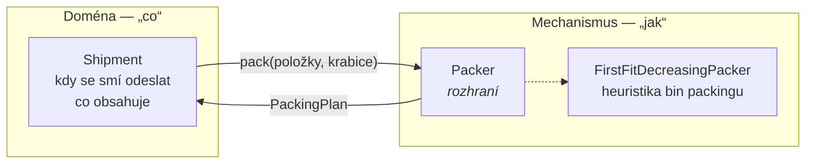

# Cohesive Mechanism (Soudržný mechanismus)

> [← zpět na DDD](../)

> **V jedné větě:** Když se výpočet rozroste tak, že přebije doménu, vytáhni ho do samostatného rámce s rozhraním, které říká **co** — a nech si uvnitř to **jak**.

---

## Problém

Do doménové třídy se dostane netriviální algoritmus. Nejdřív pár řádků, pak pomocná metoda, pak tři. Nakonec je z třídy o objednávce třída o třídění a hledání v poli.

Evans to formuluje přesně:

> „Computations sometimes reach a level of complexity that begins to bloat the design. The **conceptual „what" is swamped by the mechanistic „how."** A large number of methods that provide algorithms for resolving the problem obscure the methods that express the problem."

**Poznáš to podle:**

- ve třídě je víc metod o **algoritmu** než o doméně
- jména metod jsou `sortByVolumeDescending`, `findFirstFitting` — ne doménová slovesa
- kolega hledá v třídě `Shipment` odpověď na „kdy se smí odeslat" a **nemůže ji najít**
- test algoritmu potřebuje postavit celou objednávku i se zákazníkem
- ten výpočet by se hodil i jinde, ale nejde vytáhnout
- jde o věc, která má **jméno v matematice nebo v informatice** — bin packing, hledání cesty, plánování, optimalizace

```php
// Před: doména, ve které se ztrácí doména
final class Shipment
{
    public function canBeDispatched(): bool { /* … */ }
    public function dispatch(): void { /* … */ }

    public function packIntoBoxes(): array { /* … */ }
    private function sortItemsByVolumeDescending(): array { /* … */ }
    private function sortBoxesByCapacityAscending(): array { /* … */ }
    private function largestBox(array $boxes): BoxSize { /* … */ }
    private function assertFits(/* … */): void { /* … */ }
    private function findOpenBoxWithSpace(/* … */): ?int { /* … */ }
    private function smallestBoxFitting(/* … */): BoxSize { /* … */ }
}
```

Demo to spočítá na téhle třídě:

```
                          doménových metod    algoritmických
Before\Shipment           4                   7
```

**Sedm ku čtyřem ve prospěch něčeho, co s doménou nesouvisí.**

---

## Řešení

> „Therefore: **Partition a conceptually cohesive mechanism into a separate lightweight framework.** Particularly watch for formalisms or well-documented categories of algorithms. **Expose the capabilities of the framework with an intention-revealing interface.** Now the other elements of the domain can focus on expressing the problem („what"), delegating the intricacies of the solution („how") to the framework."

Tři pokyny v jedné větě: **oddělit**, **hledat známé formalismy** a **vystavit rozhraním, které odhaluje záměr**.



```php
interface Packer
{
    /**
     * @param list<PackableItem> $items
     * @param list<BoxSize> $availableBoxes
     */
    public function pack(array $items, array $availableBoxes): PackingPlan;
}
```

Doména se pak scvrkne na to, o čem je:

```php
final class Shipment
{
    public function canBeDispatched(): bool { /* … */ }
    public function dispatch(): void { /* … */ }

    /** Doména řekne, co chce. Jak se to spočítá, ji nezajímá. */
    public function packUsing(Packer $packer): PackingPlan
    {
        return $packer->pack($this->items, $this->availableBoxes);
    }
}
```

```
                          doménových metod    algoritmických
Before\Shipment           4                   7
After\Shipment            5                   0

řádků kódu:            Before 153  ·  After 60
```

**Doménových metod je stejně.** Zmizelo jen to, co s doménou nesouviselo — a s ním dvě třetiny kódu třídy.

### Co dělá mechanismus „soudržným"

Klíčové slovo v názvu není „mechanismus", ale **soudržný**. Vytáhnout algoritmus do třídy `PackingHelper`, která bude znát objednávku, zákazníka a dopravce, problém nevyřeší — jen ho přestěhuje.

Soudržný mechanismus pozná se podle toho, **co v něm není**:

```php
// V celém Packing/ nenajdeš slovo Order, Customer, Shipment ani Money.
// Mechanismus zná objemy a kapacity. Nic víc.
```

Demo to ověřuje na sadě případů, které nepotřebují ani jednu doménovou třídu:

```
prázdný vstup                         0 krabic
jedna malá položka                    1 krabice
položka přesně na kapacitu S          1 krabice
položka větší než největší krabice    Položka OBR se nevejde ani do největší krabice.
```

**Žádná zásilka, žádná databáze — jen objemy a kapacity.** To je ta soudržnost.

### „Watch for formalisms"

Evansova věta o formalismech je návod, kde mechanismy hledat. Když má tvůj problém **jméno mimo tvoji doménu**, je to skoro jistý kandidát:

| V doméně to vypadá jako | Ve skutečnosti je to |
| ----------------------- | -------------------- |
| „rozděl zásilku do co nejmíň krabic" | **bin packing** |
| „najdi nejlevnější trasu přes sklady" | **hledání nejkratší cesty v grafu** |
| „naplánuj sloty doručení" | **rozvrhovací problém** |
| „rozděl slevu mezi položky beze zbytku" | **alokace celých jednotek** |
| „vyhodnoť podmínky nad daty" | **vyhodnocení výrazu** |
| „urči pořadí kroků podle závislostí" | **topologické řazení** |

Přínos je dvojí: jednak víš, že to řešil někdo před tebou, jednak **jméno napoví, kde má mechanismus končit**. Bin packing nepotřebuje vědět nic o objednávce — a jakmile to vědět chce, něco je špatně.

---

## Účastníci

| Role | V příkladu | Odpovědnost |
| ---- | ---------- | ----------- |
| **Doména** | `Shipment` | Vyjadřuje problém; o řešení neví |
| **Rozhraní mechanismu** | `Packer` | Odhaluje záměr, skrývá postup |
| **Implementace** | `FirstFitDecreasingPacker` | Algoritmus; nezná doménu |
| **Vstup a výstup** | `PackableItem`, `BoxSize`, `PackingPlan` | Hodnoty na hranici — bez doménového chování |

Poslední řádek je snadné podcenit. Kdyby mechanismus bral rovnou `Shipment`, přestal by být soudržný — a byla by z něj jen další doménová třída.

---

## Implementace v PHP

### Rozhraní patří k doméně, implementace ne

```php
// Doména závisí na rozhraní
public function packUsing(Packer $packer): PackingPlan

// …a o implementaci neví:
//   After\Shipment zmiňuje:   Packer
//   je to rozhraní?           ano
//   zná FirstFitDecreasing?   ne
```

Je to [DIP](../../Principles/SOLID.md#dependency-inversion-principle-dip) v učebnicové podobě a má praktický důsledek: **vyměnit heuristiku za přesnější algoritmus — nebo za volání externí služby — znamená předat jinou implementaci.** Doména se nezmění.

### Mechanismus smí být „hloupý"

Heuristika v demu nedává optimální řešení; bin packing je NP-těžký a pro e-shop stačí dobré řešení hned. **To je vlastnost, kterou má mechanismus přiznat** — třeba jménem třídy:

```php
final class FirstFitDecreasingPacker implements Packer
```

Jméno říká, co uvnitř běží. Kdyby se třída jmenovala `OptimalPacker`, slibovala by něco, co nesplní.

### Kdy je to ještě Domain Service a kdy už mechanismus

| | [**Domain Service**](../DomainService/) | **Cohesive Mechanism** |
| --- | --- | --- |
| Obsahuje | doménové rozhodnutí | **výpočet** |
| Mluví jazykem | domény | matematiky nebo informatiky |
| Zná doménové typy | **ano** | **ne** |
| Kdo mu rozumí | doménový expert | programátor |
| Příklad | „má nárok na dopravu zdarma" | „jak to naskládat do krabic" |

**Rozhodovací otázka: dokázal by o tom mluvit doménový expert?** Jestli ano, je to doménová logika a patří do domény. Jestli by řekl „to je vaše věc, hlavně ať je krabic málo", je to mechanismus.

---

## Kdy použít

- ✅ **Výpočet přebil doménu** — algoritmických metod je víc než doménových.
- ✅ Problém má **jméno mimo tvoji doménu** (bin packing, graf, rozvrh).
- ✅ Algoritmus **nepotřebuje doménové typy** — vystačí s čísly a jednoduchými hodnotami.
- ✅ Chceš algoritmus **testovat samostatně**, bez stavění celé domény.
- ✅ Počítáš s tím, že se **implementace vymění** za lepší nebo za externí službu.

## Kdy nepoužít

- ❌ **Výpočet je na tři řádky.** Rozhraní, implementace a dvě hodnotové třídy kolem `array_sum()` jsou režie bez užitku.
- ❌ **Algoritmus potřebuje doménová pravidla.** Pak to není mechanismus, ale [Domain Service](../DomainService/) — nebo je špatně rozdělený.
- ❌ **Je to rozhodnutí, ne výpočet.** „Smí zákazník tenhle produkt koupit" není mechanismus.
- ❌ **Používá se to na jediném místě a nikdy se nezmění.** Pak stačí privátní metoda a je to poctivější.

---

## Časté chyby

| Chyba | Proč vadí | Jak správně |
| ----- | --------- | ----------- |
| Mechanismus zná doménové typy | Přestal být soudržný; je to jen přestěhovaná třída | Na hranici jen hodnoty — objemy, kapacity |
| Doména závisí na konkrétní implementaci | Nejde vyměnit ani testovat s jinou | Závislost na rozhraní |
| Rozhraní pojmenované podle algoritmu | `BinPackingService::solve()` neříká doméně nic | Podle záměru — `Packer::pack()` |
| Jméno slibuje víc, než algoritmus umí | `OptimalPacker`, který dává heuristiku | Přiznat to jménem |
| Vytažení výpočtu na tři řádky | Čtyři soubory kolem `array_sum()` | Nech to v doméně |
| Mechanismus si sahá do databáze | Přestane jít otestovat a začne mít vedlejší efekty | Data dostane na vstupu |
| Do mechanismu se přidá doménové pravidlo | „Křehké zboží zvlášť" tam nepatří | Pravidlo do domény, mechanismus dostane už rozdělený vstup |
| Jeden mechanismus na dvě nesouvisející věci | Ztratí soudržnost a nikdo neví, co dělá | Dva mechanismy |

Předposlední řádek je nejzákeřnější, protože vypadá nevinně. Ve chvíli, kdy `Packer` začne vědět, že křehké zboží se nesmí balit s těžkým, přestává být mechanismem — **doména mu má takové věci předat už vyřešené**, třeba jako dvě samostatná volání.

---

## V praxi

- **`usort()` s vlastním komparátorem** — nejjednodušší mechanismus v PHP. Řazení je formalismus, komparátor je [Strategy](../../GoF/Behavioral/Strategy/).
- **Knihovny na měnové výpočty** (`brick/money`) — mechanismus pro dělení částek beze zbytku; doména jen řekne „rozděl na tři".
- **Rules engine** — [samostatný vzor](../../Architecture/RulesEngine/), který je vlastně mechanismem pro vyhodnocování pravidel.
- **Doctrine DQL parser** — z pohledu aplikace čistý mechanismus: dáš dotaz, dostaneš SQL.
- **Solvery a plánovače** (OptaPlanner a podobné) — celé knihovny postavené na téhle myšlence.

---

## Související patterny

| Pattern | Vztah |
| ------- | ----- |
| [Domain Service](../DomainService/) | **Nejčastější záměna.** Domain service obsahuje doménové rozhodnutí, mechanismus výpočet. [Srovnání výš](#kdy-je-to-ještě-domain-service-a-kdy-už-mechanismus). |
| [Segregated Core](../SegregatedCore/) | **Sourozenec z téže kapitoly.** Oba destilují: mechanismus vytahuje výpočty, Segregated Core odděluje jádro od podpůrných částí. Evans je popisuje jeden po druhém. |
| [Strategy](../../GoF/Behavioral/Strategy/) (GoF) | Struktura je táž — rozhraní a zaměnitelné implementace. Cohesive Mechanism říká **proč a co** oddělit, Strategy **jak** to technicky udělat. |
| [Ports & Adapters](../../Architecture/PortsAndAdapters/) | Rozhraní mechanismu je [řízený port](../../Architecture/PortsAndAdapters/#dvě-strany-na-jednu-se-zapomíná) — doména si říká, implementace leží vně. |
| [Rules Engine](../../Architecture/RulesEngine/) | Konkrétní mechanismus pro vyhodnocování pravidel; má vlastní dokument, protože si nese víc rozhodnutí. |
| [Value Object](../ValueObject/) | Vstupy a výstupy mechanismu bývají hodnoty — neměnné, bez identity. |
| [Specification](../Specification/) | Když je „mechanismus" jen podmínka ano/ne, je to specifikace a nepotřebuje rámec. |
| [Core Domain](../CoreDomain/) (DDD) | Předpoklad celé destilace — bez pojmenovaného jádra není podle čeho poznat, co vytěsnit. |

---

## Vztah k principům

| Princip | Jak souvisí |
| ------- | ----------- |
| [SRP](../../Principles/SOLID.md#single-responsibility-principle-srp) | Doména se mění kvůli byznysu, algoritmus kvůli výkonu nebo přesnosti. Dva důvody, dvě místa. |
| [DIP](../../Principles/SOLID.md#dependency-inversion-principle-dip) | Doména závisí na rozhraní, které si sama určuje; implementace na ní. |
| [Vysoká soudržnost](../../Principles/CohesionAndCoupling.md#stupnice-soudržnosti) | Doslova v názvu vzoru — mechanismus drží pohromadě jednu věc a nic jiného. |
| [Nízká provázanost](../../Principles/CohesionAndCoupling.md#stupnice-provázanosti) | Mechanismus nezná doménu, doména nezná algoritmus. |
| [KISS](../../Principles/Simplicity.md#kiss--keep-it-simple) | Zároveň mez: na tříradkový výpočet je celý rámec složitější než problém. |

---

## Demo

```bash
php SoftwareDesign/DDD/CohesiveMechanism/demo/run.php
```

Táž zásilka a totéž balení do krabic, jednou s algoritmem uvnitř domény a jednou s vytaženým mechanismem. Demo **spočítá reflexí, kolik metod třídy je o doméně a kolik o algoritmu** (4 : 7 před, 5 : 0 po) a porovná délku kódu (153 vs. 60 řádků). Pak ověří, že výsledek je totožný, ukáže, že doména zná jen rozhraní `Packer` a ne konkrétní heuristiku, a nakonec pustí mechanismus na okrajových případech **bez jediné doménové třídy**.

---

## Původ

|               |                                                   |
| ------------- | ------------------------------------------------- |
| **Zdroj**     | *Domain-Driven Design: Tackling Complexity in the Heart of Software* |
| **Autor**     | Eric Evans                                        |
| **Rok**       | 2003                                              |
| **Kategorie** | Strategický návrh — destilace (kapitola 15)       |
| **Obtížnost** | ●●●○○                                             |

Vzor patří do kapitoly **Distillation**, která je celá o jedné otázce: **co v modelu je to skutečně cenné a jak to zbavit všeho ostatního.** Evans v ní postupuje od pojmenování jádra (*Core Domain*) přes vytěsnění obecných částí (*Generic Subdomains*) až k tomuhle vzoru a k jeho [sourozenci](../SegregatedCore/).

Pořadí v knize není náhodné a Evans ho sám komentuje:

> „Factoring out generic subdomains reduces clutter, and **cohesive mechanisms serve to encapsulate complex operations.** This leaves behind a more focused model, with fewer distractions that add no particular value to the way users conduct their activities."

Nejužitečnější část definice je věta o **formalismech**. Evans radí dívat se po dobře popsaných kategoriích algoritmů — a je to rada, která platí i mimo DDD: **problém, který má jméno v odborné literatuře, skoro nikdy nepatří doprostřed doménové třídy.**

Obtížnost je trojka, protože samotné vytažení je mechanická práce. Těžké je rozpoznat **hranici** — kolik z výpočtu je ještě doména a od kdy už je to jen matematika. Špatně vedená hranice vyrobí mechanismus, který zná půlku domény, a tím se nic nezíská.

---

## Zdroje

- Eric Evans: *Domain-Driven Design*, Addison-Wesley, 2003 — kapitola 15, *Distillation*
- Eric Evans: [*Domain-Driven Design Reference*](https://www.domainlanguage.com/wp-content/uploads/2016/05/DDD_Reference_2015-03.pdf) (PDF, 2015) — souhrn definic, pod licencí CC BY 4.0

---

<details>
<summary>Metadata patternu</summary>

```yaml
name: Cohesive Mechanism
name_cs: Soudržný mechanismus
category: Strategický návrh — destilace
source: DDD – Domain-Driven Design
authors: Eric Evans
year: 2003
difficulty: 3
tags: [destilace, algoritmus, rámec, oddělení co a jak, formalismus]
principles: [SRP, DIP, CohesionAndCoupling, KISS]
related: [DomainService, SegregatedCore, Strategy, PortsAndAdapters, RulesEngine, ValueObject, Specification]
status: done
```

</details>
