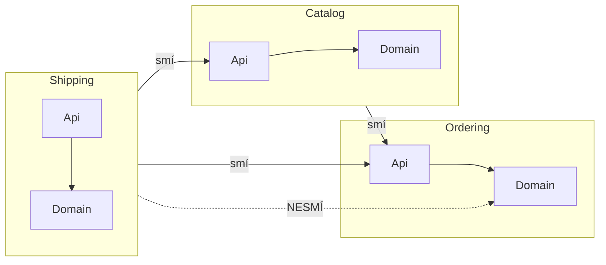

# Modules (Moduly)

> [← zpět na DDD](../)

> **V jedné větě:** Rozdělení kódu do celků, jejichž **jména jsou součástí jednotného jazyka** — takže ze složek je vidět, co systém dělá, ne z čeho je postavený.

> [!IMPORTANT]
> Tenhle vzor se čte jako „to je přece jen organizace složek". Evans hned první větou říká opak: *„Everyone uses modules, but **few treat them as a full-fledged part of the model**."* Modul není místo, kam se soubory uklidí. **Je to pojem v modelu.**

---

## Problém

Aplikace roste a kód se rozdělí. Nejčastěji podle toho, co je zrovna po ruce — podle technického typu:

```
src/
    Entity/
        Order.php
        Product.php
        Shipment.php
        Customer.php
        Invoice.php          ← a dalších třicet
    Repository/
    Service/
```

Evans na tom vidí přesně tenhle mechanismus: *„Code gets broken down into all sorts of categories, **from aspects of the technical architecture to developers' work assignments**."*

Takové dělení má dvě vlastnosti, které se projeví až za rok.

**První: nic ti neřekne.** Ze složky `Entity/` nepoznáš, jestli je to e-shop, účetnictví nebo rezervační systém. Vidíš, z čeho je to postavené, ne co to dělá.

**Druhá: nikdo to nezmění.** Evans to trefuje přesně:

> „Even developers who refactor a lot tend to **content themselves with modules conceived early in the project**."

Přesunout třídu mezi složkami vypadá jako kosmetika. Refaktoring uvnitř třídy se dělá denně, hranice modulů se nehnou roky — a mezitím se model změnil.

**Poznáš to podle:**

- složky nejvyšší úrovně jsou `Entity`, `Service`, `Repository` — tedy jména z knihy, ne z domény
- nový člověk se ptá „a kde je objednávání?" a odpověď je „to je na pěti místech"
- při změně jedné funkce sáhneš do tří složek pokaždé
- struktura složek se od prvního měsíce projektu nezměnila, ale doména ano
- na otázku „co je v tomhle modulu?" se odpovídá výčtem tříd, ne jednou větou

---

## Řešení

> „**Choose modules that tell the story of the system** and contain a cohesive set of concepts. **Give the modules names that become part of the ubiquitous language.** Modules are part of the model and their names should reflect insight into the domain."
>
> — Eric Evans, *Domain-Driven Design Reference*, 2015

```
src/
    Ordering/          ← jméno, které řekne obchodník
        Api/           ← to jediné, co smí volat okolí
        Domain/
        Application/
        Infrastructure/
    Catalog/
    Shipping/
```

Tři věci, které z toho plynou a stojí za vyslovení zvlášť:

1. **Jméno modulu je termín z domény.** `Ordering`, ne `OrderStuff`. Když pro modul nejde vymyslet jméno, kterému rozumí i obchodník, obvykle to není modul, ale hromádka.
2. **Modul má veřejnou část a vnitřek.** Bez toho rozdělení je hranice jen v hlavě.
3. **Modul se mění s modelem.** Když se ukáže, že „fakturace" je vlastní téma, vznikne modul. Když se ukáže, že dva moduly jsou pořád tentýž pojem, sloučí se.



### Soudržnost a provázanost jsou tu o pojmech, ne o číslech

Tohle je na celém vzoru ta nejméně samozřejmá část a Evans ji říká narovinu:

> „Explanations of coupling and cohesion tend to make them sound like **technical metrics**, to be judged mechanically based on the distributions of associations and interactions. **Yet it isn't just code being divided into modules, but also concepts.** There is a limit to how many things a person can think about at once (hence low coupling). Incoherent fragments of ideas are as hard to understand as an undifferentiated soup of ideas (hence high cohesion)."

Nízká provázanost tedy neznamená „málo `use` příkazů". Znamená **pojmy, o kterých se dá přemýšlet odděleně** — a to je vlastnost modelu, ne metrika. Obecné vysvětlení obou pojmů je v [Soudržnost a provázanost](../../Principles/CohesionAndCoupling.md); tenhle vzor je jejich použití na úrovni celků.

---

## Účastníci

| Účastník | Role |
| -------- | ---- |
| **Modul** | Celek pojmů, které spolu souvisejí. Jeho jméno je termín z jednotného jazyka. |
| **Veřejná část** (`Api\`) | Hrstka tříd a rozhraní, které smí volat okolí. |
| **Vnitřek** | Všechno ostatní. Entity, repository, implementace — cizí modul o nich nemá vědět. |
| **Kontrola hranic** | Nástroj v CI. V PHP jediná věc, která hranici skutečně drží. |

---

## Implementace v PHP

### Veřejná část a vnitřek

```php
// Ordering/Api/Orders.php — tohle smí volat kdokoli
interface Orders
{
    public function summaryOf(string $orderId): OrderSummary;
}

// Ordering/Api/OrderSummary.php — jednoduchý tvar, ne doménová entita
final readonly class OrderSummary
{
    public function __construct(
        public string $orderId,
        public int $totalInCents,
    ) {
    }
}
```

```php
// Ordering/Domain/Order.php — vnitřek, ven nepatří
final class Order
{
    /** @var list<OrderLine> */
    private array $lines = [];
    // …
}
```

Modul ven vydává **`OrderSummary`, ne `Order`**. Kdyby vydal entitu, cizí modul by o ní začal něco předpokládat — a od té chvíle ji nejde změnit.

### Hranici ti PHP neuhlídá

```php
// Catalog/Application/RecommendationService.php
use BadShop\Ordering\Domain\Order;   // ← projde
```

> [!IMPORTANT]
> **PHP nemá package-private ani `internal`.** Java a C# hranici modulu vynutí modifikátorem, PHP ne. Tenhle `use` se přeloží, spustí a projde `php -l` — a nikdo se nic nedozví. Totéž omezení má [Memento](../../GoF/Behavioral/Memento/), kde chybí `friend`.

Zbývá jediné: **kontrola v CI.** Buď [deptrac](https://github.com/qossmic/deptrac), nebo pravidlo pro PHPStan. Demo k tomuhle dokumentu ukazuje, že na základní podobu té kontroly stačí padesát řádků — takže není důvod ji nemít.

```
Pravidlo: do cizího modulu se smí jen přes jeho Api\.

varianta Bad              3 porušení
  · Catalog\Application\RecommendationService
    → Ordering\Domain\Order
  · Shipping\Application\LabelPrinter
    → Ordering\Domain\Order
  · Shipping\Application\LabelPrinter
    → Catalog\Domain\Product

varianta Good             žádné porušení
```

### Modul, nebo bounded context?

Pletou se skoro vždycky, protože ve složkách vypadají stejně.

| | Modul | [Bounded Context](../BoundedContext/) |
| --- | --- | --- |
| Co to je | celek **uvnitř** jednoho modelu | hranice **jednoho modelu** |
| Platí uvnitř něj | týž jazyk jako všude v kontextu | **vlastní** význam pojmů |
| „Objednávka" znamená | totéž co v sousedním modulu | **něco jiného** než v sousedním kontextu |
| Hranice drží | dohoda + kontrola v CI | překlad na hranici, [anticorruption layer](../AnticorruptionLayer/) |

Praktické rozlišení: **když se přes hranici musí překládat, je to kontext. Když stačí předat, je to modul.**

### Kam to sáhne v projektu

Rozhodnutí „vrstvy nahoře, nebo moduly nahoře" a co z toho vzniká, je popsané [v úvodu sekce](../#horizontálně-nebo-vertikálně) — i s tím, kdy přejít a kde to v praxi padá.

---

## Kdy použít

- ✅ Doména má víc než jedno téma a jde je pojmenovat slovy, kterým rozumí i byznys.
- ✅ Na projektu pracuje víc lidí a chceš, aby si nešlapali po kódu.
- ✅ Složka `Domain/` přestala být přehledná.
- ✅ Chceš, aby z repozitáře bylo na první pohled vidět, co ten systém dělá.

## Kdy nepoužít

- ❌ **Aplikace má jedno téma.** Jeden modul není modul, je to jen složka navíc.
- ❌ **Hranice ještě neznáš.** Osm modulů na začátku projektu jsou odhady; přerozdělit modul je dráž než rozdělit velkou složku.
- ❌ **Moduly by se lišily jen technicky** (`Read`, `Write`, `Async`) — to nejsou pojmy z domény, to je architektura.
- ❌ **Nemá to kdo hlídat.** Bez kontroly v CI je to rozdělení otázkou týdnů.

---

## Časté chyby

| Chyba | Proč vadí | Jak správně |
| ----- | --------- | ----------- |
| Moduly pojmenované podle vzorů (`Entity`, `Service`) | Ze složek nepoznáš doménu, jen knihovnu | Jména z jednotného jazyka |
| Modul bez veřejné části | Hranice existuje jen v hlavě a nikdo neví, co smí volat | `Api\` s pár tvary |
| Ven se vydává doménová entita | Cizí modul si na ni zvykne a nejde ji změnit | Ven jednoduchý tvar ([DTO](../../Glossary.md#dto--data-transfer-object)), dovnitř entita |
| Modul `Shared/` nebo `Common/` | Za půl roku je největší a závisí na něm všechno | Sdílený pojem patří do modulu, kterému nejvíc patří |
| Hranice bez kontroly v CI | Jedno `use` a je po hranici; nikdo si toho nevšimne | deptrac nebo PHPStan pravidlo |
| Moduly se od začátku projektu nezměnily | Model se posunul, rozdělení ne | Hranice modulů se refaktorují jako kód |
| Závislosti se rozplétají přesouváním souborů | Řeší se důsledek, ne příčina | **Změň model** — viz níž |

Poslední řádek je Evansova vlastní odpověď a je to na celém vzoru to nejcennější:

> „…if it doesn't [yield low coupling] **look for a way to change the model to disentangle the concepts**, or an overlooked concept that might be the basis of a module that would bring the elements together in a meaningful way."

**Modul, který drží jen díky tomu, že ostatní sahají dovnitř, není špatně rozdělený kód. Je to špatně pochopená doména.** Přesouvání souborů to nevyřeší; obvykle v modelu chybí pojem, který ty prvky spojuje.

---

## V praxi

- **Symfony** nic takového nevynucuje — výchozí `src/Controller`, `src/Entity`, `src/Repository` je právě to dělení podle typu. Přejít na moduly je otázka konfigurace a nikdo ti v tom nebrání.
- **[deptrac](https://github.com/qossmic/deptrac)** je v PHP standardní nástroj na tohle: vrstvy se popíšou podle jmenného prostoru a povolené závislosti se vyjmenují. Běží v CI jako každý jiný linter.
- **PSR-4** mapuje jmenný prostor na složky, takže rozdělení podle modulů je otázkou jedné změny v `composer.json` — technická překážka žádná není.

---

## Související patterny

| Pattern | Vztah |
| ------- | ----- |
| [Bounded Context](../BoundedContext/) | **Nejčastější záměna.** Modul je uvnitř modelu, kontext je hranice modelu. Rozdíl je [výš](#modul-nebo-bounded-context). |
| [Ubiquitous Language](../UbiquitousLanguage/) | Jména modulů do něj patří — to je na tomhle vzoru to hlavní. |
| [Core Domain](../CoreDomain/) | Destilace obvykle vede k přerozdělení modulů: jádro zvlášť, obecné části zvlášť. |
| [Segregated Core](../SegregatedCore/) | Tenhle vzor dotažený na jádro — oddělení jádra do vlastních modulů. |
| [Ports & Adapters](../../Architecture/PortsAndAdapters/) | Vrstvy **uvnitř** modulu; modul říká „co", hexagon „kudy dovnitř". |
| [Anticorruption Layer](../AnticorruptionLayer/) | Co stojí na hranici, když sousedem není modul, ale cizí model. |
| [Soudržnost a provázanost](../../Principles/CohesionAndCoupling.md) | Obecné vysvětlení obou pojmů; Evans je tu vztahuje na pojmy, ne na metriku. |
| [Conwayův zákon](../../Principles/ConwaysLaw.md) | Hranice modulů a hranice týmů se přitahují — a jedna druhou přepíše. |
| [Strangler Fig](../../../Refactoring/System/StranglerFig/) (refaktoring) | Jak z modulu, jehož hranice držela, udělat samostatnou službu. |

---

## Vztah k principům

| Princip | Jak souvisí |
| ------- | ----------- |
| [Soudržnost](../../Principles/CohesionAndCoupling.md#stupnice-soudržnosti) | Modul drží pohromadě proto, že jeho pojmy spolu souvisejí — ne proto, že jsou to všechno entity. |
| [Provázanost](../../Principles/CohesionAndCoupling.md#stupnice-provázanosti) | Veřejná část modulu je nejslabší možná vazba, kterou si dva celky můžou dovolit. |
| [SRP](../../Principles/SOLID.md#single-responsibility-principle-srp) | Totéž o dvě patra výš: modul má mít jeden důvod ke změně. |
| [ISP](../../Principles/SOLID.md#interface-segregation-principle-isp) | `Api\` je přesně segregované rozhraní — okolí nedostane víc, než potřebuje. |
| [Zákon Demeter](../../Principles/ObjectDesign.md#zákon-demeter-law-of-demeter) | Sahat přes `Api\` do vnitřku cizího modulu je jeho porušení na úrovni celků. |

---

## Demo

```bash
php SoftwareDesign/DDD/Modules/demo/run.php
```

Tři moduly ve dvou variantách — jednou s hranicemi, které drží, jednou bez nich. **Obě se spustí a obě projdou `php -l`**; rozdíl mezi nimi nepozná jazyk.

Demo nejdřív postaví vedle sebe jména složek při dělení podle vrstev a podle modulů, pak najde porušení hranic (3 proti 0) a nakonec vypíše, kolik toho každý modul o ostatních ví — a zvlášť to, co zná **přes `Api\`** a co **z vnitřku**.

Kontrola hranic je v `ModuleScanner.php` a má padesát řádků. Není to náhrada za deptrac; je to důkaz, že na základní podobu té kontroly nic velkého potřeba není.

---

## Původ

|              |                            |
| ------------ | -------------------------- |
| **Zdroj**    | *Domain-Driven Design*     |
| **Autor**    | Eric Evans                 |
| **Rok**      | 2003                       |
| **Kategorie**| Taktický stavební blok     |
| **Obtížnost**| ●●○○○                      |

Evans vzor uvádí v druhé části knihy mezi stavebními bloky, hned vedle entit a agregátů — a v *DDD Reference* k němu dopisuje i druhé jméno: **(aka Packages)**.

Je to jediný ze stavebních bloků, který **nemá žádnou třídu**. Nedá se naimplementovat a nedá se na něj napsat test, takže se v praxi přeskakuje — a to je přesně ta chyba, kterou Evans první větou popisuje.

Dvojka na obtížnosti není za mechaniku; přesunout složky umí IDE. Je za dvě věci, které se dělají špatně skoro pokaždé:

- **Vymyslet jména**, která obstojí před obchodníkem. Když jméno nejde vymyslet, není to modul.
- **Hranice udržet.** Bez kontroly v CI vydrží týdny, protože ji v PHP nic nevynucuje a porušit ji je vždycky o jeden řádek pohodlnější.

---

## Zdroje

- Eric Evans: *Domain-Driven Design: Tackling Complexity in the Heart of Software*, Addison-Wesley, 2003
- Eric Evans: [*Domain-Driven Design Reference*](https://www.domainlanguage.com/wp-content/uploads/2016/05/DDD_Reference_2015-03.pdf), 2015 — odkud pocházejí citace
- [deptrac](https://github.com/qossmic/deptrac) — kontrola závislostí mezi vrstvami a moduly v PHP

---

<details>
<summary>Metadata patternu</summary>

```yaml
name: Modules
name_cs: Moduly
category: Taktické stavební bloky
source: DDD
authors: [Eric Evans]
year: 2003
difficulty: 2
tags: [moduly, balíčky, hranice, jednotný jazyk, soudržnost, provázanost]
principles: [Soudržnost, Provázanost, SRP, ISP, Demeter]
related: [BoundedContext, UbiquitousLanguage, CoreDomain, SegregatedCore, PortsAndAdapters, ConwaysLaw]
status: done
```

</details>
