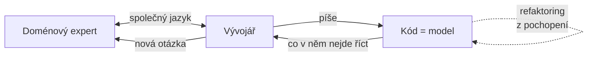

# DDD — Domain-Driven Design

> Eric Evans · **2003** · *Domain-Driven Design: Tackling Complexity in the Heart of Software*

> **V jedné větě:** Způsob, jak stavět složitý software tak, aby model v hlavách lidí, kteří doméně rozumějí, a model v kódu byly **jedna a tatáž věc** — a aby se po roce nerozešly.

---

## Co DDD je

Evans sám ho po deseti letech shrnul do tří bodů:

> „Domain-Driven Design is an approach to the development of complex software in which we:
> 1. **Focus on the core domain.**
> 2. **Explore models in a creative collaboration** of domain practitioners and software practitioners.
> 3. **Speak a ubiquitous language** within an explicitly bounded context."
>
> — Eric Evans, *Domain-Driven Design Reference*, 2015

Přečti si to ještě jednou a všimni si, co v tom shrnutí **není**: ani jeden stavební blok. Žádná entita, žádné repository, žádná složka. Je tam pojmenování toho, na čem firmě záleží, rozhovor s lidmi, kteří doméně rozumějí, a společný jazyk.

Ty stavební bloky v knize samozřejmě jsou a v tomhle katalogu je dokumentujeme — ale jsou **důsledek**, ne definice.

---

## Nejčastější omyl

Zdaleka nejběžnější podoba „děláme DDD" vypadá takhle:

```
src/
    Entity/
        Order.php          ← 15 getterů, 15 setterů, žádné chování
    Repository/
        OrderRepository.php
    Service/
        OrderService.php   ← všechna pravidla jsou tady
```

```php
// A pravidla žijí mimo model
if ($order->getStatus() === 'new' && $order->getTotal() > 100000) {
    $order->setDiscount(10);
    $order->setStatus('discounted');
}
```

**Je tam všechno kromě DDD.** Model nic neumí, pravidla jsou ve službě, jazyk kódu (`setStatus('discounted')`) neodpovídá ničemu, co by obchodník řekl nahlas. Složky jsou pojmenované podle vzorů z knihy a přesně to je ta past: **vzory jsou v názvech složek, ne v kódu.**

Fowler pro ten stav má jméno — [anemický doménový model](https://martinfowler.com/bliki/AnemicDomainModel.html) — a píše o něm, že je to *antipattern*, protože nese všechny náklady doménového modelu a žádný z jeho přínosů.

**Poznáš to podle:**

- entita má jen gettery a settery a všechno rozhodování je ve službě
- ve firmě se říká „stornovaná objednávka", v kódu je `setStatus(4)`
- na otázku „co se stane, když zákazník zruší po odeslání" musíš otevřít tři soubory a stejně nevíš
- nikdo z týmu nemluvil s člověkem, který tu doménu dělá, déle než na předávce zadání
- model se nezměnil rok, ale zadání ano

---

## Jak model vzniká

Tohle je ta část, která se přeskakuje nejčastěji, protože se nedá napsat v editoru.

### Společné zkoumání, ne převzetí zadání

Evans tomu říká **knowledge crunching**: model nevzniká tím, že analytik odevzdá dokument a vývojář ho přepíše do tříd. Vzniká v rozhovoru, ve kterém obě strany něco zjistí — a obvykle několikrát po sobě, protože první verze bývá špatně.

Druhý bod jeho shrnutí to říká přímo: *„explore models in a **creative collaboration** of domain practitioners and software practitioners."*

### Kdo modeluje, ten píše kód

Evans na to má vlastní vzor, **Hands-on Modelers**:

> „Any technical person contributing to the model **must spend some time touching the code**, whatever primary role he or she plays on the project. Anyone responsible for changing code must learn to express a model through the code. **Every developer must be involved in some level of discussion about the model and have contact with domain experts.**"

Důvod je praktický, ne ideologický. Když modelář nepíše kód, ztratí cit pro to, co je v implementaci drahé, a model bude nepoužitelný. Když vývojář model nezná, jeho refaktoring model **oslabí místo posílí** — protože nepozná, kdy mění jen kód a kdy mění význam.

### Model je kód, kód je model

**Model-Driven Design** je Evansovo jméno pro pravidlo, které z předchozího plyne:

> „The code becomes an expression of the model, so **a change to the code may be a change to the model.**"

Prakticky to znamená, že neexistuje „model" v dokumentaci a „implementace" v kódu. Je jeden model a je v kódu. Diagram na tabuli je jeho zjednodušený obrázek, ne zdroj pravdy.

### Model se prohlubuje refaktoringem

Poslední díl a ten, který se v praxi přeskakuje úplně. Evans mu věnuje celou třetí část knihy — **Refactoring Toward Deeper Insight**:

> „Traditionally, refactoring is described in terms of code transformations with technical motivations. Refactoring can also be **motivated by an insight into the domain** and a corresponding refinement of the model. Sophisticated domain models **seldom turn out useful except when developed through an iterative process of refactoring**."

Tohle je přímý most do naší sekce [Refaktoring](../../Refactoring/): zatímco Fowlerova workflow popisují refaktoring z technických důvodů, Evans přidává čtvrtý — *pochopil jsem doménu líp.* Nejblíž je mu [comprehension refactoring](../../Refactoring/ComprehensionRefactoring/), jen s obráceným směrem: tam se z kódu učíš, tady do kódu zapisuješ, co ses naučil jinde.



Ta smyčka je celé DDD. Vzory jsou slovník, kterým se v ní mluví.

---

## Taktické a strategické

Kniha má dvě poloviny a v praxi se čte jen ta první.

| | Taktický návrh | Strategický návrh |
| --- | --- | --- |
| O čem je | jak vypadá kód **uvnitř** jednoho modelu | jak spolu **velké modely** souvisejí |
| Typické vzory | Entity, Value Object, Aggregate, Factory | Bounded Context, Context Map, Anticorruption Layer |
| Kdy tě začne pálit | hned | až když jsou týmy dva a systémy tři |
| Co se stane, když ho vynecháš | anemický model | dva týmy si pod „objednávkou" představují jiné věci a nikdo neví proč |

**Evans sám dal strategii dopředu, když měl možnost to přerovnat.** Kniha z roku 2003 začíná stavebními bloky a strategický návrh nechává na čtvrtou část; *DDD Reference* z roku 2015 začíná částí **I. Putting the Model to Work**, a její první dva vzory jsou **Bounded Context** a **Ubiquitous Language**. Stavební bloky jsou až ve druhé části.

To pořadí je dobrá rada i pro čtení tohohle katalogu.

---

## Kudy tím katalogem projít

Ne abecedně a ne od `Value Object`. Takhle:

1. [**Ubiquitous Language**](UbiquitousLanguage/) — bez společného jazyka je zbytek kosmetika
2. [**Bounded Context**](BoundedContext/) — kde ten jazyk platí a kde už ne
3. [**Core Domain**](CoreDomain/) — na čem záleží, a kam tedy dávat energii
4. [**Entity**](Entity/) a [**Value Object**](ValueObject/) — teprve teď stavební bloky
5. [**Aggregate**](Aggregate/) — hranice konzistence; nejdražší rozhodnutí z taktických
6. [**Context Map**](ContextMap/) a [**Anticorruption Layer**](AnticorruptionLayer/) — až přijde druhý systém

Kdo začne u čtvrtého bodu, dostane přesně ty složky `Entity/`, `Repository/`, `Service/` z omylu výš.

---

## Kdy DDD nedělat

DDD má cenu tam, kde je **složitá doména**. Nemá ji všude jinde — a Evans to nikdy netvrdil.

- ❌ **CRUD nad formulářem.** Když aplikace jen ukládá a čte, model nemá co modelovat. Active Record a rychlý framework jsou správná odpověď.
- ❌ **Nemáš přístup k doménovému expertovi.** Druhý bod Evansova shrnutí je *spolupráce*. Bez druhé strany nevzniká model, jen dohady v třídách.
- ❌ **Doména je technická, ne byznysová.** U převodu formátů nebo image proxy není co destilovat.
- ❌ **Projekt na tři měsíce, který se pak zahodí.** Investice do modelu se vrací v čase.
- ❌ **Tým to nechce.** DDD je způsob práce, ne knihovna. Zavést se dá jen se souhlasem lidí, kteří tím jazykem mají mluvit.

> [!IMPORTANT]
> **Jednotlivé vzory z tohohle katalogu se používají i tam, kde se DDD jako metodika nedělá** — [Value Object](ValueObject/), [Specification](Specification/) nebo [Factory](Factory/) dávají smysl samy o sobě. To je legitimní a nemusí se to nazývat DDD.

---

## Původ a co z knihy zlidovělo

Kniha vyšla v roce 2003 a Evans v ní nepsal katalog vzorů — psal o tom, jak se doménová znalost dostane do kódu a jak tam **zůstane**. Sada stavebních bloků se ale ujala samostatně a dnes se používá i tam, kde se DDD jako způsob práce nedělá.

**Vaughn Vernon** ji v *Implementing Domain-Driven Design* (2013) rozpracoval do implementační podoby; kde se s Evansem liší, uvádíme to u konkrétního vzoru.

Sám Evans vydal v roce 2015 *Domain-Driven Design Reference* — stostránkové shrnutí definic a vzorů, které je **volně ke stažení** a je z něj většina citací v tomhle dokumentu.

---

## Členění

Evans dělí knihu na **taktický** návrh (jak vypadá kód uvnitř jednoho modelu) a **strategický** (jak spolu velké modely souvisejí). Ve složkách to nekopírujeme, odlišujeme to jen tady v katalogu.

U strategických vzorů se ukázalo, že demo smysl má — jen jiné: [Bounded Context](BoundedContext/) ukazuje tentýž pojem ve třech modelech a překlad mezi nimi, [Context Map](ContextMap/) drží mapu jako data, ze kterých vygeneruje diagram a upozorní na rizikové vztahy.

### Taktické stavební bloky

| Pattern | K čemu | Obtížnost | Stav |
| ------- | ------ | --------- | ---- |
| [**Value Object**](ValueObject/) | Hodnota bez identity — vlastní typ místo `string` a `int` | ●●○○○ | ✅ |
| [**Entity**](Entity/) | Objekt s identitou, která přežije změnu všech atributů | ●●○○○ | ✅ |
| [**Aggregate**](Aggregate/) | Skupina objektů se společným kořenem a hranicí konzistence | ●●●●○ | ✅ |
| [Repository](../PoEAA/Repository/) | Kolekce agregátů, za kterou se schová persistence. Evans ho popsal rok po Fowlerovi, proto ho vedeme v [PoEAA](../PoEAA/) — rozdíl obou pojetí je rozebraný tam. | ●●●○○ | ✅ |
| [**Domain Event**](DomainEvent/) | Fakt, který se v doméně stal a jiné části na něj reagují | ●●●●○ | ✅ |
| [**Factory**](Factory/) | Vytvoření celého agregátu najednou, s vynucenými invarianty | ●●○○○ | ✅ |
| [Application Service](../PoEAA/ServiceLayer/) | Orchestrace jedné operace aplikace. Evans ji popsal rok po Fowlerově *Service Layer*, proto ji vedeme v [PoEAA](../PoEAA/) — rozdíl proti **domain service** je rozebraný tam. | ●●○○○ | ✅ |
| [**Domain Service**](DomainService/) | Doménová operace, která nepatří žádné entitě | ●●○○○ | ✅ |
| [**Specification**](Specification/) | Doménové pravidlo vytažené do samostatného objektu | ●●●○○ | ✅ |

### Strategický návrh

| Pattern | K čemu | Obtížnost | Stav |
| ------- | ------ | --------- | ---- |
| [**Bounded Context**](BoundedContext/) | Hranice, uvnitř které mají pojmy jediný význam | ●●●●○ | ✅ |
| [**Context Map**](ContextMap/) | Vztahy mezi kontexty — kdo se komu přizpůsobuje | ●●●○○ | ✅ |
| [**Anticorruption Layer**](AnticorruptionLayer/) | Překladová vrstva chránící model před cizím | ●●●○○ | ✅ |
| [**Ubiquitous Language**](UbiquitousLanguage/) | Jeden jazyk pro doménu i kód — základ, na kterém stojí zbytek DDD | ●●●○○ | ✅ |

### Destilace

Kapitola 15 knihy — jak z modelu vydestilovat to, co je na něm cenné, a zbavit to všeho ostatního. **Pořadí v tabulce je Evansovo a je záměrné:** první vzory jsou levné (rozhodnutí, stránka textu, značky), poslední jsou zásahy do celého modelu. Sahej po nich v tomhle pořadí — a jen dokud to předchozí nestačí.

| Pattern | K čemu | Obtížnost | Stav |
| ------- | ------ | --------- | ---- |
| [**Core Domain**](CoreDomain/) | Pojmenování toho, čím se produkt liší — a kam tedy patří nejlepší lidé | ●●○○○ | ✅ |
| [**Generic Subdomains**](GenericSubdomains/) | Vytěsnění obecných částí; nejdřív zvaž, jestli to nejde koupit | ●●○○○ | ✅ |
| [**Domain Vision Statement**](DomainVisionStatement/) | Jedna stránka o tom, co je jádro a jakou hodnotu přináší | ●○○○○ | ✅ |
| [**Highlighted Core**](HighlightedCore/) | Označení prvků jádra přímo v modelu, ať je to poznat na první pohled | ●●○○○ | ✅ |
| [**Cohesive Mechanism**](CohesiveMechanism/) | Složitý výpočet do vlastního rámce — doména říká „co“, mechanismus řeší „jak“ | ●●●○○ | ✅ |
| [**Segregated Core**](SegregatedCore/) | Strukturální oddělení jádra od podpůrných částí | ●●●●○ | ✅ |
| [**Abstract Core**](AbstractCore/) | Abstrakce vyjadřující interakci mezi moduly, ve vlastním modulu | ●●●●○ | ✅ |

<sub>⬜ plánováno · 🚧 rozpracováno · ✅ hotovo</sub>

### Co tu zatím není

Katalog pokrývá stavební bloky, strategický návrh a destilaci. **Tři části knihy zůstávají nepokryté** a stojí za to o nich vědět:

| Část | Co obsahuje | Proč tu chybí |
| ---- | ----------- | ------------- |
| **Putting the Model to Work** | Continuous Integration, Model-Driven Design, Hands-on Modelers, Refactoring Toward Deeper Insight | Jsou to **způsoby práce, ne třídy** — shrnuté jsou [výš](#jak-model-vzniká) |
| **Supple Design** | Intention-Revealing Interfaces, Side-Effect-Free Functions, Assertions, Closure of Operations | Vlastnosti dobrého kódu, blízké našim [principům](../Principles/) |
| **Large-scale Structure** | Evolving Order, Responsibility Layers, Knowledge Level | Sahá se po nich zřídka a až u velkých systémů |

Druhý řádek je nejužitečnější dluh: *Side-Effect-Free Functions* je [CQS](../Principles/ObjectDesign.md#cqs--command-query-separation) a *Intention-Revealing Interfaces* je to, o čem je [Decompose Conditional](../../Refactoring/Code/DecomposeConditional/). Ty pojmy v repozitáři jsou, jen pod jinými jmény.

## Zdroje

- Eric Evans: *Domain-Driven Design: Tackling Complexity in the Heart of Software*, Addison-Wesley, 2003
- Eric Evans: [*Domain-Driven Design Reference*](https://www.domainlanguage.com/wp-content/uploads/2016/05/DDD_Reference_2015-03.pdf), 2015 — definice a shrnutí vzorů, volně ke stažení (CC BY 4.0)
- Vaughn Vernon: *Implementing Domain-Driven Design*, Addison-Wesley, 2013
- Martin Fowler: [*Anemic Domain Model*](https://martinfowler.com/bliki/AnemicDomainModel.html) — nejčastější podoba „děláme DDD"
