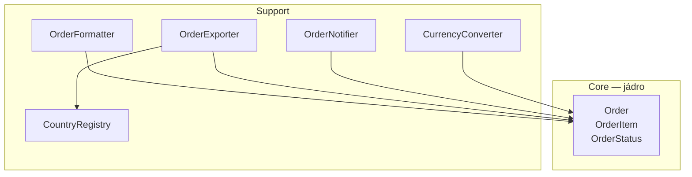

# Segregated Core (Oddělené jádro)

> [← zpět na DDD](../)

> **V jedné větě:** Vytáhni z modelu to, kvůli čemu aplikace existuje, do vlastního balíčku — a všechno podpůrné nech venku, i za cenu rozdělení tříd, které spolu dosud těsně držely.

---

## Problém

Doménová třída začne jako čisté pravidlo. Pak k ní přibude formátování pro šablonu, převod měny pro report, odeslání e-mailu, export do CSV. Každý přírůstek je sám o sobě rozumný — a po roce se v třídě `Order` nedá najít, kdy se objednávka smí zrušit.

Evans:

> „Elements in the model may partially serve the core domain and partially play supporting roles. Core elements may be tightly coupled to generic ones. The conceptual cohesion of the core may not be strong or visible. **All this clutter and entanglement chokes the core.** Designers can't clearly see the most important relationships, leading to a weak design."

**Poznáš to podle:**

- konstruktor doménové třídy si žádá **mailer, převodník měn a číselník**
- test jednoho pravidla potřebuje **sestavit tři spolupracovníky**
- ve třídě jsou vedle sebe `canBeCancelled()` a `toCsvRow()`
- změna formátu exportu znamená **sáhnout do doménové třídy**
- nový člověk se ptá, **která část té třídy je ta důležitá**
- zrušení objednávky v testu **odešle e-mail**

```php
// Před: jádro udušené podpůrnými hráči
final class Order
{
    public function __construct(
        public readonly string $number,
        private readonly string $customerEmail,
        private readonly string $countryCode,
        private readonly CurrencyConverter $converter,
        private readonly Mailer $mailer,
        private readonly CountryRegistry $countries,
    ) {}

    public function canBeCancelled(): bool { /* … */ }   // ← jádro
    public function cancel(): void { /* … */ }           // ← jádro
    public function formatTotal(): string { /* … */ }
    public function totalInEur(): float { /* … */ }
    public function toCsvRow(): string { /* … */ }
    public function countryName(): string { /* … */ }
    public function isEuCountry(): bool { /* … */ }
    public function vatRate(): float { /* … */ }
}
```

Demo to měří:

```
                          závislostí na jiných třídách
Before\Order              3
    Before\CurrencyConverter
    Before\Mailer
    Before\CountryRegistry

metod ve třídě:        Before 13
konstruktor:           6 parametrů
```

**Šest parametrů, aby vůbec vznikla objednávka.** Z třinácti metod je jádrem šest.

---

## Řešení

> „Therefore: **Refactor the model to separate the core concepts from supporting players** (including ill-defined ones) **and strengthen the cohesion of the core while reducing its coupling to other code.** Factor all generic or supporting elements into other objects and place them into other packages, **even if this means refactoring the model in ways that separate highly coupled elements.**"

Poslední část věty je to podstatné a nejmíň příjemné: **rozdělit se má i to, co spolu dnes těsně drží.** Právě ta těsná vazba je totiž důvod, proč jádro nejde vidět.



**Všechny šipky vedou dovnitř.** Jádro nemá ven ani jednu.

```php
namespace After\Core;

final class Order
{
    public function __construct(public readonly string $number)
    {
    }

    public function canBeCancelled(): bool { /* … */ }
    public function cancel(): void { /* … */ }
    public function confirm(): void { /* … */ }
    public function totalInCents(): int { /* … */ }
}
```

```
                          závislostí na jiných třídách
After\Core\Order          0   ← jádro nezná nikoho

metod ve třídě:        Before 13  ·  After 7
řádků kódu:            Before 123 ·  After 69
konstruktor:           Before 6 parametrů  ·  After 1 parametr
```

### Směr závislostí je celý vzor

Demo počítá zmínky mezi balíčky:

```
Core → Support            0
Support → Core            5
```

**Support ví o jádru, jádro o Supportu ne.** To je přesně ta část definice o *„reducing its coupling to other code"* — a je to jediné pravidlo, které se musí hlídat. Jakmile se v jádru objeví `use App\Support\…`, vzor přestal platit.

Praktický důsledek se ukáže v testu:

```php
$order = new Order('2026/002');
$order->addItem(new OrderItem('MON-27', 799000, 1));
$order->cancel();
```

```
stav:                  zrušená
odeslané e-maily:      0   ← žádný mailer se nesestavoval
```

Před oddělením by tenhle test potřeboval mailer, převodník měn i číselník zemí — a při zrušení by **odeslal e-mail**.

### Kam se poděly ty odstraněné metody

Nikam nezmizely; přesunuly se tam, kam patří:

| Bylo v `Order` | Je v | Proč |
| -------------- | ---- | ---- |
| `formatTotal()`, `formatSummary()` | `OrderFormatter` | Formátování je prezentace, ne pravidlo |
| `toCsvRow()` | `OrderExporter` | Export je jeden z mnoha pohledů na tatáž data |
| `totalInEur()` | `CurrencyConverter` | Převod měn je obecná věc, ne vlastnost objednávky |
| `countryName()`, `isEuCountry()` | `CountryRegistry` | Číselník; s objednávkou nesouvisí |
| odeslání e-mailu z `cancel()` | `OrderNotifier` | Co se stane okolo, orchestruje vrstva nad jádrem |

Poslední řádek je nejdůležitější a nejvíc bolí. Když `cancel()` sám posílal e-mail, nešlo objednávku zrušit bez odeslání — **v testu, v migraci ani při hromadné operaci.** Přesunutí té odpovědnosti ven je hlavní přínos celého refaktoringu.

---

## Účastníci

| Role | V příkladu | Odpovědnost |
| ---- | ---------- | ----------- |
| **Jádro** | `Core\Order`, `OrderItem`, `OrderStatus` | Pravidla, kvůli kterým aplikace existuje. Nezná nic vně. |
| **Podpůrné prvky** | `OrderFormatter`, `OrderExporter`, `OrderNotifier` | Znají jádro, jádro je nezná |
| **Obecné části** | `CountryRegistry`, `CurrencyConverter` | Nejsou specifické pro tvou doménu — Evansovy *Generic Subdomains* |
| **Hranice** | jmenný prostor / balíček | Místo, kde se dá porušení pravidla poznat |

Poslední řádek je ten, který dělá vzor vzorem. **Bez viditelné hranice je to jen dobré rozdělení tříd**, které se za půl roku rozpustí; s hranicí je porušení vidět v `use` a dá se hlídat nástrojem.

---

## Implementace v PHP

### Hranice se hlídá nástrojem, ne dohodou

Jmenný prostor sám o sobě nic nevynutí. Pravidlo „jádro nesmí znát Support" ohlídá statická analýza:

```yaml
# deptrac.yaml
layers:
  - name: Core
    collectors:
      - type: directory
        value: src/Order/Core/.*
  - name: Support
    collectors:
      - type: directory
        value: src/Order/Support/.*

ruleset:
  Core: ~          # jádro nesmí ven
  Support:
    - Core         # support smí dovnitř
```

Bez tohohle je vzor jen dobrý úmysl. Doba, za kterou se hranice bez kontroly rozpustí, se počítá na měsíce.

### Rozdělení bolí — a to je ta cena

Evans píše, že se má rozdělit i to, co spolu těsně drží, a v praxi to znamená nepříjemné kroky:

```php
// Bylo pohodlné:
$order->cancel();                              // …a e-mail se odešle sám

// Je poctivé:
$order->cancel();
$notifier->notifyCancelled($order, $email);    // …volající to musí vědět
```

**Druhá varianta je delší a někdo na ni zapomene.** Za to dostaneš možnost objednávku zrušit bez vedlejších efektů — což je přesně to, co chceš v testu, v dávce a při opravě dat.

Kdo chce obojí, sáhne po [doménových událostech](../DomainEvent/): jádro oznámí, že se něco stalo, a reakce se zaregistrují vně. Je to elegantnější, ale nese si to vlastní [náklady](../DomainEvent/#kdy-nepoužít) — proto to není první krok.

### Kudy vede hranice

Nejtěžší část a nejde ji odvodit z kódu. Pomůcka, která funguje: **zeptej se, co by muselo zůstat, kdyby aplikace přišla o web, o e-maily a o exporty.**

| Otázka | Když ano, patří to do jádra |
| ------ | --------------------------- |
| Umí o tom mluvit doménový expert? | ✅ |
| Změní se to, když se změní byznys pravidlo? | ✅ |
| Je to specifické pro **náš** produkt? | ✅ |
| Změní se to, když vyměníme šablonovací systém? | ❌ |
| Dělalo by to totéž v úplně jiné firmě? | ❌ — je to *Generic Subdomain* |
| Je to o tom, jak se něco zobrazí nebo odešle? | ❌ |

---

## Kdy použít

- ✅ **Doménová třída zbytněla** a pravidla se v ní ztrácejí.
- ✅ **Test jednoho pravidla potřebuje půl aplikace.**
- ✅ Na projektu je **víc lidí** a je potřeba, aby bylo poznat, co je citlivá část.
- ✅ Chystá se **velká změna v jádru** a je potřeba vědět, čeho se dotkne.
- ✅ Projekt má **jasné jádro** — něco, čím se liší od konkurence.

## Kdy nepoužít

- ❌ **Model je malý a přehledný.** Dvě třídy nepotřebují hranici.
- ❌ **Aplikace je CRUD** a žádné výrazné jádro nemá — pak není co oddělovat a [Active Record](../../PoEAA/ActiveRecord/) je poctivější volba.
- ❌ **Nevíš, kudy hranice vede.** Špatně vedená je horší než žádná: vynutí si obcházení a lidé jí přestanou věřit.
- ❌ **Nemáš jak ji hlídat.** Bez statické analýzy se rozpustí.
- ❌ **Refaktoring by teď zablokoval tým.** Vzor je posloupnost kroků, ne jednorázová akce — dá se dělat postupně.

---

## Časté chyby

| Chyba | Proč vadí | Jak správně |
| ----- | --------- | ----------- |
| Jádro zná podpůrnou vrstvu | Vzor přestal platit; závislost obchází hranici | Šipky jen dovnitř; hlídat nástrojem |
| Hranice existuje jen v hlavách | Za pár měsíců je zpátky, kde bylo | Deptrac nebo PHPStan v CI |
| Rozdělení podle technické vrstvy | `Entity/`, `Service/`, `Repository/` neříká, co je jádro | Rozdělit podle **důležitosti**, ne podle typu třídy |
| Do jádra se dá všechno, „ať je to pohromadě" | Jádro má být malé; Evans píše „make the core small" | Do jádra jen to, čím se lišíš |
| Jádro zná framework | Vazba na verzi frameworku uvnitř nejcennější části | Jádro bez závislostí; adaptéry vně |
| Refaktoring naráz přes celý projekt | Zablokuje tým na týdny a nedá se dokončit | Po jedné oblasti; hranici zavádět postupně |
| Oddělení bez pojmenování jádra | Nikdo neví, co do něj patří, a hranice se hádá | Nejdřív *Core Domain*, pak hranice |
| Podpůrné třídy si na sebe navzájem sahají křížem | Vznikne druhá spleť, jen o patro vedle | I mezi podpůrnými částmi platí směr |

---

## V praxi

- **Doctrine entity bez anotací** — jádro, které nezná ORM; mapování [XML mapperem](../../PoEAA/DataMapper/) drží framework vně.
- **Deptrac** a **PHPStan** — nástroje, kterými se hranice v PHP hlídá v CI.
- **Modulární monolit** — každý modul má vlastní jádro a vlastní hranici; ta myšlenka je odsud.
- **Balíček `src/Domain` proti `src/Infrastructure`** — nejrozšířenější podoba téhle hranice v PHP projektech, byť často zavedená bez znalosti vzoru.
- **Rozdělení podle důležitosti, ne podle typu** — tohle je jediný rozdíl proti obvyklému `Entity/ Service/ Repository/` a je to celý přínos.

---

## Související patterny

| Pattern | Vztah |
| ------- | ----- |
| [Cohesive Mechanism](../CohesiveMechanism/) | **Sourozenec z téže kapitoly.** Ten vytahuje výpočty, tenhle podpůrné role. Evans je uvádí jeden po druhém a doporučuje v tomhle pořadí. |
| [Bounded Context](../BoundedContext/) | Jiná hranice a nezaměňovat: kontext odděluje **různé významy téhož pojmu**, oddělené jádro **důležité od podpůrného** uvnitř jednoho kontextu. |
| [Ports & Adapters](../../Architecture/PortsAndAdapters/) | Táž myšlenka na úrovni architektury — závislosti míří dovnitř. Segregated Core to dělá uvnitř modelu, hexagon vůči okolnímu světu. |
| [Domain Event](../DomainEvent/) | Způsob, jak jádru vrátit možnost oznámit, že se něco stalo, aniž by znalo příjemce. |
| [Aggregate](../Aggregate/) | Určuje hranici konzistence uvnitř jádra; oddělené jádro hranici kolem jádra jako celku. |
| [Domain Service](../DomainService/) | Doménová logika, která nepatří entitě — ale pořád patří do jádra. |
| [Anticorruption Layer](../AnticorruptionLayer/) | Chrání model před cizím modelem; oddělené jádro před vlastními podpůrnými částmi. |
| [Active Record](../../PoEAA/ActiveRecord/) | Protipól: tam se doména záměrně tvaruje podle tabulky a žádné oddělené jádro nevzniká. |

---

## Vztah k principům

| Princip | Jak souvisí |
| ------- | ----------- |
| [Vysoká soudržnost](../../Principles/CohesionAndCoupling.md#stupnice-soudržnosti) | Cíl vzoru doslova — „strengthen the cohesion of the core". |
| [Nízká provázanost](../../Principles/CohesionAndCoupling.md#stupnice-provázanosti) | Druhá půlka téže věty — „reducing its coupling to other code". |
| [SRP](../../Principles/SOLID.md#single-responsibility-principle-srp) | Formátování se mění kvůli UI, pravidla kvůli byznysu. Dva důvody, dvě místa. |
| [DIP](../../Principles/SOLID.md#dependency-inversion-principle-dip) | Směr závislostí — dovnitř, nikdy ven. |
| [Zviditelni implicitní](../../Principles/ObjectDesign.md#zviditelni-implicitní) | „Tohle je ta důležitá část" přestane být ústní tradicí a stane se strukturou. |

---

## Demo

```bash
php SoftwareDesign/DDD/SegregatedCore/demo/run.php
```

Táž objednávka jednou zamotaná s podpůrnými hráči a jednou s odděleným jádrem. Demo **spočítá reflexí závislosti** obou verzí (3 vs. 0), počet metod (13 vs. 7), délku kódu a počet parametrů konstruktoru (6 vs. 1). Pak **změří směr závislostí mezi balíčky** — `Core → Support` nula, `Support → Core` pět — ověří, že se chování nezměnilo, a nakonec ukáže test jádra, který proběhne bez sestavení jediného spolupracovníka **a neodešle e-mail**.

---

## Původ

|               |                                                   |
| ------------- | ------------------------------------------------- |
| **Zdroj**     | *Domain-Driven Design: Tackling Complexity in the Heart of Software* |
| **Autor**     | Eric Evans                                        |
| **Rok**       | 2003                                              |
| **Kategorie** | Strategický návrh — destilace (kapitola 15)       |
| **Obtížnost** | ●●●●○                                             |

Vzor je předposlední v kapitole **Distillation** a Evans se k němu dostává až po tom, co ostatní postupy nestačí:

> „Factoring out generic subdomains reduces clutter, and cohesive mechanisms serve to encapsulate complex operations. This leaves behind a more focused model […] **But you are unlikely ever to find good homes for everything in the domain model that is not core. The segregated core takes a direct approach to structurally marking off the core domain.**"

To pořadí stojí za respektování. **Nejdřív vytěsni obecné části a výpočty** ([Cohesive Mechanism](../CohesiveMechanism/)) — obojí jde udělat bez velkého zásahu. Teprve když v modelu pořád zůstává spleť, přijde na řadu strukturální řez, který je z celé kapitoly nejdražší.

Obtížnost je čtyřka, ačkoli výsledek vypadá jednoduše — dva balíčky a pravidlo o směru. Cena je jinde:

- **rozhodnutí, kudy hranice vede**, se nedá odvodit z kódu a špatná volba se platí dlouho
- **refaktoring běží na živém projektu** vedle ostatní práce
- Evans výslovně žádá rozdělit i to, co spolu těsně drží — a to znamená **odebrat pohodlí**, na které je tým zvyklý
- bez **automatické kontroly hranice** se výsledek za pár měsíců rozpustí

Za povšimnutí stojí, že dnešní běžné dělení `src/Domain` a `src/Infrastructure` je v podstatě tenhle vzor — jen se u něj málokdy zmiňuje odkud pochází a **často se vede podle typu tříd místo podle důležitosti**, čímž se hlavní přínos ztratí.

---

## Zdroje

- Eric Evans: *Domain-Driven Design*, Addison-Wesley, 2003 — kapitola 15, *Distillation*
- Eric Evans: [*Domain-Driven Design Reference*](https://www.domainlanguage.com/wp-content/uploads/2016/05/DDD_Reference_2015-03.pdf) (PDF, 2015) — souhrn definic, pod licencí CC BY 4.0
- [Deptrac](https://github.com/deptrac/deptrac) — nástroj na hlídání hranic mezi vrstvami v PHP

---

<details>
<summary>Metadata patternu</summary>

```yaml
name: Segregated Core
name_cs: Oddělené jádro
category: Strategický návrh — destilace
source: DDD – Domain-Driven Design
authors: Eric Evans
year: 2003
difficulty: 4
tags: [destilace, jádro, hranice, závislosti, refaktoring]
principles: [CohesionAndCoupling, SRP, DIP, MakeImplicitExplicit]
related: [CohesiveMechanism, BoundedContext, PortsAndAdapters, DomainEvent, Aggregate, DomainService, AnticorruptionLayer, ActiveRecord]
status: done
```

</details>
